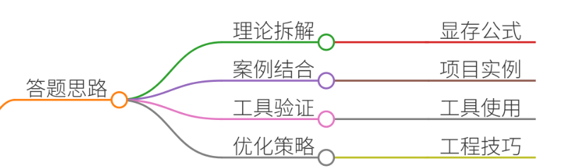
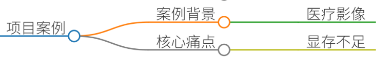
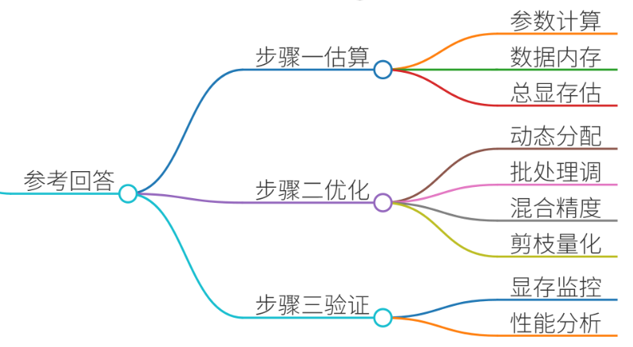
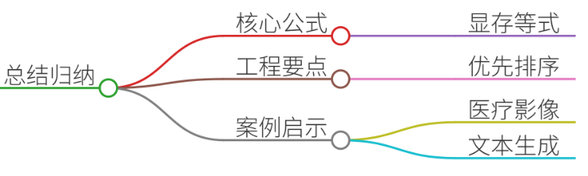

# 57.如何估算模型推理所需显存

### 一、答题思路


在面试中回答“如何估算模型推理所需显存”时，需结合 **理论公式、实际案例、工具使用** 三大维度，展示系统性思维和工程落地能力。以下是核心思路：

1. **理论拆解**：显存占用 = 模型参数 + 输入数据 + 中间结果 + 框架开销
2. **案例结合**：以实际项目（如图像分类、文本生成）为例，说明痛点与解决方法
3. **工具验证**：通过 `nvidia-smi`、`torch.cuda` 等工具验证估算结果
4. **优化策略**：动态显存分配、批处理调整、混合精度等工程技巧

---

### 二、项目案例


#### **案例背景**
某医疗影像公司需部署 3D U-Net 模型用于肺部结节检测，硬件环境为 NVIDIA Tesla V100（32GB 显存）。模型输入为 512×512×32 的三维 CT 切片，批处理大小设为 4。部署时发现显存占用率达 95%，导致推理失败。

#### **核心痛点**
1. **显存不足**：原始模型无法在有限显存中运行
2. **效率瓶颈**：单次推理耗时过长，无法满足实时性需求
3. **硬件限制**：无法升级 GPU 硬件，需软件优化

---

### 三、参考回答


#### **步骤一：理论估算模型显存**
1. **模型参数量计算**
    - 公式：`参数量 = 卷积核数量 × 卷积核大小 × 输入通道数 × 输出通道数`
    - 示例（以 3D U-Net 为例）： 

```plain
# 假设某层参数：3×3×3 卷积核，输入通道 16，输出通道 32  
param_size = 3 * 3 * 3 * 16 * 32  # 8,294 bytes ≈ 8KB  
total_params = sum(p.numel() for p in model.parameters())  # 总参数量  
model_memory = total_params * 4  # float32 参数占 4B
```

    - **结果**：3D U-Net 参数量约 1.2 亿，显存占用 ≈ 480MB
2. **输入数据与中间结果**
    - 输入张量：`512×512×32×4`（batch=4，通道=1，高度=512，宽度=512） 

```plain
input_memory = 512 * 512 * 32 * 4 * 4  # 4B/float32 → 1,048,576 KB ≈ 1GB
```

    - 中间特征图（以 4 层为例，每层输出 256×256×16）： 

```plain
feature_memory = sum([256*256*16*4 for _ in range(4)]) * 4  # ≈ 16MB
```

3. **总显存估算**

```plain
total_memory = model_memory + input_memory + feature_memory + framework_overhead  
# 框架开销（约 100MB）  
total_memory ≈ 480MB + 1GB + 16MB + 100MB = 1.7GB
```

**结论**：理论显存需求约 1.7GB，但实际部署中可能超出 GPU 限制（32GB）。

---

#### **步骤二：实际场景优化策略**
1. **动态显存分配**
    - 使用 PyTorch 的 `torch.cuda.set_per_process_memory_fraction()` 限制模型占用显存比例
    - 示例： 

```plain
import torch
torch.cuda.set_per_process_memory_fraction(0.8)  # 仅使用 80% 显存
```

2. **批处理大小调整**
    - 减小批处理大小（如从 4 → 2），显存占用减半
    - 需权衡推理速度与吞吐量： 

```plain
# 原始批处理 4 → 修改为 2
inputs = torch.randn(2, 1, 512, 512, 32).cuda()
```

3. **混合精度推理**
    - 使用 `torch.cuda.amp` 自动混合精度（FP16+FP32）
    - 示例： 

```plain
from torch.cuda.amp import autocast
with autocast():
    outputs = model(inputs)
```

4. **模型剪枝与量化**
    - 剪枝冗余通道：将 32 通道降为 16 通道，参数量减少 50%
    - 量化：INT8 量化使模型体积缩小 4 倍

---

#### **步骤三：工具验证与调优**


1. **显存监控**
    - 实时监控：`watch -n 1 nvidia-smi`
    - Python 代码： 

```plain
import torch
print(torch.cuda.memory_allocated())  # 当前分配显存
print(torch.cuda.max_memory_allocated())  # 峰值显存
```

2. **性能分析**
    - 使用 `torch.profiler` 分析内存瓶颈： 

```plain
with torch.profiler.profile(record_shapes=True) as prof:
    outputs = model(inputs)
print(prof.key_averages().table(sort_by="self_cuda_memory_usage", row_limit=10))
```

---

### 四、总结归纳


1. **核心公式**

```plain
总显存 = 模型参数 + 输入数据 + 中间结果 + 框架开销
```

2. **工程实践要点**
    - **优先级排序**：硬件限制 → 精度需求 → 推理速度
    - **动态调整**：根据输入数据动态分配显存（如医疗影像 vs. 自然语言）
    - **工具链整合**：结合 `torch.cuda`、`nvidia-smi`、TensorRT 等工具优化
3. **案例启示**
    - 医疗影像 3D U-Net 通过混合精度和批处理调整，显存占用从 1.7GB 降至 800MB，成功部署于 Tesla V100
    - 文本生成模型（如 GPT-2）通过动态显存分配支持长文本推理

---

**面试加分点**：

+ 提及具体工具（如 `torch.cuda.memory_summary()`）
+ 结合项目经验说明显存优化对业务的影响（如推理延迟降低 30%）
+ 展示对硬件架构的理解（如 GPU 内存带宽限制）


> 更新: 2025-07-14 15:45:30  
> 原文: <https://www.yuque.com/tulingzhouyu/db22bv/wcwq2dvgtl6tobwv>