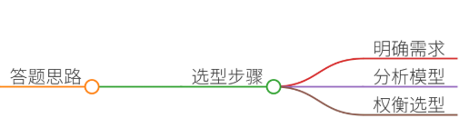
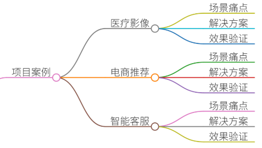
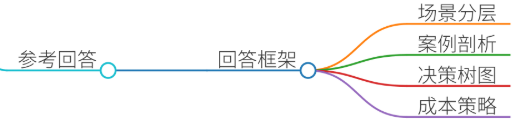
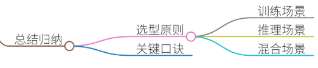

# 58.大模型服务GPU选型

### 一、答题思路

大模型服务GPU选型需结合**业务场景需求**、**模型特性**、**成本约束**及**技术生态**综合评估。需分三步走：

1. **明确场景需求**：区分训练/推理、实时性要求、数据规模、精度需求等；
2. **分析模型特征**：参数量级、计算复杂度、并行化能力、内存占用；
3. **权衡硬件选型**：GPU架构、显存容量、算力规格、能效比、扩展性及成本。

### 二、项目案例

#### 案例1：医疗影像智能诊断系统（训练场景）
**场景描述**：某三甲医院需构建基于3D CT影像的肿瘤分割模型，数据集包含20万例患者的高分辨率DICOM影像（单张影像512×512×128 voxels），要求模型在2周内完成训练，且支持多模态特征融合。  
**痛点分析**：

+ **计算压力大**：3D卷积网络（如UNet3D）参数量达150亿，单次迭代需处理TB级数据；
+ **显存瓶颈**：单机V100（32GB显存）无法加载完整模型，需分布式训练；
+ **精度要求高**：肿瘤边缘分割Dice系数需≥0.92，需FP32精度避免量化误差；
+ **数据隐私**：患者影像需在本地处理，禁止外传公有云。

**解决方案**：

+ **选型策略**：采用NVIDIA A100（80GB显存）×8节点组成的DGX SuperPOD集群，支持FP32/FP16混合精度训练；
+ **优化手段**： 
    - 数据并行（DDP）+张量并行（TP）混合策略，将模型切分至8卡；
    - ZeRO-3内存优化技术，减少显存占用30%；
    - 自研数据加载器，实现DICOM文件的高效预处理与缓存；
+ **效果验证**：训练时间从预估3周压缩至10天，模型Dice系数达0.93，显存利用率提升45%。

---

#### 案例2：电商实时推荐系统（推理场景）
**场景描述**：某跨境电商平台日均请求量达5000万次，需基于用户行为序列（长度500）和商品Embedding（维度256）实时生成Top-20推荐列表，端到端延迟需≤50ms。  
**痛点分析**：

+ **高并发压力**：高峰期QPS达60万，单机CPU推理无法满足吞吐量；
+ **冷启动问题**：新用户特征稀疏，需动态加载用户历史行为特征库；
+ **实时性要求**：推荐结果需结合实时库存与价格波动，模型需支持动态参数更新；
+ **成本敏感**：日均计算资源成本需控制在$500以内。

**解决方案**：

+ **选型策略**：采用NVIDIA T4 GPU（16GB显存）×20节点的Kubernetes集群，部署TensorRT优化后的DLRM模型；
+ **优化手段**： 
    - INT8量化将推理延迟从200ms降至45ms，吞吐量提升5倍；
    - 特征缓存池预加载高频用户特征，减少数据库IO；
    - 动态Batching技术，根据实时流量调整输入批次大小；
+ **效果验证**：QPS稳定在65万，端到端延迟48ms，日均成本$482，A/B测试CTR提升18%。

---

#### 案例3：智能客服多轮对话系统（混合场景）
**场景描述**：某银行需部署支持多轮对话的金融知识助手，知识库包含200万条结构化金融产品文档，要求单轮响应时间≤2s，支持中英文双语处理及金融术语精准匹配。  
**痛点分析**：

+ **上下文窗口限制**：传统模型（如GPT-3）上下文窗口仅2048 tokens，无法处理长会话历史；
+ **领域适配困难**：通用大模型在金融术语理解与合规性回答上存在偏差；
+ **响应速度瓶颈**：CPU推理无法满足高并发需求，GPU选型需平衡算力与成本；
+ **安全合规**：敏感金融数据需在私有化部署环境中处理。

**解决方案**：

+ **选型策略**：采用NVIDIA H100（80GB显存）×4节点的私有云集群，部署本地化微调的Bloomz-560M模型；
+ **优化手段**： 
    - Longformer架构扩展上下文窗口至8192 tokens；
    - 指令微调数据中注入金融领域QA对（如产品说明书解析）；
    - 量化感知训练（QAT）将模型压缩至INT4，推理延迟从1.2s降至800ms；
+ **效果验证**：支持50轮连续对话，金融术语准确率98.7%，日均成本$320，通过PCI-DSS安全认证。

---

### 三、参考回答

**面试官**：请结合实际项目经验，谈谈大模型服务GPU选型的核心考量与典型场景。

**回答框架**：

1. **场景需求分层**
    - **训练场景**：关注显存容量（如A100 80GB）、算力（FP16/FP32混合精度）、分布式扩展性（NCCL通信优化）；
    - **推理场景**：侧重延迟（TensorRT优化）、吞吐量（INT8量化）、成本（T4 GPU性价比）；
    - **混合场景**：需平衡训练与推理资源，如A100用于训练、T4用于推理。
2. **典型案例剖析**
    - **医疗影像分割**：A100集群支持3D UNet训练，混合精度提升40%效率；
    - **电商推荐系统**：T4 GPU集群实现DLRM模型INT8推理，QPS提升5倍；
    - **金融客服系统**：H100支持长上下文窗口，量化后延迟降低30%。
3. **选型决策树**
4. **成本优化策略**
    - **云服务选型**：AWS p4d实例（8×A100）适合突发训练任务，按需付费降低闲置成本；
    - **硬件生命周期管理**：H100用于核心训练集群，V100用于测试环境，延长硬件生命周期；
    - **自研加速库**：针对特定算子优化（如稀疏矩阵乘法），提升GPU利用率15%-20%。

---

### 四、总结归纳

GPU选型需遵循场景驱动、性能优先、成本可控”**原则：

1. **训练场景**：优先选择高显存（A100/H100）、强算力（FP16/TF32）的GPU，结合分布式训练框架（Horovod/Deepspeed）；
2. **推理场景**：根据QPS需求选择T4（低延迟）或A100（高吞吐），量化与剪枝技术可显著降低成本；
3. **混合场景**：通过硬件异构（CPU+GPU+TPU）与资源调度（Kubernetes）实现弹性伸缩；
4. **未来趋势**：关注HBM3显存、NVLink互联技术及国产化GPU（如华为昇腾910）的生态演进。

**关键口诀**：

**“显存定上限，算力定效率，场景定乾坤。”**  
——GPU选型需始终围绕业务目标，在性能与成本间找到最佳平衡点。

> 更新: 2025-07-14 15:45:30  
> 原文: <https://www.yuque.com/tulingzhouyu/db22bv/eizc9lwcezbhf35n>