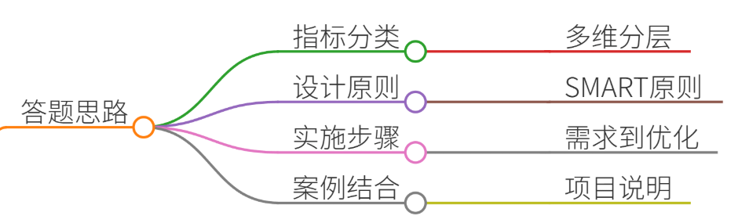
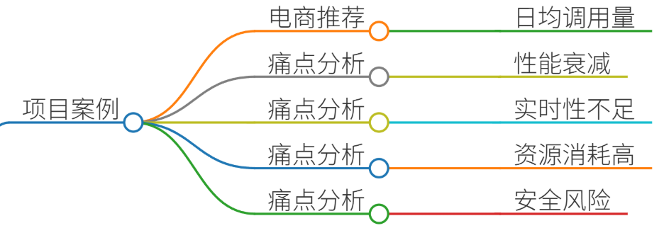
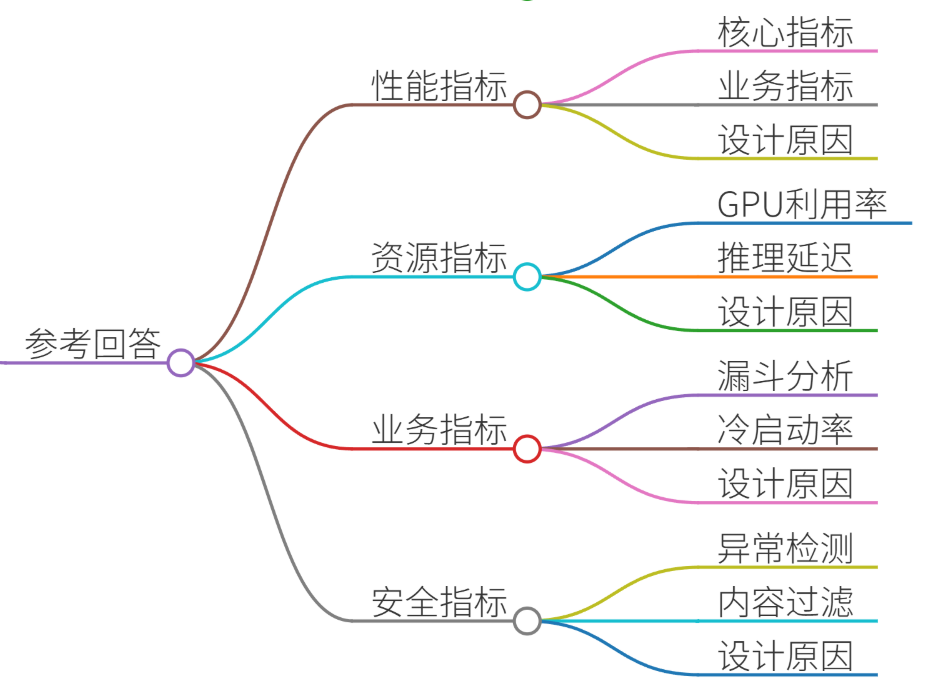
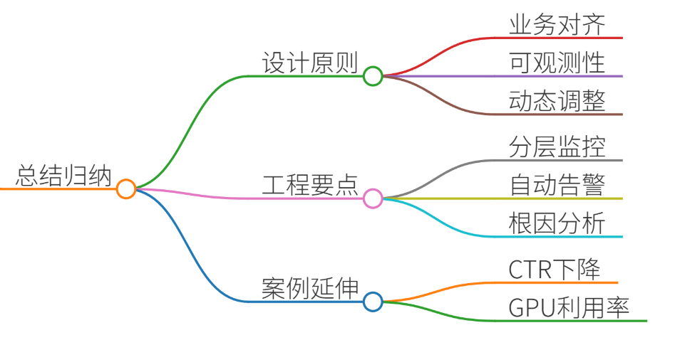

# 59.大模型监控指标设计

### 一、答题思路

在面试中回答“模型监控指标设计”问题时，需结合 **技术原理 + 实际场景 + 方法论**，展示系统性思维。以下是核心思路：

1. **指标分类**：从模型性能、业务效果、系统资源、安全合规等维度分层设计指标。
2. **设计原则**：SMART原则（Specific, Measurable, Achievable, Relevant, Time-bound）与可观测性原则。
3. **实施步骤**：需求分析 → 指标选取 → 阈值设定 → 可视化告警 → 迭代优化。
4. **案例结合**：通过真实项目说明指标如何解决实际问题，体现工程能力。

---

### 二、项目案例

#### **场景：电商推荐系统的实时模型监控**
**背景**：某电商平台日均GMV超10亿元，推荐系统日均调用量达百亿次。模型需实时优化商品排序，提升点击率和转化率。

**痛点**：

1. **模型性能衰减**：用户行为变化导致模型效果下降（如促销季冷启动失效）。
2. **实时性不足**：延迟导致推荐结果与用户实时兴趣不匹配。
3. **资源消耗过高**：GPU利用率波动大，成本浪费严重。
4. **安全风险**：恶意请求导致模型输出异常（如刷单攻击）。

---

### 三、参考回答

#### **1. 模型性能监控指标**
+ **核心指标**： 
    - **准确率（Accuracy）**：预测结果与真实值的匹配度（如CTR预估模型的AUC值）。
    - **召回率（Recall）**：推荐系统覆盖长尾商品的比例（衡量多样性）。
    - **F1-score**：平衡准确率与召回率的综合指标。
+ **业务指标**： 
    - **CTR（点击率）**：用户点击推荐商品的比率。
    - **CVR（转化率）**：点击后完成购买的比例。
    - **GMV提升率**：模型优化后GMV的环比变化。
+ **设计原因**： 
    - 准确率直接反映模型预测能力，CTR/CVR体现商业价值，GMV提升率是最终业务目标。
    - 通过A/B测试对比新旧模型指标，确保优化有效。

#### **2. 系统资源监控指标**
+ **GPU利用率**：监控模型推理时的GPU占用率（目标：80%-90%）。
+ **推理延迟**：单次请求处理时间（目标：<200ms）。
+ **QPS（每秒查询率）**：系统吞吐量（目标：5000+ QPS）。
+ **内存泄漏检测**：监控GPU显存占用趋势，避免OOM（Out Of Memory）问题。
+ **设计原因**： 
    - 高延迟会影响用户体验，低利用率导致资源浪费。
    - 通过Prometheus + Grafana设置阈值告警（如GPU利用率<70%触发预警）。

#### **3. 业务效果监控指标**
+ **用户行为漏斗分析**： 
    - 曝光量 → 点击量 → 加购量 → 成交量 → 复购率。
+ **冷启动覆盖率**：新用户/新商品的推荐覆盖率（目标：>95%）。
+ **多样性指标**：推荐商品类别分布的熵值（熵值越高，多样性越好）。
+ **设计原因**： 
    - 漏斗分析帮助定位转化瓶颈（如点击率高但转化率低可能因价格问题）。
    - 冷启动指标确保新用户快速获得有效推荐。

#### **4. 安全与合规监控指标**
+ **异常请求检测**： 
    - 短时间内同一IP的请求频率（防刷单攻击）。
    - 请求参数的异常分布（如商品ID超出正常范围）。
+ **敏感内容过滤**：推荐结果中违禁词的命中率（如色情、暴力词汇）。
+ **设计原因**： 
    - 保障系统安全，避免因恶意攻击导致服务崩溃或法律风险。

---

### 四、总结归纳

1. **指标设计原则**：
    - **业务目标对齐**：指标需直接关联业务KPI（如GMV、转化率）。
    - **可观测性优先**：覆盖模型输入（数据质量）、输出（预测结果）、系统（资源消耗）全链路。
    - **动态调整机制**：根据业务阶段（如促销期/日常）动态调整阈值。
2. **工程实践要点**：
    - **分层监控**：分为模型层、系统层、业务层，逐层下钻分析问题。
    - **自动化告警**：通过Prometheus + Grafana + Alertmanager实现多指标联动告警。
    - **根因分析**：结合日志（如TensorBoard）和Trace（如Jaeger）定位性能瓶颈。
3. **案例延伸**：
    - 若CTR下降，需检查数据新鲜度（是否未更新用户行为日志）、特征工程问题（如特征重要性漂移）。
    - 若GPU利用率低，需优化模型推理代码（如TensorRT加速）或调整批处理大小。

通过上述设计，可确保模型在性能、效率、安全三方面持续稳定，支撑业务增长。

> 更新: 2025-07-14 15:45:30  
> 原文: <https://www.yuque.com/tulingzhouyu/db22bv/plxame44uzef2zaa>