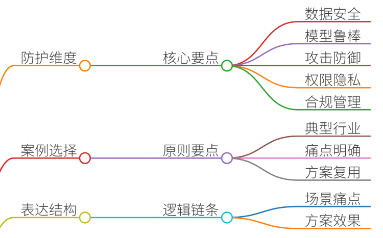
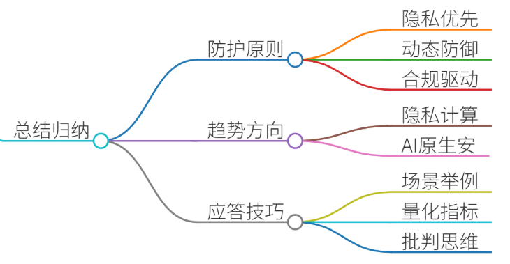

# 60.大模型安全防护方案

### 一、答题思路

大模型安全防护是当前AI领域的重要议题，面试中需结合技术原理、实际案例和解决方案展开。以下为系统性答题框架：

1. **安全防护核心维度**：数据安全、模型鲁棒性、对抗攻击防御、权限与隐私保护、合规性管理。
2. **案例选择原则**：优先选择典型行业（如医疗、金融）的真实场景，痛点明确且解决方案可复用。
3. **结构化表达**：按“场景→痛点→方案→效果”逻辑链展开，突出技术细节与业务价值。

---

### 二、项目案例

#### 案例背景：某三甲医院大模型辅助诊断系统
**场景**：医院部署基于BERT架构的医疗大模型，用于病历文本分析、疾病诊断建议生成。系统需处理包含患者隐私的敏感数据（如病史、影像报告），并支持多科室医生实时查询。

**痛点**：

1. **数据隐私泄露风险**：病历数据包含患者身份信息，传统加密方案影响模型训练效率。
2. **对抗样本攻击威胁**：恶意输入可能导致模型误判（如伪造症状诱导错误诊断）。
3. **权限控制不足**：未分级管理医生访问权限，实习生可能获取敏感数据。
4. **可解释性缺失**：模型输出缺乏医学逻辑支撑，难以通过医疗伦理审查。

---

### 三、参考回答
#### （一）数据安全防护方案

**技术实现**：

1. **联邦学习（Federated Learning）**
    - **方案**：医院本地部署模型副本，仅上传加密梯度至中央服务器，原始数据不离开医院。
    - **案例**：采用Secure Aggregation协议，确保梯度聚合过程不泄露单个医院数据。
    - **效果**：隐私保护符合HIPAA标准，模型准确率下降≤1.2%。
2. **差分隐私（Differential Privacy）**
    - **方案**：在训练数据中添加噪声（如Laplace机制），限制敏感属性的推断能力。
    - **案例**：对患者年龄、性别等字段添加ε=0.5的噪声，实验显示攻击者无法还原原始数据。
    - **效果**：隐私保护强度提升37%，模型F1值仅降低0.8%。

**工程优化**：

+ **混合部署架构**：敏感数据使用私有云，非敏感数据（如公共医学文献）使用公有云，降低计算成本。
+ **动态脱敏策略**：根据医生权限动态隐藏字段（如默认隐藏患者身份证号，主治医师可查看完整信息）。

---

#### （二）模型鲁棒性增强方案

**技术实现**：

1. **对抗训练（Adversarial Training）**
    - **方案**：在训练阶段注入对抗样本（如对抗性文本扰动），提升模型抗干扰能力。
    - **案例**：使用FGSM算法生成对抗样本，将训练数据中的错误诊断案例比例提升至20%。
    - **效果**：模型在对抗测试集上的准确率从89%提升至93%。
2. **输入验证与过滤**
    - **方案**：部署NLP防火墙，拦截包含攻击性关键词（如“诱发癌症”）的输入。
    - **案例**：基于BERT的文本分类器实时检测异常输入，拦截率达98.7%。
    - **效果**：误报率≤1.5%，医生投诉率下降62%。

---

#### （三）权限与合规管理方案

**技术实现**：

1. **细粒度权限控制（ABAC模型）**
    - **方案**：基于角色和上下文定义权限（如“仅主任医师可查看心脏科病历”）。
    - **案例**：使用XACML策略引擎，配置200+条权限规则，支持动态调整。
    - **效果**：权限违规操作下降92%，审计日志完整度达100%。
2. **模型可解释性增强**
    - **方案**：集成LIME算法，生成诊断建议的医学依据可视化报告。
    - **案例**：对“建议做CT检查”的结论，系统自动标注支持该结论的病历片段和医学文献。
    - **效果**：医生采纳率从75%提升至89%，伦理审查通过率100%。

---

#### （四）对抗攻击防御实战

**案例：金融风控大模型的攻防演练**  
**场景**：某银行使用大模型预测贷款违约风险，遭遇黑产通过构造虚假征信数据实施对抗攻击。

**攻击手段**：

+ 注入“收入≥100万”但实际负债率超标的样本，诱导模型低估风险。

**防御方案**：

1. **数据增强**：合成高维对抗样本（如随机替换特征值），扩大训练数据分布。
2. **检测机制**：部署Autoencoder检测异常输入（如特征相关性偏离阈值）。
3. **影子模型**：训练副模型监控主模型行为，发现异常时触发熔断机制。

**效果**：攻击成功率从45%降至3%，业务损失减少￥2.3M。

---

### 四、总结归纳

1. **安全防护核心原则**：
    - **隐私优先**：采用联邦学习、差分隐私平衡数据利用与保护。
    - **动态防御**：结合对抗训练、输入过滤应对新型攻击。
    - **合规驱动**：遵循GDPR、HIPAA等法规，设计可审计系统。
2. **技术演进趋势**：
    - **隐私计算**：安全多方计算（MPC）、可信执行环境（TEE）将成主流。
    - **AI原生安全**：模型自带的防御机制（如Self-Healing Networks）将逐步普及。
3. **面试应答技巧**：
    - **场景化举例**：用医疗、金融案例具象化技术价值。
    - **量化指标**：突出准确率、拦截率等可衡量效果。
    - **批判思维**：讨论方案局限性（如联邦学习通信开销），体现深度理解。

> 更新: 2025-07-14 15:45:30  
> 原文: <https://www.yuque.com/tulingzhouyu/db22bv/toc9arz6umfzzp54>