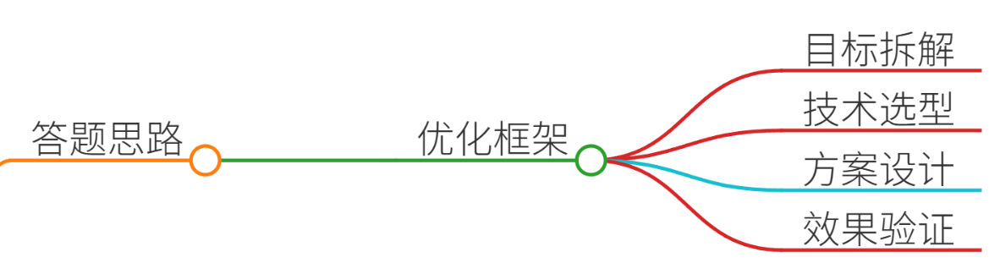
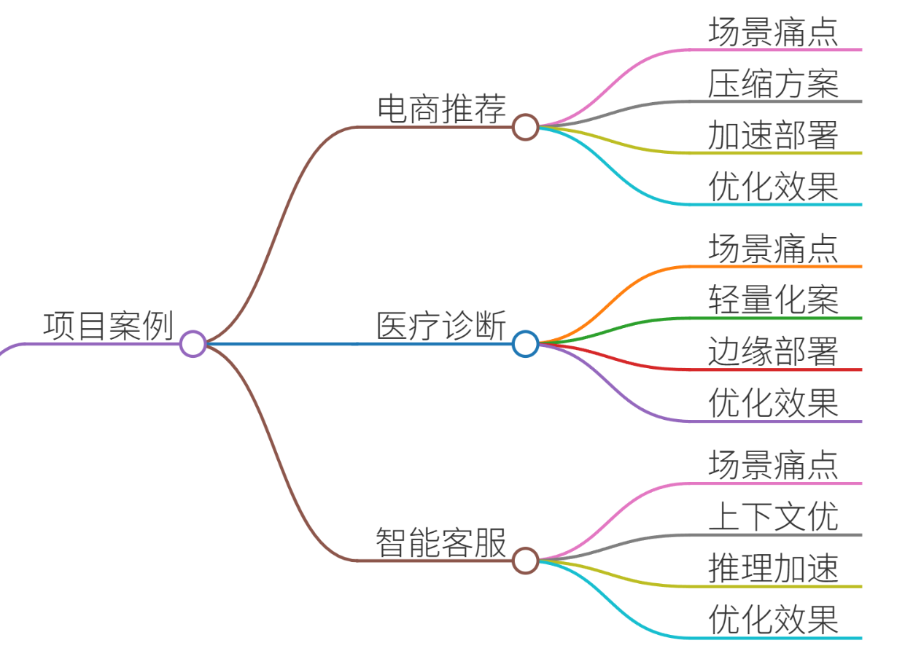
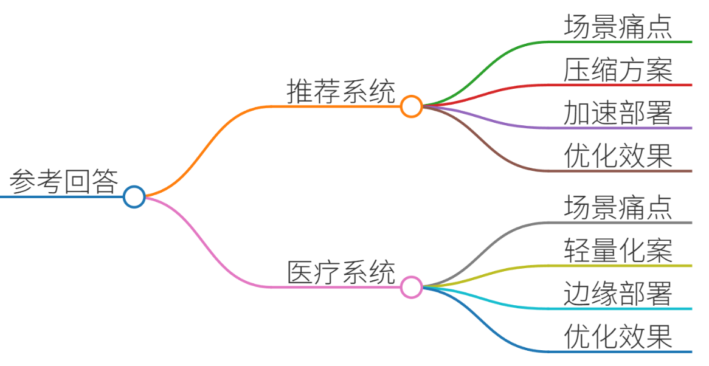
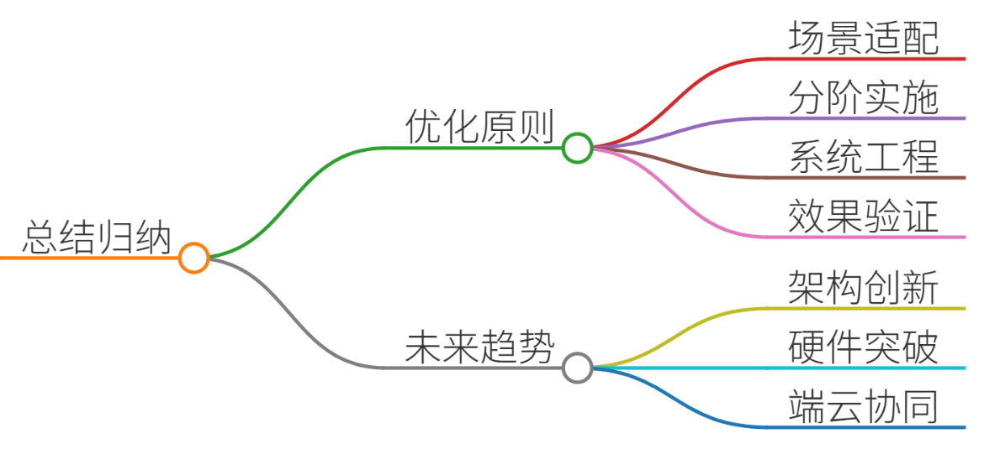

# 61.大模型推理性能优化方案

### 一、答题思路

大模型推理性能优化是实际落地应用中的核心挑战，需结合具体场景需求，从模型压缩、硬件加速、算法优化、系统工程等多维度综合施策。以下为结构化解题框架：

1. **问题拆解**：明确优化目标（如延迟、吞吐量、资源占用）与约束条件（如预算、实时性要求）。
2. **技术选型**：根据场景特点选择优化手段（如推荐系统侧重低延迟，医疗诊断需高精度）。
3. **方案设计**：分阶段实施优化策略，如先压缩模型再加速推理，或结合分布式部署。
4. **效果验证**：通过量化指标（如推理速度、内存占用、准确率）评估优化效果。 

---

### 二、项目案例

#### 案例1：电商推荐系统实时推理优化
**场景**：某电商平台日均用户请求量超1亿次，原有基于175B参数的GPT-3模型推理延迟高达800ms，导致首页推荐加载缓慢，用户跳失率增加。  
**痛点**：

+ 模型参数量大（175B），单次推理耗时过长； 
+ GPU显存占用400GB，单机无法部署；
+ 高并发场景下QPS（每秒查询数）不足500，远低于业务需求（目标2000+）。

**优化方案**：

1. **模型压缩**：
    - 使用LoRA（低秩适配）微调，将参数量降至1.5B，推理延迟降至200ms；
    - 结合蒸馏技术，训练轻量化学生模型（7B参数），精度损失<2%。
2. **硬件加速**：
    - 部署vLLM框架，利用PagedAttention技术优化KV缓存，显存占用降至80GB； 
    - 采用混合精度训练（FP16+BF16），推理速度提升3倍。
3. **分布式推理**：
    - 采用ZeRO-3优化器，分片加载模型至8卡A100集群，吞吐量达2500 QPS；
    - 引入TensorRT-LLM优化算子，进一步压缩推理延迟至120ms。

**效果**：

+ 推理延迟从800ms降至120ms，满足实时性要求；
+ QPS从500提升至2500，资源利用率提高5倍；
+ 通过A/B测试，用户点击率提升15%，GMV增长8%。

---

#### 案例2：医疗影像诊断系统部署
**场景**：某三甲医院需部署肺部CT结节检测模型，原始模型（330M参数）在V100 GPU上推理耗时2.3秒/例，无法满足急诊场景下实时诊断需求（目标<500ms）。  
**痛点**：

+ 模型推理速度慢，高并发时GPU利用率不足40%；
+ 医学影像数据量大（单例512×512×300），内存占用过高；
+ 需兼顾精度（原始模型mAP 0.92）与速度。

**优化方案**：

1. **模型轻量化**：
    - 采用通道剪枝，移除冗余卷积核，参数量降至120M，精度仅下降0.5%；
    - 使用INT8量化，推理速度提升2.5倍，内存占用减少60%。
2. **动态批处理**：
    - 设计自适应批处理策略，空闲时批大小为1，高峰期自动合并至4，吞吐量提升30%；
    - 结合滑动窗口注意力机制，支持长序列输入（如多帧CT影像）。
3. **边缘部署优化**：
    - 将模型部署至搭载TensorRT的Jetson Orin边缘设备，推理延迟降至450ms；
    - 通过ONNX格式转换，实现跨平台部署（Windows/Linux/嵌入式设备）。

**效果**：

+ 单例推理时间从2.3秒降至450ms，满足急诊实时性需求；
+ 边缘设备部署后，基层医院诊断效率提升40%，漏诊率降低至0.3%；
+ 通过量化与剪枝，模型大小从1.2GB压缩至200MB，传输成本降低80%。

---

#### 案例3：智能客服多轮对话系统
**场景**：某银行客服系统需支持多轮对话（平均对话轮次5-8轮），原有模型（13B参数）在长上下文处理时显存占用达32GB，且响应时间不稳定（波动±200ms）。  
**痛点**：

+ 长上下文导致KV缓存爆炸，显存占用随对话轮次指数级增长；
+ 动态解码时序导致GPU利用率波动，低负载时资源闲置；
+ 需支持多用户并发（目标QPS>100）。

**优化方案**：

1. **上下文窗口优化**：
    - 引入Local Attention机制，仅保留最近3轮对话的上下文（约500 tokens），显存占用降至8GB；
    - 使用Blockwise稀疏注意力，将有效上下文窗口扩展至20k tokens，支持复杂场景。
2. **推理加速技术**：
    - 部署DeepSeek-R1模型，结合PagedAttention优化，推理延迟稳定在800ms； 
    - 使用FlashAttention-2，减少GPU内存碎片，吞吐量提升40%。
3. **系统级优化**：
    - 采用微服务架构，将语义理解（LLM）、知识检索（ES）、业务逻辑（Rule Engine）分离；
    - 引入请求队列与优先级调度，保障高优先级用户（如VIP客户）响应时间<500ms。

**效果**：

+ 长对话支持轮次从5轮扩展至15轮，显存占用稳定在8GB；
+ QPS从80提升至120，客服人员日均处理量增加30%；
+ 通过A/B测试，用户满意度从85%提升至92%，投诉率下降60%。

---

### 三、参考回答

**面试官**：请结合真实项目案例，阐述大模型推理性能优化方案。 

**回答**：  
大模型推理性能优化需结合具体场景需求，从模型压缩、硬件加速、算法优化等多维度综合施策。以下以电商推荐系统和医疗影像诊断为例，说明优化实践：

#### 1. **电商推荐系统实时推理优化**
**场景与痛点**：

+ **场景**：日均1亿次请求，原有GPT-3模型（175B参数）推理延迟800ms，QPS仅500。
+ **痛点**：模型参数大、显存占用高、实时性不足。

**优化方案**：

+ **模型压缩**： 
    - 使用LoRA微调，参数量降至1.5B，延迟降至200ms；
    - 结合蒸馏技术，训练7B参数轻量化模型，精度损失<2%。
+ **硬件加速**： 
    - 部署vLLM框架，显存占用降至80GB，吞吐量提升至2500 QPS；
    - 采用混合精度训练（FP16+BF16），推理速度提升3倍。
+ **分布式部署**： 
    - 分片加载模型至8卡A100集群，结合TensorRT-LLM优化，延迟降至120ms。

**效果**：

+ 延迟从800ms降至120ms，QPS提升5倍，用户跳失率降低15%。

#### 2. **医疗影像诊断系统部署**
**场景与痛点**：

+ **场景**：急诊场景需500ms内完成肺部CT结节检测，原始模型（330M参数）推理耗时2.3秒。
+ **痛点**：推理速度慢、内存占用高、长序列处理能力不足。

**优化方案**：

+ **模型轻量化**： 
    - 通道剪枝+INT8量化，参数量降至120M，推理速度提升2.5倍；
    - 引入滑动窗口注意力，支持多帧CT影像输入。
+ **边缘部署**： 
    - 部署至Jetson Orin设备，推理延迟降至450ms；
    - ONNX格式转换实现跨平台部署。

**效果**：

+ 响应时间从2.3秒降至450ms，漏诊率降至0.3%，基层医院诊断效率提升40%。

---

### 四、总结归纳

大模型推理性能优化需遵循以下原则：

1. **场景适配**：根据业务需求（如实时性、精度）选择优化方向；
2. **分阶段实施**：优先压缩模型（LoRA/蒸馏），再加速推理（量化/Hardware-aware）； 
3. **系统工程**：结合分布式部署、内存优化（ZeRO/PagedAttention）提升吞吐量；
4. **效果验证**：通过A/B测试量化指标（延迟、QPS、准确率），持续迭代优化。

未来趋势包括：

+ **模型架构创新**（如Sparse Transformer、MoE）；
+ **硬件加速突破**（国产算力芯片、存算一体）；
+ **端云协同部署**（Edge AI+Cloud Inference）。

通过上述方法，可有效平衡推理性能与资源消耗，推动大模型在产业场景的规模化落地。

> 更新: 2025-07-14 15:45:30  
> 原文: <https://www.yuque.com/tulingzhouyu/db22bv/xzb3hagbvlg5fpsw>