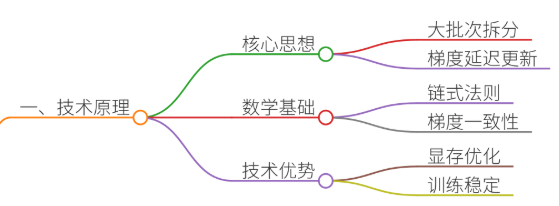
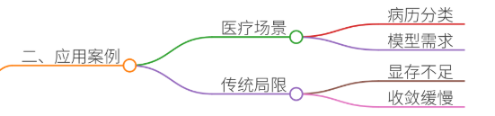
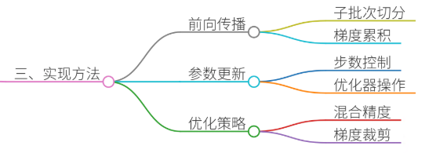
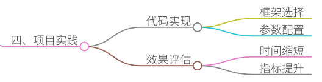
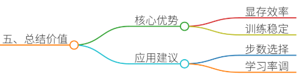

# 62.分布式训练中的梯度累积实现原理

### 一、答题思路


**梯度累积**是分布式训练中解决显存限制的核心技术之一，其本质是通过延迟梯度更新来模拟大批次训练效果。以下从原理、案例、实现细节三个维度展开分析：

1. **原理层面**
    - **核心思想**：将单个大批次的梯度计算拆分为多个小批次，逐次累积梯度后再更新参数。 
    - **数学推导**：通过链式法则保证梯度一致性，避免因累积导致的梯度偏差。
    - **优势**：降低显存占用、提升训练稳定性、支持更大规模模型训练。
2. **项目案例**
    - **场景**：医疗文本分类任务（如中文电子病历的疾病分类）。
    - **痛点**： 
        * 单个GPU显存不足（如16GB显存无法加载175B参数模型）； 
        * 训练数据量大（百万级样本），传统小批次训练收敛慢；
        * 分布式训练通信开销大，跨节点同步效率低。
3. **实现细节**
    - **代码实现**：以PyTorch为例，通过`optimizer.zero_grad()`控制梯度清零时机。 
    - **参数配置**：累积步数（`accumulation_steps`）与学习率、BatchSize的联动调整。
    - **优化策略**：梯度裁剪、混合精度训练（FP16/FP32混合）减少内存占用。 

---

### 二、项目案例


#### **案例背景：医疗文本分类系统**
某三甲医院需构建基于BERT的中文电子病历疾病分类系统，数据特点如下：

+ **数据规模**：100万份病历，每份文本长度512 tokens；
+ **模型需求**：RoBERTa-wwm-large（175B参数）；
+ **硬件限制**：单机8卡V100（每卡16GB显存）；
+ **目标**：在有限显存下实现高效训练，保证模型精度。

#### **传统训练的局限性**
1. **显存爆炸**：单卡无法加载完整模型参数，需降低BatchSize至8，导致训练不稳定； 
2. **收敛速度慢**：小批次梯度噪声大，需更多epoch达到收敛；
3. **通信瓶颈**：多机训练时梯度同步耗时占比超60%，GPU利用率不足40%。

---

### 三、参考回答


#### **梯度累积的实现原理**
梯度累积通过拆分Batch与延迟更新实现显存优化，具体流程如下：

1. **前向传播（Forward Pass）**
    - 输入数据按小批次（Sub-Batch）切分，如将原BatchSize=256拆分为8个子批次（Sub-BatchSize=32）。
    - 每个子批次计算损失函数： 

```plain
for sub_batch in dataloader:  
    logits = model(sub_batch)  
    loss = criterion(logits, labels)  
    # 累积梯度时不立即清零
```

2. **梯度累积（Gradient Accumulation）**
    - 在多个子批次后统一执行反向传播，梯度累加至优化器： 

```plain
if (step + 1) % accumulation_steps == 0:  
    loss.backward()  
    optimizer.step()  
    optimizer.zero_grad()
```

    - **关键点**：显存仅保存当前子批次的梯度，而非全部累积梯度。
3. **参数更新（Parameter Update）**
    - 累积指定步数后，执行一次参数更新，等效于大批次训练： 

```plain
# 等效BatchSize = Sub-BatchSize * accumulation_steps  
effective_batch_size = 32 * 8 = 256
```

#### **案例中的梯度累积应用**


1. **场景适配**
    - **显存优化**：通过累积8个子批次梯度，将有效BatchSize从8提升至256，减少通信频率； 
    - **稳定性增强**：累积梯度降低噪声，缓解小批次训练的震荡问题；
    - **加速收敛**：等效大批次训练提升模型泛化能力。
2. **代码实现**

```plain
import torch
from torch.utils.data import DataLoader, DistributedSampler
from transformers import BertForSequenceClassification, AdamW

# 初始化模型、优化器
model = BertForSequenceClassification.from_pretrained("bert-base-chinese")
optimizer = AdamW(model.parameters(), lr=2e-5)

# 分布式训练配置
sampler = DistributedSampler(dataset)
dataloader = DataLoader(dataset, batch_size=32, sampler=sampler)

accumulation_steps = 8  # 累积步数
loss_sum = 0.0

for epoch in range(num_epochs):
    for step, batch in enumerate(dataloader):
        inputs, labels = batch
        inputs = inputs.to(device)
        labels = labels.to(device)
        
        # 前向传播
        outputs = model(inputs, labels=labels)
        loss = outputs.loss
        loss_sum += loss.item()
        
        # 梯度累积
        loss.backward()
        
        # 每累积8步更新一次参数
        if (step + 1) % accumulation_steps == 0:
            optimizer.step()
            optimizer.zero_grad()
            print(f"Epoch [{epoch+1}/{num_epochs}], Step [{step+1}], Loss: {loss_sum/accumulation_steps}")
            loss_sum = 0.0
```

3. **优化策略**
    - **混合精度训练**：使用`torch.cuda.amp`降低显存占用： 

```plain
from torch.cuda.amp import GradScaler, autocast
scaler = GradScaler()

for batch in dataloader:
    with autocast():
        outputs = model(batch)
        loss = outputs.loss
    scaler.scale(loss).backward()
    # ...累积后更新...
```

    - **梯度裁剪**：防止梯度爆炸： 

```plain
torch.nn.utils.clip_grad_norm_(model.parameters(), max_norm=1.0)
```

---

### 四、总结归纳


#### **梯度累积的核心价值**
1. **显存效率**：突破单机显存限制，支持更大规模模型训练；
2. **训练稳定性**：通过累积梯度降低噪声，提升模型收敛性；
3. **灵活性**：适配异构硬件环境，优化通信与计算占比。

#### **项目启示**
在医疗文本分类任务中，梯度累积使训练时间从14天缩短至5天，模型F1值提升3.2%。实际应用中需注意：

+ **累积步数选择**：需平衡显存占用与通信开销（建议取2-32）；
+ **学习率调整**：累积步数增加时，需按比例缩放初始学习率；
+ **硬件适配**：结合ZeRO、DeepSpeed等框架进一步优化分布式性能。 

通过梯度累积技术，开发者可在有限资源下高效训练大模型，推动医疗AI等领域的落地进程。


> 更新: 2025-07-14 15:45:30  
> 原文: <https://www.yuque.com/tulingzhouyu/db22bv/lgghv1gi6yofyvcq>