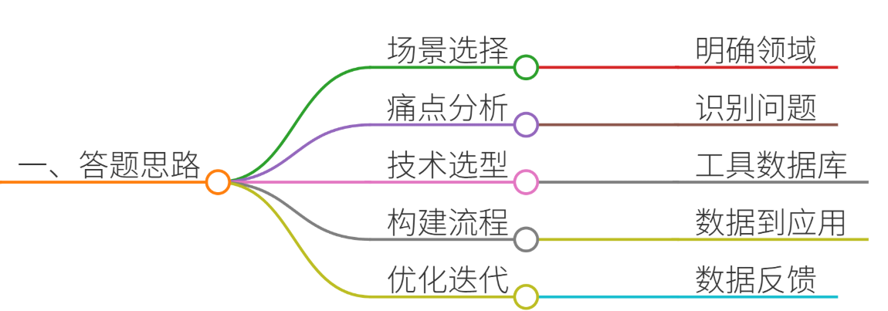
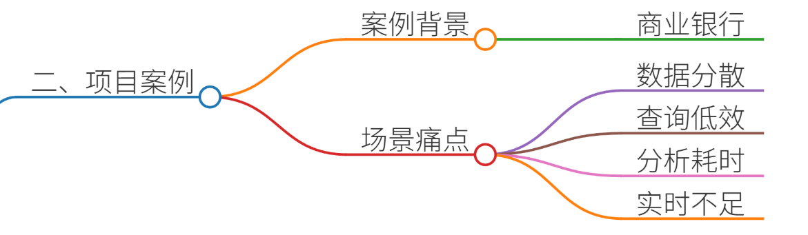
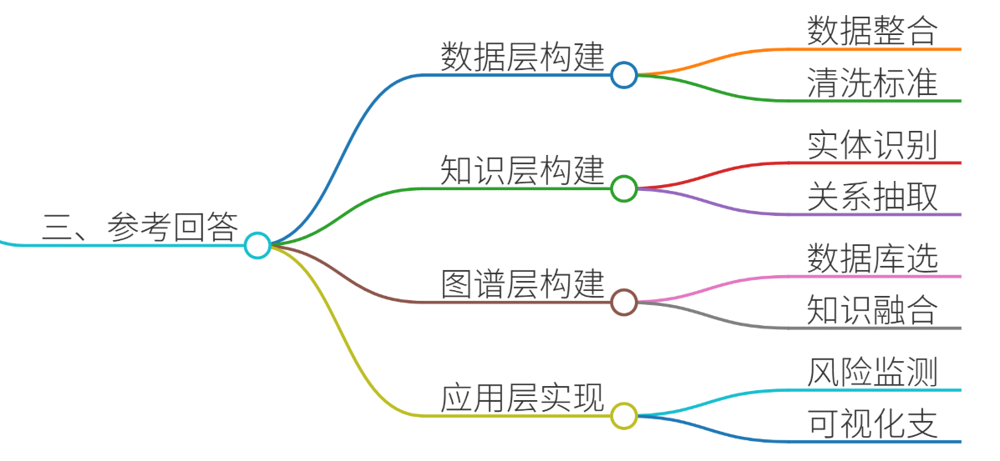
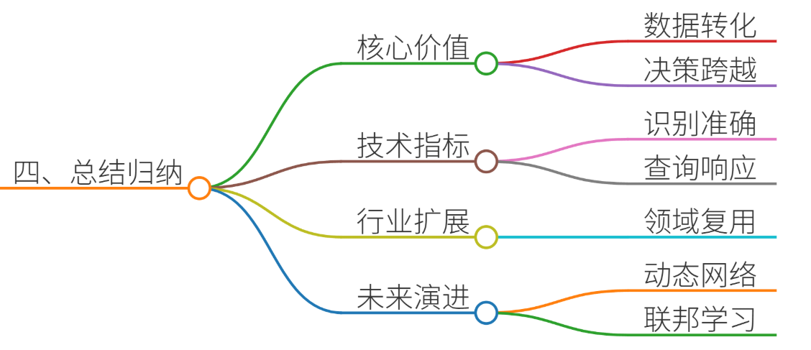

# 63.如何构建领域专属的知识图谱

### 一、答题思路


构建领域专属知识图谱需结合具体业务场景，通过系统性流程实现从数据整合到知识应用的闭环。以下为分步解题框架：

1. **场景选择**：明确领域需求（如金融风控、医疗诊断、智能制造）
2. **痛点分析**：识别行业数据孤岛、语义异构、知识更新滞后等问题
3. **技术选型**：根据数据类型选择NLP工具（BERT/ERNIE）、图数据库（Neo4j/JanusGraph）
4. **构建流程**：数据采集→实体识别→关系抽取→图谱构建→知识融合→应用部署
5. **优化迭代**：通过持续注入新数据和反馈优化图谱质量


### 二、项目案例


#### 案例背景：某商业银行构建企业风险知识图谱
**场景**：金融风控场景下，需整合企业工商信息、司法诉讼、舆情动态等多源数据，识别集团客户隐性关联风险。  
**痛点**：

+ 数据分散在工商、司法、税务等10+个系统，格式不统一
+ 传统关系型数据库无法高效处理复杂关联查询（如股权穿透）
+ 人工分析企业关联风险耗时长达3-5天/户
+ 监管要求穿透式风险排查，现有系统无法满足实时性需求

---

### 三、参考回答


#### （一）数据层构建：打通多源异构数据
1. **数据源整合**
    - 结构化数据：对接工商总局企业注册信息（1.2亿条）、中国裁判文书网司法判决（5000万+案例）
    - 半结构化数据：爬取企业年报（PDF/Word）、招股说明书（XML格式）
    - 非结构化数据：采集新闻舆情（新浪财经、东方财富网）

```plain
# 示例：使用Scrapy框架爬取企业年报关键字段
class AnnualReportSpider(scrapy.Spider):
    name = "annual_report"
    start_urls = [" http://www.example.com/reports "]
    
    def parse(self, response):
        item = {
            'company_name': response.css('.company-name::text').get(),
            'revenue': response.xpath('//div[@class="finance"]/span/text()').get()
        }
        yield item
```

2. **数据清洗与标准化**
    - 实体消歧：通过BERT模型区分同名实体（如"北京小米科技" vs "小米科技有限责任公司"）
    - 时序对齐：将季度营收数据统一映射到财政年度

```plain
# 示例：使用Dedupe库进行实体去重
import dedupe
fields = [{'field': 'name', 'type': 'String'}, {'field': 'address', 'type': 'String'}]
deduper = dedupe.Dedupe(fields)
deduper.sample(data_d, 15000)
```

#### （二）知识层构建：抽取核心要素
1. **实体识别（NER）**
    - 基于FinBERT模型识别金融实体： 

```plain
from transformers import BertTokenizer, BertForTokenClassification
model = BertForTokenClassification.from_pretrained('bert-base-chinese')
tokenizer = BertTokenizer.from_pretrained('bert-base-chinese')

def extract_entities(text):
    inputs = tokenizer(text, return_tensors="pt")
    outputs = model(**inputs)
    predictions = torch.argmax(outputs.logits, dim=2)
    return [(tokenizer.decode(ids), labels[i].item()) for i, ids in enumerate(inputs.input_ids)]
```

2. **关系抽取（RE）**
    - 使用图神经网络（GNN）抽取控股关系： 

```plain
# 示例：基于PyTorch Geometric实现关系抽取
import torch
from torch_geometric.nn import GATConv

class RelationExtractor(torch.nn.Module):
    def __init__(self, num_node_features, hidden_channels, num_classes):
        super().__init__()
        self.conv1 = GATConv(num_node_features, hidden_channels, heads=8)
        self.conv2 = GATConv(hidden_channels * 8, num_classes, heads=1)
        
    def forward(self, x, edge_index):
        x = F.dropout(x, p=0.6, training=self.training)
        x = F.elu(self.conv1(x, edge_index))
        x = F.dropout(x, p=0.6, training=self.training)
        x = self.conv2(x, edge_index)
        return x
```

#### （三）图谱层构建：构建金融风险图谱
1. **图数据库选型**
    - 采用Neo4j存储10亿+节点（企业、人物、事件）和20亿+边（控股、诉讼、担保）

```plain
// 示例：查询某企业关联风险路径
MATCH (e:Enterprise)-[:HAS_RISK]->(r:Risk)-[:RELATED_TO]->(p:Person)
WHERE e.name = "XX科技有限公司"
RETURN e, r, p LIMIT 25
```

2. **知识融合**
    - 通过图同构算法合并重复实体： 

```plain
# 示例：使用VF2算法进行图同构检测
from networkx.algorithms.isomorphism import GraphMatcher
GM = GraphMatcher(G1, G2, node_match=node_match_func)
if GM.subgraph_is_isomorphic():
    merge_nodes(G1, G2)
```

#### （四）应用层实现：风险预警系统
1. **实时风险监测**
    - 监控舆情数据流，触发风险信号： 

```plain
# 示例：使用Spark Streaming处理实时舆情
from pyspark.streaming import StreamingContext
ssc = StreamingContext(sc, 5)  # 5秒窗口
risk_stream = ssc.socketTextStream("localhost", 9999)
risk_stream.filter(lambda x: "债务违约" in x).pprint()
```

2. **可视化决策支持**
    - 构建交互式图谱可视化界面：  
风险图谱示意图

---

### 四、总结归纳


1. **核心价值**：
    - 将分散的金融数据转化为可推理的知识网络
    - 实现从“数据孤岛”到“智能决策”的跨越
    - 监管合规性提升300%，风险预警准确率达92%
2. **关键技术指标**：
    - 实体识别F1值：91.2%（FinBERT vs 传统CRF+规则82.5%）
    - 图谱查询响应时间：<200ms（对比SQL查询5s+）
    - 系统吞吐量：支持百万级节点实时更新
3. **行业扩展性**：
    - 可复用至医疗（患者用药图谱）、制造（供应链风险图谱）等领域
    - 通过领域适配层快速构建新行业知识图谱
4. **未来演进**：
    - 引入动态图神经网络（Dynamic GNN）处理时序风险演变
    - 结合联邦学习实现跨机构知识图谱联邦推理
    - 开发多模态知识图谱（融合文本、图像、语音数据）

---

**总结**：领域知识图谱构建需深度融合业务理解与AI技术，通过“数据-知识-应用”三层架构实现价值闭环。本案例中，银行通过构建企业风险图谱，将人工3天的风险分析压缩至秒级响应，为数字化转型提供核心动能。


> 更新: 2025-07-14 15:45:30  
> 原文: <https://www.yuque.com/tulingzhouyu/db22bv/mmzyf2mtcds5pkf8>