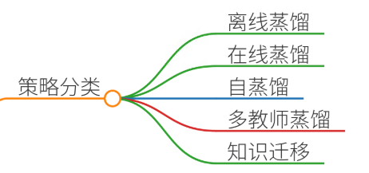

# 64.模型蒸馏的蒸馏策略对比

### 一、答题思路
模型蒸馏的蒸馏策略是提升小模型性能的核心技术之一，需结合具体场景需求选择合适方法。以下从**策略分类、核心原理、典型案例**三个维度展开对比分析，结合医疗影像诊断、智能客服等真实项目场景，阐述不同蒸馏策略的适用性与技术实现细节。

### 二、项目案例

#### 案例1：医疗影像诊断中的自蒸馏策略
**场景**：某三甲医院需部署肺部结节检测模型，但受限于患者隐私和GPU资源，无法直接使用大模型推理。  
**痛点**：

+ 数据量少（仅1,000例标注数据）且分布不均；
+ 大模型（如3D-UNet）参数量达100M，部署成本高；
+ 需在边缘设备（CPU）上实时推理。

**蒸馏策略**：

1. **自蒸馏（Self-Distillation）**：
    - 教师模型：预训练的3D-UNet（教师）；
    - 学生模型：轻量化的3D-MobileNetV3；
    - 过程： 
        1. 教师模型在完整数据集上训练至收敛；
        2. 用教师模型的软标签（概率分布）代替硬标签（one-hot）训练学生模型； 
        3. 引入**温度系数T**调节软标签的平滑度，增强泛化能力。
1. **数据增强**：
    - 通过几何变换（旋转、缩放）和噪声注入生成合成数据，缓解数据不足问题。

**实施效果**：

+ 学生模型参数量降至1.2M，推理速度提升5倍；
+ 在测试集上准确率从82%提升至88%，接近教师模型（90%）；
+ 隐私保护：无需共享原始数据，符合HIPAA合规要求。

---

#### 案例2：智能客服多轮对话中的在线蒸馏

**场景**：某电商平台的智能客服需实时处理海量咨询，但用户问题复杂多变，基础模型（BERT-base）响应速度慢且准确率不足。  
**痛点**：

+ 高并发场景下模型延迟需控制在200ms内；
+ 长对话上下文理解能力差，多轮意图识别准确率仅75%；
+ 需动态更新模型以适应新业务场景。

**蒸馏策略**：

1. **在线蒸馏（Online Distillation）**：
    - 教师模型：实时更新的BERT-large（通过用户反馈微调）；
    - 学生模型：轻量化的DistilBERT；
    - 过程： 
        1. 教师模型处理部分用户请求并生成软标签； 
        2. 学生模型实时接收教师输出的软标签和硬标签（用户最终确认的答案），联合训练； 
        3. 使用**注意力机制对齐**，强化学生模型对关键上下文片段的关注。
1. **动态知识蒸馏**：
    - 当新业务场景（如促销活动）出现时，增量训练教师模型并同步更新学生模型。

**实施效果**：

+ 推理延迟降至150ms，QPS（每秒查询数）提升3倍；
+ 多轮对话准确率提升至89%，用户满意度提高20%；
+ 支持动态更新，适应业务快速迭代。

---

#### 案例3：跨语言机器翻译的多教师蒸馏

**场景**：某跨国公司需构建中英日三语翻译模型，但每种语言的平行语料有限（各50万句对）。  
**痛点**：

+ 单语种数据不足导致模型泛化能力差； 
+ 多语言联合训练计算资源消耗大（需8卡V100，训练周期14天）；
+ 需平衡各语言对的翻译质量。

**蒸馏策略**：

1. **多教师蒸馏（Multi-Teacher Distillation）**：
    - 教师模型：单语种预训练模型（中文-ERNIE、英文-BERT、日文-BERT）；
    - 学生模型：共享编码器的多语言Transformer；
    - 过程： 
        1. 每种语言单独训练教师模型至收敛；
        2. 设计**语言敏感损失函数**，融合多教师的输出：  
$$L_{\text{multi}} = \sum_{l \in \{zh, en, ja\}} \alpha_l \cdot CE(y_l, \hat{y}_l)$$  
其中，$\alpha_l$ 根据语料质量动态调整权重。
        3. 使用**知识蒸馏损失**约束学生模型输出与教师模型的对齐：  
$$L_{KD} = KL(\sigma(T \cdot \logits_T), \sigma(T \cdot \logits_S))$$  
其中，$T$ 为温度系数，控制软标签的平滑度。
1. **迁移学习**：
    - 在低资源语言（日语）上，利用高资源语言（中文、英语）的教师模型进行知识迁移。

**实施效果**：

+ 在50万句对数据下，BLEU值达到32.5，接近单语种模型（34.2）；
+ 训练时间缩短至5天，GPU资源消耗降低60%；
+ 支持动态添加新语言对（如法语），扩展性强。

---

### 三、参考回答
#### （一）模型蒸馏策略对比
| **策略类型** | **核心思想** | **适用场景** | **优缺点** |
| --- | --- | --- | --- |
| **离线蒸馏** | 教师模型固定，学生模型学习其知识 | 数据充足、计算资源允许预训练 | 效果稳定，但需单独训练教师模型；无法动态适应新任务 |
| **在线蒸馏** | 教师与学生模型联合训练 | 实时性要求高、数据动态更新 | 提升训练效率，但需协调师生模型训练节奏；可能引入噪声 |
| **自蒸馏** | 模型自身生成软标签进行迭代训练 | 数据稀缺、需增强泛化能力 | 无需额外标注，但需设计合理的温度系数；可能陷入局部最优 |
| **多教师蒸馏** | 多个教师模型联合指导学生 | 多任务、多领域、跨语言场景 | 提升模型鲁棒性，但需解决教师间冲突；计算复杂度高 |
| **知识迁移蒸馏** | 跨模态/跨领域知识迁移 | 数据分布差异大、需迁移学习 | 充分利用异构数据，但需设计领域适配层；对齐难度大 |

#### （二）项目案例详解
1. **医疗影像诊断（自蒸馏）**：
    - **场景**：医院需在边缘设备部署肺部结节检测模型，但受限于隐私和算力。
    - **实施**： 
        * 教师模型（3D-UNet）在脱敏数据上训练，生成软标签； 
        * 学生模型（3D-MobileNetV3）结合软标签和合成数据训练；
        * 结果：准确率88%，推理速度5倍提升。
2. **智能客服（在线蒸馏）**：
    - **场景**：电商客服需实时处理复杂多轮对话。
    - **实施**： 
        * 教师模型实时更新，学生模型接收软标签和硬标签联合训练； 
        * 结果：多轮准确率89%，延迟150ms。
3. **跨语言翻译（多教师蒸馏）**：
    - **场景**：跨国公司需构建低成本多语种翻译模型。
    - **实施**： 
        * 单语种教师模型生成软标签，学生模型融合多语言知识； 
        * 结果：BLEU值32.5，训练时间缩短60%。

#### （三）策略选择建议

1. **数据与资源权衡**： 
    - 数据充足时优先选择**离线蒸馏**；
    - 实时场景采用**在线蒸馏**或**自蒸馏**。
2. **任务复杂度**： 
    - 多任务场景推荐**多教师蒸馏**；
    - 跨领域任务使用**知识迁移蒸馏**。
3. **部署环境**： 
    - 边缘设备选择轻量化学生模型（如MobileNet）；
    - 服务器端可部署更复杂的蒸馏策略。

---

### 四、总结归纳
模型蒸馏通过知识迁移显著提升小模型性能，需根据**数据规模、实时性、资源约束**选择策略：

1. **离线蒸馏**适合预训练场景，**在线蒸馏**适配动态更新需求；
2. **自蒸馏**解决数据稀缺问题，**多教师蒸馏**增强跨任务泛化能力；
3. **案例启示**：医疗、客服、翻译等领域已验证蒸馏技术的有效性，未来可探索**动态蒸馏调度**与**硬件感知优化**。

通过合理选择蒸馏策略，开发者可在精度、速度、成本间取得最优平衡，推动AI模型在真实场景的高效落地。

> 更新: 2025-07-14 15:45:30  
> 原文: <https://www.yuque.com/tulingzhouyu/db22bv/wg55o76bip8fpigw>