# 进阶并发编程

#### [课程介绍](https://www.yuque.com/tianming-aroh0/sagnbd/nfkf7dvzxgp26nw4)<font style="color:rgb(51, 51, 51);">：</font>
<font style="color:rgb(51, 51, 51);">	</font><font style="color:rgb(51, 51, 51);">golang基本语言 编程基础 有并发经验更好</font>

<font style="color:rgb(51, 51, 51);">	</font><font style="color:rgb(51, 51, 51);">GoLang 核心优势 高性能的支撑 高并发</font>

<font style="color:rgb(51, 51, 51);">	</font><font style="color:rgb(51, 51, 51);">概览 </font>

##### **<font style="color:rgb(51, 51, 51);">进程Process 与线程 Thread</font>**
<font style="color:rgb(51, 51, 51);">进程定义:进程 是并发执行的程序中分配和管理资源的基本单位。</font>

<font style="color:rgb(51, 51, 51);">线程定义：线程是进程的执行单元，是进行调度的实体，是比进程更小的独立运行单位。</font>

##### <font style="color:rgb(51, 51, 51);">并行Concurrent与并发Paralled</font>
<font style="color:rgb(51, 51, 51);">并发定义： 多线程交替操作同一资源类</font>

<font style="color:rgb(51, 51, 51);">并行定义：多个线程同时操作多个资源类</font>

##### <font style="color:rgb(51, 51, 51);">图解：</font>
<font style="color:rgb(51, 51, 51);">Erlang 之父 Joe Armstrong 用一张5岁小孩都能看懂的图解释了并发与并行的区别</font>

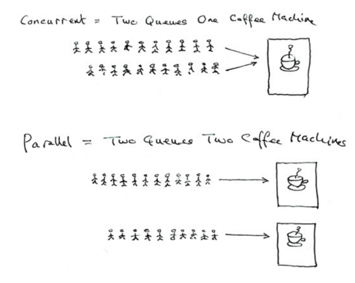

<font style="color:rgb(51, 51, 51);"></font>

#### <font style="color:rgb(51, 51, 51);">协程 goroutine 的引入</font>
##### <font style="color:rgb(51, 51, 51);">需求 :</font>
<font style="color:rgb(51, 51, 51);">统计 1~2000000的数字中 哪些是素数</font>

<font style="color:rgb(51, 51, 51);">传统方式 ：使用循环 判断，</font>

<font style="color:rgb(51, 51, 51);">优化：使用并发和并行的方式</font>

<font style="color:rgb(51, 51, 51);">Golang：将统计分配给多个 goroutine去完成</font>

##### <font style="color:rgb(51, 51, 51);">协程的基本概念：</font>
<font style="color:rgb(51, 51, 51);">协程：</font>

<font style="color:rgb(51, 51, 51);">		</font><font style="color:rgb(51, 51, 51);">协程是单线程下的并发，又称微线程，纤程。它是实现多任务的另一种方式，只不过是比线程更小的执行单元。因为它自带CPU的上下文，这样只要在合适的时机，我们可以把一个协程切换到另一个协程。英文名Coroutine。</font>

<font style="color:rgb(51, 51, 51);">	</font><font style="color:rgb(51, 51, 51);">一句话说明什么是协程：轻量级的线程 独立的栈空间 ，共享程序堆空间 调度由用户控制 是逻辑态，对资源消耗小 </font>

##### <font style="color:rgb(51, 51, 51);">线程和协程的区别：</font>
<font style="color:rgb(51, 51, 51);">		</font><font style="color:rgb(51, 51, 51);">线程的切换是一个cpu在不同线程中来回切换，是从系统层面来，不止保存和恢复CPU上下文这么简单，会非常耗费性能。但是协程只是在同一个线程内来回切换不同的函数，只是简单的操作CPU的上下文，所以耗费的性能会大大减少。</font>

<font style="color:rgb(51, 51, 51);">	</font><font style="color:rgb(51, 51, 51);">golang的协程机制，可轻松开启上万个协程。其他语言并发机制一般基于线程，开启过多资源耗费大。 </font>

##### <font style="color:rgb(51, 51, 51);">案例：</font>
<font style="color:rgb(51, 51, 51);">主线程开启一个 goroutine 每隔1s输出 "马士兵教育申专你好！"</font>

<font style="color:rgb(51, 51, 51);">在主线程中每隔 2s 输出 go routine 十次后退出程序</font>

<font style="color:rgb(51, 51, 51);">要求主线程和 goroutine同时执行</font>

##### <font style="color:rgb(51, 51, 51);">流程图：</font>
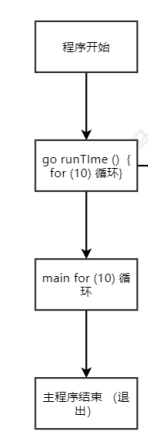

#### <font style="color:rgb(51, 51, 51);">百万级并发 </font>
```plain
package main

import (
    "fmt"
    "runtime"
)

var num int = 1

func main() {
    // for i := 1; i < 10000000; i++ {
    //  //go runTimes(1)
    // }
    //1.8前  要设置 CPU 核心数 。 之后默认全开
    runtime.GOMAXPROCS(16)
    fmt.Println(runtime.NumCPU())
    // for i := 1; i <= 10; i++ {
    //  fmt.Println("main", i, "TianMing你好！", 10-i)
    //  time.Sleep(time.Second * 2)
    // }
}

func runTimes(times int) int {
    for i := 1; i <= times; i++ {
        fmt.Println("runTimes", i, "天明你好！", times-i)
        fmt.Println("num: ", num)
        //  time.Sleep(time.Second)
    }
    num++
    return times
}
```

##### <font style="color:rgb(51, 51, 51);">并发的安全问题</font>
```plain
import (
    "fmt"
    "time"
)

var (
    testMap = make(map[int]int, 10)
)

func testNum(num int) {
    res := 1
    for i := 1; i <= num; i++ {
        res *= i
    }
    testMap[num] = res
}

func main() {
    start := time.Now()
    for i := 1; i < 200; i++ {
        go testNum(i)
    }
    //协程需要在main之后完毕
    time.Sleep(time.Second * 5)
    for key, val := range testMap {
        fmt.Printf("数字%v 对应的阶乘是 %v\n", key, val)
    }
    end := time.Since(start)
    fmt.Println(end)
}
```

<font style="color:rgb(51, 51, 51);">直接运行：报错：fatal error: concurrent map writes</font>

<font style="color:rgb(51, 51, 51);">go build -race main.go 检测数据竞争状态 </font>

<font style="color:rgb(51, 51, 51);">再执行 ./main.exe 会提示 WARNING: DATA RACE </font>

<font style="color:rgb(51, 51, 51);">Previous write at 0x00c000144450 by goroutine 7:</font>

<font style="color:rgb(51, 51, 51);">fatal error: concurrent map writes </font>

##### <font style="color:rgb(51, 51, 51);">问题的原因：</font>
<font style="color:rgb(51, 51, 51);">多协程 并发 资源竞争的问题</font>

##### <font style="color:rgb(51, 51, 51);">问题的解决方案：</font>
###### <font style="color:rgb(51, 51, 51);">1.互斥锁</font>
<font style="color:rgb(51, 51, 51);">				</font><font style="color:rgb(51, 51, 51);">全局变量 通过加锁lock unlock 的方法 达到线程安全</font>

<font style="color:rgb(51, 51, 51);">				</font><font style="color:rgb(51, 51, 51);">lock</font><font style="color:rgb(51, 51, 51);">	</font><font style="color:rgb(51, 51, 51);">sycn.Mutex </font>

<font style="color:rgb(51, 51, 51);">						</font><font style="color:rgb(51, 51, 51);">lock.Lock() 等使用完 lock.Unlock()</font>

```plain
package main

import (
    "fmt"
    "sync"
    "time"
)
var (
    testMap = make(map[int]int, 10)
    lock sync.Mutex
)
func testNum(num int) {
    lock.Lock()
    res := 1
    for i := 1; i <= num; i++ {
        res *= i
    }
    time.Sleep(time.Second * 1)
    testMap[num] = res
    lock.Unlock()
}

func main() {
    start := time.Now()
    for i := 1; i < 20; i++ {
        go testNum(i)
    }
    //协程需要在main之后完毕
    time.Sleep(time.Second * 5)
    lock.Lock()
    for key, val := range testMap {
        fmt.Printf("数字%v 对应的阶乘是 %v\n", key, val)
    }
    lock.Unlock()
    end := time.Since(start)
    fmt.Println(end)
}
```

<font style="color:rgb(51, 51, 51);">弊端：协程执行的时间不可控</font>

###### <font style="color:rgb(51, 51, 51);">2.channel通道</font>
<font style="color:rgb(51, 51, 51);">chan 本质就是一个数据结构-队列</font>

<font style="color:rgb(51, 51, 51);">先进先出 FIFO的规则 ，线程安全，多Goroutine访问不需要加锁，因为通道本身线程安全。</font>

<font style="color:rgb(51, 51, 51);">注意：channel是有类型的 定义存放的类型不能放不同类型 。当然如果传空接口就能所有类型</font>

<font style="color:rgb(51, 51, 51);">定义/声明 Channel 如： var intChan chan int </font>

<font style="color:rgb(51, 51, 51);">int表示类型 可以是 map[int] string ; Person ; *User 等 </font>

<font style="color:rgb(51, 51, 51);">需要 make 之后才可使用 ： intChan = make(chan int ,6)</font>

<font style="color:rgb(51, 51, 51);">示意图：</font>

<font style="color:rgb(51, 51, 51);">	</font><font style="color:rgb(51, 51, 51);">intChan<- 1 <- intChan len(intChan) cap(intChan)</font>

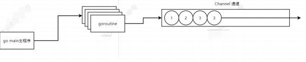

<font style="color:rgb(51, 51, 51);">使用案例：</font>

```plain
package main

import "fmt"

var intChan chan int  //1.定义


func main() {

  intChan = make(chan int, 10)  //初始化

  intChan <- 1  //in

  fmt.Println(intChan)

  fmt.Printf("intChan的值是%v,地址是%v\n", <-intChan, &intChan)  // out

  fmt.Printf("intChan的大小是%v, 容量%v\n", len(intChan), cap(intChan))   //大小 和 容量
    
    
    strChan := make(chan string, 3) //直接初始化
    var str = "申"
    strChan <- str
    strChan <- "专"

    fmt.Printf("strChan的大小是%v, 容量%v\n", len(strChan), cap(strChan))  
    

}
```

<font style="color:rgb(51, 51, 51);">练习： </font>

```plain
mapChan := make(chan map[int]string, 5)

  map1 := make(map[int]string, 2)

  map1[0] = "申"

  map1[1] = "专"

  mapChan <- map1

  map2 := make(map[int]string, 2)

  map2[0] = "是"

  map2[1] = "的"

  mapChan <- map2

  fmt.Printf("%v%v\n", <-mapChan, <-mapChan)
```

<font style="color:rgb(51, 51, 51);">练习：</font>

```plain
type dog struct {
    Name string
    Color string
}

//main 方法中测试
allChan := make(chan interface{}, 10)

  allChan <- dog{Name: "小黄", Color: "Yellow"}

  allChan <- 1

  allChan <- "很2"

  // fmt.Printf("%v%v%v\n", <-allChan, <-allChan, <-allChan)

  // dog1 := <-allChan

  // fmt.Printf("%T\n", dog1)

  // // fmt.Printf("%T", dog1.Color)  //虽然看到是一条狗,看是你拿不到它任何属性和方法

  // a := dog1.(dog) //需要 类型断言

  a := (<-allChan).(dog)

  fmt.Printf(a.Color)
```

###### <font style="color:rgb(51, 51, 51);">Channel的循环遍历 与 关闭</font>
<font style="color:rgb(51, 51, 51);">	</font>

<font style="color:rgb(51, 51, 51);">	</font><font style="color:rgb(51, 51, 51);">for range 循环 取值 需要 close(chanName) // 注意 关闭的管道 不能写入 否则：panic: send on closed channel</font>

<font style="color:rgb(51, 51, 51);">否则 ：fatal error: all goroutines are asleep - deadlock! </font>

```plain
close(allChan) //管道关闭之后 不能再写入
    //allChan <- 1

    // for val := range allChan {
    //  fmt.Println(val)
    // }
    //for i := 0; i < len(allChan); i++ {   //这样循环 结果会不正确 因为 取出值之后len 会变化 
    //  fmt.Println(<-allChan)
    //}

      for {

            val, ok := <-allChan

            if !ok {  //有数据 则 ok

                break

            }

         fmt.Println(val)
  }
```

###### <font style="color:rgb(51, 51, 51);">Goroutine 和 Channel的结合应用</font>
<font style="color:rgb(51, 51, 51);">	</font><font style="color:rgb(51, 51, 51);">应用实例1：</font>

<font style="color:rgb(51, 51, 51);">	</font><font style="color:rgb(51, 51, 51);">用goroutine和channel协同工作完成 </font>

<font style="color:rgb(51, 51, 51);">	</font><font style="color:rgb(51, 51, 51);">1.开启一个writeData协程，向管道intChan中写入50个整数</font>

<font style="color:rgb(51, 51, 51);">	</font><font style="color:rgb(51, 51, 51);">2.开启一个readData协程，从管道intChan中读取writeData写入的数据</font>

<font style="color:rgb(51, 51, 51);">	</font><font style="color:rgb(51, 51, 51);">注意：读写操作的是同一个管道的数据。主线程需要等待读写的协程完成才能退出。</font>

<font style="color:rgb(51, 51, 51);">思路分析：</font>

<font style="color:rgb(51, 51, 51);">代码实现：</font>

```plain
import (
    "fmt"
    "math/rand"
    "time"
)

var intChan chan int

func main() {
    intChan = make(chan int, 150)
    exitChan := make(chan bool, 1)
    go writeData(intChan)
    go readData(intChan, exitChan)
    //time.Sleep(time.Second * 2)
    if <-exitChan {
        return
    }
    fmt.Println("end main !")
}

//封装两个方法
func writeData(intChan chan int) {
    rand.Seed(time.Now().UnixNano())
    for i := 1; i < 150; i++ {
        var tempInt int
        tempInt = rand.Intn(4) + 16
        fmt.Printf("写入%v,第%v次写\n", tempInt, i)
        //time.Sleep(time.Second)
        intChan <- tempInt
    }
    close(intChan) //注意关闭通道
}
func readData(intChan chan int, exitChan chan bool) {
    var count int
    for {
        val, ok := <-intChan
        count++
        if !ok {
            break
        }
        fmt.Printf("读取到%v,第%v次读取\n", val, count)
    }
    exitChan <- true //表示读取完毕
    close(exitChan)  //注意关闭通道
}
```

##### <font style="color:rgb(51, 51, 51);">协程引入的需求实现：</font>
<font style="color:rgb(51, 51, 51);">	</font><font style="color:rgb(51, 51, 51);">统计 1~2000000的数字中 哪些是素数</font>

<font style="color:rgb(51, 51, 51);">	</font><font style="color:rgb(51, 51, 51);">传统方式 ：使用循环 判断，</font>

<font style="color:rgb(51, 51, 51);">	</font><font style="color:rgb(51, 51, 51);">优化：使用并发和并行的方式 </font>

<font style="color:rgb(51, 51, 51);">	</font><font style="color:rgb(51, 51, 51);">golang：将统计分配给多个 goroutine去完成</font>

###### <font style="color:rgb(51, 51, 51);">传统方式：</font>
```plain
//num int 表示这个值以内的素数 有哪些 
func isPrime(num int) {
    for i := 1; i < num; i++ {
        var flag bool = true
        for j := 2; j < i; j++ {
            if i%j == 0 {
                flag = false
                continue
            }
        }
        if flag {
            fmt.Println("数字", i, "是素数。")
        }
    }
}
```

<font style="color:rgb(51, 51, 51);">改进思路：</font>

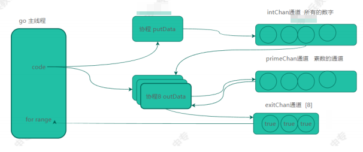

###### <font style="color:rgb(51, 51, 51);">goroutine + channel 实现：</font>
```plain
package main

import (
    "fmt"
)

var intChan chan int = make(chan int, 20000)

func main() {
    // isPrime(20000) //20000   2.086 seconds
    // fmt.Println()

    var primeChan chan int = make(chan int, 20000)
    var exitChan chan bool = make(chan bool, 8)

    go initChan(20000)

    for i := 0; i <= 8; i++ {
        go isPrimeA(intChan, primeChan, exitChan)
    }
    go func() { //0.839 seconds
        for i := 0; i <= 8; i++ {
            <-exitChan
        }
        close(primeChan)
    }()

    for {
        res, ok := <-primeChan
        if !ok {
            break
        }
        fmt.Println("素数：", res)
    }

}

func initChan(num int) {
    for i := 1; i <= num; i++ {
        intChan <- i
    }
    close(intChan)
}

func isPrimeA(intChan chan int, primeChan chan int, exitChan chan bool) {
    var flag bool
    for {
        num, ok := <-intChan
        flag = true
        if !ok {
            break
        }
        for j := 2; j < num; j++ {
            if num%j == 0 {
                flag = false
                continue
            }
        }
        if flag {
            primeChan <- num
            //fmt.Println("数字", i, "是素数。")
        }
    }
    exitChan <- true
}

func isPrime(num int) {
    for i := 1; i < num; i++ {
        var flag bool = true
        for j := 2; j < i; j++ {
            if i%j == 0 {
                flag = false
                continue
            }
        }
        if flag {
            fmt.Println("数字", i, "是素数。")
        }
    }
}
```

##### <font style="color:rgb(51, 51, 51);">管道的注意事项</font>
<font style="color:rgb(51, 51, 51);">	</font><font style="color:rgb(51, 51, 51);">1.声明之后需要make开辟内存才可以使用</font>

<font style="color:rgb(51, 51, 51);">	</font><font style="color:rgb(51, 51, 51);">2.如果写满了 继续写会报错 //fatal error: all goroutines are asleep - deadlock!</font>

<font style="color:rgb(51, 51, 51);">	</font><font style="color:rgb(51, 51, 51);">3.可以声明chan只读或者只写</font>

<font style="color:rgb(51, 51, 51);">		</font><font style="color:rgb(51, 51, 51);"> 只写</font><font style="color:rgb(51, 51, 51);">	</font><font style="color:rgb(51, 51, 51);">var chanIn chan <- int</font>

<font style="color:rgb(51, 51, 51);">		</font><font style="color:rgb(51, 51, 51);"> 只读</font><font style="color:rgb(51, 51, 51);">	</font><font style="color:rgb(51, 51, 51);">var chanOut <- chan int </font>

```plain
import (
    "fmt"
)
func main() {
    onlyIn()
    onlyOut()
    fmt.Println()
}
func onlyIn() {
    var chanIn chan<- int
    chanIn = make(chan int, 1)
    chanIn <- 1
    // chanIn <- 2   // 会提示fatal error: all goroutines are asleep - deadlock!
    fmt.Println(chanIn)
    //fmt.Println(<-chanIn) // 读取只写的通道   编译失败  invalid operation: cannot receive from send-only channel chanIn (variable of type chan<- int)compiler
}
func onlyOut() {
    var chanOut <-chan int
    //chanOut <- 2 // 编译不通过  invalid operation: cannot send to receive-only type <-chan intcomp
    chanOut = make(chan int, 3)
    fmt.Println(chanOut)
}
```

##### <font style="color:rgb(51, 51, 51);">只读 只写管道的意义：</font>
<font style="color:rgb(51, 51, 51);">		</font><font style="color:rgb(51, 51, 51);">方法参数 控制 只读只写 。防止误操作</font>

<font style="color:rgb(51, 51, 51);">		</font><font style="color:rgb(51, 51, 51);">底层处理 效率也会更高 </font>

<font style="color:rgb(51, 51, 51);">func isPrimeA(intChan chan int, primeChan chan int, exitChan chan bool) {</font>

<font style="color:rgb(51, 51, 51);">	</font><font style="color:rgb(51, 51, 51);">比如这个方法的 参数一 只读 ； 参数二三 只写 </font>

<font style="color:rgb(51, 51, 51);">	</font>

<font style="color:rgb(51, 51, 51);">	</font><font style="color:rgb(51, 51, 51);">3.close的继续写也会报错 但是可以读 。 如果没有close 去读取 会死锁 //fatal error: all goroutines are asleep - deadlock!</font>

<font style="color:rgb(51, 51, 51);">				</font><font style="color:rgb(51, 51, 51);">关键字 select </font>

<font style="color:rgb(51, 51, 51);">					</font><font style="color:rgb(51, 51, 51);">label</font><font style="color:rgb(51, 51, 51);">	</font><font style="color:rgb(51, 51, 51);">for </font><font style="color:rgb(51, 51, 51);">	</font><font style="color:rgb(51, 51, 51);">{ select {case := chanName default return}}</font>

<font style="color:rgb(51, 51, 51);">	</font>

```plain
package main

import (
    "fmt"
    "math/rand"
    "time"
)

var intChan chan int

//封装两个方法
func writeData(intChan chan int) {
    rand.Seed(time.Now().UnixNano())
    for i := 1; i < 150; i++ {
        var tempInt int
        tempInt = rand.Intn(4) + 18
        fmt.Printf("写入%v,第%v次写\n", tempInt, i)
        //time.Sleep(time.Second)
        intChan <- tempInt
    }
    //close(intChan) //注意关闭通道
}
func readData(intChan chan int, exitChan chan bool) {
    var count int
    for {
        val, ok := <-intChan
        count++
        if !ok {
            break
        }
        fmt.Printf("读取到%v,第%v次读取\n", val, count)
    }
    exitChan <- true //表示读取完毕
    //close(exitChan)  //注意关闭通道
}

func isPrime(num int) {
    for i := 1; i < num; i++ {
        var flag bool = true
        for j := 2; j < i; j++ {
            if i%j == 0 {
                flag = false
                continue
            }
        }
        if flag {
            fmt.Println("数字：", i, "是素数！")
        }

    }
}

func isPrimeA(intChan chan int, primeChan chan int, exitChan chan bool) {
    var flag bool
label:
    for {
        select {
        case num := <-intChan:
            flag = true
            for i := 2; i < num; i++ {
                if num%i == 0 {
                    flag = false
                    break
                }
            }
            if flag {
                primeChan <- num
            }
        default:
            break label
        }

    }
    fmt.Println("协程已结束")
    exitChan <- true
}

func initChan(num int) {
    for i := 1; i <= num; i++ {
        intChan <- i
    }
    //close(intChan)
}

func main() {
    // intChan = make(chan int, 150)
    // exitChan := make(chan bool, 1)
    // go writeData(intChan)
    // go readData(intChan, exitChan)
    // //time.Sleep(time.Second * 2)
    // if <-exitChan {
    //  return
    // }
    // fmt.Println("end main !")
    //isPrime(100000) //传统方法  100000  39.473 seconds
    start := time.Now()
    intChan = make(chan int, 100)
    go initChan(100)
    var primeChan chan int = make(chan int, 100)
    var exitChan chan bool = make(chan bool, 8)
    for i := 0; i < 8; i++ {
        go isPrimeA(intChan, primeChan, exitChan)
    }
    go func() {
        for i := 0; i < 7; i++ {
            <-exitChan
        }
        //close(primeChan)
    }()
label:
    for {
        select {

        case res := <-primeChan:
            fmt.Println("素数：", res)
        default:
            break label
        }
    }

    end := time.Since(start)
    fmt.Println("用时：", end) // 100000  824.848ms
}
```

##### <font style="color:rgb(51, 51, 51);">defer匿名函数的捕获panic应用：</font>
<font style="color:rgb(51, 51, 51);">		</font><font style="color:rgb(51, 51, 51);">多个协程可能会有 panic 导致整个程序崩溃 </font>

<font style="color:rgb(51, 51, 51);">		</font><font style="color:rgb(51, 51, 51);">defer 匿名函数 + err:recore() 捕获panic</font>

```plain
func onlyOut(num int) {

  defer func() {

     if err := recover(); err != nil {

      fmt.Println("onlyOut方法panic ：", err)

   }

  }()

  var testMap map[int]int //panic: assignment to entry in nil map

  testMap[0] = num


}
```

  
 进阶综合应用 及源码 原理部分

<font style="color:rgb(51, 51, 51);">能看到这说明你确实“够浪”，我就给你再留给彩蛋吧。上述进阶并发和网路通信的笔记的</font>

[够浪并发编程_哔哩哔哩_bilibili](https://www.bilibili.com/video/BV1d84y1v7eZ/?spm_id_from=333.1387.upload.video_card.click&vd_source=04d13f3e51316f05440d2eb2411de9f3)

<font style="color:rgb(51, 51, 51);">是我已发布在B站（</font>[够浪编程](about:blank)<font style="color:rgb(51, 51, 51);">），还有更多架构从应用到原理和项目实战的内容。以及云原生二次开发</font>

<font style="color:rgb(51, 51, 51);">天明寄语:如果不是要往go这块转或者云原生定制化，到此面个试基本就够吊打面试官了</font>

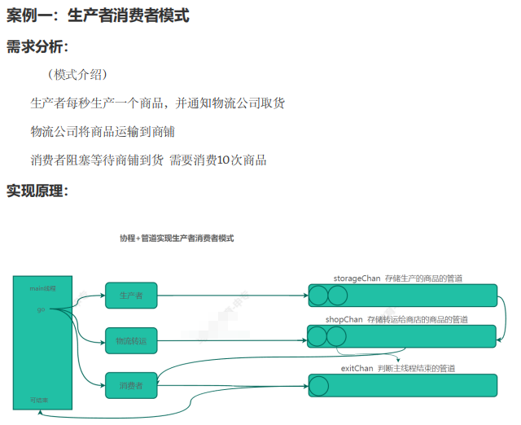

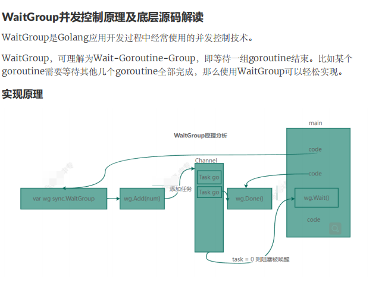

**底层源码**

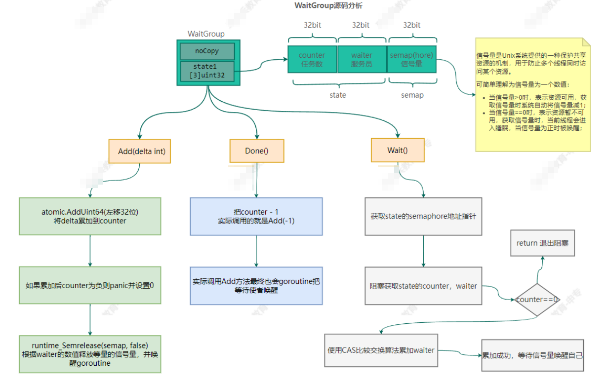

从计算机底层深入“够浪” 高并发

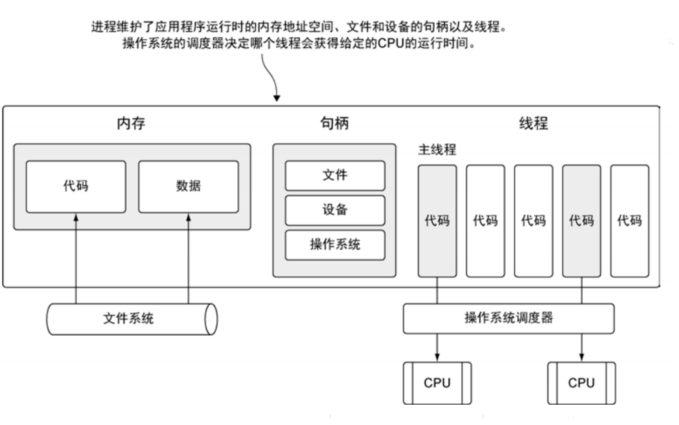

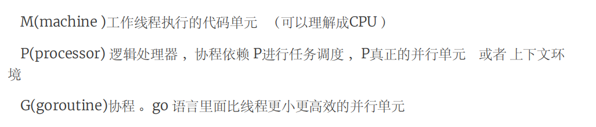

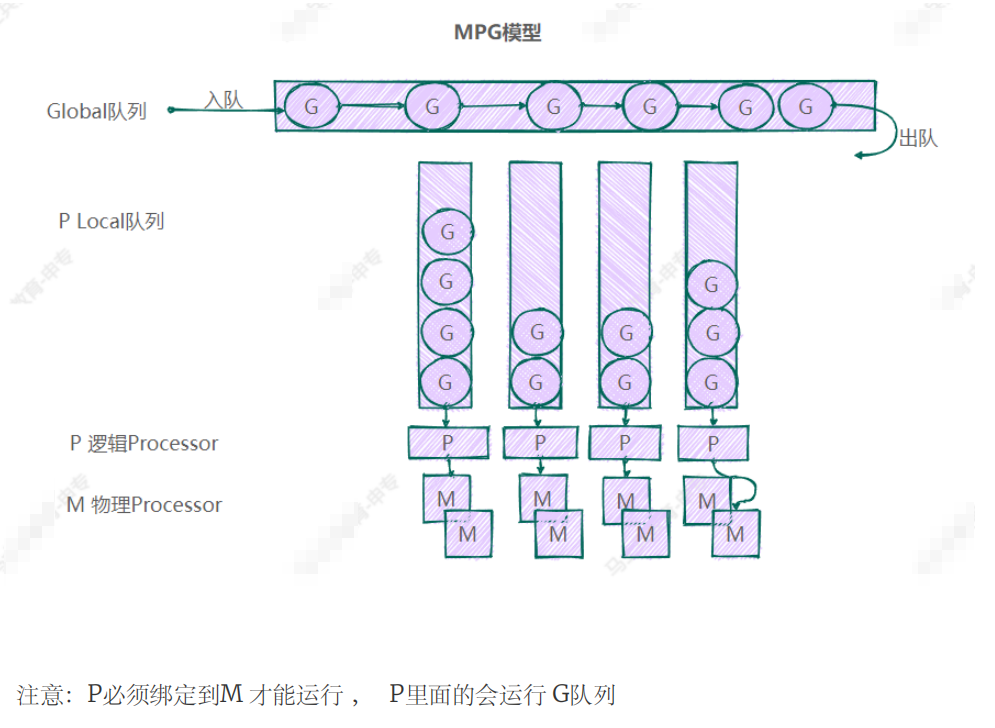

**MPG源码流程**

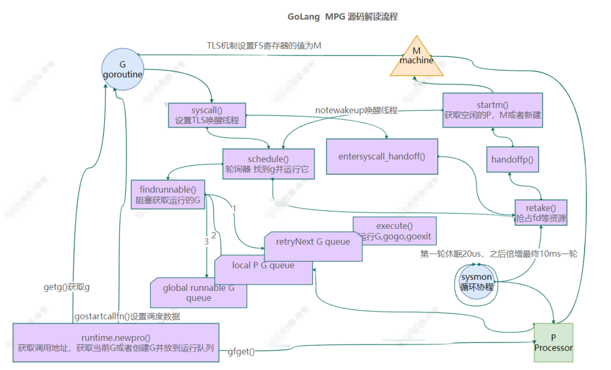


> 更新: 2025-06-18 16:40:01  
> 原文: <https://www.yuque.com/tulingzhouyu/db22bv/ekdzhf1uxhipuush>