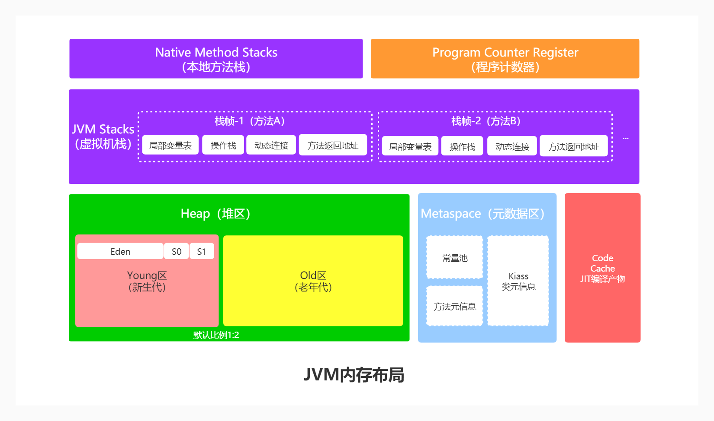
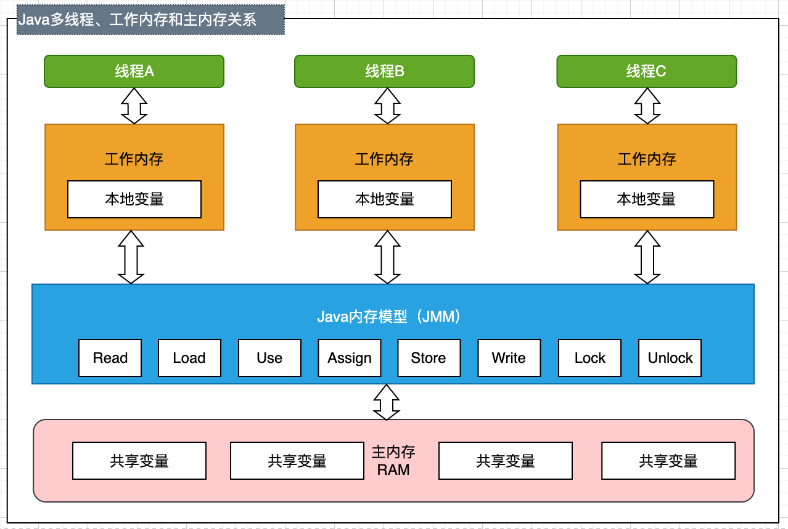
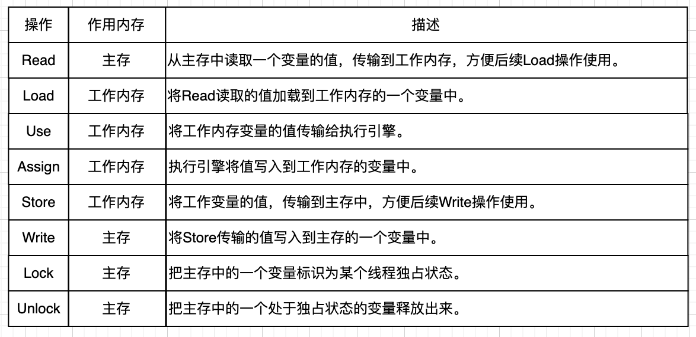
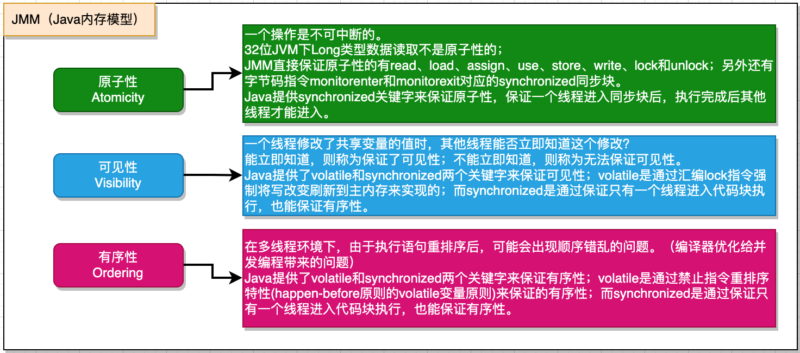

# JVM 内存模型与 JMM 内存模型

<font style="color:rgba(0, 0, 0, 0.9);background-color:rgb(252, 252, 252);">在 Java 开发中，</font>**<font style="color:rgba(0, 0, 0, 0.9);background-color:rgb(252, 252, 252);">JVM 内存模型</font>**<font style="color:rgba(0, 0, 0, 0.9);background-color:rgb(252, 252, 252);">和 </font>**<font style="color:rgba(0, 0, 0, 0.9);background-color:rgb(252, 252, 252);">JMM（Java Memory Model）</font>**<font style="color:rgba(0, 0, 0, 0.9);background-color:rgb(252, 252, 252);"> 是两个容易混淆但完全不同的概念。以下是它们的核心区别和联系：</font>

---

### **<font style="color:rgba(0, 0, 0, 0.9);background-color:rgb(252, 252, 252);">1. JVM 内存模型（运行时数据区）</font>**
**<font style="color:rgba(0, 0, 0, 0.9);background-color:rgb(252, 252, 252);">定义</font>**<font style="color:rgba(0, 0, 0, 0.9);background-color:rgb(252, 252, 252);">：JVM 内存模型描述的是 JVM </font>**<font style="color:rgba(0, 0, 0, 0.9);background-color:rgb(252, 252, 252);">物理内存的划分</font>**<font style="color:rgba(0, 0, 0, 0.9);background-color:rgb(252, 252, 252);">，即程序运行时的内存区域。</font>

<font style="color:rgba(0, 0, 0, 0.9);background-color:rgb(252, 252, 252);">  
</font>**<font style="color:rgba(0, 0, 0, 0.9);background-color:rgb(252, 252, 252);">核心区域</font>**<font style="color:rgba(0, 0, 0, 0.9);background-color:rgb(252, 252, 252);">：</font>

| **<font style="color:rgba(0, 0, 0, 0.9);"></font>****<font style="color:rgba(0, 0, 0, 0.9);">内存区域</font>** | **<font style="color:rgba(0, 0, 0, 0.9);">作用</font>** | **<font style="color:rgba(0, 0, 0, 0.9);">线程隔离性</font>** | **<font style="color:rgba(0, 0, 0, 0.9);">溢出错误</font>** |
| :---: | :---: | :---: | :---: |
| **<font style="color:rgba(0, 0, 0, 0.9);background-color:rgb(252, 252, 252);">程序计数器</font>** | <font style="color:rgba(0, 0, 0, 0.9);background-color:rgb(252, 252, 252);">记录当前线程执行的字节码位置（线程私有）</font> | <font style="color:rgba(0, 0, 0, 0.9);background-color:rgb(252, 252, 252);">私有</font> | <font style="color:rgba(0, 0, 0, 0.9);background-color:rgb(252, 252, 252);">无溢出</font> |
| **<font style="color:rgba(0, 0, 0, 0.9);background-color:rgb(252, 252, 252);">虚拟机栈</font>** | <font style="color:rgba(0, 0, 0, 0.9);background-color:rgb(252, 252, 252);">存储方法调用的栈帧（局部变量、操作数栈等）</font> | <font style="color:rgba(0, 0, 0, 0.9);background-color:rgb(252, 252, 252);">私有</font> | `<font style="color:rgba(0, 0, 0, 0.9);background-color:rgb(252, 252, 252);">StackOverflowError</font>` |
| **<font style="color:rgba(0, 0, 0, 0.9);background-color:rgb(252, 252, 252);">本地方法栈</font>** | <font style="color:rgba(0, 0, 0, 0.9);background-color:rgb(252, 252, 252);">支持 Native 方法（如 C/C++ 代码）</font> | <font style="color:rgba(0, 0, 0, 0.9);background-color:rgb(252, 252, 252);">私有</font> | `<font style="color:rgba(0, 0, 0, 0.9);background-color:rgb(252, 252, 252);">StackOverflowError</font>` |
| **<font style="color:rgba(0, 0, 0, 0.9);background-color:rgb(252, 252, 252);">堆</font>** | <font style="color:rgba(0, 0, 0, 0.9);background-color:rgb(252, 252, 252);">存储对象实例和数组（GC 主战场）</font> | <font style="color:rgba(0, 0, 0, 0.9);background-color:rgb(252, 252, 252);">共享</font> | `<font style="color:rgba(0, 0, 0, 0.9);background-color:rgb(252, 252, 252);">OutOfMemoryError</font>` |
| **<font style="color:rgba(0, 0, 0, 0.9);background-color:rgb(252, 252, 252);">元空间</font>** | <font style="color:rgba(0, 0, 0, 0.9);background-color:rgb(252, 252, 252);">存储类信息、常量、静态变量（JDK8 以前称为方法区，使用本地内存）</font> | <font style="color:rgba(0, 0, 0, 0.9);background-color:rgb(252, 252, 252);">共享</font> | `<font style="color:rgba(0, 0, 0, 0.9);background-color:rgb(252, 252, 252);">OutOfMemoryError</font>` |


**<font style="color:rgba(0, 0, 0, 0.9);background-color:rgb(252, 252, 252);">关键点</font>**<font style="color:rgba(0, 0, 0, 0.9);background-color:rgb(252, 252, 252);">：</font>

+ <font style="color:rgba(0, 0, 0, 0.9);background-color:rgb(252, 252, 252);">堆是对象分配和垃圾回收的主要区域。</font>
+ <font style="color:rgba(0, 0, 0, 0.9);background-color:rgb(252, 252, 252);">虚拟机栈的每个栈帧对应一个方法调用（局部变量、操作数栈、动态链接、返回地址）。</font>

---

### **<font style="color:rgba(0, 0, 0, 0.9);background-color:rgb(252, 252, 252);">2. JMM（Java 内存模型）</font>**
**<font style="color:rgba(0, 0, 0, 0.9);background-color:rgb(252, 252, 252);">定义</font>**<font style="color:rgba(0, 0, 0, 0.9);background-color:rgb(252, 252, 252);">：JMM 是 </font>**<font style="color:rgba(0, 0, 0, 0.9);background-color:rgb(252, 252, 252);">多线程环境下共享数据访问的规范</font>**<font style="color:rgba(0, 0, 0, 0.9);background-color:rgb(252, 252, 252);">，</font><font style="color:rgb(34, 34, 34);background-color:rgba(255, 255, 255, 0.9);">屏蔽了各种硬件和操作系统的访问差异的，</font><font style="color:rgba(0, 0, 0, 0.9);background-color:rgb(252, 252, 252);">解决了线程间的</font>**<font style="color:rgba(0, 0, 0, 0.9);background-color:rgb(252, 252, 252);">可见性</font>**<font style="color:rgba(0, 0, 0, 0.9);background-color:rgb(252, 252, 252);">、</font>**<font style="color:rgba(0, 0, 0, 0.9);background-color:rgb(252, 252, 252);">原子性</font>**<font style="color:rgba(0, 0, 0, 0.9);background-color:rgb(252, 252, 252);">和</font>**<font style="color:rgba(0, 0, 0, 0.9);background-color:rgb(252, 252, 252);">有序性</font>**<font style="color:rgba(0, 0, 0, 0.9);background-color:rgb(252, 252, 252);">问题。</font>

<font style="color:rgba(0, 0, 0, 0.9);background-color:rgb(252, 252, 252);">  
</font>**<font style="color:rgba(0, 0, 0, 0.9);background-color:rgb(252, 252, 252);">核心机制</font>**<font style="color:rgba(0, 0, 0, 0.9);background-color:rgb(252, 252, 252);">：</font>

| **<font style="color:rgba(0, 0, 0, 0.9);">机制</font>** | **<font style="color:rgba(0, 0, 0, 0.9);">作用</font>** |
| :---: | --- |
| **<font style="color:rgba(0, 0, 0, 0.9);background-color:rgb(252, 252, 252);">主内存与工作内存</font>** | <font style="color:rgba(0, 0, 0, 0.9);background-color:rgb(252, 252, 252);">每个线程有私有工作内存，共享变量存储在主内存中。</font> |
| **<font style="color:rgba(0, 0, 0, 0.9);background-color:rgb(252, 252, 252);">内存交互操作</font>** | `<font style="color:rgba(0, 0, 0, 0.9);background-color:rgb(252, 252, 252);">read</font>`<font style="color:rgba(0, 0, 0, 0.9);background-color:rgb(252, 252, 252);">/</font>`<font style="color:rgba(0, 0, 0, 0.9);background-color:rgb(252, 252, 252);">load</font>`<font style="color:rgba(0, 0, 0, 0.9);background-color:rgb(252, 252, 252);">（读取到工作内存）、</font>`<font style="color:rgba(0, 0, 0, 0.9);background-color:rgb(252, 252, 252);">use</font>`<font style="color:rgba(0, 0, 0, 0.9);background-color:rgb(252, 252, 252);">/</font>`<font style="color:rgba(0, 0, 0, 0.9);background-color:rgb(252, 252, 252);">assign</font>`<font style="color:rgba(0, 0, 0, 0.9);background-color:rgb(252, 252, 252);">（使用和赋值）、</font>`<font style="color:rgba(0, 0, 0, 0.9);background-color:rgb(252, 252, 252);">store</font>`<font style="color:rgba(0, 0, 0, 0.9);background-color:rgb(252, 252, 252);">/</font>`<font style="color:rgba(0, 0, 0, 0.9);background-color:rgb(252, 252, 252);">write</font>`<font style="color:rgba(0, 0, 0, 0.9);background-color:rgb(252, 252, 252);">（写回主内存）。</font> |
| **<font style="color:rgba(0, 0, 0, 0.9);background-color:rgb(252, 252, 252);">happens-before</font>** | <font style="color:rgba(0, 0, 0, 0.9);background-color:rgb(252, 252, 252);">定义操作之间的顺序规则（如锁释放先于获取、</font>`<font style="color:rgba(0, 0, 0, 0.9);background-color:rgb(252, 252, 252);">volatile</font>`<font style="color:rgba(0, 0, 0, 0.9);background-color:rgb(252, 252, 252);">写先于读等）。</font> |
| **<font style="color:rgba(0, 0, 0, 0.9);background-color:rgb(252, 252, 252);">volatile</font>** | <font style="color:rgba(0, 0, 0, 0.9);background-color:rgb(252, 252, 252);">保证变量的可见性和禁止指令重排序，但不保证原子性。</font> |
| **<font style="color:rgba(0, 0, 0, 0.9);background-color:rgb(252, 252, 252);">synchronized</font>** | <font style="color:rgba(0, 0, 0, 0.9);background-color:rgb(252, 252, 252);">通过锁机制保证原子性、可见性和有序性。</font> |


**<font style="color:rgba(0, 0, 0, 0.9);background-color:rgb(252, 252, 252);">关键点</font>**<font style="color:rgba(0, 0, 0, 0.9);background-color:rgb(252, 252, 252);">：</font>

+ **<font style="color:rgba(0, 0, 0, 0.9);background-color:rgb(252, 252, 252);">可见性</font>**<font style="color:rgba(0, 0, 0, 0.9);background-color:rgb(252, 252, 252);">：一个线程修改共享变量后，其他线程能立即看到最新值。</font>
+ **<font style="color:rgba(0, 0, 0, 0.9);background-color:rgb(252, 252, 252);">原子性</font>**<font style="color:rgba(0, 0, 0, 0.9);background-color:rgb(252, 252, 252);">：一个操作不可被中断（例如</font><font style="color:rgba(0, 0, 0, 0.9);background-color:rgb(252, 252, 252);"> </font>`<font style="color:rgba(0, 0, 0, 0.9);background-color:rgb(252, 252, 252);">synchronized</font>`<font style="color:rgba(0, 0, 0, 0.9);background-color:rgb(252, 252, 252);"> </font><font style="color:rgba(0, 0, 0, 0.9);background-color:rgb(252, 252, 252);">代码块）。</font>
+ **<font style="color:rgba(0, 0, 0, 0.9);background-color:rgb(252, 252, 252);">有序性</font>**<font style="color:rgba(0, 0, 0, 0.9);background-color:rgb(252, 252, 252);">：禁止指令重排序优化（例如</font><font style="color:rgba(0, 0, 0, 0.9);background-color:rgb(252, 252, 252);"> </font>`<font style="color:rgba(0, 0, 0, 0.9);background-color:rgb(252, 252, 252);">volatile</font>`<font style="color:rgba(0, 0, 0, 0.9);background-color:rgb(252, 252, 252);"> </font><font style="color:rgba(0, 0, 0, 0.9);background-color:rgb(252, 252, 252);">和</font><font style="color:rgba(0, 0, 0, 0.9);background-color:rgb(252, 252, 252);"> </font>`<font style="color:rgba(0, 0, 0, 0.9);background-color:rgb(252, 252, 252);">happens-before</font>`<font style="color:rgba(0, 0, 0, 0.9);background-color:rgb(252, 252, 252);"> </font><font style="color:rgba(0, 0, 0, 0.9);background-color:rgb(252, 252, 252);">规则）。</font>

---

### **<font style="color:rgba(0, 0, 0, 0.9);background-color:rgb(252, 252, 252);">3. 核心区别</font>**
| **<font style="color:rgba(0, 0, 0, 0.9);">维度</font>** | **<font style="color:rgba(0, 0, 0, 0.9);">JVM 内存模型</font>** | **<font style="color:rgba(0, 0, 0, 0.9);">JMM（Java 内存模型）</font>** |
| :---: | :---: | :---: |
| **<font style="color:rgba(0, 0, 0, 0.9);background-color:rgb(252, 252, 252);">定位</font>** | <font style="color:rgba(0, 0, 0, 0.9);background-color:rgb(252, 252, 252);">描述物理内存的划分（运行时数据区）</font> | <font style="color:rgba(0, 0, 0, 0.9);background-color:rgb(252, 252, 252);">定义多线程共享数据访问的规则</font> |
| **<font style="color:rgba(0, 0, 0, 0.9);background-color:rgb(252, 252, 252);">关注点</font>** | <font style="color:rgba(0, 0, 0, 0.9);background-color:rgb(252, 252, 252);">内存分配、垃圾回收、方法调用栈</font> | <font style="color:rgba(0, 0, 0, 0.9);background-color:rgb(252, 252, 252);">线程间共享数据的可见性、原子性、有序性</font> |
| **<font style="color:rgba(0, 0, 0, 0.9);background-color:rgb(252, 252, 252);">线程共享性</font>** | <font style="color:rgba(0, 0, 0, 0.9);background-color:rgb(252, 252, 252);">堆和元空间是共享的，栈是私有的</font> | <font style="color:rgba(0, 0, 0, 0.9);background-color:rgb(252, 252, 252);">主内存是共享的，工作内存是私有的</font> |
| **<font style="color:rgba(0, 0, 0, 0.9);background-color:rgb(252, 252, 252);">典型问题</font>** | <font style="color:rgba(0, 0, 0, 0.9);background-color:rgb(252, 252, 252);">内存溢出（OOM）、栈溢出（SOF）</font> | <font style="color:rgba(0, 0, 0, 0.9);background-color:rgb(252, 252, 252);">竞态条件、死锁、内存可见性问题</font> |
| **<font style="color:rgba(0, 0, 0, 0.9);background-color:rgb(252, 252, 252);">解决方案</font>** | <font style="color:rgba(0, 0, 0, 0.9);background-color:rgb(252, 252, 252);">调整堆大小（</font>`<font style="color:rgba(0, 0, 0, 0.9);background-color:rgb(252, 252, 252);">-Xmx</font>`<font style="color:rgba(0, 0, 0, 0.9);background-color:rgb(252, 252, 252);">）、优化代码逻辑</font> | `<font style="color:rgba(0, 0, 0, 0.9);background-color:rgb(252, 252, 252);">volatile</font>`<font style="color:rgba(0, 0, 0, 0.9);background-color:rgb(252, 252, 252);">、</font>`<font style="color:rgba(0, 0, 0, 0.9);background-color:rgb(252, 252, 252);">synchronized</font>`<font style="color:rgba(0, 0, 0, 0.9);background-color:rgb(252, 252, 252);">、</font>`<font style="color:rgba(0, 0, 0, 0.9);background-color:rgb(252, 252, 252);">Lock</font>`<font style="color:rgba(0, 0, 0, 0.9);background-color:rgb(252, 252, 252);"> 等</font> |


---

### **<font style="color:rgba(0, 0, 0, 0.9);background-color:rgb(252, 252, 252);">4. 实际场景示例</font>**
#### **<font style="color:rgba(0, 0, 0, 0.9);background-color:rgb(252, 252, 252);">场景 1：JVM 内存溢出（堆）</font>**
```java
// 不断创建大对象导致堆内存溢出
List<byte[]> list = new ArrayList<>();
while (true) {
    list.add(new byte[1024 * 1024]); // 每次分配 1MB
}
```

**<font style="color:rgba(0, 0, 0, 0.9);background-color:rgb(252, 252, 252);">解决</font>**<font style="color:rgba(0, 0, 0, 0.9);background-color:rgb(252, 252, 252);">：</font>

+ <font style="color:rgba(0, 0, 0, 0.9);background-color:rgb(252, 252, 252);">增大堆内存（</font>`<font style="color:rgba(0, 0, 0, 0.9);background-color:rgb(252, 252, 252);">-Xmx4G</font>`<font style="color:rgba(0, 0, 0, 0.9);background-color:rgb(252, 252, 252);">）。</font>
+ <font style="color:rgba(0, 0, 0, 0.9);background-color:rgb(252, 252, 252);">检查代码是否存在内存泄漏。</font>

#### **<font style="color:rgba(0, 0, 0, 0.9);background-color:rgb(252, 252, 252);">场景 2：JMM 可见性问题</font>**
```java
public class VisibilityIssue {
    private boolean flag = false; // 未使用 volatile

    public void start() {
        new Thread(() -> {
            while (!flag) {} // 可能永远无法退出循环
            System.out.println("Flag is true");
        }).start();

        new Thread(() -> {
            try { Thread.sleep(1000); } 
            catch (InterruptedException e) {}
            flag = true; // 修改 flag，但其他线程可能看不到
        }).start();
    }
}
```

**<font style="color:rgba(0, 0, 0, 0.9);background-color:rgb(252, 252, 252);">解决</font>**<font style="color:rgba(0, 0, 0, 0.9);background-color:rgb(252, 252, 252);">：</font>

+ <font style="color:rgba(0, 0, 0, 0.9);background-color:rgb(252, 252, 252);">将</font><font style="color:rgba(0, 0, 0, 0.9);background-color:rgb(252, 252, 252);"> </font>`<font style="color:rgba(0, 0, 0, 0.9);background-color:rgb(252, 252, 252);">flag</font>`<font style="color:rgba(0, 0, 0, 0.9);background-color:rgb(252, 252, 252);"> </font><font style="color:rgba(0, 0, 0, 0.9);background-color:rgb(252, 252, 252);">声明为</font><font style="color:rgba(0, 0, 0, 0.9);background-color:rgb(252, 252, 252);"> </font>`<font style="color:rgba(0, 0, 0, 0.9);background-color:rgb(252, 252, 252);">volatile</font>`<font style="color:rgba(0, 0, 0, 0.9);background-color:rgb(252, 252, 252);">：</font>`<font style="color:rgba(0, 0, 0, 0.9);background-color:rgb(252, 252, 252);">private volatile boolean flag = false;</font>`<font style="color:rgba(0, 0, 0, 0.9);background-color:rgb(252, 252, 252);">。</font>

---

### **<font style="color:rgba(0, 0, 0, 0.9);background-color:rgb(252, 252, 252);">5. 二者的联系</font>**
+ **<font style="color:rgba(0, 0, 0, 0.9);background-color:rgb(252, 252, 252);">底层实现依赖</font>**<font style="color:rgba(0, 0, 0, 0.9);background-color:rgb(252, 252, 252);">：JMM 的规则（如</font><font style="color:rgba(0, 0, 0, 0.9);background-color:rgb(252, 252, 252);"> </font>`<font style="color:rgba(0, 0, 0, 0.9);background-color:rgb(252, 252, 252);">volatile</font>`<font style="color:rgba(0, 0, 0, 0.9);background-color:rgb(252, 252, 252);"> </font><font style="color:rgba(0, 0, 0, 0.9);background-color:rgb(252, 252, 252);">和</font><font style="color:rgba(0, 0, 0, 0.9);background-color:rgb(252, 252, 252);"> </font>`<font style="color:rgba(0, 0, 0, 0.9);background-color:rgb(252, 252, 252);">synchronized</font>`<font style="color:rgba(0, 0, 0, 0.9);background-color:rgb(252, 252, 252);">）需要 JVM 在内存操作层面支持。</font>
+ **<font style="color:rgba(0, 0, 0, 0.9);background-color:rgb(252, 252, 252);">协同工作</font>**<font style="color:rgba(0, 0, 0, 0.9);background-color:rgb(252, 252, 252);">：</font>
    - <font style="color:rgba(0, 0, 0, 0.9);background-color:rgb(252, 252, 252);">JVM 的堆存储共享对象，JMM 确保多线程正确访问这些对象。</font>
    - <font style="color:rgba(0, 0, 0, 0.9);background-color:rgb(252, 252, 252);">JVM 的栈存储方法调用，JMM 解决栈中局部变量在多线程环境下的可见性问题（如果变量被共享）。</font>

---

### **<font style="color:rgba(0, 0, 0, 0.9);background-color:rgb(252, 252, 252);">6. 总结</font>**
| **<font style="color:rgba(0, 0, 0, 0.9);">JVM 内存模型</font>** | **<font style="color:rgba(0, 0, 0, 0.9);">JMM（Java 内存模型）</font>** |
| :---: | :---: |
| <font style="color:rgba(0, 0, 0, 0.9);background-color:rgb(252, 252, 252);">物理内存如何划分</font> | <font style="color:rgba(0, 0, 0, 0.9);background-color:rgb(252, 252, 252);">逻辑上如何安全访问共享数据</font> |
| <font style="color:rgba(0, 0, 0, 0.9);background-color:rgb(252, 252, 252);">关注内存分配和回收</font> | <font style="color:rgba(0, 0, 0, 0.9);background-color:rgb(252, 252, 252);">关注线程间通信和数据同步</font> |
| <font style="color:rgba(0, 0, 0, 0.9);background-color:rgb(252, 252, 252);">解决内存溢出、栈溢出问题</font> | <font style="color:rgba(0, 0, 0, 0.9);background-color:rgb(252, 252, 252);">解决竞态条件、内存可见性问题</font> |


**<font style="color:rgba(0, 0, 0, 0.9);background-color:rgb(252, 252, 252);">一句话总结</font>**<font style="color:rgba(0, 0, 0, 0.9);background-color:rgb(252, 252, 252);">：</font>

+ **<font style="color:rgba(0, 0, 0, 0.9);background-color:rgb(252, 252, 252);">JVM 内存模型</font>**<font style="color:rgba(0, 0, 0, 0.9);background-color:rgb(252, 252, 252);">是“内存怎么用”，</font>**<font style="color:rgba(0, 0, 0, 0.9);background-color:rgb(252, 252, 252);">JMM</font>**<font style="color:rgba(0, 0, 0, 0.9);background-color:rgb(252, 252, 252);">是“多线程怎么安全地用内存”。</font>

### 7. 补充
#### 7.1. JMM 操作指令含义


#### 7.2. JVM 三大特性



> 更新: 2025-05-29 21:45:55  
> 原文: <https://www.yuque.com/tulingzhouyu/db22bv/dzstdlvg7yh2q87z>