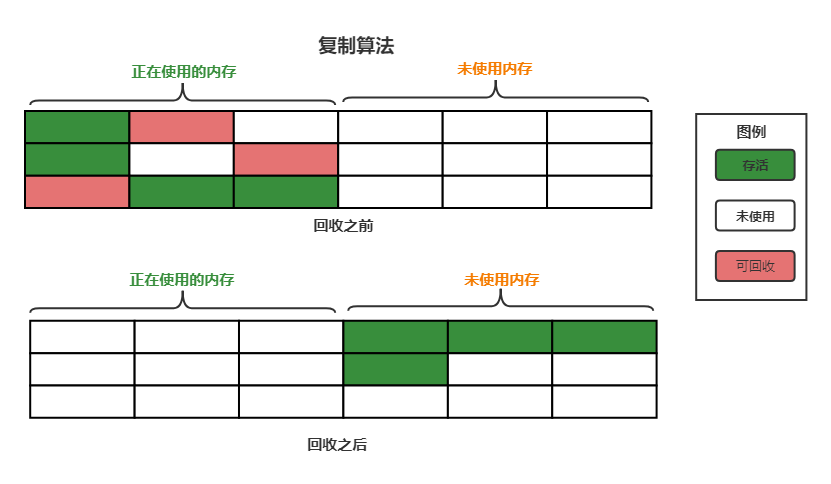
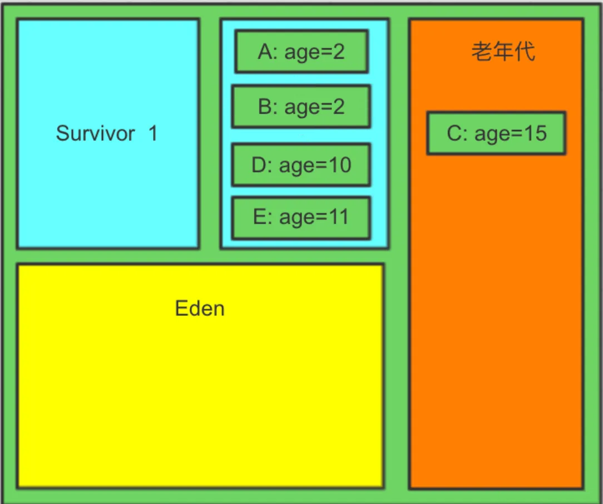
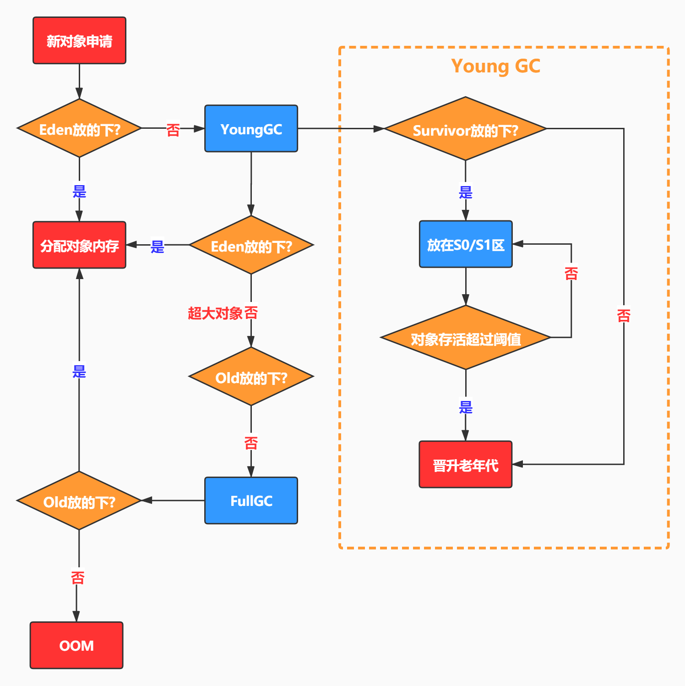

# Java 虚拟机的年轻代，为什么要划分两个 Survivor 区？

在Java虚拟机（JVM）的年轻代（Young Generation）中，划分两个Survivor区（通常称为S0和S1）是为了**优化垃圾回收（Garbage Collection, GC）的效率**，尤其是通过**复制算法（Copying Algorithm）**来减少内存碎片、降低GC停顿时间，并高效管理对象的存活周期。以下是具体原因和实现逻辑：

---

### **1. 复制算法**

年轻代的设计目标是**快速回收短生命周期对象**。复制算法的核心思想是：

+ **内存分为两块（如S0和S1）**，每次GC只使用其中一块（例如S0）。
+ 当触发Minor GC时，存活的对象会从Eden区和当前使用的Survivor区（如S0）**复制到另一个空闲的Survivor区（如S1）**。
+ 复制完成后，直接清空原Survivor区（S0）和Eden区，避免内存碎片。

**优势：**

+ **内存无碎片**：每次复制后，存活对象在目标Survivor区中连续存放，无需处理碎片。
+ **快速回收**：仅需遍历存活对象并复制，时间复杂度为O(存活对象数量)，而非O(堆大小)。
+ **空间局部性**：存活对象连续存放，提高缓存命中率。

---

### **2. 对象年龄的渐进式晋升**

JVM通过**分代年龄（Age）**机制决定对象何时晋升到老年代：

+ 对象每在年轻代存活一次Minor GC，年龄加1。
+ 默认当年龄达到阈值（如15）时，对象晋升到老年代。

**两个Survivor区的作用：**

+ **交替复制**：每次Minor GC时，存活对象在两个Survivor区之间复制，年龄逐步增加。
+ **过滤短期对象**：大部分对象在几次Minor GC后死亡，只有长期存活的对象才会晋升到老年代，减少老年代GC压力。

---

### **3. 内存利用率优化**
若仅使用一个Survivor区：

+ **内存浪费**：每次GC后，存活对象需占用整个Survivor区，可能导致内存浪费。
+ **碎片问题**：多次GC后，Survivor区可能产生碎片，降低内存使用效率。

使用两个Survivor区：

+ **动态平衡**：每次GC后，存活对象被压缩到另一个Survivor区，保证内存紧凑。
+ **内存利用率最大化**：两个Survivor区的总大小固定（如年轻代的1/10），交替使用确保空间高效分配。

---

### **4. 具体流程示例**

1. **对象分配**：
    - 新对象分配在Eden区。
    - 当Eden区满时，触发Minor GC。
2. **Minor GC过程**：
    - 存活对象从Eden区和当前Survivor区（如S0）复制到另一个Survivor区（S1）。
    - 对象年龄加1，年龄达标（如15）的对象晋升到老年代。
    - 清空Eden区和S0。
3. **Survivor区切换**：
    - 下次GC时，存活对象从Eden和S1复制到S0，循环往复。

---

### **5. 为什么不能只有一个Survivor区？**
+ **内存碎片**：多次GC后，存活对象分散在Survivor区，产生碎片。
+ **复制效率低**：若仅有一个Survivor区，需额外空间存放存活对象，导致内存浪费。
+ **晋升机制失效**：无法通过交替复制逐步增加对象年龄，可能提前晋升大量对象到老年代。

---

### **总结**
划分两个Survivor区的核心目的是：

1. **利用复制算法高效回收内存**，避免碎片。
2. **通过年龄分阶段筛选对象**，减少老年代GC压力。
3. **优化内存利用率**，平衡性能与资源消耗。

这种设计是JVM对“**弱分代假说（Weak Generational Hypothesis）**”的实践，即大部分对象生命周期短暂，通过年轻代的高效回收机制显著提升GC效率。

> 更新: 2025-05-28 21:28:00  
> 原文: <https://www.yuque.com/tulingzhouyu/db22bv/vuzh472dhqz50xyh>