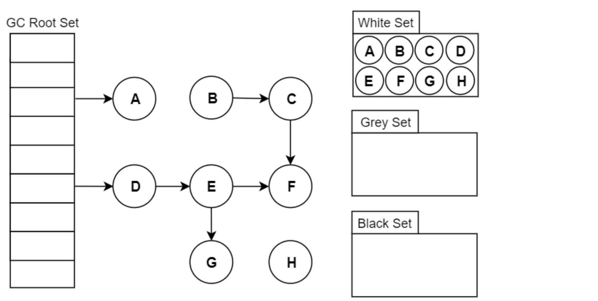
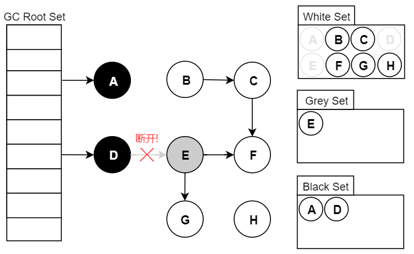
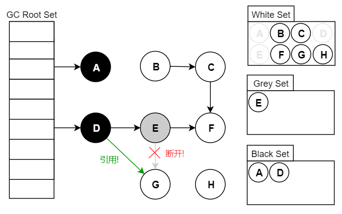

# 💎 Jvm面试题合集

# 如何判断对象可以被回收
在Java中，对象是否可以被回收通常由垃圾回收器决定。垃圾回收器使用一种称为"**可达性分析**"的算法来确定对象是否可被回收。可达性分析是指如果一个对象无法从任何**GC Roots**直接或间接访问到，它就被认为是不可达的，可以被垃圾回收。

GC Roots是一组特殊的引用，它们被认为是程序中可访问对象的**起始点**，即从这些引用开始，可以追踪到所有仍然被程序引用的对象。

GC Roots通常包括以下几种类型的引用：

+ **局部变量引用**：在方法中定义的局部变量，包括方法的参数和局部变量，通常被视为GC Roots。这些变量的引用指向了对象的实例。
+ **活动线程引用**：正在运行的线程的引用通常被视为GC Roots。线程本地存储中的对象也是如此。
+ **静态变量引用**：静态变量是类的一部分，它们的引用也被视为GC Roots。静态变量存在于类加载器的内存中。
+ **JNI 引用**：通过Java Native Interface（JNI）创建的本地代码引用也可以被视为GC Roots。这些引用连接了Java堆内存和本地代码的内存。
+ **虚拟机引导类加载器**：虚拟机内部使用的类加载器引用也是GC Roots。它们通常是一些核心类或库。

# 什么是三色标记
## 1.前言
三色标记算法，用于垃圾回收器升级，将STW变为并发标记。STW就是在标记垃圾的时候，必须暂停程序，而使用并发标记，就是程序一边运行，一边标记垃圾。

## 2. 三色标记算法
### 2.1.什么是三色：
首先我们需要知道三色标记法就是根据可达性分析，从GC Roots开始进行遍历访问，在遍历对象过程中，按“是否检查过”这个条件将对象标记成三种颜色：

+ **黑色**： **代表对象已经检查过，且成员对象也被检查过了**。如果有其他对象引用指向了黑色对象，无须重新检查一遍。黑色对象不可能直接（不经过灰色对象）指向某个白色对象。 
+ **灰色**：**代表对象已经检查过，但成员还没全部检查完成**。 
+ **白色**：**代表对象没有被检查**。 在可达性分析刚刚开始的阶段， 所有的对象都是白色的， 若在分析结束的阶段， 仍然是白色的对象， 即代表不可达。 

### 2.2.三色标记过程：

假设现在有白、灰、黑三个集合（表示当前对象的颜色），其遍历访问过程为：

1. 初始时，所有对象都在【白色集合】中；
2. 将 GC Roots直接引用到的对象挪到【灰色集合】中；
3. 从灰色集合中获取对象：

3.1. 将本对象引用到的其他对象全部挪到【灰色集合】中； 

3.2. 将本对象挪到【黑色集合】里面。

4. 重复步骤3，直至【灰色集合】为空时结束。
5. 结束后，仍在【白色集合】的对象即为GC Roots不可达，可以进行回收。

需要注意，传统标记方式发生Stop The World时，对象间的引用是不会发生变化的，可以轻松完成标记。

而并发标记在标记期间应用线程还在继续跑，对象间的引用可能发生变化，就会出现错标和漏标的情况就有可能发生。

## 3.存在的问题
### 3.1.浮动垃圾：标记过不是垃圾的，变成了垃圾
并发标记的过程中，若一个已经被标记成黑色或者灰色的对象，突然变成了垃圾，此时，此对象不是白色的不会被清除，重新标记也不能从GC Root中去找到，所以成为了浮动垃圾，这种情况对系统的影响不大，留给下一次GC进行处理即可。

### 3.2.对象漏标问题：需要的对象被回收
并发标记的过程中，一个业务线程将一个未被扫描过的白色对象断开引用成为垃圾（删除引用），同时黑色对象引用了该对象（增加引用）（这两部可以不分先后顺序）；

因为黑色对象的含义为其属性都已经被标记过了，重新标记也不会从黑色对象中去找，导致该对象被程序所需要，却又要被GC回收，此问题会导致系统出现问题。

## 4.总结
三色标记算法是根可达算法的一种实现方案，其目的是为了找出所有可达对象。三色标记算法会产生多标和漏标问题，其中漏标问题最严重。漏标问题会导致本该存活的对象被回收，从而导致严重的程序问题。

# 什么是TLAB
TLAB是Java虚拟机中的一种优化技术，用于提高对象分配的效率。它是一种线程本地的内存分配缓冲区，每个线程在堆上都有自己独立的TLAB。

在Java中，对象的分配通常是通过在堆上分配内存来完成的。为了提高对象分配的效率，Java虚拟机引入了TLAB机制。TLAB会为每个线程预先分配一块内存空间，线程在分配对象时，会从自己的TLAB中进行分配，而不是直接在堆上进行分配。

TLAB的优点有以下几个：

+ 减少线程同步：由于每个线程都有自己的TLAB，因此不需要进行线程同步操作，可以减少线程竞争和锁的开销。
+ 提高分配速度：由于对象分配是在TLAB中进行的，而不是在堆上进行，因此可以减少对象分配的开销，提高分配速度。
+ 提高局部性：由于每个线程都有自己的TLAB，对象分配在TLAB中进行，可以提高局部性，减少对共享内存的访问，提高缓存命中率。

需要注意的是，TLAB的大小是可以配置的，可以根据实际应用的需求进行调整。过小的TLAB可能会导致频繁的垃圾回收，而过大的TLAB可能会浪费内存空间。

总结来说，TLAB是Java虚拟机中的一种优化技术，用于提高对象分配的效率。每个线程都有自己的TLAB，对象分配在TLAB中进行，可以减少线程同步、提高分配速度和提高局部性。TLAB的大小可以配置，需要根据实际需求进行调整。

> 更新: 2025-06-08 21:52:34  
> 原文: <https://www.yuque.com/tulingzhouyu/db22bv/wn5gggtb3uqsehng>