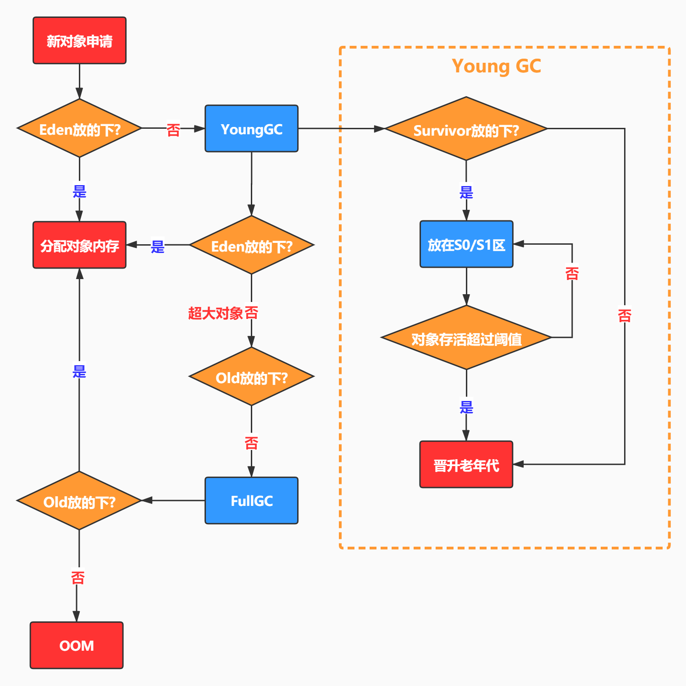

# 没有发生oom，但是老年代在缓慢的增长，你认为可能是什么原因

其实这道面试题主要是考察大家对对象晋升老年代的条件是否了解，知道了晋升的条件，回答起来也就简单了，接下来我们一起看看

## 一、对象进入老年代的条件（何时才会进入老年代）

### 1. 存活时间（年龄阈值）
+ **新生代“Eden”和“Survivor”区：**
    - 新对象首先分配在Eden区，每经历一次Minor GC，没被回收的对象会进入Survivor区（From/To）。
    - 每在Survivor区经历一次GC，年龄+1；达到一定年龄阈值（如默认15，能通过参数`MaxTenuringThreshold`调整）后会晋升到老年代。

### 2. Survivor区放不下
+ 如果发生Minor GC时，Survivor区无法容纳所有幸存对象，这些对象会被提前晋升到老年代，称为“空间分配担保”。

### 3. 大对象直接进入老年代
+ 一些大对象（如字节数组、巨型缓存），如果超过一定阈值（可通过`PretenureSizeThreshold`设置），会直接分配到老年代，避免新生代频繁GC造成复制开销。

### 4. 动态年龄判断
+ JVM中可能发生“动态年龄判定”：如当前Survivor区已经有相同年龄的对象总大小超了一半，低于该年龄的对象也会整体晋升到老年代。

### 5. 持有强引用并长时间未被回收
+ 存在被“强引用”持有、长时间无法被GC释放的对象（如静态变量、全局集合等），会随着时间推移最终不断晋升进入老年代。

---

## 二、结合进入机制分析老年代缓慢增长的原因
### 对应上面机制，缓慢增长的常见情形有：
1. **大量长生命周期对象正常晋升**
    - 例如全局缓存、线程池、Session数据或业务上确实需要持续存在的大对象，这些自然会“搬家”到老年代，GC也无法主动回收。
2. **内存泄漏导致活动对象不断晋升**
    - 比如静态集合、缓存、Listener、ThreadLocal等，引用没有及时清理，导致已不用的对象随着GC不断晋升并长期存活。
3. **频繁出现大对象直接分配到老年代**
    - 某些请求、场景下会产生巨型数组、缓冲区，JVM为了避免频繁复制直接将其放到老年代，清理不及时会造成缓慢积压。
4. **Survivor区太小，触发“空间分配担保”**
    - 有很多短命对象，但Survivor太小，只好提前把年轻对象搬到老年代，加速老年代堆积。
5. **GC策略与参数不佳**
    - 比如`MaxTenuringThreshold`太低（晋升年龄低），大量对象还没“活够”就被迁移到老年代；或者新生代、Survivor比例过小，促使频繁提前晋升。

---

## 总结与建议
1. **老年代缓慢增长本质上就是“有越来越多无法被GC回收的对象不断晋升”。**
2. **这些对象要么本来就是长命对象、要么被误引用、要么被GC策略误晋升。**
3. **优先排查：**
    - 代码中缓存相关、全局静态变量、Listener回收、线程池等实现
    - Survivor空间设置和最大晋升年龄等JVM参数
    - 是否有大量大对象直接分配到老年代
    - 通过heap dump、MAT等工具，观察老年代增长的具体类型

> 更新: 2025-05-28 20:13:41  
> 原文: <https://www.yuque.com/tulingzhouyu/db22bv/ahp2rce6x25wu4xf>