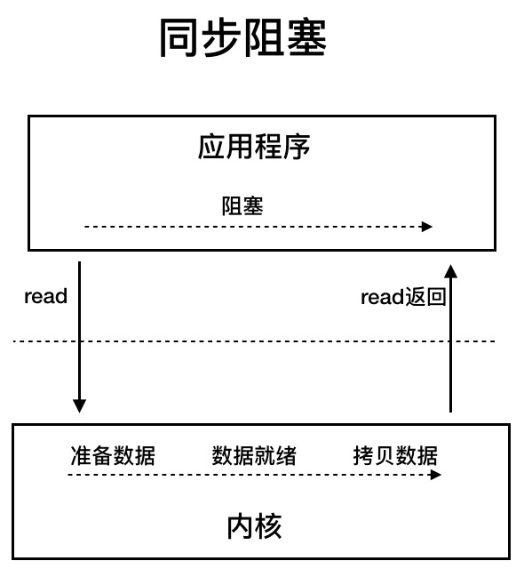
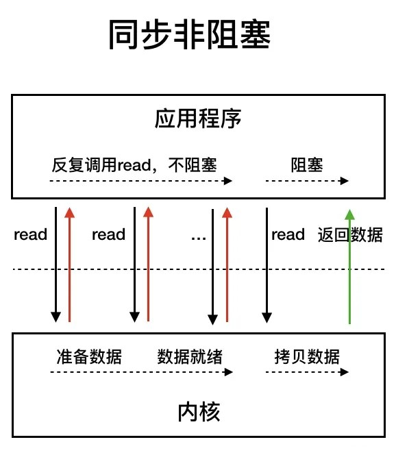
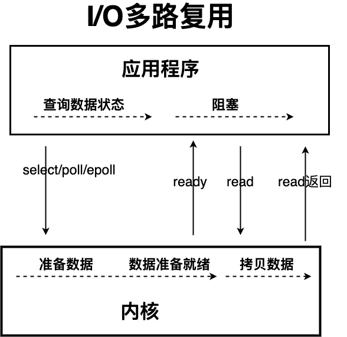
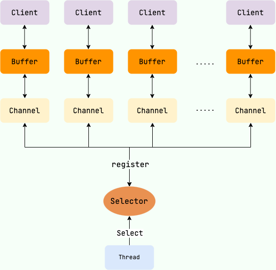
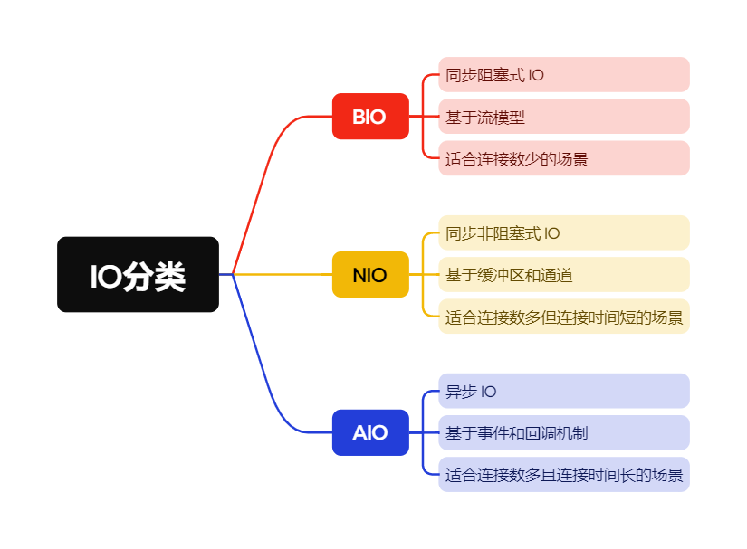

# BIO、NIO、AIO 之间的区别

## BIO (Blocking I/O)
BIO 属于同步阻塞 IO 模型 。

同步阻塞 IO 模型中，应用程序发起 read 调用后，会一直阻塞，直到内核把数据拷贝到用户空间。

在客户端**连接数量不高**的情况下，是没问题的。但是，当面对十万甚至百万级连接的时候，传统的 BIO 模型是无能为力的。因此，我们需要一种更高效的 I/O 处理模型来应对更高的并发量。

## NIO (Non-blocking/New I/O)
Java 中的 NIO 于 Java 1.4 中引入，对应 java.nio 包，提供了 Channel , Selector，Buffer 等抽象。

NIO 中的 N 可以理解为 Non-blocking，不单纯是 New。它是**支持面向缓冲**的，**基于通道**的 I/O 操作方法。 对于高负载、高并发的（网络）应用，应使用 NIO 。

Java 中的 NIO 可以看作是 I/O 多路复用模型。也有很多人认为，Java 中的 NIO 属于同步非阻塞 IO 模型。

跟着我的思路往下看看，相信你会得到答案！

我们先来看看 同步非阻塞 IO 模型。

同步非阻塞 IO 模型中，应用程序会一直发起 read 调用，等待数据从**内核空间拷贝到用户空间**的这段时间里，线程**依然是阻塞的**，直到在内核把数据拷贝到用户空间。

相比于同步阻塞 IO 模型，同步非阻塞 IO 模型确实有了很大改进。通过轮询操作，避免了一直阻塞。

但是，这种 IO 模型同样存在问题：应用程序不断进行 I/O 系统调用轮询数据是否已经准备好的过程是**十分消耗 CPU 资源**的。

这个时候，I/O 多路复用模型 就上场了。

IO 多路复用模型中，线程首先发起 select 调用，询问内核数据是否准备就绪，等内核把数据准备好了，用户线程再发起 read 调用。

read 调用的过程（数据从内核空间 -> 用户空间）还是阻塞的。

+ 目前支持 IO 多路复用的系统调用，有 select，epoll 等等。select 系统调用，目前几乎在所有的操作系统上都有支持。
    - select 调用：内核提供的系统调用，它支持一次查询多个系统调用的可用状态。几乎所有的操作系统都支持。
    - epoll 调用：linux 2.6 内核，属于 select 调用的增强版本，优化了 IO 的执行效率。

**IO** **多路复用模型，通过减少无效的系统调用，减少了对 CPU 资源的消耗。**

Java 中的 NIO ，有一个非常重要的选择器 ( Selector ) 的概念，也可以被称为 多路复用器。通过它，只需要一个线程便可以管理多个客户端连接。当客户端数据到了之后，才会为其服务。

Buffer、Channel和Selector三者之间的关系如下：

## AIO (Asynchronous I/O)
AIO 也就是 NIO 2。Java 7 中引入了 NIO 的改进版 NIO 2,它是异步 IO 模型。

异步 IO 是基于事件和回调机制实现的，也就是应用操作之后会直接返回，不会堵塞在那里，当后台处理完成，操作系统会通知相应的线程进行后续的操作。

## 总结
最后，来一张图，简单总结一下 Java 中的 BIO、NIO、AIO。

> 更新: 2024-12-11 16:36:30  
> 原文: <https://www.yuque.com/tulingzhouyu/db22bv/ebyqq248o1x34zlc>