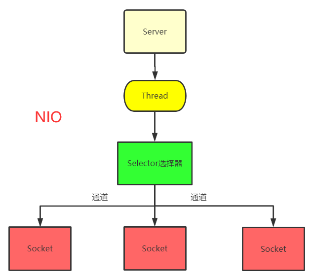
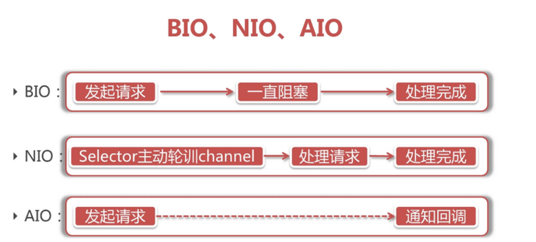

# 短视频

如果你不是计算机科班没有学过网络，那可能会对BIO、NIO、AIO这些概念一头雾水。哈喽大家好我是徐庶，来用大白话给大家解释一下。

首先是**BIO**它是一种传统的**阻塞 I/O 模型**。举个例子， 就像你去餐厅吃饭，服务员一个接一个地接待客人。如果有一个客人点的菜很多或者吃得很慢，服务员就得一直等着，不能去接待其他客人。这就类似BIO模型，每个客户端请求都需要一个独立的线程来处理，如果请求处理时间长，就会阻塞线程，导致服务器资源消耗大，性能受限，当然可以通过线程池机制改善。

然后**NIO**就诞生了，它是一种**非阻塞 I/O 模型**，在JDK1.4的时候引入。这种模型服务器可以用一个或少量线程来处理所有的客户端请求，客户端发送的连接请求都会注册到多路复用器上，多路复用器轮询所有连接有I/O请求就进行处理。

就像你去一个自助餐厅吃饭一样，服务员不会一直站在你旁边，而是会间歇性地来查看你是否需要帮助。如果你需要服务，举手示意，服务员就会过来帮你。这里的服务员就是多路复用器，可以为多个客户服务。NIO模型的优点是可以处理大量客户端连接，不需要为每个请求创建一个线程，资源利用效率高，适用于高并发场景。

最后还有**AIO**，它是一种**异步 I/O 模型**，在JDK7的时候引入。在这种模型下，操作是异步执行的，当操作完成后会采用自动回调的方式通知服务器。

就像你去一个高级餐厅一样，点完菜后服务员告诉你，菜好了会通知你，不需要你一直等着。然后你可以自由活动，当菜做好了，服务员会直接通知你来取。

这样一来，服务器在发起一个 I/O 操作后，不用等待其完成，而是继续处理其他事情，操作完成后会通过回调机制通知服务器。AIO模型的优点是更加高效，因为服务器在等待 I/O 操作时可以做其他事情，适用于高负载和高性能要求的场景。

最后给这三种模型分别总结一句话就是：

+ BIO：每个请求一个线程，挨个处理，简单但性能有限。
+ NIO： 多路复用器轮询所有连接有I/O请求就进行处理。提高性能。
+ AIO：异步执行，完成后通知，提高资源利用率和响应速度。

最后呢 通过一个简单聊天室功能,给大家整理了这3种模式的Java代码示例， 大家需要的可以在评论区扣666进行获取。

代码：[https://gitee.com/xscodeit/bio-nio-aio-demo.git](https://gitee.com/xscodeit/bio-nio-aio-demo.git)

> 更新: 2024-05-27 15:21:27  
> 原文: <https://www.yuque.com/tulingzhouyu/db22bv/myecbvscgqv6rasz>