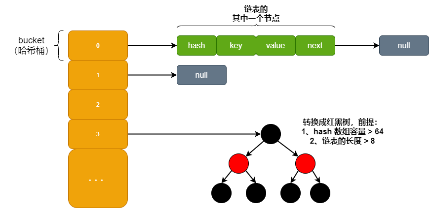
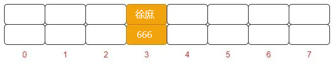
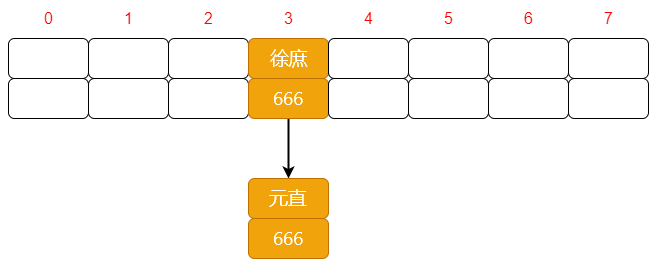
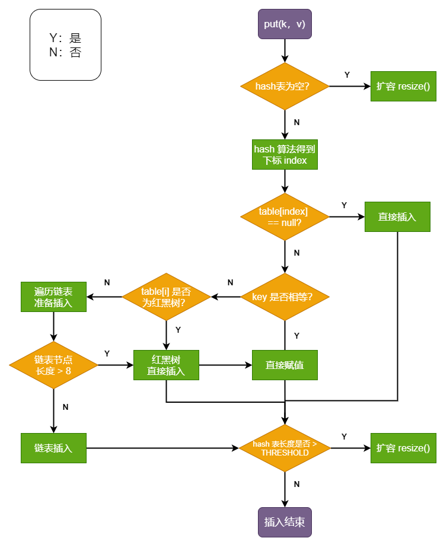
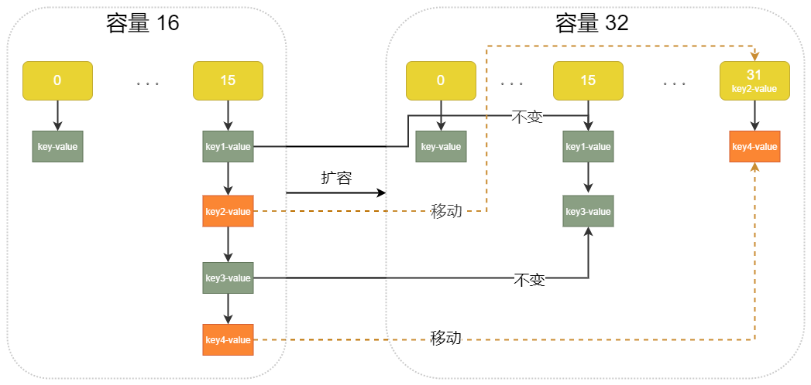
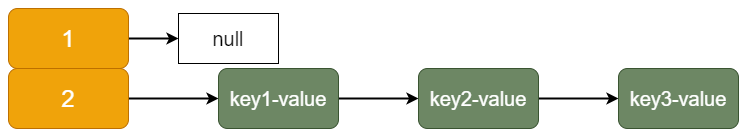
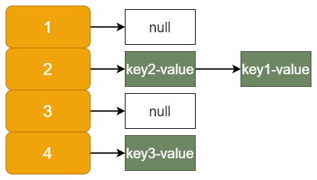
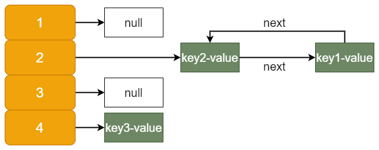

# HashMap底层原理常见面试题

### <font style="color:#595959;">1、HashMap 的底层数据结构</font>
在 **<font style="color:#74B602;">JDK 1.7 </font>**中 HashMap 是以**「数组加链表」**的形式组成的，**<font style="color:#DF2A3F;">JDK 1.8</font>** 之后新增了**「红黑树」**的组成结构，**「当链表长度大于 8 并且 hash 桶的容量大于 64 时，链表结构会转换成红黑树结构」**。所以，它的组成结构如下图所示：



底层数据结构

HashMap 中数组的每一个元素又称为哈希桶，也就是 key-value 这样的实例。在 **<font style="color:#74B602;">Java7</font>** 中叫 Entry，**<font style="color:#DF2A3F;">Java8</font>** 中叫 Node。

因为它本身所有的位置都为 null，在 put 插入的时候会根据 key 的 hash 去计算一个 index 值。比如，我 put （"徐庶"，666），在 HashMap 中插入 "徐庶" 这个元素，通过 hash 算法算出 index 位置是 3。这时的结构如下所示，还是个数组。



初次 put

以上没 hash 冲突时，若发生 hash 冲突就得引入链表啦。假设我再次 put （"元直"，666），在 HashMap 中插入 "元直" 这个元素，通过 hash 算法算出 index 位置也是 3。这时的结构如下所示：形成了链表。



再次 put，发生 hash 冲突

它的源码如下所示：**「可以看出每个哈希桶中包含了四个字段：hash、key、value、next，其中 next 表示链表的下一个节点」**。

```java
static class Node < K, V > implements Map.Entry < K, V > {
    final int hash;
    final K key;
    V value;
    Node < K,
    V > next;

    ...
}
```

:::danger
**<font style="color:#dec6fb;">❝</font>**

<font style="color:rgb(89, 89, 89);">JDK 1.8 之所以添加红黑树是因为一旦链表过长，会严重影响 HashMap 的性能，而红黑树具有快速增删改查的特点，这样就可以有效的解决链表过长时操作比较慢的问题。</font>

<font style="color:#dec6fb;">❞</font>

:::

### <font style="color:#595959;">2、HashMap 的重要方法</font>
PS：以下源码分析全部基于 JDK1.8 版本。

#### <font style="color:black;">查询（get 方法）</font>
源码如下：

```java
public V get(Object key) {
Node < K, V > e;
// 对 key 进行哈希操作
return (e = getNode(hash(key), key)) == null ? null : e.value;
}

final Node < K, V > getNode(int hash, Object key) {
    Node < K, V > [] tab;
    Node < K, V > first, e;
    int n;
    K k;
    // 非空判断
    if ((tab = table) != null && (n = tab.length) > 0 &&
        (first = tab[(n - 1) & hash]) != null) {
        // 判断第一个元素是否是要查询的元素
        // always check first node
        if (first.hash == hash && 
            ((k = first.key) == key || (key != null && key.equals(k))))
            return first;
        // 下一个节点非空判断
        if ((e = first.next) != null) {
            // 如果第一节点是树结构，则使用 getTreeNode 直接获取相应的数据
            if (first instanceof TreeNode)
                return ((TreeNode < K, V > ) first).getTreeNode(hash, key);
            do { // 非树结构，循环节点判断
                // hash 相等并且 key 相同，则返回此节点
                if (e.hash == hash &&
                    ((k = e.key) == key || (key != null && key.equals(k))))
                    return e;
            } while ((e = e.next) != null);
        }
    }
    return null;
}
```

代码注释已经很详细，强调一点：当哈希冲突时我们不仅需要判断 hash 值，还需要通过判断 key 值是否相等，才能确认此元素是不是我们想要的元素。

#### <font style="color:black;">新增（put 方法）</font>
源码如下：

```java
public V put(K key, V value) {
    // 对 key 进行哈希操作
    return putVal(hash(key), key, value, false, true);
}

final V putVal(int hash, K key, V value, boolean onlyIfAbsent,
               boolean evict) {
    Node < K, V > [] tab;
    Node < K, V > p;
    int n, i;
    // 哈希表为空则创建表
    if ((tab = table) == null || (n = tab.length) == 0)
        n = (tab = resize()).length;
    // 根据 key 的哈希值计算出要插入的数组索引 i
    if ((p = tab[i = (n - 1) & hash]) == null)
        // 如果 table[i] 等于 null，则直接插入
        tab[i] = newNode(hash, key, value, null);
    else {
        Node < K, V > e;
        K k;
        // 如果 key 已经存在了，直接覆盖 value
        if (p.hash == hash &&
            ((k = p.key) == key || (key != null && key.equals(k))))
            e = p;
            // 如果 key 不存在，判断是否为红黑树
        else if (p instanceof TreeNode)
            // 红黑树直接插入键值对
            e = ((TreeNode < K, V > ) p).putTreeVal(this, tab, hash, key, value);
        else {
            // 为链表结构，循环准备插入
            for (int binCount = 0;; ++binCount) {
                // 下一个元素为空时
                if ((e = p.next) == null) {
                    p.next = newNode(hash, key, value, null);
                    // 转换为红黑树进行处理
                    if (binCount >= TREEIFY_THRESHOLD - 1) // -1 for 1st
                        treeifyBin(tab, hash);
                    break;
                }
                //  key 已经存在直接覆盖 value
                if (e.hash == hash &&
                    ((k = e.key) == key || (key != null && key.equals(k))))
                    break;
                p = e;
            }
        }
        // existing mapping for key
        if (e != null) { 
            V oldValue = e.value;
            if (!onlyIfAbsent || oldValue == null)
                e.value = value;
            afterNodeAccess(e);
            return oldValue;
        }
    }
    ++modCount;
    // 超过最大容量，扩容
    if (++size > threshold)
        resize();
    afterNodeInsertion(evict);
    return null;
}
```

注释已经很详细了。但新增的方法比较复杂，画个流程图方便方便各位理解：



put 流程

#### <font style="color:black;">扩容（resize 方法）</font>
源码如下：

```plain
final Node < K, V > [] resize() {
    // 扩容前的数组
    Node < K, V > [] oldTab = table;
    // 扩容前的数组的大小和阈值
    int oldCap = (oldTab == null) ? 0 : oldTab.length;
    int oldThr = threshold;
    // 预定义新数组的大小和阈值
    int newCap, newThr = 0;
    if (oldCap > 0) {
        // 超过最大值就不再扩容了
        if (oldCap >= MAXIMUM_CAPACITY) {
            threshold = Integer.MAX_VALUE;
            return oldTab;
        }
        // 扩大容量为当前容量的两倍，但不能超过 MAXIMUM_CAPACITY
        else if ((newCap = oldCap << 1) < MAXIMUM_CAPACITY &&
            oldCap >= DEFAULT_INITIAL_CAPACITY)
            newThr = oldThr << 1; // double threshold
    }
    // 当前数组没有数据，使用初始化的值
    else if (oldThr > 0) // initial capacity was placed in threshold
        newCap = oldThr;
    else { // zero initial threshold signifies using defaults
        // 如果初始化的值为 0，则使用默认的初始化容量
        newCap = DEFAULT_INITIAL_CAPACITY;
        newThr = (int)(DEFAULT_LOAD_FACTOR * DEFAULT_INITIAL_CAPACITY);
    }
    // 如果新的容量等于 0
    if (newThr == 0) {
        float ft = (float) newCap * loadFactor;
        newThr = (newCap < MAXIMUM_CAPACITY && ft < (float) MAXIMUM_CAPACITY ?
            (int) ft : Integer.MAX_VALUE);
    }
    threshold = newThr;
    @SuppressWarnings({
        "rawtypes",
        "unchecked"
    })
    Node < K, V > [] newTab = (Node < K, V > []) new Node[newCap];
    // 开始扩容，将新的容量赋值给 table
    table = newTab;
    // 原数据不为空，将原数据复制到新 table 中
    if (oldTab != null) {
        // 根据容量循环数组，复制非空元素到新 table
        for (int j = 0; j < oldCap; ++j) {
            Node < K, V > e;
            if ((e = oldTab[j]) != null) {
                oldTab[j] = null;
                // 如果链表只有一个，则进行直接赋值
                if (e.next == null)
                    newTab[e.hash & (newCap - 1)] = e;
                else if (e instanceof TreeNode)
                    // 红黑树相关的操作
                    ((TreeNode < K, V > ) e).split(this, newTab, j, oldCap);
                else { // preserve order
                    // 链表复制，JDK 1.8 扩容优化部分
                    // 如果节点不为空，且为单链表，则将原数组中单链表元素进行拆分
                    Node < K, V > loHead = null, loTail = null;//保存在原有索引的链表
                    Node < K, V > hiHead = null, hiTail = null;//保存在新索引的链表
                    Node < K, V > next;
                    do {
                        next = e.next;
                        // 哈希值和原数组长度进行 & 操作，为 0 则在原数组的索引位置
                        if ((e.hash & oldCap) == 0) {
                            if (loTail == null)
                                loHead = e;
                            else
                                loTail.next = e;
                            loTail = e;
                        }
                        // 原索引 + oldCap
                        else {
                            if (hiTail == null)
                                hiHead = e;
                            else
                                hiTail.next = e;
                            hiTail = e;
                        }
                    } while ((e = next) != null);
                    // 将原索引放到哈希桶中
                    if (loTail != null) {
                        loTail.next = null;
                        newTab[j] = loHead;
                    }
                    // 将原索引 + oldCap 放到哈希桶中
                    if (hiTail != null) {
                        hiTail.next = null;
                        newTab[j + oldCap] = hiHead;
                    }
                }
            }
        }
    }
    return newTab;
}
```

从以上源码可以看出，扩容主要分两步：

+ 扩容：创建一个新的 Entry 空数组，长度是原数组的 2 倍。
+ 位运算：原来的元素哈希值和原数组长度进行 & 运算。

JDK 1.8 在扩容时并没有像 JDK 1.7 那样，重新计算每个元素的哈希值，而是通过高位运算（e.hash & oldCap）来确定元素是否需要移动，假设 key1 的信息如下：

+ key1.hash = 10；二进制：0000 1010
+ oldCap = 16；二进制：0001 0000

**「使用 e.hash & oldCap 得到的结果，高一位为 0，当结果为 0 时表示元素在扩容时位置不会发生任何变化」**，而假设 key 2 信息如下：

+ key2.hash = 17；二进制：0001 0001
+ oldCap = 16；二进制：0001 0000

**「这时候得到的结果，高一位为 1，当结果为 1 时，表示元素在扩容时位置发生了变化，新的下标位置等于原下标位置 + 原数组长度」**，如下图所示：key2、kry4 虚线为移动的位置。



扩容

### <font style="color:#595959;">3、HashMap 有哪些属性？</font>
如下，看代码注释，写的很清楚了。

```java
// HashMap 初始化长度
static final int DEFAULT_INITIAL_CAPACITY = 1 << 4; // aka 16

// HashMap 最大长度
static final int MAXIMUM_CAPACITY = 1 << 30; // 1073741824

// 默认的加载因子 (扩容因子)
static final float DEFAULT_LOAD_FACTOR = 0.75f;

// 当链表长度大于此值且数组长度大于 64 时，会从链表转成红黑树
static final int TREEIFY_THRESHOLD = 8;

// 转换链表的临界值，当元素小于此值时，会将红黑树结构转换成链表结构
static final int UNTREEIFY_THRESHOLD = 6;

// 最小树容量
static final int MIN_TREEIFY_CAPACITY = 64;
```

### <font style="color:#595959;">4、为什么 HashMap 的初始化长度是 16 ？（必须是2的幂次方）</font>
前面说过，从 Key 映射到 HashMap 数组的对应位置，会用到一个 Hash 函数，比如：index = Hash ("徐庶")

注意到 HashMap 初始化长度用的是 1<<4，而不是直接写 16。这是为啥呢？其实这样是为了位运算的方便，**「位与运算比算数计算的效率高太多了，之所以选择 16，是为了服务将 Key 映射到 index 的算法」**。

那如何实现一个尽量均匀分布的 Hash 函数呢？从而减少 HashMap 碰撞呢？没错，就是通过 Key 的 HashCode 值来做位运算。

有公式（Length 是 HashMap 的长度）：**「HashCode（Key） & （Length- 1）」**

我举个例子，key 为 "book" 的十进制为 3029737 那二进制就是 101110001110101110 1001 HashMap 长度是默认的 16，length - 1 的结果。十进制 : 15；二进制 : 1111

把以上两个结果做与运算：101110001110101110 1001 & 1111 = 1001；1001 的十进制 = 9, 所以 index=9。

 

:::danger
<font style="color:#000000;">也就是说：</font>**<font style="color:#000000;">「hash 算法最终得到的 index 结果，取决于 hashcode 值的最后几位」</font>**

:::

 

:::danger
<font style="color:#000000;">你可以试试把长度指定为 10 以及其他非 2 次幂的数字，做位运算。发现 index 出现相同的概率大大升高。而长度 16 或者其他 2 的幂，length - 1 的值是所有二进制位全为 1, 这种情况下，index 的结果等同于 hashcode 后几位的值，只要输入的 hashcode 本身分布均匀，hash 算法的结果就是均匀的</font>

:::

**「所以，HashMap 的默认长度为 16，是为了降低 hash 碰撞的几率」**。

### <font style="color:#595959;">5、为什么树化是 8，退树化是 6？</font>
红黑树平均查找长度为 log (n)，长度为 8 时，查找长度为 3，而链表平均查找长度为 n/2；也就是 8 除以 2；查找长度链表大于树，转化为树，效率更高。

当为 6 时，树：2.6；链表：3。链表 > 树。这时理应也还是树化，但是树化需要时间，为了这点效率牺牲时间是不划算的。

### <font style="color:#595959;">6、什么是加载因子？加载因子为什么是  0.75 ？</font>
前面说了扩容机制。那什么时候扩容呢？这就取决于原数组长度和加载因子两个因素了。


:::danger
<font style="color:rgb(89, 89, 89);">加载因子也叫扩容因子或负载因子，用来判断什么时候进行扩容的，假如加载因子是 0.5，HashMap 的初始化容量是 16，那么当 HashMap 中有 16*0.5=8 个元素时，HashMap 就会进行扩容。</font>

:::

那加载因子为什么是 0.75 而不是 0.5 或者 1.0 呢？这其实是出于容量和性能之间平衡的结果：

+ 上面说到，为了提升扩容效率，HashMap 的容量（capacity）有一个固定的要求，那就是一定是 2 的幂。所以，如果负载因子是 3/4 的话，那么和 capacity 的乘积结果就可以是一个整数
+ 当加载因子设置较大时，扩容门槛提高，扩容发生频率低，占用的空间小，但此时发生 Hash 冲突的几率就会提升，因此需要更复杂的数据结构来存储元素，这样对元素的操作时间就会增加，运行效率也会降低；
+ 当加载因子设置较小时，扩容门槛降低，会占用更多的空间，此时元素的存储就比较稀疏，发生哈希冲突的可能性就比较小，因此操作性能会比较高。

**「所以综合了以上情况就取了一个 0.5 到 1.0 的平均数 0.75 作为加载因子」**。

### <font style="color:#595959;">7、HashMap 是线程安全的么？</font>
不是，因为 get 和 put 方法都没有上锁。**「多线程操作无法保证：此刻 put 的值，片刻后 get 还是相同的值，会造成线程安全问题」**。

还有个 HashTable 是线程安全的，但是加锁的粒度太大。并发度很低，最多同时允许一个线程访问，性能不高。一般我们使用 currentHashMap。

### <font style="color:#595959;">8、为什么重写 equals 方法的时，需要重写 hashCode 方法呢？</font>
 

:::danger
<font style="color:#000000;">Java 中，所有的对象都是继承于 Object 类。Ojbect 类中有两个方法 equals、hashCode，这两个方法都是用来比较两个对象是否相等的。</font>

:::

<font style="color:rgb(89, 89, 89);background-color:rgb(246, 238, 255);"></font>

先来看看 equals 方法：

```java
public boolean equals(Object obj) {
return (this == obj);
}
```

在未重写 equals 方法，他其实就是 == 。有以下两个特点：

+ 对于值对象，== 比较的是两个对象的值
+ 对于引用对象，== 比较的是两个对象的地址

看回 put 方法的源码：**「HashMap 是通过 key 的 hashcode 去寻找地址 index 的。如果 index 一样就会形成链表」**，也即是 "徐庶" 和 "元直" 是有可能在同一个位置上。

前面的 get 方法说过：**「当哈希冲突时我们不仅需要判断 hash 值，还需要通过判断 key 值是否相等，才能确认此元素是不是我们想要的元素」**。我们去 get 首先是找到 hash 值一样的，那怎么知道你想要的是那个对象呢？**「没错，就是利用 equals 方法」**，如果重写 hashCode 方法，不写 equals 方法，当发生 hash 冲突，hashcode 一样时，就不知道取哪个对象了。

### <font style="color:#595959;">9、HashMap 死循环分析</font>
以下代码基于 JDK1.7 分析。这个问题，主要是 JDK1.7 的链表头插法造成的。假设 HashMap 默认大小为 2，原本 HashMap 中没有一个元素。使用三个线程：t1、t2、t3 添加元素 key1，key2，key3。我在扩容之前打了个断点，让三个线程都停在这里。源码如下：

```plain
void transfer(Entry[] newTable, boolean rehash) {
    int newCapacity = newTable.length;
    for (Entry < K, V > e: table) {
        while (null != e) {
            Entry < K, V > next = e.next; // 此处加断点
            if (rehash) {
                e.hash = null == e.key ? 0 : hash(e.key);
            }
            int i = indexFor(e.hash, newCapacity);
            e.next = newTable[i];
            newTable[i] = e;
            e = next;
        }
    }
}
```

假设 3 个元素 hash 冲突，放到同一个链表上。其中 key1→key2→key3 这样的顺序。没毛病，一切很正常。



尾插法

此时放开断点，HashMap 扩容。就有可能变成这样：原来是 key1→key2→key3。很不幸扩容之后，key1 和 key2 还是在同一个位置，这时形成链表，如果 key2 比 key1 后面插入，根据头插法。此时就变成 key2→key1



链表反转

最终 3 个线程都调整完毕，就会出现下图所示的死循环：这个时候 get (key1) 就会出现 Infinite Loop 异常。



循环引用

当然发生死循环的原因是 JDK 1.7 链表插入方式为首部倒序插入，这种方式在扩容时会改变链表节点之间的顺序。**「这个问题在 JDK 1.8 得到了改善，变成了尾部正序插入」**，在扩容时会保持链表元素原本的顺序，就不会出现链表成环的问题。

### <font style="color:#595959;">10、总结</font>
HashMap 是 Java 基础中的重点。可以说无论是在工作中还是面试中都很常用，小伙伴们必须做到熟练运用、信手拈来才算是过关的。本篇文章基本说到了 HashMap 的所有重点，因为篇幅原因红黑树没有展开说，在我们架构课中会详细讲解。另外，如果发现本文有啥错误，欢迎友善指正。


> 更新: 2025-01-13 22:06:40  
> 原文: <https://www.yuque.com/tulingzhouyu/db22bv/flzcleillddvwrm2>