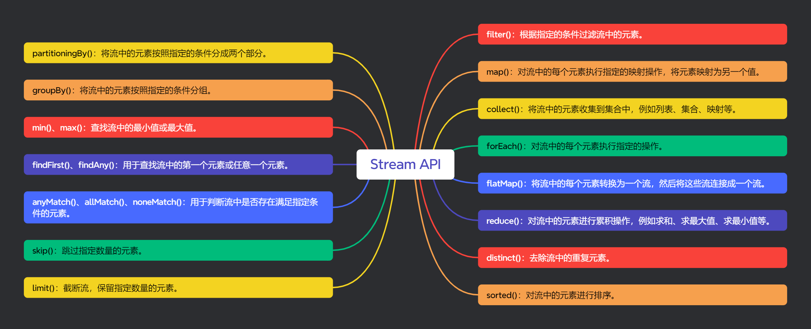
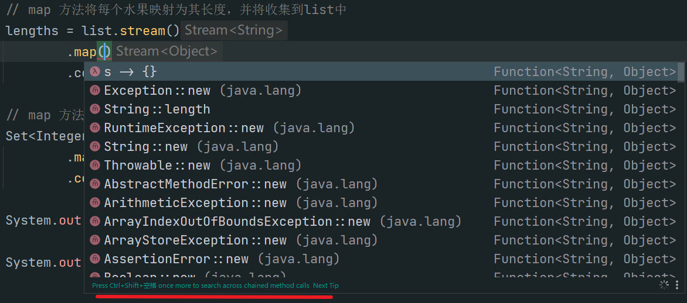

# JDK8提升代码优雅技巧

# <font style="color:#01B2BC;">Lambda小课堂：巧用“Function”让代码优雅起来~</font>
在开发过程中经常会使用if...else...进行判断抛出异常、分支处理等操作。这些if...else...充斥在代码中严重影响了代码代码的美观，这时我们可以利用Java 8的Function接口来消灭if...else...

```java
if (...){
    throw new RuntimeException("出现异常了")；
} 

if (...){
    doSomething();
} else {
    doOther();
}
```

## <font style="color:rgb(255, 80, 44);background-color:rgb(255, 245, 245);">Function</font><font style="color:rgb(37, 41, 51);"> 函数式接口</font>
使用注解@FunctionalInterface标识，并且只包含一个抽象方法的接口是函数式接口。函数式接口主要分为Supplier供给型函数、Consumer消费型函数、Runnable无参无返回型函数和Function有参有返回型函数。

Function可以看作转换型函数

### Supplier供给型函数
Supplier的表现形式为不接受参数、只返回数据

```java
/**
 * Represents a supplier of results.
 *
 * <p>There is no requirement that a new or distinct result be returned each
 * time the supplier is invoked.
 *
 * <p>This is a <a href="package-summary.html">functional interface</a>
 * whose functional method is {@link #get()}.
 *
 * @param <T> the type of results supplied by this supplier
 *
 * @since 1.8
 */
@FunctionalInterface
public interface Supplier<T> {

    /**
     * Gets a result.
     *
     * @return a result
     */
    T get();
}

```

### <font style="color:rgb(255, 80, 44);background-color:rgb(255, 245, 245);">Function</font><font style="color:rgb(37, 41, 51);">函数</font>
<font style="color:rgb(37, 41, 51);">表现形式为接收一个参数，并返回一个值。</font><font style="color:rgb(255, 80, 44);background-color:rgb(255, 245, 245);">Supplier</font><font style="color:rgb(37, 41, 51);">、</font><font style="color:rgb(255, 80, 44);background-color:rgb(255, 245, 245);">Consumer</font><font style="color:rgb(37, 41, 51);">和</font><font style="color:rgb(255, 80, 44);background-color:rgb(255, 245, 245);">Runnable</font><font style="color:rgb(37, 41, 51);">可以看作</font><font style="color:rgb(255, 80, 44);background-color:rgb(255, 245, 245);">Function</font><font style="color:rgb(37, 41, 51);">的一种特殊表现形式</font>

```java
/**
 * Represents a function that accepts one argument and produces a result.
 *
 * <p>This is a <a href="package-summary.html">functional interface</a>
 * whose functional method is {@link #apply(Object)}.
 *
 * @param <T> the type of the input to the function
 * @param <R> the type of the result of the function
 *
 * @since 1.8
 */
@FunctionalInterface
public interface Function<T, R> {

    /**
     * Applies this function to the given argument.
     *
     * @param t the function argument
     * @return the function result
     */
    R apply(T t);

    /**
     * Returns a composed function that first applies the {@code before}
     * function to its input, and then applies this function to the result.
     * If evaluation of either function throws an exception, it is relayed to
     * the caller of the composed function.
     *
     * @param <V> the type of input to the {@code before} function, and to the
     *           composed function
     * @param before the function to apply before this function is applied
     * @return a composed function that first applies the {@code before}
     * function and then applies this function
     * @throws NullPointerException if before is null
     *
     * @see #andThen(Function)
     */
    default <V> Function<V, R> compose(Function<? super V, ? extends T> before) {
        Objects.requireNonNull(before);
        return (V v) -> apply(before.apply(v));
    }

    /**
     * Returns a composed function that first applies this function to
     * its input, and then applies the {@code after} function to the result.
     * If evaluation of either function throws an exception, it is relayed to
     * the caller of the composed function.
     *
     * @param <V> the type of output of the {@code after} function, and of the
     *           composed function
     * @param after the function to apply after this function is applied
     * @return a composed function that first applies this function and then
     * applies the {@code after} function
     * @throws NullPointerException if after is null
     *
     * @see #compose(Function)
     */
    default <V> Function<T, V> andThen(Function<? super R, ? extends V> after) {
        Objects.requireNonNull(after);
        return (T t) -> after.apply(apply(t));
    }

    /**
     * Returns a function that always returns its input argument.
     *
     * @param <T> the type of the input and output objects to the function
     * @return a function that always returns its input argument
     */
    static <T> Function<T, T> identity() {
        return t -> t;
    }
}
```

### <font style="color:rgb(255, 80, 44);background-color:rgb(255, 245, 245);">Consumer</font><font style="color:rgb(37, 41, 51);">消费型函数</font>
<font style="color:rgb(255, 80, 44);background-color:rgb(255, 245, 245);">Consumer</font><font style="color:rgb(37, 41, 51);">消费型函数和</font><font style="color:rgb(255, 80, 44);background-color:rgb(255, 245, 245);">Supplier</font><font style="color:rgb(37, 41, 51);">刚好相反。</font><font style="color:rgb(255, 80, 44);background-color:rgb(255, 245, 245);">Consumer</font><font style="color:rgb(37, 41, 51);">接收一个参数，没有返回值</font>

```java
/**
 * 表示接受单个输入参数但不返回任何结果的操作。
 * 与大多数其他功能接口不同， Consumer 它预计会通过副作用进行操作。
 * 这是一个功能接口，其 功能 方法是 accept(Object)
 */
@FunctionalInterface
public interface Consumer<T> {

    /**
     * 对给定参数执行此操作。
     * 形参: t – 输入参数
     */
    void accept(T t);

    /**
     * 返回一个组合，该组合 Consumer 按顺序执行此操作，后跟 after 操作。
     * 如果执行任一操作引发异常，则会将其中继到组合操作的调用方。
     * 如果执行此操作引发异常，则不会执行该 after 操作。
     * 形参: after – 此操作后要执行的操作
     * 返回值: 按 Consumer 顺序执行此操作后跟 after 操作的组合
     * 抛出: NullPointerException – 如果 after 为空
     */
    default Consumer<T> andThen(Consumer<? super T> after) {
        Objects.requireNonNull(after);
        return (T t) -> { accept(t); after.accept(t); };
    }
}
```

### <font style="color:rgb(255, 80, 44);background-color:rgb(255, 245, 245);">Runnable</font><font style="color:rgb(37, 41, 51);">无参无返回型函数</font>
<font style="color:rgb(255, 80, 44);background-color:rgb(255, 245, 245);">Runnable</font><font style="color:rgb(37, 41, 51);">的表现形式为即没有参数也没有返回值</font>

```java
@FunctionalInterface
public interface Runnable {
    /**
     * When an object implementing interface <code>Runnable</code> is used
     * to create a thread, starting the thread causes the object's
     * <code>run</code> method to be called in that separately executing
     * thread.
     * <p>
     * The general contract of the method <code>run</code> is that it may
     * take any action whatsoever.
     *
     * @see     java.lang.Thread#run()
     */
    public abstract void run();
}
```

## <font style="color:rgb(37, 41, 51);">使用小技巧</font>
### <font style="color:rgb(37, 41, 51);">处理抛出异常的if</font>
1. <font style="color:rgb(37, 41, 51);">定义函数 定义一个抛出异常的形式的</font><font style="color:rgb(255, 80, 44);background-color:rgb(255, 245, 245);">函数式接口</font><font style="color:rgb(37, 41, 51);">, 这个接口只有参数没有返回值是个</font><font style="color:rgb(255, 80, 44);background-color:rgb(255, 245, 245);">消费型接口</font>

```java
/**
 * 抛异常接口
 **/
@FunctionalInterface
public interface ThrowExceptionFunction {

    /**
     * 抛出异常信息
     *
     * @param message 异常信息
     * @return void
     **/
    void throwMessage(String message);
}
```

2. <font style="color:rgb(37, 41, 51);">编写判断方法 创建工具类</font><font style="color:rgb(255, 80, 44);background-color:rgb(255, 245, 245);">VUtils</font><font style="color:rgb(37, 41, 51);">并创建一个</font><font style="color:rgb(255, 80, 44);background-color:rgb(255, 245, 245);">isTure</font><font style="color:rgb(37, 41, 51);">方法，方法的返回值为刚才定义的</font><font style="color:rgb(255, 80, 44);background-color:rgb(255, 245, 245);">函数式接口</font><font style="color:rgb(37, 41, 51);">-</font><font style="color:rgb(255, 80, 44);background-color:rgb(255, 245, 245);">ThrowExceptionFunction</font><font style="color:rgb(37, 41, 51);">。</font><font style="color:rgb(255, 80, 44);background-color:rgb(255, 245, 245);">ThrowExceptionFunction</font><font style="color:rgb(37, 41, 51);">的接口实现逻辑为当参数</font><font style="color:rgb(255, 80, 44);background-color:rgb(255, 245, 245);">b</font><font style="color:rgb(37, 41, 51);">为</font><font style="color:rgb(255, 80, 44);background-color:rgb(255, 245, 245);">true</font><font style="color:rgb(37, 41, 51);">时抛出异常</font>

```java
/**
 *  如果参数为true抛出异常
 * 
 * @param b 
 * @return com.example.demo.func.ThrowExceptionFunction
 **/
public static ThrowExceptionFunction isTure(boolean b){

    return (errorMessage) -> {
        if (b){
            throw new RuntimeException(errorMessage);
        }
    };
}
```

3. <font style="color:rgb(37, 41, 51);">使用方式 调用工具类参数参数后，调用</font><font style="color:rgb(255, 80, 44);background-color:rgb(255, 245, 245);">函数式接口</font><font style="color:rgb(37, 41, 51);">的</font><font style="color:rgb(255, 80, 44);background-color:rgb(255, 245, 245);">throwMessage</font><font style="color:rgb(37, 41, 51);">方法传入异常信息。 当出入的参数为</font><font style="color:rgb(255, 80, 44);background-color:rgb(255, 245, 245);">false</font><font style="color:rgb(37, 41, 51);">时正常执行</font>

```java
// 报错
BeimingUtil.isTure(true).isthrowMessage("哎呀，一不小心就报错啦");
// 不报错
BeimingUtil.isTure(false).isthrowMessage("哎呀，一不小心就报错啦");
```

### <font style="color:rgb(37, 41, 51);">处理if分支操作</font>
1. <font style="color:rgb(37, 41, 51);">定义函数式接口 创建一个名为</font><font style="color:rgb(255, 80, 44);background-color:rgb(255, 245, 245);">BranchHandle</font><font style="color:rgb(37, 41, 51);">的函数式接口，接口的参数为两个</font><font style="color:rgb(255, 80, 44);background-color:rgb(255, 245, 245);">Runnable</font><font style="color:rgb(37, 41, 51);">接口。这两个两个</font><font style="color:rgb(255, 80, 44);background-color:rgb(255, 245, 245);">Runnable</font><font style="color:rgb(37, 41, 51);">接口分别代表了为</font><font style="color:rgb(255, 80, 44);background-color:rgb(255, 245, 245);">true</font><font style="color:rgb(37, 41, 51);">或</font><font style="color:rgb(255, 80, 44);background-color:rgb(255, 245, 245);">false</font><font style="color:rgb(37, 41, 51);">时要进行的操作</font>

```java
/**
 * 分支处理接口
 **/
@FunctionalInterface
public interface BranchHandle {

    /**
     * 分支操作
     *
     * @param trueHandle 为true时要进行的操作
     * @param falseHandle 为false时要进行的操作
     * @return void
     **/
    void trueOrFalseHandle(Runnable trueHandle, Runnable falseHandle);

}
```

2. <font style="color:rgb(37, 41, 51);">编写判断方法 创建一个名为</font><font style="color:rgb(255, 80, 44);background-color:rgb(255, 245, 245);">isTureOrFalse</font><font style="color:rgb(37, 41, 51);">的方法，方法的返回值为刚才定义的</font><font style="color:rgb(255, 80, 44);background-color:rgb(255, 245, 245);">函数式接口</font><font style="color:rgb(37, 41, 51);">-</font><font style="color:rgb(255, 80, 44);background-color:rgb(255, 245, 245);">BranchHandle</font><font style="color:rgb(37, 41, 51);">。</font>

```java
/**
 * 参数为true或false时，分别进行不同的操作   
 **/
public static BranchHandle isTureOrFalse(boolean b){
    
    return (trueHandle, falseHandle) -> {
        if (b){
            trueHandle.run();
        } else {
            falseHandle.run();
        }
    };
}
```

3. 效果

```java
// 参数为true时，执行trueHandle
BeimingUtil.isTureOrFalse(true)
        	.trueorFalseHandle ( trueHandle: O -> {
					System.out.printin("true，没毛病”)；
			},falseHandle: () -> {
					System.out.println("有毛病");
			}
```

### <font style="color:rgb(37, 41, 51);">如果存在值执行消费操作，否则执行基于空的操作</font>
1. <font style="color:rgb(37, 41, 51);">定义函数 创建一个名为</font><font style="color:rgb(255, 80, 44);background-color:rgb(255, 245, 245);">PresentOrElseHandler</font><font style="color:rgb(37, 41, 51);">的函数式接口，接口的参数一个为</font><font style="color:rgb(255, 80, 44);background-color:rgb(255, 245, 245);">Consumer</font><font style="color:rgb(37, 41, 51);">接口。一个为</font><font style="color:rgb(255, 80, 44);background-color:rgb(255, 245, 245);">Runnable</font><font style="color:rgb(37, 41, 51);">,分别代表值不为空时执行消费操作和值为空时执行的其他操作</font>

```java
/**
 * 空值与非空值分支处理
 */
public interface PresentOrElseHandler<T extends Object> {

    /**
     * 值不为空时执行消费操作
     * 值为空时执行其他的操作
     * 
     * @param action 值不为空时，执行的消费操作
     * @param emptyAction 值为空时，执行的操作
     * @return void    
     **/
   void presentOrElseHandle(Consumer<? super T> action, Runnable emptyAction);
   
}
```

2. <font style="color:rgb(37, 41, 51);">编写判断方法 创建一个名为</font><font style="color:rgb(255, 80, 44);background-color:rgb(255, 245, 245);">isBlankOrNoBlank</font><font style="color:rgb(37, 41, 51);">的方法，方法的返回值为刚才定义的</font><font style="color:rgb(255, 80, 44);background-color:rgb(255, 245, 245);">函数式接口</font><font style="color:rgb(37, 41, 51);">-</font><font style="color:rgb(255, 80, 44);background-color:rgb(255, 245, 245);">PresentOrElseHandler</font><font style="color:rgb(37, 41, 51);">。</font>

```java
/**
 * 参数为true或false时，分别进行不同的操作
 *
 * @param b
 * @return com.example.demo.func.BranchHandle
 **/
public static PresentOrElseHandler<?> isBlankOrNoBlank(String str){

    return (consumer, runnable) -> {
        if (str == null || str.length() == 0){
            runnable.run();
        } else {
            consumer.accept(str);
        }
    };
}
```

3. <font style="color:rgb(37, 41, 51);">使用方式 调用工具类参数参数后，调用</font><font style="color:rgb(255, 80, 44);background-color:rgb(255, 245, 245);">函数式接口</font><font style="color:rgb(37, 41, 51);">的</font><font style="color:rgb(255, 80, 44);background-color:rgb(255, 245, 245);">presentOrElseHandle</font><font style="color:rgb(37, 41, 51);">方法传入一个</font><font style="color:rgb(255, 80, 44);background-color:rgb(255, 245, 245);">Consumer</font><font style="color:rgb(37, 41, 51);">和</font><font style="color:rgb(255, 80, 44);background-color:rgb(255, 245, 245);">Runnable</font>

## <font style="color:rgb(37, 41, 51);">结尾</font>
<font style="color:rgb(255, 80, 44);background-color:rgb(255, 245, 245);">Function</font><font style="color:rgb(37, 41, 51);">函数式接口是</font><font style="color:rgb(255, 80, 44);background-color:rgb(255, 245, 245);">java 8</font><font style="color:rgb(37, 41, 51);">非常重要的特性，利用好</font><font style="color:rgb(255, 80, 44);background-color:rgb(255, 245, 245);">Function</font><font style="color:rgb(37, 41, 51);">函数可以极大的简化代码。</font>

# <font style="color:#01B2BC;">怎么理解Java里面的双冒号“::”</font>
## “::”是什么含义
在Java中，双冒号"::"是方法引用（Method Reference）的语法。方法引用是一种简化Lambda表达式的语法结构，使代码更加简洁易读。并且在使用方法引用时，会根据上下文推断参数类型，因此特别适用于直接引用已有方法的情况。

## “::”用法
方法引用的一般形式是：

```java
ClassName::methodName
```

其中，ClassName 是包含静态方法 methodName 的类名。根据引用的方法类型，有不同的情况：

### 静态方法引用
假设我们有一个自定义的工具类MathUtil，其中包含一个静态方法square，用于计算一个整数的平方。现在我们想要计算一个整数列表中所有元素的平方和。

```java
import java.util.Arrays;
import java.util.List;

public class MathUtil {
    public static int square(int num) {
        return num * num;
    }

    public static void main(String[] args) {
        List<Integer> numbers = Arrays.asList(1, 2, 3, 4, 5);
        int sum = numbers.stream()
        .mapToInt(MathUtil::square)
        .sum();
        System.out.println(sum); // 输出55
    }
}
```

在上述代码中，我们通过使用静态方法引用MathUtil::square，将square方法传递给mapToInt方法，以便对列表中的每个元素进行平方运算。

### 实例方法引用
假设我们有一个字符串列表，我们想要按照字符串长度进行排序。我们可以使用Lambda表达式编写比较器，也可以使用实例方法引用简化代码。

```java
import java.util.Arrays;
import java.util.List;

public class StringSorter {
    public static void main(String[] args) {
        List<String> words = Arrays.asList("apple", "orange", "banana", "pear");
        words.sort((a, b) -> a.compareTo(b)); // 使用Lambda表达式
        System.out.println(words); // [apple, banana, orange, pear]

        // 使用实例方法引用
        words.sort(String::compareTo);
        System.out.println(words); // [apple, banana, orange, pear]
    }
}
```

在上述代码中，我们首先使用Lambda表达式编写了一个比较器(a, b) -> a.compareTo(b)来进行字符串比较。然后，我们使用实例方法引用String::compareTo来简化比较器的写法。

### 对象方法引用
假设我们有一个自定义的Person类，其中包含姓名和年龄属性。我们想要根据Person对象的年龄进行排序。

```java
import java.util.Arrays;
import java.util.Comparator;
import java.util.List;

public class PersonSorter {
    public static void main(String[] args) {
        List<Person> people = Arrays.asList(
            new Person("Alice", 22),
            new Person("Bob", 32),
            new Person("Charlie", 20),
            new Person("David", 26)
        );

        // 使用Lambda表达式编写比较器
        people.sort((p1, p2) -> p1.getAge() - p2.getAge());
        System.out.println(people);

        // 使用对象方法引用
        people.sort(Person::compareByAge);
        System.out.println(people);
    }
}

static class Person {
    private String name;
    private int age;

    public Person(String name, int age) {
        this.name = name;
        this.age = age;
    }

    public int getAge() {
        return age;
    }

    @Override
    public String toString() {
        return name + " (" + age + ")";
    }

    public static int compareByAge(Person p1, Person p2) {
        return p1.getAge() - p2.getAge();
    }
}
```

在上述代码中，我们首先使用Lambda表达式编写了一个比较器(p1, p2) -> p1.getAge() - p2.getAge()来根据年龄进行排序。然后，我们使用对象方法引用Person::compareByAge来简化比较器的写法。

### 构造方法引用
假设我们需要创建一个空的ArrayList，可以使用构造方法引用来实现。

```java
import java.util.ArrayList;
import java.util.List;
import java.util.function.Supplier;

public class ArrayListCreator {
    public static void main(String[] args) {
        Supplier<List<String>> supplier = ArrayList::new;
        List<String> list = supplier.get();
        System.out.println(list instanceof ArrayList); // 输出true
    }
}
```


# <font style="color:#01B2BC;">提升编码效率的15种 Stream API</font>


本文给大家收集了工作常用的 15 种 Java Stream API，可用于进行各种数据处理和操作。具体如下：

## collect()：将流中的元素收集到集合中，例如列表、集合、映射等。
## filter()：根据指定的条件过滤流中的元素。
```java
List<String> names = Arrays.asList("Alice", "Bob", "Charlie", "David");

// 筛选出以字母"A"开头的字符串，并将符合条件的字符串收集到一个新的列表中
List<String> filteredNames = names.stream()
                            .filter(name -> name.startsWith("A"))
                            .collect(Collectors.toList());

System.out.println(filteredNames); // Output: [Alice]
```

## map()：对流中的每个元素执行指定的映射操作，将元素映射为另一个值。
```java
List<String> names = Arrays.asList("Alice", "Bob", "Charlie", "David");

// 将给定字符串列表中每个字符串的长度提取出来，并将这些长度存储到一个新的整数列表中
List<Integer> nameLengths = names.stream()
                            .map(String::length)
                            .collect(Collectors.toList());

System.out.println(nameLengths); // Output: [5, 3, 7, 5]
```

## forEach()：对流中的每个元素执行指定的操作。
```java
List<String> names = Arrays.asList("Alice", "Bob", "Charlie", "David");

// 将每个字符串转换为大写形式并收集到新的列表中
List<String> upperCaseNames = new ArrayList<>();

names.forEach(name -> upperCaseNames.add(name.toUpperCase()));

// 输出新的列表
System.out.println(upperCaseNames); // 输出：[ALICE, BOB, CHARLIE, DAVID]
```

## flatMap()：将流中的每个元素转换为一个流，然后将这些流连接成一个流。
```java
List<List<Integer>> numbers = Arrays.asList(
    Arrays.asList(1, 2, 3),
    Arrays.asList(4, 5, 6),
    Arrays.asList(7, 8, 9)
);

// 使用 flatMap 方法将多个整数列表合并为一个扁平的列表
List<Integer> flattenedList = numbers.stream()
                                     .flatMap(List::stream)
                                     .collect(Collectors.toList());

System.out.println(flattenedList); // Output: [1, 2, 3, 4, 5, 6, 7, 8, 9]
```

## reduce()：对流中的元素进行累积操作，例如求和、求最大值、求最小值等。
```java
List<Integer> numbers = Arrays.asList(1, 2, 3, 4, 5);

// 使用流的 reduce 方法计算列表中所有元素的和
int sum = numbers.stream()
                 .reduce(0, Integer::sum);

System.out.println(sum); // Output: 15
```

## distinct()：去除流中的重复元素。
```java
List<Integer> numbers = Arrays.asList(1, 2, 3, 2, 4, 3, 5);

List<Integer> distinctNumbers = numbers.stream()
                                      .distinct()
                                      .collect(Collectors.toList());

System.out.println(distinctNumbers); // Output: [1, 2, 3, 4, 5]
```

## sorted()：对流中的元素进行排序。
```java
List<Integer> numbers = Arrays.asList(3, 1, 4, 1, 5, 9, 2, 6, 5);

List<Integer> sortedNumbers = numbers.stream()
                                    .sorted()
                                    .collect(Collectors.toList());

System.out.println(sortedNumbers); // Output: [1, 1, 2, 3, 4, 5, 5, 6, 9]
```

## limit()：截断流，保留指定数量的元素。
```java
List<Integer> numbers = Arrays.asList(1, 2, 3, 4, 5, 6, 7, 8, 9, 10);

// 筛选出大于5的元素，然后限制只获取前3个符合条件的元素
List<Integer> limitedNumbers = numbers.stream()
                                      .filter(num -> num > 5)
                                      .limit(3)
                                      .collect(Collectors.toList());

System.out.println(limitedNumbers); // Output: [6, 7, 8]
```

## skip()：跳过指定数量的元素。
```java
List<Integer> numbers = Arrays.asList(1, 2, 3, 4, 5);

// 跳过前两个元素
List<Integer> skippedNumbers = numbers.stream()
                                     .skip(2)
                                     .collect(Collectors.toList());

System.out.println(skippedNumbers); // Output: [3, 4, 5]
```

## anyMatch()、allMatch()、noneMatch()：用于判断流中是否存在满足指定条件的元素。
```java
List<Integer> numbers = Arrays.asList(1, 2, 3, 4, 5);

// 使用 anyMatch 方法判断列表中是否有任意一个元素大于3
boolean anyMatch = numbers.stream().anyMatch(n -> n > 3);

// 使用 allMatch 方法判断列表中所有元素是否都大于0
boolean allMatch = numbers.stream().allMatch(n -> n > 0);

// 使用 noneMatch 方法判断列表中是否没有元素小于0
boolean noneMatch = numbers.stream().noneMatch(n -> n < 0);

System.out.println("Any match: " + anyMatch); // Output: true
System.out.println("All match: " + allMatch); // Output: true
System.out.println("None match: " + noneMatch); // Output: true
```

## findFirst()、findAny()：用于查找流中的第一个元素或任意一个元素。
```java
List<Integer> numbers = Arrays.asList(1, 2, 3, 4, 5);

// 使用 findFirst 方法查找第一个元素
Optional<Integer> first = numbers.stream().findFirst();

// 使用 findAny 方法查找任意一个元素
Optional<Integer> any = numbers.stream().findAny();

System.out.println("First: " + first.orElse(null)); // Output: 1
System.out.println("Any: " + any.orElse(null)); // Output: 1 or any other element
```

## min()、max()：查找流中的最小值或最大值。
```java
List<Integer> numbers = Arrays.asList(3, 1, 4, 1, 5);

// 使用 min 方法找到最小值
Optional<Integer> min = numbers.stream().min(Integer::compareTo);

// 使用 max 方法找到最大值
Optional<Integer> max = numbers.stream().max(Integer::compareTo);

System.out.println("Min: " + min.orElse(null)); // Output: 1
System.out.println("Max: " + max.orElse(null)); // Output: 5
```

## groupBy()：将流中的元素按照指定的条件分组。
```java
List<String> names = Arrays.asList("Alice", "Bob", "Charlie", "David");

// 使用流进行分组，按照名字的首字母进行分组
Map<Character, List<String>> groupedNames 
        = names.stream()
               .collect(Collectors.groupingBy(name -> name.charAt(0)));

System.out.println(groupedNames); // Output: {A=[Alice], B=[Bob], C=[Charlie], D=[David]}
```

## partitioningBy()：将流中的元素按照指定的条件分成两个部分。
```java
List<String> names = Arrays.asList("Alice", "Bob", "Charlie", "David");

// 使用流进行分区，根据名字长度是否大于3进行分区
Map<Boolean, List<String>> partitionedNames 
        = names.stream()
               .collect(Collectors.partitioningBy(name -> name.length() > 3));

System.out.println(partitionedNames); // Output: {false=[Bob], true=[Alice, Charlie, David]}
```

## IDEA 小技巧
使用 idea 编码时，如果不知道输入什么，请使用 ctrl + shift + 空格



## 完整测试代码
```java
package com.baili.springboot3;

import com.baili.springboot3.entity.Transaction;
import org.junit.jupiter.api.Test;
import org.springframework.boot.test.context.SpringBootTest;

import java.util.*;
import java.util.stream.Collectors;

@SpringBootTest
public class StreamApiTest {

    @Test
    void forEachDemo() {
        List<String> list = new ArrayList<>(Arrays.asList("apple", "banana", "orange"));

        // 使用传统的 for 循环遍历列表并输出每个元素
        for (String string : list) {
            System.out.println(string);
        }

        // 移除符合条件的元素
        list.removeIf(s -> s.equals("apple"));

        // 使用流的 forEach 方法遍历列表并输出每个元素
        list.forEach(System.out::println);

        list.forEach(s -> {
            // TODO
        });
    }

    @Test
    void mapDemo() {
        List<String> list = Arrays.asList("apple", "banana", "orange");
        List<Integer> lengths = new ArrayList<>();

        // 使用传统的 for 循环遍历列表，并将每个水果的长度添加到list中
        for (String string : list) {
            lengths.add(string.length());
        }

        // map 方法将每个水果映射为其长度，并将收集到list中
        lengths = list.stream()
                .map(String::length)
                .collect(Collectors.toList());

        // map 方法将每个水果映射为其长度，并将收集到set中
        Set<Integer> collect = list.stream()
                .map(String::length)
                .collect(Collectors.toSet());

        System.out.println(lengths);

        System.out.println(collect);
    }

    @Test
    void flatMapDemo() {
        List<List<Integer>> numbers = Arrays.asList(
                Arrays.asList(1, 2, 3),
                Arrays.asList(4, 5, 6),
                Arrays.asList(7, 8, 9)
        );

        // flatMap 将所有元素转换为单独的流，然后连接成一个流
        List<Integer> flattenedList = numbers.stream()
                .flatMap(List::stream)
                .collect(Collectors.toList());

        System.out.println(flattenedList); // [1, 2, 3, 4, 5, 6, 7, 8, 9]
    }

    @Test
    void reduceDemo() {
        List<Transaction> transactions = new ArrayList<>();
        transactions.add(new Transaction(100.0));
        transactions.add(new Transaction(200.0));
        transactions.add(new Transaction(300.0));

        // reduce 计算金额总和
        double totalAmount = transactions.stream()
                .mapToDouble(Transaction::getAmount)
                .reduce(0.0, Double::sum);

        System.out.println("总金额为: " + totalAmount);
    }

    @Test
    void synthesizeDemo() {
        List<String> strings = Arrays.asList("apple", "banana", "orange", "apple", "banana", "grape");

        // 使用流进行操作
        List<String> result = strings.stream()
                .filter(string -> string.length() > 5)  // 过滤出长度大于5的水果
                .distinct()  // 去除重复的水果
                .sorted()  // 按字母顺序排序
                .skip(1)  //跳过一个元素
                .limit(2)  // 取前两个水果
                .collect(Collectors.toList());  // 收集结果为列表

        System.out.println(result); // 输出：[orange]
    }

    @Test
    void matchDemo() {
        List<Integer> numbers = Arrays.asList(1, 2, 3, 4, 5);

        // 使用 anyMatch 方法判断列表中是否有任意一个元素大于3
        boolean anyMatch = numbers.stream().anyMatch(n -> n > 3);

        // 使用 allMatch 方法判断列表中所有元素是否都大于0
        boolean allMatch = numbers.stream().allMatch(n -> n > 0);

        // 使用 noneMatch 方法判断列表中是否没有元素小于0
        boolean noneMatch = numbers.stream().noneMatch(n -> n < 0);

        System.out.println("Any match: " + anyMatch); // true
        System.out.println("All match: " + allMatch); // true
        System.out.println("None match: " + noneMatch); // true
    }

    @Test
    void findDemo() {
        List<Integer> numbers = Arrays.asList(1, 2, 3, 4, 5);

        // 使用 findFirst 方法查找第一个元素
        Optional<Integer> first = numbers.stream().findFirst();

        // 使用 findAny 方法查找任意一个元素
        Optional<Integer> any = numbers.stream().findAny();

        // 使用 min 方法找到最小值
        Optional<Integer> min = numbers.stream().min(Integer::compareTo);

        // 使用 max 方法找到最大值
        Optional<Integer> max = numbers.stream().max(Integer::compareTo);

        System.out.println("First: " + first.orElse(null)); // 1
        System.out.println("Any: " + any.orElse(null)); // 1 or any other element
        System.out.println("Min: " + min.orElse(null)); // 1
        System.out.println("Max: " + max.orElse(null)); // 5
    }

    @Test
    void groupByDemo() {
        List<String> names = Arrays.asList("Alice", "Bob", "Charlie", "David", "Adam", "Bella", "Christopher", "Daniel");

        // 使用流进行分组，按照名字的首字母进行分组
        Map<Character, List<String>> groupedNames = names.stream()
                .collect(Collectors.groupingBy(name -> name.charAt(0)));

        System.out.println(groupedNames); // {A=[Alice, Adam], B=[Bob, Bella], C=[Charlie, Christopher], D=[David, Daniel]}
    }

    @Test
    void partitioningByDemo() {
        List<String> names = Arrays.asList("Alice", "Bob", "Charlie", "David");

        // 使用流进行分区，根据名字长度是否大于3进行分区
        Map<Boolean, List<String>> partitionedNames = names.stream()
                .collect(Collectors.partitioningBy(name -> name.length() > 3));

        System.out.println(partitionedNames); // {false=[Bob], true=[Alice, Charlie, David]}
    }
}
```

# 提高生产力：这10个Lambda表达式必须掌握
## 使用Lambda表达式进行集合遍历
❌ 未使用Lambda表达式：

```java
List list = Arrays.asList("apple", "banana", "orange");
for (String fruit : list) {
    System.out.println(fruit);
}
```

✅ 使用Lambda表达式：

```java
List list = Arrays.asList("apple", "banana", "orange");
list.forEach(fruit -> System.out.println(fruit));
```

## 使用Lambda表达式进行排序
❌  未使用Lambda表达式：

```java
List list = Arrays.asList("apple", "banana", "orange");
Collections.sort(list, new Comparator() {
    public int compare(String s1, String s2) {
        return s1.compareTo(s2);
    }
});
```

✅ 使用Lambda表达式：

```java
List list = Arrays.asList("apple", "banana", "orange");
Collections.sort(list, (s1, s2) -> s1.compareTo(s2));
```

## 使用Lambda表达式进行过滤
❌  未使用Lambda表达式：

```java
List list = Arrays.asList("apple", "banana", "orange");
List filteredList = new ArrayList();
for (String fruit : list) {
    if (fruit.startsWith("a")) {
        filteredList.add(fruit);
    }
}
```

✅ 使用Lambda表达式：

```java
List list = Arrays.asList("apple", "banana", "orange");
List filteredList = list.stream().filter(fruit -> fruit.startsWith("a"))
								.collect(Collectors.toList());
```

## 使用Lambda表达式进行映射
❌  未使用Lambda表达式：

```java
List list = Arrays.asList("apple", "banana", "orange");
List lengths = new ArrayList();
for (String fruit : list) {
    lengths.add(fruit.length());
}
```

✅ 使用Lambda表达式：

```java
List list = Arrays.asList("apple", "banana", "orange");
List lengths = list.stream()
                	.map(fruit -> fruit.length())
                	.collect(Collectors.toList());
```

## 使用Lambda表达式进行归约
❌  未使用Lambda表达式：

```java
List list = Arrays.asList(1, 2, 3, 4, 5);
int sum = 0;
for (int i : list) {
	sum += i;
}
```

✅ 使用Lambda表达式：

```java
List list = Arrays.asList(1, 2, 3, 4, 5);
int sum = list.stream().reduce(0, (a, b) -> a + b);
```

## 使用Lambda表达式进行分组
❌  未使用Lambda表达式：

```java
List list = Arrays.asList("apple", "banana", "orange");
Map<Integer, List> grouped = new HashMap<Integer, List>();
for (String fruit : list) {
    int length = fruit.length();
    if (!grouped.containsKey(length)) {
        grouped.put(length, new ArrayList());
    }
    grouped.get(length).add(fruit);
}
```

✅ 使用Lambda表达式：

```java
List list = Arrays.asList("apple", "banana", "orange");
Map<Integer, List> grouped = list.stream()
				.collect(Collectors.groupingBy(fruit -> fruit.length()));
```

## 使用Lambda表达式进行函数式接口的实现
❌  未使用Lambda表达式：

```java
public interface MyInterface {
    public void doSomething(String input); 
}

MyInterface myObject = new MyInterface() {
	public void doSomething(String input) {
		System.out.println(input);
	}
};

myObject.doSomething("Hello World");

```

✅ 使用Lambda表达式：

```java
MyInterface myObject = input -> System.out.println(input);
myObject.doSomething("Hello World");
```

## 使用Lambda表达式进行线程的创建
❌  未使用Lambda表达式：

```java
Thread thread = new Thread(new Runnable() {
    public void run() {
    	System.out.println("Thread is running.");
    }
});
thread.start();
```

✅ 使用Lambda表达式：

```java
Thread thread = new Thread(() -> System.out.println("Thread is running."));
thread.start();
```

## 使用Lambda表达式进行Optional的操作
❌  未使用Lambda表达式：

```java
String str = "Hello World";
if (str != null) {
	System.out.println(str.toUpperCase());
}
```

✅ 使用Lambda表达式：

```java
Optional str = Optional.ofNullable("Hello World");
str.map(String::toUpperCase)
	.ifPresent(System.out::println);
```

## 使用Lambda表达式进行Stream的流水线操作
❌  未使用Lambda表达式：

```java
List list = Arrays.asList("apple", "banana", "orange");
List filteredList = new ArrayList();
for (String fruit : list) {
    if (fruit.startsWith("a")) {
        filteredList.add(fruit.toUpperCase());
    }
}
Collections.sort(filteredList);
```

✅ 使用Lambda表达式：

```java
List list = Arrays.asList("apple", "banana", "orange");
List filteredList = list.stream().filter(fruit -> fruit.startsWith("a"))
								.map(String::toUpperCase)
								.sorted()
								.collect(Collectors.toList());
```


> 更新: 2024-09-24 19:45:12  
> 原文: <https://www.yuque.com/tulingzhouyu/db22bv/ttmafdm9rirc1go6>