# 💎 Java基础面试题合集

# <font style="color:#01B2BC;">如何优雅的避免空指针异常</font>
空指针异常是导致java程序运行中断最常见的原因，相信每个程序猿都碰见过，也就是NullPointException，我们通常简称为NPE，本文告诉大家如何优雅避免NPE。

## 1.数据准备
```java
package npe;

/**
 * @author 百里
 */
public class User {
    private String name;
    private int age;
    private Address address;

    public String getName() {
        return name;
    }

    public void setName(String name) {
        this.name = name;
    }

    public int getAge() {
        return age;
    }

    public void setAge(int age) {
        this.age = age;
    }

    public Address getAddress() {
        return address;
    }

    public void setAddress(Address address) {
        this.address = address;
    }

    public User(){

    }

    public User(String name, int age, Address address) {
        this.name = name;
        this.age = age;
        this.address = address;
    }

    @Override
    public String toString() {
        return "User{" +
                "name='" + name + '\'' +
                ", age=" + age +
                ", address=" + address +
                '}';
    }
}
```

```java
package npe;

/**
 * @author 百里
 */
public class Address {
    private String street;
    private String city;
    private String country;

    public Address(){

    }
    
    public Address(String street, String city, String country) {
        this.street = street;
        this.city = city;
        this.country = country;
    }

    // getters and setters
    public String getStreet() {
        return street;
    }

    public void setStreet(String street) {
        this.street = street;
    }

    public String getCity() {
        return city;
    }

    public void setCity(String city) {
        this.city = city;
    }

    public String getCountry() {
        return country;
    }

    public void setCountry(String country) {
        this.country = country;
    }

    @Override
    public String toString() {
        return "Address{" +
                "street='" + street + '\'' +
                ", city='" + city + '\'' +
                ", country='" + country + '\'' +
                '}';
    }
}
```

UML类关系图：  
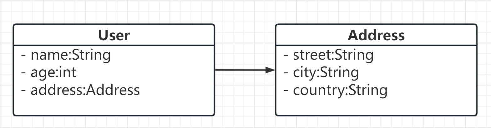

## 2.实战：获取用户所在的城市
### 2.1.直接获取；容易出现空指针异常。
```java
/**
 * 获取人员所在的城市
 * @author 百里
 */
public class BaiLiNpeDemo {
    public static void main(String[] args) {
        Address myAddress = new Address();
        User myUser = new User("John Doe", 35, myAddress);
        String city = myUser.getAddress().getCity().trim();
        System.out.println(city);
    }
}
```

### 2.2.使用if-else判断；避免了出现空指针的问题，但是代码结构层次嵌套多，不美观
```java
/**
 * 使用if进行判断
 * @author 百里
 */
public class BaiLiSimpleNpeDemo {
    public static void main(String[] args) {
        Address myAddress = new Address();
        User myUser = new User("John Doe", 35, myAddress);
        if (myUser != null) {
            Address address = myUser.getAddress();
            if (address != null) {
                String city = address.getCity();
                if (city != null  && !"".equals(city)) {
                    System.out.println("使用if判断字符串：" + "一键三连");
                }
            }
        }
    }
}
```

### 2.3.使用工具类美化一下if判断代码
```java
/**
 * 使用工具类
 * @author 百里
 */
public class BaiLiUtilsNpeDemo {
    public static void main(String[] args) {
        Address myAddress = new Address("123 Main St", " Austin ", "CA");
        User myUser = new User("John Doe", 35, myAddress);
        //针对对象与字符串
        if (!ObjectUtils.isEmpty(myUser)) {
            Address address = myUser.getAddress();
            if (!ObjectUtils.isEmpty(address)) {
                String city = address.getCity();
                if (!StringUtils.isEmpty(city)) {
                    System.out.println("使用StringUtils工具类判断字符串：" + "一键三连");
                }
            }
        }
    	//针对数组使用工具类
        ArrayList<User> users = new ArrayList<>();
        users.add(myUser);
        if (!CollectionUtils.isEmpty(users)) {
            System.out.println("使用CollectionUtils工具类判断数组对象：" + "一键三连");
        }
    }
}
```

### 2.4.使用Optional解决了层次多的问题也避免了空指针的问题，当我们配合使用orElse时，会先执行orElse方法，然后执行逻辑代码，不管是否出现了空指针。
```java
/**
 * 使用Optional
 * @author 百里
 */
public class BaiLiOptionalNpeDemo {
    public static void main(String[] args) {
        Address myAddress = new Address();
        User myUser = new User("John Doe", 35, myAddress);
        System.out.println("使用Optional判断 + orElse:" +
                Optional.ofNullable(myUser)
                .map(User::getAddress)
                .map(Address::getCity)
                .map(String::trim)
                .orElse(getDefaultCity())
        );
    }
    //初始化城市
    public static String getDefaultCity() {
        System.out.println("初始化默认城市");
        return null;
    }
}
```

### 2.5.使用断言处理接口入参，检查假设和前置条件是否满足，以及检查空值情况，提前捕获空指针异常并进行处理
```java
import org.springframework.util.Assert;

/**
 * 接口参数校验
 * @author 百里
 */
public class BaiLiAssertNpeDemo {
    public static void main(String[] args) {
        Address myAddress = new Address("123 Main St", " Austin ", "CA");
        User user = new User("John Doe", 35, myAddress);
        getUserCity(user);
        getUserCity(null);
    }

    public static void getUserCity(User user){
        Assert.notNull(user,"user is null");
        Address address = user.getAddress();
        Assert.notNull(address,"address is null");
        String city = address.getCity();
        System.out.println(city);
    }
}
```

### 2.6.使用@Nullable注解，标识变量或方法参数和返回值是否可以为 null，以便在编译期或开发工具中提示可能的 NullPointerException 风险
```java
/**
 * 使用注解 @Nullable
 * @author 百里
 */
public class BaiLiNonNullDemo {
    public static void printString(@Nullable String str) {
        System.out.println(str.toString());
    }

    @Nullable
    public static String getString() {
        return null;
    }

    public static void main(String[] args) {
        String str = null;
        printString(str);
        getString().toString();

        User user = new User();
        user.getAddress().getCity();
    }
}
```

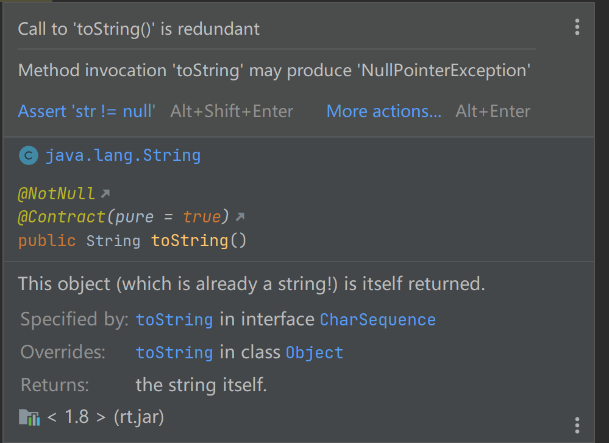

### 2.7.额外补充
JDK17优化了空指针异常信息(Helpful NullPointerExceptions)  
通过精确描述哪个变量为空来提高JVM生成的空指针异常信息的可用性。  
即，以前的空指针异常信息不会告诉你具体是哪个对象为null，当运行的语句是对一个嵌套结构的对象做连续的方法调用(如"a.getb().getc().xxx()")时，就需要进一步分析或调试才能判断出谁是null。而该特性加入以后则直接在异常信息中说明值为null的对象是哪个。

```java
/**
 * @author 百里
 */
public class BaiLiNpeDemo {
    public static void main(String[] args) {
        Address myAddress = new Address("123 Main St", null, "CA");
        User myUser = new User("John Doe", 35, myAddress);
        System.out.println(myUser.getAddress().getCity().trim());
    }
}
```

执行结果：

```java
Exception in thread "main" java.lang.NullPointerException: Cannot invoke "String.trim()" because the return value of "npe.Address.getCity()" is null
	at npe.BaiLiNpeDemo.main(BaiLiNpeDemo.java:16)
```

# <font style="color:#01B2BC;">什么是 CopyOnWriteArrayList</font>
## 1.Copy-On-Write 是什么？
Copy-On-Write它是一种在计算机科学中常见的优化技术，主要应用于需要频繁读取但很少修改的数据结构上。  
简单的说就是在计算机中就是当你想要对一块内存进行修改时，我们不在原有内存块中进行写操作，而是将内存拷贝一份，在新的内存中进行写操作，写完之后呢，就将指向原来内存指针指向新的内存，原来的内存就可以被回收掉了！  
既然是一种优化策略，我们看一段代码：

```java
import java.util.ArrayList;
import java.util.Arrays;
import java.util.Iterator;
import java.util.List;

/**
* @author 百里
*/
public class BaiLiIteratorTest {
    private static List<String> list = new ArrayList<>();

    public static void main(String[] args) {
        list.add("1");
        list.add("2");
        list.add("3");
        Iterator<String> iter = list.iterator();
        while (iter.hasNext()) {
            System.err.println(iter.next());
        }
        System.err.println(Arrays.toString(list.toArray()));
    }
}
```

上面的Demo在单线程下执行时没什么毛病，但是在多线程的环境中，就可能出异常，为什么呢？  
因为多线程迭代时如果有其他线程对这个集合list进行增减元素，会抛出java.util.ConcurrentModificationException的异常。  
我们以增加元素为例子，运行下面这Demo：

```java
import java.util.ArrayList;
import java.util.Iterator;
import java.util.List;
import java.util.concurrent.ExecutorService;
import java.util.concurrent.Executors;

/**
 * 并发迭代器问题示例代码
 * @author 百里
 */
public class BaiLiConcurrentIteratorTest {
    // 创建一个ArrayList对象
    private static List<String> list = new ArrayList<>();

    public static void main(String[] args) throws InterruptedException {
        // 给ArrayList添加三个元素："1"、"2"和"3"
        list.add("1");
        list.add("2");
        list.add("3");

        // 开启线程池，提交10个线程用于在list尾部添加5个元素"121"
        ExecutorService service = Executors.newFixedThreadPool(10);
        for (int i = 0; i < 10; i++) {
            service.execute(() -> {
                for (int j = 0; j < 5; j++) {
                    list.add("121");
                }
            });
        }

        // 使用Iterator迭代器遍历list并输出元素值
        Iterator<String> iter = list.iterator();
        for (int i = 0; i < 10; i++) {
            service.execute(() -> {
                while (iter.hasNext()) {
                    System.err.println(iter.next());
                    try {
                        Thread.sleep(10);
                    } catch (InterruptedException e) {
                        e.printStackTrace();
                    }
                }
            });
        }
        service.shutdown();
    }
}
```

**这里暴露的问题是什么呢？**

+ 多线程场景下迭代器遍历集合的读取操作和其他线程对集合进行写入操作会导致出现并发修改异常

解决方案：

+ CopyOnWriteArrayList避免了多线程操作List线程不安全的问题

## 2.CopyOnWriteArrayList介绍
从JDK1.5开始Java并发包里提供了两个使用CopyOnWrite机制实现的并发容器，它们是CopyOnWriteArrayList和CopyOnWriteArraySet。CopyOnWrite容器非常有用，可以在非常多的并发场景中使用到。  
**CopyOnWriteArrayList原理：**  
在写操作(add、remove等)时，不直接对原数据进行修改，而是先将原数据复制一份，然后在新复制的数据上执行写操作，最后将原数据引用指向新数据。这样做的好处是读操作(get、iterator等)可以不加锁，因为读取的数据始终是不变的。  
接下来我们就看下源码怎么实现的。

## 3.CopyOnWriteArrayList简单源码解读
add()方法源码：

```java
/**
* Appends the specified element to the end of this list.
*
* @param e element to be appended to this list
* @return {@code true} (as specified by {@link Collection#add})
*/
public boolean add(E e) {
    final ReentrantLock lock = this.lock;//重入锁
	lock.lock();//加锁啦
    try {
        Object[] elements = getArray();
        int len = elements.length;
        Object[] newElements = Arrays.copyOf(elements, len + 1);//拷贝新数组
        newElements[len] = e;
        setArray(newElements);//将引用指向新数组  1
        return true;
    } finally {
        lock.unlock();//解锁啦
    }
}
```

可以看到，CopyOnWriteArrayList中的写操作都需要先获取锁，然后再将当前的元素数组复制一份，并在新复制的元素数组上执行写操作，最后将数组引用指向新数组。

```java
@SuppressWarnings("unchecked")
public E next() {
    if (! hasNext()) //是否存在下一个元素
        throw new NoSuchElementException(); //没有下一个元素，则会抛出NoSuchElementException异常
    //snapshot是一个类成员变量，它是在创建迭代器时通过复制集合内容而获得的一个数组。
    //cursor是另一个类成员变量，初始值为0，并在每次调用next()时自增1，表示当前返回元素的位置。
    return (E) snapshot[cursor++];
}
```

而读操作不需要加锁，直接返回当前的元素数组即可。  
这种写时复制的机制保证了读操作的线程安全性，但是会牺牲一些写操作的性能，因为每次修改都需要复制一份数组。因此，适合读远多于写的场合。  
所以我们将多线程Demo中的ArrayList改为CopyOnWriteArrayList，执行就不会报错啦！

```java
import java.util.Iterator;
import java.util.concurrent.CopyOnWriteArrayList;
import java.util.concurrent.ExecutorService;
import java.util.concurrent.Executors;

/**
* 并发迭代器问题示例代码
* @author 百里
*/
public class BaiLiConcurrentIteratorTest {
    // 创建一个ArrayList对象
    private static CopyOnWriteArrayList<String> list = new CopyOnWriteArrayList<>();

    public static void main(String[] args) throws InterruptedException {
        // 给ArrayList添加三个元素："1"、"2"和"3"
        list.add("1");
        list.add("2");
        list.add("3");

        // 开启线程池，提交10个线程用于在list尾部添加5个元素"121"
        ExecutorService service = Executors.newFixedThreadPool(10);
        for (int i = 0; i < 10; i++) {
            service.execute(() -> {
                for (int j = 0; j < 5; j++) {
                    list.add("121");
                }
            });
        }

        // 使用Iterator迭代器遍历list并输出元素值
        Iterator<String> iter = list.iterator();
        for (int i = 0; i < 10; i++) {
            service.execute(() -> {
                while (iter.hasNext()) {
                    System.err.println(iter.next());
                    try {
                        Thread.sleep(10);
                    } catch (InterruptedException e) {
                        e.printStackTrace();
                    }
                }
            });
        }
        service.shutdown();
    }
}
```

## 4.CopyOnWriteArrayList优缺点
优点：

1. **线程安全。**CopyOnWriteArrayList是线程安全的，由于写操作对原数据进行复制，因此写操作不会影响读操作，读操作可以不加锁，降低了并发冲突的概率。
2. **不会抛出ConcurrentModificationException异常。**由于读操作遍历的是不变的数组副本，因此不会抛出ConcurrentModificationException异常。

缺点：

1. **写操作性能较低。**由于每一次写操作都需要将元素复制一份，因此写操作的性能较低。
2. **内存占用增加。**由于每次写操作都需要创建一个新的数组副本，因此内存占用会增加，特别是当集合中有大量数据时，内存占用较高。
3. **数据一致性问题。**由于读操作遍历的是不变的数组副本，因此在对数组执行写操作期间，读操作可能读取到旧的数组数据，这就涉及到数据一致性问题。

## 5.CopyOnWriteArrayList使用场景
+ 读多写少。为什么？因为写的时候会复制新集合
+ 集合不大。为什么？因为写的时候会复制新集合
+ 实时性要求不高。为什么，因为有可能会读取到旧的集合数据

# <font style="color:#01B2BC;">List操作的一些常见问题</font>
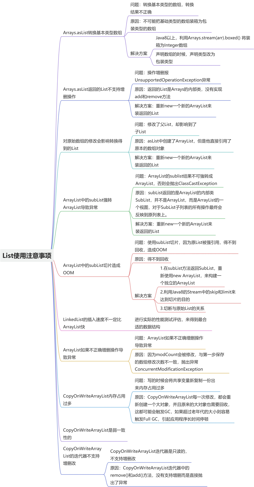

## 阿里巴巴开发手册强制规约：
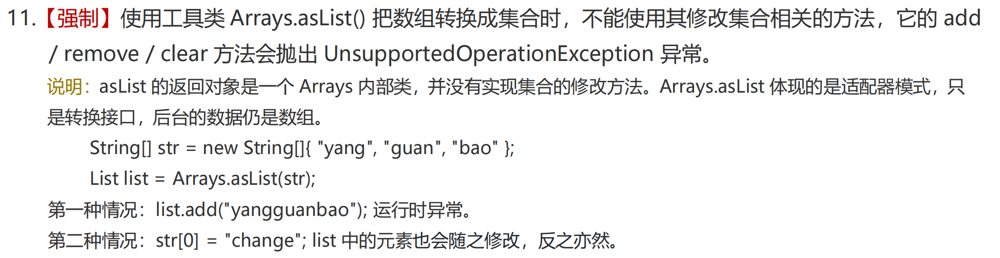  
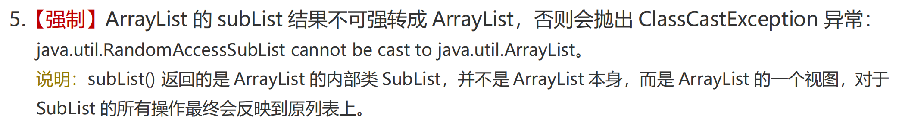  
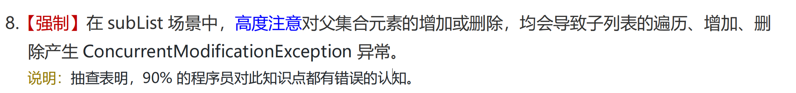

## 1. Arrays.asList转换基本类型数组
在实际的业务开发中，我们通常会进行数组转List的操作，通常我们会使用Arrays.asList来进行转换，但是在转换基本类型的数组的时候，却出现转换的结果和我们想象的不一致。

```java
import java.util.Arrays;
import java.util.List;

/**
 * Arrays.asList数组常见问题
 * @author 百里
 */
public class BaiLiTestDemo {
    public static void main(String[] args) {
        int[] arr = {1, 2, 3};
        List list = Arrays.asList(arr);
        System.out.println("list.size：" + list.size());
        for (int i = 0; i < list.size(); i++) {
            System.out.println("循环打印：" + list.get(i));
        }
    }
}
```

观察下asList的实现，可以看到是入参是使用的是泛型，所以会将{1, 2, 3}三个整数放入一个泛型列表中返回。

```java
public static List asList(T... a) {
    return new ArrayList<>(a); 
}
```

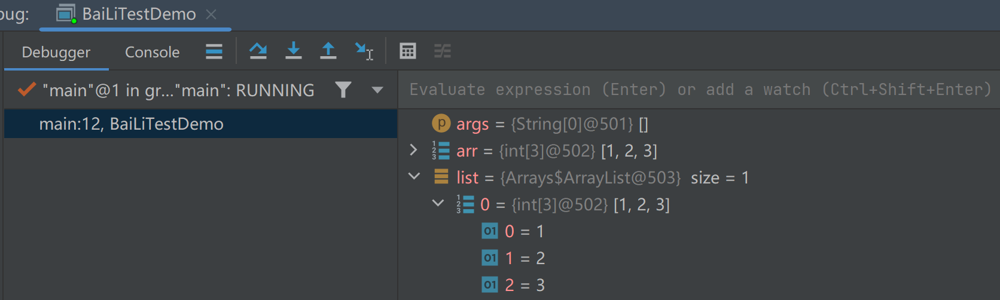  
那我们该如何解决呢？只需要在声明数组的时候，声明类型改为包装类型。

```java
import java.util.Arrays;
import java.util.List;

/**
 * Arrays.asList数组常见问题
 * @author 百里
 */
public class BaiLiTestDemo {
    public static void main(String[] args) {
        Integer[] arr = {1, 2, 3};
        List list = Arrays.asList(arr);
        System.out.println("list.size：" + list.size());//size = 3
        for (int i = 0; i < list.size(); i++) {
            System.out.println("循环打印：" + list.get(i));
        }
    }
}
```

这就是第一个坑了，然而Arrays.asList不止这一个需要注意的问题，我们继续往下看：

## 2. Arrays.asList返回的List不支持增删操作
我们接着上面的demo，增加list加减的逻辑，运行demo会提示UnsupportedOperationException：

```java
import java.util.Arrays;
import java.util.List;

/**
 * Arrays.asList数组常见问题
 * @author 百里
 */
public class BaiLiTestDemo {
    public static void main(String[] args) {
        Integer[] arr = {1, 2, 3};
        List list = Arrays.asList(arr);
        System.out.println("list.size：" + list.size());
        list.add(4);
    }
}
```

为什么会这样？我们看下asList的实现，它返回的ArrayList是Arrays的内部类，而不是我们通常使用的java.util.ArrayList：  
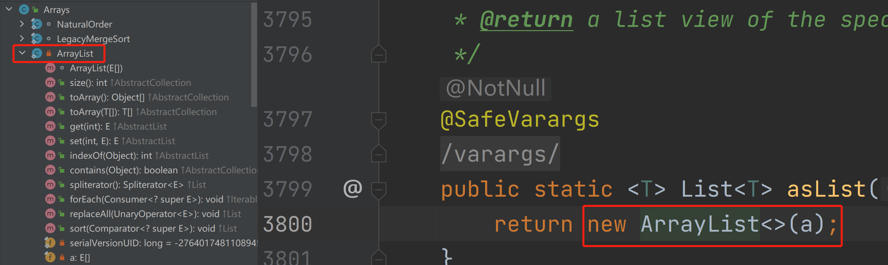  
可以看到内部类中的ArrayList没有add()与remove()，那我们怎么可以使用增减方法呢，继续往下看：  
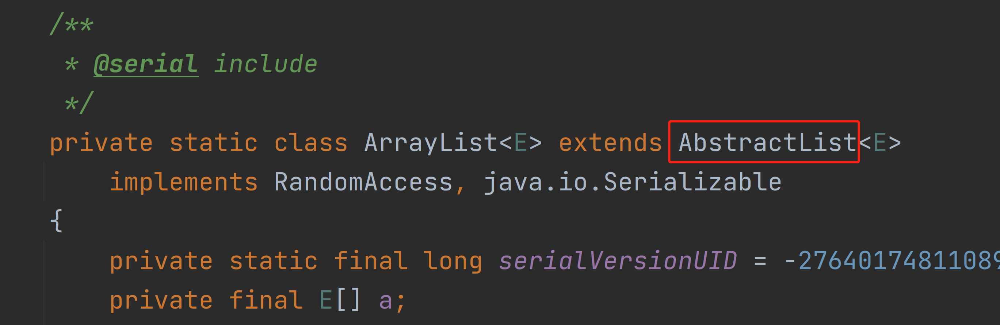  
可以看到ArrayList继承了AbstractList类，我们观察AbstractList类的add()与remove()：  
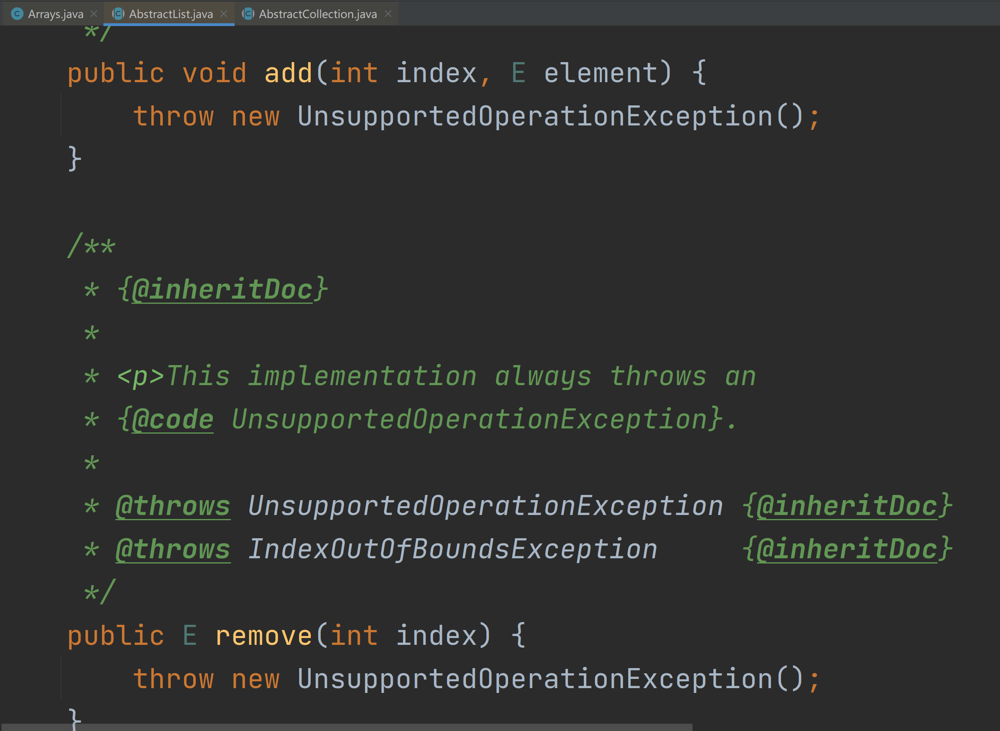  
现在是不是就理解Arrays.asList返回的List不支持增删操作了。

## 3. 对原始数组的修改会影响到我们获得的那个List
基于第一个demo我们继续改造，修改原arr[0]=10，这个时候打印Arrays.asList返回的list值也发生了改变：

```java
import java.util.Arrays;
import java.util.List;

/**
 * Arrays.asList数组常见问题
 * @author 百里
 */
public class BaiLiTestDemo {
    public static void main(String[] args) {
        Integer[] arr = {1, 2, 3};
        List list = Arrays.asList(arr);
        System.out.println("list.size：" + list.size());
        arr[0] = 10;//修改原数组
        for (int i = 0; i < list.size(); i++) {
            System.out.println("循环打印：" + list.get(i));
        }
    }
}
```

为什么呢？观察ArrayList的实现，可以知道asList创建了 ArrayList，但它直接引用原本的数据组对象。所以只要原本的数组对象一发生变化，List也跟着变化。  
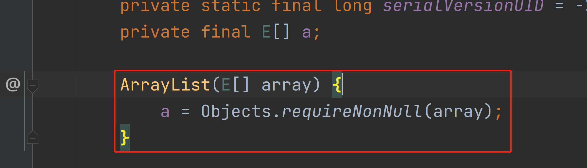  
解决方案：new一个新的ArrayList装Arrays.asList返回数据。

```java
import java.util.ArrayList;
import java.util.Arrays;
import java.util.List;

/**
 * Arrays.asList数组常见问题
 * @author 百里
 */
public class BaiLiTestDemo {
    public static void main(String[] args) {
        Integer[] arr = {1, 2, 3};
        List list = new ArrayList<>(Arrays.asList(arr));
        arr[0] = 10;
        for (int i = 0; i < list.size(); i++) {
            System.out.println("循环打印：" + list.get(i));
        }
    }
}
```

## 4. ArrayList.subList强转ArrayList导致异常
当使用ArrayList.subList的返回list强转ArrayList时，会出现java.lang.ClassCastException，看以下代码：

```java
import java.util.ArrayList;
import java.util.List;

/**
 * ArrayList.subList常见问题
 * @author 百里
 */
public class BaiLiArrayListDemo {
    public static void main(String[] args) {
        List<String> names = new ArrayList<String>() {{
            add("one");
            add("two");
            add("three");
        }};
        ArrayList strings = (ArrayList) names.subList(0, 1);
        System.out.println(strings);
    }
}
```

```java
Exception in thread "main" java.lang.ClassCastException: java.util.ArrayList$SubList cannot be cast to java.util.ArrayList
	at BaiLiArrayListDemo.main(BaiLiArrayListDemo.java:15)
```

同样的，我们看下sublist的实现：  
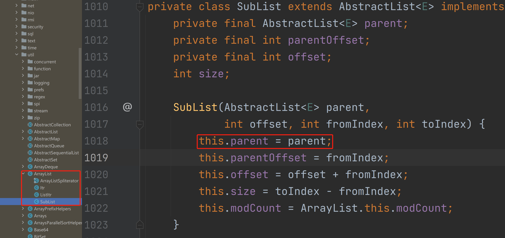  
可以看到SubList()实际上没有创建一个新的List，而是直接引用了原来的List，指定了元素的范围。并且返回的是一个内部类实现的SubList对象，该对象只是原始ArrayList的一个引用，而不是一个全新的ArrayList，因此无法直接将其强制转换为ArrayList类型。  
由于是引用的原List，因此也会存在asList的问题，也就是针对subList进行增减数据，会影响原List的值。

```java
import java.util.ArrayList;
import java.util.List;

/**
 * ArrayList.subList常见问题
 * @author 百里
 */
public class BaiLiArrayListDemo {
    public static void main(String[] args) {
        List<String> names = new ArrayList<String>() {{
            add("one");
            add("two");
            add("three");
        }};
        List  strings = names.subList(0, 1);
        strings.add(0,"four");
        System.out.println(strings);//[four, one]
        System.out.println(names);//[four, one, two, three]
    }
}
```

需要注意修改原List-names的值会出导致strings的遍历、增加、删除产生ConcurrentModificationException异常。

```java
import java.util.ArrayList;
import java.util.List;

/**
 * ArrayList.subList常见问题
 * @author 百里
 */
public class BaiLiArrayListDemo {
    public static void main(String[] args) {
        List<String> names = new ArrayList<String>() {{
            add("one");
            add("two");
            add("three");
        }};
        List strings = names.subList(0, 1);
        names.add("four");
        System.out.println(strings);
        System.out.println(names);
    }
}
```

```java
Exception in thread "main" java.util.ConcurrentModificationException
	at java.util.ArrayList$SubList.checkForComodification(ArrayList.java:1231)
	at java.util.ArrayList$SubList.listIterator(ArrayList.java:1091)
	at java.util.AbstractList.listIterator(AbstractList.java:299)
	at java.util.ArrayList$SubList.iterator(ArrayList.java:1087)
	at java.util.AbstractCollection.toString(AbstractCollection.java:454)
	at java.lang.String.valueOf(String.java:2994)
	at java.io.PrintStream.println(PrintStream.java:821)
	at BaiLiArrayListDemo.main(BaiLiArrayListDemo.java:17)
```

上面问题的解决方案跟asList同样，直接new一个新的ArrayList装Arrays.subList返回数据就可以了。

```java
import java.util.ArrayList;
import java.util.List;

/**
 * ArrayList.subList常见问题
 * @author 百里
 */
public class BaiLiArrayListDemo {
    public static void main(String[] args) {
        List<String> names = new ArrayList<String>() {{
            add("one");
            add("two");
            add("three");
        }};
        List strings = new ArrayList<>(names.subList(0, 1));
        strings.add("four");
        System.out.println(strings);//[one, four]
        System.out.println(names);//[one, two, three]
    }
}
```

## 5. ArrayList中的subList切片造成OOM
subList所产生的List，其实是对原来List对象的引用，这个产生的List只是原来List对象的视图，也就是说虽然值切片获取了一小段数据，但是原来的List对象却得不到回收，如果这个原来的对象很大，就会出现OOM的情况。我们将VM参数调小：-Xms20m -Xmx40m

```java
import java.util.ArrayList;
import java.util.List;
import java.util.stream.Collectors;
import java.util.stream.IntStream;

/**
 * ArrayList.subList常见问题
 * @author 百里
 */
public class BaiLiArrayListDemo {
    public static void main(String[] args) {
        List data = new ArrayList<>();
        IntStream.range(0, 1000).forEach(i ->{
            List<Integer> collect = 
                    IntStream.range(0, 100000).boxed().
                            collect(Collectors.toList());
            data.add(collect.subList(0, 1));
        });
    }
}
```

出现OOM的原因：原数组无法被回收，会一直在内存中。  
解决方案：new一个新的ArrayList接收subList返回。

## 6.Copy-On-Write 是什么？
Copy-On-Write它是一种在计算机科学中常见的优化技术，主要应用于需要频繁读取但很少修改的数据结构上。  
简单的说就是在计算机中就是当你想要对一块内存进行修改时，我们不在原有内存块中进行写操作，而是将内存拷贝一份，在新的内存中进行写操作，写完之后呢，就将指向原来内存指针指向新的内存，原来的内存就可以被回收掉了！  
既然是一种优化策略，我们看一段代码：

```java
import java.util.ArrayList;
import java.util.Arrays;
import java.util.Iterator;
import java.util.List;

/**
* @author 百里
*/
public class BaiLiIteratorTest {
    private static List<String> list = new ArrayList<>();

    public static void main(String[] args) {
        list.add("1");
        list.add("2");
        list.add("3");
        Iterator<String> iter = list.iterator();
        while (iter.hasNext()) {
            System.err.println(iter.next());
        }
        System.err.println(Arrays.toString(list.toArray()));
    }
}
```

上面的Demo在单线程下执行时没什么毛病，但是在多线程的环境中，就可能出异常，为什么呢？  
因为多线程迭代时如果有其他线程对这个集合list进行增减元素，会抛出java.util.ConcurrentModificationException的异常。  
我们以增加元素为例子，运行下面这Demo：

```java
import java.util.ArrayList;
import java.util.Iterator;
import java.util.List;
import java.util.concurrent.ExecutorService;
import java.util.concurrent.Executors;

/**
 * 并发迭代器问题示例代码
 * @author 百里
 */
public class BaiLiConcurrentIteratorTest {
    // 创建一个ArrayList对象
    private static List<String> list = new ArrayList<>();

    public static void main(String[] args) throws InterruptedException {
        // 给ArrayList添加三个元素："1"、"2"和"3"
        list.add("1");
        list.add("2");
        list.add("3");

        // 开启线程池，提交10个线程用于在list尾部添加5个元素"121"
        ExecutorService service = Executors.newFixedThreadPool(10);
        for (int i = 0; i < 10; i++) {
            service.execute(() -> {
                for (int j = 0; j < 5; j++) {
                    list.add("121");
                }
            });
        }

        // 使用Iterator迭代器遍历list并输出元素值
        Iterator<String> iter = list.iterator();
        for (int i = 0; i < 10; i++) {
            service.execute(() -> {
                while (iter.hasNext()) {
                    System.err.println(iter.next());
                    try {
                        Thread.sleep(10);
                    } catch (InterruptedException e) {
                        e.printStackTrace();
                    }
                }
            });
        }
        service.shutdown();
    }
}
```

**这里暴露的问题是什么呢？**

+ 多线程场景下迭代器遍历集合的读取操作和其他线程对集合进行写入操作会导致出现并发修改异常

解决方案：

+ CopyOnWriteArrayList避免了多线程操作List线程不安全的问题

## 7.CopyOnWriteArrayList介绍
从JDK1.5开始Java并发包里提供了两个使用CopyOnWrite机制实现的并发容器，它们是CopyOnWriteArrayList和CopyOnWriteArraySet。CopyOnWrite容器非常有用，可以在非常多的并发场景中使用到。  
**CopyOnWriteArrayList原理：**  
在写操作(add、remove等)时，不直接对原数据进行修改，而是先将原数据复制一份，然后在新复制的数据上执行写操作，最后将原数据引用指向新数据。这样做的好处是读操作(get、iterator等)可以不加锁，因为读取的数据始终是不变的。  
接下来我们就看下源码怎么实现的。

## 8.CopyOnWriteArrayList简单源码解读
add()方法源码：

```java
/**
* Appends the specified element to the end of this list.
*
* @param e element to be appended to this list
* @return {@code true} (as specified by {@link Collection#add})
*/
public boolean add(E e) {
    final ReentrantLock lock = this.lock;//重入锁
	lock.lock();//加锁啦
    try {
        Object[] elements = getArray();
        int len = elements.length;
        Object[] newElements = Arrays.copyOf(elements, len + 1);//拷贝新数组
        newElements[len] = e;
        setArray(newElements);//将引用指向新数组  1
        return true;
    } finally {
        lock.unlock();//解锁啦
    }
}
```

可以看到，CopyOnWriteArrayList中的写操作都需要先获取锁，然后再将当前的元素数组复制一份，并在新复制的元素数组上执行写操作，最后将数组引用指向新数组。

```java
@SuppressWarnings("unchecked")
public E next() {
    if (! hasNext()) //是否存在下一个元素
        throw new NoSuchElementException(); //没有下一个元素，则会抛出NoSuchElementException异常
    //snapshot是一个类成员变量，它是在创建迭代器时通过复制集合内容而获得的一个数组。
    //cursor是另一个类成员变量，初始值为0，并在每次调用next()时自增1，表示当前返回元素的位置。
    return (E) snapshot[cursor++];
}
```

而读操作不需要加锁，直接返回当前的元素数组即可。  
这种写时复制的机制保证了读操作的线程安全性，但是会牺牲一些写操作的性能，因为每次修改都需要复制一份数组。因此，适合读远多于写的场合。  
所以我们将多线程Demo中的ArrayList改为CopyOnWriteArrayList，执行就不会报错啦！

```java
import java.util.Iterator;
import java.util.concurrent.CopyOnWriteArrayList;
import java.util.concurrent.ExecutorService;
import java.util.concurrent.Executors;

/**
* 并发迭代器问题示例代码
* @author 百里
*/
public class BaiLiConcurrentIteratorTest {
    // 创建一个ArrayList对象
    private static CopyOnWriteArrayList<String> list = new CopyOnWriteArrayList<>();

    public static void main(String[] args) throws InterruptedException {
        // 给ArrayList添加三个元素："1"、"2"和"3"
        list.add("1");
        list.add("2");
        list.add("3");

        // 开启线程池，提交10个线程用于在list尾部添加5个元素"121"
        ExecutorService service = Executors.newFixedThreadPool(10);
        for (int i = 0; i < 10; i++) {
            service.execute(() -> {
                for (int j = 0; j < 5; j++) {
                    list.add("121");
                }
            });
        }

        // 使用Iterator迭代器遍历list并输出元素值
        Iterator<String> iter = list.iterator();
        for (int i = 0; i < 10; i++) {
            service.execute(() -> {
                while (iter.hasNext()) {
                    System.err.println(iter.next());
                    try {
                        Thread.sleep(10);
                    } catch (InterruptedException e) {
                        e.printStackTrace();
                    }
                }
            });
        }
        service.shutdown();
    }
}
```

## 9.CopyOnWriteArrayList优缺点
优点：

1. **线程安全。**CopyOnWriteArrayList是线程安全的，由于写操作对原数据进行复制，因此写操作不会影响读操作，读操作可以不加锁，降低了并发冲突的概率。
2. **不会抛出ConcurrentModificationException异常。**由于读操作遍历的是不变的数组副本，因此不会抛出ConcurrentModificationException异常。

缺点：

1. **写操作性能较低。**由于每一次写操作都需要将元素复制一份，因此写操作的性能较低。
2. **内存占用增加。**由于每次写操作都需要创建一个新的数组副本，因此内存占用会增加，特别是当集合中有大量数据时，内存占用较高。
3. **数据一致性问题。**由于读操作遍历的是不变的数组副本，因此在对数组执行写操作期间，读操作可能读取到旧的数组数据，这就涉及到数据一致性问题。

## 10.CopyOnWriteArrayList使用场景
+ 读多写少。为什么？因为写的时候会复制新集合
+ 集合不大。为什么？因为写的时候会复制新集合
+ 实时性要求不高。为什么，因为有可能会读取到旧的集合数据

# <font style="color:#01B2BC;">如何优雅的删除HashMap元素</font>
## 图灵学院-百里
## 1.数据准备
```java
public Map<String, String> initMap = new HashMap<String, String>() {{
    put("user1", "刘零");
    put("user2", "郑一");
    put("user3", "吴二");
    put("user4", "张三");
    put("user5", "李四");
    put("user6", "王五");
    put("user7", "钱六");
    put("user8", "孙七");
}};
```

## 2.删除方式
### 2.1.使用增强 for 循环删除
```java
/**
 * 使用 for 循环删除
 */
public void remove1() {
    Set<Map.Entry<String, String>> entries = new CopyOnWriteArraySet<>(initMap.entrySet());
    for (Map.Entry<String, String> entry : entries) {
        if ("王五".equals(entry.getValue())) {
            initMap.remove(entry.getKey());
        }
    }
    System.out.println(initMap);
}
```

输出结果：  
`{user1=刘零, user2=郑一, user7=钱六, user8=孙七, user5=李四, user3=吴二, user4=张三}`  
通过HashMap的entrySet方法获取元素集合，然后再进行循环遍历，判断value值是否为需要删除的元素，再移除对应的Key。  
需要注意增强的 for 循环底层使用的迭代器 Iterator，而 HashMap 是 fail-fast 原则的错误机制，所以遍历时删除元素会出现 java.util.ConcurrentModificationException 并发修改异常。我们可以使用CopyOnWriteArraySet封装一层避免出现并发修改异常。

+ fail-fast:为了将错误或异常情况尽早暴露出来，避免潜在的问题在后续代码中蔓延，提高系统的稳定性和可靠性。

### 2.2.使用 forEach 循环删除
```java
/**
 * 使用 forEach 循环删除
 */
public void remove2() {
    ConcurrentHashMap<String, String> map = new ConcurrentHashMap<>(initMap);
    map.forEach((k, v) -> {
        if ("王五".equals(v)) {
            map.remove(k);
        }
    });
    System.out.println(map);
}
```

输出结果：  
`{user1=刘零, user2=郑一, user7=钱六, user8=孙七, user5=李四, user3=吴二, user4=张三}`  
通过HashMap的forEach方法循环删除目标元素，同样的使用了ConcurrentHashMap封装避免出现并发修改异常。

### 2.3.使用 Iterator 迭代器删除
```java
/**
 * 使用 Iterator 迭代器删除
 */
@Test
public void remove3() {
    ConcurrentHashMap<String, String> resultMap = new ConcurrentHashMap<>();
    Iterator<Map.Entry<String, String>> iterator
            = new ConcurrentHashMap<>(initMap).entrySet().iterator();
    while (iterator.hasNext()) {
        Map.Entry<String, String> entry = iterator.next();
        if ("王五".equals(entry.getValue())) {
            iterator.remove();
        }else {
            resultMap.put(entry.getKey(),entry.getValue());
        }
    }
    System.out.println(resultMap);
}
```

输出结果：  
`{user1=刘零, user2=郑一, user7=钱六, user8=孙七, user5=李四, user3=吴二, user4=张三}`  
通过Iterator迭代删除元素不会出现并发修改异常，但由于HashMap是线程不安全的，这时如果多个线程同时修改HashMap数据也会出现并发修改异常 ，日常使用可以先用ConcurrentHashMap封装。

### 2.4.使用 removeIf 删除（推荐使用）
```java
/**
 * 使用 removeIf 删除
 */
public void remove4() {
    initMap.entrySet().removeIf(entry -> "王五".equals(entry.getValue()));
    System.out.println(initMap);
}
```

输出结果：  
`{user1=刘零, user2=郑一, user7=钱六, user8=孙七, user5=李四, user3=吴二, user4=张三}`  
通过entrySet获取元素然后使用removeIf方法删除目标数据；而removeIf的底层是通过Iterator迭代器实现的。所以也存在第三种方法同样的问题。

```java
default boolean removeIf(Predicate<? super E> filter) {
    Objects.requireNonNull(filter);
    boolean removed = false;
    final Iterator<E> each = iterator();
    while (each.hasNext()) {
        if (filter.test(each.next())) {
            each.remove();
            removed = true;
        }
    }
    return removed;
}
```

### 2.5.使用 Stream 删除（推荐使用）
```java
/**
 * 使用 Stream 删除
 */
public void remove5() {
    Map<String, String> map = initMap.entrySet().stream()
            .filter(entry -> !"王五".equals(entry.getValue()))
            .collect(Collectors.toMap(Map.Entry::getKey, Map.Entry::getValue));
    System.out.println(map);
}
```

输出结果：  
`{user1=刘零, user2=郑一, user7=钱六, user8=孙七, user5=李四, user3=吴二, user4=张三}`  
通过Stream 的 filter 方法进行过滤，然后生成一个新的map。这种方式“一行代码“就能够实现删除的动作，并且没有并发问题。

# <font style="color:#01B2BC;">使用BigDecimal 一定需要注意的几个坑</font>
## BigDecimal概述
BigDecimal 是 Java 中的一个类，用于精确表示和操作任意精度的十进制数。它提供了高精度的数值计算，并且可以避免浮点数计算中常见的精度丢失问题。  
它提供了大量的方法来支持基本的数学运算，如加法、减法、乘法、除法等。它还支持比较操作和取整操作，可以设置小数位数、舍入模式等。此外，BigDecimal 还提供了一些其他功能，如转换为科学计数法、格式化输出、判断是否是整数等。  
适用场景：需要处理精确计算或防止浮点数计算精度丢失的场景。

## BigDecimal常见陷阱
### 1.使用BigDecimal的构造函数传入浮点数
其实这个问题我们在使用Float、Double等浮点类型进行计算时，也会经常遇到，比如说下面这个代码

```java
@Test
public void bigDecimalDemo1() {
    float float1 = 1;
    float float2 = 0.9f;
    System.out.println(float1 - float2);
}
```

输出结果是多少呢？0.1？不是，输出结果是0.100000024。因为 0.9 无法被精确表示为有限位数的二进制小数。在转换为二进制时可能会产生近似值。因此，在进行减法运算时，实际上是对近似值进行计算，而不是对准确的 0.9 进行计算。这导致了精度丢失，最终的计算结果也是一个近似值。因此，输出结果不是准确的 0.1，而是一个近似值。  
小伙伴肯定能想到使用BigDecimal来避免这个问题，这时候第一个需要避免的陷阱就来了。看以下代码：

```java
@Test
public void bigDecimalDemo2(){
    BigDecimal bigDecimal1 = new BigDecimal(0.01);
    BigDecimal bigDecimal2 = BigDecimal.valueOf(0.01);
    System.out.println("bigDecimal1 = " + bigDecimal1);
    System.out.println("bigDecimal2 = " + bigDecimal2);
}
```

输出结果如下：

:::tips
bigDecimal1 = 0.01000000000000000020816681711721685132943093776702880859375  
bigDecimal2 = 0.01

:::

观察输出结果我们可以知道，使用BigDecimal时同样会有精度的问题。所以我们在创建BigDecimal对象时，有初始值使用BigDecimal.valueOf()的方式，可以避免出现精度问题。

#### 为什么会出现差异？
在使用new BigDecimal()实际上是将 0.01 转换为二进制近似值，并将其存储为 BigDecimal 对象。因此，结果中存在微小的误差，即输出结果为0.01000000000000000020816681711721685132943093776702880859375。  
而BigDecimal.valueOf()不同，其内部是先将double转为String，因此不存在精度问题。

```java
public static BigDecimal valueOf(double val) {
    // Reminder: a zero double returns '0.0', so we cannot fastpath
    // to use the constant ZERO.  This might be important enough to
    // justify a factory approach, a cache, or a few private
    // constants, later.
    return new BigDecimal(Double.toString(val));
}
```

TIPS：

:::tips
1. 使用整数或长整数作为参数构造： 
    - BigDecimal(int val)：使用一个 int 类型的整数值创建 BigDecimal。
    - BigDecimal(long val)：使用一个 long 类型的整数值创建 BigDecimal。

 

2. 使用字符串作为参数构造： 
    - BigDecimal(String val)：使用一个字符串表示的数值创建 BigDecimal。该字符串可以包含整数部分、小数部分和指数部分。

 

3. 使用双精度浮点数作为参数构造： 
    - BigDecimal(double val)：使用一个 double 类型的浮点数值创建 BigDecimal。注意，由于浮点数精度可能丢失，建议使用字符串或其他方法构造 BigDecimal，以避免精度损失问题。

 

4. 使用基于 BigInteger 的构造方法： 
    - BigDecimal(BigInteger val)：使用一个 BigInteger 对象来创建 BigDecimal。

 

:::

### 2.使用equals()方法进行数值比较
日常项目我们是如何进行BigDecimal数值比较呢？使用equals方法还是compareTo方法？如果使用的是equals方法，那就需要注意啦。看一下示例：

```java
@Test
public void bigDecimalDemo3(){
    BigDecimal bigDecimal1 = new BigDecimal("0.01");
    BigDecimal bigDecimal2 = new BigDecimal("0.010");
    System.out.println(bigDecimal1.equals(bigDecimal2));
    System.out.println(bigDecimal1.compareTo(bigDecimal2));
}
```

输出结果如下：

:::tips
false  
0

:::

观察结果可以知道使用equals比较结果是不相等的；compareTo的结果为0代表两个数相等；

+ compareTo实现了Comparable接口，比较的是值的大小，返回的值为-1-小于，0-等于，1-大于。

#### 为什么equals返回的是false？
```java
public boolean equals(Object x) {
    if (!(x instanceof BigDecimal))
        return false;
    BigDecimal xDec = (BigDecimal) x;
    if (x == this)
        return true;
    if (scale != xDec.scale)
        return false;
    long s = this.intCompact;
    long xs = xDec.intCompact;
    if (s != INFLATED) {
        if (xs == INFLATED)
            xs = compactValFor(xDec.intVal);
        return xs == s;
    } else if (xs != INFLATED)
        return xs == compactValFor(this.intVal);

    return this.inflated().equals(xDec.inflated());
}
```

我们观察equals的实现逻辑可以知道，BigDecimal重写了equals方法，重写后的关键代码：

:::tips
if (scale != xDec.scale)  
        return false;

:::

也就是会比较两个数值的精度，精度不同返回false。

### 3.使用不正确的舍入模式
使用BigDecimal进行运算时，一定要正确的使用舍入模式，避免舍入误差引起的问题，并且有时候出现结果是无限小数，程序会抛出异常，比如说：

```java
@Test
public void bigDecimalDemo4(){
    BigDecimal bigDecimal1 = new BigDecimal("1.00");
    BigDecimal bigDecimal2 = new BigDecimal("3.00");
    BigDecimal bigDecimal3 = bigDecimal1.divide(bigDecimal2);
    System.out.println(bigDecimal3);
}
```

输出结果如下：

:::tips
java.lang.ArithmeticException: Non-terminating decimal expansion; no exact representable decimal result.

:::

简单的来说，如果在除法运算过程中，其结果是一个无限小数，而操作的结果预期是一个精确的数字，那么将会抛出ArithmeticException异常。  
此时，我们只要正确指定结果精度即可：

```java
@Test
public void bigDecimalDemo4(){
    BigDecimal bigDecimal1 = new BigDecimal("1.00");
    BigDecimal bigDecimal2 = new BigDecimal("3.00");
    BigDecimal bigDecimal3 = bigDecimal1.divide(bigDecimal2, 2, RoundingMode.HALF_UP);
    System.out.println(bigDecimal3);
}
```

输出结果如下：

:::tips
0.33

:::

#### TIPS：
:::tips
+ RoundingMode.UP：向远离零的方向舍入
+ RoundingMode.DOWN：向靠近零的方向舍入
+ RoundingMode.CEILING：向正无穷方向舍入
+ RoundingMode.FLOOR：向负无穷方向舍入
+ RoundingMode.HALF_UP：四舍五入，如果舍弃部分大于等于 0.5
+ RoundingMode.HALF_DOWN：四舍五入，如果舍弃部分大于 0.5
+ RoundingMode.HALF_EVEN：银行家舍入法，遵循 IEEE 754 标准

:::

## 总结：


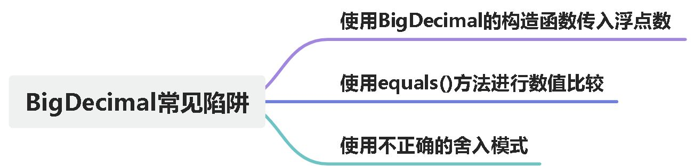

+ 尽量使用字符串而非浮点类型来构造 BigDecimal 对象，以避免浮点数转换精度问题。
+ 如果无法避免使用浮点类型，则可使用 BigDecimal.valueOf 方法来构造初始化值，以确保精确表示。
+ 比较两个 BigDecimal 值的大小时，使用 compareTo 方法。如果需要严格限制精度的比较，可以考虑使用 equals 方法。
+ 在进行 BigDecimal 运算前，明确指定精度和舍入模式。使用 setScale 方法设置精度，使用 setRoundingMode 方法设置舍入模式。

# <font style="color:#01B2BC;">鱼和熊掌不可兼得之CAP定理</font>
## 什么是 CAP 定理？
CAP 定理是一个分布式系统设计的基本原则。它指出，在一个分布式系统中，无法同时满足一致性（Consistency）、可用性（Availability）和分区容错性（Partition tolerance）三个特性。

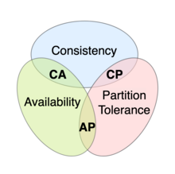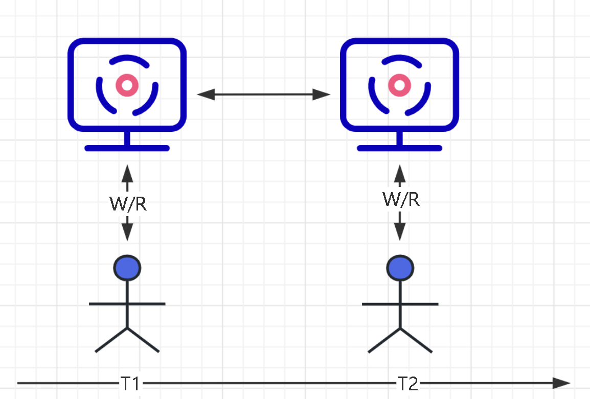

一致性 C：每次请求都会获取最新的数据或错误。

+ 在网络分区期间，系统会保持对于客户端的读操作要么返回最新的数据，要么返回错误。

可用性 A：每个请求都会得到响应，但不能保证其中包含最新写入。 

+ 无论何时，任何客户端的请求都应该能够得到有效的响应数据，而不会出现响应错误。即使在网络分区期间，系统也会确保对客户端的请求进行响应。不管数据是否为最新。

分区容错性 P：节点之间的网络出现问题之后，系统仍在继续运行。

+ 由于网络不可靠，当消息丢失或延迟到达时，系统仍会继续提供服务而不会挂掉。分区容忍性意味着系统会继续运行，并努力恢复网络分区后的一致性。

### CAP 为什么不能兼得？
这是因为在网络分区发生时，为了保证系统的可用性和分区容忍性，系统必须允许分区内的节点继续提供服务。而为了保证一致性，所有节点之间需要相互协调和同步，以确保数据的一致性。然而，在网络分区发生时，由于消息传递的延迟、丢失等问题，无法保证所有节点之间的即时一致性。

所以，当发生网络分区时，分布式系统必须在可用性和一致性之间做出折衷选择。具体来说，系统可以选择在网络分区期间放弃一致性，以保证可用性和分区容忍性，这是常见的解决方案。或者系统可以放弃可用性，在网络分区期间停止对外提供服务，等待分区恢复后再提供一致性的数据。

## AP、CP 如何理解？
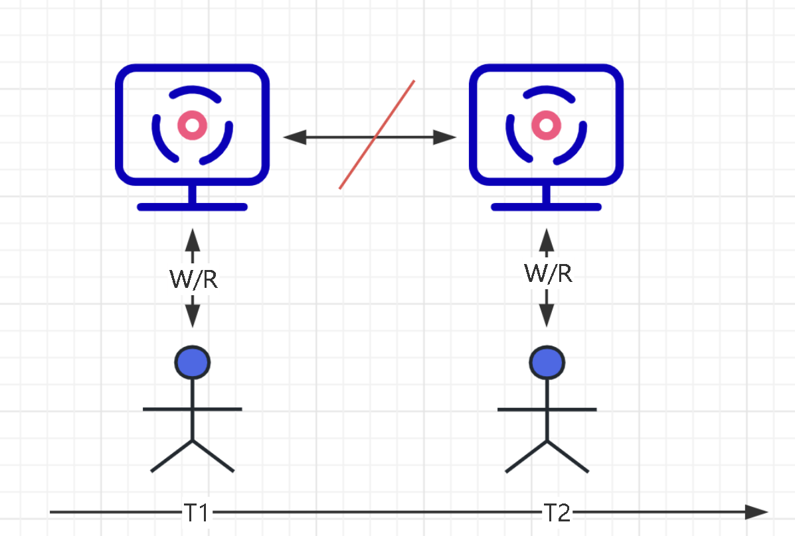

AP（可用性与分区容忍性）：系统能够在网络故障或部分节点失效的情况下继续可用。它侧重于保证系统的稳定性和用户的访问体验。

+ 想象你正在使用一个社交媒体应用，这个应用具有AP属性。即使网络断开或某些服务器出现问题，你仍然可以浏览和发布动态，与朋友互动，尽管可能会遇到一些延迟或数据同步的问题。重点是，你可以随时使用该应用程序，即使在网络不稳定的情况下也能够完成基本操作。

CP(一致性与分区容忍性)：系统保证所有节点上的数据一致性，即使在网络分区时也能保持数据的一致性。它侧重于保持数据的准确性和一致性。

+ 举个例子，假设你正在使用一个在线购物应用，这个应用具有CP属性。当你下订单时，系统会确保将订单信息同步到所有节点，以确保数据的一致性。如果发生网络分区，系统可能会暂停交易，直到网络恢复正常，并确保所有节点上的订单数据是一致的。这样可以避免出现因网络问题而导致订单丢失或重复的情况。

## 额外补充
在分布式系统正常运行时，即不存在网络分区或故障的情况下，的确可以同时满足一致性和可用性，这是因为节点之间可以直接通信来保持数据的一致性，并且系统可以一直对外提供服务。这样的场景下，CAP理论并不适用，因为没有发生需要做出选择的情况。

只有当网络分区或故障发生时，才需要在C和A之间进行权衡选择。在网络分区发生时，为了保证可用性和分区容忍性，系统可能需要放弃一致性，例如采用最终一致性模型。反之，如果一致性是更为重要的需求，系统可以牺牲可用性，在网络分区期间停止对外服务，等待分区恢复后再提供一致性数据。

# <font style="color:#01B2BC;">为什么说BigDecimal适合数值计算</font>
<font style="color:rgb(36, 41, 47);">使用什么类型来进行数值计算？这个问题在程序员群体中一直都是一个争论激烈的问题，</font>

**<font style="color:rgb(36, 41, 47);">Int Long Double Float String BigDecimal</font>**

<font style="color:rgb(36, 41, 47);">如果还能再多几个类型的话，我估计也会有人安排上，究其原因我想大部分都是历史问题。</font>

<font style="color:rgb(36, 41, 47);">如果现在让你从 0 ->1 开始设计一个新的系统，相信大家应该大概也许都会优先考虑使用 BigDecimal 进行运算吧，别告诉我你还会用 String，当然如果是只交付不售后的那种，当我没说。让我来设计的肯定是优先考虑 BigDeCimal 运算了。原因的话我们接下来就一起看看 BigDecimal 的设计就明白了。</font>

## <font style="color:rgb(36, 41, 47);">变量介绍</font>
<font style="color:rgb(36, 41, 47);">首先来看一下BigDecimal的类声明以及几个属性：</font>

```java
public class BigDecimal extends Number implements Comparable<BigDecimal> {
    /**
     * 一个包含整数部分的 BigInteger 对象。
     * 某个整数值本身很大，超出基本数据类型的表示范围
     * 带小数的值转为整数后值很大，超出基本数据类型的表示范围
     */
    private final BigInteger intVal;
    /**
     * 小数点右侧的位数。
     * 它表示了小数的精度，即小数点后的位数。
     */
    private final int scale;
    /**
     * 数值的精度。
     * 它指的是 BigDecimal 数值的总位数，包括整数和小数部分。
     */
    private transient int precision;
    /**
     * 缓存的字符串表示。
     * 当 BigDecimal 被转换为字符串时，会将其缓存起来，以提高性能。
     */
    private transient String stringCache;
    // 扩大成long型数值后的值
    private final transient long intCompact;
}
```

## <font style="color:rgb(36, 41, 47);">从例子入手</font>
<font style="color:rgb(36, 41, 47);">通过debug来发现源码中的奥秘是了解类运行机制很好的方式。 请看下面的testBigDecimal方法：</font>

```java
@Test
public void calBigDecimal(){
    BigDecimal bigDecimal1 = BigDecimal.valueOf(3.1415);
    BigDecimal bigDecimal2 = new BigDecimal("0.0001");
    BigDecimal bigDecimal = bigDecimal1.add(bigDecimal2);
    System.out.println(bigDecimal);
}
```

<font style="color:rgb(36, 41, 47);">在 sout 断点，查看debug信息可以发现上述提到的几个属性被赋了值：</font>

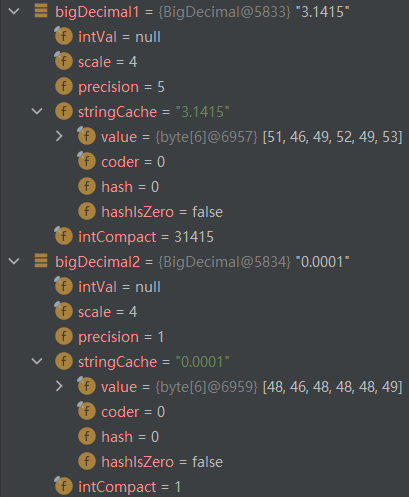

<font style="color:rgb(36, 41, 47);">接下来进到add方法里面，看看它是怎么计算的：</font>

```java
/**
 * 返回 BigDecimal 一个 其值为 (this + augend)，其小数位数为 max(this.scale(), augend.scale())。
 * 参数：augend – 要添加到此 BigDecimal的值。
 * 返回：this + augend
 */
public BigDecimal add(BigDecimal augend) {
    // 如果当前 BigDecimal 使用紧凑表示（intCompact != INFLATED）
    if (this.intCompact != INFLATED) {
        // 如果 augend 也使用紧凑表示（intCompact != INFLATED）
        if ((augend.intCompact != INFLATED)) {
            // 调用 add 方法执行加法，并返回结果
            return add(this.intCompact, this.scale, augend.intCompact, augend.scale);
        } else {
            // 如果 augend 使用大整数表示（intCompact == INFLATED）
            // 调用 add 方法执行加法，并返回结果
            return add(this.intCompact, this.scale, augend.intVal, augend.scale);
        }
    } else {
        // 如果当前 BigDecimal 使用大整数表示（intCompact == INFLATED）
        if ((augend.intCompact != INFLATED)) {
            // 如果 augend 使用紧凑表示（intCompact != INFLATED）
            // 调用 add 方法执行加法，并返回结果
            return add(augend.intCompact, augend.scale, this.intVal, this.scale);
        } else {
            // 如果 augend 使用大整数表示（intCompact == INFLATED）
            // 调用 add 方法执行加法，并返回结果
            return add(this.intVal, this.scale, augend.intVal, augend.scale);
        }
    }
}
```

根据传入的值，我们可以知道是<font style="color:rgb(36, 41, 47);">进入第 12 行的add方法：</font>

```java
/**
 * 使用紧凑表示执行两个长整型数值的加法，并返回结果。
 *
 * @param xs 第一个长整型数值
 * @param scale1 第一个数值的小数位数
 * @param ys 第二个长整型数值
 * @param scale2 第二个数值的小数位数
 * @return 加法结果的 BigDecimal 对象
 */
private static BigDecimal add(final long xs, int scale1, final long ys, int scale2) {
    // 计算两个数值的小数位数之差
    long sdiff = (long) scale1 - scale2;
    // 如果小数位数相等
    if (sdiff == 0) {
        // 直接调用 add 方法执行加法，并返回结果
        return add(xs, ys, scale1);
    // 如果第一个数的小数位数较多
    } else if (sdiff < 0) {
        // 检查并调整第一个数的小数位数
        int raise = checkScale(xs, -sdiff);
        // 将第一个数按 10 的 raise 次方进行缩放
        long scaledX = longMultiplyPowerTen(xs, raise);
        // 如果缩放后的数值不为 INFLATED（紧凑表示）
        if (scaledX != INFLATED) {
            // 调用 add 方法执行加法，并返回结果
            return add(scaledX, ys, scale2);
        // 如果缩放后的数值为 INFLATED（大整数表示）
        } else {
            // 将第一个数按 10 的 raise 次方进行缩放，并与第二个数相加得到 BigInteger 对象
            BigInteger bigsum = bigMultiplyPowerTen(xs, raise).add(ys);
            // 根据数值的正负情况，创建新的 BigDecimal 对象并返回
            return ((xs ^ ys) >= 0) ?
                new BigDecimal(bigsum, INFLATED, scale2, 0) :
                valueOf(bigsum, scale2, 0);
        }
    // 如果第二个数的小数位数较多
    } else {
        // 检查并调整第二个数的小数位数
        int raise = checkScale(ys, sdiff);
        // 将第二个数按 10 的 raise 次方进行缩放
        long scaledY = longMultiplyPowerTen(ys, raise);
        // 如果缩放后的数值不为 INFLATED（紧凑表示）
        if (scaledY != INFLATED) {
            // 调用 add 方法执行加法，并返回结果
            return add(xs, scaledY, scale1);
        // 如果缩放后的数值为 INFLATED（大整数表示）
        } else {
            // 将第二个数按 10 的 raise 次方进行缩放，并与第一个数相加得到 BigInteger 对象
            BigInteger bigsum = bigMultiplyPowerTen(ys, raise).add(xs);
            // 根据数值的正负情况，创建新的 BigDecimal 对象并返回
            return ((xs ^ ys) >= 0) ?
                new BigDecimal(bigsum, INFLATED, scale1, 0) :
                valueOf(bigsum, scale1, 0);
        }
    }
}
```

<font style="color:rgb(36, 41, 47);">这个例子中，该方法传入的参数分别是：xs=31415，scale1=4，ys=1，scale2=4 该方法首先计算scale1 - scale2，根据差值走不同的计算逻辑，这里求出来是 0，所以进入第一个 if 处理逻辑：</font>

```java
/**
 * 使用紧凑表示执行两个长整型数值的加法，并返回结果。
 *
 * @param xs 第一个长整型数值
 * @param ys 第二个长整型数值
 * @param scale 结果的小数位数
 * @return 加法结果的 BigDecimal 对象
 */
private static BigDecimal add(long xs, long ys, int scale) {
    // 执行两个长整型数值的加法
    long sum = add(xs, ys);
    // 如果加法结果不为 INFLATED（紧凑表示）
    if (sum != INFLATED)
        // 将加法结果转换为 BigDecimal 对象，并指定小数位数
        return BigDecimal.valueOf(sum, scale);
    // 如果加法结果为 INFLATED（大整数表示）
    // 将两个长整型数值转换为 BigInteger 对象，并执行加法操作
    BigInteger bigSum = BigInteger.valueOf(xs).add(BigInteger.valueOf(ys));
    // 创建并返回一个新的 BigDecimal 对象，指定数值和小数位数
    return new BigDecimal(bigSum, scale);
}
```

<font style="color:rgb(36, 41, 47);">这个方法很简单，就是计算和，然后返回BigDecimal对象</font>

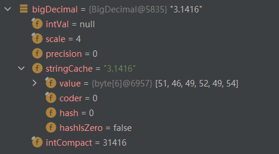

## <font style="color:rgb(36, 41, 47);">结论</font>
<font style="color:rgb(36, 41, 47);">其实到这里相信大家都知道 Bigdecimal 是如何保证精度的了，其实就是很多小伙伴正在使用的，将对应的数值进行放大，逻辑上将数值的单位进行缩放。而现在这个过程由 Bigdecimal 进行处理了，我们只需要调用相应的方法即可。</font>

<font style="color:rgb(36, 41, 47);">至于其他类型，我这边不使用就不跟大家讨论了，还在使用的看观们，快说出你们还在使用的原因，让大家一起开开眼。</font>

```java
/**
 * 不可变的、任意精度的有符号十进制数。BigDecimal 由任意精度的整数非标度值 和 32 位的整数标度 (scale) 组成。
 * 如果为零或正数，则标度是小数点后的位数。如果为负数，则将该数的非标度值乘以 10 的负 scale 次幂。
 * 因此，BigDecimal 表示的数值是 (unscaledValue × 10的-scale次幂)。 
 * BigDecimal 类提供以下操作：算术、标度操作、舍入、比较、哈希算法和格式转换。
 * toString() 方法提供 BigDecimal 的规范表示形式。 
 * BigDecimal 类使用户能完全控制舍入行为。如果未指定舍入模式，并且无法表示准确结果，则抛出一个异常；
 * 否则，通过向该操作提供适当的 MathContext 对象，可以对已选择的精度和舍入模式执行计算。
 * 在任何情况下，可以为舍入控制提供八种舍入模式。使用此类（例如，ROUND_HALF_UP）中的整数字段来表示舍入模式已过时；
 * 应改为使用 RoundingMode enum（例如，RoundingMode.HALF_UP）的枚举值。 
 * 当为 MathContext 对象提供 0 的精度设置（例如，MathContext.UNLIMITED）时，算术运算是准确的，
 * 它们是不采用任何 MathContext 对象的算术方法。（这是第 5 版之前的版本支持的唯一行为。）为了计算准确结果，
 * 不使用附带 0 精度设置的 MathContext 对象的舍入模式设置，因此与该对象无关。在除法中，准确的商可能是一个无限长的十进制扩展；
 * 例如，1 除以 3 所得的商。如果商具有无穷的十进制扩展，但是指定了该操作返回准确结果，则抛出 ArithmeticException。
 * 否则，像其他操作那样，返回除法运算的准确结果。 
 * 当精度设置不为 0 时，BigDecimal 算法的规则完全符合 ANSI X3.274-1996 和 ANSI X3.274-1996/AM 1-2000（ 7.4 节）中定义的算法的可选操作模式。
 * 与上述标准不同，BigDecimal 包括多种舍入模式，它们对于版本 5 以前的 BigDecimal 版本中的除法是强制性的。
 * 这些 ANSI 标准和 BigDecimal 规范之间的任何冲突都按照有利于 BigDecimal 的方式进行解决。 
 * 由于同一数值可以有不同的表示形式（具有不同的标度），因此运算和舍入的规则必须同时指定数值结果和结果表示形式中所用的标度。 
 * 一般情况下，当准确结果（在除法中，可能有无限多位）比返回的数值具有更多位数时，舍入模式和精度设置确定操作如何返回具有有限位数的结果。
 *  首先，MathContext 的 precision 设置指定要返回的总位数；这确定了结果的精度。
 *  位数计数从准确结果的最左边的非零数字开始。舍入模式确定丢弃的尾部位数如何影响返回的结果。 
 *  对于所有算术运算符，运算的执行方式是，首先计算准确的中间结果，然后，使用选择的舍入模式将其舍入为精度设置（如有必要）指定的位数。
 *  如果不返回准确结果，则将丢弃准确结果的某些数位。当舍入增加了返回结果的大小时，前导数字“9”的进位传播可能会创建新的数位。
 *  例如，将值 999.9 舍入为三位数字，则在数值上等于一千，表示为 100×101。在这种情况下，新的 "1" 是返回结果的前导数位。 
 *  除了逻辑的准确结果外，每种算术运算都有一个表示结果的首选标度。下表列出了每个运算的首选标度。 算术运算结果的首选标度  运算 结果的首选标度 
 *  	加 max(addend.scale(), augend.scale()) 
 *  	减 max(minuend.scale(), subtrahend.scale()) 
 *  	乘 multiplier.scale() + multiplicand.scale() 
 *  	除 dividend.scale() - divisor.scale() 
 *  这些标度是返回准确算术结果的方法使用的标度；准确相除可能必须使用较大的标度除外，因为准确的结果可能有较多的位数。例如，1/32 得到 0.03125。 
 *  舍入之前，逻辑的准确中间结果的标度是该运算的首选标度。如果用 precision 位数无法表示准确的数值结果，则舍入会选择要返回的一组数字，
 *  并将该结果的标度从中间结果的标度减小到可以表示实际返回的 precision 位数的最小标度。
 *  如果准确结果可以使用最多 precision 个数字表示，则返回具有最接近首选标度的标度的结果表示形式。
 *  尤其是，通过移除结尾零并减少标度，可以用少于 precision 个数字来表示准确的可表示的商。例如，使用 floor 舍入模式将结果舍入为三个数字，
 *  	19/100 = 0.19 // integer=19, scale=2 
 *  但是
 *  	21/110 = 0.190 // integer=190, scale=3 
 *  注意，对于加、减和乘，标度的缩减量将等于丢弃的准确结果的数字位置数。如果舍入导致进位传播创建一个新的高位，则当未创建新的数位时，会丢弃该结果的附加数字。 
 *  其他方法可能与舍入语义稍微不同。例如，使用指定的算法的 pow 方法得到的结果可能偶尔不同于舍入得到的算术结果，如最后一位有多个单位（ulp）。 
 *  可以通过两种类型的操作来处理 BigDecimal 的标度：标度/舍入操作和小数点移动操作。标度/舍入操作（setScale 和 round）返回 BigDecimal，
 *  其值近似地（或精确地）等于操作数的值，但是其标度或精度是指定的值；即：它们会增加或减少对其值具有最小影响的存储数的精度。
 *  小数点移动操作（movePointLeft 和 movePointRight）返回从操作数创建的 BigDecimal，创建的方法是按指定方向将小数点移动一个指定距离。 
 *  为了简洁明了起见，整个 BigDecimal 方法的描述中都使用了伪代码。伪代码表达式 (i + j) 是
 *  “其值为 BigDecimal i 加 BigDecimal j 的 BigDecimal”的简写。
 *  伪代码表达式 (i == j) 是“当且仅当 BigDecimal i 表示与 BigDecimal j 相同的值时，则为 true”的简写。
 *  可以类似地解释其他伪代码表达式。方括号用于表示特定的 BigInteger 和定义 BigDecimal 值的标度对；
 *  例如，[19, 2] 表示 BigDecimal 在数值上等于 0.19，标度是 2。 
 *  注：如果 BigDecimal 对象用作 SortedMap 中的键或 SortedSet 中的元素，则应特别小心，
 *  因为 BigDecimal 的自然排序与 equals 方法不一致。
 */
public class BigDecimal extends Number implements Comparable<BigDecimal> {
	/*
     * 继承Number类提供将表示的数值转换为 byte、double、float、int、long 和 short 的方法。<br />
     * 实现Comparable接口，获取到compareTo方法。
     */
	// BigDecimal的未scale的值,BigInteger是一个任意长度的整数（整数非标度值）
    private volatile BigInteger intVal;
 
	// BigDecimal的标度（小数点），输入数除以10的scale次幂（32 位的整数标度）
    private int scale; // 注意:这可能有任何值，因此计算必须长时间进行
	// BigDecimal的精度（精度是非标度值的数字个数。）
    private transient int precision;
 
	// toString后缓存
    private transient String stringCache;
    // 标记值为intCompact表示有效数字信息只能从intVal中获得。
    static final long INFLATED = Long.MIN_VALUE;
	// 若BigDecimal的绝对值小于Long.MAX_VALUE,放在这个变量中
    private transient long intCompact;
    /*
     * 所有18位基数的10个字符串组成一个长字符串;
     * 不是所有的19位字符串都可以
     */
    private static final int MAX_COMPACT_DIGITS = 18;
 
    private static final int MAX_BIGINT_BITS = 62;
    // 序列化
    private static final long serialVersionUID = 6108874887143696463L;
 
    private static final ThreadLocal<StringBuilderHelper>
        threadLocalStringBuilderHelper = new ThreadLocal<StringBuilderHelper>() {
        @Override
        protected StringBuilderHelper initialValue() {
            return new StringBuilderHelper();
        }
    };
 
  //缓存0 ~ 10
    private static final BigDecimal zeroThroughTen[] = {
        new BigDecimal(BigInteger.ZERO,         0,  0, 1),
        new BigDecimal(BigInteger.ONE,          1,  0, 1),
        new BigDecimal(BigInteger.valueOf(2),   2,  0, 1),
        new BigDecimal(BigInteger.valueOf(3),   3,  0, 1),
        new BigDecimal(BigInteger.valueOf(4),   4,  0, 1),
        new BigDecimal(BigInteger.valueOf(5),   5,  0, 1),
        new BigDecimal(BigInteger.valueOf(6),   6,  0, 1),
        new BigDecimal(BigInteger.valueOf(7),   7,  0, 1),
        new BigDecimal(BigInteger.valueOf(8),   8,  0, 1),
        new BigDecimal(BigInteger.valueOf(9),   9,  0, 1),
        new BigDecimal(BigInteger.TEN,          10, 0, 2),
    };
 
  //缓存0 ~ 0E-15
    private static final BigDecimal[] ZERO_SCALED_BY = {
        zeroThroughTen[0],
        new BigDecimal(BigInteger.ZERO, 0, 1, 1),
        new BigDecimal(BigInteger.ZERO, 0, 2, 1),
        new BigDecimal(BigInteger.ZERO, 0, 3, 1),
        new BigDecimal(BigInteger.ZERO, 0, 4, 1),
        new BigDecimal(BigInteger.ZERO, 0, 5, 1),
        new BigDecimal(BigInteger.ZERO, 0, 6, 1),
        new BigDecimal(BigInteger.ZERO, 0, 7, 1),
        new BigDecimal(BigInteger.ZERO, 0, 8, 1),
        new BigDecimal(BigInteger.ZERO, 0, 9, 1),
        new BigDecimal(BigInteger.ZERO, 0, 10, 1),
        new BigDecimal(BigInteger.ZERO, 0, 11, 1),
        new BigDecimal(BigInteger.ZERO, 0, 12, 1),
        new BigDecimal(BigInteger.ZERO, 0, 13, 1),
        new BigDecimal(BigInteger.ZERO, 0, 14, 1),
        new BigDecimal(BigInteger.ZERO, 0, 15, 1),
    };
    // Long的一半。MIN_VALUE & Long.MAX_VALUE。
    private static final long HALF_LONG_MAX_VALUE = Long.MAX_VALUE / 2;
    private static final long HALF_LONG_MIN_VALUE = Long.MIN_VALUE / 2;
 
    // 常量
    // 值为 0，标度为 0。 
    public static final BigDecimal ZERO =
        zeroThroughTen[0];
 
    // 值为 1，标度为 0。
    public static final BigDecimal ONE =
        zeroThroughTen[1];
 
    // 值为 10，标度为 0。
    public static final BigDecimal TEN =
        zeroThroughTen[10];
 
    // 构造器
    /**
     * 受信任的包私有构造函数。可信仅仅意味着如果val是INFLATED，intVal不可能为空，如果intVal为空，val不可能是INFLATED。
     * @param intVal	BigInteger的数值
     * @param val	long的数值
     * @param scale	标度
     * @param prec	精度
     */
    BigDecimal(BigInteger intVal, long val, int scale, int prec) {
        this.scale = scale;
        this.precision = prec;
        this.intCompact = val;
        this.intVal = intVal;
    }
 
    /**
     * 将 BigDecimal 的字符数组表示形式转换为 BigDecimal，接受与 BigDecimal(String) 构造方法相同的字符序列，同时允许指定子数组。 
     * 注意，如果字符数组中已经提供字符的序列，则使用此构造方法要比将 char 数组转换为字符串并使用 BigDecimal(String) 构造方法更快。 
     * @param in	作为源字符的 char 数组
     * @param offset	要检查的数组中的第一个字符
     * @param len	要考虑的字符数
     */
    public BigDecimal(char[] in, int offset, int len) {
        // 防止长度过大。
        if (offset+len > in.length || offset < 0)
            throw new NumberFormatException();
        /*
         * 这是BigDecimal构造函数的主字符串;
         * 所有传入字符串都在这里结束;
         * 它使用显式(内联)解析来提高速度，并为非紧凑情况生成最多一个中间(临时)对象(char[]数组)。
         */
 
        // 对所有字段值使用局部变量，直到完成
        int prec = 0;                 // BigDecimal的数字的长度
        int scl = 0;                  // BigDecimal的标度
        long rs = 0;                  // intCompact值
        BigInteger rb = null;         // BigInteger的值
 
        // 使用数组边界检查来处理太长、len == 0、错误偏移等等。
        try {
        	// 符号的处理
            boolean isneg = false;          // '+'为false，'-'为true
            if (in[offset] == '-') {    // 第一个字符为'-'
                isneg = true;              
                offset++;
                len--;
            } else if (in[offset] == '+') {// 第一个字符为'+'
                offset++;
                len--;
            }
 
            // 数字有效部分
            boolean dot = false;             //当有“.”时为真。
            int cfirst = offset;             // 记录integer的起始点
            long exp = 0;                    // exponent
            char c;                          // 当前字符
 
            boolean isCompact = (len <= MAX_COMPACT_DIGITS);
 
            char coeff[] = isCompact ? null : new char[len];// 大于18位是BigInteger，创建数组
            int idx = 0;
 
            for (; len > 0; offset++, len--) {
                c = in[offset];
                // 有数字，确定c（Unicode 代码点）是否为数字
                if ((c >= '0' && c <= '9') || Character.isDigit(c)) {
                    // 第一个紧化情况，我们不需要保留字符我们可以就地计算值。
                    if (isCompact) { // 非BigInteger数值
                    	// 获取使用10进制的字符 c 的数值
                        int digit = Character.digit(c, 10);
                        if (digit == 0) {// 为 0
                            if (prec == 0)
                                prec = 1;
                            else if (rs != 0) {
                                rs *= 10;
                                ++prec;
                            }// 否则，数字为冗余前导零
                        } else { // 非0
                            if (prec != 1 || rs != 0)
                                ++prec; // 如果前面加0，则prec不变
                            rs = rs * 10 + digit;
                        }
                    } else {// the unscaled value可能是一个BigInteger对象。
                        if (c == '0' || Character.digit(c, 10) == 0) {// 为0
                            if (prec == 0) {
                                coeff[idx] = c;
                                prec = 1;
                            } else if (idx != 0) {
                                coeff[idx++] = c;
                                ++prec;
                            } // 否则c一定是多余的前导零
                        } else {
                            if (prec != 1 || idx != 0)
                                ++prec; // 如果前面加0，则prec不变
                            coeff[idx++] = c;
                        }
                    }
                    if (dot)// 如果有小数点
                        ++scl;
                    continue;
                }
                // 当前字符等于小数点
                if (c == '.') {
                    // have dot
                    if (dot)         // 存在两个小数点
                        throw new NumberFormatException();
                    dot = true;
                    continue;
                }
                // exponent 预期
                if ((c != 'e') && (c != 'E'))
                    throw new NumberFormatException();
                offset++;
                c = in[offset];
                len--;
                boolean negexp = (c == '-'); // 当前字符是否为'-'
                if (negexp || c == '+') { // 为符号
                    offset++;
                    c = in[offset];
                    len--;
                }
                if (len <= 0)    // 没有 exponent 数字
                    throw new NumberFormatException();
                // 跳过exponent中的前导零 
                while (len > 10 && Character.digit(c, 10) == 0) {
                    offset++;
                    c = in[offset];
                    len--;
                }
                if (len > 10) // 太多非零 exponent 数字
                    throw new NumberFormatException();
                // c 现在是 exponent的第一个数字
                for (;; len--) {
                    int v;
                    if (c >= '0' && c <= '9') {
                        v = c - '0';
                    } else {
                        v = Character.digit(c, 10);
                        if (v < 0)           // 非数字
                            throw new NumberFormatException();
                    }
                    exp = exp * 10 + v;
                    if (len == 1)
                        break;               // 最终字符
                    offset++;
                    c = in[offset];
                }
                if (negexp)                 // 当前字符为'-'，取相反数
                    exp = -exp;
                // 下一个测试需要向后兼容性
                if ((int)exp != exp)         // 溢出
                    throw new NumberFormatException();
                break;                      
            }
            // 这里没有字符了
            if (prec == 0)              // 没有发现数字
                throw new NumberFormatException();
            // 如果exp不为零，调整标度。
            if (exp != 0) {                 // 有显著的exponent
                // 不能调用基于正确的字段值的checkScale
                long adjustedScale = scl - exp;
                if (adjustedScale > Integer.MAX_VALUE ||
                    adjustedScale < Integer.MIN_VALUE)
                    throw new NumberFormatException("Scale out of range.");
                scl = (int)adjustedScale;
            }
            // 从precision中删除前导零(数字计数)
            if (isCompact) {
                rs = isneg ? -rs : rs;
            } else {
                char quick[];
                if (!isneg) {
                    quick = (coeff.length != prec) ?
                        Arrays.copyOf(coeff, prec) : coeff;
                } else {
                    quick = new char[prec + 1];
                    quick[0] = '-';
                    System.arraycopy(coeff, 0, quick, 1, prec);
                }
                rb = new BigInteger(quick);
                // 获取rb（BigInteger）的compact值。
                rs = compactValFor(rb);
            }
        } catch (ArrayIndexOutOfBoundsException e) {
            throw new NumberFormatException();
        } catch (NegativeArraySizeException e) {
            throw new NumberFormatException();
        }
        this.scale = scl;
        this.precision = prec;
        this.intCompact = rs;
        this.intVal = (rs != INFLATED) ? null : rb;
    }
 
    /**
     * 将 BigDecimal 的字符数组表示形式转换为 BigDecimal，接受与 BigDecimal(String) 构造方法相同的字符序列，同时允许指定子数组，并根据上下文设置进行舍入。 
     * 注意，如果字符数组中已经提供字符的序列，则使用此构造方法要比将 char 数组转换为字符串并使用 BigDecimal(String) 构造方法更快。
     * @param in	作为源字符的 char 数组
     * @param offset	要检查的数组中的第一个字符
     * @param len	要考虑的字符数
     * @param mc	要使用的上下文
     */
    public BigDecimal(char[] in, int offset, int len, MathContext mc) {
        this(in, offset, len);
        if (mc.precision > 0) // 精度大于0
            roundThis(mc);  // 根据MathContext设置将这个BigDecimal四舍五入
    }
 
    /**
     * 将 BigDecimal 的字符数组表示形式转换为 BigDecimal，接受与 BigDecimal(String) 构造方法相同的字符序列。 
     * 注意，如果字符序列已经可以作为一个字符数组使用，则使用此构造方法要比将 char 数组转换为字符串并使用 BigDecimal(String) 构造方法更快。 
     * @param in	作为源字符的 char 数组
     */
    public BigDecimal(char[] in) {
        this(in, 0, in.length);
    }
 
    /**
     * 将 BigDecimal 的字符数组表示形式转换为 BigDecimal，接受与 BigDecimal(String) 构造方法相同的字符序列（根据上下文设置进行舍入）。 
     * 注意，如果字符序列已经可以作为一个字符数组使用，则使用此构造方法要比将 char 数组转换为字符串并使用 BigDecimal(String) 构造方法更快。 
     * @param in	作为源字符的 char 数组
     * @param mc	要使用的上下文
     */
    public BigDecimal(char[] in, MathContext mc) {
        this(in, 0, in.length, mc);
    }
 
    /**
     * 将 BigDecimal 的字符串表示形式转换为 BigDecimal。字符串表示形式由可选符号 '+' ('\u002B') 或 '-' ('\u002D') 组成，
     * 后跟零或多个十进制数字（“整数”）的序列，可以选择后跟一个小数，也可以选择后跟一个指数。 
     * 该小数由小数点以及后跟的零或更多十进制数字组成。字符串必须至少包含整数或小数部分中的一个数字。由符号、整数和小数部分组成的数字称为有效位数。 
     * 指数由字符 'e'（'\u0065') 或 'E' ('\u0045') 以及后跟的一个或多个十进制数字组成。
     * 指数的值必须位于 Integer.MAX_VALUE (Integer.MIN_VALUE+1) 和 Integer.MAX_VALUE（包括）之间。
     * 
     * 注：对于不是 float、double NaN 和 ±Infinity 的值，此构造方法与 Float.toString(float) 和 Double.toString(double) 返回的值兼容。
     * 这通常是将 float 或 double 转换为 BigDecimal 的首选方法，因为它不会遇到 BigDecimal(double) 构造方法的不可预知问题。 
     * @param val	BigDecimal 的字符串表示形式
     */
    public BigDecimal(String val) {
        this(val.toCharArray(), 0, val.length());
    }
 
    /**
     * 将 BigDecimal 的字符串表示形式转换为 BigDecimal，接受与 BigDecimal(String) 构造方法相同的字符串（按照上下文设置进行舍入）。 
     * @param val	BigDecimal 的字符串表示形式。
     * @param mc	要使用的上下文。 
     */
    public BigDecimal(String val, MathContext mc) {
        this(val.toCharArray(), 0, val.length());
        if (mc.precision > 0)// 精度大于0
            roundThis(mc);// 根据MathContext设置将这个BigDecimal四舍五入
    }
 
    /**
     * 将 double 转换为 BigDecimal，后者是 double 的二进制浮点值准确的十进制表示形式。返回的 BigDecimal 的标度是使 (10的scale次幂 × val) 为整数的最小值。 
     * 注： 
     * 1、此构造方法的结果有一定的不可预知性。有人可能认为在 Java 中写入 new BigDecimal(0.1) 所创建的 BigDecimal 正好等于 0.1（非标度值 1，其标度为 1），
     * 但是它实际上等于 0.1000000000000000055511151231257827021181583404541015625。
     * 这是因为 0.1 无法准确地表示为 double（或者说对于该情况，不能表示为任何有限长度的二进制小数）。这样，传入 到构造方法的值不会正好等于 0.1（虽然表面上等于该值）。 
     * 2、另一方面，String 构造方法是完全可预知的：写入 new BigDecimal("0.1") 将创建一个 BigDecimal，它正好 等于预期的 0.1。因此，比较而言，通常建议优先使用 String 构造方法。 
     * 3、当 double 必须用作 BigDecimal 的源时，请注意，此构造方法提供了一个准确转换；它不提供与以下操作相同的结果：
     * 先使用 Double.toString(double) 方法，然后使用 BigDecimal(String) 构造方法，将 double 转换为 String。要获取该结果，请使用 static valueOf(double) 方法。 
     * @param val	要转换为 BigDecimal 的 double 值
     */
    public BigDecimal(double val) {
        if (Double.isInfinite(val) || Double.isNaN(val)) // 如果 val 为无穷大或 NaN
            throw new NumberFormatException("Infinite or NaN");
        // 将double转化为符号、exponent和significand
        /*
         * 根据 IEEE 754 浮点双精度格式 ("double format") 位布局，返回val的表示形式。
         * 第 63 位（掩码 0x8000000000000000L 选定的位）表示浮点数的符号。
         * 第 62-52 位（掩码 0x7ff0000000000000L 选定的位）表示指数。
         * 第 51-0 位（掩码 0x000fffffffffffffL 选定的位）表示浮点数的有效数字（有时也称为尾数）。 
         */
        long valBits = Double.doubleToLongBits(val);
        int sign = ((valBits >> 63)==0 ? 1 : -1);// 右移63位为符号，判断是0还是1
        int exponent = (int) ((valBits >> 52) & 0x7ffL);// 右移52位指数
        long significand = (exponent==0 ? (valBits & ((1L<<52) - 1)) << 1
                            : (valBits & ((1L<<52) - 1)) | (1L<<52));
        exponent -= 1075;
        // 这时候, val == sign * significand * 2**exponent.
        /*
         * 特殊情况零可以抑制无尽的规范化和虚假的规模计算。
         */
        if (significand == 0) {
            intVal = BigInteger.ZERO;
            intCompact = 0;
            precision = 1;
            return;
        }
 
        // 正常化
        while((significand & 1) == 0) {    //  i.e., significand 是偶数，significand等于0；&计算:两位同为1结果为1，否则为0
            significand >>= 1;
            exponent++;
        }
        // 计算intVal和scale
        long s = sign * significand;
        BigInteger b;
        if (exponent < 0) {// 指数小于0
            // 5 的-exponent次幂乘以s
            b = BigInteger.valueOf(5).pow(-exponent).multiply(s);
            scale = -exponent;
        } else if (exponent > 0) {// 指数大于0
        	// 2 的exponent次幂乘以s
            b = BigInteger.valueOf(2).pow(exponent).multiply(s);
        } else {
            b = BigInteger.valueOf(s);// 获取s的 BigInteger值
        }
        intCompact = compactValFor(b);// 获取val（BigInteger）的compact值。
        intVal = (intCompact != INFLATED) ? null : b;
    }
 
    /**
     * 将 double 转换为 BigDecimal（根据上下文设置进行舍入）。BigDecimal 的标度是使 (10的scale次幂 × val) 为整数的最小值。 
     * 此构造方法的结果有一定的不可预知性，通常不建议使用它，请参见 BigDecimal(double) 构造方法下面的注释。 
     * @param val	要转换为 BigDecimal 的 double 值
     * @param mc	要使用的上下文
     */
    public BigDecimal(double val, MathContext mc) {
        this(val);
        if (mc.precision > 0)// 精度大于0
            roundThis(mc);// 根据MathContext设置将这个BigDecimal四舍五入
    }
 
    /**
     * 将 BigInteger 转换为 BigDecimal。BigDecimal 的标度是零
     * @param val	要转换为 BigDecimal 的 BigInteger 值
     */
    public BigDecimal(BigInteger val) {
        intCompact = compactValFor(val);// 获取val（BigInteger）的compact值。
        intVal = (intCompact != INFLATED) ? null : val;
    }
    /**
     * 将 BigInteger 转换为 BigDecimal（根据上下文设置进行舍入）。BigDecimal 的标度为零。
     * @param val	要转换为 BigDecimal 的 BigInteger 值。
     * @param mc	要使用的上下文。 
     */
    public BigDecimal(BigInteger val, MathContext mc) {
        this(val);
        if (mc.precision > 0)// 精度大于0
            roundThis(mc);// 根据MathContext设置将这个BigDecimal四舍五入
    }
    /**
     * 将 BigInteger 非标度值和 int 标度转换为 BigDecimal。BigDecimal 的值为 (unscaledVal × 10的-scale幂)。 
     * @param unscaledVal	BigDecimal 的非标度值
     * @param scale	BigDecimal 的标度
     */
    public BigDecimal(BigInteger unscaledVal, int scale) {
        // 现在允许负标度
        this(unscaledVal);
        this.scale = scale;
    }
 
    /**
     * 将 BigInteger 非标度值和 int 标度转换为 BigDecimal（根据上下文设置进行舍入）。
     * BigDecimal 的值为 (unscaledVal × 10-scale)，它是根据 precision 和舍入模式设置进行舍入的。 
     * @param unscaledVal	BigDecimal 的非标度值
     * @param scale	BigDecimal 的标度
     * @param mc	要使用的上下文
     */
    public BigDecimal(BigInteger unscaledVal, int scale, MathContext mc) {
        this(unscaledVal);
        this.scale = scale;
        if (mc.precision > 0) // 精度大于0
            roundThis(mc);// 根据MathContext设置将这个BigDecimal四舍五入
    }
 
    /**
     * 将 int 转换为 BigDecimal。BigDecimal 的标度为零
     * @param val 要转换为 BigDecimal 的 int 值
     */
    public BigDecimal(int val) {
        intCompact = val;
    }
 
    /**
     * 将 int 转换为 BigDecimal（根据上下文设置进行舍入）。在进行任何舍入之前，BigDecimal 的标度为零
     * @param val	要转换为 BigDecimal 的 int 值
     * @param mc	要使用的上下文
     */
    public BigDecimal(int val, MathContext mc) {
        intCompact = val;
        if (mc.precision > 0)
            roundThis(mc);// 根据MathContext设置将这个BigDecimal四舍五入
    }
 
    /**
     * 将 long 转换为 BigDecimal。BigDecimal 的标度为零。 
     * @param val	要转换为 BigDecimal 的 long 值
     */
    public BigDecimal(long val) {
        this.intCompact = val;
        this.intVal = (val == INFLATED) ? BigInteger.valueOf(val) : null;
    }
 
    /**
     * 将 long 转换为 BigDecimal（根据上下文设置进行舍入）。在进行任何舍入之前，BigDecimal 的标度为零。 
     * @param val	要转换为 BigDecimal 的 long 值
     * @param mc	要使用的上下文。
     */
    public BigDecimal(long val, MathContext mc) {
        this(val);
        if (mc.precision > 0)
            roundThis(mc);// 根据MathContext设置将这个BigDecimal四舍五入
    }
 
    // 静态工厂方法
 
    /**
     * 将 long 非标度值和 int 标度转换为 BigDecimal。提供的此“静态工厂方法”优先于 (long, int) 构造方法，因为前者允许重用经常使用的 BigDecimal 值。 
     * @param unscaledVal	BigDecimal 的非标度值
     * @param scale	BigDecimal 的标度
     * @return	其值为 (unscaledVal × 10的-scale次幂) 的 BigDecimal
     */
    public static BigDecimal valueOf(long unscaledVal, int scale) {
        if (scale == 0)// 标度为0，将 long 值转换为具有零标度的 BigDecimal。
            return valueOf(unscaledVal);
        else if (unscaledVal == 0) {
            if (scale > 0 && scale < ZERO_SCALED_BY.length)// 不超过缓存，直接返回缓存
                return ZERO_SCALED_BY[scale];
            else
                return new BigDecimal(BigInteger.ZERO, 0, scale, 1);
        }
        return new BigDecimal(unscaledVal == INFLATED ?
                              BigInteger.valueOf(unscaledVal) : null,
                              unscaledVal, scale, 0);
    }
    /**
     * 将 long 值转换为具有零标度的 BigDecimal。提供的此“静态工厂方法”优先于 (long) 构造方法，因为前者允许重用经常使用的 BigDecimal 值。 
     * @param val	BigDecimal 的值
     * @return	其值为 val 的 BigDecimal
     */
    public static BigDecimal valueOf(long val) {
        if (val >= 0 && val < zeroThroughTen.length)// 不超过缓存，直接返回缓存
            return zeroThroughTen[(int)val];
        else if (val != INFLATED)
            return new BigDecimal(null, val, 0, 0);
        return new BigDecimal(BigInteger.valueOf(val), val, 0, 0);
    }
    /**
     * 使用 Double.toString(double) 方法提供的 double 规范的字符串表示形式将 double 转换为 BigDecimal。 
     * 注：这通常是将 double（或 float）转化为 BigDecimal 的首选方法，因为返回的值等于从构造 BigDecimal（使用 Double.toString(double) 得到的结果）得到的值。 
     * @param val	要转换为 BigDecimal 的 double。 
     * @return	其值等于或约等于 val 值的 BigDecimal。 
     */
    public static BigDecimal valueOf(double val) {
        // 提醒:一个zero double返回“0.0”，因此我们不能快速路径来使用常量zero。这一点可能非常重要，足以在以后证明工厂方法、缓存或一些私有常量是合理的。
        return new BigDecimal(Double.toString(val));
    }
 
    // 算术运算
    /**
     * 返回一个 BigDecimal，其值为 (this + augend)，其标度为 max(this.scale(), augend.scale())。 
     * @param augend	将添加到此 BigDecimal 中的值。
     * @return	this + augend
     */
    public BigDecimal add(BigDecimal augend) {
        long xs = this.intCompact;// 整型数字表示的BigDecimal
        long ys = augend.intCompact;// 整型数字表示的BigDecimal
        //初始化        BigInteger的值，intVal为BigDecimal的一个BigInteger类型的属性
        BigInteger fst = (xs != INFLATED) ? null : this.intVal;
        BigInteger snd = (ys != INFLATED) ? null : augend.intVal;
        int rscale = this.scale;
 
        long sdiff = (long)rscale - augend.scale;//小数位数之差
        if (sdiff != 0) {// 取小数位数多的为结果的小数位数
            if (sdiff < 0) {// 当前小数位数小于augend的小数位数
                int raise = checkScale(-sdiff);// 验证-sdiff为int
                rscale = augend.scale;
                // 计算xs * 10 ^ raise == INFLATED
                if (xs == INFLATED ||
                    (xs = longMultiplyPowerTen(xs, raise)) == INFLATED)
                	// 计算this* 10 ^ raise
                    fst = bigMultiplyPowerTen(raise);
            } else {// 当前小数位数大于等于augend的小数位数
                int raise = augend.checkScale(sdiff);// 取当前值
                // 计算ys * 10 ^ raise == INFLATED
                if (ys == INFLATED ||
                    (ys = longMultiplyPowerTen(ys, raise)) == INFLATED)
                	// 计算this* 10 ^ raise
                    snd = augend.bigMultiplyPowerTen(raise);
            }
        }
        if (xs != INFLATED && ys != INFLATED) {
            long sum = xs + ys;
            if ( (((sum ^ xs) & (sum ^ ys))) >= 0L)//判断有无溢出
                return BigDecimal.valueOf(sum, rscale);//返回使用BigDecimal的静态工厂方法得到的BigDecimal实例
        }
        if (fst == null)
            fst = BigInteger.valueOf(xs);//BigInteger的静态工厂方法
        if (snd == null)
            snd = BigInteger.valueOf(ys);//BigInteger的静态工厂方法
        BigInteger sum = fst.add(snd);
        // 返回通过其他构造方法得到的BigDecimal对象
        return (fst.signum == snd.signum) ?
            new BigDecimal(sum, INFLATED, rscale, 0) :
            new BigDecimal(sum, rscale);
    }
    /**
     * 返回其值为 (this + augend) 的 BigDecimal（根据上下文设置进行舍入）。
     * 如果任一数字为零，并且精度设置为非零，则其他数字（必要时进行舍入）可以作为结果。 
     * @param augend	将添加到此 BigDecimal 中的值
     * @param mc	要使用的上下文
     * @return	this + augend，必要时进行舍入
     */
    public BigDecimal add(BigDecimal augend, MathContext mc) {
        if (mc.precision == 0)
            return add(augend);
        BigDecimal lhs = this;
 
        // 如果值紧凑，可以优化
        // 如果当前对象的intVal为空，分配适当的BigInteger给intVal字段，
        this.inflate();
        // 如果augend的intVal为空，分配适当的BigInteger给intVal字段，
        augend.inflate();
        // 如果任意一个数字都是0，则使用另一个数字(如果需要的话)进行四舍五入和缩放。
        {
            boolean lhsIsZero = lhs.signum() == 0;// 判断lhs 的值是否为0
            boolean augendIsZero = augend.signum() == 0;// 判断augend的值是否为0
 
            if (lhsIsZero || augendIsZero) {
            	// 获取lhs.scale()和augend.scale()中较大的一个
                int preferredScale = Math.max(lhs.scale(), augend.scale());
                BigDecimal result;
 
                if (lhsIsZero && augendIsZero) // 都为0
                    return new BigDecimal(BigInteger.ZERO, 0, preferredScale, 0);
                // 判断当前对象的值是否为0，根据mc设置返回一个augend或者lhs四舍五入的BigDecimal对象
                result = lhsIsZero ? doRound(augend, mc) : doRound(lhs, mc);
 
                if (result.scale() == preferredScale) // 判断结果标度是否为最大
                    return result;
                else if (result.scale() > preferredScale) {// 结果标度大于最大
                    BigDecimal scaledResult =
                        new BigDecimal(result.intVal, result.intCompact,
                                       result.scale, 0);
                    // 从当前BigDecimal对象中删除不重要的后置零，直到不能删除更多的零为止。
                    scaledResult.stripZerosToMatchScale(preferredScale);
                    return scaledResult;
                } else { // result.scale < preferredScale
                    int precisionDiff = mc.precision - result.precision();
                    int scaleDiff     = preferredScale - result.scale();
 
                    if (precisionDiff >= scaleDiff)// 精度差大于等于标度差
                        return result.setScale(preferredScale); // 可以达到目标规模
                    else
                        return result.setScale(result.scale() + precisionDiff);
                }
            }
        }
 
        long padding = (long)lhs.scale - augend.scale;
        if (padding != 0) {        // 标度不同; 需要对齐
        	// 返回一个长度为2的数组，其条目的和等于lhs和augend参数的整数和。
            BigDecimal arg[] = preAlign(lhs, augend, padding, mc);
            // 匹配arg[0]和arg[1]的scales，以校准它们的最小有效数字
            matchScale(arg);
            lhs    = arg[0];
            augend = arg[1];
        }
 
        BigDecimal d = new BigDecimal(lhs.inflate().add(augend.inflate()),
                                      lhs.scale);
        // 根据mc设置返回一个d的四舍五入的BigDecimal对象
        return doRound(d, mc);
    }
 
    /**
     * 返回一个长度为2的数组，其条目的和等于lhs和augend参数的整数和。
     * 
     * 如果数字的位置参数有足够的差距,值较小的可以浓缩成一个“粘滞位”,如果最终结果的精度不包括小数量级操作数的高阶数，则最终结果将以相同的方式进行四舍五入。
     * 
     * 注意，虽然严格来说这是一种优化，但它的实际应用范围更广。
     * 
     * 这对应于固定精度浮点加法器中的预移位操作;这个方法由于MathContext所决定的结果的可变精度而变得复杂。
     * 更细致的操作可以实现较小幅度操作数上的“右偏移”，从而即使部分重叠的有效数也可以减少较小操作数的位数。
     * @param lhs	当前 BigDecimal 中的值
     * @param augend	将添加到此 BigDecimal 中的值
     * @param padding lhs.scale- padding.scale
     * @param mc	要使用的上下文
     * @return
     */
    private BigDecimal[] preAlign(BigDecimal lhs, BigDecimal augend,
                                  long padding, MathContext mc) {
        assert padding != 0;
        BigDecimal big;
        BigDecimal small;
 
        if (padding < 0) {     // lhs is big;   augend is small
            big   = lhs;
            small = augend;
        } else {               // lhs is small; augend is big
            big   = augend;
            small = lhs;
        }
		/*
		 * 这是结果的ulp的估计尺度;它假设结果没有一个真正的add(例如999 + 1 = > - 1000)或任何一个借位的减法取消(例如，100 - 1.2 = > 98.8)
		 */
        long estResultUlpScale = (long)big.scale - big.precision() + mc.precision;
 
        /*
         * big的低位是big.scale()。这是真的，不管大的规模是正的还是负的。
         * 小的高阶位是small.scale - (small.precision() - 1)。
         */
        long smallHighDigitPos = (long)small.scale - small.precision() + 1;
        if (smallHighDigitPos > big.scale + 2 &&         // 大小不相交
            smallHighDigitPos > estResultUlpScale + 2) { // small 不可见
			small = BigDecimal
            small = BigDecimal.valueOf(small.signum(),
                                       this.checkScale(Math.max(big.scale, estResultUlpScale) + 3));
        }
 
		// 因为加法是对称的，所以在返回的操作数中保持输入顺序并不重要
        BigDecimal[] result = {big, small};
        return result;
    }
 
	/**
	 * 返回一个 BigDecimal，其值为 (this - subtrahend)，其标度为 max(this.scale(), subtrahend.scale())。 
	 * @param subtrahend	从此 BigDecimal 减去的值
	 * @return	this - subtrahend
	 */
    public BigDecimal subtract(BigDecimal subtrahend) {
    	// 获取当前对象，其值为 (-subtrahend)，其标度为 subtrahend.scale()。 
        return add(subtrahend.negate());
    }
 
    /**
     * 返回其值为 (this - subtrahend) 的 BigDecimal（根据上下文设置进行舍入）。 
     * 如果 subtrahend 为零，则将其（必要时进行舍入）作为结果。如果为零，则该结果是 subtrahend.negate(mc)。 
     * @param subtrahend	从此 BigDecimal 减去的值
     * @param mc	要使用的上下文
     * @return	this - subtrahend，必要时进行舍入
     */
    public BigDecimal subtract(BigDecimal subtrahend, MathContext mc) {
    	// 获取当前对象，其值为 (-subtrahend)，其标度为 subtrahend.scale()。 
        BigDecimal nsubtrahend = subtrahend.negate();
        if (mc.precision == 0)
            return add(nsubtrahend);
        // 在add()中共享特殊的四舍五入
        return add(nsubtrahend, mc);
    }
 
    /**
     * 返回一个 BigDecimal，其值为 (this × multiplicand)，其标度为 (this.scale() + multiplicand.scale())。 
     * @param multiplicand	乘以此 BigDecimal 的值
     * @return	this * multiplicand
     */
    public BigDecimal multiply(BigDecimal multiplicand) {
        long x = this.intCompact;
        long y = multiplicand.intCompact;
        // 验证(long)scale + multiplicand.scale为int，并返回(long)scale + multiplicand.scale值
        int productScale = checkScale((long)scale + multiplicand.scale);
        // 可以做一个更聪明的检查，将INFLATED的检查合并到溢出计算中。
        if (x != INFLATED && y != INFLATED) {
            /*
             * 如果product不是溢出值，则继续使用compact表示。如果x或y中的任何一个是INFLATED，product也应该被视为溢出。
             * 在使用“Hacker's Delight”第2-12节中建议的溢出测试之前，我们使用精确信息进行快速检查，
             * 以确定是否会发生溢出，因为大多数cpu上的分区开销很大。
             */
            long product = x * y;
            long prec = this.precision() + multiplicand.precision();
            if (prec < 19 || (prec < 21 && (y == 0 || product / y == x)))
            	// 将 product 非标度值和 productScale 标度转换为 BigDecimal
                return BigDecimal.valueOf(product, productScale);
            return new BigDecimal(BigInteger.valueOf(x).multiply(y), INFLATED,
                                  productScale, 0);
        }
        BigInteger rb;
        if (x == INFLATED && y == INFLATED)// 溢出
            rb = this.intVal.multiply(multiplicand.intVal);
        else if (x != INFLATED)// multiplicand.intVal * x
            rb = multiplicand.intVal.multiply(x);
        else// this.intVal * y
            rb = this.intVal.multiply(y);
        return new BigDecimal(rb, INFLATED, productScale, 0);
    }
    /**
     * 返回其值为 (this × multiplicand) 的 BigDecimal（根据上下文设置进行舍入）。 
     * @param multiplicand	乘以此 BigDecimal 的值。
     * @param mc	要使用的上下文
     * @return	必要时舍入的 this * multiplicand。 
     */
    public BigDecimal multiply(BigDecimal multiplicand, MathContext mc) {
        if (mc.precision == 0)
        	// this * multiplicand
            return multiply(multiplicand);
        // 根据mc设置返回一个 (this * multiplicand)四舍五入的BigDecimal对象
        return doRound(this.multiply(multiplicand), mc);
    }
 
    /**
     * 返回一个 BigDecimal，其值为 (this / divisor)，其标度为指定标度。如果必须执行舍入，以生成具有指定标度的结果，则应用指定的舍入模式。 
     * 相对于此遗留方法，应优先使用新的 divide(BigDecimal, int, RoundingMode) 方法。 
     * @param divisor	此 BigDecimal 要除以的值
     * @param scale	要返回的 BigDecimal 商的标度
     * @param roundingMode	要应用的舍入模式
     * @return	this / divisor 
     */
    public BigDecimal divide(BigDecimal divisor, int scale, int roundingMode) {
        /*
         * 注意:这个方法*必须*返回一个新对象，因为divideAndRound使用divide生成一个值，然后修改该值的标度。
         */
        if (roundingMode < ROUND_UP || roundingMode > ROUND_UNNECESSARY)
        	// 如果 roundingMode 不表示一个有效的舍入模式
            throw new IllegalArgumentException("Invalid rounding mode");
        /*
         * 重新缩放被除数或除数(可“放大”以产生正确缩放的商的任何一种)。
         * 注意检测超出范围的标度
         */
        BigDecimal dividend = this;
     // 验证(long)scale + divisor.scale为int，并判断(long)scale + divisor.scale值 > this.scale
        if (checkScale((long)scale + divisor.scale) > this.scale)
            dividend = this.setScale(scale + divisor.scale, ROUND_UNNECESSARY);
        else// 获取一个BigDecimal，其标度为指定值。
            divisor = divisor.setScale(checkScale((long)this.scale - scale),
                                       ROUND_UNNECESSARY);
        // 内部除法计算
        return divideAndRound(dividend.intCompact, dividend.intVal,
                              divisor.intCompact, divisor.intVal,
                              scale, roundingMode, scale);
    }
 
    /**
     * 内部用于除法运算。
     * 被除数和除数以long格式和BigInteger格式传递。
     * 返回的BigDecimal对象是其标度设置为传入的标度的商。如果余数不为零，则根据在roundingMode中传递的值进行四舍五入。
     * 此外，如果余数为0，并且最后一个参数preferredScale不等于scale，则会删除结果的尾随零以匹配preferredScale。
     * @param ldividend	被除数的intCompact
     * @param bdividend	被除数的intVal
     * @param ldivisor	除数的intCompact
     * @param bdivisor	除数的intVal
     * @param scale	要返回的 BigDecimal 商的标度
     * @param roundingMode	要应用的舍入模式
     * @param preferredScale	要返回的 BigDecimal 商的标度
     * @return	返回的BigDecimal对象是其标度设置为传入的标度的商
     */
    private static BigDecimal divideAndRound(long ldividend, BigInteger bdividend,
                                             long ldivisor,  BigInteger bdivisor,
                                             int scale, int roundingMode,
                                             int preferredScale) {
        boolean isRemainderZero;       // 记录余数是否为零
        int qsign;                     // ldividend和ldivisor符号相同为1，否则为-1
        long q = 0, r = 0;             // 存储商 & 余数 用long类型
        MutableBigInteger mq = null;   // 存储商
        MutableBigInteger mr = null;   // 存储余数
        MutableBigInteger mdivisor = null;
        boolean isLongDivision = (ldividend != INFLATED && ldivisor != INFLATED);
        if (isLongDivision) {// 商和余数处理
            q = ldividend / ldivisor; // 获取商
            if (roundingMode == ROUND_DOWN && scale == preferredScale)
                return new BigDecimal(null, q, scale, 0);
            r = ldividend % ldivisor; // 获取余数
            isRemainderZero = (r == 0);
            qsign = ((ldividend < 0) == (ldivisor < 0)) ? 1 : -1;
        } else {
            if (bdividend == null)
                bdividend = BigInteger.valueOf(ldividend);
			// 下降到mutable中，以便进行更快速的余数检查
            MutableBigInteger mdividend = new MutableBigInteger(bdividend.mag);
            mq = new MutableBigInteger();
            if (ldivisor != INFLATED) {
				// 内部用于计算此div ldivisor的商，并将商放在提供的mq对象中，然后返回余数。
                r = mdividend.divide(ldivisor, mq);
                isRemainderZero = (r == 0);
                qsign = (ldivisor < 0) ? -bdividend.signum : bdividend.signum;
            } else {
                mdivisor = new MutableBigInteger(bdivisor.mag);
				// 内部用于计算此div mdivisor的商，并将商放在提供的mq对象中，然后返回余数。
                mr = mdividend.divide(mdivisor, mq);
                isRemainderZero = mr.isZero();// 判断是否为0
                qsign = (bdividend.signum != bdivisor.signum) ? -1 : 1;
            }
        }
		// 余数非0处理
        boolean increment = false;
        if (!isRemainderZero) {// 余数非0
            int cmpFracHalf;
			/* 视情况而定 */
            if (roundingMode == ROUND_UNNECESSARY) { //断言请求的操作具有精确的结果，因此不需要舍入
                throw new ArithmeticException("Rounding necessary");
            } else if (roundingMode == ROUND_UP) {      // 舍入远离零的舍入模式
                increment = true;
            } else if (roundingMode == ROUND_DOWN) {    // 接近零的舍入模式
                increment = false;
            } else if (roundingMode == ROUND_CEILING) { // 接近正无穷大的舍入模式 Towards +infinity
                increment = (qsign > 0);
            } else if (roundingMode == ROUND_FLOOR) {   // 接近负无穷大的舍入模式 Towards -infinity
                increment = (qsign < 0);
            } else {
                if (isLongDivision || ldivisor != INFLATED) {
                    if (r <= HALF_LONG_MIN_VALUE || r > HALF_LONG_MAX_VALUE) {
                        cmpFracHalf = 1;    // 2 * r 不能符合 long
                    } else {
						// 判断2 * r和ldivisor的绝对值的大小
                        cmpFracHalf = longCompareMagnitude(2 * r, ldivisor);
                    }
                } else {
                    cmpFracHalf = mr.compareHalf(mdivisor);// 将其与mdivisor的一半进行比较。
                }
                if (cmpFracHalf < 0)
                    increment = false;     // 更接近高位
                else if (cmpFracHalf > 0)  // 更接近低位
                    increment = true;
                else if (roundingMode == ROUND_HALF_UP)// 舍入远离零的舍入模式
                    increment = true;
                else if (roundingMode == ROUND_HALF_DOWN)// 接近零的舍入模式
                    increment = false;
                else  // roundingMode == ROUND_HALF_EVEN, true iff商是奇数
                    increment = isLongDivision ? (q & 1L) != 0L : mq.isOdd();
            }
        }
		/*
		 * 最终的res处理
		 */
        BigDecimal res;
        if (isLongDivision)
            res = new BigDecimal(null, (increment ? q + qsign : q), scale, 0);
        else {
            if (increment)
                mq.add(MutableBigInteger.ONE);
			// 将mq转换为具有qsign和scale的BigDecimal对象。
            res = mq.toBigDecimal(qsign, scale);
        }
        if (isRemainderZero && preferredScale != scale)
			// 从当前BigDecimal对象中删除不重要的后置零，直到不能删除更多的零为止。
            res.stripZerosToMatchScale(preferredScale);
        return res;
    }
	/**
	 * 返回一个 BigDecimal，其值为 (this / divisor)，其标度为指定标度。
	 * 如果必须执行舍入，以生成具有指定标度的结果，则应用指定的舍入模式。 
	 * 相对于此遗留方法，应优先使用新的 divide(BigDecimal, int, RoundingMode) 方法。 
	 * @param divisor	此 BigDecimal 要除以的值
	 * @param scale	要返回的 BigDecimal 商的标度
	 * @param roundingMode	要应用的舍入模式
	 * @return	this / divisor 
	 */
    public BigDecimal divide(BigDecimal divisor, int scale, RoundingMode roundingMode) {
        return divide(divisor, scale, roundingMode.oldMode);
    }
 
    /**
     * 返回一个 BigDecimal，其值为 (this / divisor)，其标度为 this.scale()。
     * 如果必须执行舍入，以生成具有给定标度的结果，则应用指定的舍入模式。 
     * 相对于此遗留方法，应优先使用新的 divide(BigDecimal, RoundingMode) 方法。 
     * @param divisor	此 BigDecimal 要除以的值。
     * @param roundingMode	 要应用的舍入模式
     * @return	this / divisor 
     */
    public BigDecimal divide(BigDecimal divisor, int roundingMode) {
            return this.divide(divisor, scale, roundingMode);
    }
 
    /**
     * 返回一个 BigDecimal，其值为 (this / divisor)，其标度为 this.scale()。
     * 如果必须执行舍入，以生成具有给定标度的结果，则应用指定的舍入模式。 
     * @param divisor	此 BigDecimal 要除以的值
     * @param roundingMode	要应用的舍入模式
     * @return	this / divisor 
     */
    public BigDecimal divide(BigDecimal divisor, RoundingMode roundingMode) {
        return this.divide(divisor, scale, roundingMode.oldMode);
    }
 
    /**
     * 返回一个 BigDecimal，其值为 (this / divisor)，其首选标度为 (this.scale() - divisor.scale())；
     * 如果无法表示准确的商值（因为它有无穷的十进制扩展），则抛出 ArithmeticException。 
     * @param divisor	此 BigDecimal 要相除的值
     * @return	this / divisor 
     */
    public BigDecimal divide(BigDecimal divisor) {
        /*
         * 先处理零情况。
         */
        if (divisor.signum() == 0) {   // x/0
            if (this.signum() == 0)    // 0/0
                throw new ArithmeticException("Division undefined");  // NaN
            throw new ArithmeticException("Division by zero");
        }
 
        // 计算优先 scale
        // (long)this.scale - divisor.scale强转为int类型，判断是否等于int类型后的值，若果是，返回int类型后的值，否则小于0，返回integer最小值，否则最大值
        int preferredScale = saturateLong((long)this.scale - divisor.scale);
        if (this.signum() == 0)        // 0/y
            return (preferredScale >= 0 &&
                    preferredScale < ZERO_SCALED_BY.length) ?
                ZERO_SCALED_BY[preferredScale] :
                BigDecimal.valueOf(0, preferredScale);
        else {
        	// 如果当前对象的intVal为空，分配适当的BigInteger给intVal字段，
            this.inflate();
            divisor.inflate();
            /*
             * 如果this/divisor的商有一个终止小数展开，那么展开的位数不能超过(a.precision() + ceil(10*b.precision)/3)位。
             * 因此，使用这种精度创建MathContext对象，并使用UNNECESSARY的舍入模式执行除法。
             */
            MathContext mc = new MathContext( (int)Math.min(this.precision() +
                                                            (long)Math.ceil(10.0*divisor.precision()/3.0),
                                                            Integer.MAX_VALUE),
                                              RoundingMode.UNNECESSARY);
            BigDecimal quotient;
            try {
            	// 返回一个 BigDecimal，其值为 (this / divisor)，其标度为 this.scale()。 
                quotient = this.divide(divisor, mc);
            } catch (ArithmeticException e) {
                throw new ArithmeticException("Non-terminating decimal expansion; " +
                                              "no exact representable decimal result.");
            }
 
            int quotientScale = quotient.scale();// 获取quotient 的标度
            /*
             * divide(BigDecimal, mc)尝试通过删除后面的零来将商调整为所需的商;由于精确divide method没有明确的数字限制，我们也可以加上0。
             */
            if (preferredScale > quotientScale)
            	// 返回 BigDecimal，其标度为preferredScale，其非标度值通过此 BigDecimal 的非标度值乘以或除以十的适当次幂来确定，以维护其总值
                return quotient.setScale(preferredScale, ROUND_UNNECESSARY);
 
            return quotient;
        }
    }
 
    /**
     * 返回其值为 (this / divisor) 的 BigDecimal（根据上下文设置进行舍入）。 
     * @param divisor	此 BigDecimal 要除以的值
     * @param mc	要使用的上下文
     * @return	this / divisor，必要时进行舍入
     */
    public BigDecimal divide(BigDecimal divisor, MathContext mc) {
        int mcp = mc.precision;
        if (mcp == 0)
        	// 返回一个 BigDecimal，其值为 (this / divisor)，其首选标度为 (this.scale() - divisor.scale())；
            return divide(divisor);
 
        BigDecimal dividend = this;
        long preferredScale = (long)dividend.scale - divisor.scale;
        /*
         * 现在计算答案。我们使用现有的divide-and-round method，但是当这轮进行缩放时，我们必须对这里的值进行标准化以达到预期的结果。
         * 对于x/y，我们首先处理y=0和x=0，然后对x和y进行标准化，得到具有以下约束条件的x'和y':
         * 	(a) 0.1 <= x' < 1
         *  (b)  x' <= y' < 10*x'
         * 将x'/y'除以所需的scale设置为mc.precision，则会得到范围0.1到1的四舍五入结果，
         * 精确到正确的数字数(如果结果为1.000，则除外……)当x=y，或者四舍五入超过1。case会适当地减少到1。
         */
        if (divisor.signum() == 0) {      // x/0
            if (dividend.signum() == 0)    // 0/0
                throw new ArithmeticException("Division undefined");  // NaN
            throw new ArithmeticException("Division by zero");
        }
        if (dividend.signum() == 0)        // 0/y
            return new BigDecimal(BigInteger.ZERO, 0,
                                  saturateLong(preferredScale), 1);
 
        // 使被除数和除数标准化，使两者均为[0.1,0.999…]
        // 返回此 BigDecimal 的精度
        int xscale = dividend.precision();
        int yscale = divisor.precision();
        dividend = new BigDecimal(dividend.intVal, dividend.intCompact,
                                  xscale, xscale);
        divisor = new BigDecimal(divisor.intVal, divisor.intCompact,
                                 yscale, yscale);
        if (dividend.compareMagnitude(divisor) > 0) // 满足约束(b)
            yscale = divisor.scale -= 1;            // [that is, divisor *= 10]
 
        /*
         * 为了确定除法是否产生准确的结果，我们避免调用上述divide method。'除法'保存返回的BigDecimal对象，该对象的比例将设置为'scl'。
         */
        BigDecimal quotient;
        int scl = checkScale(preferredScale + yscale - xscale + mcp);
        if (checkScale((long)mcp + yscale) > xscale)
        	// 获取一个BigDecimal，其标度为指定值。
            dividend = dividend.setScale(mcp + yscale, ROUND_UNNECESSARY);
        else
            divisor = divisor.setScale(checkScale((long)xscale - mcp),
                                       ROUND_UNNECESSARY);
        // 调用内部除法运算
        quotient = divideAndRound(dividend.intCompact, dividend.intVal,
                                  divisor.intCompact, divisor.intVal,
                                  scl, mc.roundingMode.oldMode,
                                  checkScale(preferredScale));
        // 在这里，仅影响1000000000的情况。
        quotient = doRound(quotient, mc);
 
        return quotient;
    }
 
    /**
     * 返回 BigDecimal，其值为向下舍入所得商值 (this / divisor) 的整数部分。该结果的首选标度为 (this.scale() - divisor.scale())。 
     * @param divisor	此 BigDecimal 要除以的值
     * @return	this / divisor 的整数部分
     */
    public BigDecimal divideToIntegralValue(BigDecimal divisor) {
        // 计算优先 scale
    	// (long)this.scale - divisor.scale强转为int类型，判断是否等于int类型后的值，若果是，返回int类型后的值，否则小于0，返回integer最小值，否则最大值
        int preferredScale = saturateLong((long)this.scale - divisor.scale);
        if (this.compareMagnitude(divisor) < 0) {
            // 更快 when this << divisor
            return BigDecimal.valueOf(0, preferredScale);
        }
 
        if(this.signum() == 0 && divisor.signum() != 0)
        	// 获取一个BigDecimal，其标度为指定值。
            return this.setScale(preferredScale, ROUND_UNNECESSARY);
 
        // 执行一个除法，用足够的数字四舍五入到一个正确的整数值;然后去掉任何小数
 
        int maxDigits = (int)Math.min(this.precision() +
                                      (long)Math.ceil(10.0*divisor.precision()/3.0) +
                                      Math.abs((long)this.scale() - divisor.scale()) + 2,
                                      Integer.MAX_VALUE);
        // 返回其值为 (this / divisor) 的 BigDecimal（根据上下文设置进行舍入）。 
        BigDecimal quotient = this.divide(divisor, new MathContext(maxDigits,
                                                                   RoundingMode.DOWN));
        if (quotient.scale > 0) {
        	// 获取一个BigDecimal，其标度为指定值。
            quotient = quotient.setScale(0, RoundingMode.DOWN);
         // 从当前BigDecimal对象中删除不重要的后置零，直到不能删除更多的零为止。
            quotient.stripZerosToMatchScale(preferredScale);
        }
 
        if (quotient.scale < preferredScale) {
            // 如果需要，用零填充
            quotient = quotient.setScale(preferredScale, ROUND_UNNECESSARY);
        }
        return quotient;
    }
 
    /**
     * 返回 BigDecimal，其值为 (this / divisor) 的整数部分。因为准确商值的整数部分与舍入模式无关，所以舍入模式不影响此方法返回的值。
     * 该结果的首选标度是 (this.scale() - divisor.scale())。
     * 如果准确商值的整数部分需要的位数多于 mc.precision，则抛出 ArithmeticException。
     * @param divisor	此 BigDecimal 要相除的值
     * @param mc	要使用的上下文
     * @return	this / divisor 的整数部分
     */
    public BigDecimal divideToIntegralValue(BigDecimal divisor, MathContext mc) {
        if (mc.precision == 0 ||                        // 确切的结果
            (this.compareMagnitude(divisor) < 0) )      // 零结果
            return divideToIntegralValue(divisor);
        // 计算优先scale
        int preferredScale = saturateLong((long)this.scale - divisor.scale);
 
        /*
         * 对mc.precision数字执行普通除法。如果余数的绝对值小于除数，则商的整数部分适合mc.precision数字。
         * 接下来，从商中删除任何小数，并将scale调整为首选值。
         */
        BigDecimal result = this.
            divide(divisor, new MathContext(mc.precision, RoundingMode.DOWN));
 
        if (result.scale() < 0) {
            /*
             * 结果是一个整数。看商是否表示精确商的整数部分;如果是，计算出来的余数将小于除数。
             */
            BigDecimal product = result.multiply(divisor);
            // 如果商是整数值，|dividend-product| < |divisor|.
            if (this.subtract(product).compareMagnitude(divisor) >= 0) {
            	// 如果 mc.precision > 0，并且该结果需要的精度大于 mc.precision。
                throw new ArithmeticException("Division impossible");
            }
        } else if (result.scale() > 0) {
            /*
             * 商的整数部分将适合于precision数字;重新计算商的scale 0，以避免双舍入，然后尝试调整，如果需要。
             */
            result = result.setScale(0, RoundingMode.DOWN);
        }
        // else result.scale() == 0;
 
        int precisionDiff;
        if ((preferredScale > result.scale()) &&
            (precisionDiff = mc.precision - result.precision()) > 0) {
            return result.setScale(result.scale() +
                                   Math.min(precisionDiff, preferredScale - result.scale) );
        } else {
        	// 从当前BigDecimal对象中删除不重要的后置零，直到不能删除更多的零为止。
            result.stripZerosToMatchScale(preferredScale);
            return result;
        }
    }
 
    /**
     * 返回其值为 (this % divisor) 的 BigDecimal。 
     * 余数由 this.subtract(this.divideToIntegralValue(divisor).multiply(divisor)) 给出。注意，这不是模操作（结果可以为负）。 
     * @param divisor	此 BigDecimal 要除以的值
     * @return	this % divisor
     */
    public BigDecimal remainder(BigDecimal divisor) {
        BigDecimal divrem[] = this.divideAndRemainder(divisor);
        return divrem[1];
    }
 
 
    /**
     * 返回其值为 (this % divisor) 的 BigDecimal（根据上下文设置进行舍入）。
     * MathContext 设置会影响用于计算余数的隐式除法。余数计算本身要进行准确的定义。
     * 因此，余数包含的数字个数可能多于 mc.getPrecision()。
     *  余数由 this.subtract(this.divideToIntegralValue(divisor, mc).multiply(divisor)) 给出。注意，这不是模操作（结果可以为负）。 
     * @param divisor	此 BigDecimal 要相除的值
     * @param mc	要使用的上下文
     * @return	this % divisor，必要时进行舍入
     */
    public BigDecimal remainder(BigDecimal divisor, MathContext mc) {
        BigDecimal divrem[] = this.divideAndRemainder(divisor, mc);
        return divrem[1];
    }
 
    /**
     * 返回由两个元素组成的 BigDecimal 数组，该数组包含 divideToIntegralValue 的结果，后跟对两个操作数计算所得到的 remainder。 
     * 注意，如果同时需要整数商和余数，则此方法比分别使用 divideToIntegralValue 和 remainder 方法更快速，因为相除仅需执行一次。
     * @param divisor	此 BigDecimal 要相除的值和计算的余数
     * @return	由两个元素组成的 BigDecimal 数组：商值（divideToIntegralValue 的结果）是初始元素，余数是最终元素
     */
    public BigDecimal[] divideAndRemainder(BigDecimal divisor) {
        // 我们用恒等式x = i * y + r来确定r
        BigDecimal[] result = new BigDecimal[2];
        // 返回 BigDecimal，其值为向下舍入所得商值 (this / divisor) 的整数部分。该结果的首选标度为 (this.scale() - divisor.scale())。 
        result[0] = this.divideToIntegralValue(divisor);
        // 返回一个 BigDecimal，其值为 (this - result[0].multiply(divisor))，其标度为 max(this.scale(), result[0].multiply(divisor).scale())。
        result[1] = this.subtract(result[0].multiply(divisor));
        return result;
    }
 
    /**
     * 返回由两个元素组成的 BigDecimal 数组，该数组包含 divideToIntegralValue 的结果，后跟根据上下文设置对两个操作数进行舍入计算所得到的 remainder 的结果。 
     * 注意，如果同时需要整数商和余数，则此方法比分别使用 divideToIntegralValue 和 remainder 方法更快速，因为相除仅需执行一次。 
     * @param divisor	此 BigDecimal 要相除的值和计算的余数
     * @param mc	要使用的上下文
     * @return	由两个元素组成的 BigDecimal 数组：商值（divideToIntegralValue 的结果）是初始元素，余数是最终元素
     */
    public BigDecimal[] divideAndRemainder(BigDecimal divisor, MathContext mc) {
        if (mc.precision == 0)// 返回由两个元素组成的 BigDecimal 数组，
            return divideAndRemainder(divisor);
 
        BigDecimal[] result = new BigDecimal[2];
        BigDecimal lhs = this;
        // 返回 BigDecimal，其值为 (this / divisor) 的整数部分。
        result[0] = lhs.divideToIntegralValue(divisor, mc);
        // 返回一个 BigDecimal，其值为 (this - result[0].multiply(divisor))，其标度为 max(this.scale(), result[0].multiply(divisor).scale())。 
        result[1] = lhs.subtract(result[0].multiply(divisor));
        return result;
    }
 
    /**
     * 返回其值为 (this的n次幂) 的 BigDecimal，准确计算该幂，使其具有无限精度。 
     * 参数 n 必须在 0 到 999999999（包括）之间。ZERO.pow(0) 返回 ONE。 注意，未来版本可能会扩展此方法允许的指数范围。
     * @param n	此 BigDecimal 的幂
     * @return	this的n次幂
     */
    public BigDecimal pow(int n) {
        if (n < 0 || n > 999999999)// 如果 n 超出范围
            throw new ArithmeticException("Invalid operation");
        // 如果结果为溢流/欠流，则无需计算pow(n)。不要试图支持“超常”的数字。
        int newScale = checkScale((long)scale * n);
        // 如果当前对象的intVal为空，分配适当的BigInteger给intVal字段，
        this.inflate();
        return new BigDecimal(intVal.pow(n), newScale);
    }
 
 
    /**
     * 返回其值为 (thisn) 的 BigDecimal。当前实现使用的是 ANSI 标准 X3.274-1996 中定义的核心算法（根据上下文设置进行舍入）。
     * 一般情况下，返回的数值在具有选择精度的精确数值的两个 ulp 中。注意，未来版本可以使用不同的算法，以减少允许的错误范围，并增加允许的指数范围。 
     * X3.274-1996 算法为： 
     * 	如果出现以下情况，则抛出 ArithmeticException 异常 
     * 		abs(n) > 999999999 
     * 		mc.precision == 0 且 n < 0 
     * 		mc.precision > 0 且 n 大于 mc.precision 
     * 	如果 n 为零，则返回 ONE（即使 this 为零），否则 
     * 		如果 n 为正数，则通过重复的平方技术将此结果计算到一个累加器中。每个附带累加器的乘法都使用与 mc 中相同的数学上下文设置，
     * 	        增加到 mc.precision + elength + 1 的精度除外，其中 elength 表示 n 中的十进制数字的个数。 
     * 		如果 n 为负数，则将 n 视为正数计算其结果；然后使用上面指定的工作精度，用一除以此值。 
     * 		然后将正数或负数的最终值舍入为目标精度。 
     * @param n	此 BigDecimal 的幂。
     * @param mc	要使用的上下文。
     * @return	使用 ANSI 标准 X3.274-1996 算法的 this的n次幂 
     */
    public BigDecimal pow(int n, MathContext mc) {
        if (mc.precision == 0)
            return pow(n);
        if (n < -999999999 || n > 999999999)// 如果 n 超出范围
            throw new ArithmeticException("Invalid operation");
        if (n == 0)// 如果 n 为零，则返回 ONE（即使 this 为零）
            return ONE;                      // x**0 == 1 in X3.274
        this.inflate();// 如果当前对象的intVal为空，分配适当的BigInteger给intVal字段
        BigDecimal lhs = this;
        MathContext workmc = mc;          // 设置working
        int mag = Math.abs(n);                // 返回n的绝对值
        if (mc.precision > 0) {
 
            int elength = longDigitLength(mag); // 以数字表示的mag的绝对值的长度
            if (elength > mc.precision)        // X3.274规则
                throw new ArithmeticException("Invalid operation");
            // 构造一个新的 MathContext，它具有指定的精度（mc.precision + elength + 1）和舍入模式（mc.roundingMode）。 
            workmc = new MathContext(mc.precision + elength + 1,
                                      mc.roundingMode);
        }
        // 准备进行power计算…
        BigDecimal acc = ONE;           // accumulator
        boolean seenbit = false;        // 当我们看到1-bit的时候
        for (int i=1;;i++) {            // 对于每个bit [忽略上面bit]
            mag += mag;                 // 左进位 1 bit
            if (mag < 0) {             // 上面bit已设置
                seenbit = true;         // OK, 我们已关闭
                acc = acc.multiply(lhs, workmc); // acc=acc*x
            }
            if (i == 31)
                break;                  // 这是最后 1 bit
            if (seenbit)
                acc=acc.multiply(acc, workmc);   // acc=acc*acc [平方]
                // 否则，平方是没有意义的
        }
        // 如果是- n，用工作精度计算倒数
        if (n<0)                          // [因此 mc.precision>0]
            acc=ONE.divide(acc, workmc);
        // 四舍五入到最后的精度和零
        // 根据mc设置返回一个acc的四舍五入的BigDecimal对象
        return doRound(acc, mc);
    }
 
    /**
     * 返回 BigDecimal，其值为此 BigDecimal 的绝对值，其标度为 this.scale()。 
     * @return	abs(this)
     */
    public BigDecimal abs() {
    	// 判断当前的值是否小于0，小于0，返回相反数，否则返回当前值
        return (signum() < 0 ? negate() : this);
    }
 
    /**
     * 返回其值为此 BigDecimal 绝对值的 BigDecimal（根据上下文设置进行舍入）。
     * @param mc	要使用的上下文
     * @return	abs(this)，必要时进行舍入
     */
    public BigDecimal abs(MathContext mc) {
    	// 判断当前的值是否小于0，小于0，返回相反数，否则返回当前值
        return (signum() < 0 ? negate(mc) : plus(mc));
    }
 
    /**
     * 返回 BigDecimal，其值为 (-this)，其标度为 this.scale()。 
     * @return	-this
     */
    public BigDecimal negate() {
        BigDecimal result;
        if (intCompact != INFLATED)// 将-intCompact和scale转换为 BigDecimal。
            result = BigDecimal.valueOf(-intCompact, scale);
        else {
        	// 将 BigInteger 的(intVal.negate()的相反数)和 scale转换为 BigDecimal。
            result = new BigDecimal(intVal.negate(), scale);
            result.precision = precision;
        }
        return result;
    }
    /**
     * 返回其值为 (-this) 的 BigDecimal（根据上下文设置进行舍入）。 
     * @param mc	要使用的上下文
     * @return	abs(this)，必要时进行舍入
     */
    public BigDecimal negate(MathContext mc) {
        return negate().plus(mc);
    }
 
    /**
     * 返回 BigDecimal，其值为 (+this)，其标度为 this.scale()。 
     * 此方法仅返回此 BigDecimal，该方法与一元减方法 negate() 对称。
     * @return	this
     */
    public BigDecimal plus() {
        return this;
    }
 
    /**
     * 返回其值为 (+this) 的 BigDecimal（根据上下文设置进行舍入）。 
     * 此方法的效果与 round(MathContext) 方法的效果相同。
     * @param mc	要使用的上下文。
     * @return	this，必要时进行舍入。零结果具有的标度为 0。 
     */
    public BigDecimal plus(MathContext mc) {
        if (mc.precision == 0)                 // 请不要四舍五入
            return this;
        return doRound(this, mc);// 根据mc设置返回一个this的四舍五入的BigDecimal对象
    }
    /**
     * 返回此 BigDecimal 的正负号函数。
     * @return	当此 BigDecimal 的值为负、零或正时，返回 -1、0 或 1。
     */
    public int signum() {
        return (intCompact != INFLATED)?
            Long.signum(intCompact):
            intVal.signum();
    }
 
    /**
     * 返回此 BigDecimal 的标度。如果为零或正数，则标度是小数点后的位数。
     * 如果为负数，则将该数的非标度值乘以 10 的负 scale 次幂。例如，-3 标度是指非标度值乘以 1000。
     * @return	此 BigDecimal 的标度。
     */
    public int scale() {
        return scale;
    }
    /**
     * 返回此 BigDecimal 的精度。（精度是非标度值的数字个数。） 
     * 零值的精度是 1。 
     * @return	此 BigDecimal 的精度
     */
    public int precision() {
        int result = precision;
        if (result == 0) {// 精度为0
            long s = intCompact;
            if (s != INFLATED)// 以数字表示的s的绝对值的长度
                result = longDigitLength(s);
            else// 返回当前对象的intVal的绝对值的长度
                result = bigDigitLength(inflate());
            precision = result;
        }
        return result;
    }
 
    /**
     * 返回其值为此 BigDecimal 的非标度值 的 BigInteger。（计算 (this * 10的this.scale()次幂)。） 
     * @return	此 BigDecimal 的非标度值
     */
    public BigInteger unscaledValue() {
        return this.inflate();
    }
 
    // 舍入模式
 
    /*
     * 舍入远离零的舍入模式。在丢弃非零部分之前始终增加数字。
     * 注意，此舍入模式始终不会减少计算值的大小。 
     */
    public final static int ROUND_UP =           0;
    /*
     * 接近零的舍入模式。在丢弃某部分之前始终不增加数字（即截短）。
     * 注意，此舍入模式始终不会增加计算值的大小。
     */
    public final static int ROUND_DOWN =         1;
 
    /*
     * 接近正无穷大的舍入模式。如果 BigDecimal 为正，则舍入行为与 ROUND_UP 相同；
     * 如果为负，则舍入行为与 ROUND_DOWN 相同。注意，此舍入模式始终不会减少计算值。
     */
    public final static int ROUND_CEILING =      2;
 
    /*
     * 接近负无穷大的舍入模式。如果 BigDecimal 为正，则舍入行为与 ROUND_DOWN 相同；
     * 如果为负，则舍入行为与 ROUND_UP 相同。注意，此舍入模式始终不会增加计算值。
     */
    public final static int ROUND_FLOOR =        3;
 
    /*
     * 向“最接近的”数字舍入，如果与两个相邻数字的距离相等，则为向上舍入的舍入模式。
     * 如果舍弃部分 >= 0.5，则舍入行为与 ROUND_UP 相同；否则舍入行为与 ROUND_DOWN 相同。
     * 注意，这是我们大多数人在小学时就学过的舍入模式。 
     */
    public final static int ROUND_HALF_UP =      4;
 
    /*
     * 向“最接近的”数字舍入，如果与两个相邻数字的距离相等，则为上舍入的舍入模式。
     * 如果舍弃部分 > 0.5，则舍入行为与 ROUND_UP 相同；否则舍入行为与 ROUND_DOWN 相同。 
     */
    public final static int ROUND_HALF_DOWN =    5;
 
    /*
     * 向“最接近的”数字舍入，如果与两个相邻数字的距离相等，则向相邻的偶数舍入。
     * 如果舍弃部分左边的数字为奇数，则舍入行为与 ROUND_HALF_UP 相同；
     * 如果为偶数，则舍入行为与 ROUND_HALF_DOWN 相同。
     * 注意，在重复进行一系列计算时，此舍入模式可以将累加错误减到最小。 
     */
    public final static int ROUND_HALF_EVEN =    6;
 
    /*
     * 断言请求的操作具有精确的结果，因此不需要舍入。
     * 如果对获得精确结果的操作指定此舍入模式，则抛出 ArithmeticException。 
     */
    public final static int ROUND_UNNECESSARY =  7;
 
 
    //扩展/舍入操作
 
    /**
     * 返回根据 MathContext 设置进行舍入后的 BigDecimal。如果精度设置为 0，则不进行任何舍入操作。 
     * 此方法的效果与 plus(MathContext) 方法的效果相同。
     * @param mc	要使用的上下文
     * @return	根据 MathContext 设置舍入后的 BigDecimal
     */
    public BigDecimal round(MathContext mc) {
        return plus(mc);
    }
 
    /**
     * 返回 BigDecimal，其标度为指定值，其非标度值通过此 BigDecimal 的非标度值乘以或除以十的适当次幂来确定，以维护其总值。
     * 如果该操作减少标度，则非标度值必须被除（而不是乘），并且该值可以更改；在这种情况下，将指定的舍入模式应用到除法中。
     * @param newScale	要返回的 BigDecimal 值的标度
     * @param roundingMode	要应用的舍入模式
     * @return	一个 BigDecimal，其标度为指定值，其非标度值可以通过此 BigDecimal 的非标度值乘以或除以十的适当次幂来确定，以维护其总值。
     */
    public BigDecimal setScale(int newScale, RoundingMode roundingMode) {
        return setScale(newScale, roundingMode.oldMode);
    }
 
    /**
     * 返回一个 BigDecimal，其标度为指定值，其非标度值通过此 BigDecimal 的非标度值乘以或除以十的适当次幂来确定，以维护其总值。
     * 如果该操作减少标度，则非标度值必须被除（而不是乘），并且该值可以更改；在这种情况下，将指定的舍入模式应用到除法中。 
     * 注意，由于 BigDecimal 对象是不可变的，此方法的调用不会 导致初始对象被修改，这与使用名为 setX 变异字段 X 方法的常规约定相反。
     * 相反，setScale 返回具有适当标度的对象；返回的对象不一定是新分配的。 
     * 相对于此遗留方法，应优先使用新的 setScale(int, RoundingMode) 方法。 
     * @param newScale	要返回的 BigDecimal 值的标度
     * @param roundingMode	要应用的舍入模式
     * @return
     */
    public BigDecimal setScale(int newScale, int roundingMode) {
    	// 如果 roundingMode 不表示一个有效的舍入模式
        if (roundingMode < ROUND_UP || roundingMode > ROUND_UNNECESSARY)
            throw new IllegalArgumentException("Invalid rounding mode");
 
        int oldScale = this.scale;
        if (newScale == oldScale)        // 简单的情况，标度一致
            return this;
        if (this.signum() == 0)            // 0可以有任何scale
        	// 将 0和 newScale转换为 BigDecimal。
            return BigDecimal.valueOf(0, newScale);
 
        long rs = this.intCompact;
        if (newScale > oldScale) {// 新标度大于旧标度
            int raise = checkScale((long)newScale - oldScale);
            BigInteger rb = null;
            // 计算rs * 10 ^ raise;
            if (rs == INFLATED ||
                (rs = longMultiplyPowerTen(rs, raise)) == INFLATED)
                rb = bigMultiplyPowerTen(raise);// 计算this * 10 ^ raise
            return new BigDecimal(rb, rs, newScale,
                                  (precision > 0) ? precision + raise : 0);
        } else {
            // newScale < oldScale -- 减少一些数字
            // 由于四舍五入的影响，无法预测精度（precision）。
            int drop = checkScale((long)oldScale - newScale);
            if (drop < LONG_TEN_POWERS_TABLE.length)
            	// 内部用于除法运算。 
                return divideAndRound(rs, this.intVal,
                                      LONG_TEN_POWERS_TABLE[drop], null,
                                      newScale, roundingMode, newScale);
            else // 内部用于除法运算。 
                return divideAndRound(rs, this.intVal,
                                      INFLATED, bigTenToThe(drop),
                                      newScale, roundingMode, newScale);
        }
    }
 
    /**
     * 返回一个 BigDecimal，其标度为指定值，其值在数值上等于此 BigDecimal 的值。
     * 如果这不可能，则抛出 ArithmeticException。 
     * 此调用通常用于增加标度，在这种情况下，可以保证存在指定标度和正确值的 BigDecimal。
     * 如果调用方知道 BigDecimal在其小数部分的结尾有足够多的零（即其整数值中的十的因子），则该调用也可用于减少标度，以允许重新标度，而不更改其值。 
     * 此方法返回与 setScale 的两个参数版本相同的结果，但是，为调用方省去了指定舍入模式的麻烦（舍入模式不影响结果）。 
     * 注意，由于 BigDecimal 对象是不可变的，因此此方法的调用不会 导致初始对象被修改，这与使用名为 setX 变异字段 X 方法的常规约定相反。
     * 相反，setScale 返回具有适当标度的对象；返回的对象不一定是新分配的。 
     * @param newScale	要返回的 BigDecimal 值的标度
     * @return	一个 BigDecimal，其标度为指定值，其非标度值可以通过此 BigDecimal 的非标度值乘以或除以十的适当次幂来确定，以维护其总值
     */
    public BigDecimal setScale(int newScale) {
        return setScale(newScale, ROUND_UNNECESSARY);
    }
 
    // 小数点移动操作
 
    /**
     * 返回一个 BigDecimal，它等效于将该值的小数点向左移动 n 位。如果 n 为非负数，则调用仅将 n 添加到该标度。
     * 如果 n 为负数，则该调用等效于 movePointRight(-n)。
     * 此调用返回的 BigDecimal 的值为 (this × 10的-n次幂)，标度为 max(this.scale()+n, 0)。 
     * @param n	将小数点向左移动的位数
     * @return	一个 BigDecimal，它等效于将该值的小数点向左移动 n 位
     */
    public BigDecimal movePointLeft(int n) {
        // 如果n==Integer.MIN_VALUE，则不能使用movePointRight(-n)
        int newScale = checkScale((long)scale + n);
        BigDecimal num = new BigDecimal(intVal, intCompact, newScale, 0);
        return num.scale < 0 ? num.setScale(0, ROUND_UNNECESSARY) : num;
    }
 
    /**
     * 返回一个 BigDecimal，它等效于将该值的小数点向右移动 n 位。如果 n 为非负数，则该调用仅从该标度减去 n。
     * 如果 n 为负，则该调用等效于 movePointLeft(-n)。
     * 此调用返回的 BigDecimal 的值为 (this × 10n)，标度为 max(this.scale()-n, 0)。 
     * @param n	将小数点向右移动的位数
     * @return	一个 BigDecimal，它等效于将该值的小数点向右移动 n 位
     */
    public BigDecimal movePointRight(int n) {
        // 如果n==Integer.MIN_VALUE，则不能使用movePointLeft(-n)
        int newScale = checkScale((long)scale - n);
        BigDecimal num = new BigDecimal(intVal, intCompact, newScale, 0);
        return num.scale < 0 ? num.setScale(0, ROUND_UNNECESSARY) : num;
    }
    /**
     * 返回其数值等于 (this * 10的n次幂) 的 BigDecimal。该结果的标度为 (this.scale() - n)。 
     * @param n
     * @return
     */
    public BigDecimal scaleByPowerOfTen(int n) {
        return new BigDecimal(intVal, intCompact,
                              checkScale((long)scale - n), precision);
    }
 
    /**
     * 返回数值上等于此小数，但从该表示形式移除所有尾部零的 BigDecimal。
     * 例如，从 BigDecimal 值 600.0 中移除尾部零，该值具有的 [BigInteger, scale] 组件等于 [6000, 1]，
     * 使用 [BigInteger, scale] 组件生成的 6E2 等于 [6, -2] 
     * @return
     */ince 1.5
     */
    public BigDecimal stripTrailingZeros() {
    	// 如果当前对象的intVal为空，分配适当的BigInteger给intVal字段，
        this.inflate();
        BigDecimal result = new BigDecimal(intVal, scale);
        // 从当前BigDecimal对象中删除不重要的后置零，直到不能删除更多的零为止。
        result.stripZerosToMatchScale(Long.MIN_VALUE);
        return result;
    }
 
    // 比较运算
    /**
     * 将此 BigDecimal 与指定的 BigDecimal 比较。
     * 根据此方法，值相等但具有不同标度的两个 BigDecimal 对象（如，2.0 和 2.00）被认为是相等的。
     * 相对六个 boolean 比较运算符 (<, ==, >, >=, !=, <=) 中每一个运算符的各个方法，优先提供此方法。
     * 建议使用以下语句执行上述比较：(x.compareTo(y) <op> 0)，其中 <op> 是六个比较运算符之一。
     * @param val	将此 BigDecimal 与之比较的 BigDecimal。
     * @return 当此 BigDecimal 在数字上小于、等于或大于 val 时，返回 -1、0 或 1。
     */        less than, equal to, or greater than {@code val}.
    public int compareTo(BigDecimal val) {
        // 等比例（scale）和无膨胀的情况的快速路径。
        if (scale == val.scale) {
            long xs = intCompact;
            long ys = val.intCompact;
            if (xs != INFLATED && ys != INFLATED)
                return xs != ys ? ((xs > ys) ? 1 : -1) : 0;
        }
        int xsign = this.signum();// 返回正负号
        int ysign = val.signum();
        if (xsign != ysign)
            return (xsign > ysign) ? 1 : -1;
        if (xsign == 0)
            return 0;
        int cmp = compareMagnitude(val);// 调用内置compareTo()方法
        return (xsign > 0) ? cmp : -cmp;
    }
 
	/**
	 * 忽略符号的compareTo版本
	 * @param val	将此 BigDecimal 与之比较的 BigDecimal。
	 * @return
	 */
    private int compareMagnitude(BigDecimal val) {
        // 匹配scales，避免不必要的膨胀
        long ys = val.intCompact;
        long xs = this.intCompact;
        if (xs == 0)
            return (ys == 0) ? 0 : -1;
        if (ys == 0)
            return 1;
 
        int sdiff = this.scale - val.scale;// 标度之差
        if (sdiff != 0) {// 标度不相同处理
            // Avoid matching scales if the (adjusted) exponents differ
        	// 如果(调整后的)指数（exponents ）不同，避免匹配标度（scales）
            int xae = this.precision() - this.scale;   // [-1]
            int yae = val.precision() - val.scale;     // [-1]
            if (xae < yae)
                return -1;
            if (xae > yae)
                return 1;
            BigInteger rb = null;
            if (sdiff < 0) {
            	// 计算xs * 10 ^ -sdiff == INFLATED
                if ( (xs == INFLATED ||
                      (xs = longMultiplyPowerTen(xs, -sdiff)) == INFLATED) &&
                     ys == INFLATED) {
                	// 计算this* 10 ^ -sdiff
                    rb = bigMultiplyPowerTen(-sdiff);
                    return rb.compareMagnitude(val.intVal);
                }
            } else { // sdiff > 0
            	// 计算ys * 10 ^ sdiff == INFLATED
                if ( (ys == INFLATED ||
                      (ys = longMultiplyPowerTen(ys, sdiff)) == INFLATED) &&
                     xs == INFLATED) {
                	// 计算this* 10 ^ sdiff
                    rb = val.bigMultiplyPowerTen(sdiff);
                    return this.intVal.compareMagnitude(rb);
                }
            }
        }
        if (xs != INFLATED)// 标度相同处理
        	// 判断xs和ys的绝对值的大小
            return (ys != INFLATED) ? longCompareMagnitude(xs, ys) : -1;
        else if (ys != INFLATED)
            return 1;
        else // 将this.intVal的大小数组与指定的val.intVal的大小数组进行比较。
            return this.intVal.compareMagnitude(val.intVal);
    }
    /**
     * 比较此 BigDecimal 与指定的 Object 的相等性。
     * 与 compareTo 不同，仅当两个 BigDecimal 对象的值和标度都相等时，
     * 此方法才认为它们相等（因此通过此方法进行比较时，2.0 不等于 2.00）。 
     * 覆盖：类 Object 中的 equals
     * @param x	将与此 BigDecimal 进行比较的 Object
     * @return	当且仅当指定的 Object 为 BigDecimal，并且其值和标度都等于此 BigDecimal 的值和标度时，返回 true。
     */
    @Override
    public boolean equals(Object x) {
        if (!(x instanceof BigDecimal))
            return false;
        BigDecimal xDec = (BigDecimal) x;
        if (x == this)
            return true;
        if (scale != xDec.scale)
            return false;
        long s = this.intCompact;
        long xs = xDec.intCompact;
        if (s != INFLATED) {
            if (xs == INFLATED)// 返回给定的xDec.intVal的compact 值，如果太大，则返回INFLATED。
                xs = compactValFor(xDec.intVal);
            return xs == s;
        } else if (xs != INFLATED)// 返回给定的this.intVal的compact 值，如果太大，则返回INFLATED。
            return xs == compactValFor(this.intVal);
 
        return this.inflate().equals(xDec.inflate());
    }
    /**
     * 返回此 BigDecimal 和 val 的最小值。
     * @param val	要计算最小值的值
     * @return	其值为 BigDecimal 和 val 中较小值的 BigDecimal。根据 compareTo 方法的定义，如果它们相等，则返回 this。
     */
    public BigDecimal min(BigDecimal val) {
        return (compareTo(val) <= 0 ? this : val);
    }
    /**
     * 返回此 BigDecimal 和 val 的最大值
     * @param val	要计算最大值的值
     * @return	其值为此 BigDecimal 和 val 中较大值的 BigDecimal。根据 compareTo 方法的定义，如果它们相等，则返回 this。
     */
    public BigDecimal max(BigDecimal val) {
        return (compareTo(val) >= 0 ? this : val);
    }
 
    // 哈希函数
 
    /**
     * 返回此 BigDecimal 的哈希码。
     * 注意，数值上相等但标度不同的两个 BigDecimal 对象（如，2.0 和 2.00）通常没有 相同的哈希码。 
     * 覆盖：类 Object 中的 hashCode
     * @return	此 BigDecimal 的哈希码
     */
    @Override
    public int hashCode() {
        if (intCompact != INFLATED) {
            long val2 = (intCompact < 0)? -intCompact : intCompact;
            int temp = (int)( ((int)(val2 >>> 32)) * 31  +
                              (val2 & LONG_MASK));
            return 31*((intCompact < 0) ?-temp:temp) + scale;
        } else
            return 31*intVal.hashCode() + scale;
    }
    // 格式转换器
 
    /**
     * 回此 BigDecimal 的字符串表示形式，如果需要指数，则使用科学记数法。 
     * 根据以下步骤可创建 BigDecimal 的标准的规范化字符串形式：首先，使用不带前导零的字符 '0' 至 '9'
     * （如果其值为零，则使用单个 '0' 字符）将 BigDecimal 的非标度值的绝对值转换为以十为基数的字符串。 
     * 其次，计算调整的指数；这是无效的标度，加上转换的非标度值中的字符数减 1。
     * 即：-scale+(ulength-1)，其中 ulength 是十进制数字中非标度值的绝对值的长度（其精度）。 
     * 如果该标度大于或等于零，并且调整的指数大于或等于 -6，则在不使用指数记数法的情况下将该数转换为字符形式。
     * 在这种情况下，如果标度为零，则不添加小数点，如果标度为正数，则插入小数点，且标度指定了小数点右边的字符个数。
     * 必要时，将字符 '0' 添加到转换的非标度值的左边。如果插入后小数点前面没有字符，则以传统字符 '0' 为前缀。 
     * 否则（即：如果标度为负数，或者调整的指数小于 -6），使用指数记数法将该数转换为字符形式。
     * 在这种情况下，如果转换后的 BigInteger 多于一位数，则小数点插入在第一个数字之后。
     * 然后，将字符形式的指数作为转换的非标度值（也许具有插入的小数点）的后缀；这包含字母 'E' 和直接跟在其后的转换为字符形式的调整指数。
     * 后者的基数为十，使用的字符是 '0' 到 '9'，没有前导零，并且，如果调整的指数为负数，
     * 则总是以符号字符 '-' ('\u002D') 为前缀，否则以 '+' ('\u002B') 为前缀。 
     * 最后，如果非标度值小于零，则整个字符串以减号 '-' ('\u002D') 为前缀。如果非标度值为零或正数，则不使用符号字符作为前缀。 
     * 示例： 
     * 		对于左边的每个表示形式 [unscaled value, scale]，得到的字符串显示在右边。 
     * 			[123,0]      "123"
     * 			[-123,0]     "-123"
     * 			[123,-1]     "1.23E+3"
     * 			[123,-3]     "1.23E+5"
     * 			[123,1]      "12.3"
     * 			[123,5]      "0.00123"
     * 			[123,10]     "1.23E-8"
     * 			[-123,12]    "-1.23E-10"
     *  注： 
     *  1、可区分的 BigDecimal 值和此转换的结果之间存在一对一的映射关系。
     *  即：每个可区分的 BigDecimal 值（非标度值和标度）都有唯一的字符串表示形式，作为使用 toString 的结果。
     *  如果使用 BigDecimal(String) 构造方法将该字符串表示形式转换为 BigDecimal，则将恢复初始值。 
     *  2、给定的数产生的字符串总是相同的；它不受语言环境的影响。
     *  这意味着它可以用作交换十进制数据的规范化字符串表示形式，或用作 Hashtable 的关键字等等。
     *  NumberFormat 类及其子类可以处理区分语言环境的数的格式化和分析。 
     *  3、toEngineeringString() 方法可用于在工程计数法中表示带有指数的数。
     *  setScale 方法可用于对 BigDecimal 进行舍入，使其小数点后的位数为已知位数。 
     *  4、使用 Character.forDigit 提供的数字到字符的映射关系。 
     *  覆盖：类 Object 中的 toString
     *  @return	此 BigDecimal 的字符串表示形式。
     */
    @Override
    public String toString() {
        String sc = stringCache;
        if (sc == null)// 科学记数法
            stringCache = sc = layoutChars(true);
        return sc;
    }
    /**
     * 返回此 BigDecimal 的字符串表示形式，需要指数时，则使用工程计数法。 
     * 返回如 toString() 方法中所描述的表示 BigDecimal 的字符串，不包括使用指数记数法的情况，
     * 将十的幂调整为三的倍数（工程记数法），这样，非零值的整数部分的范围是 1 到 999。
     * 如果对零值使用指数记数法，则使用小数点和小数的一（或二）个零数字，以便保留零值的标度。
     * 注意，与 toString() 的输出不同，如果使用 string constructor 将输出字符串转换为 BigDecimal，
     * 则此方法的输出不 保证恢复此 BigDecimal 的相同 [integer, scale] 对。
     * 此方法满足以下较弱约束，即产生的结果在数值上始终等于将字符串构造方法应用到方法的输出得到的结果。 
     * @return	此 BigDecimal 的字符串表示形式，如果需要指数，则使用工程记数法
     */
    public String toEngineeringString() {
        return layoutChars(false);// 工程计数法
    }
 
    /**
     * 返回不带指数字段的此 BigDecimal 的字符串表示形式。
     * 对于具有正标度的值，小数点右边的数字个数用于指示标度。
     * 对于具有零或负标度的值，生成得到的字符串，好像将该值转换为在数值上等于具有零标度的值一样，并且好像零标度值的所有尾部零都出现在该结果中。
     *  如果非标度值小于零，则整个字符串以减号 '-' ('\u002D') 为前缀。
     *  如果非标度值为零或正数，则没有任何符号字符作为前缀。 
     *  注意，如果将此方法的结果传递到 string constructor，则只需要恢复此 BigDecimal 的数值；
     *  新的 BigDecimal 的表示形式可以有不同的标度。
     *  尤其是，如果此 BigDecimal 具有负标度，则在由字符串构造方法进行处理时，此方法产生的字符串将具有零标度。
     * @return
     */
    public String toPlainString() {
        BigDecimal bd = this;
        if (bd.scale < 0)// 标度小于0
            bd = bd.setScale(0);
        bd.inflate();// 如果bd的intVal为空，分配适当的BigInteger给intVal字段，
        if (bd.scale == 0)      // 没有小数点
            return bd.intVal.toString();
        return bd.getValueString(bd.signum(), bd.intVal.abs().toString(), bd.scale);
    }
 
    /**
     * 字符串拼接——私有工具类
     * @param signum	当前BigDecimal的符号
     * @param intString	当前BigDecimal的intVal的绝对值
     * @param scale	当前BigDecimal的标度（小数点）
     * @return
     */
    private String getValueString(int signum, String intString, int scale) {
        /* 插入小数点 */
        StringBuilder buf;
        int insertionPoint = intString.length() - scale;
        if (insertionPoint == 0) {  /* 小数点在intVal之前，例如0.1*/
            return (signum<0 ? "-0." : "0.") + intString;
        } else if (insertionPoint > 0) { /* 小数点在intVal内部，例如111.1111*/
            buf = new StringBuilder(intString);
            buf.insert(insertionPoint, '.');
            if (signum < 0)
                buf.insert(0, '-');
        } else { /* 我们必须在小数点和intVal之间插入0，例如：0.00123*/
            buf = new StringBuilder(3-insertionPoint + intString.length());
            buf.append(signum<0 ? "-0." : "0.");
            for (int i=0; i<-insertionPoint; i++)
                buf.append('0');
            buf.append(intString);
        }
        return buf.toString();
    }
 
   /**
     * 将此 BigDecimal 转换为 BigInteger。
     * 此转换类似于 Java Language Specification 中定义的从 double 到 long 的基本收缩转换：
     * 将丢弃此 BigDecimal 的小数部分。
     * 注意，此转换会丢失关于 BigDecimal 值的精度信息。 
     * 要在转换不准确时（即当丢弃非零小数部分时）抛出异常，请使用 toBigIntegerExact() 方法。
     * @return	转换为 BigInteger 的此 BigDecimal。
     */urn this {@code BigDecimal} converted to a {@code BigInteger}.
     */
    public BigInteger toBigInteger() {
        // 强制一个整数，平稳
        return this.setScale(0, ROUND_DOWN).inflate();
    }
    /**
     * 将此 BigDecimal 转换为 BigInteger，以检查丢失的信息。如果此 BigDecimal 具有非零小数部分，则抛出一个异常。
     * @return	转换为 BigInteger 的此 BigDecimal。
     */
    public BigInteger toBigIntegerExact() {
        // 四舍五入为整数，小数部分不为0的情况除外
        return this.setScale(0, ROUND_UNNECESSARY).inflate();
    }
    /**
     * 将此 BigDecimal 转换为 long。
     * 此转换类似于 Java Language Specification 中定义的从 double 到 short 的基本收缩转换：
     * 将丢弃此 BigDecimal 的小数部分，并且如果生成的 "BigInteger" 太大而不适合用 long 表示，则仅返回 64 位低位字节。
     * 注意，此转换会丢失关于此 BigDecimal 值的总大小和精度的信息，并返回带有相反符号的结果。
     * @return	转换为 long 的此 BigDecimal
     */
    public long longValue(){
        return (intCompact != INFLATED && scale == 0) ?
            intCompact:
            toBigInteger().longValue();
    }
 
    /**
     * 将此 BigDecimal 转换为 long，以检查丢失的信息。如果此 BigDecimal 具有非零小数部分，
     * 或者超出 long 结果的可能范围，则抛出 ArithmeticException。 
     * @return	转换为 long 的此 BigDecimal。
     */
    public long longValueExact() {
        if (intCompact != INFLATED && scale == 0)
            return intCompact;
        // 如果整数部分大于19位，则不可能匹配
        if ((precision() - scale) > 19) // [对于负标度也是一样]
            throw new java.lang.ArithmeticException("Overflow");// 如果 this 具有非零小数部分，或者不适合用 long 表示。
        // Fastpath 0和< 1.0数字(如果非常小，则后者的四舍五入速度非常慢)
        if (this.signum() == 0)
            return 0;
        if ((this.precision() - this.scale) <= 0)
            throw new ArithmeticException("Rounding necessary");
        // 四舍五入为整数，小数部分不为0的情况除外
        BigDecimal num = this.setScale(0, ROUND_UNNECESSARY);
        if (num.precision() >= 19) // 需要仔细检查
            LongOverflow.check(num);
        return num.inflate().longValue();
    }
    /**
     * Long值越界问题检查
     */
    private static class LongOverflow {
        /** BigInteger = Long.MIN_VALUE。 */
        private static final BigInteger LONGMIN = BigInteger.valueOf(Long.MIN_VALUE);
 
        /** BigInteger = Long.MAX_VALUE。 */
        private static final BigInteger LONGMAX = BigInteger.valueOf(Long.MAX_VALUE);
        /**
         * 检查num.intVal的数值范围
         * @param num
         */
        public static void check(BigDecimal num) {
        	// 如果num的intVal为空，分配适当的BigInteger给intVal字段，
            num.inflate();
            if ((num.intVal.compareTo(LONGMIN) < 0) ||
                (num.intVal.compareTo(LONGMAX) > 0))
                throw new java.lang.ArithmeticException("Overflow");
        }
    }
 
    /**
     * 将此 BigDecimal 转换为 int。
     * 此转换类似于 Java Language Specification 中定义的从 double 到 short 的基本收缩转换：
     * 将丢弃此 BigDecimal 的所有小数部分，并且如果生成的 "BigInteger" 太大而不适合用 int 表示，则仅返回 32 位低位字节。
     * 注意，此转换会丢失关于此 BigDecimal 值的总大小和精度的信息，并返回带有相反符号的结果。
     * @return	转换为 int 的此 BigDecimal
     */
    public int intValue() {
        return  (intCompact != INFLATED && scale == 0) ?
            (int)intCompact :
            toBigInteger().intValue();
    }
	/**
	 * 将此 BigDecimal 转换为 int，以检查丢失的信息。
	 * 如果此 BigDecimal 具有非零小数部分，或者超出 int 结果的可能范围，则抛出 ArithmeticException。
	 * @return	转换为 int 的此 BigDecimal
	 */
    public int intValueExact() {
       long num;
       num = this.longValueExact();     // 将检查小数部分
       if ((int)num != num)
           throw new java.lang.ArithmeticException("Overflow");
       return (int)num;
    }
 
    /**
     * 将此 BigDecimal 转换为 short，以检查丢失的信息。
     * 如果此 BigDecimal 具有非零小数部分，或者超出 short 结果的可能范围，则抛出 ArithmeticException。 
     * @return	转换为 short 的此 BigDecimal。 
     */
    public short shortValueExact() {
       long num;
       num = this.longValueExact();     // 将检查小数部分
       if ((short)num != num)
           throw new java.lang.ArithmeticException("Overflow");
       return (short)num;
    }
 
    /**
     * 将此 BigDecimal 转换为 byte，以检查丢失的信息。
     * 如果此 BigDecimal 具有非零小数部分，或者超出 byte 结果的可能范围，则抛出 ArithmeticException。
     * @return	转换为 byte 的此 BigDecimal。
     */
    public byte byteValueExact() {
       long num;
       num = this.longValueExact();     // 将检查小数部分
       if ((byte)num != num)
           throw new java.lang.ArithmeticException("Overflow");
       return (byte)num;
    }
 
    /**
     * 将此 BigDecimal 转换为 float。
     * 此转换类似于 Java Language Specification 中定义的从 double 到 float 的基本收缩转换：
     * 如此 BigDecimal 的值太大而不能表示为 float，
     * 则将其适当地转换为 Float.NEGATIVE_INFINITY 或 Float.POSITIVE_INFINITY。
     * 注意，即使在返回值为有限值的情况下，此转换也可能丢失关于 BigDecimal 值精度的信息。 
     * @return	
     */
    public float floatValue(){
        if (scale == 0 && intCompact != INFLATED)
                return (float)intCompact;
        // 效率有点低，但肯定能工作。
        return Float.parseFloat(this.toString());
    }
 
    /**
     * 将此 BigDecimal 转换为 double。
     * 此转换类似于 Java Language Specification 中定义的从 double 到 float 的 基本收缩转换：
     * 如果此 BigDecimal 的数量太大而不能表示为 double，则将其适当地转换为 Double.NEGATIVE_INFINITY 或 Double.POSITIVE_INFINITY。
     * 注意，即使在返回值为有限值的情况下，此转换也可能丢失关于 BigDecimal 值精度的信息。
     * @return	类 Number 中的 doubleValue
     */
    public double doubleValue(){
        if (scale == 0 && intCompact != INFLATED)
            return (double)intCompact;
        // 效率有点低，但肯定能工作。
        return Double.parseDouble(this.toString());
    }
 
    /**
     * 返回此 BigDecimal 的 ulp（最后一位的单位）的大小。
     * 非零 BigDecimal 值的 ulp 是此值与下一个具有相同位数的较大 BigDecimal 值之间的正距离。
     * 零值的 ulp 在数值上等于具有 this 标度的 1。
     * 使用与 this 相同的标度存储该结果，这样，零和非零值的结果等于 [1, this.scale()]。 
     * @return	this 的 ulp 的大小
     */
    public BigDecimal ulp() {
        return BigDecimal.valueOf(1, this.scale());
    }
 
    /**
     * 为BigDecimal对象构建字符串表示形式的私有类。
     * StringBuilderHelper是作为线程本地变量构造的，因此它是线程安全的。
     * StringBuilder字段充当缓冲区来保存BigDecimal的临时表示。
     * 如果其intCompact字段没有INFLATED，cmpCharArray将保存BigDecimal的压缩表示的所有字符(如果是负数，则“-”符号除外)。
     * 它由对toString()及其在特定线程中的变体的所有调用共享。
     */
    static class StringBuilderHelper {
        final StringBuilder sb;    // BigDecimal字符串的占位符
        final char[] cmpCharArray; // 用于放置intCompact的字符数组
 
        StringBuilderHelper() {
            sb = new StringBuilder();
            // 所有非负的long都可以放入19个字符数组中。
            cmpCharArray = new char[19];
        }
 
        /**
         * 访问器
         * @return
         */
        StringBuilder getStringBuilder() {
            sb.setLength(0);// 设置sb的长度为0
            return sb;
        }
        /**
         * 获取cmpCharArray[]
         * @return
         */
        char[] getCompactCharArray() {
            return cmpCharArray;
        }
 
        /**
         * 将intCompact的字符放置到cmpCharArray中，并将偏移量返回到表示开始的数组中。
         *
         * @param intCompact 放入cmpCharArray数量。
         * @return 到表示开始的数组的偏移量。
         * 注意:intCompact必须大于或等于零。
         */
        int putIntCompact(long intCompact) {
            assert intCompact >= 0;
 
            long q;
            int r;
            // 因为我们是从最低有效位开始的，所以charPos指向cmpCharArray中的最后一个字符。
            int charPos = cmpCharArray.length;
 
            // 迭代，直到商符合int
            while (intCompact > Integer.MAX_VALUE) {
                q = intCompact / 100;
                r = (int)(intCompact - q * 100);
                intCompact = q;
                cmpCharArray[--charPos] = DIGIT_ONES[r];
                cmpCharArray[--charPos] = DIGIT_TENS[r];
            }
 
            // 当i2 >= 100时
            int q2;
            int i2 = (int)intCompact;
            while (i2 >= 100) {
                q2 = i2 / 100;
                r  = i2 - q2 * 100;
                i2 = q2;
                cmpCharArray[--charPos] = DIGIT_ONES[r];
                cmpCharArray[--charPos] = DIGIT_TENS[r];
            }
 
            cmpCharArray[--charPos] = DIGIT_ONES[i2];
            if (i2 >= 10)// 当i2 >= 10时
                cmpCharArray[--charPos] = DIGIT_TENS[i2];
 
            return charPos;
        }
 
        final static char[] DIGIT_TENS = {
            '0', '0', '0', '0', '0', '0', '0', '0', '0', '0',
            '1', '1', '1', '1', '1', '1', '1', '1', '1', '1',
            '2', '2', '2', '2', '2', '2', '2', '2', '2', '2',
            '3', '3', '3', '3', '3', '3', '3', '3', '3', '3',
            '4', '4', '4', '4', '4', '4', '4', '4', '4', '4',
            '5', '5', '5', '5', '5', '5', '5', '5', '5', '5',
            '6', '6', '6', '6', '6', '6', '6', '6', '6', '6',
            '7', '7', '7', '7', '7', '7', '7', '7', '7', '7',
            '8', '8', '8', '8', '8', '8', '8', '8', '8', '8',
            '9', '9', '9', '9', '9', '9', '9', '9', '9', '9',
        };
 
        final static char[] DIGIT_ONES = {
            '0', '1', '2', '3', '4', '5', '6', '7', '8', '9',
            '0', '1', '2', '3', '4', '5', '6', '7', '8', '9',
            '0', '1', '2', '3', '4', '5', '6', '7', '8', '9',
            '0', '1', '2', '3', '4', '5', '6', '7', '8', '9',
            '0', '1', '2', '3', '4', '5', '6', '7', '8', '9',
            '0', '1', '2', '3', '4', '5', '6', '7', '8', '9',
            '0', '1', '2', '3', '4', '5', '6', '7', '8', '9',
            '0', '1', '2', '3', '4', '5', '6', '7', '8', '9',
            '0', '1', '2', '3', '4', '5', '6', '7', '8', '9',
            '0', '1', '2', '3', '4', '5', '6', '7', '8', '9',
        };
    }
 
    /**
     * 将这个BigDecimal转化为char[]数组。
     * @param sci	true：用于科学计数法;false：用于工程计数法
     * @return	具有以下BigDecimal的规范字符串表示形式的字符串
     */
    private String layoutChars(boolean sci) {
        if (scale == 0)                      // 零刻度无关紧要
            return (intCompact != INFLATED) ?
                Long.toString(intCompact):
                intVal.toString();
        // 获取此线程局部变量的当前线程副本中的值。
        StringBuilderHelper sbHelper = threadLocalStringBuilderHelper.get();
        char[] coeff;
        int offset;  // offset是coeff数组的起始索引
        // 求绝对值的意义
        if (intCompact != INFLATED) {
            // 将intCompact的绝对值的字符放置到sbHelper.cmpCharArray中，并将偏移量返回到表示开始的数组中。
            offset = sbHelper.putIntCompact(Math.abs(intCompact));
            coeff  = sbHelper.getCompactCharArray();// 获取 sbHelper.cmpCharArray[]
        } else {
            offset = 0;
            coeff  = intVal.abs().toString().toCharArray();
        }
 
        /*
         * 构造一个缓冲区，为所有情况提供足够的容量。如果需要E表示法，长度为:如果是负，则+ 1；
         * 如果需要点，则+1，表示“E+”，则+2，+ 10为调整指数（exponent）。
         * 如果是负的，可以是+1，加上前导“0.00000”
         */
        StringBuilder buf = sbHelper.getStringBuilder();
        if (signum() < 0)             // 前缀“-”，如果是负数
            buf.append('-');
        int coeffLen = coeff.length - offset;
        long adjusted = -(long)scale + (coeffLen -1);
        if ((scale >= 0) && (adjusted >= -6)) { // 普通的数字
            int pad = scale - coeffLen;         // 填充0的计数
            if (pad >= 0) {                     // 0.xxx form
                buf.append('0');
                buf.append('.');
                for (; pad>0; pad--) {
                    buf.append('0');
                }
                buf.append(coeff, offset, coeffLen);
            } else {                         // xx.xx form
                buf.append(coeff, offset, -pad);
                buf.append('.');
                buf.append(coeff, -pad + offset, scale);
            }
        } else { // 需要E符号
            if (sci) {                       // 科学计数法
                buf.append(coeff[offset]);   // 首位字符
                if (coeffLen > 1) {          // 更多信息
                    buf.append('.');
                    buf.append(coeff, offset + 1, coeffLen - 1);
                }
            } else {                         // 工程计数法
                int sig = (int)(adjusted % 3);
                if (sig < 0)
                    sig += 3;                // [调整为负数]
                adjusted -= sig;             // 现在是3的倍数
                sig++;
                if (signum() == 0) {
                    switch (sig) {
                    case 1:
                        buf.append('0'); // 指数（exponent）是3的倍数
                        break;
                    case 2:
                        buf.append("0.00");
                        adjusted += 3;
                        break;
                    case 3:
                        buf.append("0.0");
                        adjusted += 3;
                        break;
                    default:
                        throw new AssertionError("Unexpected sig value " + sig);
                    }
                } else if (sig >= coeffLen) {   // 都是整数
                    buf.append(coeff, offset, coeffLen);
                    // 可能还需要一些零
                    for (int i = sig - coeffLen; i > 0; i--)
                        buf.append('0');
                } else {                     // xx.xxE form
                    buf.append(coeff, offset, sig);
                    buf.append('.');
                    buf.append(coeff, offset + sig, coeffLen - sig);
                }
            }
            if (adjusted != 0) {             // [sci不可以是0]
                buf.append('E');
                if (adjusted > 0)            // 正的力符号
                    buf.append('+');
                buf.append(adjusted);
            }
        }
        return buf.toString();
    }
    /**
     * 以BigInteger的形式返回10的n次方。
     * @param n	返回的10的幂(>=0)
     * @return	一个值为(10的n次方)的BigInteger值
     */
    private static BigInteger bigTenToThe(int n) {
        if (n < 0)
            return BigInteger.ZERO;
 
        if (n < BIG_TEN_POWERS_TABLE_MAX) {
            BigInteger[] pows = BIG_TEN_POWERS_TABLE;
            if (n < pows.length)
                return pows[n];
            else// 扩展BIG_TEN_POWERS_TABLE数组
                return expandBigIntegerTenPowers(n);
        }
        // BigInteger.pow很慢，所以通过从一个字符串构造一个BigInteger来生成10的n次幂(仍然不是很快)
        char tenpow[] = new char[n + 1];
        tenpow[0] = '1';
        for (int i = 1; i <= n; i++)
            tenpow[i] = '0';
        return new BigInteger(tenpow);
    }
    /**
     * 扩展BIG_TEN_POWERS_TABLE数组，至少包含10的n次方。
     * @param n	返回的10次方(> = 0)
     * @return	一个值为(10的n次幂)的BigDecimal，同时将BIG_TEN_POWERS_TABLE数组扩展到大于n的大小。
     */
    private static BigInteger expandBigIntegerTenPowers(int n) {
        synchronized(BigDecimal.class) {
            BigInteger[] pows = BIG_TEN_POWERS_TABLE;
            int curLen = pows.length;
            // 下面的比较和上面的同步语句是为了防止多个线程展开同一个数组。
            if (curLen <= n) {
                int newLen = curLen << 1;
                while (newLen <= n)
                    newLen <<= 1;
                pows = Arrays.copyOf(pows, newLen);// 复制数组
                for (int i = curLen; i < newLen; i++)
                	// 获取pows[i - 1] * BigInteger.TEN
                    pows[i] = pows[i - 1].multiply(BigInteger.TEN);
                // 基于以下事实:
                // 1. pows是一个私有的局部变量;
                // 2. 下面的存储是一个不稳定的存储。
                // 新创建的数组元素可以安全地发布。
                BIG_TEN_POWERS_TABLE = pows;
            }
            return pows[n];
        }
    }
 
    private static final long[] LONG_TEN_POWERS_TABLE = {
        1,                     // 0 / 10^0
        10,                    // 1 / 10^1
        100,                   // 2 / 10^2
        1000,                  // 3 / 10^3
        10000,                 // 4 / 10^4
        100000,                // 5 / 10^5
        1000000,               // 6 / 10^6
        10000000,              // 7 / 10^7
        100000000,             // 8 / 10^8
        1000000000,            // 9 / 10^9
        10000000000L,          // 10 / 10^10
        100000000000L,         // 11 / 10^11
        1000000000000L,        // 12 / 10^12
        10000000000000L,       // 13 / 10^13
        100000000000000L,      // 14 / 10^14
        1000000000000000L,     // 15 / 10^15
        10000000000000000L,    // 16 / 10^16
        100000000000000000L,   // 17 / 10^17
        1000000000000000000L   // 18 / 10^18
    };
 
    private static volatile BigInteger BIG_TEN_POWERS_TABLE[] = {BigInteger.ONE,
        BigInteger.valueOf(10),       BigInteger.valueOf(100),
        BigInteger.valueOf(1000),     BigInteger.valueOf(10000),
        BigInteger.valueOf(100000),   BigInteger.valueOf(1000000),
        BigInteger.valueOf(10000000), BigInteger.valueOf(100000000),
        BigInteger.valueOf(1000000000),
        BigInteger.valueOf(10000000000L),
        BigInteger.valueOf(100000000000L),
        BigInteger.valueOf(1000000000000L),
        BigInteger.valueOf(10000000000000L),
        BigInteger.valueOf(100000000000000L),
        BigInteger.valueOf(1000000000000000L),
        BigInteger.valueOf(10000000000000000L),
        BigInteger.valueOf(100000000000000000L),
        BigInteger.valueOf(1000000000000000000L)
    };
 
    private static final int BIG_TEN_POWERS_TABLE_INITLEN =
        BIG_TEN_POWERS_TABLE.length;
    private static final int BIG_TEN_POWERS_TABLE_MAX =
        16 * BIG_TEN_POWERS_TABLE_INITLEN;
 
    private static final long THRESHOLDS_TABLE[] = {
        Long.MAX_VALUE,                     // 0
        Long.MAX_VALUE/10L,                 // 1
        Long.MAX_VALUE/100L,                // 2
        Long.MAX_VALUE/1000L,               // 3
        Long.MAX_VALUE/10000L,              // 4
        Long.MAX_VALUE/100000L,             // 5
        Long.MAX_VALUE/1000000L,            // 6
        Long.MAX_VALUE/10000000L,           // 7
        Long.MAX_VALUE/100000000L,          // 8
        Long.MAX_VALUE/1000000000L,         // 9
        Long.MAX_VALUE/10000000000L,        // 10
        Long.MAX_VALUE/100000000000L,       // 11
        Long.MAX_VALUE/1000000000000L,      // 12
        Long.MAX_VALUE/10000000000000L,     // 13
        Long.MAX_VALUE/100000000000000L,    // 14
        Long.MAX_VALUE/1000000000000000L,   // 15
        Long.MAX_VALUE/10000000000000000L,  // 16
        Long.MAX_VALUE/100000000000000000L, // 17
        Long.MAX_VALUE/1000000000000000000L // 18
    };
 
    /**
     * 计算val * 10 ^ n;
     * 如果可以表示为long，则返回该产品，否则INFLATED 。
     * @param val
     * @param n
     * @return
     */
    private static long longMultiplyPowerTen(long val, int n) {
        if (val == 0 || n <= 0)
            return val;
        long[] tab = LONG_TEN_POWERS_TABLE;
        long[] bounds = THRESHOLDS_TABLE;
        if (n < tab.length && n < bounds.length) {
            long tenpower = tab[n];
            if (val == 1)
                return tenpower;
            if (Math.abs(val) <= bounds[n])
                return val * tenpower;
        }
        return INFLATED;
    }
 
    /**
     * 计算this* 10 ^ n。
     * Needed mainly to allow special casing to trap zero value
     * @param n
     * @return
     */
    private BigInteger bigMultiplyPowerTen(int n) {
        if (n <= 0)
            return this.inflate();
 
        if (intCompact != INFLATED)
            return bigTenToThe(n).multiply(intCompact);// 10的n次幂*intCompact
        else
            return intVal.multiply(bigTenToThe(n));// intVal*10的n次幂
    }
 
    /**
     * 如果intVal为空，则为intVal字段分配适当的BigInteger，即使用紧凑表示。
     * @return
     */
    private BigInteger inflate() {
        if (intVal == null)
            intVal = BigInteger.valueOf(intCompact);
        return intVal;
    }
 
    /**
     * 匹配两个BigDecimal的比例（scales ）以对齐它们的最小有效数字。
     * 如果val[0]和val[1]的标度（scales）不同，则重新标度(无损地)较低的BigDecimal，使它们匹配。
     * 也就是说，较低比例（lower-scaled）的引用将被具有与其他BigDecimal相同比例（scale）的新对象的引用所替代。
     * @param val
     */
    private static void matchScale(BigDecimal[] val) {
        if (val[0].scale == val[1].scale) {
            return;
        } else if (val[0].scale < val[1].scale) {
            val[0] = val[0].setScale(val[1].scale, ROUND_UNNECESSARY);
        } else if (val[1].scale < val[0].scale) {
            val[1] = val[1].setScale(val[0].scale, ROUND_UNNECESSARY);
        }
    }
 
    /**
     * 从流中重新构造BigDecimal实例(即反序列化它)。
     * @param s	正在读取的流。
     * @throws java.io.IOException
     * @throws ClassNotFoundException
     */
    private void readObject(java.io.ObjectInputStream s)
        throws java.io.IOException, ClassNotFoundException {
            // 读取所有字段
        s.defaultReadObject();
            // 验证可能错误的字段
        if (intVal == null) {
            String message = "BigDecimal: null intVal in stream";
            throw new java.io.StreamCorruptedException(message);
            // [现在允许所有的标度（scale）]
        }// 获取intVal（BigInteger）的compact值。
        intCompact = compactValFor(intVal);
    }
 
    /**
     * 将此BigDecimal序列化到相关流
     * @param s	要序列化的流。
     * @throws java.io.IOException
     */
   private void writeObject(java.io.ObjectOutputStream s)
       throws java.io.IOException {
    	       // 必须膨胀（inflate ）以保持兼容的串行形式。
       this.inflate();
 
    	       // 写入适当字段
       s.defaultWriteObject();
   }
 
    /**
     * 返回以十进制数字表示的long绝对值的长度。
     * @param x	long值
     * @return	未缩放值（unscaled value）的长度，以十进制数表示。
     */
    private static int longDigitLength(long x) {
        /*
         * 整数log 10 (x)在(1233/4096)*(1 +整数log 2 (x))的1以内。
         * 分数1233/4096近似于log10(2)
         * 因此，我们首先执行log2的一个版本(Long类的一个变体，具有预先检查和相反的方向)，然后根据powers表进行伸缩（scale）和检查。 
         */
        assert x != INFLATED;
        if (x < 0)
            x = -x;
        if (x < 10)  // 必须筛选0，还是筛选10
            return 1;
        int n = 64; // 不是63，以避免以后需要添加1
        int y = (int)(x >>> 32);
        if (y == 0) { n -= 32; y = (int)x; }
        if (y >>> 16 == 0) { n -= 16; y <<= 16; }
        if (y >>> 24 == 0) { n -=  8; y <<=  8; }
        if (y >>> 28 == 0) { n -=  4; y <<=  4; }
        if (y >>> 30 == 0) { n -=  2; y <<=  2; }
        int r = (((y >>> 31) + n) * 1233) >>> 12;
        long[] tab = LONG_TEN_POWERS_TABLE;
        // 如果r >=长度，必须有最长可能的数字
        return (r >= tab.length || x < tab[r])? r : r+1;
    }
 
    /**
     * 返回一个BigInteger的绝对值的长度，以十进制数字表示。
     * @param b	BigInteger值
     * @return	未缩放值（unscaled value）的长度，以十进制数字表示
     */
    private static int bigDigitLength(BigInteger b) {
        /*
         * 和Long版本的思路一样，但是我们需要一个更好的log10(2)的近似值。
         * 使用646456993/2 ^ 31最大可能bitLength报道是准确的。
         */
        if (b.signum == 0)
            return 1;
        int r = (int)((((long)b.bitLength() + 1) * 646456993) >>> 31);
        // 满足约束(10的r次方) < 0
        return b.compareMagnitude(bigTenToThe(r)) < 0? r : r+1;
    }
 
    /**
     * 从这个BigDecimal中删除不重要的后置零，直到达到首选比例（scale）或不能删除更多的零为止。
     * 如果首选比例（preferred scale）小于Integer.MIN_VALUE，所有后面的0都将被删除。
     * 
     * 警告:此方法应该只在新对象上调用，因为它会改变值字段。
     * @param preferredScale
     * @return	这个BigDecimal的比例（scale）可能会缩小到接近首选的比例（scale）。
     */
    private BigDecimal stripZerosToMatchScale(long preferredScale) {
        this.inflate();
        BigInteger qr[];                // 商-余对
     // 满足约束(10的BigInteger.TEN次方) >= 0 && scale > preferredScale
        while ( intVal.compareMagnitude(BigInteger.TEN) >= 0 &&
                scale > preferredScale) {
            if (intVal.testBit(0))// 计算 ((intVal & (1<<0)) != 0)
                break;                  // 奇数不能以0结尾
            qr = intVal.divideAndRemainder(BigInteger.TEN);
            if (qr[1].signum() != 0)
                break;                 // 非0的剩余部分
            intVal=qr[0];
            scale = checkScale((long)scale-1);  // 可能会溢出
            if (precision > 0)          // 已知调整精度（precision）
              precision--;
        }
        if (intVal != null)
            intCompact = compactValFor(intVal);// 获取intVal的compact值。
        return this;
    }
    /**
     * 检查下溢或下溢的标度（scale）。
     * 如果这个BigDecimal是非零的，则在标度（scale）超出范围时抛出异常。
     * 如果这是零，就把标度（scale）缩小到右边的极值（the extreme value），如果这个标度（scale）超出范围的话。
     * @param val	新标度（scale）
     * @return	验证标度为int。
     */
    private int checkScale(long val) {
        int asInt = (int)val;
        if (asInt != val) {
            asInt = val>Integer.MAX_VALUE ? Integer.MAX_VALUE : Integer.MIN_VALUE;
            BigInteger b;
            if (intCompact != 0 &&
                ((b = intVal) == null || b.signum() != 0))// 新的标度（scale）超出范围，则出现ArithmeticException(溢出或下溢)。
                throw new ArithmeticException(asInt>0 ? "Underflow":"Overflow");
        }
        return asInt;
    }
    /**
     * 圆的一个操作数;仅当数字>0时使用。不改变this;如果需要舍入，则创建并返回一个新的BigDecimal。
     * @param mc	要使用的上下文
     * @return
     */
    private BigDecimal roundOp(MathContext mc) {
        BigDecimal rounded = doRound(this, mc);// 根据mc设置返回一个this的四舍五入的BigDecimal对象
        return rounded;
    }
 
    /**
     * 根据MathContext设置将这个BigDecimal四舍五入;仅在精度（precision ）> 0时使用。
     * @param mc
     */
    private void roundThis(MathContext mc) {
    	// 根据mc设置返回一个this的四舍五入的BigDecimal对象
        BigDecimal rounded = doRound(this, mc);
        if (rounded == this)                 //不是圆的
            return;
        this.intVal     = rounded.intVal;
        this.intCompact = rounded.intCompact;
        this.scale      = rounded.scale;
        this.precision  = rounded.precision;
    }
 
    /**
     * 返回一个BigDecimal，根据MathContext设置四舍五入;
     * 仅当mc.precision > 0时使用。不改变this;
     * 如果需要舍入，则创建并返回一个新的BigDecimal。
     * @param d	
     * @param mc	要使用的上下文
     * @return	根据MathContext设置四舍五入的BigDecimal。可以返回这个，如果不需要四舍五入。
     */
    private static BigDecimal doRound(BigDecimal d, MathContext mc) {
        int mcp = mc.precision;
        int drop;
        // 这可能(很少)迭代999=>1000的情况
        while ((drop = d.precision() - mcp) > 0) {
            int newScale = d.checkScale((long)d.scale - drop);
            int mode = mc.roundingMode.oldMode;
            if (drop < LONG_TEN_POWERS_TABLE.length)// 内部用于除法运算。
                d = divideAndRound(d.intCompact, d.intVal,
                                   LONG_TEN_POWERS_TABLE[drop], null,
                                   newScale, mode, newScale);
            else// 内部用于除法运算。
                d = divideAndRound(d.intCompact, d.intVal,
                                   INFLATED, bigTenToThe(drop),
                                   newScale, mode, newScale);
        }
        return d;
    }
 
    /**
     * 返回给定的BigInteger的压缩值（ the compact value），如果太大，则返回INFLATED。依赖于BigInteger的内部表示。
     * @param b
     * @return
     */
    private static long compactValFor(BigInteger b) {
        int[] m = b.mag;
        int len = m.length;
        if (len == 0)
            return 0;
        int d = m[0];
        if (len > 2 || (len == 2 && d < 0))
            return INFLATED;
 
        long u = (len == 2)?
            (((long) m[1] & LONG_MASK) + (((long)d) << 32)) :
            (((long)d)   & LONG_MASK);
        return (b.signum < 0)? -u : u;
    }
    /**
     *	判断x和y的绝对值的大小
     * @param x
     * @param y
     * @return	-1:x<y；0：x=y；x>y:1
     */
    private static int longCompareMagnitude(long x, long y) {
        if (x < 0)
            x = -x;
        if (y < 0)
            y = -y;
        return (x < y) ? -1 : ((x == y) ? 0 : 1);
    }
    /**
     * 判断s强转为int的范围
     * @param s
     * @return
     */
    private static int saturateLong(long s) {
        int i = (int)s;
        return (s == i) ? i : (s < 0 ? Integer.MIN_VALUE : Integer.MAX_VALUE);
    }
    /**
     * 内部打印程序
     * @param name
     * @param bd
     */
    private static void print(String name, BigDecimal bd) {
        System.err.format("%s:\tintCompact %d\tintVal %d\tscale %d\tprecision %d%n",
                          name,
                          bd.intCompact,
                          bd.intVal,
                          bd.scale,
                          bd.precision);
    }
 
    /**
     * 检查这个BigDecimal的内部不变量。这些不变量包括:
     * 	1、对象必须初始化;intCompact必须不是INFLATED，否则intVal是非空的。这两个条件都可能成立。
     * 	2、如果intCompact和intVal和set的值都是一致的。
     * 	3、如果精度（precision）非零，则必须具有正确的值。
     * 注意:由于这是一个审计方法，我们不应该更改这个BigDecimal对象的状态。
     * @return
     */
    private BigDecimal audit() {
        if (intCompact == INFLATED) {
            if (intVal == null) {
                print("audit", this);
                throw new AssertionError("null intVal");
            }
            // 检查精度（precision）
            if (precision > 0 && precision != bigDigitLength(intVal)) {
                print("audit", this);
                throw new AssertionError("precision mismatch");
            }
        } else {
            if (intVal != null) {
                long val = intVal.longValue();
                if (val != intCompact) {
                    print("audit", this);
                    throw new AssertionError("Inconsistent state, intCompact=" +
                                             intCompact + "\t intVal=" + val);
                }
            }
            // 检查精度（precision）
            if (precision > 0 && precision != longDigitLength(intCompact)) {
                print("audit", this);
                throw new AssertionError("precision mismatch");
            }
        }
        return this;
    }
}
```

<font style="color:rgb(36, 41, 47);">BigDecimal在计算时，实际会把数值扩大10的n次倍，变成一个long型整数进行计算，整数计算时自然可以实现精度不丢失。同时结合精度scale，实现最终结果的计算。</font>

# <font style="color:rgb(36, 41, 47);">String能存储多少个字符</font>
1. 首先String的length方法返回是int。所以理论上长度一定不会超过int的最大值。
2. 编译器源码如下，限制了字符串长度**大于等于**65535就会编译不通过

```java
private void checkStringConstant(DiagnosticPosition var1, Object var2) {
    if (this.nerrs == 0 && var2 != null && var2 instanceof String &&   ((String)var2).length() >= 65535) {
        this.log.error(var1, "limit.string", new Object[0]);
        ++this.nerrs;
    }
}
```

Java中的字符常量都是使用UTF8编码的，UTF8编码使用1~4个字节来表示具体的Unicode字符。所以有的字符占用一个字节，而我们平时所用的大部分中文都需要3个字节来存储。

```java
//造数据
public void test01(){
    int i = 65535;
    String s01 = "";
    while (i-- > 0) {
        s01 += "D";
    }
    System.out.println(s01.length());
    System.out.println(s01);
}

//65534个字母，编译通过
String s01 = "DD..D";

//21845个中文”百“,编译通过
String s02 = "百百...百";

//一个英文字母d加上21845个中文”百“，编译失败
String s03 = "d百百...百";
```

+ 对于s01，一个字母d的UTF8编码占用一个字节，65534字母占用65534个字节，长度是65534，字符串长度和字符串常量存储都没超过限制，所以可以编译通过。
+ 对于s02，一个中文占用3个字节，21845个正好占用65535个字节，而且字符串长度是21845，字符串长度和字符串常量存储也都没超过限制，所以可以编译通过。
+ 对于s03，一个英文字母d加上21845个中文”百“占用65536个字节，超过了字符串常量存储最大限制，编译失败。
3. JVM规范对常量池有所限制。量池中的每一种数据项都有自己的类型。Java中的UTF-8编码的Unicode字符串在常量池中以CONSTANT_Utf8类型表示。CONSTANT_Utf8的数据结构如下：

```java
CONSTANT_Utf8_info {
    u1 tag;
    u2 length;
    u1 bytes[length];
}
```

我们重点关注下长度为 length 的那个bytes数组，这个数组就是真正存储常量数据的地方，而 length 就是数组可以存储的最大字节数。length 的类型是u2，u2是无符号的16位整数，因此理论上允许的的最大长度是2^16-1=65535。所以上面byte数组的最大长度可以是65535

4. 运行时限制

String 运行时的限制主要体现在 String 的构造函数上。下面是 String 的一个构造函数：

```java
public String(char value[], int offset, int count) {
    ...
}
```

上面的count值就是字符串的最大长度。在Java中，int的最大长度是2^31-1。所以在运行时，String 的最大长度是2^31-1。

但是这个也是理论上的长度，实际的长度还要看你JVM的内存。我们来看下，最大的字符串会占用多大的内存。

```java
// 在JDK 9之前，Java的String对象使用UTF-16编码，以char数组存储字符，每个char占用2个字节。
// 即使在JDK 9及以后，如果字符串包含非LATIN1字符，如中文字符，则仍使用UTF-16编码。
// 最坏情况下继续使用utf-16编码
(2^31-1)*2/1024/1024/1024 = 4GB
```

所以在最坏的情况下，一个最大的字符串要占用 4GB的内存。如果你的虚拟机不能分配这么多内存的话，会直接报错的。

# JDK9为何要将String的底层实现由char[]改成了byte[]
如果你不是 Java8 的钉子户，你应该早就发现了：String 类的源码已经由 `char[]` 优化为了 `byte[]` 来存储字符串内容，为什么要这样做呢？

开门见山地说，从 `char[]` 到 `byte[]`，最主要的目的是**为了节省字符串占用的内存**。内存占用减少带来的另外一个好处，就是 GC 次数也会减少。

## `byte[]` 为什么就能节省内存空间呢？
众所周知，char 类型的数据在 JVM 中是占用两个字节的，并且使用的是 UTF-16 编码，其值范围在 '\u0000'（0）和 '\uffff'（65,535）（包含）之间。

也就是说，使用 `char[]` 来表示 String 就导致了即使 String 中的字符只用一个字节就能表示，也得占用两个字节。

而实际开发中，单字节的字符使用频率仍然要高于双字节的。

当然了，仅仅将 `char[]` 优化为 `byte[]` 是不够的，还要配合 Latin-1 的编码方式，该编码方式是用单个字节来表示字符的，这样就比 UTF-8 编码节省了更多的空间。

换句话说，对于：

```java
String name = "baili";
```

这样的，使用 Latin-1 编码，占用 5 个字节就够了。

但对于：

```java
String name = "百里";
```

这种，木的办法，只能使用 UTF16 来编码。<font style="color:rgb(34, 34, 34);">因为这两个字符超出了 Latin-1 的范围。在 Java 中，这两个字符会占用 </font>**<font style="color:rgb(34, 34, 34);">4 个字节</font>**<font style="color:rgb(34, 34, 34);">（每个字符 2 字节）。</font>

针对 JDK 9 的 String 源码里，为了区别编码方式，追加了一个 coder 字段来区分。

```java
/**
 * The identifier of the encoding used to encode the bytes in
 * {@code value}. The supported values in this implementation are
 *
 * LATIN1
 * UTF16
 *
 * @implNote This field is trusted by the VM, and is a subject to
 * constant folding if String instance is constant. Overwriting this
 * field after construction will cause problems.
 */
private final byte coder;
```

Java 会根据字符串的内容自动设置为相应的编码，要么 Latin-1 要么 UTF16。

也就是说，从 `char[]` 到 `byte[]`，**中文是两个字节，纯英文是一个字节，在此之前呢，中文是两个字节，英文也是两个字节**。

## 为什么用UTF-16而不用UTF-8呢？
在 UTF-8 中，0-127 号的字符用 1 个字节来表示，使用和 ASCII 相同的编码。只有 128 号及以上的字符才用 2 个、3 个或者 4 个字节来表示。

+ 如果只有一个字节，那么最高的比特位为 0；
+ 如果有多个字节，那么第一个字节从最高位开始，连续有几个比特位的值为 1，就使用几个字节编码，剩下的字节均以 10 开头。

具体的表现形式为：

+ 0xxxxxxx：一个字节；
+ 110xxxxx 10xxxxxx：两个字节编码形式（开始两个 1）；- 1110xxxx 10xxxxxx 10xxxxxx：三字节编码形式（开始三个 1）；
+ 11110xxx 10xxxxxx 10xxxxxx 10xxxxxx：四字节编码形式（开始四个 1）。

也就是说，UTF-8 是变长的，那对于 String 这种有随机访问方法的类来说，就很不方便。所谓的随机访问，就是charAt、subString这种方法，随便指定一个数字，String要能给出结果。如果字符串中的每个字符占用的内存是不定长的，那么进行随机访问的时候，就需要从头开始数每个字符的长度，才能找到你想要的字符。

那有小伙伴可能会问，UTF-16也是变长的呢？一个字符还可能占用 4 个字节呢？

的确，UTF-16 使用 2 个或者 4 个字节来存储字符。

+ 对于 Unicode 编号范围在 0 ~ FFFF 之间的字符，UTF-16 使用两个字节存储。
+ 对于 Unicode 编号范围在 10000 ~ 10FFFF 之间的字符，UTF-16 使用四个字节存储，具体来说就是：将字符编号的所有比特位分成两部分，较高的一些比特位用一个值介于 D800~~DBFF 之间的双字节存储，较低的一些比特位（剩下的比特位）用一个值介于 DC00~~DFFF 之间的双字节存储。

但是在 Java 中，一个字符（char）就是 2 个字节，占 4 个字节的字符，在 Java 里也是用两个 char 来存储的，而String的各种操作，都是以Java的字符（char）为单位的，charAt是取得第几个char，subString取的也是第几个到第几个char组成的子串，甚至length返回的都是char的个数。

所以UTF-16在Java的世界里，就可以视为一个定长的编码。

# 有限内存如何实现读取超限数据并统计<font style="color:rgba(0, 0, 0, 0.96);">数字重复次数，并获取最大的重复数</font>
在有限内存的前提下，想要实现读取超限数据并完成统计功能的方案有很多。

比如说：**分块读取使用 Map 来进行统计**，但这种情况只能处理理想情况，文件的数据都是均匀分布，不存在大量唯一值数据；

而如果说文件的数据高度稀疏，大量唯一值，这样就会导致 Map 爆内存出现 OOM;

针对这种场景可以进一步优化，**将文件分块读取，再将读取的数据 hash 到不同的文件中**，然后在完成对应的统计。

当然除了这种处理方案还比如采用 **MMAP 映射不进行分片**，逐个处理，但这种也**可能会出现统计 Map 爆内存 OOM**

还比如采用一些**算法来进行处理**等等。

那有没有一种“标准答案”？

给大家提供一种实现思路：动态滑动窗口

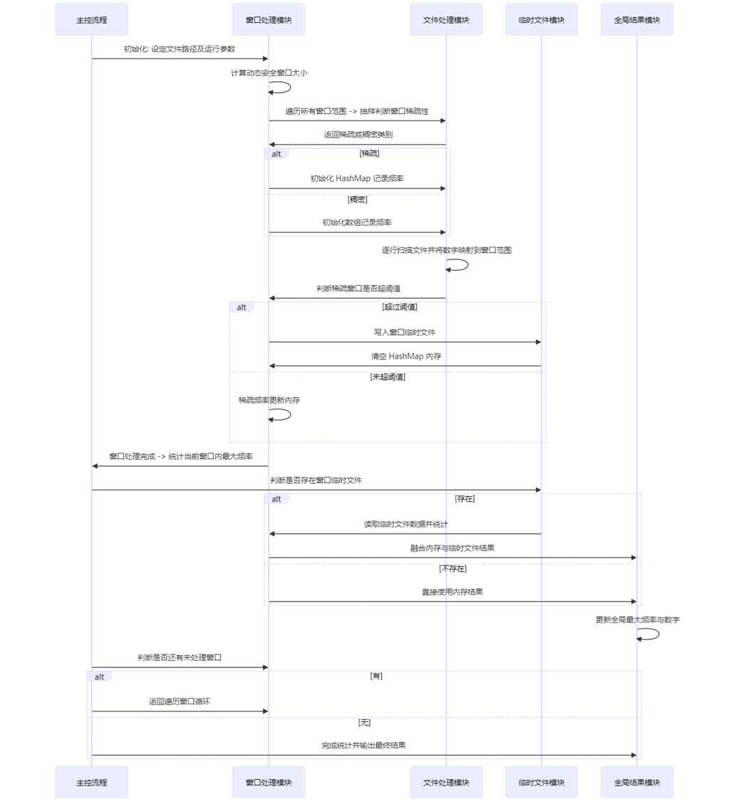

```java
package com.baili.springboot3.utools;

import java.io.*;
import java.util.*;  

public class OptimizedFrequencyCounter {  
    private static final long MAX_NUMBER = 1_000_000_000; // 数字最大值  
    private static final int MEMORY_LIMIT_MB = 100;       // 内存限制，单位MB  
    private static final int INT_SIZE_BYTES = 4;          // 每个 int 占用字节数  
    private static final int HASHMAP_THRESHOLD = 5_000_000; // 稀疏窗口 HashMap 的最大大小  
    
    public static void main(String[] args) throws IOException {  
        String filePath = "large_data.txt"; // 输入文件路径  

        // 动态计算窗口大小  
        int windowSize = calculateWindowSize(MEMORY_LIMIT_MB, MAX_NUMBER, INT_SIZE_BYTES);  

        long globalMaxNumber = -1;           // 全局最大值  
        int globalMaxFrequency = -1;        // 全局最大频率  

        // 遍历整个处理范围，按窗口分段处理  
        for (long windowStart = 0; windowStart < MAX_NUMBER; windowStart += windowSize) {  
            long windowEnd = Math.min(windowStart + windowSize, MAX_NUMBER);  

            // 判断当前窗口是否稀疏  
            boolean isSparse = isSparseWindow(windowStart, windowEnd, filePath);  

            // 初始化窗口存储结构  
            Map<Long, Integer> sparseFrequency = null; // 稀疏模式用 HashMap  
            int[] denseFrequency = null;              // 密集模式用数组  

            if (isSparse) {  
                sparseFrequency = new HashMap<>();  
            } else {  
                denseFrequency = new int[(int) (windowEnd - windowStart)];  
            }  

            // 逐行扫描文件并填充窗口数据  
            try (BufferedReader reader = new BufferedReader(new FileReader(filePath))) {  
                String line;  
                while ((line = reader.readLine()) != null) {  
                    long number = Long.parseLong(line.trim());  
                    if (number >= windowStart && number < windowEnd) { // 判断是否属于当前窗口  
                        if (isSparse) {  
                            sparseFrequency.put(number, sparseFrequency.getOrDefault(number, 0) + 1);  
                            // 稀疏窗口超过阈值，写入临时文件  
                            if (sparseFrequency.size() > HASHMAP_THRESHOLD) {  
                                dumpToDisk(sparseFrequency, windowStart, windowEnd);  
                                sparseFrequency.clear();  
                            }  
                        } else {  
                            denseFrequency[(int) (number - windowStart)]++;  
                        }  
                    }  
                }  
            }  

            // 统计当前窗口的最大频率及数字  
            long[] localMax = processWindowMaxFrequency(sparseFrequency, denseFrequency, windowStart, windowEnd);  

            // 更新全局最大值和频率  
            if (localMax[1] > globalMaxFrequency) {  
                globalMaxFrequency = (int) localMax[1];  
                globalMaxNumber = localMax[0];  
            }  
        }  

        // 打印最终统计结果  
        System.out.println("出现次数最多的数字是: " + globalMaxNumber);  
        System.out.println("出现次数: " + globalMaxFrequency);  
    }  

    /**  
     * 动态计算窗口大小，保证每个窗口不会超出内存限制  
     */  
    private static int calculateWindowSize(int memoryLimitMB, long maxNumber, int intSizeBytes) {  
        int maxWindowSize = (memoryLimitMB * 1024 * 1024) / intSizeBytes; // 每MB支持的窗口大小  
        return (int) Math.max(1, Math.min(maxWindowSize, maxNumber)); // 确保窗口大小为正且在范围内  
    }  

    /**  
     * 抽样判断窗口是否稀疏  
     */  
    private static boolean isSparseWindow(long windowStart, long windowEnd, String filePath) throws IOException {  
        int sampleSize = 1000; // 设定采样大小  
        int matchCount = 0;    // 落在该窗口范围内的数字计数  

        try (BufferedReader reader = new BufferedReader(new FileReader(filePath))) {  
            String line;  
            int sampleCount = 0;  
            while ((line = reader.readLine()) != null && sampleCount < sampleSize) {  
                long number = Long.parseLong(line.trim());  
                if (number >= windowStart && number < windowEnd) {  
                    matchCount++;  
                }  
                sampleCount++;  
            }  
        }  

        double density = (double) matchCount / sampleSize; // 计算窗口的相对数据密度  
        return density < 0.01; // 判断是否是稀疏窗口  
    }  

    /**  
     * 稀疏窗口数据写入临时文件  
     */  
    private static void dumpToDisk(Map<Long, Integer> windowData, long windowStart, long windowEnd) throws IOException {  
        String fileName = "window_" + windowStart + "_" + windowEnd + ".tmp";  

        try (BufferedWriter writer = new BufferedWriter(new FileWriter(fileName, true))) { // 追加写入模式  
            for (Map.Entry<Long, Integer> entry : windowData.entrySet()) {  
                writer.write(entry.getKey() + "," + entry.getValue() + "\n");  
            }  
        }  
        windowData.clear(); // 清空 HashMap  
    }  

    /**  
     * 统计窗口的最大频率，包含内存和临时文件中的值  
     */  
    private static long[] processWindowMaxFrequency(Map<Long, Integer> sparseFrequency, int[] denseFrequency,  
                                                     long windowStart, long windowEnd) throws IOException {  
        long windowMaxNumber = -1; // 窗口出现次数最多的数字  
        int windowMaxFrequency = -1; // 窗口最大频率  

        // 密集模式最大值  
        if (denseFrequency != null) {  
            for (int i = 0; i < denseFrequency.length; i++) {  
                if (denseFrequency[i] > windowMaxFrequency) {  
                    windowMaxFrequency = denseFrequency[i];  
                    windowMaxNumber = windowStart + i;  
                }  
            }  
        }  

        // 稀疏模式最大值  
        if (sparseFrequency != null) {  
            for (Map.Entry<Long, Integer> entry : sparseFrequency.entrySet()) {  
                if (entry.getValue() > windowMaxFrequency) {  
                    windowMaxFrequency = entry.getValue();  
                    windowMaxNumber = entry.getKey();  
                }  
            }  
        }  

        // 合并临时文件中的频率数据  
        String fileName = "window_" + windowStart + "_" + windowEnd + ".tmp";  
        File tempFile = new File(fileName);  
        if (tempFile.exists()) {  
            try (BufferedReader reader = new BufferedReader(new FileReader(tempFile))) {  
                String line;  
                while ((line = reader.readLine()) != null) {  
                    String[] parts = line.split(",");  
                    long number = Long.parseLong(parts[0]);  
                    int frequency = Integer.parseInt(parts[1]);  
                    if (frequency > windowMaxFrequency) {  
                        windowMaxFrequency = frequency;  
                        windowMaxNumber = number;  
                    }  
                }  
            }  
            // 删除临时文件  
            tempFile.delete();  
        }  

        return new long[]{windowMaxNumber, windowMaxFrequency};  
    }  
}
```


> 更新: 2025-06-16 19:31:50  
> 原文: <https://www.yuque.com/tulingzhouyu/db22bv/iayyx1debbkx29g6>