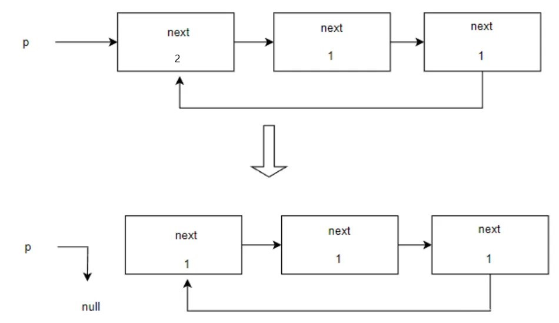
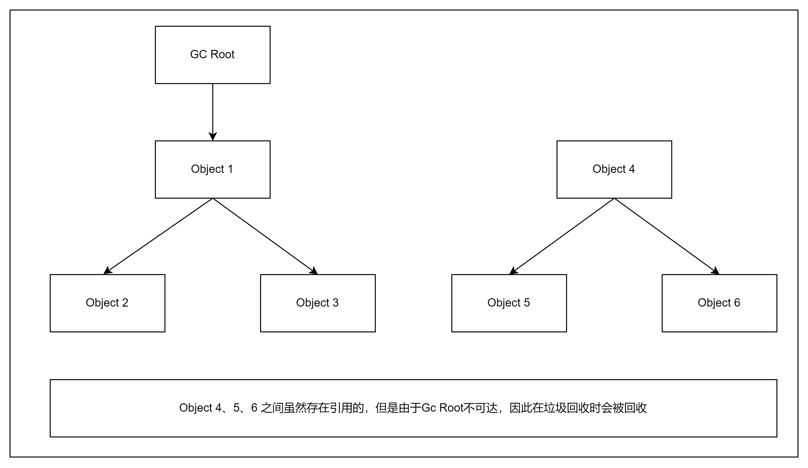

# 如何判断一个对象是否可以被回收

# 对象存活判断
在堆里存放着几乎所有的Java对象实例，在GC执行垃圾回收之前，首先**需要区分出内存中哪些是存活对象，哪些是已经死亡的对象**。

只有被标记为己经死亡的对象，GC才会在执行垃圾回收时，释放掉其所占用的内存空间，因此这个过程我们可以称为垃圾标记阶段

那么在JVM中究竟是如何标记一个死亡对象呢？简单来说，当一个对象已经不再被任何的存活对象继续引用时，就可以宣判为已经死亡

判断对象存活一般有两种方式：**引用计数算法**和**可达性分析算法**。

# 引用计数法
+ 引用计数算法（ReferenceCounting）比较简单，对每个对象保存一个整型的引用计数器属性。用于记录对象被引用的情况
+ 对于一个对象A，只要有任何一个对象引用了A，则A的引用计数器就加1；当引用失效时，引用计数器就减1。只要对象A的引用计数器的值为0，即表示对象A不可能再被使用，可进行回收

优点：

实现简单，垃圾对象便于辨识：判定效率高，回收没有延退性

缺点：

1. 它需要单独的字段存储计数器，这样的做法增加了存储空间的开销
2. 每次赋值都需要更新计数器，伴随着加法和减法操作，这增加了时间开销
3. 引用计数器有一个严重的问题，即无法处理循环引用的情况。这是一条致命缺陷，导致在Java的垃圾回收器中没有使用这类算法。

# 可达性分析算法
## 概述
相对于引用计数算法而言，可达性分析算法不仅同样具备实现简单和执行高效等特点，更重要的是该算法可以有效地**解决在引用计数算法中循环引用的问题，防止内存泄漏的发生，**这里的可达性分析就是Java、c#选择的。这种类型的垃圾收集通常也叫作追踪性垃圾收集

## 基本思路
1. 可达性分析算法是以根对象集合（GCRoots就是一组必须活跃的引用）为起始点，按照从上至下的方式搜索被根对象集合所连接的目标对象是否可达
2. 使用可达性分析算法后，内存中的存活对象都会被根对象集合直接或间接连接着，搜索所走过的路径称为引用链
3. 如果目标对象没有任何引用链相连，则是不可达的，就意味着该对象己经死亡，可以标记为垃圾对象
4. 在可达性分析算法中，只有能够被根对象集合直接或者问接连接的对象才是存活对象

## GC Roots
**在Java 语言中，GC Roots 包括以下几类元素：**

+ **虚拟机栈中引用的对象，比如：各个线程被调用方法中使用到的参数、局部变量等**
+ **本地方法栈内JNI（通常说的本地方法）引用的对象**
+ **方法区中类静态属性引用的对象，比如：Java类的引用类型静态变量**
+ **方法区中常量引用的对象，比如：字符串常量池（StringTable）里的引用**
+ 所有被同步锁synchronized持有的对象
+ Java虚拟机内部的引用，基本数据类型对应的class对象，一些常驻的异常对象（如： NullPointerException、OutofMemoryError），系统类加载器
+ 反映java虚拟机内部情况的JMXBean、JVMTI中注册的回调、本地代码缓存等
+ 除了这些固定的GCRoots集合以外，根据用户所选用的垃圾收集器以及当前回收的内存区域不同，还可以有**其他对象“临时性”地加入，共同构成完 整GC Roots集合。比如：分代收集和局部回收（PartialGC）**
    - 如果只针对了java堆中的某一块区域进行垃圾回收（比如：典型的只针对新生代），必须考虑到内存区域是虚拟机自己的实现细节，更不是孤立封闭的，这个区域的对象完全有可能被其他区域的对象所引用，这时候就需要一并将关联的区域对象也加入GCRoots集合中去考虑，才能保证可达性分析的准确性。

小技巧：

由于Root采用栈方式存放变量和指针，所以如果一个指针，它保存了堆内存里面的对象，但是自己又不存放在堆内存里面，那它就是一个Root

**注意**

1. 如果要使用可达性分析算法来判断内存是否可回收，那么分析工作必须在一个能保障一致性的快照中进行。这点不满足的话分析结果的准确性就无法保证
2. 这点也是导致GC进行时必须Stop The World的一个重要原因，即使是号称（几乎）不会发生停顿的CMS收集器中，枚举根节点时也是必须要停顿的。

> 更新: 2024-10-07 20:54:53  
> 原文: <https://www.yuque.com/tulingzhouyu/db22bv/qwxwgiugvbcrl5np>