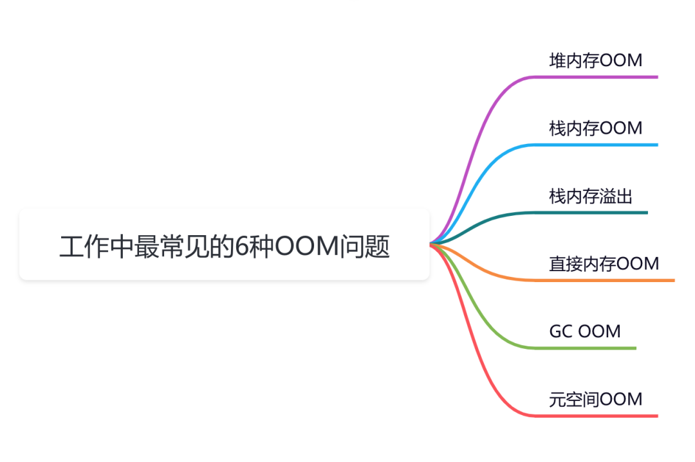
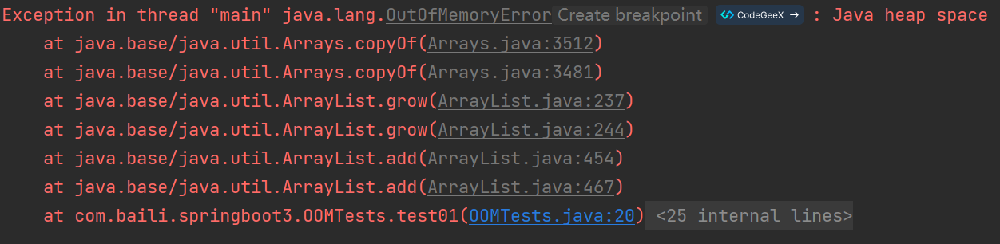
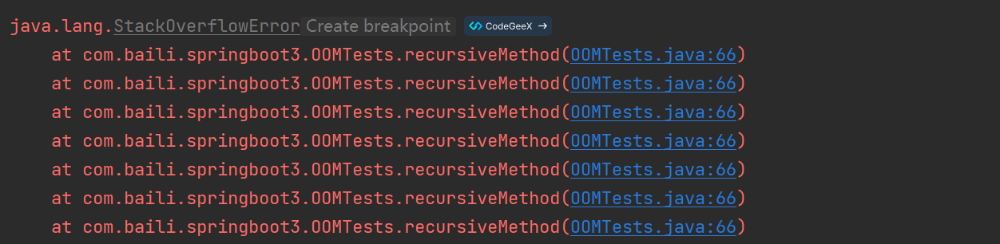

# 工作中最常见的6种OOM问题

## 前言
今天跟大家一起聊聊线上服务出现OOM问题的6种场景，希望对你会有所帮助。



## 堆内存OOM
堆内存OOM是最常见的OOM了。

出现堆内存OOM问题的异常信息如下：

```java
java.lang.OutOfMemoryError: Java heap space
```

此OOM是由于JVM中heap的最大值，已经不能满足需求了。

举个例子：

```java
@Test
public void test01() {
    List<OOMTests> list = Lists.newArrayList();
    while (true) {
        list.add(new OOMTests());
    }
}
```

这里创建了一个list集合，在一个死循环中不停往里面添加对象。

执行结果：



出现了java.lang.OutOfMemoryError: Java heap space的堆内存溢出。

很多时候，excel一次导出大量的数据，获取在程序中一次性查询的数据太多，都可能会出现这种OOM问题。

我们在日常工作中一定要避免这种情况。

## 栈内存OOM
有时候，我们的业务系统创建了太多的线程，可能会导致栈内存OOM。

出现堆内存OOM问题的异常信息如下：

```java
java.lang.OutOfMemoryError: unable to create new native thread
```

给大家举个例子：

```java
public class StackOOMTest {
    public static void main(String[] args) {
        while (true) {
            new Thread().start();
        }
    }
}
```

使用一个死循环不停创建线程，导致系统产生了大量的线程。


如果实际工作中，出现这个问题，一般是由于创建的线程太多，或者设置的单个线程占用内存空间太大导致的。

> 建议在日常工作中，多用线程池，少自己创建线程，防止出现这个OOM。
>

## 栈内存溢出
我们在业务代码中可能会经常写一些`递归`调用，如果递归的深度超过了JVM允许的最大深度，可能会出现栈内存溢出问题。

出现栈内存溢出问题的异常信息如下：

```java
java.lang.StackOverflowError
```

例如：

```java
@Test
public void test03() {
    recursiveMethod();
}

public static void recursiveMethod() {
    // 递归调用自身
    recursiveMethod();
}
```

执行结果：



出现了java.lang.StackOverflowError栈溢出的错误。

> 我们在写递归代码时，一定要考虑递归深度。即使是使用parentId一层层往上找的逻辑，也最好加一个参数控制递归深度。防止因为数据问题导致无限递归的情况，比如：id和parentId的值相等。
>

## 直接内存OOM
`直接内存`不是虚拟机运行时数据区的一部分，也不是《Java虚拟机规范》中定义的内存区域。

它来源于`NIO`，通过存在堆中的`DirectByteBuffer`操作Native内存，是属于`堆外内存`，可以直接向系统申请的内存空间。

出现直接内存OOM问题时异常信息如下：

```java
java.lang.OutOfMemoryError: Direct buffer memory
```

例如下面这样的：

```java
private static final int BUFFER = 1024 * 1024 * 20;

@Test
public void test04() {
    ArrayList<ByteBuffer> list = new ArrayList<>();
    int count = 0;
    try {
        while (true) {
            ByteBuffer byteBuffer = ByteBuffer.allocateDirect(BUFFER);
            list.add(byteBuffer);
            count++;
            try {
                Thread.sleep(100);
            } catch (InterruptedException e) {
                e.printStackTrace();
            }
        }
    } finally {
        System.out.println(count);
    }
}
```


会看到报出来java.lang.OutOfMemoryError: Direct buffer memory直接内存空间不足的异常。

## GC OOM
`GC OOM`是由于JVM在GC时，对象过多，导致内存溢出，建议调整GC的策略。

出现GC OOM问题时异常信息如下：

```java
java.lang.OutOfMemoryError: GC overhead limit exceeded
```

为了方便测试，我先将idea中的最大和最小堆大小都设置成10M：

例如下面这个例子：

```java
public class GCOverheadOOM {
    public static void main(String[] args) {
        ExecutorService executor = Executors.newFixedThreadPool(5);
        for (int i = 0; i < Integer.MAX_VALUE; i++) {
            executor.execute(() -> {
                try {
                    Thread.sleep(10000);
                } catch (InterruptedException e) {
                }
            });
        }
    }
}
```


出现这个问题是由于JVM在GC的时候，对象太多，就会报这个错误。

我们需要改变GC的策略。

在老代80%时就是开始GC，并且将-XX:SurvivorRatio（-XX:SurvivorRatio=8）和-XX:NewRatio（-XX:NewRatio=4）设置的更合理。

## 元空间OOM
`JDK8`之后使用`Metaspace`来代替`永久代`，Metaspace是方法区在`HotSpot`中的实现。

Metaspace不在虚拟机内存中，而是使用本地内存也就是在JDK8中的`ClassMetadata`，被存储在叫做Metaspace的native memory。

出现元空间OOM问题时异常信息如下：

```java
java.lang.OutOfMemoryError: Metaspace
```

为了方便测试，我修改一下idea中的JVM参数，增加下面的配置：

```java
-XX:MetaspaceSize=10m -XX:MaxMetaspaceSize=10m
```

指定了元空间和最大元空间都是10M。

接下来，看看下面这个例子：

```java
public class MetaspaceOOMTest {
    static class OOM {
    }

    public static void main(String[] args) {
        int i = 0;
        try {
            while (true) {
                i++;
                Enhancer enhancer = new Enhancer();
                enhancer.setSuperclass(OOM.class);
                enhancer.setUseCache(false);
                enhancer.setCallback(new MethodInterceptor() {
                    @Override
                    public Object intercept(Object o, Method method, Object[] objects, MethodProxy methodProxy) throws Throwable {
                        return methodProxy.invokeSuper(o, args);
                    }
                });
                enhancer.create();
            }
        } catch (Throwable e) {
            e.printStackTrace();
        }
    }
}
```


程序最后会报java.lang.OutOfMemoryError: Metaspace的元空间OOM。

这个问题一般是由于加载到内存中的类太多，或者类的体积太大导致的。


> 更新: 2024-08-30 16:35:01  
> 原文: <https://www.yuque.com/tulingzhouyu/db22bv/rsgaomnxz4iidrbg>