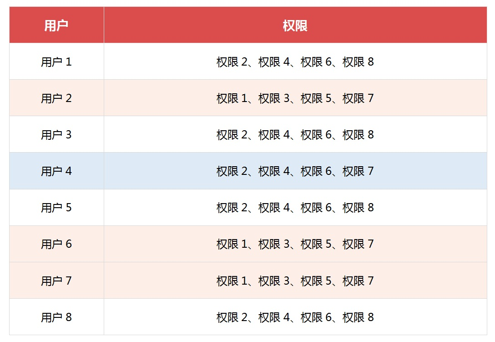
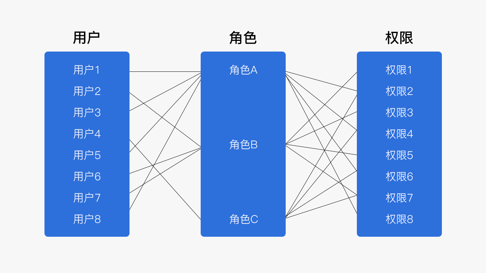

# 程序员必懂的权限模型：RBAC

随着软件系统的复杂性和规模的不断增长，权限管理成为了一个至关重要的问题。

在大型多人协作的系统中，如何有效地管理不同用户的访问权限，确保系统的安全性和稳定性，是每一个开发者都需要面对的挑战。为了解决这一问题，业界提出了一种被广泛应用的权限管理模型——基于角色的访问控制（Role-Based Access Control，简称RBAC）。

# RBAC 模型定义
说起 RBAC 权限模型，我们先看下在“维基”上的定义：

RBAC 其实是一种分析模型，主要分为：**基本模型 RBAC0**、**角色分层模型 RBAC1**、**角色限制模型 RBAC2** 和 **统一模型 RBAC3**。

RBAC 权限模型是基于角色的权限控制。模型中有几个关键的术语：

+ 用户：系统接口及访问的操作者
+ 权限：能够访问某接口或者做某操作的授权资格
+ 角色：具有一类相同操作权限的用户的总称

## RBAC0
RBAC0 是 RBAC 权限模型的核心思想，RBAC1、RBAC2、RBAC3 都是在 RBAC0 上进行扩展的。

RBAC0 是由四部分构成：**用户**、**角色**、**会话**、**许可**。

+ 用户和角色的含义很简单，通过字面意思即可明白，
+ **会话：**指用户被赋予角色的过程，称之为会话或者是说激活角色；
+ **许可：** 就是角色拥有的权限（操作和和被控制的对象），简单的说就是用户可使用的功能或者可查看的数据。

用户与角色是多对多的关系，用户与会话是一对一的关系，会话与角色是一对多的关系，角色与许可是多对多的关系。

## RBAC1
RBAC1 是在 RBAC0 权限模型的基础上，在角色中加入了**继承的概念**，添加了继承的概念后，角色就有了上下级或者等级关系。

举例：集团权责清单下包含的角色有：系统管理员、总部权责管理员、区域权责管理员、普通用户，当管理方式向下兼容时，就可以采用 RBAC1 的继承关系来实现权限的设置。

上层角色拥有下层的所有角色的权限，且上层角色可拥有额外的权限

## RBAC2
RBAC2 是在 RBAC0 权限模型的基础上，在用户和角色以及会话和角色之间分别加入了**约束的概念**（职责分离），职责分离指的是同一个人不能拥有两种特定的权限（例如财务部的纳入和支出，或者运动员和裁判员等等）。

用户和角色的约束有以下几种形式:

+ **互斥角色**：同一个用户在两个互斥角色中**只能选择一个**（也会存在一个用户拥有多个角色情况，但是需要通过切换用户角色来实现对不同业务操作）
+ **基数约束**：一个用户拥有的角色是有限的，一个角色拥有的许可也是有限的
+ **先决条件约束**：用户想要获得高级角色，首先必须拥有低级角色

会话和角色之间的约束，可以动态的约束用户拥有的角色，例如一个用户可以拥有两个角色，但是运行时只能激活一个角色。

## RBAC3
RBAC3 是 RBAC1 与 RBAC2 的合集，所以 RBAC3 包含**继承和约束**。

# 为什么要引用 RBAC 权限模型？
RBAC 中具有角色的概念，如果没有角色这个概念，那么在系统中，每个用户都需要单独设置权限，而系统中所涉及到的功能权限和数据权限都非常多，每个用户都单独设置权限对于维护权限的管理员来说无疑是一件繁琐且工作量巨大的任务。

而引入角色这个概念后，我们只需要给系统设置不同的角色，给角色赋予权限，再将用户与角色关联，这样用户所关联的角色就直接拥有了该角色下的所有权限。

例如：用户 1~用户 8 分别拥有以下权限，不同用户具有相同权限的我用不同的颜色做了区分，如下图：

在没有引入 RBAC 权限模型的情况下，用户与权限的关系图可采用下图展示，每个用户分别设置对应的权限，即便是具有相同权限的用户也需要多次设置权限。

引入 RBAC 权限模型及引入了角色的概念，根据上面表格的统计，用户 1、用户 3、用户 5、用户 8 拥有的权限相同，用户 2、用户 6、用户 7 拥有相同的权限，用户 4 是独立的权限，所以我们这里可以根据数据统计，以及实际的需求情况，可以建立三个不同的角色，角色 A、角色 B、角色 C，三个角色分别对应三组用户不同的权限，如下图所示：

对应的上面的案例表格我们就可以调整为含有角色列的数据表，这样便可以清楚的知道每个用户所对应的角色及权限。

通过引用 RBAC 权限模型后，对于系统中大量的用户的权限设置可以更好的建立管理，角色的引入让具有相同权限的用户可以统一关联到相同的角色中，这样只需要在系统中设置一次角色的权限，后续的用户便可以直接关联这些角色，这样就省去了重复设置权限的过程，对于大型平台的应用上，用户的数量成千上万，这样就可避免在设置权限这项工作上浪费大量的时间。

# 引入用户组的概念
我们依旧拿上面表格案例举例，虽然前面我们应用的 RBAC 权限模型的概念，但是对于大量用户拥有相同权限的用户，我们同样的也需要对每个用户设置对应的角色，如果一个部门上万人，那么我们就需要给这个部门上万人分别设置角色，而这上万其实是具有相同的权限的，如果直接采用基础的 RBAC 权限模型的话，那么面对这样的情况，无疑也是具有一个庞大的重复的工作量，并且也不利于后期用户变更的维护管理，那么针对相同用户具有相同的权限的情况，我们便可以引入用户组的概念。

什么是用户组呢？用户组：把具有相同角色的用户进行分类。

上面我们的数据表格案例中的用户 1、用户 3、用户 5、用户 8 具有相同的角色 A，用户 2、用户 6、用户 7 也拥有相同的角色 B，那么我们就可以将这些具有相同角色的用户建立用户组的关系，拿上面的案例，我们分别对相同角色的用户建立组关系，如下：

+ 用户 1、用户 3、用户 5、用户 8 → 建立用户组1
+ 用户 2、用户 6、用户 7 → 建立用户组2

因为用户 4 只有一个用户，所以直接还是单独建立用户与角色的关系，不需要建立用户组，尽管只有一个用户也是可以建立用户组的关系，这样有利于后期其他用户与用于 4 具有相同的角色时，就可以直接将其他用户添加到这个用户组下即可，根据业务的实际情况而选择适合的方案即可。

通过案例表格的变化我们就可以直观的看出权限设置变得清晰简洁了，通过第用户组赋予角色，可以减少大量的重复的工作，我们常见的企业组织、部门下经常会出现不同用户具有相同角色的情况，所以采用用户组的方式，便可以很好的解决这个问题，给具有相同权限的用户建立用户组，将用户组关联到对应的角色下，此用户组就拥有了此角色下的所有权限，而用户是属于用户组的，所以用户组下的所有用户也就同样的拥有了此角色下的所有权限。一个用户可以属于多个用户组，一个用户组也可以包括多个用户，所以用户与用户组是多对多的关系。

# 引入权限组的概念
权限组与用户组的原理差不多，是将一些相对固定的功能或者权限建立组的关系，然后再给此权限组赋予角色，目前我所接触的 后端项目中使用权限组的概念的比较少，可简单的看一下关系图

# 功能权限和数据权限
后端系统中一般产品的权限由页面、操作和数据构成。页面与操作相互关联，必须拥有页面权限，才能分配该页面下对应的操作权限，数据可被增删改查。所以将权限管理分为功能权限管理和数据权限管理。

功能权限管理：指的是用户可看到哪些模块，能操作哪些按钮，因为企业中的用户拥有不同的角色，拥有的职责也是不同的。

数据权限管理：指的是用户可看到哪些模块的哪些数据。

例如：一个系统中包含多个权责清单（清单 1、清单 2、清单 3），系统管理员能对整个系统操作维护，也就可以对系统中的所有清单进行操作（增、删、改、查）；假如分配给总部权责管理员的是清单 1，那么他将只能对清单 1 进行操作（增、改、查）；普通用户也许只有查看数据的权限，没有数据维操作的权限（查），这里的操作是系统中所有可点击的按钮权限操作，列举的增删改查只是最常见的几种操作而已。

# 实践
RBAC 权限模型对实际业务需求进行设计分析：

1. 不同的区域管理员的权限各不相同（说明会存在不同的用户具有不同的权限，那么我们就可以采用角色对其进行规范）
2. 有大量的用户具有相同的权限（例如组织、部门等）（说明存在相同权限的用户，那么我们就可以采用用户组的概念）
3. 上级管理员拥有下级人员的所有权限（说明存在继承关系）
4. 不同用户所看到的数据和能编辑的数据不同，一些机密性的数据只允许部分人员看或者编辑（说明存在约束）
5. 会存在临时性的用户（说明需要支持新建新角色）
6. 同一用户会存在多个角色（多角色求合集或者切换用户角色）

# 补充
主流的权限模型主要分为以下五种：

+ **ACL 模型**：访问控制列表
+ **DAC 模型**：自主访问控制
+ **MAC 模型**：强制访问控制
+ **ABAC 模型**：基于属性的访问控制
+ **RBAC 模型**：基于角色的权限访问控制

## ACL 模型：访问控制列表
**Access Control List**，ACL 是最早的、最基本的一种访问控制机制，是基于客体进行控制的模型，在其他模型中也有 ACL 的身影。为了解决相同权限的用户挨个配置的问题，后来也采用了用户组的方式。

**原理**：每一个客体都有一个列表，列表中记录的是哪些主体可以对这个客体做哪些行为，非常简单。

**例如**：当用户 A 要对一篇文章进行编辑时，ACL 会先检查一下文章编辑功能的控制列表中有没有用户 A，有就可以编辑，无则不能编辑。再例如：不同等级的会员在产品中可使用的功能范围不同。

**缺点**：当主体的数量较多时，配置和维护工作就会成本大、易出错。

## DAC 模型：自主访问控制
Discretionary Access Control，DAC 是 ACL 的一种拓展。

**原理**：在 ACL 模型的基础上，允许主体可以将自己拥有的权限自主地授予其他主体，所以权限可以任意传递。

**例如**：常见于文件系统，LINUX，UNIX、WindowsNT 版本的操作系统都提供 DAC 的支持。

**缺点**：对权限控制比较分散，例如无法简单地将一组文件设置统一的权限开放给指定的一群用户。主体的权限太大，无意间就可能泄露信息。

## MAC 模型：强制访问控制
**Mandatory Access Control**，MAC 模型中主要的是双向验证机制。常见于机密机构或者其他等级观念强烈的行业，如军用和市政安全领域的软件。

**原理**：主体有一个权限标识，客体也有一个权限标识，而主体能否对该客体进行操作取决于双方的权限标识的关系。

**例如**：将军分为上将>中将>少将，军事文件保密等级分为绝密>机密>秘密，规定不同军衔仅能访问不同保密等级的文件，如少将只能访问秘密文件；当某一账号访问某一文件时，系统会验证账号的军衔，也验证文件的保密等级，当军衔和保密等级相对应时才可以访问。

**缺点**：控制太严格，实现工作量大，缺乏灵活性。

## ABAC 模型：基于属性的访问控制
**Attribute-Based Access Control**，能很好地解决 RBAC 的缺点，在新增资源时容易维护。

**原理**：通过动态计算一个或一组属性是否满足某种机制来授权，是一种很灵活的权限模型，可以按需实现不同颗粒度的权限控制。

属性通常有四类：

1. 主体属性，如用户年龄、性别等；
2. 客体属性，如一篇文章等；
3. 环境属性，即空间限制、时间限制、频度限制；
4. 操作属性，即行为类型，如读写、只读等。

**例如**：早上 9:00，11:00 期间 A、B 两个部门一起以考生的身份考试，下午 14:00，17:00 期间 A、B 两个部门相互阅卷。

**缺点**：规则复杂，不易看出主体与客体之间的关系，实现非常难，现在应用得很少。

> 更新: 2024-12-09 13:45:55  
> 原文: <https://www.yuque.com/tulingzhouyu/db22bv/luyre8gk988x4s7g>