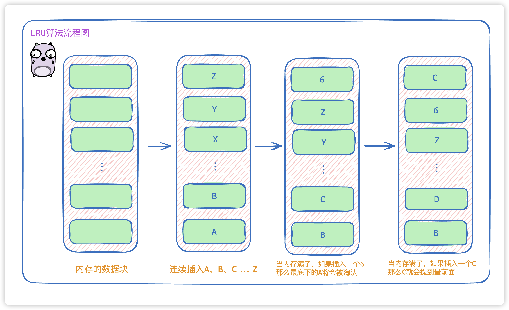
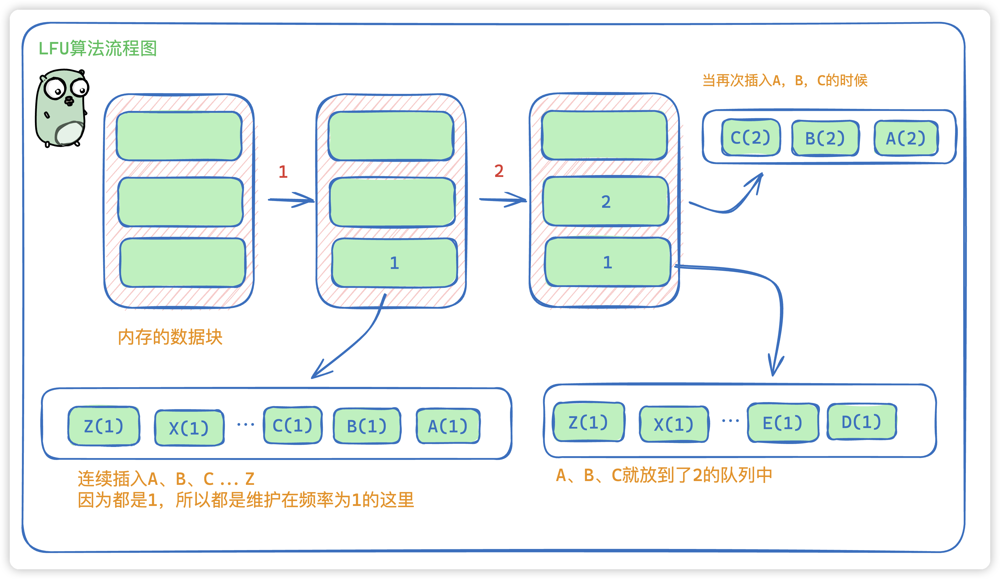
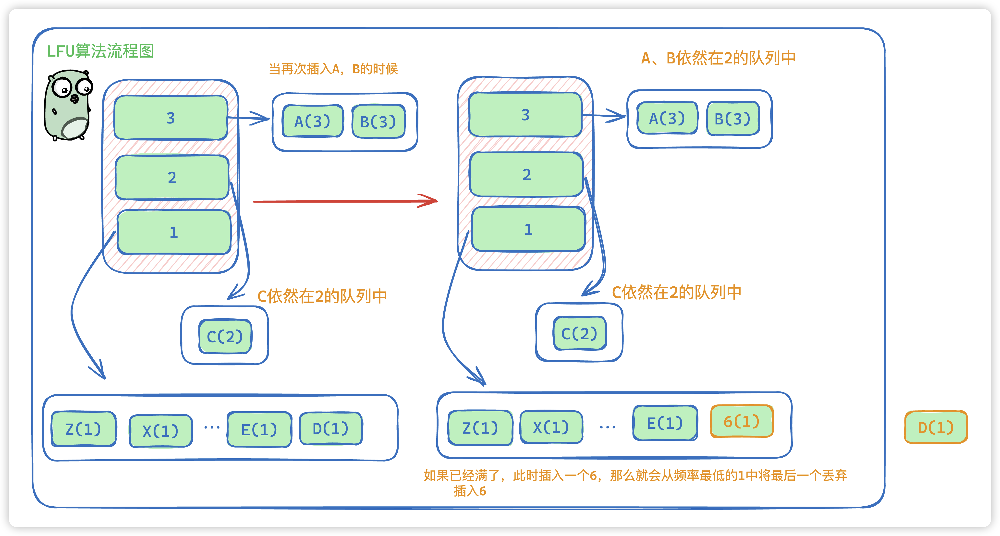

# 缓存淘汰机制 LRU 和 LFU 的区别，电商场景下用哪个？

<font style="color:rgba(6, 8, 31, 0.88);">在高并发、高访问量的电商平台中，缓存是提升性能和保障用户体验的关键。然而，受限于物理内存，缓存空间总是有限，因此必须采用合适的淘汰（替换）策略，保证最有价值的数据能长时间驻留缓存。</font>

<font style="color:rgba(6, 8, 31, 0.88);">本文将对比两种主流的缓存淘汰算法：</font>

<font style="color:rgba(6, 8, 31, 0.88);">LRU（最近最少使用）与 LFU（最不经常使用），并结合Java代码实现，最后分析电商场景下如何选择。</font>

---

## <font style="color:rgba(6, 8, 31, 0.88);">1. LRU与LFU的基本原理</font>
### <font style="color:rgba(6, 8, 31, 0.88);">LRU（最近最少使用）</font>
**<font style="color:rgba(6, 8, 31, 0.88);">思路</font>**<font style="color:rgba(6, 8, 31, 0.88);">：优先淘汰最近一段时间最久未被访问的数据。  
</font>**<font style="color:rgba(6, 8, 31, 0.88);">实现</font>**<font style="color:rgba(6, 8, 31, 0.88);">：常用哈希表 + 双向链表；每当访问或新增数据，即把该数据节点移到链表头部。淘汰时直接移除链表尾部。  
</font>**<font style="color:rgba(6, 8, 31, 0.88);">优点</font>**<font style="color:rgba(6, 8, 31, 0.88);">：实现简单，适应访问热点快速变化的场景。</font>



**流程讲解**：

+ <font style="color:rgba(0, 0, 0, 0.75);">当我们连续插入A、B、C、…Z的时候，此时内存已经</font>`<font style="color:rgb(199, 37, 78);background-color:rgb(249, 242, 244);">插满</font>`<font style="color:rgba(0, 0, 0, 0.75);">了</font>
+ <font style="color:rgba(0, 0, 0, 0.75);">那么当我们再插入一个6，那么此时会</font>**<font style="color:rgba(0, 0, 0, 0.75);">将内存存放时间最久的数据A淘汰掉。</font>**
+ <font style="color:rgba(0, 0, 0, 0.75);">当我们从外部读取数据C的时候，此时C就会</font>`<font style="color:rgb(199, 37, 78);background-color:rgb(249, 242, 244);">提到头部</font>`<font style="color:rgba(0, 0, 0, 0.75);">，这时候C就是最晚淘汰的了。</font>

### <font style="color:rgba(6, 8, 31, 0.88);">LFU（最不经常使用）</font>
**<font style="color:rgba(6, 8, 31, 0.88);">思路</font>**<font style="color:rgba(6, 8, 31, 0.88);">：优先淘汰一段时间内访问次数（频率）最低的数据。  
</font>**<font style="color:rgba(6, 8, 31, 0.88);">实现</font>**<font style="color:rgba(6, 8, 31, 0.88);">：需要维护每个数据节点的访问频率，多用哈希表加“频率链表”组合。淘汰最低频率中的最旧节点。  
</font>**<font style="color:rgba(6, 8, 31, 0.88);">优点</font>**<font style="color:rgba(6, 8, 31, 0.88);">：能更好保留长期高频次访问的数据，适合长期热门但访问分布分散的场景。</font>





**流程讲解**：

+ 如果A没有出现过，那么就会放在双向链表的最后，依次类推，就会是Z、Y。。C、B、A的顺序放到频率为1的链表中。
+ 当我们新插入 A，B，C 那么A，B，C就会到频率为2的链表中
+ 如果再次插入A，B那么A，B会在频率为3中。C依旧在2中
+ 如果**此时已经满了** ，新插入一个的话，我们会**把最后一个D移除**，并插入 6

---

## <font style="color:rgba(6, 8, 31, 0.88);">2. 实现方式和复杂性</font>
| | **<font style="color:rgba(6, 8, 31, 0.88);">LRU</font>** | **<font style="color:rgba(6, 8, 31, 0.88);">LFU</font>** |
| --- | --- | --- |
| <font style="color:rgba(6, 8, 31, 0.88);">原理</font> | <font style="color:rgba(6, 8, 31, 0.88);">淘汰最久未被访问的数据</font> | <font style="color:rgba(6, 8, 31, 0.88);">淘汰访问次数最少的数据</font> |
| <font style="color:rgba(6, 8, 31, 0.88);">复杂度</font> | <font style="color:rgba(6, 8, 31, 0.88);">O(1)</font> | <font style="color:rgba(6, 8, 31, 0.88);">O(1) (合理实现时)</font> |
| <font style="color:rgba(6, 8, 31, 0.88);">优点</font> | <font style="color:rgba(6, 8, 31, 0.88);">实现简单，时间开销小</font> | <font style="color:rgba(6, 8, 31, 0.88);">保护长期高频数据，减少冷数据回流</font> |
| <font style="color:rgba(6, 8, 31, 0.88);">缺点</font> | <font style="color:rgba(6, 8, 31, 0.88);">容易“误杀”最近高频数据</font> | <font style="color:rgba(6, 8, 31, 0.88);">实现较复杂，突发热点响应慢</font> |


---

## <font style="color:rgba(6, 8, 31, 0.88);">3. 电商场景下如何选择？</font>
<font style="color:rgba(6, 8, 31, 0.88);">电商常见的数据访问模式：</font>

+ **<font style="color:rgba(6, 8, 31, 0.88);">秒杀、大促、首页推荐</font>**<font style="color:rgba(6, 8, 31, 0.88);">：短时间部分商品或页面极度火爆，热点变换快。</font>
+ **<font style="color:rgba(6, 8, 31, 0.88);">长尾商品、个性化推荐</font>**<font style="color:rgba(6, 8, 31, 0.88);">：部分数据长期有较低频率访问。</font>

**<font style="color:rgba(6, 8, 31, 0.88);">选择建议：</font>**

+ **<font style="color:rgba(6, 8, 31, 0.88);">若面向热点突变频繁场景（如秒杀、活动页）——优先选择LRU。</font>**<font style="color:rgba(6, 8, 31, 0.88);"> </font><font style="color:rgba(6, 8, 31, 0.88);">因为持续被访问的热点商品会留在缓存前端，发生访问突变时能快速适应变化，防止缓存穿透。</font>
+ **<font style="color:rgba(6, 8, 31, 0.88);">若需保护“常青”商品或内容库（如个性化、长期售卖页面）——可考虑LFU。</font>**<font style="color:rgba(6, 8, 31, 0.88);"> </font><font style="color:rgba(6, 8, 31, 0.88);">能留住虽然访问不集中的长期高频数据，防止被LRU“误杀”。</font>

<font style="color:rgba(6, 8, 31, 0.88);">实际项目中常采用分区或多级缓存，针对不同业务分别设计缓存策略（如：活动页LRU，推荐页LFU）。</font>

---

## <font style="color:rgba(6, 8, 31, 0.88);">4. 结论</font>
+ **<font style="color:rgba(6, 8, 31, 0.88);">LRU和LFU的根本区别</font>**<font style="color:rgba(6, 8, 31, 0.88);">：一个重“新近性”、一个重“访问频率”。</font>
+ **<font style="color:rgba(6, 8, 31, 0.88);">电商访问模式以热点突变为主，推荐优先使用LRU缓存机制</font>**<font style="color:rgba(6, 8, 31, 0.88);">。</font>
+ **<font style="color:rgba(6, 8, 31, 0.88);">综合业务需求时，可以混合使用LRU/LFU，或采用2Q、LRU-K等改进型算法</font>**<font style="color:rgba(6, 8, 31, 0.88);">，结合流量特征和数据重要性灵活选型。</font>

---

## <font style="color:rgba(6, 8, 31, 0.88);">5. Java代码实现</font>
### <font style="color:rgba(6, 8, 31, 0.88);">LRU缓存（基于双向链表+哈希表）</font>
```java
import java.util.HashMap;
import java.util.Map;

public class LRUCache<K, V> {
    private final int capacity;
    private final Map<K, Node<K, V>> map;
    private final Node<K, V> head, tail;

    static class Node<K, V> {
        K key;
        V value;
        Node<K, V> prev, next;

        Node() {}
        Node(K key, V value) {
            this.key = key;
            this.value = value;
        }
    }

    public LRUCache(int capacity) {
        this.capacity = capacity;
        this.map = new HashMap<>();
        head = new Node<>();
        tail = new Node<>();
        head.next = tail;
        tail.prev = head;
    }

    public V get(K key) {
        Node<K, V> node = map.get(key);
        if (node == null) return null;
        moveToHead(node);
        return node.value;
    }

    public void put(K key, V value) {
        Node<K, V> node = map.get(key);
        if (node == null) {
            node = new Node<>(key, value);
            map.put(key, node);
            addToHead(node);
            if (map.size() > capacity) {
                Node<K, V> removed = removeTail();
                map.remove(removed.key);
            }
        } else {
            node.value = value;
            moveToHead(node);
        }
    }

    // 双向链表操作
    private void addToHead(Node<K, V> node) {
        node.prev = head;
        node.next = head.next;
        head.next.prev = node;
        head.next = node;
    }
    private void removeNode(Node<K, V> node) {
        node.prev.next = node.next;
        node.next.prev = node.prev;
    }
    private void moveToHead(Node<K, V> node) {
        removeNode(node);
        addToHead(node);
    }
    private Node<K, V> removeTail() {
        Node<K, V> node = tail.prev;
        removeNode(node);
        return node;
    }
}
```

---

### <font style="color:rgba(6, 8, 31, 0.88);">LFU缓存（基于HashMap和频率链表）</font>
```java
import java.util.*;

public class LFUCache<K, V> {
    private final int capacity;
    private int minFreq;
    private final Map<K, Node<K, V>> nodeMap;
    private final Map<Integer, LinkedHashSet<Node<K, V>>> freqMap;

    static class Node<K, V> {
        K key;
        V value;
        int freq;
        Node(K key, V value) {
            this.key = key;
            this.value = value;
            this.freq = 1;
        }
    }

    public LFUCache(int capacity) {
        this.capacity = capacity;
        this.minFreq = 0;
        this.nodeMap = new HashMap<>();
        this.freqMap = new HashMap<>();
    }

    public V get(K key) {
        Node<K, V> node = nodeMap.get(key);
        if (node == null) return null;
        increaseFreq(node);
        return node.value;
    }

    public void put(K key, V value) {
        if (capacity == 0) return;
        if (nodeMap.containsKey(key)) {
            Node<K, V> node = nodeMap.get(key);
            node.value = value;
            increaseFreq(node);
        } else {
            if (nodeMap.size() == capacity) {
                // 淘汰最低频率且最早的数据
                LinkedHashSet<Node<K, V>> set = freqMap.get(minFreq);
                Node<K, V> toRemove = set.iterator().next();
                set.remove(toRemove);
                nodeMap.remove(toRemove.key);
            }
            Node<K, V> newNode = new Node<>(key, value);
            nodeMap.put(key, newNode);
            freqMap.computeIfAbsent(1, k -> new LinkedHashSet<>()).add(newNode);
            minFreq = 1;
        }
    }

    private void increaseFreq(Node<K, V> node) {
        int freq = node.freq;
        LinkedHashSet<Node<K, V>> set = freqMap.get(freq);
        set.remove(node);
        if (freq == minFreq && set.isEmpty()) {
            minFreq++;
        }
        node.freq++;
        freqMap.computeIfAbsent(node.freq, k -> new LinkedHashSet<>()).add(node);
    }
}
```

---

### <font style="color:rgba(6, 8, 31, 0.88);">使用示例</font>
```java
public class CacheTest {
    public static void main(String[] args) {
        // 测试LRU缓存
        LRUCache<Integer, String> lruCache = new LRUCache<>(2);
        lruCache.put(1, "A");
        lruCache.put(2, "B");
        System.out.println(lruCache.get(1)); // 输出: A
        lruCache.put(3, "C");
        System.out.println(lruCache.get(2)); // 输出: null (2被淘汰)

        // 测试LFU缓存
        LFUCache<Integer, String> lfuCache = new LFUCache<>(2);
        lfuCache.put(1, "A");
        lfuCache.put(2, "B");
        System.out.println(lfuCache.get(1)); // 输出: A
        lfuCache.put(3, "C");
        System.out.println(lfuCache.get(2)); // 输出: null (2被淘汰，因1频率高)
    }
}
```


## 


> 更新: 2025-05-09 16:40:45  
> 原文: <https://www.yuque.com/tulingzhouyu/db22bv/ottfpnobpqy8m81a>