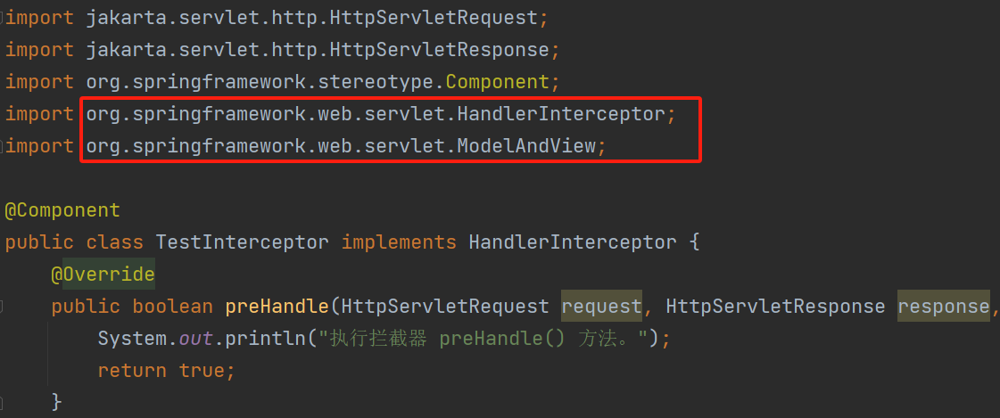

# 过滤器和拦截器有什么区别？

<font style="color:rgb(34, 34, 34);">过滤器（Filter）和拦截器（Interceptor）都是用于解决项目中与请求处理、响应管理和业务逻辑控制相关问题的工具，但它们之间存在明显的区别。接下来，我们将详细探讨这两者的不同之处。</font>

# 实现过滤器和拦截器
首先，我们先来看一下二者在 Spring Boot 项目中的具体实现，这对后续理解二者的区别有很大的帮助。

## 1.实现过滤器
过滤器可以使用 Servlet 3.0 提供的 @WebFilter 注解，配置过滤的 URL 规则，然后再实现 Filter 接口，重写接口中的 doFilter 方法，具体实现代码如下：

```java
import jakarta.servlet.*;
import jakarta.servlet.annotation.WebFilter;

import java.io.IOException;

@WebFilter(urlPatterns = "/*")
public class TestFilter implements Filter {
    @Override
    public void init(FilterConfig filterConfig) throws ServletException {
        System.out.println("执行过滤器 init() 方法。");
    }
    
    @Override
    public void doFilter(ServletRequest servletRequest,
                         ServletResponse servletResponse,
                         FilterChain filterChain) throws IOException, ServletException {
        System.out.println("开始执行过滤器 doFilter() 方法。");
        // 请求放行
        filterChain.doFilter(servletRequest, servletResponse);
        System.out.println("结束执行过滤器 doFilter() 方法。");
    }
    
    @Override
    public void destroy() {
        System.out.println("执行过滤器 destroy() 方法。");
    }
}
```

其中：

+  **void init(FilterConfig filterConfig)：**容器启动（初始化 Filter）时会被调用，整个程序运行期只会被调用一次。用于实现 Filter 对象的初始化。 
+  **void doFilter(ServletRequest request, ServletResponse response,FilterChain chain)：**具体的过滤功能实现代码，通过此方法对请求进行过滤处理，**其中 FilterChain 参数是用来调用下一个过滤器或执行下一个流程**。 
+ ** void destroy()：**用于 Filter 销毁前完成相关资源的回收工作。 b) 实现拦截器 拦截器的实现分为两步，第一步，创建一个普通的拦截器，实现 HandlerInterceptor 接口，并重写接口中的相关方法；第二步，将上一步创建的拦截器加入到 Spring Boot 的配置文件中。

## 2.实现拦截器
实现 HandlerInterceptor 接口并重写 preHandle/postHandle/afterCompletion 方法，具体实现代码如下： 

```java
import jakarta.servlet.http.HttpServletRequest;
import jakarta.servlet.http.HttpServletResponse;
import org.springframework.stereotype.Component;
import org.springframework.web.servlet.HandlerInterceptor;
import org.springframework.web.servlet.ModelAndView;

@Component
public class TestInterceptor implements HandlerInterceptor {
    @Override
    public boolean preHandle(HttpServletRequest request, HttpServletResponse response, Object handler) throws Exception {
        System.out.println("执行拦截器 preHandle() 方法。");
        return true;
    }

    @Override
    public void postHandle(HttpServletRequest request, HttpServletResponse response, Object handler, ModelAndView modelAndView) throws Exception {
        System.out.println("执行拦截器 postHandle() 方法。");
    }

    @Override
    public void afterCompletion(HttpServletRequest request, HttpServletResponse response, Object handler, Exception ex) throws Exception {
        System.out.println("执行拦截器 afterCompletion() 方法。");
    }
}
```

其中：

+ **boolean preHandle(HttpServletRequest request, HttpServletResponse response, Object handle)：**在请求方法执行前被调用，也就是调用目标方法之前被调用。比如我们在操作数据之前先要验证用户的登录信息，就可以在此方法中实现，如果验证成功则返回 true，继续执行数据操作业务；否则就返回 false，后续操作数据的业务就不会被执行了。
+ **void postHandle(HttpServletRequest request, HttpServletResponse response, Object handle, ModelAndView modelAndView)：**调用请求方法之后执行，但它会在 DispatcherServlet 进行渲染视图之前被执行。
+ **void afterCompletion(HttpServletRequest request, HttpServletResponse response, Object handle, Exception ex)：**会在整个请求结束之后再执行，也就是在 DispatcherServlet 渲染了对应的视图之后再执行。

最后，我们再将上面的拦截器注入到项目配置文件中，并设置相应拦截规则，具体实现代码如下：

```java
import org.springframework.beans.factory.annotation.Autowired;
import org.springframework.context.annotation.Configuration;
import org.springframework.web.servlet.config.annotation.InterceptorRegistry;
import org.springframework.web.servlet.config.annotation.WebMvcConfigurer;

@Configuration
public class InterceptorConfig implements WebMvcConfigurer {

    // 注入拦截器
    @Autowired
    private TestInterceptor testInterceptor;

    @Override
    public void addInterceptors(InterceptorRegistry registry) {
        registry.addInterceptor(testInterceptor) // 添加拦截器
                .addPathPatterns("/**"); // 拦截所有地址
    }
}
```

了解了二者的使用之后，接下来我们来看二者的区别。

# 过滤器 VS 拦截器
**过滤器和拦截器的区别主要体现在以下 5 点：**

1. **来源不同；**
2. **触发时机不同；**
3. **实现不同；**
4. **支持的项目类型不同；**
5. **使用的场景不同。**

## 1.来源不同
过滤器来自于 Servlet，而拦截器来自于 Spring 框架，从上面代码中我们也可以看出，过滤器在实现时导入的是 Servlet 相关的包，如下图所示： 


而拦截器在实现时，导入的是 Spring 相关的包，如下图所示： 



## 2.触发时机不同
**请求的执行顺序是：请求进入容器 > 进入过滤器 > 进入 Servlet > 进入拦截器 > 执行控制器（Controller）**，如下图所示： 


所以过滤器和拦截器的执行时机也是不同的，**过滤器会先执行，然后才会执行拦截器，最后才会进入真正的要调用的方法**。

## 3.实现不同
**过滤器是基于方法回调实现的**，我们在上面实现过滤器的时候就会发现，当我们要执行下一个过滤器或下一个流程时，需要调用 FilterChain 对象的 doFilter 方法进行回调执行，如下图所示： 


而**拦截器是基于动态代理（底层是反射）实现的**，它的实现如下图所示： 


代理调用的效果如下图所示： 


## 4.支持的项目类型不同
过滤器是 Servlet 规范中定义的，所以**过滤器要依赖 Servlet 容器，它只能用在 Web 项目中**；而**拦截器是 Spring 中的一个组件，因此拦截器既可以用在 Web 项目中，同时还可以用在 Application 或 Swing 程序中**。

## 5.使用的场景不同
因为拦截器更接近业务系统，所以**拦截器主要用来实现项目中的业务判断的**，比如：登录判断、权限判断、日志记录等业务。 而**过滤器通常是用来实现通用功能过滤的**，比如：敏感词过滤、字符集编码设置、响应数据压缩等功能。

# 总结


+ 拦截器是基于java反射机制的，而过滤器是基于函数回调。
+ 拦截器不依赖于Servlet容器，而过滤器依赖于servlet容器。
+ 拦截器只能对action请求起作用，而过滤器可以对几乎所以的请求起作用。
+ 拦截器可以访问action上下文，值栈里的对象，而过滤器不能。
+ 在Action的生命周期周，拦截器可以被多次调用，而过滤器只能在容器初始化的时候被调用一次。


> 更新: 2024-09-15 17:02:29  
> 原文: <https://www.yuque.com/tulingzhouyu/db22bv/slqi3pzslyqmynug>