# 💎Kafka面试题集合

## Kafka入门
### 什么是消息队列与Kafka简介
消息队列（Message Queue，简称MQ），指保存消息的一个容器，本质是个队列。

消息（Message）是指在应用之间传送的数据，消息可以非常简单，比如只包含文本字符串，也可以更复杂，可能包含嵌入对象。

消息队列（Message Queue）是一种应用间的通信方式，消息发送后可以立即返回，有消息系统来确保信息的可靠专递，消息发布者只管把消息发布到MQ中而不管谁来取，消息使用者只管从MQ中取消息而不管谁发布的，这样发布者和使用者都不用知道对方的存在。

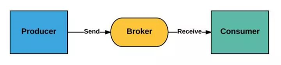

+ <font style="color:rgb(18, 18, 18);">Producer：消息生产者，负责产生和发送消息到 Broker；</font>
+ <font style="color:rgb(18, 18, 18);">Broker：消息处理中心。负责消息存储、确认、重试等，一般其中会包含多个 queue；</font>
+ <font style="color:rgb(18, 18, 18);">Consumer：消息消费者，负责从 Broker 中获取消息，并进行相应处理；</font>

#### <font style="color:rgb(18, 18, 18);">为什么需要消息队列？</font>
1、屏蔽异构平台的细节：发送方、接收方系统之间不需要了解双方，只需认识消息。

2、异步：消息堆积能力；发送方接收方不需同时在线，发送方接收方不需同时扩容（削峰）。

3、解耦：防止引入过多的API给系统的稳定性带来风险；调用方使用不当会给被调用方系统造成压力，被调用方处理不当会降低调用方系统的响应能力。

4、复用：一次发送多次消费。

5、可靠：一次保证消息的传递。如果发送消息时接收者不可用，消息队列会保留消息，直到成功地传递它。

6、提供路由：发送者无需与接收者建立连接，双方通过消息队列保证消息能够从发送者路由到接收者，甚至对于本来网络不易互通的两个服务，也可以提供消息路由。

#### <font style="color:rgb(18, 18, 18);">消息队列有什么优点和缺点？</font>
1. <font style="color:rgb(18, 18, 18);">核心优点</font>
    1. <font style="color:rgb(18, 18, 18);">解耦</font>
    2. <font style="color:rgb(18, 18, 18);">异步</font>
    3. <font style="color:rgb(18, 18, 18);">削峰</font>
2. <font style="color:rgb(18, 18, 18);">缺点</font>
    1. <font style="color:rgb(18, 18, 18);">系统可用性降低：系统引入的外部依赖越多，越容易挂掉。</font>
    2. <font style="color:rgb(18, 18, 18);">系统复杂度提高了</font>
    3. <font style="color:rgb(18, 18, 18);">一致性问题：消息传递给多个系统，部分执行成功，部分执行失败，容易导致数据不一致</font>

#### Kafka简介
Kafka是一个分布式流处理系统，流处理系统使它可以像消息队列一样publish或者subscribe消息，分布式提供了容错性，并发处理消息的机制。

### Kafka的优势和特点
+ **<font style="color:rgb(51, 51, 51);">高吞吐量</font>**<font style="color:rgb(51, 51, 51);">：单机每秒处理几十上百万的消息量。即使存储了许多TB的消息，它也保持稳定的性能。</font>
+ **<font style="color:rgb(51, 51, 51);">高性能</font>**<font style="color:rgb(51, 51, 51);">：单节点支持上千个客户端，并保证零停机和零数据丢失，异步化处理机制</font>
+ **<font style="color:rgb(51, 51, 51);">持久化：</font>**<font style="color:rgb(51, 51, 51);">将消息持久化到磁盘。通过将数据持久化到硬盘以及replica(follower节点)防止数据丢失。</font>
+ **<font style="color:rgb(51, 51, 51);">零拷贝</font>**<font style="color:rgb(51, 51, 51);">：减少了很多的拷贝技术，以及可以总体减少阻塞事件，提高吞吐量。</font>
+ **<font style="color:rgb(51, 51, 51);">可靠性 ：</font>**<font style="color:rgb(51, 51, 51);">Kafka是分布式，分区，复制和容错的。</font>
+ <font style="color:rgb(51, 51, 51);">Kafka的特点 ：</font>
    - **<font style="color:rgb(102, 102, 102);">顺序读，顺序写</font>**
    - **<font style="color:rgb(102, 102, 102);">利用Linux的页缓存</font>**
    - **<font style="color:rgb(102, 102, 102);">分布式系统，易于向外扩展。所有的Producer、Broker和Consumer都会有多个，均为分布式的。无需停机即可扩展机器。多个Producer、Consumer可能是不同的应用。</font>**
    - **<font style="color:rgb(102, 102, 102);">客户端状态维护:消息被处理的状态是在Consumer端维护，而不是由server端维护。当失败时能自动平衡。</font>**
    - **<font style="color:rgb(102, 102, 102);">支持online（在线）和offline（离线）的场景。</font>**
    - **<font style="color:rgb(102, 102, 102);">支持多种客户端语言。Kafka支持Java、.NET、PHP、Python等多种语言。</font>**

### Kafka与传统消息队列的对比
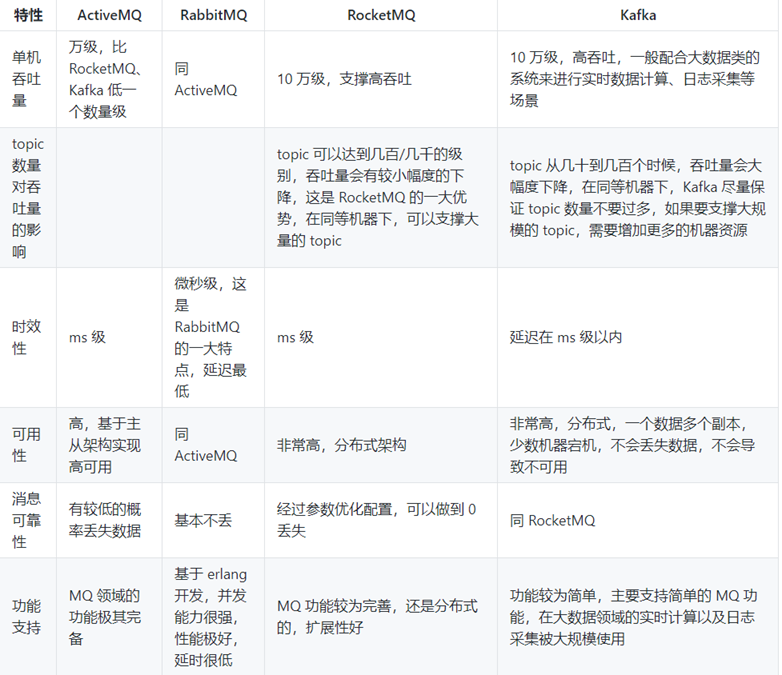

各种对比之后，有如下建议：

+ ActiveMQ，没经过大规模吞吐量场景的验证，社区也不是很活跃，所以不推荐；
+ RabbitMQ，虽然erlang 语言阻止了大量的 Java 工程师去深入研究和掌控它，对公司而言，几乎处于不可控的状态，但是毕竟是开源的，比较稳定的支持，活跃度也高，推荐中小型公司使用；推荐
+ RocketMQ，阿里出品，Java语言编写，经过了阿里多年双十一大促的考验，性能和稳定性得到了充分的严重。目前在业界被广泛应用在订单，交易，充值，流计算，消息推送，日志流式处理，binlog分发等场景；强烈推荐
+ Kafka，如果是大数据领域的实时计算、日志采集等场景，用 Kafka 是业内标准的，绝对没问题，社区活跃度很高，绝对不会黄，何况几乎是全世界这个领域的事实性规范。

### Kafka的架构设计
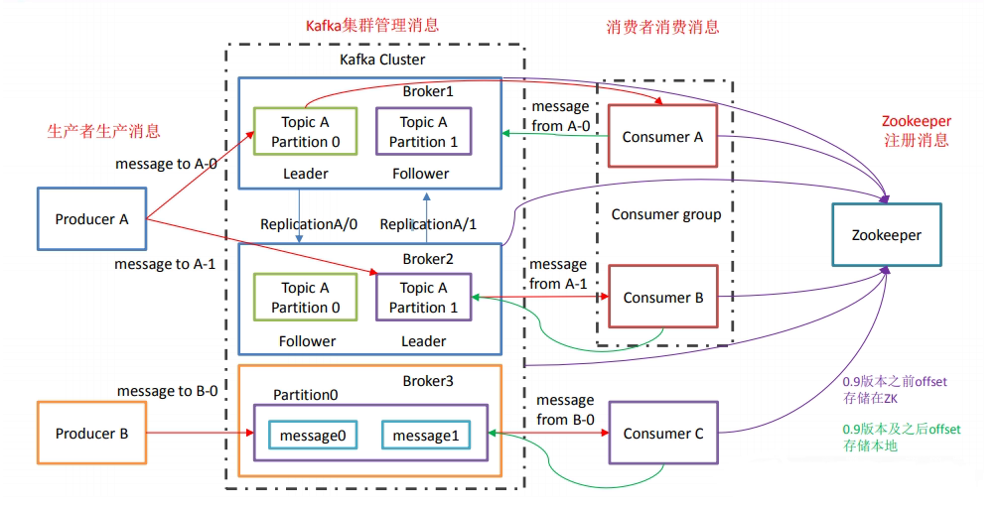

<font style="color:rgb(18, 18, 18);">kafka运行在集群上，集群包含一个或多个服务器。kafka把消息存在topic中，每一条消息包含键值（key），值（value）和时间戳（timestamp）。</font>

<font style="color:rgb(18, 18, 18);">kafka有以下一些基本概念：</font>

**<font style="color:rgb(18, 18, 18);">Producer</font>****<font style="color:rgb(18, 18, 18);"> </font>**<font style="color:rgb(18, 18, 18);">- 消息生产者，就是向kafka broker发消息的客户端。</font>

**<font style="color:rgb(18, 18, 18);">Consumer</font>****<font style="color:rgb(18, 18, 18);"> </font>**<font style="color:rgb(18, 18, 18);">- 消息消费者，是消息的使用方，负责消费Kafka服务器上的消息。</font>

**<font style="color:rgb(18, 18, 18);">Topic</font>****<font style="color:rgb(18, 18, 18);"> </font>**<font style="color:rgb(18, 18, 18);">- 主题，由用户定义并配置在Kafka服务器，用于建立Producer和Consumer之间的订阅关系。生产者发送消息到指定的Topic下，消息者从这个Topic下消费消息。</font>

**<font style="color:rgb(18, 18, 18);">Partition</font>**<font style="color:rgb(18, 18, 18);"> - 消息分区，一个topic可以分为多个 partition，每个partition是一个有序的队列。partition中的每条消息都会被分配一个有序的id（offset）。</font>

**<font style="color:rgb(18, 18, 18);">Broker</font>****<font style="color:rgb(18, 18, 18);"> </font>**<font style="color:rgb(18, 18, 18);">- 一台kafka服务器就是一个broker。一个集群由多个broker组成。一个broker可以容纳多个topic。</font>

**<font style="color:rgb(18, 18, 18);">Consumer Group</font>**<font style="color:rgb(18, 18, 18);"> </font><font style="color:rgb(18, 18, 18);">- 消费者分组，用于归组同类消费者。每个consumer属于一个特定的consumer group，多个消费者可以共同消息一个Topic下的消息，每个消费者消费其中的部分消息，这些消费者就组成了一个分组，拥有同一个分组名称，通常也被称为消费者集群。</font>

**<font style="color:rgb(18, 18, 18);">Offset </font>**<font style="color:rgb(18, 18, 18);">- 消息在partition中的偏移量。每一条消息在partition都有唯一的偏移量，消息者可以指定偏移量来指定要消费的消息。</font>

### <font style="color:rgb(18, 18, 18);">基本概念：</font>
#### <font style="color:rgb(51, 51, 51);">消息和批次</font>
**<font style="color:rgb(51, 51, 51);">消息</font>**<font style="color:rgb(51, 51, 51);"> ，Kafka里的数据单元，也就是我们一般消息中间件里的消息的概念（可以比作数据库中一条记录）。消息由字节数组组成。消息还可以包含键（可选元数据，也是字节数组），主要用于对消息选取分区。</font>

<font style="color:rgb(51, 51, 51);">作为一个高效的消息系统，为了提高效率，消息可以被分批写入Kafka。</font>**<font style="color:rgb(51, 51, 51);">批次</font>**<font style="color:rgb(51, 51, 51);">就是一组消息，这些消息属于同一个主题和分区。如果只传递单个消息，会导致大量的网络开销，把消息分成批次传输可以减少这开销。但是，这个需要权衡（时间延迟和吞吐量之间），批次里包含的消息越多，单位时间内处理的消息就越多，单个消息的传输时间就越长（吞吐量高延时也高）。如果进行压缩，可以提升数据的传输和存储能力，但需要更多的计算处理。</font>

<font style="color:rgb(51, 51, 51);">对于Kafka来说，消息是晦涩难懂的字节数组，一般我们使用序列化和反序列化技术，格式常用的有JSON和XML，还有Avro（Hadoop开发的一款序列化框架），具体怎么使用依据自身的业务来定。</font>

#### <font style="color:rgb(51, 51, 51);">主题和分区</font>
<font style="color:rgb(51, 51, 51);">Kafka里的消息用</font>**<font style="color:rgb(51, 51, 51);">主题</font>**<font style="color:rgb(51, 51, 51);">进行分类（主题好比数据库中的表），主题下有可以被分为若干个 </font>**<font style="color:rgb(51, 51, 51);">分区（分表技术）</font>**<font style="color:rgb(51, 51, 51);"> 。分区本质上是个提交日志文件，有新消息，这个消息就会以追加的方式写入分区（写文件的形式），然后用先入先出的顺序读取。</font>

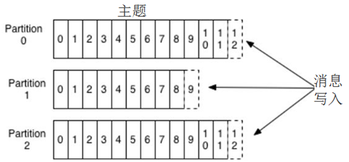

<font style="color:rgb(51, 51, 51);">但是因为主题会有多个分区，所以在整个主题的范围内，是无法保证消息的顺序的，单个分区则可以保证。</font>

<font style="color:rgb(51, 51, 51);">Kafka通过分区来实现数据冗余和伸缩性，因为分区可以分布在不同的服务器上，那就是说一个主题可以跨越多个服务器（这是Kafka高性能的一个原因，多台服务器的磁盘读写性能比单台更高）。</font>

<font style="color:rgb(51, 51, 51);">前面我们说Kafka可以看成一个流平台，很多时候，我们会把一个主题的数据看成一个流，不管有多少个分区。</font>

#### <font style="color:rgb(51, 51, 51);">生产者和消费者、偏移量、消费者群组</font>
<font style="color:rgb(51, 51, 51);">就是一般消息中间件里生产者和消费者的概念。一些其他的高级客户端API，像数据管道API和流式处理的Kafka Stream，都是使用了最基本的生产者和消费者作为内部组件，然后提供了高级功能。</font>

<font style="color:rgb(51, 51, 51);">生产者默认情况下把消息均衡分布到主题的所有分区上，如果需要指定分区，则需要使用消息里的消息键和分区器。</font>

<font style="color:rgb(51, 51, 51);">消费者订阅主题，一个或者多个，并且按照消息的生成顺序读取。消费者通过检查所谓的偏移量来区分消息是否读取过。偏移量是一种元数据，一个不断递增的整数值，创建消息的时候，Kafka会把他加入消息。在一个主题中一个分区里，每个消息的偏移量是唯一的。每个分区最后读取的消息偏移量会保存到Zookeeper或者Kafka上，这样分区的消费者关闭或者重启，读取状态都不会丢失。</font>

<font style="color:rgb(51, 51, 51);">多个消费者可以构成一个消费者群组。怎么构成？共同读取一个主题的消费者们，就形成了一个群组。群组可以保证每个分区只被一个消费者使用。</font>

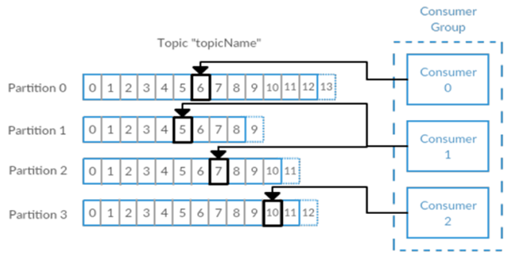

**<font style="color:#DF2A3F;">消费者和分区之间的这种映射关系叫做消费者对分区的所有权关系，很明显，一个分区只有一个消费者，而一个消费者可以有多个分区。</font>****<font style="color:#DF2A3F;">Kafka 区别于其他 MQ 之一</font>**

<font style="color:rgb(51, 51, 51);">（吃饭的故事：一桌一个分区，多桌多个分区，生产者不断生产消息(消费)，消费者就是买单的人，消费者群组就是一群买单的人），一个分区只能被消费者群组中的一个消费者消费（不能重复消费），如果有一个消费者挂掉了</font><font style="color:rgb(51, 51, 51);"><</font><font style="color:rgb(51, 51, 51);">James跑路了>，另外的消费者接上）</font>

#### <font style="color:rgb(51, 51, 51);">Broker和集群</font>
<font style="color:rgb(51, 51, 51);">一个独立的Kafka服务器叫Broker。</font>

<font style="color:rgb(51, 51, 51);">broker的主要工作是，接收生产者的消息，设置偏移量，提交消息到磁盘保存；为消费者提供服务，响应请求，返回消息。在合适的硬件上，单个broker可以处理上千个分区和每秒百万级的消息量。（要达到这个目的需要做操作系统调优和JVM调优）</font>

<font style="color:rgb(51, 51, 51);">多个broker可以组成一个集群。每个集群中broker会选举出一个集群控制器。控制器会进行管理，包括将分区分配给broker和监控broker。</font>

<font style="color:rgb(51, 51, 51);">集群里，一个分区从属于一个broker，这个broker被称为首领。但是分区可以被分配给多个broker，这个时候会发生分区复制。</font>

<font style="color:rgb(51, 51, 51);">集群中Kafka内部一般使用管道技术进行高效的复制。</font>

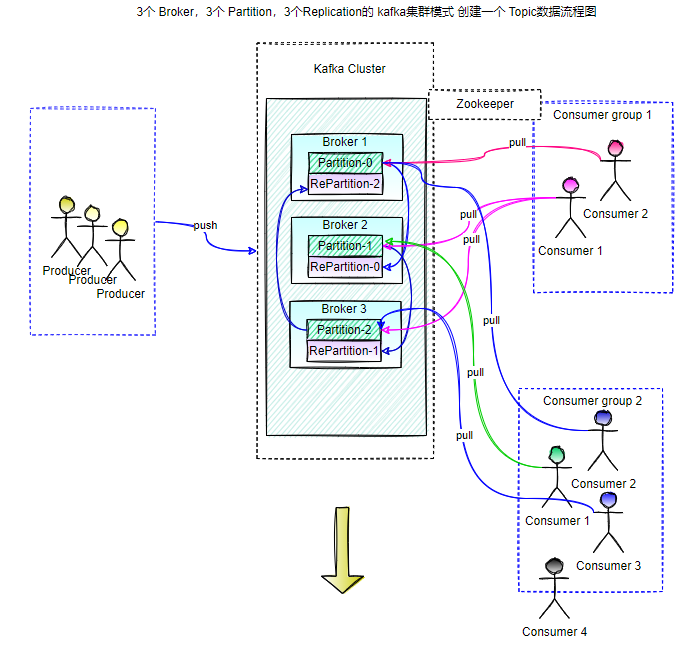

<font style="color:rgb(51, 51, 51);">分区复制带来的好处是，提供了消息冗余。一旦首领broker失效，其他broker可以接管领导权。当然相关的消费者和生产者都要重新连接到新的首领上。（详细过程可见下面的选举部分）</font>

#### <font style="color:rgb(51, 51, 51);">保留消息</font>
<font style="color:rgb(51, 51, 51);">在一定期限内保留消息是Kafka的一个重要特性，Kafka broker默认的保留策略是：要么保留一段时间（7天），要么保留一定大小（比如1个G）。到了限制，旧消息过期并删除。但是每个主题可以根据业务需求配置自己的保留策略（开发时要注意，Kafka不像Mysql之类的永久存储）。</font>

### <font style="color:rgb(18, 18, 18);">工作流程</font>
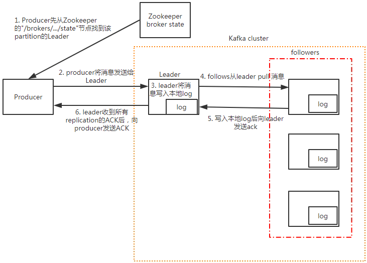

+ producer先从zookeeper的 "/brokers/.../state"节点找到该partition的leader
+ producer将消息发送给该leader
+ leader将消息写入本地log
+ followers从leader pull消息
+ 写入本地log后向leader发送ACK
+ leader收到所有ISR中的replication的ACK后，增加HW（high watermark，最后commit 的offset）并向producer发送ACK

#### [tips](https://www.yuque.com/tianming-aroh0/sagnbd)
+ Kafka 中消息是以topic 进行分类的，生产者生产消息，消费者消费消息，都是面向topic的。
+ topic 是逻辑上的概念，而partition 是物理上的概念，每个partition 对应一个log 文件，该log 文件中存储的就是producer 生产的数据。Producer 生产的数据会被不断追加到该log 文件末端，且每条数据都有自己的offset。消费者组中的每个消费者，都会实时记录自己消费到了哪个offset，以便出错恢复时，从上次的位置继续消费。

### Kafka的数据模型与消息存储机制
#### 消息存储结构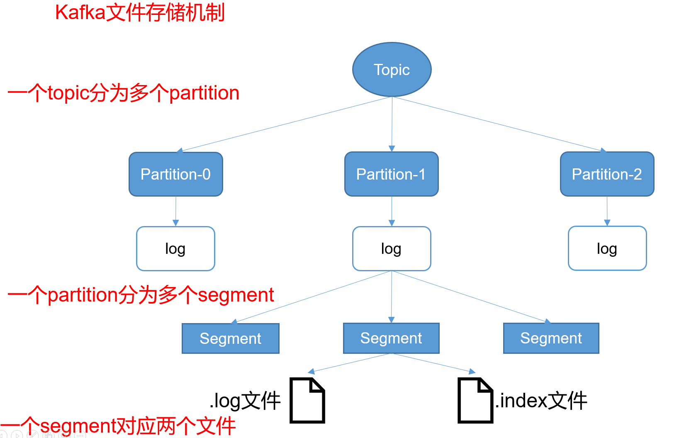
<font style="color:rgb(64, 64, 64);">Kafka 有 Topic 和 Partition 两个概念，一个 Topic 可以有多个 Partition。在实际存储的时候，Topic + Partition 对应一个文件夹，这个文件夹对应的是这个 Partition 的数据。</font>

<font style="color:rgb(64, 64, 64);">在 Kafka 的数据文件目录下，一个 Partition 对应一个唯一的文件夹。如果有 4 个 Topic，每个 Topic 有 5 个 Partition，那么一共会有 4 * 5 = 20 个文件夹。而在 文件夹下，Kafka 消息是采用 Segment File 的存储方式进行存储的。 </font>

<font style="color:rgb(64, 64, 64);">Segment File 的大概意思是：将大文件拆分成小文件来存储，这样一个大文件就变成了一段一段（Segment 段）。这样的好处是 IO 加载速度快，不会有很长的 IO 加载时间。Kafka 的消息存储就采用了这种方式。</font>

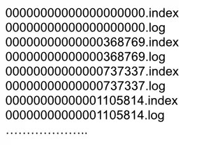

<font style="color:rgb(64, 64, 64);">如上图所示，在一个文件夹下的数据会根据 Kafka 的配置拆分成多个小文件。拆分规则可以根据文件大小拆分，也可以根据消息条数拆分，这个是 Kafka 的一个配置，这里不细说。</font>

<font style="color:rgb(64, 64, 64);">在 Kafka 的数据文件夹下，分为两种类型的文件：索引文件（Index File）和数据文件（Data File）。索引文件存的是消息的索引信息，帮助快速定位到某条消息。数据文件存储的是具体的消息内容。</font>

#### <font style="color:rgb(64, 64, 64);">索引文件</font>
<font style="color:rgb(64, 64, 64);">索引文件的命名统一为数字格式，其名称表示 Kafka 消息的偏移量。我们假设索引文件的数字为 N，那么就代表该索引文件存储的第一条 Kafka 消息的偏移量为 N + 1，而上个文件存储的最后一条 Kafka 消息的偏移量为 N（因为 Kafka 是顺序存储的）。例如下图的 368769.index 索引文件，其表示文件存储的第一条 Kafka 消息的偏移量为 368770。而 368769 表示的是 0000.index 这个索引文件的最后一条消息。所以 368769.index 索引文件，其存储的 Kafka 消息偏移量范围为 368769-737337。</font>


<font style="color:rgb(64, 64, 64);">索引文件存储的是简单地索引数据，其格式为：「N,Position」。其中 N 表示索引文件里的第几条消息，而 Position 则表示该条消息在数据文件（Log File）中的物理偏移地址。例如下图中的「3,497」表示：索引文件里的第 3 条消息（即 offset 368772 的消息，368772 = 368769+3），其在数据文件中的物理偏移地址为 497。</font>

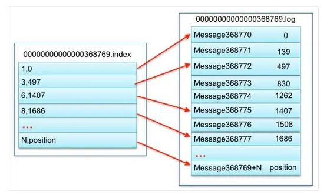

<font style="color:rgb(64, 64, 64);">其他的以此类推，例如：「8,1686」表示 offset 为 368777 的 Kafka 消息，其在数据文件中的物理偏移地址为 1686。</font>

#### <font style="color:rgb(64, 64, 64);">数据文件</font>
<font style="color:rgb(64, 64, 64);">数据文件的命名格式与索引文件的命名格式完全一样，这里就不再赘述了。</font>

<font style="color:rgb(64, 64, 64);">通过上面索引文件的分析，我们已经可以根据 offset 快速定位到某个数据文件了。那接着我们怎么读取到这条消息的内容呢？要读取到这条消息的内容，我们需要搞清楚数据文件的存储格式。</font>

<font style="color:rgb(64, 64, 64);">数据文件就是所有消息的一个列表，而每条消息都有一个固定的格式，如下图所示。</font>

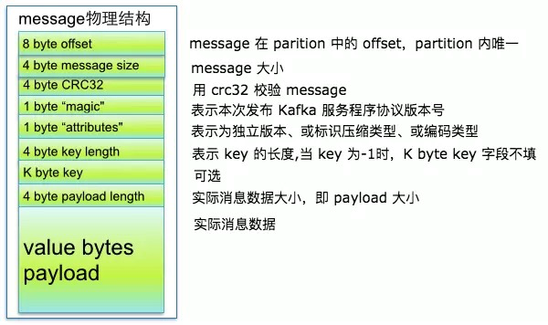

<font style="color:rgb(64, 64, 64);">从上图可以看到 Kafka 消息的物理结构，其包含了 Kafka 消息的 offset 信息、Kafka 消息的大小信息、版本号等等。有了这些信息之后，我们就可以正确地读取到 Kafka 消息的实际内容。</font>

### <font style="color:rgb(37, 41, 51);">Kafka文件存储优势</font>
**Kafka运行时很少有大量读磁盘的操作，主要是定期批量写磁盘操作，因此操作磁盘很高效**。这跟Kafka文件存储中读写message的设计是息息相关的。Kafka中读写message有如下特点:

#### 写message
+ 消息从java堆转入page cache(即物理内存)。
+ 由异步线程刷盘,消息从page cache刷入磁盘。

#### 读message
+ 消息直接从page cache转入socket发送出去。
+ 当从page cache没有找到相应数据时，此时会产生磁盘IO，从磁 盘Load消息到page cache,然后直接从socket发出去

#### Kafka高效文件存储设计特点
+ Kafka把topic中一个parition大文件分成多个小文件段，通过多个小文件段，就容易定期清除或删除已经消费完文件，减少磁盘占用。
+ 通过索引信息可以快速定位message和确定response的最大大小。
+ 通过index元数据全部映射到memory，可以避免segment file的IO磁盘操作。
+ 通过索引文件稀疏存储，可以大幅降低index文件元数据占用空间大小。

### Kafka 副本同步机制
为保证producer发送的数据，能可靠到指定topic，topic的每个的partition收到 producer发送的数据后，都需要向producer发送 ack（acknowledgement确认收到），如果 producer收到 ack，就会进行下一轮的发送。

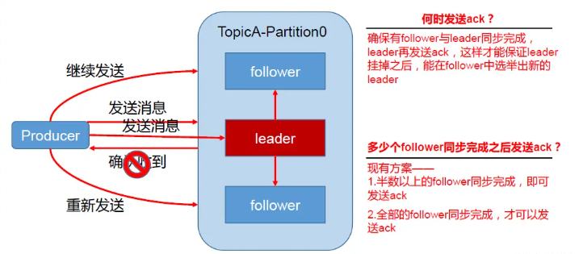

#### <font style="color:rgb(37, 41, 51);">ACKS 机制</font>
<font style="color:rgb(55, 65, 81);">在 Kafka 中，消息的 ACK（Acknowledgment，确认）机制与生产者的 </font>**acks**<font style="color:rgb(55, 65, 81);"> 配置有关。</font>**acks**<font style="color:rgb(55, 65, 81);"> 配置表示生产者在接收到消息后等待副本同步确认的方式，具体取值有：</font>

+ **acks=0：**
    - <font style="color:rgb(55, 65, 81);">意义：生产者在成功将消息发送给 Kafka 服务端后不等待任何确认。</font>
    - <font style="color:rgb(55, 65, 81);">结果：生产者无法知道消息是否成功到达 Kafka 服务器，可能会导致消息的丢失。这种配置下，生产者不会收到任何 ACK。</font>
+ **acks=1：**
    - <font style="color:rgb(55, 65, 81);">意义：生产者在成功将消息发送给 Kafka 服务端后，等待该分区的首领节点（leader）确认。</font>
    - <font style="color:rgb(55, 65, 81);">结果：生产者会收到分区首领节点的 ACK。这意味着只要分区首领节点成功接收到消息，生产者就会得到确认，而不需要等待其他副本。</font>
+ **acks=all 或 acks=-1：**
    - <font style="color:rgb(55, 65, 81);">意义：生产者在成功将消息发送给 Kafka 服务端后，等待所有分区副本确认。</font>
    - <font style="color:rgb(55, 65, 81);">结果：生产者会等待分区的所有副本都成功接收到消息并确认。这是最安全的配置，因为只有当所有副本都确认接收到消息后，才认为消息被成功提交。</font>

#### 生产者重试机制：
<font style="color:rgb(55, 65, 81);">Kafka 生产者在发送消息后，如果设置了等待服务器的确认（通过 </font>**acks**<font style="color:rgb(55, 65, 81);"> 参数配置），会等待一定时间来收到来自服务器的确认（ack）。这个等待时间由 </font>**timeout.ms**<font style="color:rgb(55, 65, 81);"> 参数控制，默认是 </font>**10000**<font style="color:rgb(55, 65, 81);"> 毫秒（10秒）。</font>

<font style="color:rgb(55, 65, 81);">如果在等待时间内没有收到服务器的确认，生产者可以选择重试发送或者处理发送失败的逻辑。这取决于生产者的配置。通常，生产者会根据配置的重试次数和重试间隔来进行重试，以确保消息最终被成功发送。</font>

<font style="color:rgb(55, 65, 81);">在 Kafka 的生产者配置中，你可以找到以下与重试相关的配置项：</font>

+ **retries**<font style="color:rgb(55, 65, 81);">: 定义了生产者在发送消息时的最大重试次数。</font>
+ **retry.backoff.ms**<font style="color:rgb(55, 65, 81);">: 定义了两次重试之间的等待时间间隔。</font>

#### <font style="color:rgb(37, 41, 51);">ISR 机制：</font>
Kafka根据**副本同步**的情况，分成了3个**集合**：

+ AR（Assigned Replicas）：包括ISR和OSR
+ ISR（In-sync Replicas）：和leader副本保持同步的副本集合，可以被认为是可靠的数据
+ OSR（Out-Sync Replicas）：和Leader副本同步失效的副本集合

当 kafka 副本同步机制是所有follower都同步成功才返回 ack 给生产者时，如果有一个follower，因为某种故障，迟迟不能与leader 进行同步，那leader 就要一直等下去，直到它完成同步，才能发送ack。这个问题怎么解决呢？

Leader维护了一个动态的in-sync replica set (ISR-同步副本列表)，意为和leader保持同步的follower集合。根据follower发来的FETCH请求中的fetch offset判断ISR中的follower完成数据同步是否成功。如果follower长时间未向leader同步数据，则该follower将被踢出ISR，该时间阈值由replica.lag.time.max.ms参数设定。Leader发生故障之后，就会从ISR中选举新的leader。

+ ISR(In-Sync Replicas )：与leader保持同步的follower集合
+ AR(Assigned Replicas)：分区的所有副本 
    - ISR是由leader维护，follower从leader同步数据有一些延迟（包括延迟时间replica.lag.time.max.ms和延迟条数replica.lag.max.messages两个维度, 当前最新的版本0.10.x中只支持replica.lag.time.max.ms这个维度），任意一个超过阈值都会把follower剔除出ISR， 存入OSR(Outof-Sync Replicas)列表，新加入的follower也会先存放在OSR中。
    - AR=ISR+OSR。	

#### <font style="color:rgb(51, 51, 51);">ISR的伸缩</font>
<font style="color:rgb(51, 51, 51);">Kafka在启动的时候会开启两个与ISR相关的定时任务，名称分别为“isr-expiration"和”isr-change-propagation".。isr-expiration任务会周期性的检测每个分区是否需要缩减其ISR集合。这个周期和“</font>**<font style="color:rgb(51, 51, 51);">replica.lag.time.max.ms</font>**<font style="color:rgb(51, 51, 51);">”(延迟时间)参数有关。大小是这个参数一半。默认值为5000ms，当检测到ISR中有是失效的副本的时候，就会缩减ISR集合。如果某个分区的ISR集合发生变更， 则会将变更后的数据记录到ZooKerper对应/brokers/topics//partition//state节点中。</font>

### <font style="color:rgb(51, 51, 51);">Kafka选举机制</font>
<font style="color:rgb(51, 51, 51);">在kafka集群中有2个种leader，一种是broker的leader即controller leader，还有一种就是partition的leader。</font>

#### <font style="color:rgb(51, 51, 51);">【Controller leader】</font>
<font style="color:rgb(51, 51, 51);">当broker启动的时候，都会创建KafkaController对象，但是集群中只能有一个leader对外提供服务，这些每个节点上的KafkaController会在指定的zookeeper路径下创建临时节点，只有第一个成功创建的节点的KafkaController才可以成为leader，其余的都是follower。当leader故障后，所有的follower会收到通知，再次竞争在该路径下创建节点从而选举新的leader</font>

#### <font style="color:rgb(51, 51, 51);">【Partition leader】</font>
<font style="color:rgb(51, 51, 51);">由controller leader执行</font>

+ <font style="color:rgb(51, 51, 51);">从Zookeeper中读取当前分区的所有ISR(in-sync replicas)集合</font>
+ <font style="color:rgb(51, 51, 51);">调用配置的分区选择算法选择分区的leader</font>

#### kafka中的 zookeeper 起到什么作用
zookeeper 是一个分布式的协调组件，早期版本的kafka用zk做meta信息存储，consumer的消费状态，group的管理以及 offset的值。考虑到zk本身的一些因素以及整个架构较大概率存在单点问题，新版本中逐渐弱化了zookeeper的作用

新的consumer使用了kafka内部的group coordination协议，也减少了对zookeeper的依赖， 但是broker依然依赖于ZK，zookeeper 在kafka中还用来选举controller 和 检测broker是否存活等等。

**可以不用zookeeper么？**

2.8.0版本以前需借助Zookeeper完成选举投票，后续版本kafka自身已集成该功能。

#### <font style="color:rgb(51, 51, 51);">选举示意图：</font>
<font style="color:rgb(51, 51, 51);">LEO 表示 Log End Offset 下一条等待写入的消息的offset（最新的Offset+1。每一个消息都有一个offset ，offset实际也是topic默认50个）</font>

<font style="color:rgb(51, 51, 51);">HW 表示 Hign Watermark ISR中最小的LED（因为数据可能没有完全保持同步，所以Consumer最多只能消费到HW之前的位置，比如这里消费到offset5的消息，也就是说其他副本没有同步过去的消息，是不能被消费的）</font>

<font style="color:rgb(51, 51, 51);">follower故障 </font>

<font style="color:rgb(51, 51, 51);">follower发生故障后会被临时踢出ISR，待该follower恢复后，follower会读取本地磁盘记录的上次的HW，并将log文件高于HW的部分截取掉，从HW开始向leader进行同步。</font>

<font style="color:rgb(51, 51, 51);">等该follower的LEO大于等于该Partition的HW，即follower追上leader之后，就可以重新加入ISR了。</font>

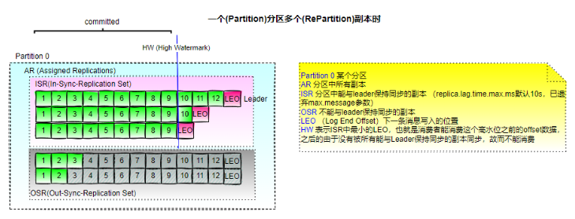

#### 选举过程：
故障检测：当 Leader Broker 发生故障或不可用时，Zookeeper 会检测到该变化，并通知相关的 Broker。

选举触发：Zookeeper 会触发 Leader 选举过程，选择一个新的 Leader Broker。

选举算法：Kafka 使用一种基于 Zookeeper 的选举算法（如 Zab 协议）来选择新的 Leader Broker。


### Kafka 副本<font style="color:rgb(37, 41, 51);">数据一致性</font>
#### 尽管采用 acks = all 但是也会出现 不一致的场景，例如：
:::tips
假设 leader 接受了 producer 传来的数据为 8 条，ISR 中三台 follower（broker0,broker1,broker2）开始同步数据，由于网络传输，另外两台 follower 同步数据的速率不同。当 broker1 同步了 4 条数据，broker2 已经同步了 6 条数据，此时，leader-broker0 突然挂掉，从 ISR 中选取了 broker1 作为主节点，此时 leader-broker1 同步了 4 条，broker2 同步 6，就会造成 leader 和 followe r之间数据不一致问题。

:::

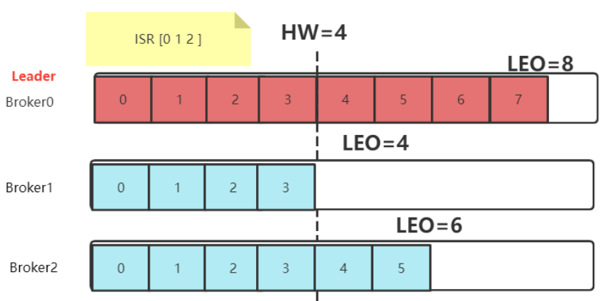

+ **HW** （High Watermark）俗称高水位，它标识了一个特定的消息偏移量（offset），消费者只能拉取到这个offset之前的消息，对于同一个副本对象而言，其 HW 值不会大于 LEO 值。小于等于 HW 值的所有消息都被认为是“已备份”的（replicated） 。**所有分区副本中消息偏移量最小值。**
+ **LEO**（Log End Offset），即日志末端位移(log end offset)，记录了该副本底层日志(log)中下一条消息的位移值。**注意是下一条消息！也就是说**，如果 LEO =8，那么表示该副本保存了 8 条消息，位移值范围是[0, 7]。LEO 的大小相当于当前日志分区中最后一条消息的 offset 值加1，分区 ISR 集合中的每个副本都会维护自身的 LEO，而 **ISR 集合中最小的 LEO 即为分区的 HW**，**对消费者而言只能消费 HW 之前的消息**。

#### 针对不同的产生原因，解决方案不同：
+ 当服务出现故障时：如果是 Follower 发生故障，这不会影响消息写入，只不过是少了一个备份而已。处理 相对简单一点。Kafka 会做如下处理：  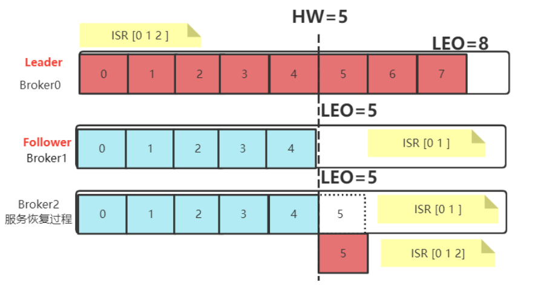
    - 将故障的 Follower 节点临时踢出 ISR 集合。而其他 Leader 和 Follower 继续正常接收消息。 
    - 出现故障的 Follower 节点恢复后，不会立即加入 ISR 集合。该 Follower 节点会读取本地记录的上一次的 HW，将自己的日志中高于 HW 的部分信息全部删除掉，然后从 HW 开始，向 Leader 进行消息同步。 
    - 等到该 Follower 的 LEO 大于等于整个 Partiton 的 HW 后，就重新加入到 ISR 集合中。这也就是说这个 Follower 的消息进度追上了 Leader。  
+  如果是 Leader 节点出现故障，Kafka 为了保证消息的一致性，处理就会相对复杂一点。 

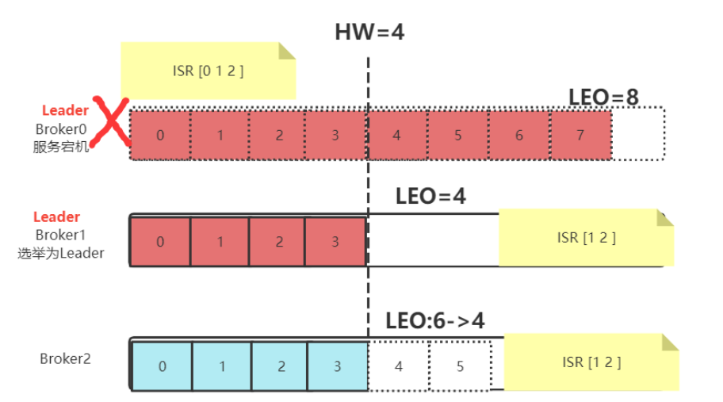

    - Leader 发生故障，会从 ISR 中进行选举，将一个原本是 Follower 的 Partition提升为新的 Leader。这时， 消息有可能没有完成同步，所以新的 Leader 的LEO 会低于之前 Leader 的 LEO。 
    - Kafka 中的消息都只能以 Leader 中的备份为准。其他 Follower 会将各自的Log 文件中高于 HW 的部分全部 清理掉，然后从新的 Leader 中同步数据。 
    - 旧的 Leader 恢复后，将作为 Follower 节点，进行数据恢复。  

### 怎么确保消息顺序性？
稍后完善。。。。


### 如何确保消息不丢失
此问题在RabbitMQ中已详细解答，这里实则类似也就是三端都需确保。

#### <font style="color:rgb(25, 27, 31);">Producer 端</font>
<font style="color:rgb(25, 27, 31);">发送数据有 ACK 机制</font>

+ **<font style="color:rgb(25, 27, 31);">acks =0：</font>**<font style="color:rgb(25, 27, 31);">由于发送后就自认为发送成功，这时如果发生网络抖动， Producer 端并不会校验 ACK 自然也就丢了，且无法重试。</font>
+ **<font style="color:rgb(25, 27, 31);">acks = 1：</font>**<font style="color:rgb(25, 27, 31);">消息发送 Leader Parition 接收成功就表示发送成功，这时只要 Leader Partition 不 Crash 掉，就可以保证 Leader Partition 不丢数据，但是如果 Leader Partition 异常 Crash 掉了， Follower Partition 还未同步完数据且没有 ACK，这时就会丢数据。</font>
+ **<font style="color:rgb(25, 27, 31);">acks = -1 或者 all：</font>**<font style="color:rgb(25, 27, 31);">消息发送需要等待 ISR 中 Leader Partition 和 所有的 Follower Partition 都确认收到消息才算发送成功, 可靠性最高。当然万一有副本出问题，这就只能干等了，可以配合 </font>**<font style="color:rgb(25, 27, 31);">min.insync.replicas:</font>**<font style="color:rgb(25, 27, 31);">设置必须确认的最小同步副本数</font>

#### <font style="color:rgb(25, 27, 31);">KafkaBroker </font>
**<font style="color:rgb(25, 27, 31);">集群</font>**<font style="color:rgb(25, 27, 31);">接收到数据后会将数据进行持久化存储到磁盘，为了提高吞吐量和性能，采用的是「</font>**<font style="color:rgb(25, 27, 31);">异步批量刷盘的策略</font>**<font style="color:rgb(25, 27, 31);">」，也就是说按照一定的消息量和间隔时间进行刷盘。首先会将数据存储到 「</font>**<font style="color:rgb(25, 27, 31);">PageCache</font>**<font style="color:rgb(25, 27, 31);">」 中，至于什么时候将 Cache 中的数据刷盘是由「</font>**<font style="color:rgb(25, 27, 31);">操作系统</font>**<font style="color:rgb(25, 27, 31);">」根据自己的策略决定或者调用 fsync 命令进行强制刷盘，如果此时 Broker 宕机 Crash 掉，且选举了一个落后 Leader Partition 很多的 Follower Partition 成为新的 Leader Partition，那么落后的消息数据就会丢失。所以只有配合生产者acks=-1除了leader落盘还有</font>

#### <font style="color:rgb(25, 27, 31);">Comsumer端</font>
+ <font style="color:rgb(25, 27, 31);">手动提交位移：关闭自动提交位移（</font>`<font style="color:rgba(0, 0, 0, 0.9);">enable.auto.commit=false</font>`<font style="color:rgb(25, 27, 31);">），改为手动提交offset。只有在消息成功处理后才提交位移，确保消息不会因消费者故障而丢失。</font>
+ <font style="color:rgb(25, 27, 31);">位移重置策略</font><font style="color:rgb(25, 27, 31);">：通过</font>`<font style="color:rgba(0, 0, 0, 0.9);">auto.offset.reset=earliest</font>`<font style="color:rgb(25, 27, 31);">，确保消费者在重新启动时从最早未消费的消息开始消费，避免消息丢失。</font>
+ <font style="color:rgb(25, 27, 31);">消费者组机制：通过消费者组实现消息的负载均衡，确保消息能够被均匀分配给消费者，避免某些消费者过载导致的消息丢失。</font>

提交offset方式有`<font style="color:rgba(0, 0, 0, 0.9);">commitSync()</font>`<font style="color:rgba(0, 0, 0, 0.6);">和</font>`<font style="color:rgba(0, 0, 0, 0.9);">commitAsync()</font>`<font style="color:rgba(0, 0, 0, 0.6);">两种方法</font>

<font style="color:rgba(0, 0, 0, 0.6);">附代码：同步提交</font>

```java
import org.apache.kafka.clients.consumer.Consumer;
import org.apache.kafka.clients.consumer.ConsumerConfig;
import org.apache.kafka.clients.consumer.ConsumerRecords;
import org.apache.kafka.clients.consumer.KafkaConsumer;
import java.util.Collections;
import java.util.Properties;

public class KafkaConsumerExample {
    public static void main(String[] args) {
        Properties props = new Properties();
        props.put(ConsumerConfig.BOOTSTRAP_SERVERS_CONFIG, "localhost:9092");
        props.put(ConsumerConfig.GROUP_ID_CONFIG, "TianMing-group");
        props.put(ConsumerConfig.ENABLE_AUTO_COMMIT_CONFIG, "false");
        props.put(ConsumerConfig.KEY_DESERIALIZER_CLASS_CONFIG, "org.apache.kafka.common.serialization.StringDeserializer");
        props.put(ConsumerConfig.VALUE_DESERIALIZER_CLASS_CONFIG, "org.apache.kafka.common.serialization.StringDeserializer");

        KafkaConsumer<String, String> consumer = new KafkaConsumer<>(props);
        consumer.subscribe(Collections.singletonList("TianMing-topic"));

        try {
            while (true) {
                ConsumerRecords<String, String> records = consumer.poll(1000);
                for (ConsumerRecord<String, String> record : records) {
                    // 处理消息
                    System.out.println("Received message: " + record.value());
                    // 模拟消息处理
                    processMessage(record);
                }
                // 提交偏移量
                consumer.commitSync();
            }
            //为确保可靠性，如果提交失败，可以直接重试或记录后续处理。
        } catch (Exception e) {
            e.printStackTrace();
        } finally {
            consumer.close();
        }
    }

    private static void processMessage(ConsumerRecord<String, String> record) {
        // 模拟消息处理逻辑
        System.out.println("Processing message: " + record.value());
    }
}
```

<font style="color:rgba(0, 0, 0, 0.6);">附代码：异步提交</font>

```java
import org.apache.kafka.clients.consumer.Consumer;
import org.apache.kafka.clients.consumer.ConsumerConfig;
import org.apache.kafka.clients.consumer.ConsumerRecords;
import org.apache.kafka.clients.consumer.KafkaConsumer;
import org.apache.kafka.clients.consumer.OffsetAndMetadata;
import org.apache.kafka.clients.consumer.OffsetCommitCallback;
import java.util.Collections;
import java.util.Map;
import java.util.Properties;

public class KafkaConsumerAsyncExample {
    public static void main(String[] args) {
        Properties props = new Properties();
        props.put(ConsumerConfig.BOOTSTRAP_SERVERS_CONFIG, "localhost:9092");
        props.put(ConsumerConfig.GROUP_ID_CONFIG, "TianMing-group");
        props.put(ConsumerConfig.ENABLE_AUTO_COMMIT_CONFIG, "false");
        props.put(ConsumerConfig.KEY_DESERIALIZER_CLASS_CONFIG, "org.apache.kafka.common.serialization.StringDeserializer");
        props.put(ConsumerConfig.VALUE_DESERIALIZER_CLASS_CONFIG, "org.apache.kafka.common.serialization.StringDeserializer");

        KafkaConsumer<String, String> consumer = new KafkaConsumer<>(props);
        consumer.subscribe(Collections.singletonList("TianMing-topic"));

        try {
            while (true) {
                ConsumerRecords<String, String> records = consumer.poll(1000);
                for (ConsumerRecord<String, String> record : records) {
                    // 处理消息
                    System.out.println("Received message: " + record.value());
                    // 模拟消息处理
                    processMessage(record);
                }
                // 异步提交偏移量
                consumer.commitAsync(new OffsetCommitCallback() {
                    @Override
                    public void onComplete(Map<TopicPartition, OffsetAndMetadata> offsets, Exception exception) {
                        if (exception != null) {
                            System.err.println("Commit failed for offsets: " + offsets);
                            exception.printStackTrace();
                            // 处理提交失败的情况
                        } else {
                            System.out.println("Offsets committed successfully: " + offsets);
                        }
                    }
                });
            }
            //为确保可靠性，如果提交失败，可以在回调中重试提交。
        } catch (Exception e) {
            e.printStackTrace();
        } finally {
            consumer.close();
        }
    }

    private static void processMessage(ConsumerRecord<String, String> record) {
        // 模拟消息处理逻辑
        System.out.println("Processing message: " + record.value());
    }
}
```

当然如何确保不重复消费，这里就不累赘了，可参看链接：[RabbitMQ中的处理](https://www.yuque.com/tulingzhouyu/db22bv/gmmoedg89h3z6576#GWIbr)。

### 生产者消息发送流程
整体推拉流程梳理：

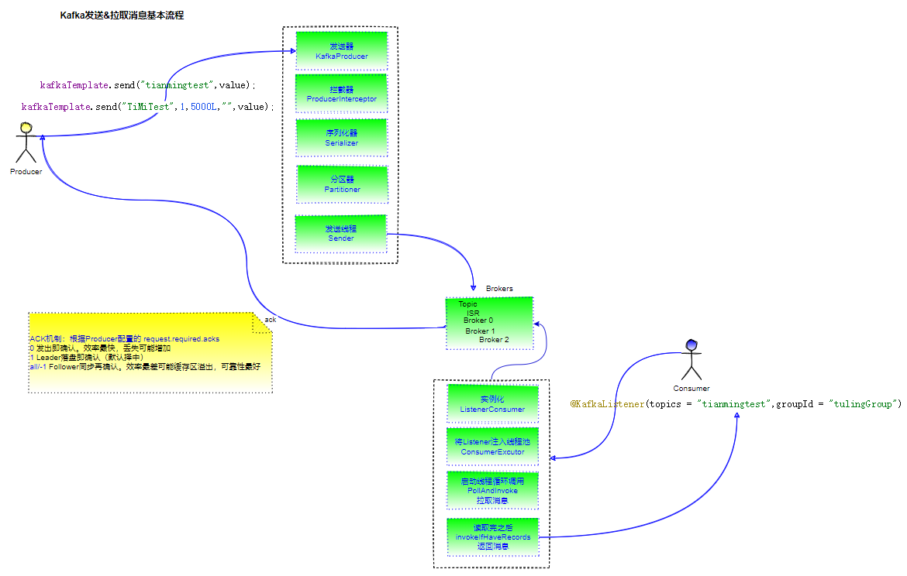


深入浅出之前 先思考下 

<font style="color:rgb(255, 0, 1);">物流快递 如何发送？： </font>

<font style="color:rgb(0, 0, 0);"> 1.先预处理快递件，（拦截器）</font>

<font style="color:rgb(0, 0, 0);">2.判断车队是否正常，（Producer的初始化）</font>

<font style="color:rgb(0, 0, 0);">3.各地区网点派发，（分区器）</font>

<font style="color:rgb(0, 0, 0);">4.快递封装打包 （key value 序列化）</font>

<font style="color:rgb(0, 0, 0);">5.称重 （序列化大小）</font>

<font style="color:rgb(0, 0, 0);">6.分拣员按地址分拣（RecordAccumulator 把消息加入 Batch中）</font>

<font style="color:rgb(0, 0, 0);">7.集装箱装机 第一次 和 下一个集装箱满时再来一个 （tryAppend 判断是否为空 ）</font>

#### 源码解读：
如果直接从初始化的 KafkaProducer 进入 send 即可推送消息 除了网络通信， 没啥可看

所以我们<font style="color:rgb(243, 50, 50);">回顾springboot 自动装配 </font>

有一个 spring-boot-autoconfigure 的包 里面的<font style="color:rgb(243, 50, 50);">META-INF</font>里的 spring.factories 引入很多的组件。

当有一个<font style="color:rgb(243, 50, 50);">KafkaAutoConfiguration条件装配</font> 有<font style="color:rgb(243, 50, 50);">KafkaTemplate</font>类 才会去加入相关依赖

```java
//条件装配 
@ConditionalOnClass({KafkaTemplate.class})
@EnableConfigurationProperties({KafkaProperties.class})
@Import({KafkaAnnotationDrivenConfiguration.class, KafkaStreamsAnnotationDrivenConfiguration.class})
public class KafkaAutoConfiguration {
    //自动装配 注入模板即可
    @Autowired
    private KafkaTemplate<String,Object> kafkaTemplate;
    @RequestMapping(value = "/get", method = GET)
    @ResponseBody
    public String get(@RequestParam("msg") String value) {
        kafkaTemplate.send("tianmingtest","1",value); //发送消息
        return "success";
    }
```

然后 发送到 tianmingtest 这个topic上面 ，当然 我们可以去看下配置发送到哪些机器上面。

我这里配置的三台 集群上面

我们回过头看 KafkaAutoConfiguration 关于配置的properties 

```java
@EnableConfigurationProperties({KafkaProperties.class})
点进去可见  以 spring.kafka开头的  自动会提示
@ConfigurationProperties(
    prefix = "spring.kafka"
)
    进入KafkaProperties的 Producer可见生产者 （或者Consumer消费者的详细配置）
// 比如后面要聊到的一个重点 是否消息发送完毕 的确认机制
private String acks; //分区中成功写入消息的副本数量 0生产端发送立即返回 1副本成功写入无序等待同步其他副本 all需要等leader副本成功并同步其他副本成功写入
private DataSize batchSize;//多少条消息发送一次默认16K
private List<String> bootstrapServers;
private DataSize bufferMemory; // 客户端缓冲区大小默认32M，满了也会触发消息发送
private String clientId;
private String compressionType;//是否对消息进行压缩默认none ，压缩提升吞吐量但会牺牲CPU 有gzip ,snappy lz4 zstd 比例递增
private Class<?> keySerializer = StringSerializer.class;
private Class<?> valueSerializer = StringSerializer.class;
private Integer retries;// 生产端消息发送失败时的重试次数 默认0
private String transactionIdPrefix;
private final Map<String, String> properties = new HashMap();

```

<font style="color:rgb(243, 50, 50);background-color:rgb(255, 242, 204);">接下来send 发送的方法：</font>

kafkaTemplate.send("tianmingtest",value);

```java

return this.doSend(producerRecord);

  rotected ListenableFuture<SendResult<K, V>> doSend(ProducerRecord<K, V> producerRecord) {
    //先判断是否事务性的 默认false
     if (this.transactional) {
        Assert.state(this.inTransaction(), "No transaction is in process; possible solutions: run the template operation within the scope of a template.executeInTransaction() operation, start a transaction with @Transactional before invoking the template method, run in a transaction started by a listener container when consuming a record");
    }
    //拿到Producer 发送者  进入可见是放到一个 ThreadLocal 里面的如果没有肯定是会去创建 Alt+回退到这里
    Producer<K, V> producer = this.getTheProducer();
   

//拿到Producer生产者
private Producer<K, V> getTheProducer() {
    if (this.transactional) {
        Producer<K, V> producer = (Producer)this.producers.get();
        if (producer != null) {
            return producer;
        } else {
            KafkaResourceHolder<K, V> holder = ProducerFactoryUtils.getTransactionalResourceHolder(this.producerFactory, this.transactionIdPrefix, this.closeTimeout);
            return holder.getProducer();
        }
    } else {
        //创建Producer 的方法
        return this.producerFactory.createProducer(this.transactionIdPrefix);
    }
}

//定位到 createProducer的实现 ，可以看到这是一个工厂 DefaultKafkaProducerFactory
public Producer<K, V> createProducer(@Nullable String txIdPrefixArg) {
    else {
        //这个时候它肯定为空
        if (this.producer == null) {
            synchronized(this) {
                if (this.producer == null) {
                    //进入此CloseSafeProducer 可见他会有一个 delegate /ˈdelɪɡət/ 的委派 那么这个委派是去干嘛呢 这里可见是 创建一个KafkaProducer
                    //有了这个kafkaProducer之后我们回到前面的 发送方法
                    this.producer = new DefaultKafkaProducerFactory.CloseSafeProducer(this.createKafkaProducer());
                }
            }
        }
```

Producer的send方法可见有三个实现 <font style="color:rgb(92, 92, 92);"> (首先是CloseSafeProducer 是 DefaultKafkaProducerFactory的)</font>

而这个工厂刚才看过是通过 委派 创建了KafkaProducer 来发送的 

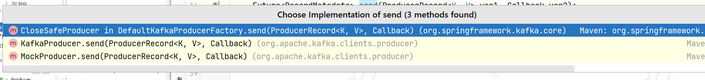

可见第一个 里面实际上用的也是delegate 来发送的 return this.delegate.send(record, callback);

所以我们 重点关注刚才 的KafkaProducer 的<font style="color:rgb(243, 50, 50);">send方法 </font>。 这里的代码跟我们的mybatis的二级缓存 相似

```java
public Future<RecordMetadata> send(ProducerRecord<K, V> record, Callback callback) {
    //send前先经过拦截器定制化消息的拦截链(
//1.0 引入 发送前的定制化需求。   比如分类统计  修改消息 异常监测 数据加密 字段过滤等 可多个拦截链
//可实现ProducerInterceptor 接口 重写onSend方法定制化消息)
    ProducerRecord<K, V> interceptedRecord = this.interceptors.onSend(record);
    //接下来进入 真正的发送方法
    return this.doSend(interceptedRecord, callback);
}


private Future<RecordMetadata> doSend(ProducerRecord<K, V> record, Callback callback) {
    TopicPartition tp = null;
    try {
        this.throwIfProducerClosed();
        //1.首先确保该主题topic对应的元数据metadata可用
        KafkaProducer.ClusterAndWaitTime clusterAndWaitTime= this.waitOnMetadata(record.topic(), record.partition(), this.maxBlockTimeMs);
        //2.计算剩余等待时间 
        long remainingWaitMs = Math.max(0L, this.maxBlockTimeMs - clusterAndWaitTime.waitedOnMetadataMs);
        Cluster cluster = clusterAndWaitTime.cluster;
        //3.得到序列化 key:serializedKey  。根据record中topic ，key 利用 valueSerializer得到
        byte[] serializedKey=this.keySerializer.serialize(record.topic(), record.headers(), record.key());
        //4.得到序列化 value:serializedValue   。    根据record中topic ，value 利用 valueSerializer得到
        byte[] serializedValue = this.valueSerializer.serialize(record.topic(), record.headers(), record.value());
        //5.调用partition方法 获得分区号 这个分区可传入也可auto
        int partition = this.partition(record, serializedKey, serializedValue, cluster);
        //6.根据record中的topic和partition构造TopicPartition实例tp
        TopicPartition  tp = new TopicPartition(record.topic(), partition);
        this.setReadOnly(record.headers());
        Header[] headers = record.headers().toArray();
        //7.计算序列化后的 key value及offset size所占大小
        int serializedSize = AbstractRecords.estimateSizeInBytesUpperBound(this.apiVersions.maxUsableProduceMagic(), this.compressionType, serializedKey, serializedValue, headers);
        //8.确保记录大小是否有效
        this.ensureValidRecordSize(serializedSize);
        long timestamp = record.timestamp() == null ? this.time.milliseconds() : record.timestamp();
        this.log.trace("Sending record {} with callback {} to topic {} partition {}", new Object[]{record, callback, record.topic(), partition});
        Callback interceptCallback = new KafkaProducer.InterceptorCallback(callback, this.interceptors, tp);
        if (this.transactionManager != null && this.transactionManager.isTransactional()) {
            this.transactionManager.maybeAddPartitionToTransaction(tp);
        }
        //9.调用append方法添加记录，获得记录添加结果
        RecordAppendResult result = this.accumulator.append(tp, timestamp, serializedKey, serializedValue, headers, interceptCallback, remainingWaitMs);
        //10.根据结果状态判断是否需要 wakeup
        if (result.batchIsFull || result.newBatchCreated) {
            this.log.trace("Waking up the sender since topic {} partition {} is either full or getting a new batch", record.topic(), partition);
            this.sender.wakeup();
        }
        //11.返回
        return result.future;
    } catch 

```

归纳总结关键 步骤 ：

确保可用，序列化key value 放到哪个分区

<font style="color:rgb(243, 50, 50);">这里有个面试题 怎么找到topic里面的分区的 呢？</font>

对应源码

```java
private int partition(ProducerRecord<K, V> record, byte[] serializedKey, byte[] serializedValue, Cluster cluster) {
    Integer partition = record.partition();
    //如果没指定 进入.partion 可见三个实现
    return partition != null ? partition : this.partitioner.partition(record.topic(), record.key(), serializedKey, record.value(), serializedValue, cluster);
}
 //默认DefaultPartitioner

```

1.如果指定了partition分区，就它

2.如果没有指定 三个实现类 实现Partitioner接口，<font style="color:rgb(243, 50, 50);">有一个是我自己写的</font>

<font style="color:rgb(243, 50, 50);">实际上我们自己也可以写这个实现接口 重写configure 方法来实现自己的分区逻辑(自定义分区器)</font>

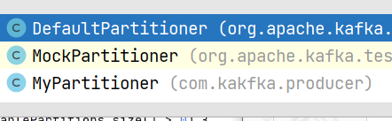

```java
/**
 * 自定义kafka分区主要解决用户分区数据倾斜问题 提高并发效率（假设 3 分区）
 * @param topic 消息队列名
 * @param key 用户传入key
 * @param keyBytes key字节数组
 * @param value 用户传入value
 * @param valueBytes value字节数据
 * @param cluster 当前kafka节点数
 * @return 如果3个节点数 返回 0 1 2 如果5个 返回 0 1 2 3 4 5
 当同一个key的消息会被分配到同一个partition中。消息在同一个partition处理的顺序是FIFO，这就保证了消息的顺序性
 */
public int partition(String topic, Object key, byte[] keyBytes, Object value, byte[] valueBytes, Cluster cluster) {
    // 得到 topic 的 partitions 信息
    List<PartitionInfo> partitions = cluster.partitionsForTopic(topic);
    //获取分区总个数
    int numPartitions = partitions.size();
    //如果指定的key数组不为空
    if (keyBytes == null) {
        int nextValue = this.nextValue(topic);
        List<PartitionInfo> availablePartitions = cluster.availablePartitionsForTopic(topic);
        //可用分区不为空
        if (availablePartitions.size() > 0) {
            //将消息分配给下一个分区 通过murmur /ˈmɜːrmər/ 的hash算法计算分区分配
            int part = Utils.toPositive(nextValue) % availablePartitions.size();
            return ((PartitionInfo)availablePartitions.get(part)).partition();
            //可用分区为空
        } else {
            //如果指定了key ，对key做hash 分配到指定的分区
            return Utils.toPositive(nextValue) % numPartitions;
        }
    } else {
        //设置了key 则直接给key取模计算分区
        return Utils.toPositive(Utils.murmur2(keyBytes)) % numPartitions;
    }

} 
```

然后在<font style="color:rgb(243, 50, 50);">properties配置 partitioner.class 即可</font>

注意：<font style="color:rgb(243, 50, 50);">自定义分区应用于分布式项目 需要将分区类打包放到lib包 </font><font style="color:rgb(243, 50, 50);">Conusumer通过partition.assignment.strategy=指定</font>

我们回到默认的 DefaultPartitioner.partition方法 看看它是如何发送的。

回顾下这几个参数

```java
@param topic 消息队列名
@param key 用户传入key
@param keyBytes key字节数组
@param value 用户传入value
@param valueBytes value字节数据
@param cluster 当前kafka节点数
public int partition(String topic, Object key, byte[] keyBytes, Object value, byte[] valueBytes, Cluster cluster) {
    //获取主题下面的分区 
    List<PartitionInfo> partitions = cluster.partitionsForTopic(topic);
    int numPartitions = partitions.size();
    //没有指定key的情况
    if (keyBytes == null) {
        int nextValue = this.nextValue(topic);
        //获取可用分区
        List<PartitionInfo> availablePartitions = cluster.availablePartitionsForTopic(topic);
        //如果分区够多，会轮循发送到不同分区
         if (availablePartitions.size() > 0) {
            //用nextvalue（下一条+1）
            int part = Utils.toPositive(nextValue) % availablePartitions.size();
            return ((PartitionInfo)availablePartitions.get(part)).partition();
        } else {
            return Utils.toPositive(nextValue) % numPartitions;
        }
        //key不为空
    } else {
        //根据key取模  
        return Utils.toPositive(Utils.murmur2(keyBytes)) % numPartitions;
    }
}
```

<font style="color:rgb(243, 50, 50);">因为连续问就来了：如果设置了key 会怎么去发送？</font>

所以我们第三步得记下：如果key为空会根据给的key取模也就是指定到某个分区 ，不为空的话会拿到可用分区去轮循到不同的分区

<font style="color:rgb(243, 50, 50);">那么消息究竟归谁去发送的呢？</font>

KafkaProducer构造函数 可见

```java
KafkaProducer(Map<String, Object> configs, Serializer<K> keySerializer, Serializer<V> valueSerializer, ProducerMetadata metadata, KafkaClient kafkaClient, ProducerInterceptors interceptors, Time time) {
    ProducerConfig config = new ProducerConfig(ProducerConfig.addSerializerToConfig(configs, keySerializer, valueSerializer));
    //可见前面判断参数  最后catch异常中间 开启 Sender线程 发送消息
    this.errors = this.metrics.sensor("errors");
     // 关键点在这个  Sender线程
        this.sender = this.newSender(logContext, kafkaClient, this.metadata);
        String ioThreadName = "kafka-producer-network-thread | " + clientId;
        this.ioThread = new KafkaThread(ioThreadName, this.sender, true);
        this.ioThread.start();
        config.logUnused();
        AppInfoParser.registerAppInfo("kafka.producer", clientId, this.metrics, time.milliseconds());
        this.log.debug("Kafka producer started");
        
        
       //再往里面就是 Sender线程  的run 方法 调用的 runOnce方法  最后
       //将需要发送的消息发送给client的待发数据中  （进入可见 判断哪些topic partition 可发 批次）
        long pollTimeout = this.sendProducerData(currentTimeMs);
        //真正NIO发送 Poll 网络模型发送数据
        this.client.poll(pollTimeout, currentTimeMs);
        
```

最终 交由 NetworkClient 的 poll方法发送 此处就是网络 IO模型了 。 Selector 。。。。这里就不做深入了。（有需求，可参看网络模型）

 基本流程里面到这里就基本结束了

kafka消息拦截链 应用场景。

分类统计 修改消息 异常监测 数据加密 字段过滤等 可多个拦截链

<font style="color:rgb(243, 50, 50);">真正发送数据的方法  ？</font>如何自定义选择分区？

```java
9.回到KafkaProducer.doSend的 append方法
        RecordAppendResult result = this.accumulator.append(tp, timestamp, serializedKey, serializedValue, headers, interceptCallback, remainingWaitMs);
        
// 1进入RecordAccumulatorde append方法
 public RecordAccumulator.RecordAppendResult append(TopicPartition tp, long timestamp, byte[] key, byte[] value, Header[] headers, Callback callback, long maxTimeToBlock) throws InterruptedException {
    this.appendsInProgress.incrementAndGet();
    ByteBuffer buffer = null;
    if (headers == null) {
        headers = Record.EMPTY_HEADERS;
    }

    RecordAccumulator.RecordAppendResult var19;
    try {
        //2 根据主题与分区号获取相对应的双端队列
        Deque<ProducerBatch> dq = this.getOrCreateDeque(tp);
        // 锁定上一步返回的ArrayDeque
        synchronized(dq) {
            if (this.closed) {
                throw new KafkaException("Producer closed while send in progress");
            }
            //3 尝试拼接消息 并返回RecordAppendResult
            RecordAccumulator.RecordAppendResult appendResult = this.tryAppend(timestamp, key, value, headers, callback, dq);
            if (appendResult != null) {
                RecordAccumulator.RecordAppendResult var14 = appendResult;
                return var14;
            }
        }

     。。。。
}   
    
```

最终的 tryAppend 方法很多判断拼接

```java

private RecordAccumulator.RecordAppendResult tryAppend(long timestamp, byte[] key, byte[] value, Header[] headers, Callback callback, Deque<ProducerBatch> deque) {
    //ProducerBatch.peekLast 从ArrayDeque双端队列中取最后一个 ProducerBatch
    ProducerBatch last = (ProducerBatch)deque.peekLast();
    //是否为空
    if (last != null) {
        //尝试拼接写入当前批次
        FutureRecordMetadata future = last.tryAppend(timestamp, key, value, headers, callback, this.time.milliseconds());
        // 写入结果是否为空
         if (future != null) {
            return new RecordAccumulator.RecordAppendResult(future, deque.size() > 1 || last.isFull(), false);
        }
        //关闭
        last.closeForRecordAppends();
    }
    return null;
}

```

同步代码块中尝试去做一次追加操作tryAppend(),如果成功就直接返回追加的结果对象。tryAppend方法中逻辑是：

a）如果dq中有ProducerBatch则往新一个batch中追加

    a.1）追加不成功，说明最新的batch空间不足，返回null。需要外层逻辑创建新的batch

    a.2）追加成功，返回RecordAppendResult

b）dq中无producerBatch，返回null，代表没有能追加成功。

第一个到达此方法的线程肯定是返回了null，因为还没有消息累积进来，也不存在ProducerBatch对象。

如果tryAppend返回null，说明没能直接在现有的batch上追加成功（也可能还没有batch），此时需要初始化新的ProducerBatch


#### 总结一下：
1、RecordAccumulator使用ProducerBatch缓存消息。每个主题分区拥有一个ProducerBatch的队列。

2、当ProducerBatch队列的队尾batch不能再容纳新消息时，对其进行封箱操作，同时新建ProducerBatch放入队尾来存放新消息。

3、ProducerBatch对消息追加的操作都是通过MemoryRecordsBuilder进行的。消息最终被追加到MemoryRecordsBuilder中的DataOutputStream appendStream中

最后再给你们**上个图**吧。（图太大，[看更多](https://www.yuque.com/tianming-aroh0/sagnbd)？）

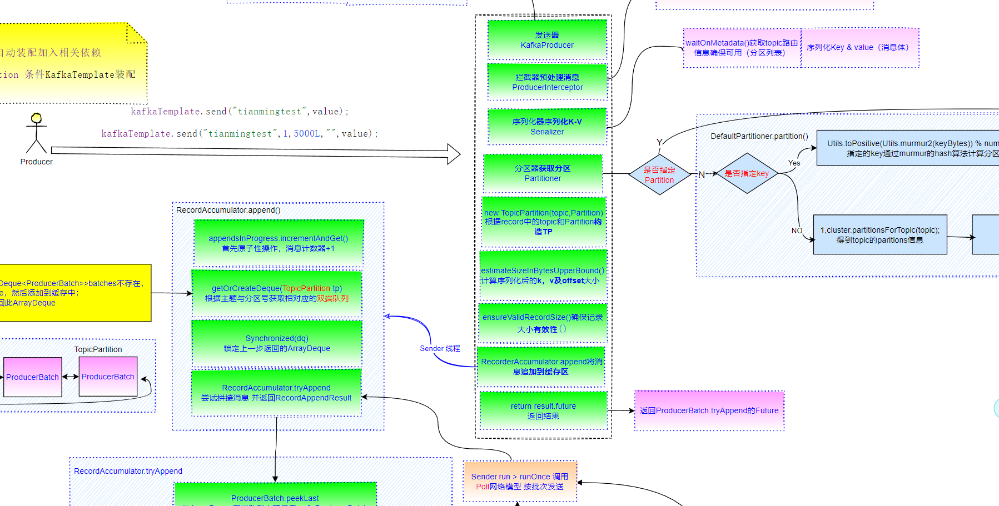


既然已经深入源码解读了 发送消息流程，当然少不了对应的消费流程了。

### 消费者消费消息流程
同样的我们也先深入浅出滴思考下 

<font style="color:rgb(255, 0, 1);">物流快递 如何收件？： </font>

1.监听物流中心 （处理登记处ListenerContainer和实例化Listener）

2.分发各个快递员 （将ListenerConsumer添加到Executor线程池）

3.开始按批次取件 （启动线程run方法pollAndInvoke拉取消息）

4.送货上门 （返回InvokeIfHaveRecords(recods)）

####  源码解读
如果直接从初始化的 KafkaConsumer 进入 poll 即可拉取消息 除了网络通信， 没啥可看

所以 首先我们应该已经知道消费者 comsumer 会在一个 group 里面，然后消费一个topic

怎么指定的呢 <font style="color:rgb(243, 50, 50);">@KafkaListener</font>(topics = "tianmingtest",groupId = "testgroup")

```java
/**
 * 消费者
 */
@Component
public class ConsumerListener {
    //指定订阅的 topic 以及归属的group
    @KafkaListener(topics = "tianmingtest",groupId = "testgroup")
    public void onMessage(String msg){
        System.out.println("----收到消息：" + msg + "----");
    }
}
```

<font style="color:rgb(243, 50, 50);">那我们一个注解 如何 起效果的呢 ？ 入口类从这里开始</font>

<font style="color:rgb(243, 50, 50);">KafkaListenerAnnotationBeanPostProcessor</font>

 实现了 <font style="color:rgb(243, 50, 50);">BeanPostProcessor</font> 接口（讲Spring的时候还有印象没 ？ Bean生命周期 初始化Bean前后的回调的两个方法），

主要开始流程在 postProcessAfterInitialization <font style="color:rgb(243, 50, 50);background-color:rgb(244, 244, 244);">后置处理器中：对象实例化之后调用</font>

<font style="color:rgb(243, 50, 50);background-color:rgb(244, 244, 244);"> （初始化回调之前的方法before先不用管）</font>

```java
public Object postProcessAfterInitialization(Object bean, String beanName) throws BeansException {
        if (!this.nonAnnotatedClasses.contains(bean.getClass())) {
        Class targetClass = AopUtils.getTargetClass(bean);
        //是否有类添加KafkaListener注解
        Collection  classLevelListeners =  this.findListenerAnnotations(targetClass);
        boolean hasClassLevelListeners = classLevelListeners.size() > 0;
        List<Method> multiMethods = new ArrayList();
        //是否有方法添加 KafkaListener 注解，并与方法建立隐射关系
        Map<Method, Set<KafkaListener>> annotatedMethods = MethodIntrospector.selectMethods(targetClass, (methodx) -> {
            Set<KafkaListener> listenerMethods = this.findListenerAnnotations(methodx);
            return !listenerMethods.isEmpty() ? listenerMethods : null;
        });
        //如果KafkaListener在类级别上
        if (hasClassLevelListeners) {
            //去找 KafkaHandler的方法注解 （如果类上被 KafkaListener修饰，那么类方法必须要使用 KafkaHandle配合实现）
            Set<Method> methodsWithHandler = MethodIntrospector.selectMethods(targetClass, (methodx) -> {
                return AnnotationUtils.findAnnotation(methodx, KafkaHandler.class) != null;
            });
            multiMethods.addAll(methodsWithHandler);
        
        } else {
            Iterator var13 = annotatedMethods.entrySet().iterator();
            
            // 遍历annotatedMethods  根据隐射关系执行 processKaListener
            while(true) {
                if (!var13.hasNext()) {
                    this.logger.debug(() -> {
                        return annotatedMethods.size() + " @KafkaListener methods processed on bean '" + beanName + "': " + annotatedMethods;
                    });
                    break;
                }
                 Entry<Method, Set<KafkaListener>> entry = (Entry)var13.next();
                    Method method = (Method)entry.getKey();
                    Iterator var11 = ((Set)entry.getValue()).iterator();
            
                    while(var11.hasNext()) {
                        KafkaListener listener = (KafkaListener)var11.next();
                        // 注解在方法上的逻辑 
                        this.processKafkaListener(listener, method, bean, beanName);
                    }
                }
            }
                // 处理类级别的 ClassLevelListeners 和 multiMethods隐射关系
                  if (hasClassLevelListeners) {
                    this.processMultiMethodListeners(classLevelListeners, multiMethods, bean, beanName);
                }
            }
            
            return bean;
    
```

进入 <font style="color:rgb(243, 50, 50);">processKafListener</font> 方法 可见 设置 endpoint 信息 和 this.<font style="color:rgb(243, 50, 50);">processListener</font>方法 进入可见 <font style="color:rgb(243, 50, 50);">registerEndpoint</font> 方法 。 

进入 registerEndpoint 方法可见 startImmediately <font style="color:rgb(243, 50, 50);">/ɪˈmiːdiətli/ </font>默认false 所以 将信息add 到 List< KafakaListenerEndpointDescriptor><font style="color:rgb(243, 50, 50);">endpointDescriptors List集合中</font>

<font style="color:rgb(243, 50, 50);">那真正创建 这些Listner的逻辑 在哪里呢？</font>

<font style="color:rgb(79, 79, 79);background-color:rgb(244, 244, 244);">真正创建MessageListenerContainer的地方是在</font><font style="color:rgb(243, 50, 50);background-color:rgb(244, 244, 244);">KafkaListenerEndpointRegistry</font><font style="color:rgb(79, 79, 79);background-color:rgb(244, 244, 244);">中，因为 最初的 </font>

<font style="color:rgb(243, 50, 50);">KafkaListenerAnnotationBeanPostProcessor</font>类的 单列实例化 之后 调用的方法<font style="color:rgb(243, 50, 50);">afterSingletonsInstantiated</font> 最后

 this.registrar.<font style="color:rgb(243, 50, 50);">afterPropertiesSet</font>(); 里面 调用

的 <font style="color:rgb(243, 50, 50);">registerAllEndpoints</font>()

最终调用到了<font style="color:rgb(243, 50, 50);">KafkaListenerEndpointRegistrar</font>的 registerListenerContainer

此方法

```java
public void registerListenerContainer(KafkaListenerEndpoint endpoint, KafkaListenerContainerFactory<?> factory, boolean startImmediately) {
    Assert.notNull(endpoint, "Endpoint must not be null");
    Assert.notNull(factory, "Factory must not be null");
    String id = endpoint.getId();
    Assert.hasText(id, "Endpoint id must not be empty");
    synchronized(this.listenerContainers) {
        Assert.state(!this.listenerContainers.containsKey(id), "Another endpoint is already registered with id '" + id + "'");
        //创建 MessageListenerContainer 实例
        MessageListenerContainer container = this.createListenerContainer(endpoint, factory);
        this.listenerContainers.put(id, container);
        ConfigurableApplicationContext appContext = this.applicationContext;
        String groupName = endpoint.getGroup();
        if (StringUtils.hasText(groupName) && appContext != null) {
            Object containerGroup;
            ContainerGroup group;
            if (appContext.containsBean(groupName)) {
                containerGroup = (List)appContext.getBean(groupName, List.class);
                group = (ContainerGroup)appContext.getBean(groupName + ".group", ContainerGroup.class);
            } else {
                containerGroup = new ArrayList();
                appContext.getBeanFactory().registerSingleton(groupName, containerGroup);
                group = new ContainerGroup(groupName);
                appContext.getBeanFactory().registerSingleton(groupName + ".group", group);
            }
            // 加入分组
            ((List)containerGroup).add(container);
            group.addContainers(new MessageListenerContainer[]{container});
        }
        // 默认false  所以启动时 暂时不会执行start方法，会先交给 SmartLifecycle 接口处理
        // 这里KafkaListenerEndpointRegistry类实现了此接口，会在项目所有bean加载和初始化完毕之后执行start方法
        if (startImmediately) {
            this.startIfNecessary(container);
        }

    }
}
```

进入 this.<font style="color:rgb(243, 50, 50);">startIfNecessay 实际用的参数的start方法</font> 再进入 方法参数 <font style="color:rgb(243, 50, 50);">MessageListenerContainer</font> 接口的实现类 <font style="color:rgb(243, 50, 50);">AbstractMessageListenerContainer</font> 的 <font style="color:rgb(243, 50, 50);">start</font> 方法 

发现是一个<font style="color:rgb(243, 50, 50);">abstract的 doStart 方法</font> ，说明实现是交给它的子类去实现

我们来到 它的子类 <font style="color:rgb(243, 50, 50);">KafkaMessageListenerContainer</font> 的 doStart 方法

```java
protected void doStart() {
    if (!this.isRunning()) {
        if (this.clientIdSuffix == null) {
            this.checkTopics();
        }

        ContainerProperties containerProperties = this.getContainerProperties();
        this.checkAckMode(containerProperties);
        Object messageListener = containerProperties.getMessageListener();
        AsyncListenableTaskExecutor consumerExecutor = containerProperties.getConsumerTaskExecutor();
        if (consumerExecutor == null) {
            consumerExecutor = new SimpleAsyncTaskExecutor((this.getBeanName() == null ? "" : this.getBeanName()) + "-C-");
            containerProperties.setConsumerTaskExecutor((AsyncListenableTaskExecutor)consumerExecutor);
        }

        GenericMessageListener<?> listener = (GenericMessageListener)messageListener;
        ListenerType listenerType = this.determineListenerType(listener);
        // 实例化一个listenerConsumer.
        // 进入这个属性 listenerConsumer可见实现了 SchedulingAwareRunnable 说明是个线程 肯定 runabler接口 run方法 这个我们一会进去瞧瞧
        this.listenerConsumer = new KafkaMessageListenerContainer.ListenerConsumer(listener, listenerType);
        this.setRunning(true);
        this.startLatch = new CountDownLatch(1);
        //将 listenerConsumer 添加到线程池 Executor
        this.listenerConsumerFuture = ((AsyncListenableTaskExecutor)consumerExecutor).submitListenable(this.listenerConsumer);
        try {
            if (!this.startLatch.await(containerProperties.getConsumerStartTimeout().toMillis(), TimeUnit.MILLISECONDS)) {
                this.logger.error("Consumer thread failed to start - does the configured task executor have enough threads to support all containers and concurrency?");
                 this.publishConsumerFailedToStart();
            }
        } catch (InterruptedException var7) {
            Thread.currentThread().interrupt();
        }

    }
}

```

 接下来 应该知道要到哪里了吧 。 肯定是 run方法啊 。 来到 <font style="color:rgb(243, 50, 50);">listenerConsumer</font> 的run方法

这个里面我们能 最终看到 **<font style="color:rgb(243, 50, 50);">消费端获取消息采用的 poll方式 ，一次性拿多条数据</font>**

```java
public void run() {
    ListenerUtils.setLogOnlyMetadata(this.containerProperties.isOnlyLogRecordMetadata());
    KafkaMessageListenerContainer.this.publishConsumerStartingEvent();
    this.consumerThread = Thread.currentThread();
    this.setupSeeks();
    KafkaUtils.setConsumerGroupId(this.consumerGroupId);
    this.count = 0;
    this.last = System.currentTimeMillis();
    this.initAssignedPartitions();
    KafkaMessageListenerContainer.this.publishConsumerStartedEvent();
    Object exitThrowable = null;
    //循环调用
    while(KafkaMessageListenerContainer.this.isRunning()) {
        try {
            // poll 拉取数据  ， 消费端获取消息采用的 poll方式 ，一次性拿多条数据 
            // 进入 可见封装成 ConsumerRecords 消息对象
            this.pollAndInvoke();
        } catch (NoOffsetForPartitionException var12) {
     ....
            this.logger.error(var16, "Stopping container due to an Error");
            this.wrapUp(var16);
            throw var16;
        } catch (Exception var17) {
            this.handleConsumerException(var17);
        } finally {
            this.clearThreadState();
        }
    }

    this.wrapUp((Throwable)exitThrowable);
}
```

进入 <font style="color:rgb(243, 50, 50);">pollAdnInvoke</font> 方法 最后 <font style="color:rgb(243, 50, 50);">invokeIfHaveRecords</font> > <font style="color:rgb(243, 50, 50);">invokeListener</font>(records) > 判断是否批量消费 invokeBatchListener / invokeRecordListener 

可以配置参数：<font style="color:rgb(255, 0, 1);">concurrency</font> 控制listener 的线程数量 ，并发开关可以通过batchListener = true 开启 配合**<font style="color:rgb(255, 0, 1);">max_poll_records_config</font>****=50** 多少条一次poll返回 也可以配置间隔时间<font style="color:rgb(255, 0, 1);">tnterval.ms</font> 间隔多久poll一次 最多多少条

```java
# 如果有 两个方法标记 @KafkaListener 会启动 2 * 3 个Consuumer线程 ，6个Listener线程
#spring.kafka.listener.concurrency=3
```

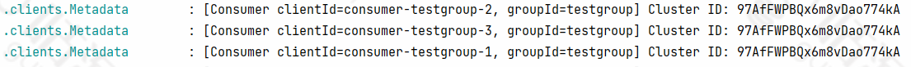

默认 doInvokeWithRecords 方法

 是否开启事务模板 invokeRecordListenerInTx 和 doInvokeWithRecords

 默认 > doInvokeRecordListener > invokeOnMessage > doInvokeOnMessage 

四种type 类型的listener . 提供不同的接口处理

 1。 Simple 不考虑提交偏移量和consumer对象 ； 

2。Acknowledgine 需要手动提交时 而不是自动提交或者 spring-kafka自己实现提交方式时，需要如下接口中acknowledment 的 acknowlegge()方法提交偏移量 

3.consumer_aware 类似SpringIOC的 ApplicationContextAware功能，如果消费消息时，需要用consumer对象，则使用这个类型

4.<font style="color:rgb(51, 51, 51);">ACKNOWLEDGING_CONSUMER_AWARE，同时支持ACKNOWLEDGING和CONSUMER_AWARE两种类型</font>

<font style="color:rgb(51, 51, 51);">这些类型由 接口GenericMessageListener接口具体哪个实现类来决定 </font>

最终   > onMessage 返回消息

#### 总结一下：
1.入口<font style="color:rgb(243, 50, 50);">KafkaListenerAnnotationBeanPostProcessor</font>，实现了 BeanPostProcessor等接口，所以Bean加载完后会进入<font style="color:rgb(243, 50, 50);">postProcessAfterInitialization</font>方法 

2.找到有@KafkaListener注解的类或者方法，并且将注解的信息封装成MethodKafkaListenerEndpoint 进入processListener中registerEndpoint方法，将数据封装到 <font style="color:rgb(243, 50, 50);">KafkaListenerEndpointDescriptor</font>，并且添加到List

3.KafkaListenerAnnotationBeanPostProcessor 实现了SmartInitializingSingleton，在当所有单例 bean 都初始化完成以后，会调 用<font style="color:rgb(243, 50, 50);">afterSingletonsInstantiated</font>方法 

4.在afterSingletonsInstantiated方法中调用 <font style="color:rgb(243, 50, 50);">registerListenerContainer</font>方法，将消费者信息封装到 listenerContainers中 

5.KafkaListenerEndpointRegistry类实现了SmartLifecycle接口，所以会容器<font style="color:rgb(243, 50, 50);">启动调用start</font>方法 8.进入AbstractMessageListenerContainer的start方法 发现静态方法交给子类实现 

6.进入<font style="color:rgb(243, 50, 50);">KafkaMessageListenerContainer</font>的<font style="color:rgb(243, 50, 50);">doStart</font>方法 

7.<font style="color:rgb(243, 50, 50);">实例化一个listenerConsumer</font>，listenerConsumer实现了<font style="color:rgb(243, 50, 50);">SchedulingAwareRunnable</font>。SchedulingAwareRunnable继承了runnable，并将<font style="color:rgb(243, 50, 50);">listenerConsumer添加至线程池</font> 

8.进入listenerConsumer的run方法，循环调用<font style="color:rgb(243, 50, 50);">this.pollAndInvoke();</font>

9.pollAndInvoke中调用<font style="color:rgb(243, 50, 50);">this.doPoll()；获取信息</font>

最后再给你们**上个图**吧。（图太大，[看关键部分](https://www.yuque.com/tianming-aroh0/sagnbd)先）


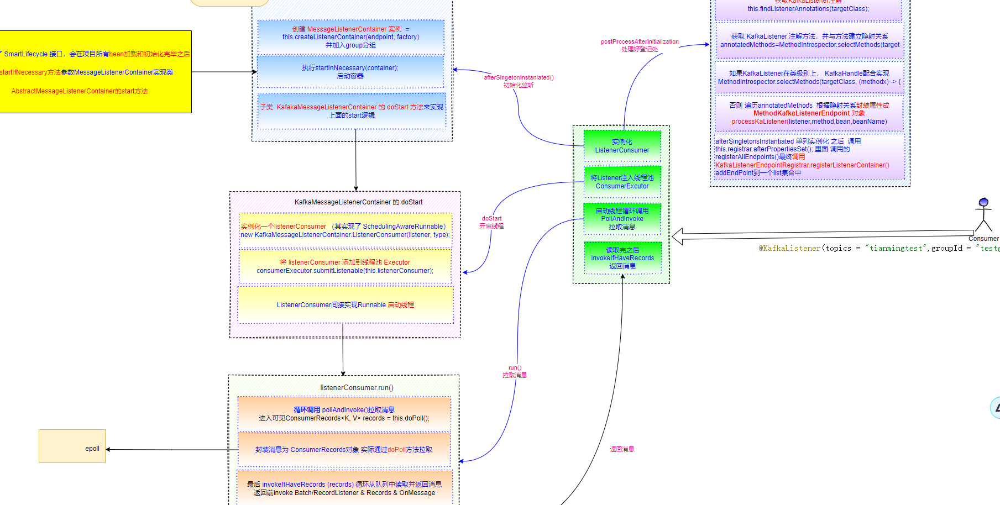

理论上解下来要深入的应该是上图中的epoll了。但实际上具备上述源码已经能吊打面试官了，后续就不解读了。

有这一块诉求和能力的给你**开个门**吧：

<font style="color:rgb(0, 0, 0);background-color:rgb(248, 249, 250);">Sender.run() > 注册到一个</font><font style="color:rgb(255, 0, 1);background-color:rgb(248, 249, 250);">Selector</font><font style="color:rgb(0, 0, 0);background-color:rgb(248, 249, 250);"> Selector.send() 注册channel 相当于</font><font style="color:rgb(255, 0, 1);background-color:rgb(248, 249, 250);">MainReactor</font>

<font style="color:rgb(0, 0, 0);background-color:rgb(248, 249, 250);">实际IO操作 channel.finishConnect()</font>

<font style="color:rgb(0, 0, 0);background-color:rgb(248, 249, 250);"> 然后多个处理线程 </font><font style="color:rgb(255, 0, 1);background-color:rgb(248, 249, 250);">KafkaChannel</font><font style="color:rgb(0, 0, 0);background-color:rgb(248, 249, 250);">.setSend()  相当于多个</font><font style="color:rgb(255, 0, 1);background-color:rgb(248, 249, 250);">SubReactor</font><font style="color:rgb(0, 0, 0);background-color:rgb(248, 249, 250);">  </font>

<font style="color:rgb(0, 0, 0);background-color:rgb(248, 249, 250);">实际IO操作 SocketChannel channel = </font><font style="color:rgb(243, 50, 50);background-color:rgb(248, 249, 250);">serverSoceketChannel</font><font style="color:rgb(0, 0, 0);background-color:rgb(248, 249, 250);">.accept();</font>

<font style="color:rgb(0, 0, 0);background-color:rgb(248, 249, 250);">真正处理的 TransportLayer.addInterestOps() 最后 SelectionKey.interestOps(); </font>

<font style="color:rgb(0, 0, 0);background-color:rgb(248, 249, 250);">进入nioInterestOps(key.interestOps() | SelectionKey.OP_Read或Write) 相当于</font><font style="color:rgb(255, 0, 1);background-color:rgb(248, 249, 250);"> Work</font><font style="color:rgb(0, 0, 0);background-color:rgb(248, 249, 250);">线程</font>

<font style="color:rgb(0, 0, 0);background-color:rgb(248, 249, 250);">实际IO操作在</font><font style="color:rgb(255, 0, 1);background-color:rgb(248, 249, 250);">Channel.write / read</font>

<font style="color:rgb(255, 0, 1);background-color:rgb(248, 249, 250);">实际底层 发送的是包装Channel的 NetworkSend</font>

### 谁告诉你解决 Kafka 消息积压增加消费者数就可以了？
<font style="color:rgba(0, 0, 0, 0.82);">在 Kafka 的日常使用和运维过程中，消息积压几乎是每个开发者都可能遇到的问题。网上流行的一条“金句”是：</font>**<font style="color:rgba(0, 0, 0, 0.82);">消息积压了？赶紧加消费者啊！</font>**

<font style="color:rgba(0, 0, 0, 0.82);">可惜，现实往往没那么简单 ——</font><font style="color:rgba(0, 0, 0, 0.82);"> </font>**<font style="color:rgba(0, 0, 0, 0.82);">只靠增加消费者实例，很多情况下并不能解决积压问题，甚至可能浪费资源。</font>**

<font style="color:rgba(0, 0, 0, 0.82);">本文带你理清 Kafka 消费原理，搞明白“增加消费者数”到底有没有用，什么时候有用，什么时候没用，以及真正有效的解决 Kafka 消息积压的方法。</font>

---

#### <font style="color:rgba(0, 0, 0, 0.82);">一、Kafka 消费并发的本质</font>
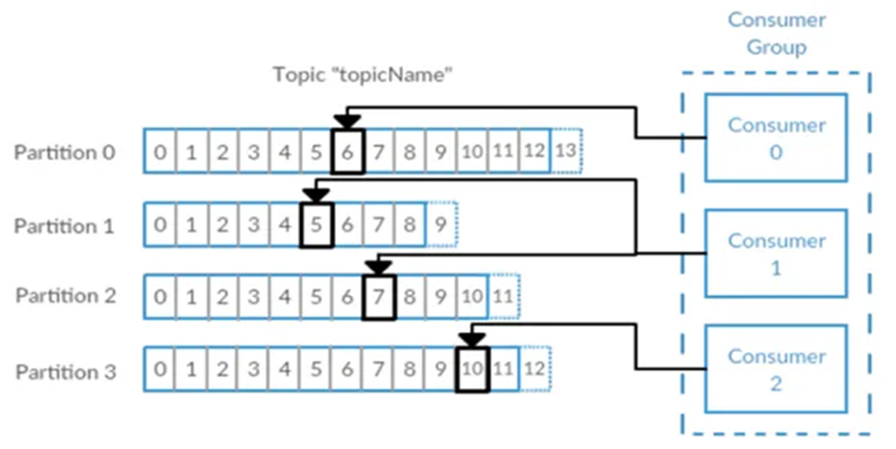

<font style="color:rgba(0, 0, 0, 0.82);">Kafka 的并发消费能力，决定于两个核心指标：</font>

+ **<font style="color:rgba(0, 0, 0, 0.82);">分区数（Partition 数量）</font>**<font style="color:rgba(0, 0, 0, 0.82);">：Kafka 主题下的分区数决定了并行消费的上限。</font>
+ **<font style="color:rgba(0, 0, 0, 0.82);">消费者实例数（Consumer Instance 数量）</font>**<font style="color:rgba(0, 0, 0, 0.82);">：同一个消费组下，真正“在工作”的实例不能超过分区数。</font>

**<font style="color:#DF2A3F;">并发度 = min(分区数, 消费者实例数)</font>**

---

#### <font style="color:rgba(0, 0, 0, 0.82);">二、为什么只加消费者没用？</font>
<font style="color:rgba(0, 0, 0, 0.82);">举个例子：</font>

+ <font style="color:rgba(0, 0, 0, 0.82);">你的 topic 有 5 个分区</font>
+ <font style="color:rgba(0, 0, 0, 0.82);">消费组里原本有 3 个实例，发现消费不过来了</font>
+ <font style="color:rgba(0, 0, 0, 0.82);">你一下子加到 10 个消费者实例</font>

<font style="color:rgba(0, 0, 0, 0.82);">你以为消费就能提速了，但事实上只有 5 个消费者在真正消费，其它 5 个处于“闲着，领不到分区”的状态，看着队列干着急……</font>

**<font style="color:rgba(0, 0, 0, 0.82);">原因很简单：每个分区同一时间只能被一个组内消费者消费，分区是并发的上限。</font>**

---

#### <font style="color:rgba(0, 0, 0, 0.82);">三、盲目加实例，代价是什么？</font>
+ **<font style="color:rgba(0, 0, 0, 0.82);">浪费计算资源</font>**<font style="color:rgba(0, 0, 0, 0.82);">：无谓的实例占用机器、内存，增加管理复杂度</font>
+ **<font style="color:rgba(0, 0, 0, 0.82);">业务无改善</font>**<font style="color:rgba(0, 0, 0, 0.82);">：积压依然看着堆在 broker 上，不动如山</font>
+ **<font style="color:rgba(0, 0, 0, 0.82);">还有可能“抖动”</font>**<font style="color:rgba(0, 0, 0, 0.82);">：消费者组频繁重平衡，反而影响稳定性</font>

---

#### <font style="color:rgba(0, 0, 0, 0.82);">四、什么情况下加消费者有效？</font>
+ **<font style="color:rgba(0, 0, 0, 0.82);">你的消费者数远小于分区数</font>**<font style="color:rgba(0, 0, 0, 0.82);">：此时提升实例，可以提升并发</font>
+ **<font style="color:rgba(0, 0, 0, 0.82);">分区数>实例数</font>**<font style="color:rgba(0, 0, 0, 0.82);">：比如有 20 分区，只有 5 个消费者，多加几个效果立竿见影</font>

---

#### <font style="color:rgba(0, 0, 0, 0.82);">五、想解决积压，正确姿势是什么？</font>
1. **<font style="color:rgba(0, 0, 0, 0.82);">诊断瓶颈</font>**
    - <font style="color:rgba(0, 0, 0, 0.82);">是消费者慢？业务处理慢？还是分区数就不够？</font>
2. **<font style="color:rgba(0, 0, 0, 0.82);">优化消费逻辑</font>**
    - <font style="color:rgba(0, 0, 0, 0.82);">去掉慢 SQL、大文件操作、同步调用，能异步别同步，能批量别单条</font>
3. **<font style="color:rgba(0, 0, 0, 0.82);">检查分区数</font>**
    - <font style="color:rgba(0, 0, 0, 0.82);">分区太少限制并发，可以考虑增加分区（注意分区扩容带来的乱序等问题）</font>
4. **<font style="color:rgba(0, 0, 0, 0.82);">合理扩展消费者</font>**
    - <font style="color:rgba(0, 0, 0, 0.82);">在分区数支撑前提下，加消费者才有用</font>
5. **<font style="color:rgba(0, 0, 0, 0.82);">监控和预警</font>**
    - <font style="color:rgba(0, 0, 0, 0.82);">持续关注 Lag 指标，及时发现和响应</font>

---

#### <font style="color:rgba(0, 0, 0, 0.82);">六、总结</font>
<font style="color:rgba(0, 0, 0, 0.82);">Kafka 积压不是简单“加人就能扛”的搬砖活。</font>

**<font style="color:rgba(0, 0, 0, 0.82);">请牢记：</font>**

**<font style="color:#DF2A3F;">“Kafka 消费能力的天花板由分区数决定，盲目的增加消费者并不能突破物理并发的上限。”</font>**

<font style="color:rgba(0, 0, 0, 0.82);">碰到消息积压，别急着加人头，先搞懂原理，再下药，别做无用功！</font>


> 更新: 2025-06-19 09:01:02  
> 原文: <https://www.yuque.com/tulingzhouyu/db22bv/bubwm3kyevkt68m8>