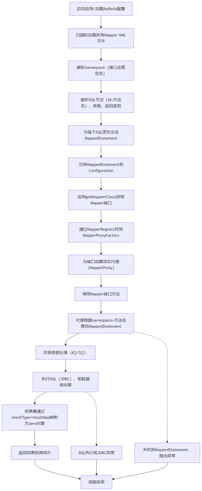

# mybatis 是怎么跟他的 xml 之间形成映射的？

## <font style="color:rgba(6, 8, 31, 0.88);">1. 概述</font>
<font style="color:rgba(6, 8, 31, 0.88);">MyBatis 是一个灵活的持久层框架，核心在于通过 XML 或注解，将 Java 方法与 SQL 语句高效映射。</font>

<font style="color:rgba(6, 8, 31, 0.88);">在实际开发中，</font>**<font style="color:rgba(6, 8, 31, 0.88);">Mapper 接口和 XML 映射文件的关联</font>**<font style="color:rgba(6, 8, 31, 0.88);">是 MyBatis 的基础，也是经常被问及的核心原理。</font>

---

## <font style="color:rgba(6, 8, 31, 0.88);">2. 基本结构与关联方式</font>
### <font style="color:rgba(6, 8, 31, 0.88);">(1) Mapper 接口（Java）</font>
```java
public interface UserMapper {  
    User selectUserById(int id);  
}
```

### <font style="color:rgba(6, 8, 31, 0.88);">(2) XML 映射文件</font>
```xml
<mapper namespace="com.example.mapper.UserMapper">  
  <select id="selectUserById" parameterType="int" resultType="com.example.model.User">  
    SELECT * FROM users WHERE id = #{id}  
  </select>  
</mapper>
```

### <font style="color:rgba(6, 8, 31, 0.88);">(3) 关联方式说明</font>
+ **<font style="color:rgba(6, 8, 31, 0.88);">namespace</font>**<font style="color:rgba(6, 8, 31, 0.88);">：XML 文件的</font><font style="color:rgba(6, 8, 31, 0.88);"> </font>`<font style="color:rgba(6, 8, 31, 0.88);">namespace</font>`<font style="color:rgba(6, 8, 31, 0.88);"> </font><font style="color:rgba(6, 8, 31, 0.88);">属性必须与 Mapper 接口的全限定名一致。</font>
+ **<font style="color:rgba(6, 8, 31, 0.88);">id</font>**<font style="color:rgba(6, 8, 31, 0.88);">：SQL 标签的</font><font style="color:rgba(6, 8, 31, 0.88);"> </font>`<font style="color:rgba(6, 8, 31, 0.88);">id</font>`<font style="color:rgba(6, 8, 31, 0.88);"> </font><font style="color:rgba(6, 8, 31, 0.88);">属性必须与接口方法名一致。</font>

**<font style="color:rgba(6, 8, 31, 0.88);">这样，MyBatis 能自动把接口方法与 XML 中的 SQL 关联起来</font>**<font style="color:rgba(6, 8, 31, 0.88);">。</font>

---

## <font style="color:rgba(6, 8, 31, 0.88);">3. MyBatis 关联底层实现原理</font>
### <font style="color:rgba(6, 8, 31, 0.88);">(1) 动态代理机制</font>
+ <font style="color:rgba(6, 8, 31, 0.88);">MyBatis 为每个 Mapper 接口生成一个代理对象（使用 JDK 动态代理）。</font>
+ <font style="color:rgba(6, 8, 31, 0.88);">你调用 Mapper 方法时，实际是由代理对象接管，并根据方法名和参数查找、执行对应 SQL。</font>

**<font style="color:rgba(6, 8, 31, 0.88);">示例：</font>**

```java
UserMapper userMapper = sqlSession.getMapper(UserMapper.class);  
User user = userMapper.selectUserById(1);
```

### <font style="color:rgba(6, 8, 31, 0.88);">(2) MapperRegistry 和 MapperProxyFactory</font>
+ **<font style="color:rgba(6, 8, 31, 0.88);">MapperRegistry</font>**<font style="color:rgba(6, 8, 31, 0.88);">：负责注册和管理所有 Mapper 接口。</font>
+ **<font style="color:rgba(6, 8, 31, 0.88);">MapperProxyFactory</font>**<font style="color:rgba(6, 8, 31, 0.88);">：为每个接口创建动态代理对象，内部由 MapperProxy 实现方法拦截和执行。</font>

**<font style="color:rgb(77, 77, 77);">关联过程：</font>**

1. <font style="color:rgba(0, 0, 0, 0.75);">MyBatis 通过 </font>`<font style="color:#000000;background-color:rgb(249, 242, 244);">MapperRegistry</font>`<font style="color:rgba(0, 0, 0, 0.75);"> 注册 Mapper 接口。</font>
2. <font style="color:rgba(0, 0, 0, 0.75);">当调用 </font>`<font style="color:#000000;background-color:rgb(249, 242, 244);">getMapper</font>`<font style="color:#000000;"> </font><font style="color:rgba(0, 0, 0, 0.75);">方法时，</font>`<font style="color:#000000;background-color:rgb(249, 242, 244);">MapperProxyFactory</font>`<font style="color:#000000;"> </font><font style="color:rgba(0, 0, 0, 0.75);">生成相应的代理对象。</font>
3. <font style="color:rgba(0, 0, 0, 0.75);">代理对象通过 </font>`<font style="color:#000000;background-color:rgb(249, 242, 244);">MapperProxy</font>`<font style="color:#000000;"> </font><font style="color:rgba(0, 0, 0, 0.75);">调用对应的 SQL 语句。</font>

### <font style="color:rgba(6, 8, 31, 0.88);">(3) XML 解析与绑定</font>
+ <font style="color:rgba(6, 8, 31, 0.88);">MyBatis 启动时，用</font><font style="color:rgba(6, 8, 31, 0.88);"> </font>`<font style="color:rgba(6, 8, 31, 0.88);">XMLMapperBuilder</font>`<font style="color:rgba(6, 8, 31, 0.88);"> </font><font style="color:rgba(6, 8, 31, 0.88);">解析 XML 文件：</font>
    - <font style="color:rgba(6, 8, 31, 0.88);">读取</font><font style="color:rgba(6, 8, 31, 0.88);"> </font>`<font style="color:rgba(6, 8, 31, 0.88);">namespace</font>`<font style="color:rgba(6, 8, 31, 0.88);">，与接口绑定。</font>
    - <font style="color:rgba(6, 8, 31, 0.88);">读取</font><font style="color:rgba(6, 8, 31, 0.88);"> </font>`<font style="color:rgba(6, 8, 31, 0.88);">id</font>`<font style="color:rgba(6, 8, 31, 0.88);">，与方法名一一对应。</font>
    - <font style="color:rgba(6, 8, 31, 0.88);">每个 SQL 和方法的绑定关系，生成</font><font style="color:rgba(6, 8, 31, 0.88);"> </font>`<font style="color:rgba(6, 8, 31, 0.88);">MappedStatement</font>`<font style="color:rgba(6, 8, 31, 0.88);"> </font><font style="color:rgba(6, 8, 31, 0.88);">存入</font><font style="color:rgba(6, 8, 31, 0.88);"> </font>`<font style="color:rgba(6, 8, 31, 0.88);">Configuration</font>`<font style="color:rgba(6, 8, 31, 0.88);"> </font><font style="color:rgba(6, 8, 31, 0.88);">对象。</font>

### <font style="color:rgba(6, 8, 31, 0.88);">(4) 流程图</font>


---

## <font style="color:rgba(6, 8, 31, 0.88);">4. 实例流程（OrderMapper 为例）</font>
+ **<font style="color:rgba(6, 8, 31, 0.88);">接口</font>**<font style="color:rgba(6, 8, 31, 0.88);">：</font>`<font style="color:rgba(6, 8, 31, 0.88);">Order selectOrderById(int id);</font>`
+ **<font style="color:rgba(6, 8, 31, 0.88);">XML</font>**<font style="color:rgba(6, 8, 31, 0.88);">：</font>

```xml
<mapper namespace="com.example.mapper.OrderMapper">  
  <select id="selectOrderById" ...>SELECT * FROM orders WHERE id = #{id}</select>  
</mapper>
```

+ **<font style="color:rgba(6, 8, 31, 0.88);">执行过程</font>**<font style="color:rgba(6, 8, 31, 0.88);">：</font>
    1. <font style="color:rgba(6, 8, 31, 0.88);">启动加载 XML——解析 namespace/id——方法与 SQL 关联</font>
    2. <font style="color:rgba(6, 8, 31, 0.88);">sqlSession.getMapper(OrderMapper.class) 创建代理</font>
    3. <font style="color:rgba(6, 8, 31, 0.88);">调用 selectOrderById -> 查找配置 -> 执行 SQL -> 返回 Order 对象</font>

---

## <font style="color:rgba(6, 8, 31, 0.88);">5. 动态 SQL 与高级映射</font>
+ <font style="color:rgba(6, 8, 31, 0.88);">支持</font><font style="color:rgba(6, 8, 31, 0.88);"> </font>`<font style="color:rgba(6, 8, 31, 0.88);"><if>、<choose>、<foreach></font>`<font style="color:rgba(6, 8, 31, 0.88);"> </font><font style="color:rgba(6, 8, 31, 0.88);">等标签，实现条件拼装动态 SQL。</font>
+ <font style="color:rgba(6, 8, 31, 0.88);">提升灵活性，替换传统硬编码 SQL。</font>

**<font style="color:rgba(6, 8, 31, 0.88);">示例：</font>**

```xml
<select id="selectOrders" resultType="Order">  
  SELECT * FROM orders  
  WHERE 1=1  
  <if test="status != null">AND status = #{status}</if>  
</select>
```

---


> 更新: 2025-04-17 19:02:09  
> 原文: <https://www.yuque.com/tulingzhouyu/db22bv/eyw0xl2ktv4ew1gt>