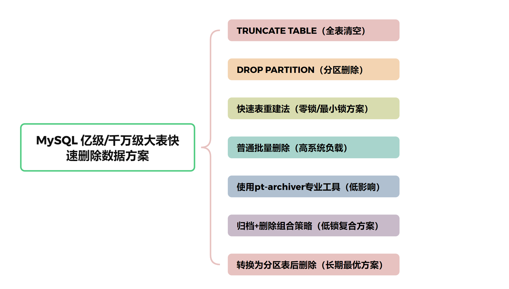

# 7种 MySQL亿级/千万级大表快速删除数据方案：锁影响与性能分析



<font style="color:rgba(0, 0, 0, 0.82);">以下是MySQL大表删除方案，重点分析每种方案的</font>**<font style="color:rgba(0, 0, 0, 0.82);">锁定影响</font>**<font style="color:rgba(0, 0, 0, 0.82);">、</font>**<font style="color:rgba(0, 0, 0, 0.82);">执行时间</font>**<font style="color:rgba(0, 0, 0, 0.82);">和</font>**<font style="color:rgba(0, 0, 0, 0.82);">系统负载</font>**<font style="color:rgba(0, 0, 0, 0.82);">，从最优到次优排序：</font>

## <font style="color:rgba(0, 0, 0, 0.82);">1. TRUNCATE TABLE（全表清空）</font>
```plsql
TRUNCATE TABLE huge_table;
```

**<font style="color:rgba(0, 0, 0, 0.82);">锁定分析</font>**<font style="color:rgba(0, 0, 0, 0.82);">：</font>

+ **<font style="color:rgba(0, 0, 0, 0.82);">锁定程度</font>**<font style="color:rgba(0, 0, 0, 0.82);">：表级锁，阻塞所有读写</font>
+ **<font style="color:rgba(0, 0, 0, 0.82);">锁定时间</font>**<font style="color:rgba(0, 0, 0, 0.82);">：极短（通常几秒）</font>
+ **<font style="color:rgba(0, 0, 0, 0.82);">执行效率</font>**<font style="color:rgba(0, 0, 0, 0.82);">：即时操作，与表大小关系不大</font>
+ **<font style="color:rgba(0, 0, 0, 0.82);">系统影响</font>**<font style="color:rgba(0, 0, 0, 0.82);">：最小，几乎不产生redo/undo日志</font>

**<font style="color:rgba(0, 0, 0, 0.82);">使用场景</font>**<font style="color:rgba(0, 0, 0, 0.82);">：</font>

+ <font style="color:rgba(0, 0, 0, 0.82);">需要删除表中</font>**<font style="color:rgba(0, 0, 0, 0.82);">全部数据</font>**<font style="color:rgba(0, 0, 0, 0.82);">且保留表结构</font>
+ <font style="color:rgba(0, 0, 0, 0.82);">不需要事务回滚能力</font>
+ <font style="color:rgba(0, 0, 0, 0.82);">可接受短暂的表不可用</font>

**<font style="color:rgba(0, 0, 0, 0.82);">注意事项</font>**<font style="color:rgba(0, 0, 0, 0.82);">：无法指定条件删除，是DDL操作，不可回滚</font>

## <font style="color:rgba(0, 0, 0, 0.82);">2. DROP PARTITION（分区删除）</font>
```plsql
ALTER TABLE huge_table DROP PARTITION p_202301;
```

**<font style="color:rgba(0, 0, 0, 0.82);">锁定分析</font>**<font style="color:rgba(0, 0, 0, 0.82);">：</font>

+ **<font style="color:rgba(0, 0, 0, 0.82);">锁定程度</font>**<font style="color:rgba(0, 0, 0, 0.82);">：表元数据锁，主要影响DDL操作</font>
+ **<font style="color:rgba(0, 0, 0, 0.82);">锁定时间</font>**<font style="color:rgba(0, 0, 0, 0.82);">：极短（通常几秒，即使分区包含数千万行）</font>
+ **<font style="color:rgba(0, 0, 0, 0.82);">执行效率</font>**<font style="color:rgba(0, 0, 0, 0.82);">：几乎与分区数据量无关，主要是文件系统操作</font>
+ **<font style="color:rgba(0, 0, 0, 0.82);">系统影响</font>**<font style="color:rgba(0, 0, 0, 0.82);">：最小，不生成事务日志</font>

**<font style="color:rgba(0, 0, 0, 0.82);">使用场景</font>**<font style="color:rgba(0, 0, 0, 0.82);">：</font>

+ <font style="color:rgba(0, 0, 0, 0.82);">表已经是分区表</font>
+ <font style="color:rgba(0, 0, 0, 0.82);">删除条件与分区键完全匹配</font>
+ <font style="color:rgba(0, 0, 0, 0.82);">例如：按月分区的表删除整月数据</font>

**<font style="color:rgba(0, 0, 0, 0.82);">注意事项</font>**<font style="color:rgba(0, 0, 0, 0.82);">：</font>

+ <font style="color:rgba(0, 0, 0, 0.82);">要求表已经是分区表</font>
+ <font style="color:rgba(0, 0, 0, 0.82);">只能按分区边界删除，不能部分删除分区内容</font>

## <font style="color:rgba(0, 0, 0, 0.82);">3. 快速表重建法（零锁/最小锁方案）</font>
```plsql
-- 1. 创建新表（不锁原表）  
CREATE TABLE huge_table_new LIKE huge_table;  

-- 2. 批量插入要保留的数据（不锁定原表读取）  
INSERT INTO huge_table_new  
SELECT * FROM huge_table WHERE keep_condition LIMIT 1000000;  
-- 继续更多批次...  

-- 3. 创建索引（不锁原表）  
ALTER TABLE huge_table_new ADD INDEX...  

-- 4. 原子切换表（极短时间锁定）  
RENAME TABLE huge_table TO huge_table_old,  
             huge_table_new TO huge_table;
```

**<font style="color:rgba(0, 0, 0, 0.82);">锁定分析</font>**<font style="color:rgba(0, 0, 0, 0.82);">：</font>

+ **<font style="color:rgba(0, 0, 0, 0.82);">锁定程度</font>**<font style="color:rgba(0, 0, 0, 0.82);">：仅在RENAME期间短暂锁定（毫秒级）</font>
+ **<font style="color:rgba(0, 0, 0, 0.82);">锁定时间</font>**<font style="color:rgba(0, 0, 0, 0.82);">：几乎可忽略</font>
+ **<font style="color:rgba(0, 0, 0, 0.82);">执行效率</font>**<font style="color:rgba(0, 0, 0, 0.82);">：高（只复制需要保留的数据）</font>
+ **<font style="color:rgba(0, 0, 0, 0.82);">系统影响</font>**<font style="color:rgba(0, 0, 0, 0.82);">：中等（需要额外存储空间）</font>

**<font style="color:rgba(0, 0, 0, 0.82);">使用场景</font>**<font style="color:rgba(0, 0, 0, 0.82);">：</font>

+ <font style="color:rgba(0, 0, 0, 0.82);">删除比例大于50%的数据</font>
+ <font style="color:rgba(0, 0, 0, 0.82);">要求几乎零停机时间</font>
+ <font style="color:rgba(0, 0, 0, 0.82);">可以接受额外的磁盘空间使用</font>

## <font style="color:rgba(0, 0, 0, 0.82);">4. 普通批量删除（高系统负载）</font>
```plsql
-- 基本批量删除循环  
DELETE FROM huge_table   
WHERE delete_condition   
LIMIT 10000;
```

**<font style="color:rgba(0, 0, 0, 0.82);">锁定分析</font>**<font style="color:rgba(0, 0, 0, 0.82);">：</font>

+ **<font style="color:rgba(0, 0, 0, 0.82);">锁定程度</font>**<font style="color:rgba(0, 0, 0, 0.82);">：行级锁，可能导致锁升级</font>
+ **<font style="color:rgba(0, 0, 0, 0.82);">锁定时间</font>**<font style="color:rgba(0, 0, 0, 0.82);">：每批次短时间锁定，总体较长</font>
+ **<font style="color:rgba(0, 0, 0, 0.82);">执行效率</font>**<font style="color:rgba(0, 0, 0, 0.82);">：低（需要扫描所有数据，记录日志）</font>
+ **<font style="color:rgba(0, 0, 0, 0.82);">系统影响</font>**<font style="color:rgba(0, 0, 0, 0.82);">：高（大量I/O，redo/undo日志，索引维护）</font>

**<font style="color:rgba(0, 0, 0, 0.82);">使用场景</font>**<font style="color:rgba(0, 0, 0, 0.82);">：</font>

+ <font style="color:rgba(0, 0, 0, 0.82);">必须在线删除且无法使用其他方案</font>
+ <font style="color:rgba(0, 0, 0, 0.82);">删除比例较小（<30%）</font>
+ <font style="color:rgba(0, 0, 0, 0.82);">可以接受系统性能降低</font>

**<font style="color:rgba(0, 0, 0, 0.82);">优化版本</font>**<font style="color:rgba(0, 0, 0, 0.82);">：</font>

```plsql
-- 批量删除优化版  
CREATE PROCEDURE batch_delete_data(IN p_batch_size INT)  
BEGIN  
    DECLARE v_rows_affected INT;  
    DECLARE v_total_deleted INT DEFAULT 0;  
    DECLARE v_start_time DATETIME;  
    DECLARE v_end_time DATETIME;  
    
    SET v_start_time = NOW();  
    SET v_rows_affected = 1;  
    
    WHILE v_rows_affected > 0 DO  
        START TRANSACTION;  
        DELETE FROM huge_table   
        WHERE delete_condition   
        ORDER BY id  -- 确保按索引删除  
        LIMIT p_batch_size;  
        
        SET v_rows_affected = ROW_COUNT();  
        SET v_total_deleted = v_total_deleted + v_rows_affected;  
        
        COMMIT;  
        
        -- 允许其他事务执行  
        DO SLEEP(0.1);  
    END WHILE;  
    
    SET v_end_time = NOW();  
    
    SELECT   
        CONCAT('已删除 ', v_total_deleted, ' 行数据') AS Total_Deleted,  
        CONCAT('执行时间: ', TIMESTAMPDIFF(SECOND, v_start_time, v_end_time), ' 秒') AS Execution_Time;  
END;
```

## <font style="color:rgba(0, 0, 0, 0.82);">5. 使用pt-archiver专业工具（低影响）</font>
```powershell
pt-archiver \
  --source h=localhost,D=database,t=huge_table,u=root,p=password \
  --where "create_time < '2023-01-01'" \
  --no-check-charset \
  --limit 1000 \
  --commit-each \
  --sleep 0.5 \
  --bulk-delete
```

**<font style="color:rgba(0, 0, 0, 0.82);">锁定分析</font>**<font style="color:rgba(0, 0, 0, 0.82);">：</font>

+ **<font style="color:rgba(0, 0, 0, 0.82);">锁定程度</font>**<font style="color:rgba(0, 0, 0, 0.82);">：极小（智能锁控制）</font>
+ **<font style="color:rgba(0, 0, 0, 0.82);">锁定时间</font>**<font style="color:rgba(0, 0, 0, 0.82);">：每批次短暂锁定</font>
+ **<font style="color:rgba(0, 0, 0, 0.82);">执行效率</font>**<font style="color:rgba(0, 0, 0, 0.82);">：中等（比普通删除更智能）</font>
+ **<font style="color:rgba(0, 0, 0, 0.82);">系统影响</font>**<font style="color:rgba(0, 0, 0, 0.82);">：低（自动调节删除速度避免系统过载）</font>

**<font style="color:rgba(0, 0, 0, 0.82);">使用场景</font>**<font style="color:rgba(0, 0, 0, 0.82);">：</font>

+ <font style="color:rgba(0, 0, 0, 0.82);">需要在生产环境进行大批量删除</font>
+ <font style="color:rgba(0, 0, 0, 0.82);">需要精细控制删除过程</font>
+ <font style="color:rgba(0, 0, 0, 0.82);">优先考虑系统稳定性</font>

## <font style="color:rgba(0, 0, 0, 0.82);">6. 归档+删除组合策略（低锁复合方案）</font>
```plsql
-- 1. 先将要删除的数据归档（不锁表）  
CREATE TABLE archive_202301 AS   
SELECT * FROM huge_table WHERE date_column < '2023-02-01';  

-- 2. 再执行删除（可选多种删除策略）  
-- 例如批量删除  
DELETE FROM huge_table   
WHERE date_column < '2023-02-01'  
LIMIT 10000;
```

**<font style="color:rgba(0, 0, 0, 0.82);">锁定分析</font>**<font style="color:rgba(0, 0, 0, 0.82);">：</font>

+ **<font style="color:rgba(0, 0, 0, 0.82);">锁定程度</font>**<font style="color:rgba(0, 0, 0, 0.82);">：分两阶段，归档阶段几乎不锁</font>
+ **<font style="color:rgba(0, 0, 0, 0.82);">锁定时间</font>**<font style="color:rgba(0, 0, 0, 0.82);">：可控</font>
+ **<font style="color:rgba(0, 0, 0, 0.82);">执行效率</font>**<font style="color:rgba(0, 0, 0, 0.82);">：中等</font>
+ **<font style="color:rgba(0, 0, 0, 0.82);">系统影响</font>**<font style="color:rgba(0, 0, 0, 0.82);">：中等（需要额外存储空间）</font>

**<font style="color:rgba(0, 0, 0, 0.82);">使用场景</font>**<font style="color:rgba(0, 0, 0, 0.82);">：</font>

+ <font style="color:rgba(0, 0, 0, 0.82);">需要保留历史数据副本</font>
+ <font style="color:rgba(0, 0, 0, 0.82);">可以先归档再删除</font>
+ <font style="color:rgba(0, 0, 0, 0.82);">强调数据安全性</font>

## <font style="color:rgba(0, 0, 0, 0.82);">7. 转换为分区表后删除（长期最优方案）</font>
```plsql
-- 使用pt-online-schema-change工具实现在线转换  
pt-online-schema-change \
  --alter="PARTITION BY RANGE (TO_DAYS(create_time)) (  
    PARTITION p_202301 VALUES LESS THAN (TO_DAYS('2023-02-01')),  
    PARTITION p_202302 VALUES LESS THAN (TO_DAYS('2023-03-01')),  
    PARTITION p_future VALUES LESS THAN MAXVALUE)" \
  --no-drop-old-table \
  h=localhost,u=root,p=password,D=database,t=huge_table \
  --execute  

-- 转换后，未来删除极快  
ALTER TABLE huge_table DROP PARTITION p_202301;
```

**<font style="color:rgba(0, 0, 0, 0.82);">锁定分析</font>**<font style="color:rgba(0, 0, 0, 0.82);">：</font>

+ **<font style="color:rgba(0, 0, 0, 0.82);">转换阶段</font>**<font style="color:rgba(0, 0, 0, 0.82);">：</font>
    - <font style="color:rgba(0, 0, 0, 0.82);">使用工具可实现几乎无锁转换</font>
    - <font style="color:rgba(0, 0, 0, 0.82);">锁定程度最小，但过程较长</font>
+ **<font style="color:rgba(0, 0, 0, 0.82);">删除阶段</font>**<font style="color:rgba(0, 0, 0, 0.82);">：</font>
    - <font style="color:rgba(0, 0, 0, 0.82);">极小锁定（几秒钟）</font>
    - <font style="color:rgba(0, 0, 0, 0.82);">执行效率极高</font>

**<font style="color:rgba(0, 0, 0, 0.82);">使用场景</font>**<font style="color:rgba(0, 0, 0, 0.82);">：</font>

+ <font style="color:rgba(0, 0, 0, 0.82);">长期需要定期删除历史数据</font>
+ <font style="color:rgba(0, 0, 0, 0.82);">有运维窗口进行一次性转换</font>
+ <font style="color:rgba(0, 0, 0, 0.82);">需要最优的长期解决方案</font>

## <font style="color:rgba(0, 0, 0, 0.82);">方案对比表</font>
| **<font style="color:rgba(0, 0, 0, 0.82);">方案</font>** | **<font style="color:rgba(0, 0, 0, 0.82);">锁定程度</font>** | **<font style="color:rgba(0, 0, 0, 0.82);">执行时间(1亿行)</font>** | **<font style="color:rgba(0, 0, 0, 0.82);">系统影响</font>** | **<font style="color:rgba(0, 0, 0, 0.82);">主要限制</font>** | **<font style="color:rgba(0, 0, 0, 0.82);">适用场景</font>** |
| --- | --- | --- | --- | --- | --- |
| <font style="color:rgba(0, 0, 0, 0.82);">TRUNCATE</font> | <font style="color:rgba(0, 0, 0, 0.82);">高(表锁)</font> | <font style="color:rgba(0, 0, 0, 0.82);">1-10秒</font> | <font style="color:rgba(0, 0, 0, 0.82);">极低</font> | <font style="color:rgba(0, 0, 0, 0.82);">全表删除</font> | <font style="color:rgba(0, 0, 0, 0.82);">完全清空</font> |
| <font style="color:rgba(0, 0, 0, 0.82);">DROP PARTITION</font> | <font style="color:rgba(0, 0, 0, 0.82);">低(元数据)</font> | <font style="color:rgba(0, 0, 0, 0.82);">1-10秒</font> | <font style="color:rgba(0, 0, 0, 0.82);">极低</font> | <font style="color:rgba(0, 0, 0, 0.82);">需分区表</font> | <font style="color:rgba(0, 0, 0, 0.82);">已分区表定期清理</font> |
| <font style="color:rgba(0, 0, 0, 0.82);">表重建法</font> | <font style="color:rgba(0, 0, 0, 0.82);">极低</font> | <font style="color:rgba(0, 0, 0, 0.82);">1-8小时</font> | <font style="color:rgba(0, 0, 0, 0.82);">中等</font> | <font style="color:rgba(0, 0, 0, 0.82);">额外存储</font> | <font style="color:rgba(0, 0, 0, 0.82);">删除大比例数据</font> |
| <font style="color:rgba(0, 0, 0, 0.82);">批量删除</font> | <font style="color:rgba(0, 0, 0, 0.82);">中(行锁)</font> | <font style="color:rgba(0, 0, 0, 0.82);">10-48小时</font> | <font style="color:rgba(0, 0, 0, 0.82);">高</font> | <font style="color:rgba(0, 0, 0, 0.82);">系统负载</font> | <font style="color:rgba(0, 0, 0, 0.82);">必须在线且无其他选择</font> |
| <font style="color:rgba(0, 0, 0, 0.82);">pt-archiver</font> | <font style="color:rgba(0, 0, 0, 0.82);">低</font> | <font style="color:rgba(0, 0, 0, 0.82);">8-24小时</font> | <font style="color:rgba(0, 0, 0, 0.82);">低</font> | <font style="color:rgba(0, 0, 0, 0.82);">需额外工具</font> | <font style="color:rgba(0, 0, 0, 0.82);">生产环境安全删除</font> |
| <font style="color:rgba(0, 0, 0, 0.82);">归档+删除</font> | <font style="color:rgba(0, 0, 0, 0.82);">中</font> | <font style="color:rgba(0, 0, 0, 0.82);">8-30小时</font> | <font style="color:rgba(0, 0, 0, 0.82);">中</font> | <font style="color:rgba(0, 0, 0, 0.82);">额外存储</font> | <font style="color:rgba(0, 0, 0, 0.82);">需保留历史数据</font> |
| <font style="color:rgba(0, 0, 0, 0.82);">转换为分区</font> | <font style="color:rgba(0, 0, 0, 0.82);">低→极低</font> | <font style="color:rgba(0, 0, 0, 0.82);">转换:8-24h</font><br/><font style="color:rgba(0, 0, 0, 0.82);">之后删除:秒级</font> | <font style="color:rgba(0, 0, 0, 0.82);">转换:中</font><br/><font style="color:rgba(0, 0, 0, 0.82);">之后:极低</font> | <font style="color:rgba(0, 0, 0, 0.82);">初始投入</font> | <font style="color:rgba(0, 0, 0, 0.82);">长期数据管理</font> |


## <font style="color:rgba(0, 0, 0, 0.82);">最佳实践建议</font>
1. **<font style="color:rgba(0, 0, 0, 0.82);">短期快速删除</font>**<font style="color:rgba(0, 0, 0, 0.82);">：</font>
    - <font style="color:rgba(0, 0, 0, 0.82);">单次操作选择表重建法或pt-archiver工具</font>
    - <font style="color:rgba(0, 0, 0, 0.82);">已分区表直接使用DROP PARTITION</font>
2. **<font style="color:rgba(0, 0, 0, 0.82);">长期策略</font>**<font style="color:rgba(0, 0, 0, 0.82);">：</font>
    - <font style="color:rgba(0, 0, 0, 0.82);">投资将大表转换为分区表</font>
    - <font style="color:rgba(0, 0, 0, 0.82);">使用pt-online-schema-change工具实现低影响转换</font>
    - <font style="color:rgba(0, 0, 0, 0.82);">建立自动化分区管理流程</font>
3. **<font style="color:rgba(0, 0, 0, 0.82);">风险控制</font>**<font style="color:rgba(0, 0, 0, 0.82);">：</font>
    - <font style="color:rgba(0, 0, 0, 0.82);">始终在操作前备份</font>
    - <font style="color:rgba(0, 0, 0, 0.82);">先在测试环境验证</font>
    - <font style="color:rgba(0, 0, 0, 0.82);">监控复制延迟和系统资源</font>
    - <font style="color:rgba(0, 0, 0, 0.82);">在业务低峰期执行</font>

<font style="color:rgba(0, 0, 0, 0.82);">每种方案都有其适用场景和权衡，选择时应考虑：业务可接受的停机时间、系统当前负载、操作紧急程度以及长期数据管理需求。通常，长期来看，分区表策略提供最佳的总体拥有成本和性能。</font>


> 更新: 2025-04-21 20:45:20  
> 原文: <https://www.yuque.com/tulingzhouyu/db22bv/ddplb7o15cmmgxf5>