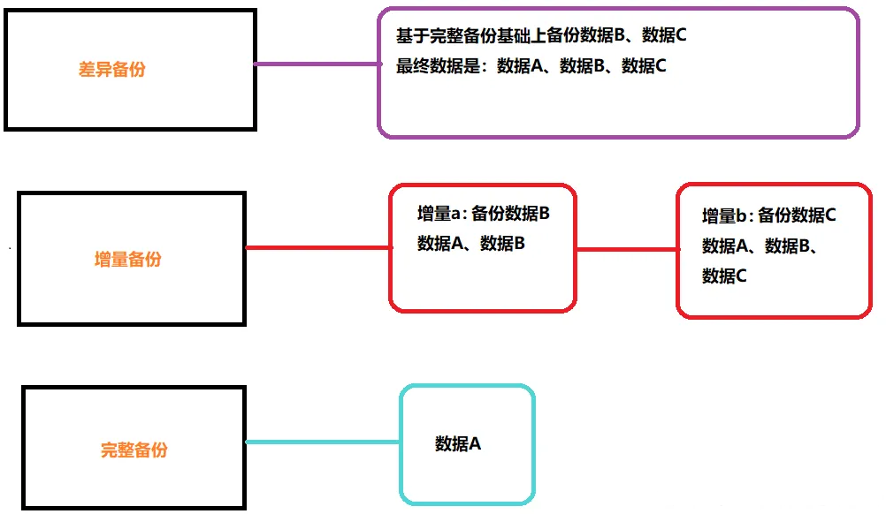
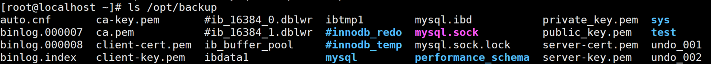

# MySQL数据库备份的3种方式

先问大家一个问题，在生产环境中什么最重要？服务器的硬件坏了可以维修或者换新, 软件问题可以修复或重新安装, 但是如果数据没了呢？这可能是最恐怖的事情了吧, 我感觉在生产环境中应该没有什么比数据跟更为重要，那么我们该如何保证数据不丢失、或者丢失后可以快速恢复呢？大家看完本文就能对`MySQL`中实现数据备份和恢复能有一定的了解。 

### 为什么需要备份数据？
> 其实在`前言`中也大概说明了为什么要备份数据, 但是我们还是应该具体了解一下为什么要备份数据 在生产环境中我们数据库可能会遭遇各种各样的不测从而导致数据丢失, 大概分为以下几种. 
>

+  硬件故障 
+  软件故障 
+  自然灾害 
+  黑客攻击 
+  误操作 (**占比最大**) 

所以, 为了在数据丢失之后能够恢复数据, 我们就需要定期的备份数据, 备份数据的策略要根据不同的应用场景进行定制, 大致有几个参考数值, 我们可以根据这些数值从而定制符合特定环境中的数据备份策略 

+  能够容忍丢失多少数据 
+  恢复数据需要多长时间 
+  需要恢复哪一些数据 

### 数据的备份类型
> 数据的备份类型根据其自身的特性主要分为以下几组 
>

+  完全备份 
+  部分备份：完全备份指的是**备份整个数据集( 即整个数据库 )**、部分备份指的是**备份部分数据集(例如: 只备份一个表)**

而部分备份又分为以下两种 

+  增量备份 
+  差异备份：增量备份指的是**备份自上一次备份以来(增量或完全)以来变化的数据**; 特点: 节约空间、还原麻烦 差异备份指的是**备份自上一次完全备份以来变化的数据** 特点: 浪费空间、还原比增量备份简单 

示意图 

                                                      

### **MySQL备份数据的方式**
> 在`MySQl`中我们备份数据一般有几种方式 
>

+  热备份：热备份指的是当数据库进行备份时, **数据库的读写操作均不是受影响**
+  温备份：温备份指的是当数据库进行备份时, **数据库的读操作可以执行, 但是不能执行写操作**
+  冷备份：冷备份指的是当数据库进行备份时, **数据库不能进行读写操作, 即数据库要下线**

`MySQL`中进行不同方式的备份还要考虑存储引擎是否支持 

+  MyISAM  热备 × 温备 √  冷备 √ 
+  InnoDB   热备 √  温备 √  冷备 √ 

我们在考虑完数据在备份时, 数据库的运行状态之后还需要考虑对于`MySQL`数据库中数据的备份方式 

+  物理备份：物理备份一般就是**通过**`**tar**`**,**`**cp**`**等命令直接打包复制数据库的数据文件**达到备份的效果 
+  逻辑备份：逻辑备份一般就是**通过特定工具从数据库中导出数据并另存备份**(逻辑备份会丢失数据精度) 

### 备份需要考虑的问题
> 定制备份策略前, 我们还需要考虑一些问题 **我们要备份什么?** 一般情况下, 我们需要备份的数据分为以下几种 
>

+  数据 
+  二进制日志, InnoDB事务日志 
+  代码(存储过程、存储函数、触发器、事件调度器) 
+  服务器配置文件 

**备份工具** 这里我们列举出常用的几种备份工具 `mysqldump` : 逻辑备份工具, 适用于所有的存储引擎, 支持温备、完全备份、部分备份、对于**InnoDB**存储引擎支持热备 `cp, tar 等归档复制工具`: 物理备份工具, 适用于所有的存储引擎, 冷备、完全备份、部分备份 `lvm2 snapshot`: 几乎热备, 借助文件系统管理工具进行备份 `mysqlhotcopy`: 名不副实的的一个工具, 几乎冷备, 仅支持**MyISAM**存储引擎 `xtrabackup`: 一款非常强大的**InnoDB/XtraDB**热备工具, 支持完全备份、增量备份, 由`percona`提供 

### 设计合适的备份策略
> 针对不同的场景下, 我们应该制定不同的备份策略对数据库进行备份, 一般情况下, 备份策略一般为以下三种 
>

+ **直接cp，tar复制数据库文件：**数据量较小, 直接复制数据库文件
+ **mysqldump：**数据量一般, 先使用mysqldump对数据库进行完全备份
+ **xtrabackup：**数据量很大，而又不过分影响业务运行，使用`xtrabackup`进行完全备份后, 定期使用`xtrabackup`进行增量备份或差异备份

### 实战演练
#### 使用cp进行全量备份
> 我们这里使用的是使用yum安装的`mysql-8.0.37`的版本
>

**查看数据库的信息**

```sql
[root@localhost ~]# mysql -uroot -p'1qaz@WSX'   #登录MySQL
mysql> show databases;    #查看当前的数据库, 我们的数据库为employees
+--------------------+
| Database           |
+--------------------+
| information_schema |
| mysql              |
| performance_schema |
| sys                |
| test               |
+--------------------+
5 rows in set (0.00 sec)

mysql> use sys;
Database changed

mysql> select count(*) from user_login_logs;   #user_login_logs的行数为20000
+----------+
| count(*) |
+----------+
|    20000 |
+----------+
1 row in set (0.01 sec)
```

**向数据库施加读锁**

```plsql
mysql> flush tables with read lock;    #向所有表施加读锁
Query OK, 0 rows affected (0.00 sec)
```

**备份数据文件**

```shell
[root@localhost ~]# mkdir /opt/backup   									 #创建文件夹存放备份数据库文件
[root@localhost ~]# cp -a /var/lib/mysql/* /opt/backup     #保留权限的拷贝源数据文件
[root@localhost ~]# ls /opt/backup                         #查看目录下的文件
```



**模拟数据丢失并恢复**

```sql
[root@localhost ~]# rm -rf /var/lib/mysql/*    #删除数据库的所有文件
[root@localhost ~]# service mysqld stop        #停止MySQL
[root@localhost ~]# cp -a /opt/backup/* /var/lib/mysql/    #将备份的数据文件拷贝回去
[root@localhost ~]# service mysqld start  #启动MySQL#重新连接数据并查看

[root@localhost ~]# mysql -uroot -p'1qaz@WSX'   #登录MySQL
mysql> show databases;    #数据库已恢复
+--------------------+
| Database           |
+--------------------+
| information_schema |
| mysql              |
| performance_schema |
| sys                |
| test               |
+--------------------+
5 rows in set (0.00 sec)

mysql> use sys;
Database changed

mysql> select count(*) from user_login_logs;    #表的行数没有变化
+----------+
| count(*) |
+----------+
|    20000 |
+----------+
1 row in set (0.01 sec)
```

**<font style="color:#DF2A3F;">备份完成后，需要解锁:    UNLOCK TABLES;</font>**

#### 使用mysqldump备份
> 通过mysqldump进行备份
>

`**mysqldump**`**命令介绍**

> `mysqldump`是一个客户端的逻辑备份工具, 可以生成一个重现创建原始数据库和表的SQL语句, 可以支持所有的存储引擎, 对于InnoDB支持热备
>
> [官方文档介绍](https://cloud.tencent.com/developer/tools/blog-entry?target=http%3A%2F%2Fdev.mysql.com%2Fdoc%2Frefman%2F5.7%2Fen%2Fmysqldump.html&source=article&objectId=2096467)
>

```sql
#备份全部数据库
mysqldump -uroot -1qaz@WSX --all-databases > backup_all_databases.sql
    mysqldump
        -uroot -1qaz@WSX                   登录MySQL的用户名/密码 
        --all-databases 
        > backup_all_databases.sql        备份文件的名称，可加保存路径

#备份一个数据库
mysqldump -uroot -1qaz@WSX --databases database_test1 > backup_database_test1.sql
 
#备份多个数据库
mysqldump -uroot -1qaz@WSX --databases database_test1 database_test2 > backup_database_test1_test2.sql
     mysqldump
        -uroot -1qaz@WSX                           登录MySQL的用户名/密码 
        --databases
        database_test1 database_test2             要备份的数据库，多个以空格间隔
        > backup_*.sql                            备份文件的名称，可加保存路径
        
#备份库中的部分表
mysqldump -uroot -1qaz@WSX database_test1 table_test1 table_test2 > backup_tables.sql
     mysqldump
        -uroot -1qaz@WSX                   登录MySQL的用户名/密码 
        database_test1                    要备份表所在的库名
        table_test1 >                     要备份的表名，可以有多个，以空格分割
        backup_tables.sql                 备份文件的名称，可加保存路径

查看备份文件中的内容
  #查看其中一个备份文件
  cat backup_tables.sql | grep -v "^--" |grep -v "^/" |grep -v "^$"
       cat
        backup_database_test1.sql                       要查看的文件
        | grep -v "^--" |grep -v "^/" |grep -v "^$"      过滤不显示的信息(grep为搜索，-v表示忽略)
```

**查看数据库的信息**

```sql
mysql> show databases;    #查看当前的数据库, 我们的数据库为employees
+--------------------+
| Database           |
+--------------------+
| information_schema |
| mysql              |
| performance_schema |
| sys                |
| test               |
+--------------------+
5 rows in set (0.00 sec)

mysql> use sys;
Database changed

mysql> select count(*) from user_login_logs;   #user_login_logs的行数为20000
+----------+
| count(*) |
+----------+
|    20000 |
+----------+
1 row in set (0.01 sec)
```

**使用**`**mysqldump**`**备份数据库**

```sql
[root@node1 ~]# mysqldump -uroot -p'1qaz@WSX' sys user_login_logs > backup_user_login_logs.sql   #备份数据库到 backup_user_login_logs.sql文件中
mysql> drop table user_login_logs;   #删除目标表
Query OK, 0 rows affected (0.03 sec)

[root@node1 ~]# mysql -uroot -p'1qaz@WSX' sys < backup_user_login_logs.sql
[root@localhost ~]# mysql -uroot -p'1qaz@WSX'   #登录MySQL

mysql> show databases;    
+--------------------+
| Database           |
+--------------------+
| information_schema |
| mysql              |
| performance_schema |
| sys                |
| test               |
+--------------------+
5 rows in set (0.00 sec)

mysql> use sys;
Database changed

mysql> select count(*) from user_login_logs;    #表的行数没有变化,数据已恢复
+----------+
| count(*) |
+----------+
|    20000 |
+----------+
1 row in set (0.01 sec)
```

| 其他恢复单库，多库，多表方法类似，大家参考单表恢复流程即可。

#### 使用Xtrabackup备份
> 为了更好地演示, 我们这次使用`mariadb-5.5`的版本, 使用`xtrabackup`使用InnoDB能够发挥其最大功效, 并且InnoDB的每一张表必须使用单独的表空间, 我们需要在配置文件中添加 `innodb_file_per_table = ON` 来开启 
>

**下载安装**`**xtrabackup**`

```powershell

[root@localhost software]# yum  -y install openssl-devel libaio libaio-devel automake autoconf bison libtool ncurses-devel libgcrypt-devel libev-devel libcurl-devel zlib-devel vim-common libcurl-devel libudev-devel
[root@localhost software]# yum  -y install https://repo.percona.com/yum/percona-release-latest.noarch.rpm
[root@localhost software]# yum install epel-release
[root@localhost software]# yum install zstd
[root@localhost software]# percona-release enable-only tools
[root@localhost software]# yum  -y install percona-xtrabackup-80
[root@localhost software]# xtrabackup --version
```

`**xtrabackup**`**介绍**

> `Xtrabackup`是由`percona`提供的`mysql`数据库备份工具，据官方介绍，这也是世界上惟一一款开源的能够对innodb和xtradb数据库进行热备的工具。特点： 
>

1.  备份过程快速、可靠； 
2.  备份过程不会打断正在执行的事务； 
3.  能够基于压缩等功能节约磁盘空间和流量； 
4.  自动实现备份检验； 
5.  还原速度快； 

`**xtrabackup**`**实现完全备份**

> 我们这里使用`xtrabackup`的前端配置工具`innobackupex`来实现对数据库的完全备份 使用`innobackupex`备份时, 会调用`xtrabackup`备份所有的**InnoDB**表, 复制所有关于表结构定义的相关文件(.frm)、以及**MyISAM**、**MERGE**、**CSV**和**ARCHIVE**表的相关文件, 同时还会备份触发器和数据库配置文件信息相关的文件, 这些文件会被保存至一个以时间命名的目录. 
>

**备份全恢复过程**

```plsql
# 如果权限有问题，需要打开权限。
mysql> use mysql;
mysql> GRANT BACKUP_ADMIN ON *.* TO 'root'@'%';
mysql> FLUSH PRIVILEGES;

mkdir -p /opt/software/xtrabackup/backup/base

# 第一次全量备份（20000数据）
xtrabackup -uroot -p'1qaz@WSX' --backup --target-dir=/opt/software/xtrabackup/backup/base --no-server-version-check

# 全量备份第一次增量备份（16000数据）
xtrabackup -uroot -p'1qaz@WSX' --backup --target-dir=/opt/software/xtrabackup/backup/inc1 --incremental-basedir=/opt/software/xtrabackup/backup/base --no-server-version-check

# 全量备份第二次增量备份（15000数据）
xtrabackup -uroot -p'1qaz@WSX' --backup --target-dir=/opt/software/xtrabackup/backup/inc2 --incremental-basedir=/opt/software/xtrabackup/backup/inc1 --no-server-version-check


# 预准备完成备份，此选项--apply-log-only 阻止回滚未完成的事务，此步骤必须先执行
xtrabackup -uroot -p'1qaz@WSX'  --prepare --apply-log-only --target-dir=/opt/software/xtrabackup/backup/base

# 合并第1次增量备份到完全备份
xtrabackup -uroot -p'1qaz@WSX' --prepare --apply-log-only --target-dir=/opt/software/xtrabackup/backup/base --incremental-dir=/opt/software/xtrabackup/backup/inc1

# 合并第2次增量备份到完全备份：最后一次还原不需要加选项--apply-log-only
xtrabackup -uroot -p'1qaz@WSX' --prepare --target-dir=/opt/software/xtrabackup/backup/base --incremental-dir=/opt/software/xtrabackup/backup/inc2

# 清空源数据，只有清空源数据才能备份
rm -rf /var/lib/mysql/*

# 还原数据库,当然也可以使用mv命令
xtrabackup -uroot -p'1qaz@WSX' --copy-back --target-dir=/opt/software/xtrabackup/backup/base

# 授权
chown -R mysql:mysql /var/lib/mysql

# 停止MySQL
systemctl stop mysqld

# 启动MySQL
systemctl start mysqld

# 这时候在检查数据就已经完全恢复了
```

**单个恢复过程**

```sql
# 第一次全量备份（20000数据）
xtrabackup -uroot -p'1qaz@WSX' --backup --target-dir=/opt/software/xtrabackup/backup/base --no-server-version-check

# 全量备份第一次增量备份（16000数据）
xtrabackup -uroot -p'1qaz@WSX' --backup --target-dir=/opt/software/xtrabackup/backup/inc1 --incremental-basedir=/opt/software/xtrabackup/backup/base --no-server-version-check

# 全量备份第二次增量备份（15000数据）
xtrabackup -uroot -p'1qaz@WSX' --backup --target-dir=/opt/software/xtrabackup/backup/inc2 --incremental-basedir=/opt/software/xtrabackup/backup/inc1 --no-server-version-check

# 如果此时只想恢复base版本
xtrabackup -uroot -p'1qaz@WSX'  --prepare  --target-dir=/opt/software/xtrabackup/backup/base

# 清空源数据，只有清空源数据才能备份
rm -rf /var/lib/mysql/*

# 还原数据库,当然也可以使用mv命令
xtrabackup -uroot -p'1qaz@WSX' --copy-back --target-dir=/opt/software/xtrabackup/backup/base

# 授权
chown -R mysql:mysql /var/lib/mysql

# 停止MySQL
systemctl stop mysqld

# 启动MySQL
systemctl start mysqld

# 这时候在检查数据就已经完全到base版本了，如果需要恢复第一次增量就先准备好备份文件，在恢复。
```

### 总结
| 备份命令 | 备份速度 | 恢复速度 | 介绍 | 功能 | 适用场景 |
| --- | --- | --- | --- | --- | --- |
| cp | 快 | 快 | 一般、灵活性低 | 很弱 | 少量数据备份 |
| mysqldump | 慢 | 慢 | 一般、可无视存储引擎的差异 | 一般 | 中小型数据量的备份 |
| xtrabackup | 较快 | 较快 | 实现innodb热备、对存储引擎有要求 | 强大 | 较大规模的备份 |


> 更新: 2024-12-17 13:14:49  
> 原文: <https://www.yuque.com/tulingzhouyu/db22bv/lf1n31x305un55gr>