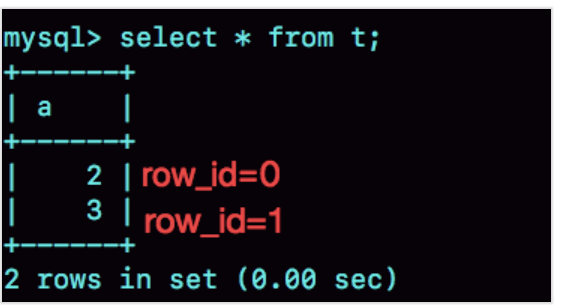
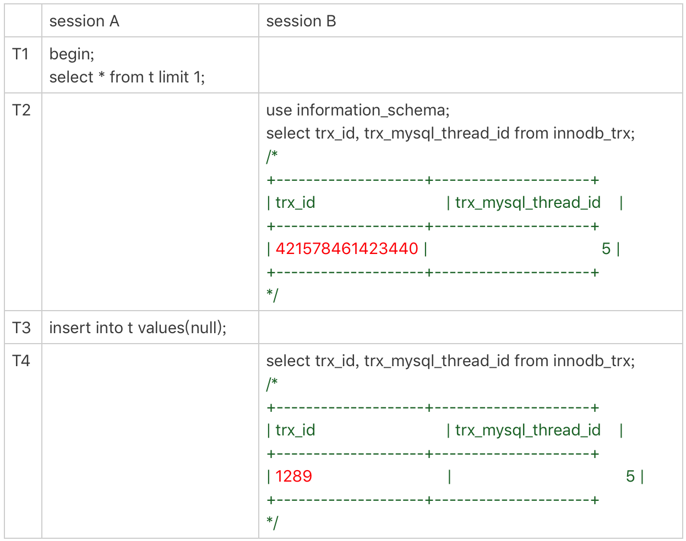
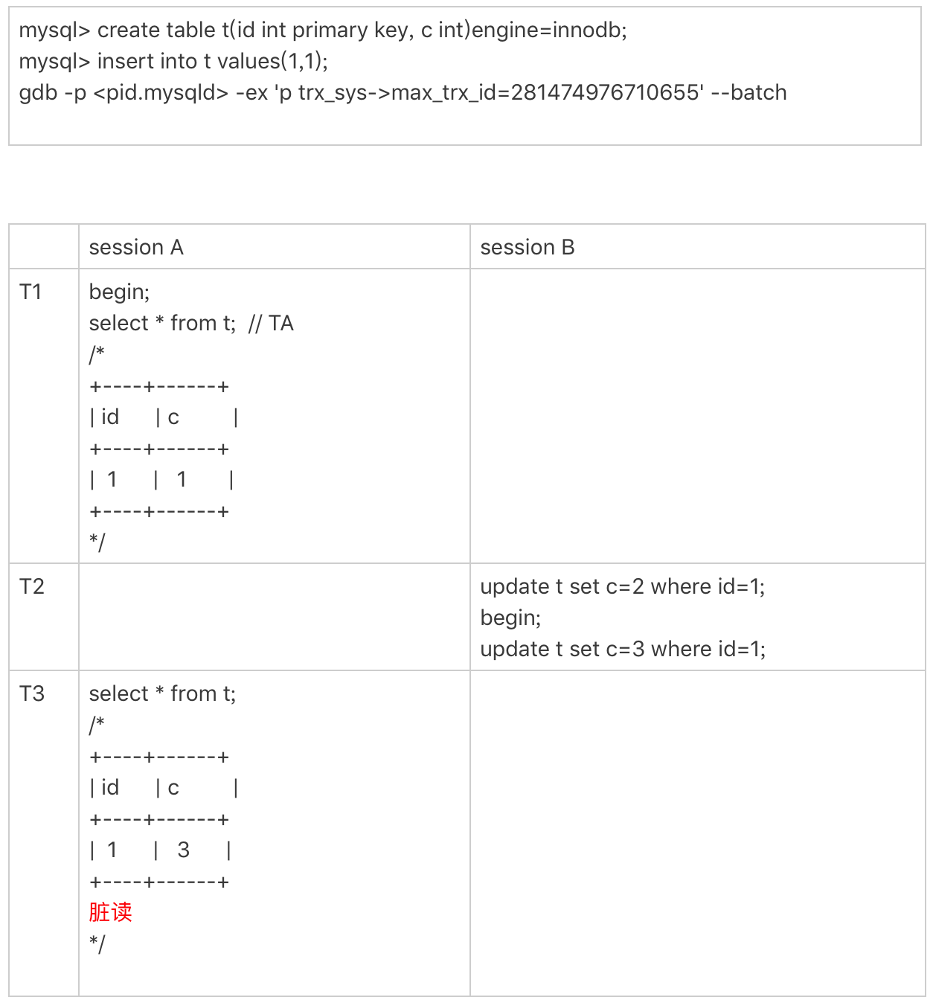

# MySQL自增id用完怎么办？

<font style="color:rgb(59, 67, 81);">MySQL 里有很多自增的 id，每个自增 id 都是定义了初始值，然后不停地往上加步长。虽然自然数是没有上限的，但是在计算机里，只要定义了表示这个数的字节长度，那它就有上限。比如，无符号整型 (unsigned int) 是 4 个字节，上限就是2的32次方。</font>

<font style="color:rgb(59, 67, 81);">既然自增 id 有上限，就有可能被用完。但是，自增 id 用完了会怎么样呢？</font>

<font style="color:rgb(59, 67, 81);">今天这篇文章，我们就来看看 MySQL 里面的几种自增 id，一起分析一下它们的值达到上限以后，会出现什么情况。</font>

### <font style="color:rgb(59, 67, 81);">表定义自增值 ID</font>
<font style="color:rgb(59, 67, 81);">说到自增 id，你第一个想到的应该就是表结构定义里的自增字段，表定义的自增值达到上限后的逻辑是：再申请下一个 id 时，得到的值保持不变。</font>

<font style="color:rgb(59, 67, 81);">我们可以通过下面这个语句序列验证一下：</font>

```java
create table t(
    id int unsigned auto_increment primary key
) auto_increment=4294967295;

insert into t values(null);

// 成功插入一行 4294967295
show create table t;
/* CREATE TABLE `t` (
  `id` int(10) unsigned NOT NULL AUTO_INCREMENT,
  PRIMARY KEY (`id`)
) ENGINE=InnoDB AUTO_INCREMENT=4294967295;
*/
 
insert into t values(null);
//Duplicate entry '4294967295' for key 'PRIMARY'
```

<font style="color:rgb(59, 67, 81);">可以看到，第一个 insert 语句插入数据成功后，这个表的 </font>`<font style="color:rgb(59, 67, 81);">AUTO_INCREMENT</font>`<font style="color:rgb(59, 67, 81);"> 没有改变（还是 4294967295），就导致了第二个 insert 语句又拿到相同的自增 id 值，再试图执行插入语句，报主键冲突错误。</font>

<font style="color:rgb(59, 67, 81);">2的32次方不是一个特别大的数，对于一个频繁插入删除数据的表来说，是可能会被用完的。因此在建表的时候你需要考察你的表是否有可能达到这个上限，如果有可能，就应该创建成 8 个字节的 bigint unsigned。</font>

### <font style="color:rgb(59, 67, 81);">InnoDB 系统自增 row_id</font>
<font style="color:rgb(59, 67, 81);">如果你创建的 InnoDB 表没有指定主键，那么 InnoDB 会给你创建一个不可见的，长度为 6 个字节的 row_id。</font>

<font style="color:rgb(59, 67, 81);">InnoDB 维护了一个全局的 dict_sys.row_id 值，所有无主键的 InnoDB 表，每插入一行数据，都将当前的 dict_sys.row_id 值作为要插入数据的 row_id，然后把 dict_sys.row_id 的值加 1。</font>

<font style="color:rgb(59, 67, 81);">实际上，在代码实现时 row_id 是一个长度为 8 字节的无符号长整型 (bigint unsigned)。但是，InnoDB 在设计时，给 row_id 留的只是 6 个字节的长度，这样写到数据表中时只放了最后 6 个字节，所以 row_id 能写到数据表中的值，就有两个特征：</font>

+ <font style="color:rgb(59, 67, 81);">row_id 写入表中的值范围，是从 0 到 2^48-1；</font>
+ <font style="color:rgb(59, 67, 81);">当 dict_sys.row_id=2^48时，如果再有插入数据的行为要来申请 row_id，拿到以后再取最后 6 个字节的话就是 0。</font>

<font style="color:rgb(59, 67, 81);">也就是说，写入表的 row_id 是从 0 开始到 2^48-1。</font>**<font style="color:rgb(59, 67, 81);">达到上限后，下一个值就是 0</font>**<font style="color:rgb(59, 67, 81);">，</font>**<font style="color:rgb(59, 67, 81);">然后继续循环</font>**<font style="color:rgb(59, 67, 81);">。</font>

<font style="color:rgb(59, 67, 81);">当然，2^48-1 这个值本身已经很大了，但是如果一个 MySQL 实例跑得足够久的话，还是可能达到这个上限的。在 InnoDB 逻辑里，申请到 row_id=N 后，就将这行数据写入表中；如果表中已经存在 row_id=N 的行，新写入的行就会覆盖原有的行。</font>

<font style="color:rgb(59, 67, 81);">要验证这个结论的话，你可以通过 gdb 修改系统的自增 row_id 来实现。注意，用 gdb 改变量这个操作是为了便于我们复现问题，只能在测试环境使用。</font>

+ <font style="color:rgb(59, 67, 81);">命令</font>

```java
mysql > create table `t_2`(a int) engine = innodb;

gdb -p <pid of mysqld> -ex 'p dict_sys.row_id=1' --batch

gdb -p 10674 -ex 'p dict_sys.row_id=1' --batch


mysql> insert into `t_2` value(1);

gdb -p <pid of mysqld> -ex 'p dict_sys.row_id=281474976710656' --batch

gdb -p 10674 -ex 'p dict_sys.row_id=281474976710656' --batch


mysql> insert into `t_2` value(2);

mysql> insert into `t_2` value(3);

mysql> select * from `t_2`;
```

+ <font style="color:rgb(59, 67, 81);">row_id 用完的效果验证</font>



<font style="color:rgb(59, 67, 81);">可以看到，在我用 gdb 将 dict_sys.row_id 设置为 2^48之后，再插入的 a=2 的行会出现在表 t 的第一行，因为这个值的 row_id=0。之后再插入的 a=3 的行，由于 row_id=1，就覆盖了之前 a=1 的行，因为 a=1 这一行的 row_id 也是 1。</font>

<font style="color:rgb(59, 67, 81);">从这个角度看，我们还是应该在 InnoDB 表中主动创建自增主键。因为，表自增 id 到达上限后，再插入数据时报主键冲突错误，是更能被接受的。</font>

<font style="color:rgb(59, 67, 81);">毕竟覆盖数据，就意味着数据丢失，影响的是数据可靠性；报主键冲突，是插入失败，影响的是可用性。而一般情况下，可靠性优先于可用性。</font>

### <font style="color:rgb(59, 67, 81);">x_id</font>
<font style="color:rgb(59, 67, 81);">我和你介绍 redo log 和 binlog 相配合的时候，提到了它们有一个共同的字段叫作 Xid。它在 MySQL 中是用来对应事务的。</font>

<font style="color:rgb(59, 67, 81);">那么，Xid 在 MySQL 内部是怎么生成的呢？</font>

<font style="color:rgb(59, 67, 81);">MySQL 内部维护了一个全局变量 global_query_id，每次执行语句的时候将它赋值给 Query_id，然后给这个变量加 1。如果当前语句是这个事务执行的第一条语句，那么 MySQL 还会同时把 Query_id 赋值给这个事务的 Xid。</font>

<font style="color:rgb(59, 67, 81);">而 global_query_id 是一个纯内存变量，重启之后就清零了。所以你就知道了，在同一个数据库实例中，不同事务的 Xid 也是有可能相同的。</font>

<font style="color:rgb(59, 67, 81);">但是 MySQL 重启之后会重新生成新的 binlog 文件，这就保证了，同一个 binlog 文件里，Xid 一定是惟一的。</font>

<font style="color:rgb(59, 67, 81);">虽然 MySQL 重启不会导致同一个 binlog 里面出现两个相同的 Xid，但是如果 global_query_id 达到上限后，就会继续从 0 开始计数。从理论上讲，还是就会出现同一个 binlog 里面出现相同 Xid 的场景。</font>

<font style="color:rgb(59, 67, 81);">因为 global_query_id 定义的长度是 8 个字节，这个自增值的上限是 2^64-1。要出现这种情况，必须是下面这样的过程：</font>

1. <font style="color:rgb(59, 67, 81);">执行一个事务，假设 Xid 是 A；</font>
2. <font style="color:rgb(59, 67, 81);">接下来执行 2^64次查询语句，让 global_query_id 回到 A；</font>
3. <font style="color:rgb(59, 67, 81);">再启动一个事务，这个事务的 Xid 也是 A。</font>

<font style="color:rgb(59, 67, 81);">不过，2^64这个值太大了，大到你可以认为这个可能性只会存在于理论上。</font>

### <font style="color:rgb(59, 67, 81);">Innodb trx_id</font>
<font style="color:rgb(59, 67, 81);">Xid 和 InnoDB 的 trx_id 是两个容易混淆的概念。</font>

<font style="color:rgb(59, 67, 81);">Xid 是由 server 层维护的。InnoDB 内部使用 Xid，就是为了能够在 InnoDB 事务和 server 之间做关联。但是，InnoDB 自己的 trx_id，是另外维护的。</font>

<font style="color:rgb(59, 67, 81);">其实，你应该非常熟悉这个 trx_id。它就是在我们在第 8 篇文章[《事务到底是隔离的还是不隔离的？》]中讲事务可见性时，用到的事务 id（transaction id）。</font>

<font style="color:rgb(59, 67, 81);">InnoDB 内部维护了一个 max_trx_id 全局变量，每次需要申请一个新的 trx_id 时，就获得 max_trx_id 的当前值，然后并将 max_trx_id 加 1。</font>

<font style="color:rgb(59, 67, 81);">InnoDB 数据可见性的核心思想是：每一行数据都记录了更新它的 trx_id，当一个事务读到一行数据的时候，判断这个数据是否可见的方法，就是通过事务的一致性视图与这行数据的 trx_id 做对比。</font>

<font style="color:rgb(59, 67, 81);">对于正在执行的事务，你可以从 information_schema.innodb_trx 表中看到事务的 trx_id。</font>

<font style="color:rgb(59, 67, 81);">我在上一篇文章的末尾留给你的思考题，就是关于从 innodb_trx 表里面查到的 trx_id 的。现在，我们一起来看一个事务现场：</font>

  
<font style="color:rgb(59, 67, 81);">session B 里，我从 innodb_trx 表里查出的这两个字段，第二个字段 trx_mysql_thread_id 就是线程 id。显示线程 id，是为了说明这两次查询看到的事务对应的线程 id 都是 5，也就是 session A 所在的线程。</font>

<font style="color:rgb(59, 67, 81);">可以看到，T2 时刻显示的 trx_id 是一个很大的数；T4 时刻显示的 trx_id 是 1289，看上去是一个比较正常的数字。这是什么原因呢？</font>

<font style="color:rgb(59, 67, 81);">实际上，在 T1 时刻，session A 还没有涉及到更新，是一个只读事务。而对于只读事务，InnoDB 并不会分配 trx_id。也就是说：</font>

1. <font style="color:rgb(59, 67, 81);">在 T1 时刻，trx_id 的值其实就是 0。而这个很大的数，只是显示用的。一会儿我会再和你说说这个数据的生成逻辑。</font>
2. <font style="color:rgb(59, 67, 81);">直到 session A 在 T3 时刻执行 insert 语句的时候，InnoDB 才真正分配了 trx_id。所以，T4 时刻，session B 查到的这个 trx_id 的值就是 1289。</font>

<font style="color:rgb(59, 67, 81);">需要注意的是，除了显而易见的修改类语句外，如果在 select 语句后面加上 for update，这个事务也不是只读事务。</font>

<font style="color:rgb(59, 67, 81);">那么，</font>**<font style="color:rgb(59, 67, 81);">T2 时刻查到的这个很大的数字是怎么来的呢？</font>**

<font style="color:rgb(59, 67, 81);">其实，这个数字是每次查询的时候由系统临时计算出来的。它的算法是：把当前事务的 trx 变量的指针地址转成整数，再加上 2^48。使用这个算法，就可以保证以下两点：</font>

1. <font style="color:rgb(59, 67, 81);">因为同一个只读事务在执行期间，它的指针地址是不会变的，所以不论是在 innodb_trx 还是在 innodb_locks 表里，同一个只读事务查出来的 trx_id 就会是一样的。</font>
2. <font style="color:rgb(59, 67, 81);">如果有并行的多个只读事务，每个事务的 trx 变量的指针地址肯定不同。这样，不同的并发只读事务，查出来的 trx_id 就是不同的。</font>

<font style="color:rgb(59, 67, 81);">那么，</font>**<font style="color:rgb(59, 67, 81);">为什么还要再加上 2^48呢？</font>**

<font style="color:rgb(59, 67, 81);">在显示值里面加上 2^48，目的是要保证只读事务显示的 trx_id 值比较大，正常情况下就会区别于读写事务的 id。但是，trx_id 跟 row_id 的逻辑类似，定义长度也是 8 个字节。因此，在理论上还是可能出现一个读写事务与一个只读事务显示的 trx_id 相同的情况。不过这个概率很低，并且也没有什么实质危害，可以不管它。</font>

<font style="color:rgb(59, 67, 81);">另一个问题是，</font>**<font style="color:rgb(59, 67, 81);">只读事务不分配 trx_id，有什么好处呢？</font>**

+ <font style="color:rgb(59, 67, 81);">一个好处是，这样做可以减小事务视图里面活跃事务数组的大小。因为当前正在运行的只读事务，是不影响数据的可见性判断的。所以，在创建事务的一致性视图时，InnoDB 就只需要拷贝读写事务的 trx_id。</font>
+ <font style="color:rgb(59, 67, 81);">另一个好处是，可以减少 trx_id 的申请次数。在 InnoDB 里，即使你只是执行一个普通的 select 语句，在执行过程中，也是要对应一个只读事务的。所以只读事务优化后，普通的查询语句不需要申请 trx_id，就大大减少了并发事务申请 trx_id 的锁冲突。</font>

<font style="color:rgb(59, 67, 81);">由于只读事务不分配 trx_id，一个自然而然的结果就是 trx_id 的增加速度变慢了。</font>

<font style="color:rgb(59, 67, 81);">但是，max_trx_id 会持久化存储，重启也不会重置为 0，那么从理论上讲，只要一个 MySQL 服务跑得足够久，就可能出现 max_trx_id 达到 2^48-1 的上限，然后从 0 开始的情况。</font>

<font style="color:rgb(59, 67, 81);">当达到这个状态后，MySQL 就会持续出现一个脏读的 bug，我们来复现一下这个 bug。</font>

<font style="color:rgb(59, 67, 81);">首先我们需要把当前的 max_trx_id 先修改成 2^48-1。注意：这个 case 里使用的是可重复读隔离级别。具体的操作流程如下：</font>



<font style="color:rgb(59, 67, 81);">由于我们已经把系统的 max_trx_id 设置成了 2^48-1，所以在 session A 启动的事务 TA 的低水位就是 2^48-1。</font>

<font style="color:rgb(59, 67, 81);">在 T2 时刻，session B 执行第一条 update 语句的事务 id 就是 2^48-1，而第二条 update 语句的事务 id 就是 0 了，这条 update 语句执行后生成的数据版本上的 trx_id 就是 0。</font>

<font style="color:rgb(59, 67, 81);">在 T3 时刻，session A 执行 select 语句的时候，判断可见性发现，c=3 这个数据版本的 trx_id，小于事务 TA 的低水位，因此认为这个数据可见。</font>

<font style="color:rgb(59, 67, 81);">但，这个是脏读。</font>

<font style="color:rgb(59, 67, 81);">由于低水位值会持续增加，而事务 id 从 0 开始计数，就导致了系统在这个时刻之后，所有的查询都会出现脏读的。</font>

<font style="color:rgb(59, 67, 81);">并且，MySQL 重启时 max_trx_id 也不会清 0，也就是说重启 MySQL，这个 bug 仍然存在。</font>

<font style="color:rgb(59, 67, 81);">那么，</font>**<font style="color:rgb(59, 67, 81);">这个 bug 也是只存在于理论上吗？</font>**

<font style="color:rgb(59, 67, 81);">假设一个 MySQL 实例的 TPS 是每秒 50 万，持续这个压力的话，在 17.8 年后，就会出现这个情况。如果 TPS 更高，这个年限自然也就更短了。但是，从 MySQL 的真正开始流行到现在，恐怕都还没有实例跑到过这个上限。不过，这个 bug 是只要 MySQL 实例服务时间够长，就会必然出现的。</font>

### <font style="color:rgb(59, 67, 81);">thread_id</font>
<font style="color:rgb(59, 67, 81);">接下来，我们再看看线程 id（thread_id）。其实，线程 id 才是 MySQL 中最常见的一种自增 id。平时我们在查各种现场的时候，show processlist 里面的第一列，就是 thread_id。</font>

<font style="color:rgb(59, 67, 81);">thread_id 的逻辑很好理解：系统保存了一个全局变量 thread_id_counter，每新建一个连接，就将 thread_id_counter 赋值给这个新连接的线程变量。</font>

<font style="color:rgb(59, 67, 81);">thread_id_counter 定义的大小是 4 个字节，因此达到 2^32-1 后，它就会重置为 0，然后继续增加。但是，你不会在 show processlist 里看到两个相同的 thread_id。</font>

<font style="color:rgb(59, 67, 81);">这，是因为 MySQL 设计了一个唯一数组的逻辑，给新线程分配 thread_id 的时候，逻辑代码是这样的：</font>

```bash
do {
  new_id= thread_id_counter++;
} while (!thread_ids.insert_unique(new_id).second);
```

<font style="color:rgb(59, 67, 81);">这个代码逻辑简单而且实现优雅，相信你一看就能明白。</font>

### <font style="color:rgb(59, 67, 81);">总结</font>
<font style="color:rgb(59, 67, 81);">数据库系统作为一个可能需要 7*24 小时全年无休的服务，考虑这些边界是非常有必要的。</font>

<font style="color:rgb(59, 67, 81);">每种自增 id 有各自的应用场景，在达到上限后的表现也不同：</font>

1. <font style="color:rgb(59, 67, 81);">表的自增 id 达到上限后，再申请时它的值就不会改变，进而导致继续插入数据时报主键冲突的错误。</font>
2. <font style="color:rgb(59, 67, 81);">row_id 达到上限后，则会归 0 再重新递增，如果出现相同的 row_id，后写的数据会覆盖之前的数据。</font>

<font style="color:rgb(59, 67, 81);">当然，在 MySQL 里还有别的自增 id，比如 x_id、thread_id、table_id等等，如果用完了又会发生什么呢？大家可以一起在评论区咱们一起聊聊。下期再会~</font>


> 更新: 2025-01-08 16:37:00  
> 原文: <https://www.yuque.com/tulingzhouyu/db22bv/te3xwgo1cr4ostea>