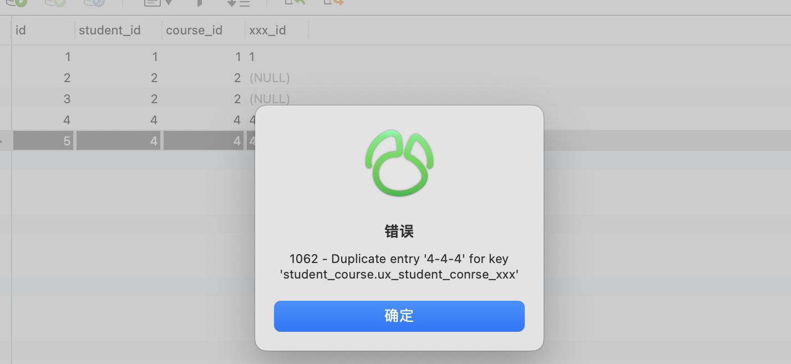
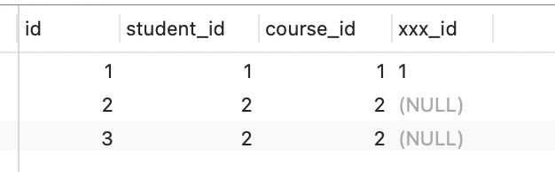
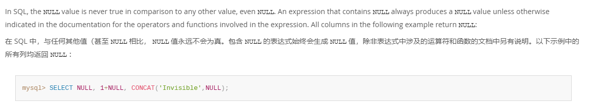

# MySQL踩坑笔记，加了唯一索引还会出现重复数据？

## <font style="color:rgb(37, 41, 51);">还原问题</font>
<font style="color:rgb(37, 41, 51);">表结构如下：</font>

```sql
-- 表格式
CREATE TABLE `student_course` (
  `id` bigint NOT NULL,
  `student_id` bigint NOT NULL,
  `course_id` bigint NOT NULL,
  `xxx_id` varchar(255) COLLATE utf8mb4_bin DEFAULT NULL,
  PRIMARY KEY (`id`)
) ENGINE=InnoDB DEFAULT CHARSET=utf8mb4 COLLATE=utf8mb4_bin;

-- 为了保证数据的唯一性，建了唯一索引：
alter table student_course add unique index 
ux_student_conrse_xxx(student_id,course_id,xxx_id);

INSERT INTO `student_course` (`id`, `student_id`, `course_id`, `xxx_id`) VALUES
(1, 1001, 2001, 'xxx_001'),
(2, 1002, 2002, 'xxx_002'),
(3, 1003, 2003, 'xxx_003');

INSERT INTO `student_course` (`id`, `student_id`, `course_id`, `xxx_id`) VALUES
(4, 1001, 2001, NULL),
(5, 1002, 2002, NULL);
```

<font style="color:rgb(37, 41, 51);">第二天查看数据，发现该表中竟然产生了重复的数据：</font>

<font style="color:rgb(37, 41, 51);">从上图中看出，</font>`<font style="color:rgb(37, 41, 51);">mysql</font>`<font style="color:rgb(37, 41, 51);">的唯一性约束生效了，重复数据被拦截了。</font>



<font style="color:rgb(37, 41, 51);">接下来，我们再插入两条</font>`<font style="color:rgb(37, 41, 51);">xxx_id</font>`<font style="color:rgb(37, 41, 51);">为</font>`<font style="color:rgb(37, 41, 51);">null</font>`<font style="color:rgb(37, 41, 51);">的数据，其中第三条数据跟第二条数据中</font>`student_id`<font style="color:rgb(37, 41, 51);">、</font>`course_id`<font style="color:rgb(37, 41, 51);">和</font>`<font style="color:rgb(37, 41, 51);">xxx_id</font>`<font style="color:rgb(37, 41, 51);">字段值都一样.</font>



<font style="color:rgb(37, 41, 51);">从图中看出，竟然执行成功了。</font>

<font style="color:rgb(37, 41, 51);">换句话说，如果唯一索引的字段中，出现了</font>`<font style="color:rgb(37, 41, 51);">null</font>`<font style="color:rgb(37, 41, 51);">值，则唯一性约束不会生效。</font>

<font style="color:rgb(37, 41, 51);">最终插入的数据情况是这样的：</font>

1. <font style="color:rgb(37, 41, 51);">当</font>`<font style="color:rgb(37, 41, 51);">xxx_id</font>`<font style="color:rgb(37, 41, 51);">字段不为空时，不会产生重复的数据。</font>
2. <font style="color:rgb(37, 41, 51);">当</font>`<font style="color:rgb(37, 41, 51);">xxx_id</font>`<font style="color:rgb(37, 41, 51);">字段为空时，会生成重复的数据。</font>

> <font style="color:rgb(102, 102, 102);background-color:rgb(248, 248, 248);">我们需要特别注意：创建唯一索引的字段，都不能允许为null，否则mysql的唯一性约束可能会失效。</font>
>

## 产生原因：
<font style="color:rgb(38, 38, 38);">这个问题涉及到 SQL 中的三值逻辑，即真（TRUE）、假（FALSE）和未知（UNKNOWN）。</font>

<font style="color:rgb(255, 80, 44);background-color:rgb(255, 245, 245);">在 MySQL 官方文档中也有说明，Null 与任何值都不相等，包括与另一个 Null 比较。</font>

官网链接：https://dev.mysql.com/doc/refman/8.4/en/problems-with-null.html



**举个简单例子：**<font style="color:rgb(38, 38, 38);">当你使用 NOT IN 条件时，如果其中包含 NULL 值，这会导致整个条件的结果不确定。具体来说：</font>

+ <font style="color:rgb(38, 38, 38);">如果一个值与 NULL 进行比较，结果是未知（UNKNOWN）。</font>
+ <font style="color:rgb(38, 38, 38);">如果一个条件的结果是未知（UNKNOWN），那么整个条件的结果也是未知（UNKNOWN）。</font>

```sql
SELECT * FROM student_course WHERE xxx_id NOT IN ('xxx_003', NULL);

SELECT * FROM student_course WHERE xxx_id NOT IN ('xxx_003') OR xxx_id IS NULL;
```

<font style="color:rgb(38, 38, 38);">因此，当你使用 NOT IN 条件时，如果其中包含 NULL 值，它会导致整个条件结果为未知（UNKNOWN）。</font>

<font style="color:rgb(38, 38, 38);">在 SQL 中，任何未知（UNKNOWN）的条件都被视为不符合条件，因此相关的行将被过滤掉，不会包含在结果中。</font><font style="color:rgb(38, 38, 38);">  
</font><font style="color:rgb(38, 38, 38);">这就是为什么在处理包含 NULL 值的情况时，需要谨慎地使用条件，以确保你的查询逻辑正确。</font><font style="color:rgb(38, 38, 38);">  
</font><font style="color:rgb(38, 38, 38);">在这种情况下，</font>**<font style="color:rgb(38, 38, 38);">使用 IS NULL 条件 </font>**<font style="color:rgb(38, 38, 38);">或者 </font>**<font style="color:rgb(38, 38, 38);">将 NULL 视为一个单独的选项</font>**<font style="color:rgb(38, 38, 38);">。</font>

+ **<font style="color:rgb(38, 38, 38);">真（TRUE）：</font>**<font style="color:rgb(38, 38, 38);">代表条件或表达式为真。如果一个条件符合或一个表达式为真，则结果为真。</font>
+ **<font style="color:rgb(38, 38, 38);">假（FALSE）：</font>**<font style="color:rgb(38, 38, 38);">代表条件或表达式为假。如果一个条件不符合或一个表达式为假，则结果为假。</font>
+ **<font style="color:rgb(38, 38, 38);">未知（UNKNOWN）：</font>**<font style="color:rgb(38, 38, 38);">代表条件或表达式的真假未知。当无法确定条件或表达式的真实值时，结果为未知。</font>

<font style="color:rgb(38, 38, 38);">这可能是因为某些数据缺失、表达式中存在空值（NULL）或其他不确定因素导致的。</font>

## 逻辑删除表加唯一索引
我们都知道唯一索引非常简单好用，但有时候，在表中它并不好加。不信，我们一起往下看。通常情况下，要删除表的某条记录的话，如果用delete语句操作的话。例如：

```sql
delete from product where id=123;
```

这种delete操作是物理删除，即该记录被删除之后，后续通过sql语句基本查不出来。（不过通过其他技术手段可以找回，那是后话了）还有另外一种是逻辑删除，主要是通过update语句操作的。例如：

```sql
update product set delete_status=1,edit_time=now(3) where id=123;
```

逻辑删除需要在表中额外增加一个删除状态字段，用于记录数据是否被删除。在所有的业务查询的地方，都需要过滤掉已经删除的数据。通过这种方式删除数据之后，数据任然还在表中，只是从逻辑上过滤了删除状态的数据而已。

  
其实对于这种逻辑删除的表，是没法加唯一索引的。为什么呢？

  
假设之前给商品表中的name和model加了唯一索引，如果用户把某条记录删除了，delete_status设置成1了。后来，该用户发现不对，又重新添加了一模一样的商品。由于唯一索引的存在，该用户第二次添加商品会失败，即使该商品已经被删除了，也没法再添加了。这个问题显然有点严重。

有人可能会说：把name、model和delete_status三个字段同时做成唯一索引不就行了？

  
答：这样做确实可以解决用户逻辑删除了某个商品，后来又重新添加相同的商品时，添加不了的问题。但如果第二次添加的商品，又被删除了。该用户第三次添加相同的商品，不也出现问题了？由此可见，如果表中有逻辑删除功能，是不方便创建唯一索引的。  
但如果真的想给包含逻辑删除的表，增加唯一索引，该怎么办呢？


## 删除状态+1  

通过前面知道，如果表中有逻辑删除功能，是不方便创建唯一索引的。其根本原因是，记录被删除之后，delete_status会被设置成1，默认是0。相同的记录第二次删除的时候，delete_status被设置成1，但由于创建了唯一索引（把name、model和delete_status三个字段同时做成唯一索引），数据库中已存在delete_status为1的记录，所以这次会操作失败。

  
我们为啥不换一种思考：不要纠结于delete_status为1，表示删除，当delete_status为1、2、3等等，只要大于1都表示删除。这样的话，每次删除都获取那条相同记录的最大删除状态，然后加1。  
这样数据操作过程变成：


```sql
添加记录a，delete_status=0。
删除记录a，delete_status=1。
添加记录a，delete_status=0。
删除记录a，delete_status=2。
添加记录a，delete_status=0。
删除记录a，delete_status=3。
```


由于记录a，每次删除时，delete_status都不一样，所以可以保证唯一性。该方案的优点是：不用调整字段，非常简单和直接。  
缺点是：可能需要修改sql逻辑，特别是有些查询sql语句，有些使用delete_status=1判断删除状态的，需要改成delete_status>=1。

## 增加时间戳字段
导致逻辑删除表，不好加唯一索引最根本的地方在逻辑删除那里。我们为什么不加个字段，专门处理逻辑删除的功能呢？

  
答：可以增加时间戳字段。

  
把name、model、delete_status和timeStamp，四个字段同时做成唯一索引在添加数据时，timeStamp字段写入默认值1。

  
然后一旦有逻辑删除操作，则自动往该字段写入时间戳。这样即使是同一条记录，逻辑删除多次，每次生成的时间戳也不一样，也能保证数据的唯一性。

  
时间戳一般精确到秒。除非在那种极限并发的场景下，对同一条记录，两次不同的逻辑删除操作，产生了相同的时间戳。这时可以将时间戳精确到毫秒。

  
该方案的优点是：可以在不改变已有代码逻辑的基础上，通过增加新字段实现了数据的唯一性。缺点是：在极限的情况下，可能还是会产生重复数据。

## 增加id字段
  
其实，增加时间戳字段基本可以解决问题。但在在极限的情况下，可能还是会产生重复数据。有没有办法解决这个问题呢？  


答：增加主键字段：delete_id。  


该方案的思路跟增加时间戳字段一致，即在添加数据时给delete_id设置默认值1，然后在逻辑删除时，给delete_id赋值成当前记录的主键id。

  
把name、model、delete_status和delete_id，四个字段同时做成唯一索引。这可能是最优方案，无需修改已有删除逻辑，也能保证数据的唯一性。

## 重复历史数据如何加唯一索引？  

前面聊过如果表中有逻辑删除功能，不太好加唯一索引，但通过文中介绍的三种方案，可以顺利的加上唯一索引。  
但来自灵魂的一问：如果某张表中，已存在历史重复数据，该如何加索引呢？最简单的做法是，增加一张防重表，然后把数据初始化进去。

  
可以写一条类似这样的SQL：

```sql
insert into product_unqiue(id,name,category_id,unit_id,model)
select max(id), select name,category_id,unit_id,model from product
group by name,category_id,unit_id,model;
```


这样做可以是可以，但今天的主题是直接在原表中加唯一索引，不用防重表。那么，这个唯一索引该怎么加呢？其实可以借鉴上一节中，增加id字段的思路。增加一个delete_id字段。不过在给product表创建唯一索引之前，先要做数据处理。获取相同记录的最大id：


```sql
select max(id), select name,category_id,unit_id,model from product
group by name,category_id,unit_id,model;
```


然后将delete_id字段设置成1。然后将其他的相同记录的delete_id字段，设置成当前的主键。这样就能区分历史的重复数据了。

当所有的delete_id字段都设置了值之后，就能给name、model、delete_status和delete_id，四个字段加唯一索引了。完美。


> 更新: 2025-03-30 20:18:18  
> 原文: <https://www.yuque.com/tulingzhouyu/db22bv/ac3uu4txf07ypf8q>