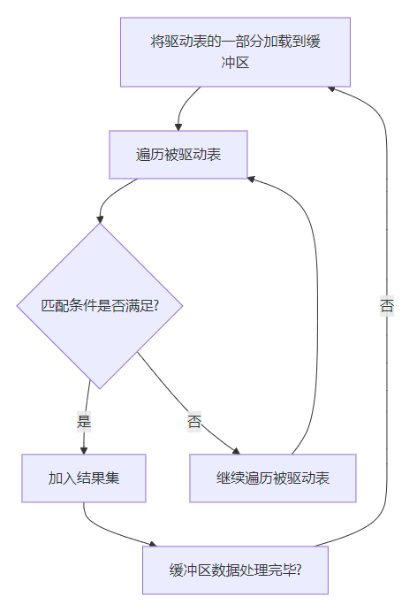

# MySQL进阶系列：Join算法详解

## 前言
在数据库开发中，`JOIN` 是多表查询的核心操作，其性能直接影响整个系统的效率。

MySQL 提供了多种 `JOIN` 算法来处理表之间的连接操作，包括

+ 嵌套循环连接（Nested Loop Join）
+ 索引嵌套循环连接（Index Nested Loop Join）
+ 块嵌套循环连接（Block Nested Loop Join）
+ 哈希连接（Hash Join）
+ 排序合并连接（Sort-Merge Join）

这些算法各有优劣，适用于不同的场景。本文将详细解析这些 `JOIN` 算法的底层实现原理，并结合实际案例和优化建议，帮助开发者更好地理解和优化多表查询。

## 1. 简单嵌套循环连接（Simple Nested-Loop Join, SNLJ）
### 原理
驱动表中的每一条记录，会依次与被驱动表中的每一条记录进行比较，寻找符合条件的匹配记录。这是最基本的实现方式，几乎不依赖任何辅助优化。

### 特点
SNLJ 的实现简单，直接，同时也非常低效。因此，通常仅在小表连接场景下使用。

### 优缺点
+ **优点：**实现极其简单，可广泛应用于快速验证。
+ **缺点：**性能差，对大数据量的查询非常低效，尤其是驱动表和被驱动表数据均较大时。

### 执行流程图
简单嵌套循环连接（SNLJ）是最基础的连接算法，其执行过程如下：

+ 从驱动表中取出一条记录。
+ 遍历被驱动表中的所有记录，找到匹配的记录。
+ 将匹配结果加入结果集。

## 2. 索引嵌套循环连接（Index Nested-Loop Join, INLJ）
### 原理
INLJ 是嵌套循环连接的优化版本，通过被驱动表上的索引，可以避免对其进行全表扫描，而是直接通过索引定位到匹配记录。

### 特点
利用了被驱动表索引提升查询效率，非常适合**小表连接大表**或者**大表间的少量匹配场景**。

### 优缺点
+ **优点：**速度快，大幅减少了被驱动表的扫描次数。
+ **缺点：**依赖被驱动表索引；如果索引丢失，性能直接退化为简单嵌套循环。

### 执行流程图
索引嵌套循环连接（INLJ）通过利用被驱动表的索引，显著减少匹配次数。其执行过程如下：

+ 从驱动表中取出一条记录。
+ 使用该记录的连接键，通过索引快速定位被驱动表中的匹配记录。
+ 将匹配结果加入结果集。

## 3. 块嵌套循环连接（Block Nested-Loop Join, BNLJ）
### 原理
在 BNLJ 中，驱动表的一部分数据会首先被加载到内存缓冲区 (`JOIN BUFFER`) 中，然后再与被驱动表进行比较匹配操作。

### 特点
通过批量加载缓冲区减少被驱动表的扫描次数，适合于**大表之间无索引连接**的场景。

### 优缺点
+ **优点：**缓冲机制可以显著降低被驱动表扫描次数。
+ **缺点：**对内存消耗较大，缓冲区不足会导致效率下降。

### 执行流程图
块嵌套循环连接（BNLJ）通过引入 `JOIN BUFFER` 缓冲区，减少被驱动表的 I/O 次数。其执行过程如下：

+ 将驱动表的一部分数据加载到 `JOIN BUFFER` 中。
+ 遍历被驱动表的所有记录，与 `JOIN BUFFER` 中的数据进行匹配。
+ 重复上述过程，直到驱动表的数据全部处理完毕。

## 4. 哈希连接（Hash Join）
### 原理
哈希连接是一种高效的连接算法，适用于**等值连接**场景。其核心思想是：

1. **构建阶段：**以较小的表为基准，基于连接键构建哈希表（作为构建表）。
2. **探测阶段：**扫描较大的表（探测表），根据哈希值快速定位构建表中的匹配项。

### 特点
哈希连接适用于需要连接的大表之间数据量大、缺少索引、但连接条件是**等值条件**的情况。

### 优缺点
+ **优点：**在等值连接上效率极高，尤其适合无索引的大数据集。
+ **缺点：**无法处理范围条件、不等式条件；哈希表构建阶段对内存的依赖较大。

### 执行流程图
哈希连接（Hash Join）是 MySQL 8.0.20 引入的一种高效连接算法，适用于大数据集的等值连接。其执行过程如下：

+ **构建阶段**：将较小的表加载到内存中，并基于连接键构建哈希表。
+ **探测阶段**：扫描较大的表，根据连接键查找哈希表中的匹配记录。

## 5. 排序合并连接（Sort-Merge Join）
### 原理
排序合并连接通过**先对表的连接键进行排序**，然后使用类似归并排序的方式合并两个表。步骤如下：

1. 为表 A 和表 B 基于连接键进行排序。
2. 分别从两个排序后的表读取数据，对比连接键并合并匹配的记录。
3. 对于不满足条件的记录，通过移动较小的一方指针解决。

### 特点
非常适合于需要排序的大表或者需要进行范围条件连接的时候。

### 优缺点
+ **优点：**适用于范围条件和等值条件，特别适合超大数据集。
+ **缺点：**排序阶段可能会导致较高的 I/O 开销。

### 执行流程图
排序合并连接（Sort-Merge Join）是一种高效的连接算法，特别适用于没有索引的大数据集和需要范围连接的场景。其执行过程如下：

+ **排序阶段**：对两个表的连接键进行排序。
+ **合并阶段**：使用类似“归并排序”的方式，依次扫描两个排序后的表。

## 6. JOIN 算法对比
以下为五种 JOIN 算法的总结性对比，为开发者选择合适算法提供参考：

| 算法 | 适用场景 | 优点 | 缺点 |
| --- | --- | --- | --- |
| SNLJ | 小表连接小表 | 实现简单 | 性能差，只适合小表 |
| INLJ | 被驱动表有索引 | 显著提升性能 | 缺少索引时性能退化 |
| BNLJ | 无索引的大表连接 | 减少被驱动表扫描 | 对内存依赖较高 |
| Hash Join | 等值连接 | 等值连接效率高 | 无法处理范围查询 |
| Sort-Merge Join | 范围或无索引场景 | 支持范围条件 | 排序的 I/O 开销大 |

## 7. 总结
通过深入理解 JOIN 的实现原理和适用场景，可以根据需求选择合适的算法：

+ **SNLJ：**适合小表或快速验证。
+ **INLJ：**优选小表到大表且有索引的场景。
+ **BNLJ：**适用于无索引的场景。
+ **Hash Join：**等值连接的高效利器。
+ **Sort-Merge Join：**更适合范围查询和排序场景。

> 更新: 2024-12-23 15:41:40  
> 原文: <https://www.yuque.com/tulingzhouyu/db22bv/iq2e1mgrxm0499x4>