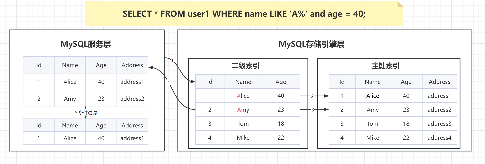
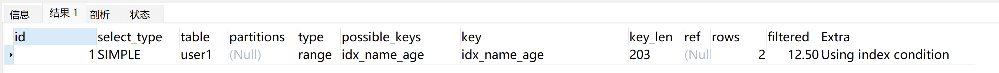
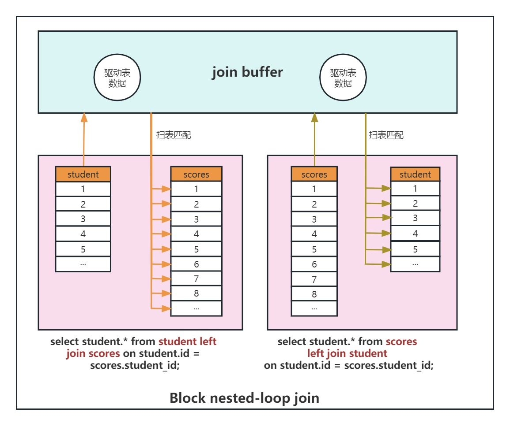
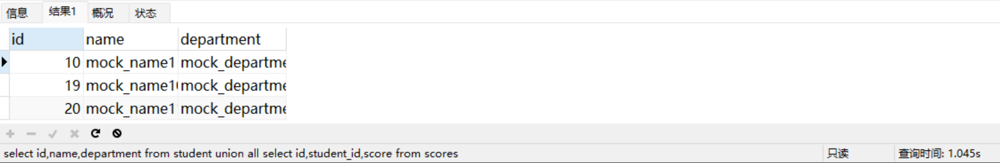
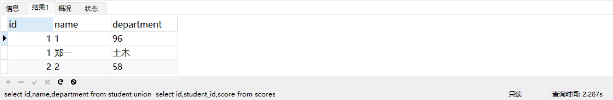
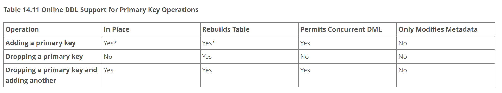

# 💎 MySQL面试题合集

# <font style="color:#01B2BC;">说说你对 MySQL 锁的理解</font>
## 1.MySQL中的锁分类
+ 按粒度分**表锁**、**行锁**和**页锁**三种，
+ 按类型分**读锁和写锁(都属于悲观锁)**两种。
+ 按性能分**乐观锁**、**悲观锁和意向锁**。

其中，MyISAM和MEMORY存储引擎采用的是**表级锁**，而InnoDB存储引擎支持**行级锁和表级锁**。

## 2.表锁、行锁、页锁
### 表锁：
每次操作锁住整张表。**开销小，加锁快；（**~~**<font style="color:#DF2A3F;">不会出现死锁</font>**~~评论反馈更正**）发生死锁的概率更小(多事务循环等待情况)；**锁定粒度大，发生锁冲突的概率最高，并发度最低；一般用在整表数据迁移的场景。

```sql
CREATE TABLE locker (
  id INT PRIMARY KEY,
  name VARCHAR(255),
  value INT
);

INSERT INTO locker (
	id, name, value
) VALUES
(1, '张三', 2),	(2, '张三', 3),(3, '张三', 4);
```

```sql
BEGIN;
SELECT * FROM locker WHERE value = 2 FOR UPDATE;
```

因value字段**没有索引**，所以这个 SQL 语句会对 locker 表进行加锁，也就是**表锁**。在事务提交之前，该表数据将无法被其他事务修改。

### 行锁：
对表中一行或多行记录进行加锁控制的方式。**开销大，加锁慢；会出现死锁；**锁定粒度最小，发生锁冲突的概率最低，并发度最高。在 MySQL 中，**行锁是基于索引加载的**，即行锁是要加在索引响应的行上。**索引失效时会升级为表锁。**

```sql
#给locker表中value列添加索引
ALTER TABLE locker ADD index idx_value (value);

BEGIN;
SELECT * FROM locker WHERE value = 2 FOR UPDATE;
```

value字段**添加索引后**，这条SQL只会针对value值为2的记录进行加锁，也就是**行锁**。在事务提交之前，这些行数据将无法被其他事务修改。

### 页锁：
只有BDB存储引擎支持页锁，页锁就是在页的粒度上进行锁定，锁定的数据资源比行锁要多，因为一个页中可以有多个行记录。当我们使用页锁的时候，会出现数据浪费的现象，但这样的浪费最多也就是一个页上的数据行。页锁的开销介于表锁和行锁之间，会出现死锁。锁定粒度介于表锁和行锁之间，并发度一般。

## 3.读锁、写锁、意向锁
### 读锁（共享锁，S锁（shared））：
多个读操作对同一个资源共享同一个锁，多个读操作可以同时进行而不会互相影响。因为读操作并不会改变数据内容，所以多个事务可以共享同一个锁，并行地读取同一个资源，这样可以提高并发效率。

### 写锁（排它锁，X锁（exclude））：
当两个事务同时对表中某行数据进行更新操作时，若一个事务先到达并给该行加上排它锁，那么另一个事务就不能在该行加任意类型的锁，直到第一个事务释放了该行的锁。因此，排它锁可以确保在同一时间只有一个事务可以对被加锁的资源进行修改操作，从而避免出现数据竞争和不一致问题。

### 意向锁（I锁（Intent Lock））：
数据库中的一种表级锁，在行级锁的基础上引入的一种概念。意向锁是用于解决多粒度锁定而设计的，可以避免行级锁和表级锁之间的冲突。  
意向锁分为两种类型：**意向共享锁（Intention Shared Lock, IS）和意向排他锁（Intention Exclusive Lock, IX）**。

+ **意向共享锁（IS）**：在一个事务需要对表中某些行加共享锁（S锁）时，事务首先需要获得表的意向共享锁（IS锁）
+ **意向排他锁（IX）**：指的是在一个事务需要对表中某些行加排它锁（X锁）时，事务首先需要获得表的意向排它锁（IX锁）。

**意向锁简单来说就是添加行锁时，给表添加一个标识表明该表已经存在共享锁或者是排它锁，其他事务需要加锁直接读取该标识判断是否已经存在锁。**

## 4.间隙锁（Gap-Lock）
间隙锁就是两个值之间的空隙加锁，是Innodb在可重复读隔离级别下为了解决幻读问题而引入的一种锁机制。需注意**间隙锁只会在可重复读隔离级别（REPEATABLE-READ）下才会生效**。

```sql
drop TABLE orders;
CREATE TABLE orders (
    order_id INT NOT NULL PRIMARY KEY,
    product_name VARCHAR(50) NOT NULL,
    quantity INT NOT NULL
)  ENGINE=InnoDB DEFAULT CHARSET=utf8;

INSERT INTO orders (
	order_id,
	product_name,
	quantity
)
VALUES
	(1, 'iPhone', 2),
	(2, 'iPad', 1),
	(3, 'MacBook', 3),
	(7, 'AirPods', 7),
	(10, 'Apple Watch', 10);
```


此时orders表存在（3,7），（7,10），（10,正无穷）。  
**操作步骤如下**：  
开启A事务修改id为8的数据，但是不提交事务，同时开启事务B进行插入id为9的数据。

```sql
#事务A
set tx_isolation = 'REPEATABLE-READ';
BEGIN;
SELECT * FROM orders WHERE order_id = 8 FOR UPDATE;
COMMIT;

#事务B
set tx_isolation = 'REPEATABLE-READ';
BEGIN;
INSERT INTO orders (
	order_id,
	product_name,
	quantity
)
VALUES
	(9, 'AirPods Pro', 2);
COMMIt;

#事务C
BEGIN;
SELECT * FROM orders WHERE order_id = 10 FOR UPDATE;
COMMIt;
```

此时事务B阻塞无法插入成功；再开启事务C进行数据修改，可以修改成功；将事务A进行提交，事务B随即插入成功。  
**间隙锁可以锁定一个范围内的所有记录，包括不存在的记录，从而防止其他事务在该范围内插入或修改数据****。**

**其他场景：**

```sql
-- 事务A
set tx_isolation = 'REPEATABLE-READ';
BEGIN;
SELECT * FROM orders WHERE order_id = 8 FOR UPDATE;
#commit;
```

其他事务无法在这个（7,10）区间插入任何数据。

```sql
-- 事务A
set tx_isolation = 'REPEATABLE-READ';
BEGIN;
SELECT * FROM orders WHERE order_id = 15 FOR UPDATE;
#commit;
```

其他事务无法在这个（10,正无穷）区间插入任何数据。

<font style="color:#DF2A3F;">如果大家在操作时，按以上步骤未能重现，大概率是客户端工具有问题，在单个客户端界面中使用多查询页，有些工具是一个事务，即使是使用 begin 开启事务。可以尝试多开客户端工具重新测试。</font>

## 5.临键锁（Next-key Locks）
临键锁（Next-key Locks）是MySQL InnoDB存储引擎实现的一种数据行级别的锁机制，它是**行级锁与间隙锁的组合**，即位于索引记录与索引区间之间的一种排它锁。  
临键锁主要目的是为了解决幻读问题，能够封锁该条记录相邻两个键之间的空白区域，防止其他事务在这个区域内插入、修改、删除数据。临键锁只与非唯一索引列有关，在唯一索引列（包括主键列）上不存在临键锁  


```sql
#事务A
set tx_isolation = 'REPEATABLE-READ';
BEGIN;
SELECT * FROM orders WHERE order_id >= 3 and  order_id < 7 FOR UPDATE;
COMMIt;
```

事务A SQL锁定了[3,7）区间，其他事务无法修改order_id为3的记录，并且无法添加为order_id为4的记录。

```sql
#事务B无法修改成功
set tx_isolation = 'REPEATABLE-READ';
BEGIN;
update orders set quantity = 333 where order_id = 3;
COMMIt;

#事务C无法插入成功
set tx_isolation = 'REPEATABLE-READ';
BEGIN;
INSERT INTO orders (
	order_id,
	product_name,
	quantity
)
VALUES
	(4, 'iPhone999', 999);
COMMIt;
```

# <font style="color:#01B2BC;">MySQL 为什么选择B+树作为底层数据结构</font>
MySQL的索引机制中，有一点可谓是路人皆知，既默认使用B+树作为底层的数据结构。有人会说树结构是以二分法查找数据，所以会在很大程度上提升检索性能，这点确实没错，但树结构有那么多，但为什么要选择B+树呢？而不选择二叉树、红黑树或B树呢？下面一起聊一聊这个话题。

## 索引为何不选择二叉树？
二叉搜索树是遵守二分搜索法实现的一种数据结构，它具有下面特点：

+ 任意节点的左节点不为空时，左节点值小于根节点值；
+ 右节点不为空时，右节点值大于根节点值；

依次存入数据，如果数据是递增的，则原二叉树退化为链表结构。  
  
从动画中可以明显看到，需要经过5次查询才能找到目标数据，由于树结构在磁盘中存储的位置也不连续，所以最终需要发生**5次磁盘IO**才能找到目标数据。  
二叉树不适合作为索引结构的原因：

+ ①如果索引的字段值是按顺序增长的，二叉树会转变为链表结构，因此检索的过程和全表扫描无异。
+ ②每个节点中只存储一个数据，节点之间还是不连续的，每次磁盘IO只能读取一个数据。

## 索引为何不选择红黑树？
相比于二叉树，红黑树则进一步做了优化，它是一种自适应的平衡树，会根据插入的节点数量以及节点信息，自动调整树结构来维持平衡。  
  
由于树变矮了，其效果也很明显，在红黑树中只需要经过**3次IO**就可以找到目标数据，似乎看起来还不错对嘛？但MySQL为啥不用这颗名声远扬的红黑树呢？  
红黑树不适合作为索引结构的原因：

+ ①虽然对比二叉树来说，树高有所降低，但数据量一大时，依旧会有很大的高度。
+ ②每个节点中只存储一个数据，节点之间还是不连续的，每次磁盘IO只能读取一个数据。

## 索引为何不选择B-Tree？
B树和红黑树相比，其单节点可容纳多个数据，就能在很大程度上改善其性能，使B树的树高远远小于红黑树的高度。  
  
对比红黑树可以发现，每个节点上可以存储更多的数据，且树高固定，数据插入之后横向扩展。观察动画只需要**2次IO**就可以找到目标数据，搜索效率大大提高了。并且每个节点的元素我们可以自己控制。  
**那么为什么MySQL没有采用B树结构了？**  
我们仔细观察可以知道B的叶子节点直接是没有指针的，但是日常查询中包含了大量的范围查找，所以当出现范围查找的时候，会出现多次的IO查找。  
B树不适合作为索引结构的原因：

+ ①虽然对比之前的红黑树更矮，检索数据更快，但对于大范围查询的需求，依旧需要通过多次磁盘IO来检索数据。

## 索引为何要选择B+Tree？
B+树是在B树的基础进一步优化，一方面节点分为了**叶节点和叶子节点**两类，另一方面叶子节点之间存在**单向链表指针**。  
  
B+树相比于B树叶子节点之间多了个单项指针，当需要做范围查询时，只需要定位第一个节点，然后就可以直接根据各节点之间的指针，获取到对应范围之内的所有节点，也就是只需要发生一次IO，就能够确定所查范围之内的所有数据位置。  
其实**MySQL底层真正的索引结构**还对叶子节点之间的指针进行了优化，B+树叶子节点的单向指针无法友好支持的倒叙查询，因此MySQL针对单向指针优化成了双向指针，也就是**双向链表结构**。即**可以快速按正序进行范围查询，而可以快速按倒序进行范围操作**，在某些业务场景下又能进一步提升整体性能！  
**节点分为了叶节点和叶子节点。为什么？**  
因为B+树的叶节点不存储数据，仅存储指向叶子节点的指针，这样在相同树高时，能存储更多的数据，需要注意的是叶节点数据与叶子结点数据是冗余的。  
现在对于MySQL索引为何要选择B+树（变种）的原因大家应该懂了吧。


可视化工具推荐：  
数据结构与算法一直以来都让人难以理解，国外有个厉害的程序猿搭建了一个数据结构的动画演示平台，我们在其中能以动画的形式观测数据结构的变化。地址如下：  
[Data Structure Visualizations](https://www.cs.usfca.edu/~galles/visualization/Algorithms.html)  
[Data Structure Visualizations（中文）](http://www.rmboot.com/)

# <font style="color:#01B2BC;">什么是索引下推</font>
## 介绍索引下推
索引下推（INDEX CONDITION PUSHDOWN，简称 ICP）是在 MySQL 5.6 针对**扫描二级索引**的一项优化改进。总的来说是通过把索引过滤条件下推到**存储引擎**，来减少 MySQL 存储引擎访问基表的次数以及 MySQL 服务层访问存储引擎的次数。ICP 适用于 MYISAM 和 INNODB，本篇的内容只基于 INNODB。  
在讲这个技术之前你得对mysql架构有一个简单的认识，见下图：


+ MySQL 服务层：也就是 SERVER 层，用来解析 SQL 的语法、语义、生成查询计划、接管从 MySQL 存储引擎层上推的数据进行二次过滤等等。
+ MySQL 存储引擎层：按照 MySQL 服务层下发的请求，通过索引或者全表扫描等方式把数据上传到 MySQL 服务层。
+ MySQL 索引扫描：根据指定索引过滤条件，遍历索引找到索引键对应的主键值后回表过滤剩余过滤条件。
+ MySQL 索引过滤：通过索引扫描并且基于索引进行二次条件过滤后再回表。

## 实战数据准备
```plsql
delete from user1;
drop table user1;

CREATE TABLE `user1` (
  `id` int(11) NOT NULL AUTO_INCREMENT,
  `name` varchar(50) NOT NULL,
  `age` tinyint(4) NOT NULL,
	`address` varchar(50) NOT NULL,
  PRIMARY KEY (`id`),
  KEY `idx_name_age` (`name`,`age`)
) ENGINE=InnoDB DEFAULT CHARSET=utf8mb4;

INSERT INTO `user1` (`name`, `age`, `address`) VALUES
('Alice', 40, 'address1'),
('Amy', 23, 'address2'),
('Tom', 18, 'address3'),
('Mike', 22, 'address4');

explain SELECT * FROM user1 WHERE name LIKE 'A%' and age = 23;

# 查看索引下推是否开启
select @@optimizer_switch
# 开启索引下推
set optimizer_switch="index_condition_pushdown=on";
# 关闭索引下推
set optimizer_switch="index_condition_pushdown=off";
```

## 索引下推实战
不使用索引下推实现，**认真观看数据流转步骤**  


```plsql
Explain SELECT * FROM user1 WHERE name LIKE 'A%' and age = 40;
```

  
使用索引下推实现，**认真观看数据流转步骤**  


```plsql
Explain SELECT * FROM user1 WHERE name LIKE 'A%' and age = 40;
```



## 索引下推的使用条件
+ ICP目标是减少全行记录读取，从而减少IO 操作，只能用于非聚簇索引。聚簇索引本身包含的表数据，也就不存在下推一说。
+ 只能用于`range`、 `ref`、 `eq_ref`、`ref_or_null`访问方法；
+ where 条件中是用 `and` 而非 `or` 的时候。
+ ICP适用于分区表。
+ ICP不支持基于虚拟列上建立的索引，比如说函数索引
+ ICP不支持引用子查询作为条件。
+ ICP不支持存储函数作为条件，因为存储引擎无法调用存储函数。

# <font style="color:#01B2BC;">慢SQL你是怎么优化的</font>


### 1. SQL语句优化
#### 1.1. 准备工作：
##### 1.1.1. 创建student表：
```sql
DROP TABLE IF EXISTS student;
CREATE TABLE student (
  id int(10) NOT NULL AUTO_INCREMENT COMMENT '序号',
  student_id INT NOT NULL COMMENT '学号',
  name varchar(20) COMMENT '姓名',
  department varchar(20) COMMENT '院系',
  remarks varchar(400) COMMENT '备注',
  PRIMARY KEY (id)
) ENGINE=InnoDB DEFAULT CHARSET=utf8mb4;
```

##### 1.1.2. 创建scores表：
```sql
DROP TABLE IF EXISTS scores;
CREATE TABLE scores (
   id INT NOT NULL PRIMARY KEY AUTO_INCREMENT COMMENT '序号',
   student_id INT NOT NULL COMMENT '学号',
   course_name VARCHAR(50) NOT NULL COMMENT '课程名称',
   score INT NOT NULL COMMENT '分数',
   remarks varchar(400) COMMENT '备注'
) ENGINE=InnoDB DEFAULT CHARSET=utf8mb4;
```

##### 1.1.3. 添加索引：
```sql
ALTER TABLE student ADD index idx_name_department (name, department);
```

##### 1.1.4. 插入数据：
```sql
INSERT INTO `student` (`name`,`student_id`,`department`,`remarks`) values ('刘零',1,'美术','备注0');
INSERT INTO `student` (`name`,`student_id`,`department`,`remarks`) values ('郑一',2,'土木','备注1');
INSERT INTO `student` (`name`,`student_id`,`department`,`remarks`) values ('吴二',3,'数学','备注2');
INSERT INTO `student` (`name`,`student_id`,`department`,`remarks`) values ('张三',4,'中文','备注3');
INSERT INTO `student` (`name`,`student_id`,`department`,`remarks`) values ('李四',5,'英语','备注4');
INSERT INTO `student` (`name`,`student_id`,`department`,`remarks`) values ('王五',6,'美术','备注5');
INSERT INTO `student` (`name`,`student_id`,`department`,`remarks`) values ('钱六',7,'土木','备注6');
INSERT INTO `student` (`name`,`student_id`,`department`,`remarks`) values ('孙七',8,'数学','备注7');
INSERT INTO `student` (`name`,`student_id`,`department`,`remarks`) values ('赵八',9,'英语','备注8');
INSERT INTO `student` (`name`,`student_id`,`department`,`remarks`) values ('周九',10,'数学','备注9');
```

```sql
BEGIN
	DECLARE v_name VARCHAR(20);
  DECLARE v_department VARCHAR(20);
	DECLARE i INT DEFAULT 0;
	DECLARE n INT DEFAULT 100000;
	DECLARE v_max_id INT DEFAULT 1;
	set autocommit = 0;
	select max(id) into v_max_id from student;
	REPEAT
		set i = i + 1;
		set v_max_id = v_max_id + 1;
		set v_name = CONCAT('mock_name',i);
		set v_department = CONCAT('mock_department',i);
		INSERT INTO `student` (`student_id`,`name`,`department`,`remarks`) values (v_max_id,v_name,v_department,'mock_remarks_mock_remarks_mock_remarks_mock_remarks_mock_remarks_mock_remarks_mock_remarks_mock_remarks_mock_remarks_mock_remarks_mock_remarks');

		INSERT INTO `scores` (`student_id`,`course_name`,`score`,`remarks`) values (v_max_id,CONCAT('mock_Chinese',i),RAND()*(100-50)+50,'mock_remarks_mock_remarks_mock_remarks_mock_remarks_mock_remarks_mock_remarks_mock_remarks_mock_remarks_mock_remarks_mock_remarks_mock_remarks');
		INSERT INTO `scores` (`student_id`,`course_name`,`score`,`remarks`) values (v_max_id,CONCAT('mock_Math',i),RAND()*(100-50)+50,'mock_remarks_mock_remarks_mock_remarks_mock_remarks_mock_remarks_mock_remarks_mock_remarks_mock_remarks_mock_remarks_mock_remarks_mock_remarks');
		INSERT INTO `scores` (`student_id`,`course_name`,`score`,`remarks`) values (v_max_id,CONCAT('mock_English',i),RAND()*(100-50)+50,'mock_remarks_mock_remarks_mock_remarks_mock_remarks_mock_remarks_mock_remarks_mock_remarks_mock_remarks_mock_remarks_mock_remarks_mock_remarks');

		UNTIL i = n
	END REPEAT;
	COMMIT;
	set autocommit = 1;
END
```

#### 1.2. SQL优化规则：
##### 1.2.1. 避免使用select *
阿里规范：  
  
分析：  
查看执行计划（，select * 走全表扫描，没有用到任何索引，<font style="color:#DF2A3F;">已修正</font>）会走索引，不过需要回表。查询效率偏低；所需要的列都是索引列那么这些列被称为覆盖索引。这种情况下查询的相关字段都能走索引，索引查询的效率相对较高。

```sql
EXPLAIN select * from student where name like 'mock_name%';--走索引，会回表：所需信息在索引中无法给全，需要再到聚集索引获取
EXPLAIN select name, department from student where name like 'mock_name%';--走索引 ，用到覆盖索引extra列可以看到using index
```

通过show warnings语句查看查询列*号替换成表所有字段。

```sql
EXPLAIN select * from student where name like 'mock_name%';--替换成表对应的字段
SHOW WARNINGS;
```

  
总结：

+ 查询时需要先将星号解析成表的所有字段然后在查询，**增加查询解析器的成本**；
+ select  * 查询一般**不走覆盖索引**会产生大量的回表查询；
+ 在实际应用中我们通常只需要使用某几个字段，其他不需要使用的字段也查出来**浪费CPU、内存资源**；
+ 文本数据、大字段数据数据传输**增加网络消耗**。

  


##### 1.2.2. 小表驱动大表
小表驱动大表就是指用数据量较小、索引比较完备的表，然后使用其索引和条件对大表进行数据筛选，从而减少数据计算量，提高查询效率。比如说student表有30条数据，scores表有80w条数据。

```sql
小表驱动大表
EXPLAIN
select * from student left join scores on student.id = scores.student_id;
```


```sql
EXPLAIN
select * from scores left join student on student.id = scores.student_id;
```

  
Join Buffer（连接缓冲区）是优化器用于处理连接查询操作时的临时缓冲区。简单来说当我们需要比较两个或多个表的数据进行Join操作时，Join Buffer可以帮助MySQL临时存储结果，以减少磁盘读取和CPU负担，提高查询效率。需要注意的是每个join都有一个单独的缓冲区。  
Block nested-loop join（BNL算法）会将驱动表数据加载到join buffer里面，然后再批量与非驱动表进行匹配；如果驱动表数据量较大，join buffer无法一次性装载驱动表的结果集，将会分阶段与被驱动表进行批量数据匹配，会增加被驱动表的扫描次数，从而降低查询效率。所以开发中要遵守小表驱动大表的原则。  
分阶段匹配过程如下：  
1、先把student表前15条数据读到join buffer中。  
2、然后用scores表去匹配join buffer中的前15条。  
3、记录下匹配结果。  
4、清空join buffer。  
5、再把student表后15条读取join buffer中。  
6、然后用scores表去匹配join buffer中的后15条。  
7、记录下匹配结果。  


##### 1.2.3. 用连接查询代替子查询
mysql需要在两张表以上获取数据的方式有两种：第一种通过连表查询获取，第二种通过子查询获取。  
模拟一个真实场景，同样student表有30条数据，scores表有80w条数据，我们想查看学号小于15的学员各科分数信息：

```sql
ALTER TABLE scores ADD index idx_student_id (student_id);

EXPLAIN
SELECT
	(SELECT student.NAME FROM student WHERE student.id = scores.student_id),
	scores.course_name,
	scores.score
FROM
	scores;
```

因为子查询需要执行两次数据库查询，一次是外部查询，一次是嵌套子查询。因此，使用连接查询可以减少数据库查询的次数，提高查询的效率。  
连接查询可以更好地利用数据库索引，提高查询的性能。子查询通常会使用临时表或内存表，而连接查询可以直接利用表上的索引。这意味着连接查询可以更快地访问表中的数据，减少查询的资源消耗。  
对于大型数据集，使用连接查询通常比使用子查询更高效。子查询通常需要扫描整个表，而连接查询可以利用索引加速读取操作。

```sql
EXPLAIN
SELECT
	student.NAME,
	scores.course_name,
	scores.score
FROM
	student inner JOIN scores ON student.id = scores.student_id;
```

使用连接查询可以更快地执行查询操作，减少数据库的负载，提高查询的性能和效率。

##### 1.2.4. 提升group by的效率
+ 创建索引：如果你使用group by的列没有索引，那么查询可能会变得很慢。因此，可以创建一个或多个适当的索引来加速查询。

```sql
select remarks from scores group by remarks;
```


添加索引前：  
  
添加索引后：  


+ 调整查询：查询的写法也会影响group by的效率。可以尝试不使用子查询或临时表，或者可以使用JOIN或EXISTS来代替IN子查询。
+ 限制结果集的数量：如果你只需要查看一小部分结果，可以在查询中添加LIMIT子句，以便只返回一定数量的结果。

##### 1.2.5. 批量操作
批量插入或批量删除数据，比如说现在需要将1w+数据插入到数据库，大家是一条一条处理还是批量操作呢？建议是批量操作，逐个处理会频繁的与数据库交互，损耗性能。

##### 1.2.6. 使用limit
+ 提高查询效率：一个查询返回成千上万的数据行，不仅占用了大量的系统资源，也会占用更多的网络带宽，影响查询效率。使用LIMIT可以限制返回的数据行数，减轻了系统负担，提高了查询效率。
+ 避免过度提取数据：对于大型数据库系统，从数据库中提取大量的数据可能会导致系统崩溃。使用LIMIT可以限制提取的数据量，避免过度提取数据，保护系统不受影响。
+ 优化分页查询：分页查询需要查询所有的数据才能进行分页处理，这会浪费大量的系统资源和时间。使用LIMIT优化分页查询可以只查询需要的数据行，缩短查询时间，减少资源的浪费。
+ 简化查询结果：有时我们只需要一小部分数据来得出决策，而不是整个数据集。使用LIMIT可以使结果集更加精简和易于阅读和理解。

限制行数非常有用，因为它可以提高查询性能、减少处理需要的时间，并且只返回我们关心的列。

##### 1.2.7. 用union all代替union
+ union all：获取所有数据但是数据不去重，包含重复数据；
+ union：获取所有数据且数据去重，不包含重复数据；

```sql
select id,name,department from student
union all
select id,student_id,score from scores
```



```sql
select id,name,department from student
union
select id,student_id,score from scores
```

  
那么union all与union如果当然它业务数据容许出现重复的记录，我们更推荐使用union all，因为union去重数据需要遍历、排序和比较，它更耗时，更消耗cpu资源，但是数据结果最完整。

##### 1.2.8. join的表不宜过多
+ 查询效率下降：多表JOIN查询数据对比时间边长
+ 系统负载增加：JOIN操作需要进行大量的计算，因此会导致系统负载增加。
+ 维护难度加大：在一个连接了多个表的查询中，如果需要修改其中一个表的结构或内容，就可能会需要同时修改其他表的结构或内容。

因此，在数据库设计时，应该尽量减少JOIN操作的使用频率，并且简化表之间的关系，以提高查询效率和系统的性能。  
除上述优化之外，通常在建表还需要注意以下内容：

+ 控制索引数量
+ 选择合理的字段类型

### 2. 总结
SQL优化是提高数据库性能的重要方法，在实际开发中我们的SQL要尽量遵守以下几点原则，避免留下技术债：

1. 减少数据扫描
2. 返回更少数据
3. 减少交互次数
4. 减少服务器CPU及内存开销

# <font style="color:#01B2BC;">MySQL事务隔离级别</font>
## 1.事务


MySQL事务是指一组数据库操作，这些操作要么全部执行成功，要么全部不执行。  
如果其中任何一个操作失败，整个事务都会被回滚，即所有操作都会被撤销，数据库回到事务开始之前的状态。这样可以保证数据的一致性和完整性，避免了数据丢失或者不一致的情况。

## 2.事务特性
事务4大特性(ACID)：原子性、一致性、隔离性、持久性

+ 原子性（Atomicity）：事务是最小的执行单位，不允许分割。事务的原子性确保动作要么全部完成，要么全不执行，不会出现部分执行的情况。
+ 一致性（Consistency）：执行事务前后，数据保持一致，多个事务对同一个数据读取的结果是相同的。
+ 隔离性（Isolation）：并发访问数据库时，事务的执行不会受到其他事务的干扰，即每个事务都应该像独立运行一样。
+ 持久性（Durability）：事务一旦提交，其结果就应该永久保存在数据库中，即使系统崩溃也不应该丢失。

## 3.事务隔离级别
MySQL事务隔离级别是指在多个事务同时访问数据库时，数据库如何保证数据的一致性和隔离性。常见的隔离级别如下：

+ 读未提交：最低的隔离级别，允许读取尚未提交的数据变更。
+ 读已提交：允许读取并发事务已经提交的数据。
+ 可重复读：同一字段的多次读取结果都是一致的，除非数据是被本身事务自己所修改。
+ 串行化：最高的隔离级别，完全服从ACID的隔离级别。所有的事务依次逐个执行，这样事务之间就完全不可能产生干扰。

| 隔离级别    | 并发问题    | 适用场景    | 隔离级别从上往下，由低到高。   隔离级别越高，事务的并发性能就越低。    |
| --- | --- | --- | --- |
| 读未提交（read-uncommitted）    | 可能会导致脏读、幻读或不可重复读     | 并发性要求不高    | |
| 读已提交（read-committed）    | 可能会导致幻读或不可重复读     | 并发性要求较高    | |
| 可重复读（repeatable-read）    | 可能会导致幻读     | 数据一致性要求较高    | |
| 可串行化（serializable）    | 不会产生干扰    | 数据一致性要求非常高    | |


在实际应用中，需要根据具体情况选择合适的隔离级别，平衡数据的一致性和并发性能。例如，在高并发的Web应用程序中，可以选择可重复读隔离级别，以保证数据的一致性和并发性能。

+ 脏读（Dirty Reads）：事务A读取到了事务B已经修改但尚未提交的数据
+ 不可重读（Non-Repeatable Reads）：事务A内部的相同查询语句在不同时刻读出的结果不一致
+ 幻读（Phantom Reads）：事务A读取到了事务B提交的新增数据

### 3.1.数据准备
```plsql
DROP TABLE test;
CREATE TABLE test (id INT PRIMARY KEY, name VARCHAR(20), balance INT);
INSERT INTO test VALUES (1, 'Alice', 1000);
```

### 3.2.读未提交（read-uncommitted）
+ 事务A修改balance并且不提交事务，事务B读取balance值为900；
+ 如果此时事务A回滚数据，事务B读取balance值为1000（脏读）；

```plsql
# 事务A
set tx_isolation = 'read-uncommitted';
BEGIN;
UPDATE test SET balance = balance - 100 WHERE id = 1;
SELECT balance FROM test WHERE id = 1;

# @1
rollback
COMMIT;

# 事务B
set tx_isolation = 'read-uncommitted';
BEGIN;
SELECT balance FROM test WHERE id = 1;

# @1:rollback后
SELECT balance FROM test WHERE id = 1;
commit;
```

### 3.3.读已提交（read-committed）
+ 事务A修改balance并且不提交事务，事务B读取balance为1000；当事务A提交后，事务B读取balance值为900；
+ 再重新开启事务A修改balance并提交事务，事务B中在读取balance值为800(整个过程事务B都不提交)（不可重复读）；

```plsql
update test set balance = 1000 where id = 1;
# 事务A
set tx_isolation = 'read-committed';
BEGIN;
UPDATE test SET balance = balance - 100 WHERE id = 1;
SELECT balance FROM test WHERE id = 1;
COMMIT;

# @2：再次修改balance并提交事务
BEGIN;
UPDATE test SET balance = balance - 100 WHERE id = 1;
SELECT balance FROM test WHERE id = 1;
COMMIT;

# 事务B
set tx_isolation = 'read-committed';
BEGIN;
# 事务A提交前
SELECT balance FROM test WHERE id = 1;

# 事务A提交后
SELECT balance FROM test WHERE id = 1;

# @2：再次查询balance
SELECT balance FROM test WHERE id = 1;
commit;
```

### 3.4.可重复读（repeatable-read）
+ 事务A修改balance并且不提交事务，事务B读取balance为1000；当事务A提交后，事务B读取balance值为1000；
+ 开启事务A修改balance并提交事务，事务B中在读取balance值为1000（可重复读）(整个过程事务B都不提交)；
+ 开启事务A插入为2的记录，事务B无法读取到2的记录，此时修改id为2balance+1000，可以修改成功，重新读取为2的记录balance为3000（幻读）(整个过程事务B都不提交)

```plsql
update test set balance = 1000 where id = 1;
# 事务A
set tx_isolation = 'repeatable-read';
BEGIN;
UPDATE test SET balance = balance - 100 WHERE id = 1;
SELECT balance FROM test WHERE id = 1;
COMMIT;

# @1:再次修改balance
BEGIN;
UPDATE test SET balance = balance - 100 WHERE id = 1;
SELECT balance FROM test WHERE id = 1;
COMMIT;

# @2:插入id:2记录
BEGIN;
INSERT INTO test VALUES (2, 'Alice2', 2000);
COMMIT;

# 事务B
set tx_isolation = 'repeatable-read';
BEGIN;
# 事务A提交前
SELECT balance FROM test WHERE id = 1;

# 事务A提交后
SELECT balance FROM test WHERE id = 1;

# @1:再次查询balance
SELECT balance FROM test WHERE id = 1;

# @2:查询id:2的记录
SELECT balance FROM test WHERE id = 2;

# 修改id:2的balance，修改成功
update test set balance = balance + 1000 where id = 2;

# 查询id:2的记录
SELECT balance FROM test WHERE id = 2;
commit;
```

### 3.5.可串行化（serializable）
+ 事务A修改balance并且不提交事务，事务B无法读取balance值（阻塞中），当事务A提交后，事务B才能读取balance值为1000（修改与读取串行化，不能同时执行）

```plsql
update test set balance = 1000 where id = 1;
# 事务A
set tx_isolation = 'serializable';
BEGIN;
UPDATE test SET balance = balance - 100 WHERE id = 1;
COMMIT;

# 事务B
set tx_isolation = 'serializable';
BEGIN;
SELECT balance FROM test WHERE id = 1;
commit;
```

# <font style="color:#01B2BC;">深度解析：掌握MVCC机制的核心原理</font>
这一讲我们来深入分析一下MySQL是如何通过`MVCC`机制来实现隔离性。

上一讲和大家聊到，隔离性本质上是因为同时存在多个并发事务可能会导致脏读、幻读等情况。


要解决并发问题只有一种方案就是加锁。当然，锁不可避免的会导致性能下降，但是，锁也有乐观和悲观之分，上一讲我们聊到的，隔离级别中的串行化就是一种悲观的思想，可以直接避免并发事务中所有的问题，但是性能也是下降的非常严重。而`MySQL`是如何在性能和一致性中权衡的呢？我们接着往下看。

MVCC全称（多版本并发控制），本质就是通过一种乐观锁的思想，维护数据的多个版本，以减少数据读写操锁的冲突，做到即使有读写冲突时也能做到**不加锁**，**非阻塞并发读**而这个读指的就是**快照读** , 而非**当前读**，这样就可以提高了 MySQL 的事务并发性能。


前面和大家说`MVCC`机制是维护了多个数据版本，那具体是怎么实现和工作的呢？我们接着来仔细看看，首先MySQL `InnoDB`存储引擎需要支持一条数据可以保留多个历史版本。

> 怎么保留呢？还记得事务日志undo log吗？
>

对于使用 InnoDB 存储引擎的数据库表，它的聚簇索引记录中都包含下面两个隐藏列：

+ trx_id，当一个事务对某条聚簇索引记录进行改动时，就会把**该事务的事务 id 记录在** trx_id **隐藏列里**；
+ roll_pointer，每次对某条聚簇索引记录进行改动时，都会**把旧版本的记录写入到 undo 日志中，然后这个隐藏列是个指针，指向每一个旧版本记录**，于是就可以通过它找到修改前的记录。

InnoDB 里面每个事务有一个唯一的事务 ID，叫作 transaction id。它是在事务开始的时候向 InnoDB 的事务系统申请的，是按申请顺序严格递增的。


如上图所示，针对`id=10001`的这条数据，都会将旧值放到一条`undo`日志中，就算是该记录的一个旧版本，随着更新次数的增多，所有的版本都会被 `roll_pointer` 属性连接成一个链表，我们把这个链表称之为**版本链**，根据版本链就可以找到这条数据历史的版本。


利用`undo log`日志我们已经保留下了数据的各个版本，那么现在关键的问题是要读取哪个版本的数据呢？

这时就需要用到**ReadView**了，ReadView就是事务在使用MVCC机制进行快照读操作时产生的一致性视图, 比如**默认隔离级别可重复读隔离级别**（RR），在**第一次查询的时候(**注意这个细节，RC和RR区别关键在此**)**，创建一个ReadView, 那ReadView种都有哪些关键信息呢？

更多细节可超链接：[天明](https://www.yuque.com/tianming-aroh0/sagnbd/nfkf7dvzxgp26nw4)


+ trx_ids: 指的是在创建 ReadView 时，当前数据库中「活跃事务」的事务 id 列表，注意是一个列表， **“活跃事务”指的就是，启动了但还没提交的事务**。
+ min_trx_id: 指的是在创建 ReadView 时，**当前数据库中「活跃事务」中事务 id 最小的事务**，也就是 m_ids 的最小值。
+ max_trx_id：这个并不是 m_ids 的最大值，而是**创建** ReadView **时当前数据库中应该给下一个事务的 id 值，也就是全局事务中最大的事务 id 值 + 1**；
+ creator_trx_id ：指的是创建该 ReadView 的事务的事务 id, 只有在对表中的记录做改动时（执行INSERT、DELETE、UPDATE这些语句时）才会为 事务分配事务id，否则在一个只读事务中的事务id值都默认为0。


对于当前事务的启动瞬间来说，读取的一个数据版本的trx_id，有以下几种可能：


+ 如果被访问版本的trx_id属性值与ReadView中的 creator_trx_id 值相同，意味着当前事务在访问它自己修改过的记录，所以该版本可以被当前事务访问。
+ 如果落在绿色部分，表示这个版本是已提交的事务或者是当前事务自己生成的，这个数据是可见的；
+ 如果落在红色部分，表示这个版本是由将来启动的事务生成的，是肯定不可见的；
+ 如果落在黄色部分，那就包括两种情况
    - 若 数据的trx_id在trx_ids数组中，表示这个版本是由还没提交的事务生成的，不可见, 去读取这条数据的历史版本，这条数据的历史版本中都包含了事务id信息，去查找第一个不在活跃事务数组的版本记录。
    - 若 数据的trx_id不在trx_ids数组中，表示这个版本是已经提交了的事务生成的，可见。


这种通过**版本链 + 一致性视图** 来控制并发事务访问同一个记录时的行为就叫 MVCC（多版本并发控制）。

为了方便大家深入理解。[我](https://www.yuque.com/tianming-aroh0/sagnbd/nfkf7dvzxgp26nw4)这里给大家通过源码整理图表。


不同事务是否可见可参看如下高低水位图。


如果你对MVCC机制的整个流程还是比较模糊，我们现在举例来说明下。比如student表中有一个事务`id`为`10001`的插入记录：

```sql
insert into student(id, name, balance) values(10001, '北冥', '2000')
```

  
我们现在在MySQL的读已提交和可重复读隔离级别下，MVCC机制的整个工作流程。

MySQL中的读未提交和序列化并不需要MVCC机制，读未提交，直接读取别人未提交的数据，而序列化全程用加锁的方式，也用不上MVCC, 大家体会下。

可重复读REPEATABLE READ 隔离级别的事务来说，只会在第一次执行查询语句时生成一个 ReadView ，之后的查询就不会重复生成了。（简单来说就是不管这个事务查多少次，他都用的一个全局的ReadView）


```sql
-- 事务A 
-- 事务ID - 2
begin
UPDATE student SET name="北冥-2" WHERE id=10001;

-- 事务B
-- 事务ID - 3
UPDATE student SET name="北冥-3" WHERE id=10001;

-- 事务C
begin
SELECT * FROM student WHERE id = 10001;
```


<font style="color:rgb(27, 27, 27);">事务</font>`<font style="color:rgb(27, 27, 27);">A</font>`<font style="color:rgb(27, 27, 27);">和</font>`<font style="color:rgb(27, 27, 27);">B</font>`<font style="color:rgb(27, 27, 27);">均未提交，现在事务</font>`<font style="color:rgb(27, 27, 27);">C</font>`<font style="color:rgb(27, 27, 27);">执行</font>`<font style="color:rgb(27, 27, 27);">select</font>`<font style="color:rgb(27, 27, 27);">, 那么得到的结果是什么呢？</font>


1. <font style="color:rgb(27, 27, 27);">在执行</font>`<font style="color:rgb(27, 27, 27);">select</font>`<font style="color:rgb(27, 27, 27);">语句时会先生成一个</font>`<font style="color:rgb(27, 27, 27);">ReadView</font>`<font style="color:rgb(27, 27, 27);">：</font>
    1. `<font style="color:rgb(27, 27, 27);">trx_ids</font>`<font style="color:rgb(27, 27, 27);">列表的内容就是</font>`<font style="color:rgb(27, 27, 27);">[2, 3]</font>`
    2. `<font style="color:rgb(27, 27, 27);">min_trx_id</font>`<font style="color:rgb(27, 27, 27);">为</font>`<font style="color:rgb(27, 27, 27);">1</font>`
    3. `<font style="color:rgb(27, 27, 27);">max_trx_id</font>`<font style="color:rgb(27, 27, 27);">为</font>`<font style="color:rgb(27, 27, 27);">4</font>`
    4. `<font style="color:rgb(27, 27, 27);">creator_trx_id</font>`<font style="color:rgb(27, 27, 27);">为</font>`<font style="color:rgb(27, 27, 27);">0</font>`
2. <font style="color:rgb(27, 27, 27);">然后从版本链中挑选可见的记录，从图中看出，</font>
    1. <font style="color:rgb(27, 27, 27);">最新版本的列</font>`<font style="color:rgb(27, 27, 27);">name</font>`<font style="color:rgb(27, 27, 27);">的内容是</font>`<font style="color:rgb(27, 27, 27);">'北冥-3'</font>`
    2. `<font style="color:rgb(27, 27, 27);">trx_id</font>`<font style="color:rgb(27, 27, 27);">值为</font>`<font style="color:rgb(27, 27, 27);">3</font>`
    3. <font style="color:rgb(27, 27, 27);">在</font>`<font style="color:rgb(27, 27, 27);">trx_ids</font>`<font style="color:rgb(27, 27, 27);">列表内，所以不符合可见性要求</font>
    4. <font style="color:rgb(27, 27, 27);">根据</font>`<font style="color:rgb(27, 27, 27);">roll_pointer</font>`<font style="color:rgb(27, 27, 27);">跳到下一个版本。</font>
3. <font style="color:rgb(27, 27, 27);">下一个版本的列</font>`<font style="color:rgb(27, 27, 27);">name</font>`<font style="color:rgb(27, 27, 27);">的内容是</font>`<font style="color:rgb(27, 27, 27);">'北冥-2'</font>`
    1. <font style="color:rgb(27, 27, 27);">该版本的</font>`<font style="color:rgb(27, 27, 27);">trx_id</font>`<font style="color:rgb(27, 27, 27);">值为</font>`<font style="color:rgb(27, 27, 27);">2</font>`
    2. <font style="color:rgb(27, 27, 27);">也在</font>`<font style="color:rgb(27, 27, 27);">trx_ids</font>`<font style="color:rgb(27, 27, 27);">列表内</font>
    3. <font style="color:rgb(27, 27, 27);">所以也不符合要求，继续跳到下一个版本。</font>
4. <font style="color:rgb(27, 27, 27);">下一个版本的列</font>`<font style="color:rgb(27, 27, 27);">name</font>`<font style="color:rgb(27, 27, 27);">的内容是</font>`<font style="color:rgb(27, 27, 27);">'北冥'</font>`
    1. <font style="color:rgb(27, 27, 27);">该版本的</font>`<font style="color:rgb(27, 27, 27);">trx_id</font>`<font style="color:rgb(27, 27, 27);">值为</font>`<font style="color:rgb(27, 27, 27);">1</font>`
    2. <font style="color:rgb(27, 27, 27);">小于</font>`<font style="color:rgb(27, 27, 27);">ReadView</font>`<font style="color:rgb(27, 27, 27);">中的</font>`<font style="color:rgb(27, 27, 27);">min_trx_id</font>`<font style="color:rgb(27, 27, 27);">值</font>`<font style="color:rgb(27, 27, 27);">2</font>`
    3. <font style="color:rgb(27, 27, 27);">说明已经提交了，那么最终返回</font>`<font style="color:rgb(27, 27, 27);">'北冥'</font>`<font style="color:rgb(27, 27, 27);">。</font>


读已提交`READ COMMITTED`是每次读取数据前都生成一个`ReadView`<font style="color:rgb(27, 27, 27);">。这就是为啥RC读多次读可能结果不一致的原因。</font>


<font style="color:rgb(27, 27, 27);"></font>


<font style="color:rgb(27, 27, 27);">这里重点介绍了</font>`<font style="color:rgb(27, 27, 27);">MVCC</font>`<font style="color:rgb(27, 27, 27);">机制，以及 </font>`<font style="color:rgb(27, 27, 27);">MVCC</font>`<font style="color:rgb(27, 27, 27);"> 在 </font>`<font style="color:rgb(27, 27, 27);">READ COMMITTD</font>`<font style="color:rgb(27, 27, 27);">、 </font>`<font style="color:rgb(27, 27, 27);">REPEATABLE READ</font>`<font style="color:rgb(27, 27, 27);"> 这两种隔离级别的事务在执行快照读操作时访问记录的版本链的过程。这样使不同事务的 </font>`<font style="color:rgb(27, 27, 27);">读-写</font>`<font style="color:rgb(27, 27, 27);"> 、 </font>`<font style="color:rgb(27, 27, 27);">写-读</font>`<font style="color:rgb(27, 27, 27);"> 操作并发执行，从而提升系统性能。</font>

+ `<font style="color:rgb(27, 27, 27);">READ COMMITTD</font>`<font style="color:rgb(27, 27, 27);"> 在每一次进行普通</font>`<font style="color:rgb(27, 27, 27);">SELECT</font>`<font style="color:rgb(27, 27, 27);">操作前都会生成一个</font>`<font style="color:rgb(27, 27, 27);">ReadView</font>`
+ `<font style="color:rgb(27, 27, 27);">REPEATABLE READ</font>`<font style="color:rgb(27, 27, 27);"> 只在第一次进行普通</font>`<font style="color:rgb(27, 27, 27);">SELECT</font>`<font style="color:rgb(27, 27, 27);">操作前生成一个</font>`<font style="color:rgb(27, 27, 27);">ReadView</font>`<font style="color:rgb(27, 27, 27);">，之后的查询操作都重复使用这个</font>`<font style="color:rgb(27, 27, 27);">ReadView</font>`<font style="color:rgb(27, 27, 27);">就好了。</font>

# <font style="color:#01B2BC;">MySQL 深分页优化方案</font>
### 1.数据准备
```plsql
-- 1.创建表：
drop table user_login_log;

CREATE TABLE user_login_log (
  id INT PRIMARY KEY AUTO_INCREMENT,
  user_id VARCHAR(64) NOT NULL,
  ip VARCHAR(20) NOT NULL,
  attr1 VARCHAR(255),
  attr2 VARCHAR(255),
  attr3 VARCHAR(255),
  attr4 VARCHAR(255),
  attr5 VARCHAR(255),
  attr6 VARCHAR(255),
  attr7 VARCHAR(255),
  attr8 VARCHAR(255),
  attr9 VARCHAR(255),
  attr10 VARCHAR(255)
) ENGINE=InnoDB DEFAULT CHARSET=utf8mb4;

-- 2.mock数据：
-- 创建存储过程
DELIMITER $$
CREATE PROCEDURE insert_mock_data(IN n INT)
BEGIN
  DECLARE i INT DEFAULT 0;
	set autocommit = 0;
  WHILE i < n DO
    INSERT INTO user_login_log(user_id, ip, attr1, attr2, attr3, attr4, attr5, attr6, attr7, attr8, attr9, attr10)
    VALUES (
      CONCAT('user_', FLOOR(RAND() * 10000)),
      CONCAT(FLOOR(RAND() * 256), '.', FLOOR(RAND() * 256), '.', FLOOR(RAND() * 256), '.', FLOOR(RAND() * 256)),
      CONCAT('attr1_', 'ZPdUqUBYmoJJakYmoLNJTyMnfOBpXTBbDKOSUWYfCxFJFakYoyCqXNZJkhfeizXsSmZPdUqUBYmoJJakYmoLNJTyMnfOBpXTBbDKOSUWYfCxFJFakYoyCqXNZJkhfeizXsSm'),
      CONCAT('attr2_', 'ZPdUqUBYmoJJakYmoLNJTyMnfOBpXTBbDKOSUWYfCxFJFakYoyCqXNZJkhfeizXsSmZPdUqUBYmoJJakYmoLNJTyMnfOBpXTBbDKOSUWYfCxFJFakYoyCqXNZJkhfeizXsSm'),
      CONCAT('attr3_', 'ZPdUqUBYmoJJakYmoLNJTyMnfOBpXTBbDKOSUWYfCxFJFakYoyCqXNZJkhfeizXsSmZPdUqUBYmoJJakYmoLNJTyMnfOBpXTBbDKOSUWYfCxFJFakYoyCqXNZJkhfeizXsSm'),
      CONCAT('attr4_', 'ZPdUqUBYmoJJakYmoLNJTyMnfOBpXTBbDKOSUWYfCxFJFakYoyCqXNZJkhfeizXsSmZPdUqUBYmoJJakYmoLNJTyMnfOBpXTBbDKOSUWYfCxFJFakYoyCqXNZJkhfeizXsSm'),
      CONCAT('attr5_', 'ZPdUqUBYmoJJakYmoLNJTyMnfOBpXTBbDKOSUWYfCxFJFakYoyCqXNZJkhfeizXsSmZPdUqUBYmoJJakYmoLNJTyMnfOBpXTBbDKOSUWYfCxFJFakYoyCqXNZJkhfeizXsSm'),
      CONCAT('attr6_', 'ZPdUqUBYmoJJakYmoLNJTyMnfOBpXTBbDKOSUWYfCxFJFakYoyCqXNZJkhfeizXsSmZPdUqUBYmoJJakYmoLNJTyMnfOBpXTBbDKOSUWYfCxFJFakYoyCqXNZJkhfeizXsSm'),
      CONCAT('attr7_', 'ZPdUqUBYmoJJakYmoLNJTyMnfOBpXTBbDKOSUWYfCxFJFakYoyCqXNZJkhfeizXsSmZPdUqUBYmoJJakYmoLNJTyMnfOBpXTBbDKOSUWYfCxFJFakYoyCqXNZJkhfeizXsSm'),
      CONCAT('attr8_', 'ZPdUqUBYmoJJakYmoLNJTyMnfOBpXTBbDKOSUWYfCxFJFakYoyCqXNZJkhfeizXsSmZPdUqUBYmoJJakYmoLNJTyMnfOBpXTBbDKOSUWYfCxFJFakYoyCqXNZJkhfeizXsSm'),
      CONCAT('attr9_', 'ZPdUqUBYmoJJakYmoLNJTyMnfOBpXTBbDKOSUWYfCxFJFakYoyCqXNZJkhfeizXsSmZPdUqUBYmoJJakYmoLNJTyMnfOBpXTBbDKOSUWYfCxFJFakYoyCqXNZJkhfeizXsSm'),
      CONCAT('attr10_', 'ZPdUqUBYmoJJakYmoLNJTyMnfOBpXTBbDKOSUWYfCxFJFakYoyCqXNZJkhfeizXsSmZPdUqUBYmoJJakYmoLNJTyMnfOBpXTBbDKOSUWYfCxFJFakYoyCqXNZJkhfeizXsSm')
    );
		if i % 1000 = 0 then
			commit;
		end if;
    SET i = i + 1;
  END WHILE;
END$$
DELIMITER ;

-- 生成随机数
-- 为了提升mock数据的效率，这里把额外字段数据写死了。
-- 如果想修改成随机数，将第二个参数换成rand_string(66)，也就是改成 CONCAT('attr*_', rand_string(66)) 就可以啦。
CREATE FUNCTION rand_string(n INT)
RETURNS VARCHAR(255) DETERMINISTIC NO SQL
BEGIN
  DECLARE chars_str VARCHAR(100) DEFAULT 'abcdefghijklmnopqrstuvwxyzABCDEFJHIJKLMNOPQRSTUVWXYZ';
  DECLARE return_str VARCHAR(255) DEFAULT '';
  DECLARE i INT DEFAULT 0;
  WHILE i < n DO 
    SET return_str = CONCAT(return_str, SUBSTRING(chars_str,FLOOR(1+RAND()*52),1));
    SET i = i + 1;
  END WHILE;
  RETURN return_str;
END;

-- 调用存储过程插入1000万条数据
CALL insert_mock_data(10000000);
```

### 2.普通分页查询
MySQL通过Limit关键字实现分页查询，语法如下：

```plsql
SELECT column_name(s) FROM table_name Limit offset, row_count;
```

其中，offset 表示起始偏移量，row_count 表示要返回的行数。在执行 SELECT 查询时，MySQL首先会先扫描整个表或使用索引，找到所有符合 WHERE 条件的记录。这个过程需要将所有记录都读入内存，然后根据 LIMIT 子句的指定返回查询结果集中的一部分。  
例如以下语句表示从第 10001 条数据开始返回 10 条数据。

```plsql
SELECT * FROM user_login_log LIMIT 10000, 10;
```

### 3.待优化的SQL
#### 1.相同偏移量，不同数据量
```plsql
SELECT * FROM user_login_log LIMIT 10000, 100;
SELECT * FROM user_login_log LIMIT 10000, 1000;
SELECT * FROM user_login_log LIMIT 10000, 10000;
SELECT * FROM user_login_log LIMIT 10000, 100000;
SELECT * FROM user_login_log LIMIT 10000, 1000000;
```

  
从上面结果可以得出结论：数据量越大，花费时间越长

#### 2.相同数据量，不同偏移量
```plsql
SELECT * FROM user_login_log LIMIT 100, 100;
SELECT * FROM user_login_log LIMIT 1000, 100;
SELECT * FROM user_login_log LIMIT 10000, 100;
SELECT * FROM user_login_log LIMIT 100000, 100;
SELECT * FROM user_login_log LIMIT 1000000, 100;
```

  
从上面结果可以得出结论：偏移量越大，花费时间越长

### 4.优化方案
#### 1.数据量越大优化方案
```plsql
-- 原sql
SELECT * FROM user_login_log LIMIT 10000, 100000;
```


##### 1.明确查询字段，避免使用select *，减少MySQL优化器负担。
```plsql
-- 避免使用select *
select user_id, ip, attr1, attr2, attr3, attr4, attr5, attr6, attr7, attr8, attr9, attr10 from user_login_log LIMIT 10000, 100000;
```


##### 2.按需查找字段，减少网络IO消耗。
```plsql
-- 按需查找字段
SELECT id FROM user_login_log LIMIT 10000, 100000;
SELECT user_id FROM user_login_log LIMIT 10000, 100000;
```


##### 3.查询字段索引覆盖，通过辅助索引提升查询效率（与MySQL的B+树存储结构有关系，不了解的小伙伴可以查看为什么要避免select * 小节）。
```plsql
-- 覆盖索引
ALTER TABLE user_login_log ADD index idx_user_id (user_id);
SELECT user_id FROM user_login_log LIMIT 10000, 100000;

alter TABLE user_login_log drop index idx_user_id;
```

  
针对数据量大的情况，我们可以做如下优化：

+ 按需查询字段，减少网络IO消耗
+ 避免使用select *，减少MySQL优化器负担
+ 查询的字段尽量保证索引覆盖
+ 借助nosql缓存数据缓解MySQL数据库的压力

#### 2.偏移量越大优化方案
```plsql
SELECT * FROM user_login_log LIMIT 1000000, 100;
```

  
**偏移量大的场景我们也可以使用数据量大的优化方案，除此之外还可以将偏移量改为使用Id限定的方式提升查询效率。**

```plsql
-- 增加索引where条件，缩减数据范围
SELECT * FROM user_login_log where id > 1000000 LIMIT 100;
```

  
针对偏移量越大的情况，我们可以做如下优化：

+ 添加where条件缩减扫描条数，然后limit关键再进行数据筛选（使用索引字段进行条件过滤）

# <font style="color:#01B2BC;">Binlog有几种录入格式与区别</font>
MySQL的Binlog有三种录入格式，分别是**Statement格式**、**Row格式**和**Mixed格式**。它们的主要区别如下：

## Statement格式：
+ 将SQL语句本身记录到Binlog中。
+ 记录的是在主库上执行的SQL语句，从库通过解析并执行相同的SQL来达到复制的目的。
+ 简单、易读，节省存储空间。
+ 但是，在某些情况下，由于执行计划或函数等因素的影响，相同的SQL语句在主从库上执行结果可能不一致，导致复制错误。

## Row格式：
+ 记录被修改的每一行数据的变化。
+ 不记录具体的SQL语句，而是记录每行数据的变动情况，如插入、删除、更新操作前后的值。
+ 保证了复制的准确性，不受SQL语句执行结果的差异影响，适用于任何情况。
+ 但是，相比Statement格式，Row格式会占用更多的存储空间。

## Mixed格式：
+ Statement格式和Row格式的结合，MySQL自动选择适合的格式。
+ 大多数情况下使用Statement格式进行记录，但对于无法保证安全复制的情况，如使用非确定性函数、触发器等，会自动切换到Row格式进行记录。
+ 结合了两种格式的优势，既减少了存储空间的占用，又保证了复制的准确性。

## 小结：
+ Statement格式适用于简单的SQL语句，对存储空间要求较高；
+ Row格式适用于需要精确复制的场景；
+ Mixed格式是综合考虑两种格式的优势而出现的折中方案。

# <font style="color:#01B2BC;">添加索引真的不会锁表吗？</font>
## 1.MySQL DDL执行方式
MySQL5.5以及之前的版本，通常更改数据表结构操作(DDL)会阻塞对表数据的增删改操作(DML)。  
MySQL5.6提供Online DDL之后可支持DDL与DML操作同时执行，降低了DDL期间对业务延迟带来的影响。

## 2.Online ddl：
### 概念：
在不中断现有数据读写操作的情况下，自动执行 DDL 语句 (例如创建、修改、删除表等) 的机制。Online DDL 可以在MySQL进行表空间或数据文件的变化时，自动执行 DDL 语句，从而避免了传统方式中，执行 DDL 语句时对数据库读写操作的干扰和中断。

### 执行过程：
Online ddl执行大致可分为三个阶段：**初始化阶段、执行阶段和提交表定义阶段**：  
**初始化阶段：**

+ 评估存储引擎能力与DDL语句
+ 评估ALGORITHM 和 LOCK
+ 创建可升级的**MDL读锁**

**执行阶段：**

+ 此阶段分为两个步骤**准备**和**执行**DDL 语句
+ 此阶段是否需要MDL写锁取决于**初始化阶段**评估的因素。如果需要MDL写锁的话，仅在**准备过程**会**短暂的使用MDL写锁**，然后**降级为MDL读锁**
+ DDL执行过程（最耗时）

**提交表定义阶段：**

+ 此阶段会将**MDL读锁升级到MDL写锁**，此阶段一般较快，因此独占锁的时间也较短
+ 用新的表定义替换旧的表定义，**释放MDL锁**

### 用法：
```sql
ALTER TABLE scores ADD index idx_student_id (student_id) , ALGORITHM=INPLACE, LOCK=NONE;

ALTER TABLE scores ADD index idx_student_id (student_id) , ALGORITHM=COPY, LOCK=EXCLUSIVE;
```

### 参数：
**ALGORITHM：**

**ALGORITHM=DEFAULT：**默认算法，使用最高效的算法  
**ALGORITHM=INPLACE：**在原表上进行更改，不需要生成临时表，不需要进行数据copy的过程。  
添加索引步骤：  
1.创建索引(二级索引)数据字典  
2.加共享表锁，禁止DML，允许查询  
3.读取聚簇索引，构造新的索引项，排序并插入新索引  
4.等待打开当前表的所有只读事务提交  
5.创建索引结束

**ALGORITHM=COPY：**最原始的方式，通过临时表创建索引，需要多一倍存储，还有更多的IO（类似5.6版本之前的处理过程）  
添加索引步骤：  
1.新建带索引（主键索引）的临时表  
2.锁原表，禁止DML，允许查询  
3.将原表数据拷贝到临时表  
4.禁止读写,进行rename，升级字典锁  
5.完成创建索引操作

**LOCK：**

**LOCK=DEFAULT：**默认方式，MySQL自行判断使用哪种LOCK模式，尽量不锁表  
**LOCK=NONE：**无锁：允许Online DDL期间进行并发读写操作。如果Online DDL操作不支持对表的继续写入，则DDL操作失败，对表修改无效  
**LOCK=SHARED：**共享锁：Online DDL操作期间堵塞写入，不影响读取  
**LOCK=EXCLUSIVE：**排它锁：Online DDL操作期间不允许对锁表进行任何操作

### 注意事项：
不是所有的ddl都支持online ddl；如下官网给出的部分支持场景：  
  
  
  
更多Online ddl支持场景，可以通过MySQL官方文档去获取  
[https://dev.mysql.com/doc/refman/5.7/en/innodb-online-ddl-operations.html](https://dev.mysql.com/doc/refman/5.7/en/innodb-online-ddl-operations.html)

## 3.演示：
```sql
DROP TABLE IF EXISTS `scores`;
CREATE TABLE scores (
   id INT NOT NULL AUTO_INCREMENT COMMENT '序号',
   student_id INT NOT NULL COMMENT '学号',
   course_name VARCHAR(50) NOT NULL COMMENT '课程名称',
   score INT NOT NULL COMMENT '分数',
	 remarks varchar(400) COMMENT '备注',
	 PRIMARY KEY (id)
);ENGINE=InnoDB DEFAULT CHARSET=utf8mb4;

select count(*) from scores; --240w
```

### 1.使用ALGORITHM = INPLACE，Lock = NONE;
使用INPLACE，NONE时不阻塞其他事务的DML操作。

```sql
ALTER TABLE scores drop index idx_student_id;
事务A使用online ddl添加索引:
begin;
ALTER TABLE scores ADD index idx_student_id (student_id) , ALGORITHM=INPLACE, LOCK=NONE;
commit;

1.事务A使用online ddl添加索引，事务B进行查询，可以正常读取：
begin;
select * from scores where id = 1 ;
commit;


2.事务A使用online ddl添加索引，事务B进行修改，可以正常修改：
begin;
update scores set course_name = '张三' where id = 1 ;
commit;

3.事务A使用online ddl添加索引，事务B进行删除，可以正常删除：
begin;
delete from scores where id = 1;
commit

4.事务A使用online ddl添加索引，事务B进行插入，可以正常插入：
begin;
INSERT INTO `scores` (`id`, `student_id`, `course_name`, `score`, `remarks`) 
	VALUES ('1', '1', 'mock_Chinese1', '71', 'mock_remarks_mock_remarks_mock_remarks_mock_remarks_mock_remarks_mock_remarks_mock_remarks_mock_remarks_mock_remarks_mock_remarks_mock_remarks');
commit;
```

### 2.使用ALGORITHM = COPY，Lock = EXCLUSIVE;
使用COPY，EXCLUSIVE时，会阻塞其他事务的DML操作。当DDL事务提交后，其他事务才能正常DML操作。

```sql
ALTER TABLE scores drop index idx_student_id;
事务A使用online ddl添加索引:
begin;
ALTER TABLE scores ADD index idx_student_id (student_id) , ALGORITHM=COPY, LOCK=EXCLUSIVE;
commit;

1.事务A使用online ddl添加索引，事务B进行查询出现阻塞，需等事务A结束：
begin;
select * from scores where id = 1 ;
commit;

2.事务A使用online ddl添加索引，事务B进行修改出现阻塞，需等事务A结束：
begin;
update scores set course_name = '张三' where id = 1 ;
commit;

3.事务A使用online ddl添加索引，事务B进行删除出现阻塞，需等事务A结束：
begin;
delete from scores where id = 1;
commit

4.事务A使用online ddl添加索引，事务B进行插入出现阻塞，需等事务A结束：
begin;
INSERT INTO `scores` (`id`, `student_id`, `course_name`, `score`, `remarks`) 
	VALUES ('1', '1', 'mock_Chinese1', '71', 'mock_remarks_mock_remarks_mock_remarks_mock_remarks_mock_remarks_mock_remarks_mock_remarks_mock_remarks_mock_remarks_mock_remarks_mock_remarks');
commit;
```

### 3.模拟online ddl执行时，有其他事务持有MDL锁。
Online DDL 过程必须等待已经持有MDL锁的并发事务提交或者回滚才能继续执行。

```sql
ALTER TABLE scores drop index idx_student_id;
事务A进行查询，不提交事务:
begin;
select * from scores;
--commit;

事务B使用online ddl添加索引，阻塞中:
begin;
ALTER TABLE scores ADD index idx_student_id (student_id) , ALGORITHM=INPLACE, LOCK=NONE;
commit;

事务C进行查询，阻塞中:
select * from scores where id = 1 ;

查询进程信息：
show processlist;
```

## 4.总结：
在online ddl执行过程会两次获取MDL锁，并且需要等待已经持有DML锁的并发事务提交或回滚后才能继续执行，在实际执行时需注意以下几点：

+ 进行DDL操作时尽量在业务低峰期进行操作。
+ 在操作之前最好确认对要操作的表没有任何进行中的操作、没有未提交事务、也没有显式事务中的报错语句。
+ 设置超时时间lock_wait_timeout，避免长时间的metedata锁等待。

# <font style="color:#01B2BC;">7种SQL的进阶用法</font>
## 前言
还只会使用SQL进行简单的insert、update、detele吗？本文给大家带来7种SQL的进阶用法，让大家在平常工作中使用SQL简化复杂的代码逻辑。

## 1.自定义排序（ORDER BY FIELD）
在MySQL中ORDER BY排序除了可以用ASC和DESC之外，还可以使用自定义排序方式来实现。

```plsql
CREATE TABLE movies (  
  id INT PRIMARY KEY AUTO_INCREMENT,  
  movie_name VARCHAR(255),  
  actors VARCHAR(255),  
  price DECIMAL(10, 2) DEFAULT 50,  
  release_date DATE  
) ENGINE=InnoDB DEFAULT CHARSET=utf8mb4;

INSERT INTO movies (movie_name, actors, price, release_date) VALUES
('咱们结婚吧', '靳东', 43.2, '2013-04-12'),
('四大名捕', '刘亦菲', 62.5, '2013-12-21'),
('猎场', '靳东', 68.5, '2017-11-03'),
('芳华', '范冰冰', 55.0, '2017-09-15'),
('功夫瑜伽', '成龙', 91.8, '2017-01-28'),
('惊天解密', '靳东', 96.9, '2019-08-13'),
('铜雀台', null, 65, '2025-12-16'),
('天下无贼', '刘亦菲', 44.9, '2004-12-16'),
('建国大业', '范冰冰', 70.5, '2009-09-21'),
('赛尔号4：疯狂机器城', '范冰冰', 58.9, '2021-07-30'),
('花木兰', '刘亦菲', 89.0, '2020-09-11'),
('警察故事', '成龙', 68.0, '1985-12-14'),
('神话', '成龙', 86.5, '2005-12-22');
```

用法如下：

```plsql
-- 查询并按演员名升序排序
select * from movies order by actors asc;
```


```plsql
-- 查询并按演员名的自定义顺序排序
SELECT * FROM movies 
ORDER BY FIELD(actors, '靳东', '刘亦菲', '范冰冰', '成龙');
```


## 2.空值NULL排序（**ORDER BY IF(ISNULL**）)
在MySQL中使用ORDER BY关键字加上我们需要排序的字段名称就可以完成该字段的排序。如果字段中存在NULL值就会对我们的排序结果造成影响。  
这时候我们可以使用 **ORDER BY IF(ISNULL(字段), 0, 1) **语法将NULL值转换成0或1，实现NULL值数据排序到数据集前面还是后面。

```plsql
select * from movies ORDER BY actors, price desc;
```


```plsql
-- NULL 降序
select * from movies ORDER BY if(ISNULL(actors),1,0), actors, price;
```


## 3.CASE表达式（CASE···WHEN）
在实际开发中我们经常会写很多if ··· else if ··· else，这时候我们可以使用CASE···WHEN表达式解决这个问题。  
以学生成绩举例。比如说：学生90分以上评为优秀，分数80-90评为良好，分数60-80评为一般，分数低于60评为“较差”。那么我们可以使用下面这种查询方式：

```plsql
CREATE TABLE student (
  student_id varchar(10) NOT NULL COMMENT '学号',
  sname varchar(20) DEFAULT NULL COMMENT '姓名',
  sex char(2) DEFAULT NULL COMMENT '性别',
  age int(11) DEFAULT NULL COMMENT '年龄',
  score float DEFAULT NULL COMMENT '成绩',
  PRIMARY KEY (student_id)
) ENGINE=InnoDB DEFAULT CHARSET=utf8mb4 COMMENT='学生表';

INSERT INTO student (student_id, sname, sex, age , score)
VALUES ('001', '张三', '男', 20,  95),
       ('002', '李四', '女', 22,  88),
       ('003', '王五', '男', 21,  90),
       ('004', '赵六', '女', 20,  74),
       ('005', '陈七', '女', 19,  92),
       ('006', '杨八', '男', 23,  78),
       ('007', '周九', '女', 20,  55),
       ('008', '吴十', '男', 22,  91),
       ('009', '刘一', '女', 21,  87),
       ('010', '孙二', '男', 19,  60);
```

```plsql
select *,case when score > 90 then '优秀'
			when score > 80 then '良好'
			when score > 60 then '一般'
			else '较差' end level
from student;
```


## 4.分组连接函数（GROUP_CONCAT）
分组连接函数可以在分组后指定字段的字符串连接方式，并且还可以指定排序逻辑；连接字符串默认为英文逗号。  
比如说根据演员进行分组，并将相应的电影名称按照票价进行降序排列，而且电影名称之间通过“_”拼接。用法如下：

```plsql
select actors,
GROUP_CONCAT(movie_name) as movie_name,
GROUP_CONCAT(price) as price from movies GROUP BY actors;
```


```plsql
select actors,
GROUP_CONCAT(movie_name order by price desc SEPARATOR '_') as movie_name,
GROUP_CONCAT(price order by price desc SEPARATOR '_') as price
from movies GROUP BY actors;
```


## 5.分组统计数据后再进行统计汇总（with rollup）
在MySql中可以使用 with rollup在分组统计数据的基础上再进行数据统计汇总，即将分组后的数据进行汇总。

```plsql
SELECT actors, SUM(price) FROM movies GROUP BY actors;
```


```plsql
SELECT actors, SUM(price) FROM movies GROUP BY actors WITH ROLLUP;
```


## 6.子查询提取（with as）
如果一整句查询中多个子查询都需要使用同一个子查询的结果，那么就可以用with as将共用的子查询提取出来并取一个别名。后面查询语句可以直接用，对于大量复杂的SQL语句起到了很好的优化作用。  
需求：获取演员刘亦菲票价大于50且小于65的数据。

```plsql
with m1 as (select * from movies where price > 50),
 m2 as (select * from movies where price >= 65)
select * from m1 where m1.id 
not in (select m2.id from m2) and m1.actors = '刘亦菲';
```


## 7.优雅处理数据插入、更新时主键、唯一键重复
在MySql中插入、更新数据有时会遇到主键重复的场景，通常的做法就是先进行删除在插入达到可重复执行的效果，但是这种方法有时候会错误删除数据。  
1.**插入数据时**我们可以使用**IGNORE**，它的作用是插入的值遇到主键或者唯一键重复时自动忽略重复的数据，不影响后面数据的插入，即**有则忽略，无则插入**。示例如下：

```plsql
select * from movies where id >= 13;

INSERT INTO movies (id, movie_name, actors, price, release_date) VALUES
(13, '神话', '成龙', 100, '2005-12-22');

INSERT IGNORE INTO movies (id, movie_name, actors, price, release_date) VALUES
(13, '神话', '成龙', 100, '2005-12-22');

INSERT IGNORE INTO movies (id, movie_name, actors, price, release_date) VALUES
(14, '神话2', '成龙', 114, '2005-12-22');
```


2.还可以使用**REPLACE**关键字，当插入的记录遇到主键或者唯一键重复时先删除表中重复的记录行再插入，即**有则删除+插入，无则插入**，示例如下：

```plsql
REPLACE INTO movies (id, movie_name, actors, price, release_date) VALUES
(14, '神话2', '成龙', 100, '2005-12-22');

REPLACE INTO movies (id, movie_name, actors, price, release_date) VALUES
(15, '神话3', '成龙', 115, '2005-12-22');
```


3.更新数据时使用**on duplicate key update**。它的作用就是当插入的记录遇到主键或者唯一键重复时，会执行后面定义的UPDATE操作。相当于先执行Insert 操作，再根据主键或者唯一键执行update操作，即**有就更新，没有就插入**。示例如下：

```plsql
INSERT INTO movies (id, movie_name, actors, price, release_date) VALUES
(15, '神话3', '成龙', 115, '2005-12-22') on duplicate key update price = price + 10;

INSERT INTO movies (id, movie_name, actors, price, release_date) VALUES
(16, '神话4', '成龙', 75, '2005-12-22') on duplicate key update price = price + 10;
```


# <font style="color:#01B2BC;">MySQL表设计经验汇总篇</font>
表设计是每一个后端程序员都无法避开的一块砖，而且这块砖一不小心就很容易烫手，本

篇笔记就是为了帮助大家在设计表时能够轻松拿捏。

### 1.命名规范
数据库表名、字段名、索引名等都需要命名规范。命名可读性要高，尽量使用英文，采用驼峰或者下划线分割的方式，让人见名知意。

反例：这些命名过于简单，缺乏描述性，很难让人理解它的含义。

:::tips
1. 表名：a、b、c
2. 字段名：aaa、bbb、ccc
3. 索引名：index1、index2、index3

:::

正例：这些命名就让人见名知意。

:::tips
1. 表名：customers、orders、products
2. 字段名：customer_id、order_date、product_name
3. 索引名：idx_customer_id、idx_order_date

:::

Tips：

+ 表名、字段名必须使用小写字母，禁止使用数字开头，禁止使用拼音，并且一般不使用英文缩写。
+ 主键索引名为pk_字段名；唯一索引名为uk_字段名；普通索引名则为idx_字段名。

### 2.选择合适的字段类型
设计表时，需要选择合适字段类型，比如说：

+ 根据数据类型选择字段类型：不同的数据类型应该使用不同的字段类型。
    - 整数型数据可以使用 INT 或 BIGINT 类型
    - 浮点型数据可以使用 FLOAT 或 DOUBLE 类型
    - 字符型数据可以使用 VARCHAR 或 CHAR 类型
+ 考虑数据长度：字段类型应该根据所需存储的数据长度来选择。
    - 如果某个字段的数据长度不会超过 10 个字符，则可以使用 CHAR(10) 类型代替 VARCHAR(50) 类型，以节省空间。
    - 如果存储的值太大，建议字段类型修改为text，同时抽出单独一张表，用主键与之对应
+ 注意精度和小数位数：对于需要精确数值计算的字段（如货币和百分比），应该选择带有精度和小数位数的字段类型（如 DECIMAL ）。
+ 考虑数据完整性：字段类型也应该考虑到数据完整性。
    - 日期型数据应该使用 DATE 或 DATETIME 类型，以确保输入的日期格式正确。

### 3. 主键设计要合理
主键的设计在数据库中非常重要，它用于唯一标识表中的每一行数据，并且在数据操作和查询中起到关键作用。通常主键的设计，不要与业务相关联，因为业务是会发生变化的，应当使用自增的 id，并且保持主键的连续性。比如说可以使用优化的雪花 id 等等。

### 4. 选择合适的字段长度
首先问大家一个问题，数据库字段长度表示字符长度还是字节长度？

在mysql中，varchar和char类型表示字符长度，而其他类型表示的长度都表示字节长度。

char(10)表示字符长度是10。

bigint（4）表示显示长度是4个字节，但是因为bigint实际长度是8个字节，所以bigint（4）的实际长度就是8个字节。

所以在设计表时需要充分考虑一个字段的长度，比如一个用户名字段（它的长度5~20个字符），你觉得应该设置多长呢？可以考虑设置为  varchar（32）。需要注意字段长度一般设置为2的n次方。

### 5.优先考虑逻辑删除，而不是物理删除
什么是物理删除？什么是逻辑删除？

+ 物理删除：把数据从硬盘中删除，可释放存储空间
+ 逻辑删除：给数据添加一个字段，比如is_deleted，以标记该数据已经逻辑删除。

为什么推荐用逻辑删除，不推荐物理删除呢？

+ 数据恢复困难。
+ 物理删除会导致索引树重构

### 6.每个表都需要添加通用字段
+ id： 主键，一个表必须得有主键，必须
+ create_time： 创建时间
+ creator ：创建人
+ update_time: 修改时间，必须，更新记录时，需要更新它
+ update_by :修改人，非必须
+ remark ：数据记录备注，非必须

### 7.一张表的字段不宜过多
建表的时候一张表的字段不要太多了。尽量不超过 20 个。超出的话优先考虑拆分，也就是通常的查询表，详情表。

+ 查询效率：当表中保存的数据数量很大时，查询操作需要检索的数据也会随之增加。如果表的字段数过多，查询操作就需要读取更多的数据，这会导致查询效率变慢。
+ 存储空间：表的字段数越多，每一行数据占用的存储空间也就越大。对于大型数据库来说，这可能会导致磁盘空间的浪费。
+ 数据库设计复杂性：当表的字段数过多时，数据库的设计和维护变得更加复杂。这可能涉及到索引和关联表的设计，以确保数据的完整性和一致性。

### 8.定义字段尽可能not null
如果没有特殊的理由， 一般都建议将字段定义为 NOT NULL 。为什么呢？

+ 首先，NOT NULL 可以防止出现空指针问题。
+ 其次，NULL值存储也需要额外的空间的，它也会导致比较运算更为复杂，使优化器难以优化SQL。
+ NULL值有可能会导致索引失效

如果将字段默认设置成一个空字符串或常量值并没有什么不同，且都不会影响到应用逻辑， 那就可以将这个字段设置为NOT NULL。

### 9.合理添加索引
当设计表时，需要考虑哪些字段需要加索引，可以遵循以下几个原则：

+ 根据查询条件进行选择（高频使用）：如果在查询中使用了某个字段作为查询条件，那么这个字段就应该建立索引。例如，在用户表中，如果需要根据用户的姓名进行查询，那么就应该为姓名字段建立索引。
+ 区分度高的字段优先：如果一个字段的取值范围非常小，例如性别只有男女两种可能，那么这个字段就不适合建立索引。相反，如果一个字段的取值范围很大且区分度高，例如用户ID，那么这个字段就非常适合建立索引。
+ 不要建立过多的索引：每个表所建立的索引数量应该控制在一个合理的范围内，一般不要超过5个。因为过多的索引会导致写入速度变慢，并占用更多的存储空间。
+ 联合索引优化：在某些情况下，可以通过联合索引的方式来优化查询速度，减少所需的索引数量。例如，在用户表中，如果需要根据用户姓名和年龄进行查询，那么可以将这两个字段组合成联合索引。

假设你有一个订单表，包含订单ID、用户ID、订单金额、订单状态等字段。现在需要根据用户ID和订单状态进行查询，可以考虑为用户ID和订单状态这两个字段建立联合索引，例如：

```java
CREATE TABLE order_tab (
    id int(11) NOT NULL AUTO_INCREMENT,
    user_id int(11) NOT NULL,
    amount decimal(10,2) NOT NULL,
    status varchar(20) NOT NULL,
    create_time datetime NOT NULL,
    PRIMARY KEY (id),
    KEY idx_user_status (user_id, status) USING BTREE
) ENGINE=InnoDB DEFAULT CHARSET=utf8;
```

### 10.不需要严格遵守 3NF，通过业务字段冗余来减少表关联
简单来说就是反范式设计。常见形式是在第三范式(3NF)的基础上，进一步进行冗余，从而减少表关联。

回顾下什么是数据库三范式（3NF）？

+ 第一范式：对属性的原子性，要求属性具有原子性，不可再分解；
+ 第二范式：对记录的唯一性，要求记录有唯一标识，即实体的唯一性，即不存在部分依赖；
+ 第三方式：对字段的冗余性，要求任何字段不能由其他字段派生出来，它要求字段没有冗余，即不存在传递依赖；

假设需要设计一个产品订单表，包含以下字段：订单ID、用户ID、订单日期、产品名称、产品价格、产品数量以及订单总价。正常情况下，可能会分别设计订单表和产品表，并使用外键进行关联，例如：

```java
CREATE TABLE order (
    `id` int(11) NOT NULL AUTO_INCREMENT,
`user_id` int(11) NOT NULL,
`order_date` date NOT NULL,
`product_id` int(11) NOT NULL,
`quantity` int(11) NOT NULL,
PRIMARY KEY (`id`),
FOREIGN KEY (`product_id`) REFERENCES `product` (`id`)
) ENGINE=InnoDB DEFAULT CHARSET=utf8;

CREATE TABLE product (
    `id` int(11) NOT NULL AUTO_INCREMENT,
`name` varchar(255) NOT NULL,
`price` decimal(10,2) NOT NULL,
PRIMARY KEY (`id`)
) ENGINE=InnoDB DEFAULT CHARSET=utf8;
```

这个设计方式符合范式要求，但在查询时需要进行表关联操作，可能会降低查询效率。为了提高查询效率，我们可以使用反范式的设计方式，将订单表中的产品名称、产品价格和订单总价冗余存储到订单表中，从而避免关联查询。例如：

```java
CREATE TABLE order (
    `id` int(11) NOT NULL AUTO_INCREMENT,
`user_id` int(11) NOT NULL,
`order_date` date NOT NULL,
`product_name` varchar(255) NOT NULL,
`product_price` decimal(10,2) NOT NULL,
`quantity` int(11) NOT NULL,
`total_price` decimal(10,2) NOT NULL,
PRIMARY KEY (`id`)
) ENGINE=InnoDB DEFAULT CHARSET=utf8;
```

通过这种反范式的设计方式，我们可以避免表关联操作，提高查询效率。但同时也带来了一些缺点，例如数据冗余、数据更新困难等。因此，在实际应用中需要根据具体情况进行选择。

### 11. 避免使用MySQL保留字
<font style="color:rgb(43, 43, 43);">如果库名、表名、字段名等属性含有保留字时，SQL语句必须用反引号来引用属性名称，这将使得SQL语句书写、SHELL脚本中变量的转义等变得非常复杂。</font>

如果你需要使用这些保留字作为表名、列名或其他标识符，你可以考虑以下方法来避免冲突：

1. 在标识符前或后添加下划线：例如，将表名命名为 "my_table"，列名命名为 "column_name"。
2. 使用不同的单词或短语：例如，将表名命名为 "orders_table"，列名命名为 "order_status"。
3. 使用反引号（）将标识符括起来：例如，将表名命名为 "table"，列名命名为 "column`"。请注意，在使用反引号时要小心，确保使用正确的语法和规范

```java
ADD
ALL
ALTER
AND
AS
BETWEEN
BY
CASE
DELETE
FROM
GROUP
HAVING
INSERT
INTO
JOIN
LIKE
NOT
OR
SELECT
UPDATE
WHERE
```

### 12.不搞外键关联，一般都在代码维护
在数据库设计中，使用外键关联是一种良好的实践，可以确保数据的完整性和一致性。外键关联可以帮助维护表之间的关系，防止无效或不一致的数据插入、更新或删除操作。然而，在某些情况下，也存在一些缺点，这可能是导致现在不太推荐使用外键关联的原因之一。以下是一些这种情况：

1. 可能会导致性能问题，尤其是在对大型数据集进行操作时。这是因为每次插入、更新或删除操作都需要进行约束检查，这可能会导致额外的开销和延迟。
2. 可能会限制数据库的灵活性和可扩展性。例如，如果需要对数据库进行分区或垂直分割，外键关联可能会导致额外的复杂性和限制。
3. 可能会导致死锁和死循环，特别是在进行并发操作时。这可能会导致数据库出现不稳定的状态，从而影响系统的性能和可用性。
4. 可能会导致数据库的维护和管理成本的增加。这是因为外键关联需要额外的管理和维护工作，例如添加、修改或删除外键约束时需要额外的测试和验证。

因此，在决定是否使用外键关联时，需要考虑实际业务需求和场景，并进行权衡和决策。在某些情况下，可以采用其他方法来保证数据的完整性和一致性，例如使用应用程序逻辑或数据库触发器来实现约束检查和数据操作。同时，需要注意数据库设计的基本原则和最佳实践，例如避免数据冗余、遵循规范化原则和正常化理论等。

### 13.字段注释
设计表时每个字段的含义要注释清楚，包括枚举类型。比如说：

```java
`order_status` varchar(2) COLLATE utf8_bin NOT NULL COMMENT '订单状态 01：待支付 02：已支付 03：已发货 04：已完成 05：已取消'
```

### 14.时间的类型选择
时间类型的选择一般都要好好考虑，因为不同的类型存储的格式不同。

对于MySQL来说，主要有date、datetime、time、timestamp 和 year。

+ date ：表示的日期值, 格式yyyy-mm-dd,范围1000-01-01 到 9999-12-31，3字节
+ time ：表示的时间值，格式 hh:mm:ss，范围-838:59:59 到 838:59:59，3字节
+ datetime：表示的日期时间值，格式yyyy-mm-dd hh:mm:ss，范围1000-01-01 00:00:00到9999-12-31 23:59:59```,8字节，跟时区无关
+ timestamp：表示的时间戳值，格式为yyyymmddhhmmss，范围1970-01-01 00:00:01到2038-01-19 03:14:07，4字节，跟时区有关
+ year：年份值，格式为yyyy。范围1901到2155，1字节

推荐优先使用datetime类型来保存日期和时间，因为存储范围更大，且跟时区无关。

### 15.SQL 编写的一些优化经验
1. 避免使用SELECT * FROM 语句，应该只选择需要的列，以减少网络传输和提高查询性能。
2. 使用索引来提高查询速度，特别是在对大型表进行查询时。
3. 避免使用外键约束，因为它们可能会导致性能问题，特别是在对大型表进行插入、更新和删除操作时。
4. 使用LIMIT 1来限制查询结果只有一条记录。
5. 避免在where子句中使用OR来连接条件，应使用UNION来连接查询。
6. 注意优化LIMIT深分页问题，可以使用OFFSET来替代LIMIT。
7. 使用where条件限制要查询的数据，避免返回多余的行。
8. 尽量避免在索引列上使用MySQL的内置函数，这可能导致索引失效。
9. 应尽量避免在where子句中对字段进行表达式操作，这可能导致索引失效。
10. 应尽量避免在where子句中使用!=或<>操作符，这可能导致索引失效。
11. 使用联合索引时，注意索引列的顺序，一般遵循最左匹配原则。
12. 对查询进行优化，应考虑在where及order by涉及的列上建立索引。
13. 如果插入数据过多，考虑批量插入。
14. 在适当的时候，使用覆盖索引。
15. 使用EXPLAIN 分析你SQL的计划。

# <font style="color:#01B2BC;">为什么MySQL要默认使用RR隔离级别？</font>
## 隔离级别的划分


<font style="color:rgb(77, 77, 77);">SQL-92 标准定义了 4 种隔离级别，从低到高依次为：</font>  
**<font style="color:rgb(77, 77, 77);">读未提交(Read Uncommitted)、读已提交(Read Committed)、可重复读(Repeatable Reads)、序列化(Serializable)</font>**<font style="color:rgb(77, 77, 77);">。</font>

> <font style="color:rgb(85, 86, 102);">在 RU 级别下，可能会出现脏读、幻读、</font>不可重复读<font style="color:rgb(85, 86, 102);">等问题。</font>  
<font style="color:rgb(85, 86, 102);">在 RC 级别下，解决了脏读的问题，但仍存在幻读、不可重复读的问题。</font>  
<font style="color:rgb(85, 86, 102);">在 RR 级别下，解决了脏读和不可重复读的问题，但仍存在幻读的问题。</font>  
<font style="color:rgb(85, 86, 102);">在 Serializable 隔离级别下，解决了脏读、幻读、不可重复读全部问题。</font>
>

## 常见数据库的隔离级别支持
<font style="color:rgb(77, 77, 77);">Oracle 数据库只支持 SQL92 中的 Serializable 和 Read Committed，但实际上根据Oracle官方文档的介绍，Oracle支持三种隔离级别：Read Committed、Serializable 和 Read-Only，</font>[官网地址](https://docs.oracle.com/cd/E11882_01/server.112/e40540/consist.htm#CNCPT621)。


<font style="color:rgb(77, 77, 77);">MySQL 数据库支持SQL92 中的四种隔离级别。</font>

<font style="color:rgb(77, 77, 77);">需要注意的是，</font>**<font style="color:rgb(77, 77, 77);">Oracle的默认隔离级别是RC，而MySQL的默认隔离级别是RR</font>**<font style="color:rgb(77, 77, 77);">。</font>

## <font style="color:rgb(77, 77, 77);">为什么 MySQL 选择的是 RR 级别？</font>
<font style="color:rgb(77, 77, 77);">MySQL 默认使用RR（可重复读）隔离级别的原因是基于历史和技术考虑。</font>

<font style="color:rgb(77, 77, 77);">MySQL 主从复制是通过 binlog 日志进行数据同步的，而在早期的版本中 binlog 记录的是SQL语句的原文。这个时候就会有一个问题，如果此时 </font>[binlog 格式](https://www.yuque.com/tulingzhouyu/db22bv/yasy523q6yns52tc?singleDoc# 《Binlog有几种录入格式与区别》 密码：yk3o)<font style="color:rgb(77, 77, 77);">设置为 statement 格式时，MySQL 可能会在从库执行 SQL 的逻辑与主库不一致。比如：</font>

```sql
delete from user where a >= 13 and b<= '2024-04-21' limit 1;
```

**为什么 SQL 执行结果不一致：**

+ 在主库执行这条 SQL 语句的时候，用的是索引 a；而在备库执行这条 SQL 语句的时候，却使用了索引 b。MySQL 执行优化器会进行采样预估，在不同的MySQL库里，采样计算出来的预估结果不一样，会影响优化器的判断，由于优化器会进行成本分析，可能最终选择的索引不一样。跟 [SQL 的执行过程](https://www.yuque.com/tulingzhouyu/db22bv/tuo2i8lwl418gnxd?singleDoc# 《一条SQL的执行过程是怎样的》 密码：yk3o)有关系。
+ 而又因为这条 delete 语句带了 limit，所以查出的记录很大可能不会是同一条，排序不一样，因此很可能会出现主备数据不一致的情况。
+ 另外，如果使用读已提交（Read Committed）或读未提交（Read Uncommitted）这两种隔离级别，是不会添加 Gap Lock 间隙锁的。而主从复制过程中出现的事务乱序的问题，更加容易导致备库在SQL回滚之后与主库内容不一致。

为了解决这个问题，MySQL选择了可重复读（Repeatable Read）隔离级别作为默认选项。

可重复读隔离级别，在更新数据时会增加记录锁和间隙锁，可以避免事务乱序导致的数据不一致问题。

<font style="color:rgb(77, 77, 77);">还有一点需要注意，查资料的时候看到有说MySQL禁止在使用 statement 格式的 bin log 情况下，使用 READ COMMITTED 作为</font>事务隔离级别<font style="color:rgb(77, 77, 77);">会报错问题，亲测 MySQL8.0 不存在这个问题。可能是高版本修复了这个问题，SQL 如下：</font>

```sql
SHOW VARIABLES LIKE 'binlog_format';

SELECT @@transaction_isolation;

SET binlog_format = 'STATEMENT';

SET SESSION TRANSACTION ISOLATION LEVEL read committed;
```

## <font style="color:rgb(77, 77, 77);">为什么 Oracle 选择的是 RC 级别？</font>
<font style="color:rgb(77, 77, 77);">Read-Only 隔离级别类似于序列化隔离级别，但只读事务甚至不允许在事务中进行数据修改。</font>

<font style="color:rgb(77, 77, 77);">很显然，在这三种隔离级别中，Serializable 和 Read-Only 显然都不适合作为默认隔离级别，Oracle 只剩下 Read Committed 这个选择。</font>

## <font style="color:rgb(79, 79, 79);">为什么默认 RR，大厂要改成 RC？</font>
主要出于以下考虑：

1. 提升并发性能：RC隔离级别下，锁粒度较小，只锁一行数据，并发性能较好，尤其在读密集型应用中表现优异。行级锁，减少了锁冲突，提升了并发度。
2. 减少死锁：RR隔离级别会增加Gap Lock和Next-Key Lock，使得锁的粒度变大，死锁的概率也增大。而RC隔离级别不存在间隙锁，只需行锁即可。如此可减少了死锁发生的概率。
3. 满足实时性需求：RC每次读取数据都会获取最新的行版本，适合实时性要求高的应用。而RR读取的数据可能不会反映出其他事务对数据的更改，不适合实时性要求高的场景。
4. 简化主从同步：RC要求使用行式binlog，有助于减少主从同步时的数据不一致问题。

虽然RC隔离级别可能会引发幻读问题，但在实际应用中，幻读问题可以通过其他手段解决或忽略，且大厂更关注实时性需求和高并发性能

# <font style="color:#01B2BC;">Not In 不仅仅会导致索引失效，还会~~~~</font>
通常提到 not in，大家脑海里第一个飘过的想法是什么？

是不是可能会导致索引失效。因为大部分小伙伴在通关八股文的时候是这么背的。

至于为什么 not in 会导致索引失效，可能有些小伙伴知其然不知其所以然，所以我再文章的结尾给大家准备好了完整的笔记，有兴趣的小伙伴可以评论区 666，然后私信获取。

回到今天的正题

## Not In 除了会导致索引失效，还会导致什么？
我们看下面的例子：

```sql
drop  table products;
CREATE TABLE products (
    product_id INT PRIMARY KEY,
    product_name VARCHAR(50),
    category VARCHAR(50),
    price DECIMAL(10, 2)
);


INSERT INTO products (product_id, product_name, category, price) VALUES
(1, 'Laptop', 'Electronics', 999.99),
(2, 'Smartphone', 'Electronics', 599.99),
(3, 'Headphones', 'Electronics', 99.99),
(4, 'T-shirt', 'Clothing', 19.99),
(5, 'Jeans', 'Clothing', 49.99),
(6, 'Sneakers', 'Footwear', 79.99),
(7, 'Tablet', null, 299.99);
```

```sql
-- 使用 NOT IN 查询 Electronics 类别以外的产品
SELECT * FROM products WHERE category NOT IN ('Electronics');
```


```sql
SELECT * FROM products WHERE category NOT IN ('Electronics', NULL);
```


到这里大家是不是就发现问题了，使用 Not In 会导致数据丢失，那么为什么会出现这种情况？

<font style="color:rgb(36, 41, 47);">其实是当 SQL 中，使用 </font><font style="color:rgb(36, 41, 47);">NOT IN</font><font style="color:rgb(36, 41, 47);"> 条件时，如果其中包含 NULL，可能会导致意外的结果，因为 </font><font style="color:rgb(36, 41, 47);">NOT IN</font><font style="color:rgb(36, 41, 47);"> 不会返回任何匹配 NULL 值的行。因此，我们通常需要另外处理 NULL 值。比如：</font>

```sql
SELECT * FROM products WHERE category NOT IN ('Electronics') OR category IS NULL;
```

### 但 <font style="color:rgb(36, 41, 47);">NOT IN 不会返回任何匹配 NULL 值的行？</font>
这个问题涉及到 SQL 中的三值逻辑，即真（TRUE）、假（FALSE）和未知（UNKNOWN）。

当你使用 NOT IN 条件时，如果其中包含 NULL 值，这会导致整个条件的结果不确定。这是因为 SQL 中的比较操作符（如 IN、NOT IN、=, !=等）对于 NULL 的处理方式是特殊的。具体来说：

1. 如果一个值与 NULL 进行比较，结果是未知（UNKNOWN）。
2. 如果一个条件的结果是未知（UNKNOWN），那么整个条件的结果也是未知（UNKNOWN）。

因此，当你使用 NOT IN 条件时，如果其中包含 NULL 值，它会导致整个条件结果为未知（UNKNOWN）。在 SQL 中，任何未知（UNKNOWN）的条件都被视为不符合条件，因此相关的行将被过滤掉，不会包含在结果中。

这就是为什么在处理包含 NULL 值的情况时，需要谨慎地使用条件，以确保你的查询逻辑正确。

在这种情况下，**使用 IS NULL 条件**或者**将 NULL 视为一个单独的选项**。

### 补充
+ 真（TRUE）：代表条件或表达式为真。例如，如果一个条件符合或一个表达式为真，则结果为真。
+ 假（FALSE）：代表条件或表达式为假。例如，如果一个条件不符合或一个表达式为假，则结果为假。
+ 未知（UNKNOWN）：代表条件或表达式的真假未知。当无法确定条件或表达式的真实值时，结果为未知。这可能是因为某些数据缺失、表达式中存在空值（NULL）或其他不确定因素导致的。

## 为什么 Not In 会导致索引失效？
直接上一个索引结构图。 对索引底层结构不太了解的小伙伴点这个，[索引底层结构详解](https://www.yuque.com/tulingzhouyu/db22bv/yylct2c6wu76hurr?singleDoc# 《深入精讲》 密码：yk3o)：  


以上图为例子，如果我们执行这条 SQL：

```sql
select * from student where name not in ('李四','周九');
```

大家认为他使用二级索引的情况下，扫描索引的过程是怎样的？

是不是要先找到 【李四，钱六】两条记录，然后在向两边发散，形成了好几个区间段，如下：


由于我们的 SQL 需要整行数据，所以不仅仅是区间段扫描，还需要进行回表，这种时候大多数的情况，MySQL 的优化器通常都会选择直接扫描全表，因为多次回表的成本会比直接全表扫描的成本更大。

而如果说我们的查询列都是索引列的话，即使我们使用 not in 也会走索引扫描，这里使用了[覆盖索引](https://www.yuque.com/tulingzhouyu/db22bv/ennukot046ikrou2?singleDoc# 《什么是覆盖索引？》 密码：yk3o)的方式来进行扫描。

现在大家就清楚为什么使用 not in 会导致索引失效了吧，脑海里有上边的图就好了。


# <font style="color:#01B2BC;">MySQL 自增主键值一定是连续的吗</font>
自增主键的特点是当表中每新增一条记录时，主键值会根据自增步长自动叠加，通常会将自增步长设置1，也就是说自增主键值是连续的。那么MySQL自增主键值一定会连续吗？今天这篇文章就来说说这个问题，看看什么情况下自增主键会出现不连续？

## 数据准备
```plsql
drop TABLE increnment_test;
-- 创建包含自增主键的表  
CREATE TABLE increnment_test (  
  id INT(11) NOT NULL AUTO_INCREMENT PRIMARY KEY,  
  col1 INT(11) NOT NULL,
  col2 INT(11) NOT NULL,
  col3 INT(11) NOT NULL,
  UNIQUE KEY (col1)
) ENGINE=InnoDB AUTO_INCREMENT=1 DEFAULT CHARSET=utf8mb4;
```

## 自增值存储机制
1.MyISAM 引擎的自增值保存在数据文件中。  
2.Innodb 引擎

+ 在 MySQL 5.7 及之前的版本，自增值保存在内存里。每次重启后，第一次打开表的时候，都会去找自增值的最大值 max(id)，然后将 max(id) + 1 作为这个表当前的自增值。
+ 在 MySQL 8.0 版本，将自增值的变更记录在了 redo log 中，重启的时候依靠 redo log 恢复重启之前的值。

```plsql
1.往increnment_test表中插入2条数据
INSERT INTO increnment_test (col1, col2, col3) VALUES    
    (1, 1, 1),    
    (2, 2, 2);

2.此时id值为2，AUTO_INCREMENT值为3。我们删除id为2的记录
delete from increnment_test where id = 2;

3.立马重启实例，重新插入记录。此时id为2。
INSERT INTO increnment_test (col1, col2, col3) VALUES    
		(2, 2, 2);

4.不重启实例，删除id为2的记录后，重新插入数据，id应为3。
```

## 自增值修改机制
在MySQL中，可以使用AUTO_INCREMENT关键字来指定ID字段为自增ID字段。当向表中插入一条记录时，MySQL将自动为该记录的ID字段生成一个新的自增ID值，并将该值保存到该记录的ID字段中。具体规则如下：

+ 如果ID字段未指定具体的值，则将当前AUTO_INCREMENT值并将其填入自增字段，并生成新的自增值
+ 如果ID字段已指定具体的值，则直接使用指定的值作为 ID 字段的值，而不会生成新的 AUTO_INCREMENT 值。

根据要插入的值和当前自增值的大小关系，自增值的变更结果也会有所不同。

+ 如果插入值小于当前自增值，那么直接使用插入值填入ID字段，自增值不变；
+ 如果插入值大于当前自增值，那么除了直接使用插入值填入ID字段外，自增值需修改为插入值+1；

上述”插入值+1‘不是直接使用”插入值“+1，是auto_increment_offset（自增初始值）以 auto_increment_increment（自增步长）为步长，持续累加，直到找到大于插入值的值，作为新的自增值。

## 自增值修改流程
上述我们了解了自增值的存储机制与修改机制，自增值修改是在哪个环境呢？那需要了解自增值修改流程。

```plsql
INSERT INTO increnment_test (col1, col2, col3) 
 VALUES (3, 3, 3);
```

以上述SQL为例，我们假如数据库里已经有2条数据了，它的执行流程如下：

+ 执行器调用 InnoDB 引擎接口将分析器优化后的SQL传入，并将值(3,3,3)一起传过去。
+ InnoDB 发现用户没有指定自增 id列，会先获取表increnment_test当前的自增值3；
+ 将ID列补充完整，并且将自增值填入(3,3,3,3)
+ 然后将表的自增值改成4；
+ 继续执行插入数据操作；

自增字段值的生成是由存储引擎自动完成的，而不是由优化器完成的。因此，在执行 SQL 语句时，即使未指定自增字段列，也不会对性能产生任何影响。

## 导致自增值不连续的原因
### 唯一键冲突
比如increnment_test中已经存在了col1为3的记录，我们继续插入col1为3的记录，此时会出现唯一键冲突插入报错，但是没有将自增值再改回去。重新插入col1为4的值，此时对应的id为5；  
如下操作流程：

#### 检查数据
```plsql
select * from increnment_test;
```


#### 插入col1为3的数据
```plsql
INSERT INTO increnment_test (col1, col2, col3) VALUES    
		(3, 3, 3);
```

#### 插入col1为4的记录
```plsql
INSERT INTO increnment_test (col1, col2, col3) VALUES    
		(4, 4, 4);
select * from increnment_test;
```


### 事务回滚
开启一个事务插入col1为6的数据，然后进行回滚。回滚后重新插入col1为6的记录，此时col1为6对应的id值为7。

```plsql
BEGIN;    
INSERT INTO increnment_test (col1, col2, col3) VALUES      
    (6, 6, 6);   
ROLLBACK; 

BEGIN;    
INSERT INTO increnment_test (col1, col2, col3) VALUES      
    (6, 6, 6);   
COMMIT;
```


### 批量插入数据
对于批量插入数据的语句，MySQL有一个批量申请自增 id 的策略：

+ SQL语句执行过程中，第1次申请自增 id，会分配 1 个；
+ 1 个用完以后，第2次申请自增 id，会分配 2 个；
+ 2 个用完以后，第3次申请自增 id，会分配 4 个；

依此类推，同一个语句去申请自增 id，每次申请到的自增id个数都是上一次的两倍。

```plsql
drop table increnment_test2;
create table increnment_test2 like increnment_test;

INSERT INTO increnment_test2 (col1, col2, col3) SELECT
  col1, col2, col3 FROM increnment_test;

INSERT INTO increnment_test2 (col1, col2, col3)
VALUES (8, 8, 8);  

SELECT * FROM increnment_test2;
```

  
因为increnment_test2表中批量插入了5条数据，按照自增ID的批量申请策略，5条数据分3次进行申请：  
第1次：id-1  
第2次：id-2、3  
第3次：id-4、5、6、7  
由于只有5条记录，所以只使用了4、5被浪费了。当我们在次插入数据时，AUTO_INCREMENT从8开始。

# <font style="color:#01B2BC;">分库分表下如何实现精准分页？</font>
## 前言
随着互联网的快速发展，各大互联网公司的业务数据也随之爆发式增长。在这个过程中，数据库面临着越来越大的压力，单表记录数量庞大已经成为常态。

为了应对这种挑战，分库分表成为了一种常见的解决方案。通过将数据分散存储到不同的库或表中，可以有效地提高数据库的读写性能，并且能够更好地支撑高并发大流量的业务场景。

然而，分库分表带来了新的问题，特别是在涉及到复杂的查询操作，比如**分页查询**时。

在接下来的讨论中，我们将重点探讨**数据水平切分背景下的分页查询问题**。

## 场景
互联网中许多业务都需要进行分页拉取数据，比如**电商商城系统的订单列表**、**贴吧社区系统的帖子回复**、**以及手机APP消息列表**等。

这些业务场景通常具有以下共性：**数据量大**、**使用业务主键ID**、**分页排序通常不是按照主键排序，而是按照创建时间排序**。

在数据量较小的情况下，可以通过在排序字段时间上建立索引，利用SQL提供的offset/limit功能来满足分页查询需求。

```plsql
SELECT * FROM `table` ORDER BY `time` LIMIT #{offset}, #{limit}
```

## 1. 全局视野法
| database1 (id%2=0) | database2 (id%2=1) |
| --- | --- |
| db0-page1 | db1-page1 |
| db0-page2 | db1-page2 |
| db0-page3 | db1-page3 |
| ... (**order by time**) | ... (**order by time**) |


服务层通过 id 取模将数据分布到两个库上去之后，每个数据库都失去了全局视野，数据按照 time 局部排序之后，不管哪个分库的第 3 页数据，都不一定是全局排序的第 3 页数据。

### 场景一（极端情况）：两个库的数据完全一样
如果两个库的数据完全相同，只需要每个库 offset 一半，再取半页，就是最终想要的数据：

| database1 (id%2=0) | database2 (id%2=1) |
| --- | --- |
| db0-page1 | db1-page1 |
| db0-page2 | db1-page2 |
| db0-page3（**取一半**） | db1-page3（**取一半**） |
| ... (**order by time**) | ... (**order by time**) |


### 场景二（极端情况）：结果数据都来自同一个库
也可能两个库的数据分布及其不均衡，例如 db0 的所有数据的 time 都大于 db1 的所有数据的 time，则可能出现：一个库的第 3 页数据，就是全局排序后的第 3 页数据：

| database1 (id%2=0) | database2 (id%2=1) |
| --- | --- |
| db0-page1 | db1-page1 |
| db0-page2 | db1-page2 |
| db0-page3（**同一个库**） | db1-page3 |
| ... (**order by time**) | ... (**order by time**) |


### 场景三（一般情况）：每个库数据各包含一部分
正常情况下，全局排序的第 3 页数据，每个库都会包含一部分：

| database1 (id%2=0) | database2 (id%2=1) |
| --- | --- |
| db0-page1 | db1-page1 |
| db0-page2（**包含部分**） | db1-page2 |
| db0-page3 | db1-page3（**包含部分**） |
| ... (**order by time**) | ... (**order by time**) |


由于不清楚到底是哪种情况，所以 **必须每个库都返回 3 页数据，所得到的 6 页数据在服务层进行内存排序**，得到数据全局视野，再取第 3 页数据，便能够得到想要的全局分页数据。

### 解决方案：获取“足量”数据，在服务层排序分组，步骤如下：
1. 将 order by time offset X limit Y，改写成 order by time offset 0 limit X+Y；
2. 服务层将改写后的 SQL 语句发往各个分库：即例子中的各取 3 页数据；
3. 假设共分为 N 个库，服务层将得到 N*(X+Y) 条数据：即例子中的 6 页数据；
4. 服务层对得到的 N*(X+Y) 条数据进行内存排序，内存排序后再取偏移量 X 后的 Y 条记录，就是全局视野所需的一页数据。

#### 方案优点：
+ 通过服务层修改 SQL 语句，扩大数据召回量，能够得到全局视野，业务无损，精准返回所需数据。

#### 方案缺点：
+ 每个分库需要返回更多的数据，增大了网络传输量（**消耗网络**）；
+ 除了数据库按照 time 进行排序，服务层还需要进行二次排序，增大了服务层的计算量（**消耗CPU**）；
+ 最致命的，这个算法随着页码的增大，性能会急剧下降，这是因为 SQL 改写后每个分库要返回 X+Y 行数据：返回第 3 页，offset 中的 X=200；假如要返回第 100 页，offset 中的 X=9900，即每个分库要返回 100 页数据，数据量和排序量都将大增，性能平方级下降。

## 2. 业务折衷法
“全局视野法”虽然性能较差，但其业务无损，数据精准，但是它的性能不稳定，因此有没有性能更优的方案呢？ 有，继续往下看

### 方案一：禁止跳页查询
在数据量很大，翻页数很多的时候，很多产品并不提供“直接跳到指定页面”的功能，而只提供“下一页”的功能，这一个小小的业务折衷，就能极大的降低技术方案的复杂度。

假设现在不允许跳页，那么第一次只能够查第一页：

1. 将查询 order by time offset 0 limit 100，改写成 order by time where time > 0 limit 100；
2. 上述改写和 offset 0 limit 100 的效果相同，都是每个分库返回了一页数据；
3. 服务层得到 2 页数据，内存排序，取出前 100 条数据，作为最终的第一页数据，这个全局的第一页数据，一般来说每个分库都包含一部分数据；

| database1 (id%2=0) | database2 (id%2=1) |
| --- | --- |
| db0-page1（**第一页**） | db1-page1（**第一页**） |
| db0-page2 | db1-page2 |
| db0-page3 | db1-page3 |
| ... (**order by time**) | ... (**order by time**) |


**疑问：这个方案也需要服务器内存排序，岂不是和“全局视野法”一样么**？

第一页数据的拉取确实一样，但每一次“下一页”拉取的方案就不一样了。

点击“下一页”时，需要拉取第二页数据，在第一页数据的基础之上，能够找到第一页数据 time 的最大值：

| database1 (id%2=0) | database2 (id%2=1) |
| --- | --- |
| db0-page1（**time 最大值**） | db1-page1 |
| db0-page2 | db1-page2（**time 最大值**） |
| db0-page3 | db1-page3 |
| ... (**order by time**) | ... (**order by time**) |


这个上一页记录的 time_max，会作为第二页数据拉取的查询条件：

1. 将查询 order by time offset 100 limit 100，改写成 order by time where time > > $time_max limit 100；
2. 这下不是返回 2 页数据了（“全局视野法，会改写成 offset 0 limit 200”），每个分库还是返回一页数据；
3. 服务层得到 2 页数据，内存排序，取出前 100 条数据，作为最终的第 2 页数据，这个全局的第 2 页数据，一般来说也是每个分库都包含一部分数据；
4. 如此往复，查询全局视野第 100 页数据时，不是将查询条件改写为 offset 0 limit 9900+100（返回 100 页数据），而是改写为 time > $time_max99 limit 100（**每个分库还是返回一页数据**），以保证数据的传输量和排序的数据量不会随着不断翻页而导致性能下降。

### 方案二：允许数据精度损失
“全局视野法”能够返回业务无损的精确数据，而如果说业务不需要非常精准的数据，那这个时候就能就可以换一种方案了。

**数据库分库-数据均衡原理**

使用 partition key 进行分库，在数据量较大，数据分布足够随机的情况下，各分库所有非 partition key 属性，在各个分库上的数据分布，统计概率情况是一致的。

例如，在 uid 随机的情况下，使用 uid 取模分两库，db0 和 db1：

1. 性别属性，如果 db0 库上的男性用户占比 70%，则 db1 上男性用户占比也应为 70% ;
2. 年龄属性，如果 db0 库上 18-28 岁少女用户比例占比 15%，则 db1 上少女用户比例也应为 15% ;
3. 时间属性，如果 db0 库上每天 10:00 之前登录的用户占比为 20%，则 db1 上应该是相同的统计规律 ;

| database1 (id%2=0) | database2 (id%2=1) |
| --- | --- |
| db0-page1 | db1-page1 |
| db0-page2 | db1-page2 |
| db0-page3（**取一半**） | db1-page3（**取一半**） |
| ... (**order by time**) | ... (**order by time**) |


利用这一原理，要查询全局 100 页数据，offset 9900 limit 100 改写为 offset 4950 limit 50，每个分库偏移 4950（一半），获取 50 条数据（半页），得到的数据集的并集，基本能够认为，是全局数据的offset 9900 limit 100 的数据，**当然，这一页数据的精度，并不是精准的**。

## 3. 有没有一种技术方案，即满足业务的精确需要，又无需业务折衷，还高性能的方法呢？（经典：既要又要还要）
有没有一种技术方案，即满足业务的精确需要，又无需业务折衷，还高性能的方法呢？这就是接下来要介绍的终极武器：“二次查询法”。

为了方便举例，假设一页只有 5 条数据，查询第 200 页的 SQL 语句为 select * from T order by time offset 1000 limit 5;

### 步骤一：查询 SQL 改写
将 select * from T order by time offset 1000 limit 5  

改写为 select * from T order by time offset 500 limit 5 

并投递给所有的分库，注意，这个 offset 的 500，来自于全局offset的总偏移量 1000，除以水平切分数据库个数 2。

如果是 3 个分库，则可以改写为 select * from T order by time offset 333 limit 5 

为了更加直观一点，我们按照 3 个分库的例子来演示，并且 time 用简单的 8 位数字来表示：

| database1 (id%3=0) | database2 (id%3=1) | database3 (id%3=2) |
| --- | --- | --- |
| 10000123 | 10000133 | 10000143 |
| 10000223 | 10000233 | 10000243 |
| 10000323 | 10000333 | 10000343 |
| 10000423 | 10000433 | 10000443 |
| 10000523 | 10000533 | 10000543 |


可以看到，每个分库都是返回的按照 time 排序的一页数据。

### 步骤二：找到返回 3 页全部数据的最小值
1. 第一个库，5 条数据的 time 最小值是 10000123；
2. 第二个库，5 条数据的 time 最小值是 10000133；
3. 第三个库，5 条数据的 time 最小值是 10000143；

| database1 (id%3=0) | database2 (id%3=1) | database3 (id%3=2) |
| --- | --- | --- |
| 10000123（**最小值**） | 10000133 | 10000143 |
| 10000223 | 10000233 | 10000243 |
| 10000323 | 10000333 | 10000343 |
| 10000423 | 10000433 | 10000443 |
| 10000523 | 10000533 | 10000543 |


这三页数据中，time 最小值来自第一个库，time_min = 10000123，这个过程只需要比较各个分库第一条数据，时间复杂度很低。

### 步骤三：查询 SQL 二次改写第一次改写的 SQL 语句是 select * from T order by time offset 333 limit 5 ；
第二次要改写成一个 between 语句，between 的起点是 time_min，between 的终点是原来每个分库各自返回数据的最小值（between 是指 >= 和 <=）：

1. 第一个分库，time_min 位于第一个分库，直接不用查询了。
2. 第二个分库，改写为 select * from T order by time where time between time_min and 10000133；
3. 第三个分库，改写为 select * from T order by time where time between time_min and 10000143；

第二次查询，假设这三个分库返回的数据如下（当然我们只需要查询 2 个库）：adf

| database1 (id%3=0) | database2 (id%3=1) | database3 (id%3=2) |
| --- | --- | --- |
| - | - | 10000141 |
| - | 10000132 | 10000142 |
| 10000123 | 10000133 | 10000143 |


### 步骤四：分析二次查询结果
我们保持 time 排序不变，把二次查询的结果集拼起来，得到一个最新的结果集：

| database1 (id%3=0) | database2 (id%3=1) | database3 (id%3=2) |
| --- | --- | --- |
| - | - | 10000141（**第二次**） |
| - | 10000132（**第二次**） | 10000142（**第二次**） |
| 10000123 | 10000133 | 10000143 |
| 10000223 | 10000233 | 10000243 |
| 10000323 | 10000333 | 10000343 |
| 10000423 | 10000433 | 10000443 |
| 10000523 | 10000533 | 10000543 |


现在我们来做一个简单的思维推理：

1. 我们最初的需求是要 select * from T order by time offset 1000 limit 5；
2. 然后因为分库的原因，我们分别对 3 个分库中 select * from T order by time offset 333 limit 5;
3. 此时我们得到最小值 time_min，所以可以先假设这 3 个分库中比 time_min 小的结果，一共有 333 * 3 = 999 个（SQL 语句第 1 个结果的 offset 是 0， offset = 333 其实是第 334 个结果），所以假设 time_min 的 offset = 999；
4. **如果不进行二次查询，我们无法得到 offset = 1000 ~ 1004 的结果，因为我无法确定在 time_min（10000123） 和（10000133）之间，time_min（10000123） 和（10000143）之间是否存在其它结果，并不能得到全局视野**；
5. 进行二次查询，第二个分库，改写为 select * from T order by time where time between time_min and 10000133，第三个分库，改写为 select * from T order by time where time between time_min and 10000143，得到全局视野，我们就能在内存中排序进行标号；
6. 进行二次查询以前，假设比 time_min 小的结果一共有 999 个，由于二次查询出了结果，（10000132，10000141，10000142）三个结果是算在我们假设的 999 个之中的，也就是这三个结果需要后移，此时 time_min 的 offset = 996 = 999 - 3；

### 步骤五：全局视野结果标号
得到了 time_min 在全局的 offset，就相当于有了全局视野，根据总共二次的结果集，就能够得到全局offset 1000 limit 5 的记录。

| database1 (id%3=0) | database2 (id%3=1) | database3 (id%3=2) |
| --- | --- | --- |
| - | - | 10000141（offset=999） |
| - | 10000132（offset=997） | 10000142（offset=1000） |
| 10000123（offset=996） | 10000133（offset=998） | 10000143（offset=1001） |
| 10000223（offset=1002） | 10000233（offset=1003） | 10000243（offset=1004） |
| 10000323（offset=......） | 10000333 | 10000343 |
| 10000423 | 10000433 | 10000443 |
| 10000523 | 10000533 | 10000543 |


**方案优点**：

+ 可以精确的返回业务所需数据，每次返回的数据量都非常小，不会随着翻页增加数据的返回量。

**方案缺点**：

+ 需要进行两次数据库查询，对数据库存在一定的消耗，但比全局视野法的网络和CPU的消耗少。

# <font style="color:#01B2BC;">MySQL 同步 ES 的 4种方案</font>
<font style="color:rgb(6, 6, 7);">在现代数据架构中，MySQL与Elasticsearch的集成是实现高效数据管理和复杂查询的关键。然而，保持两者间数据同步是一个挑战，涉及实时性、性能和一致性等多个方面。</font>

<font style="color:rgb(6, 6, 7);">本文将探讨</font>**<font style="color:rgb(6, 6, 7);">四种主要的同步方案</font>**<font style="color:rgb(6, 6, 7);">，旨在帮助技术团队根据业务需求和系统特性，选择最合适的同步方案。</font>

<font style="color:rgb(6, 6, 7);">通过简要分析各方案的优缺点及实施步骤，本文提供了一系列实用的参考信息，以指导数据同步架构的设计。我们的目标是让技术决策者能够快速把握每种策略的核心要点，做出明智的技术选择。</font>


## 数据同步方案
## 同步双写
<font style="color:rgb(6, 6, 7);">在数据写入MySQL的同时，通过编程逻辑将相同数据写入ES。</font>


### 优点：
1. **<font style="color:rgb(6, 6, 7);">实时性</font>**<font style="color:rgb(6, 6, 7);">：数据变更能够立即反映到Elasticsearch，保证了查询的实时性。</font>
2. **<font style="color:rgb(6, 6, 7);">简单性</font>**<font style="color:rgb(6, 6, 7);">：实现起来相对简单，不需要引入额外的组件或复杂逻辑。</font>

### 缺点：
1. **<font style="color:rgb(6, 6, 7);">性能影响</font>**<font style="color:rgb(6, 6, 7);">：每次写入MySQL的同时写入Elasticsearch，可能会对两个系统的性能都产生影响。</font>
2. **<font style="color:rgb(6, 6, 7);">数据一致性风险</font>**<font style="color:rgb(6, 6, 7);">：在高并发情况下，可能会遇到双写失败导致数据不一致的问题。</font>
3. **<font style="color:rgb(6, 6, 7);">系统耦合</font>**<font style="color:rgb(6, 6, 7);">：每个写入操作都需要双写逻辑，增加了业务逻辑的复杂性和维护难度。</font>

### 实施步骤：
1. **<font style="color:rgb(6, 6, 7);">代码修改</font>**<font style="color:rgb(6, 6, 7);">：在业务逻辑中，对于每次对MySQL的写入操作，复制相同的逻辑到Elasticsearch。</font>
2. **<font style="color:rgb(6, 6, 7);">事务管理</font>**<font style="color:rgb(6, 6, 7);">：使用数据库事务确保操作的原子性，避免数据不一致。</font>
3. **<font style="color:rgb(6, 6, 7);">性能优化</font>**<font style="color:rgb(6, 6, 7);">：考虑使用批量写入或异步处理来减少对性能的影响。</font>

## 异步双写
<font style="color:rgb(6, 6, 7);">利用消息队列（MQ）异步处理数据写入操作。</font>


### 优点：
1. **<font style="color:rgb(6, 6, 7);">性能提升</font>**<font style="color:rgb(6, 6, 7);">：通过异步处理，减少了对MySQL写入性能的影响。</font>
2. **<font style="color:rgb(6, 6, 7);">容错性</font>**<font style="color:rgb(6, 6, 7);">：利用消息队列的持久化和重试机制，提高了数据同步的可靠性。</font>

### 缺点：
1. **<font style="color:rgb(6, 6, 7);">数据延迟</font>**<font style="color:rgb(6, 6, 7);">：由于是异步处理，存在数据同步的延迟问题。</font>
2. **<font style="color:rgb(6, 6, 7);">系统复杂度</font>**<font style="color:rgb(6, 6, 7);">：需要引入消息队列和额外的消费者逻辑，增加了系统的复杂性。</font>

### <font style="color:rgb(6, 6, 7);">实施步骤：</font>
1. **<font style="color:rgb(6, 6, 7);">消息队列集成</font>**<font style="color:rgb(6, 6, 7);">：选择并集成一个消息队列系统，如Kafka或RabbitMQ。</font>
2. **<font style="color:rgb(6, 6, 7);">业务逻辑修改</font>**<font style="color:rgb(6, 6, 7);">：将数据写入MySQL后，将变更信息发送到消息队列。</font>
3. **<font style="color:rgb(6, 6, 7);">消费者开发</font>**<font style="color:rgb(6, 6, 7);">：开发消费者服务，从消息队列中读取消息并异步写入Elasticsearch。</font>
4. **<font style="color:rgb(6, 6, 7);">异常处理</font>**<font style="color:rgb(6, 6, 7);">：为消息队列的消费者实现异常处理和重试逻辑。</font>

## 基于 SQL 抽取
<font style="color:rgb(6, 6, 7);">通过定时任务，根据数据库中的时间戳字段变化来抽取并同步数据至ES。</font>


### 优点：
1. **<font style="color:rgb(6, 6, 7);">无侵入性</font>**<font style="color:rgb(6, 6, 7);">：不需要修改现有业务逻辑，对原系统无感知。</font>
2. **<font style="color:rgb(6, 6, 7);">简单实现</font>**<font style="color:rgb(6, 6, 7);">：通过定时任务实现，逻辑简单，易于理解和维护。</font>

### 缺点：
1. **<font style="color:rgb(6, 6, 7);">时效性差</font>**<font style="color:rgb(6, 6, 7);">：数据同步存在延迟，无法满足实时性要求。</font>
2. **<font style="color:rgb(6, 6, 7);">性能压力</font>**<font style="color:rgb(6, 6, 7);">：定时任务可能会对数据库产生额外的查询压力。</font>

### <font style="color:rgb(6, 6, 7);">实施步骤：</font>
1. **<font style="color:rgb(6, 6, 7);">时间戳字段添加</font>**<font style="color:rgb(6, 6, 7);">：在MySQL的数据表中添加时间戳字段，用于记录数据变更时间。</font>
2. **<font style="color:rgb(6, 6, 7);">定时任务配置</font>**<font style="color:rgb(6, 6, 7);">：设置定时任务，按照固定频率查询MySQL中自上次同步以来发生变化的数据。</font>
3. **<font style="color:rgb(6, 6, 7);">数据抽取</font>**<font style="color:rgb(6, 6, 7);">：定时任务将查询结果抽取出来，准备同步到Elasticsearch。</font>
4. **<font style="color:rgb(6, 6, 7);">数据同步</font>**<font style="color:rgb(6, 6, 7);">：将抽取的数据写入Elasticsearch，完成同步过程。</font>

## 基于 Binlog 实时同步
<font style="color:rgb(6, 6, 7);">利用MySQL的Binlog日志，通过消息队列或直接消费Binlog变化来同步数据至ES。</font>


### 优点：
1. **<font style="color:rgb(6, 6, 7);">无侵入性</font>**<font style="color:rgb(6, 6, 7);">：不需要修改现有的业务代码，对现有系统无感知。</font>
2. **<font style="color:rgb(6, 6, 7);">数据一致性</font>**<font style="color:rgb(6, 6, 7);">：可以利用Binlog精确捕捉到数据库的所有变更，确保数据同步的完整性。</font>
3. **<font style="color:rgb(6, 6, 7);">高性能</font>**<font style="color:rgb(6, 6, 7);">：Binlog可以高效地处理数据变更，对原数据库性能影响较小。</font>
4. **<font style="color:rgb(6, 6, 7);">容错性</font>**<font style="color:rgb(6, 6, 7);">：通常配合消息队列使用，即使在网络波动或服务故障的情况下，也能保证数据最终一致性。</font>

### 缺点：
1. **<font style="color:rgb(6, 6, 7);">系统复杂性</font>**<font style="color:rgb(6, 6, 7);">：需要搭建和维护Binlog监听和消息队列系统，增加了系统架构的复杂度。</font>
2. **<font style="color:rgb(6, 6, 7);">延时问题</font>**<font style="color:rgb(6, 6, 7);">：虽然是基于实时同步，但在极端情况下，如消息队列积压，仍然可能遇到数据同步延迟</font>

### <font style="color:rgb(6, 6, 7);">实施步骤：</font>
1. **<font style="color:rgb(6, 6, 7);">Binlog启用</font>**<font style="color:rgb(6, 6, 7);">：确保MySQL实例开启了Binlog功能，并且Binlog格式（row或mixed）能够支持所需的数据同步需求。</font>
2. **<font style="color:rgb(6, 6, 7);">Binlog监听器配置</font>**<font style="color:rgb(6, 6, 7);">：部署并配置Binlog监听器（如Debezium），监听指定的MySQL实例和数据库。</font>
3. **<font style="color:rgb(6, 6, 7);">消息队列集成</font>**<font style="color:rgb(6, 6, 7);">：将Binlog监听器与消息队列（如Kafka）集成，确保Binlog变更能够被转换成消息并发送到队列中。</font>
4. **<font style="color:rgb(6, 6, 7);">消息消费者开发</font>**<font style="color:rgb(6, 6, 7);">：开发消息消费者服务，该服务从消息队列中读取Binlog变更消息，并将其转换为Elasticsearch能够理解的格式。</font>
5. **<font style="color:rgb(6, 6, 7);">数据同步</font>**<font style="color:rgb(6, 6, 7);">：消息消费者服务将转换后的数据写入Elasticsearch，完成数据同步。</font>
6. **<font style="color:rgb(6, 6, 7);">异常处理</font>**<font style="color:rgb(6, 6, 7);">：实现异常处理机制，确保在数据同步失败时能够进行重试或记录日志以便后续处理。</font>


# <font style="color:#01B2BC;">不小心删库了，怎么办？</font>
最近跟一位朋友聊天，说是刚入职的新人不小心把测试库数据不小心全给删了，当时给小伙汁吓坏了，慌得不行啊。

其实这个问题稍微有点经验的小伙伴应该都能知道删掉的数据是可以恢复的，那今天就给大家准备了一份 MySQL8 恢复数据的教程，再也不怕 DBA 叼你啦，希望大家看完能够多多点赞。

## 原理
数据的恢复通常都是借助备份与二进制日志来进行处理：

备份也就是将整个库的数据进行全量备份，一般来说生产都会定时进行；

二进制日志也就是 binlog 日志，需要恢复数据时，解析 binlog 日志恢复数据，不过使用这种方式需要打开 MySQL 的 binlog 日志功能。

```plsql
# log_bin是ON，就说明打开了 OFF就是关闭状态。
show variables like 'log_bin';
# log_bin相关的内容都能查到
show variables like 'log_bin%';
# 设置开启log_bin 一般情况下都是通过配置进行设置
SET SQL_LOG_BIN=1
```

而如果说没有全量备份也没有开启 binlog 日志，一首凉凉送给大家，抬走吧。

## 数据准备
```plsql
CREATE TABLE `user` (
  `id` int(11) NOT NULL AUTO_INCREMENT,
  `name` varchar(50) NOT NULL,
  `age` tinyint(4) NOT NULL,
  `address` varchar(50) NOT NULL,
  PRIMARY KEY (`id`),
  KEY `idx_name_age` (`name`,`age`)
) ENGINE=InnoDB DEFAULT CHARSET=utf8mb4;

INSERT INTO `user` (`name`, `age`, `address`) VALUES
('Alice', 40, 'address1'),
('Amy', 23, 'address2'),
('Tom', 18, 'address3'),
('Mike', 22, 'address4');
```

## 实际操作
直接开始删除数据，表结构一起给干掉。

```plsql
drop table user;
```

删了就删了，不慌，我们上 MySQL 找到对应的 binlog 日志

```plsql
cat /etc/my.cnf
```


```plsql
cd /var/lib/mysql
```


如果大家有全量备份，那么先全量恢复，在使用 binlog 增量恢复，增量恢复就需要确定好边界值；而如果说没有就全部从 binlog 里面解析。

这里有一点需要注意，大多数情况，数据库是不会停止服务的，所以不管使用哪种方法大家需要逐个寻找删库跑路的 SQL 再哪个 binlog 里面，这里就需要根据时间又或者逐个搜索 binlog 文件：

```plsql
mysqlbinlog -v binlog.000007 | grep -i "drop table user"
```

确定好之后是哪个文件之后， 再将 binlog 转为 SQL 文件方便获取边界值。这里推荐大家直接下载下来，在搜索：

```plsql
mysqlbinlog -v binlog.000007 > data.sql
```


这里可以看到我们需要恢复的节点 position: 1023，接下来开始恢复数据：

```plsql
-- 恢复其他binlog文件数据
mysqlbinlog ./binlog.000001 ./binlog.000002 ./binlog.000003 ./binlog.000004 ./binlog.000005 ./binlog.000006 | mysql -uroot -p1qaz@WSX
-- 恢复删库跑路SQL前的数据
mysqlbinlog --stop-position=1023 ./binlog.000007 | mysql -uroot -p1qaz@WSX
```

到这里数据就已经好啦。

##  补充
```plsql
mysqldump -h192.168.75.129 -uroot -p1qaz@WSX -P3306 --single-transaction --master-data=2 --events --routines --databases test > backup.sql
```

生成了全量的备份后，直接执行 SQL 脚本。

# <font style="color:#01B2BC;">order by 的工作原理</font>
<font style="color:rgb(0, 50, 60);">日常开发中，我们经常会使用到 order by，但是你知道 order by 的工作原理吗？本文以最简单的方式带大家快速拿下 order by 的工作原理。</font>**<font style="color:rgb(0, 50, 60);">注意这里的 MySQL 版本为 5.7</font>**

## 数据准备
```plsql
-- 创建用户表
CREATE TABLE `user` (
  `id` BIGINT ( 11 ) AUTO_INCREMENT COMMENT '主键id',
  `id_card` VARCHAR ( 20 ) NOT NULL COMMENT '身份证号码',
  `name` VARCHAR ( 64 ) NOT NULL COMMENT '姓名',
  `age` INT ( 4 ) NOT NULL COMMENT '年龄',
  `city` VARCHAR ( 64 ) NOT NULL COMMENT '城市',
  PRIMARY KEY ( `id`),
  INDEX idx_city ( `city` )
) ENGINE = INNODB COMMENT '员工表';

-- 插入 10 条数据
INSERT IGNORE INTO `user` (`id`, `id_card`, `name`, `age`, `city`) VALUES (1, '310110190000000', 'User0', 44, 'Guangzhou');
INSERT IGNORE INTO `user` (`id`, `id_card`, `name`, `age`, `city`) VALUES (2, '310110190000001', 'User1', 69, 'Shenzhen');
INSERT IGNORE INTO `user` (`id`, `id_card`, `name`, `age`, `city`) VALUES (3, '310110190000002', 'User2', 31, 'Beijing');
INSERT IGNORE INTO `user` (`id`, `id_card`, `name`, `age`, `city`) VALUES (4, '310110190000003', 'User3', 45, 'Chengdu');
INSERT IGNORE INTO `user` (`id`, `id_card`, `name`, `age`, `city`) VALUES (5, '310110190000004', 'User4', 47, 'Shanghai');
INSERT IGNORE INTO `user` (`id`, `id_card`, `name`, `age`, `city`) VALUES (6, '310110190000005', 'User5', 64, 'Shenzhen');
INSERT IGNORE INTO `user` (`id`, `id_card`, `name`, `age`, `city`) VALUES (7, '310110190000006', 'User6', 60, 'Shanghai');
INSERT IGNORE INTO `user` (`id`, `id_card`, `name`, `age`, `city`) VALUES (8, '310110190000007', 'User7', 50, 'Shenzhen');
INSERT IGNORE INTO `user` (`id`, `id_card`, `name`, `age`, `city`) VALUES (9, '310110190000008', 'User8', 39, 'Shenzhen');
INSERT IGNORE INTO `user` (`id`, `id_card`, `name`, `age`, `city`) VALUES (10, '310110190000009', 'User9', 61, 'Guangzhou');
```


<font style="color:rgb(0, 50, 60);">我们现在有这么一个需求：</font>**<font style="color:rgb(0, 50, 60);">查询前 10 个，来自深圳员工的姓名、年龄、城市，并且按照年龄小到大排序</font>**<font style="color:rgb(0, 50, 60);">。对应的 SQL 语句就可以这么写：</font>

```plsql
select name,age,city from staff where city = 'shenzhen' order by age limit 10;
```

<font style="color:rgb(0, 50, 60);">这条语句的逻辑很清楚，但是它的</font>**<font style="color:rgb(0, 50, 60);">底层执行流程</font>**<font style="color:rgb(0, 50, 60);">是怎样的呢？</font>

## <font style="color:rgb(0, 50, 60);">工作原理</font>
### <font style="color:rgb(0, 50, 60);">explain 执行计划</font>
<font style="color:rgb(0, 50, 60);">我们先用</font>**<font style="color:rgb(0, 50, 60);">Explain</font>**<font style="color:rgb(0, 50, 60);">关键字查看一下执行计划</font>


+ <font style="color:rgb(0, 50, 60);">执行计划的</font>**<font style="color:rgb(0, 50, 60);">key</font>**<font style="color:rgb(0, 50, 60);">这个字段，表示使用到索引 idx_city</font>
+ <font style="color:rgb(0, 50, 60);">Extra 这个字段的 </font>**<font style="color:rgb(0, 50, 60);">Using index condition</font>**<font style="color:rgb(0, 50, 60);"> 表示索引条件</font>
+ <font style="color:rgb(0, 50, 60);">Extra 这个字段的 </font>**<font style="color:rgb(0, 50, 60);">Using filesort </font>**<font style="color:rgb(0, 50, 60);">表示用到排序</font>

<font style="color:rgb(0, 50, 60);">我们可以发现，这条 SQL 使用到了索引，并且也用到排序。那么它是</font>**<font style="color:rgb(0, 50, 60);">怎么排序</font>**<font style="color:rgb(0, 50, 60);">的呢？</font>

### <font style="color:rgb(0, 50, 60);">全字段排序</font>
<font style="color:rgb(0, 50, 60);">MySQL 会给每个查询线程分配一块小</font>**<font style="color:rgb(0, 50, 60);">内存</font>**<font style="color:rgb(0, 50, 60);">，用于</font>**<font style="color:rgb(0, 50, 60);">排序</font>**<font style="color:rgb(0, 50, 60);">的，称为</font><font style="color:rgb(0, 50, 60);"> </font>**<font style="color:rgb(0, 50, 60);">sort_buffer</font>**<font style="color:rgb(0, 50, 60);">。什么时候把字段放进去排序呢，其实是通过</font>`idx_city`<font style="color:rgb(0, 50, 60);">索引找到对应的数据，才把数据放进去啦。</font>

<font style="color:rgb(0, 50, 60);">我们回顾下索引是怎么找到匹配的数据的，现在先把索引树画出来吧，</font>**<font style="color:rgb(0, 50, 60);">idx_city</font>**<font style="color:rgb(0, 50, 60);">索引树如下：</font>


<font style="color:rgb(0, 50, 60);">idx_city 索引树，叶子节点存储的是</font>**<font style="color:rgb(0, 50, 60);">主键 id</font>**<font style="color:rgb(0, 50, 60);">。还有一棵 id 主键聚族索引树，我们再画出聚族索引树图吧</font>

**<font style="color:rgb(0, 50, 60);">我们的查询语句是怎么找到匹配数据的呢</font>**<font style="color:rgb(0, 50, 60);">？先通过</font>**<font style="color:rgb(0, 50, 60);">idx_city</font>**<font style="color:rgb(0, 50, 60);">索引树，找到对应的主键 id，然后再通过拿到的主键 id，搜索</font>**<font style="color:rgb(0, 50, 60);">id 主键索引树</font>**<font style="color:rgb(0, 50, 60);">，找到对应的行数据。</font>

<font style="color:rgb(0, 50, 60);">加上</font>**<font style="color:rgb(0, 50, 60);">order by</font>**<font style="color:rgb(0, 50, 60);">之后，整体的执行流程就是：</font>

1. <font style="color:rgb(0, 50, 60);">MySQL 为对应的线程初始化</font>**<font style="color:rgb(0, 50, 60);">sort_buffer</font>**<font style="color:rgb(0, 50, 60);">，放入需要查询的 name、age、city 字段；</font>
2. <font style="color:rgb(0, 50, 60);">从</font>**<font style="color:rgb(0, 50, 60);">索引树 idx_city</font>**<font style="color:rgb(0, 50, 60);">， 找到第一个满足 city='shenzhen’条件的主键 id，也就是图中的 id=2；</font>
3. <font style="color:rgb(0, 50, 60);">到</font>**<font style="color:rgb(0, 50, 60);">主键 id 索引树</font>**<font style="color:rgb(0, 50, 60);">拿到 id=2 的这一行数据， 取 name、age、city 三个字段的值，存到 sort_buffer；</font>
4. <font style="color:rgb(0, 50, 60);">从</font>**<font style="color:rgb(0, 50, 60);">索引树 idx_city</font>**<font style="color:rgb(0, 50, 60);"> 拿到下一个记录的主键 id，即图中的 id=6；</font>
5. <font style="color:rgb(0, 50, 60);">重复步骤 3、4 直到</font>**<font style="color:rgb(0, 50, 60);">city 的值不等于 shenzhen</font>**<font style="color:rgb(0, 50, 60);"> 为止；</font>
6. <font style="color:rgb(0, 50, 60);">前面 5 步已经查找到了所有</font>**<font style="color:rgb(0, 50, 60);">city 为 shenzhen</font>**<font style="color:rgb(0, 50, 60);"> 的数据，在 sort_buffer 中，将所有数据根据 age 进行排序；</font>
7. <font style="color:rgb(0, 50, 60);">按照排序结果取前 10 行返回给客户端。</font>

<font style="color:rgb(0, 50, 60);">执行示意图如下：</font>


<font style="color:rgb(0, 50, 60);">将查询所需的字段全部读取到 sort_buffer 中，就是</font>**<font style="color:rgb(0, 50, 60);">全字段排序</font>**<font style="color:rgb(0, 50, 60);">。这里面，有些小伙伴可能会有个疑问,把查询的所有字段都放到 sort_buffer，而 sort_buffer 是一块内存来的，如果数据量太大，sort_buffer 放不下怎么办呢？</font>

### <font style="color:rgb(0, 50, 60);">磁盘临时文件辅助排序</font>
<font style="color:rgb(0, 50, 60);">实际上，sort_buffer 的大小是由一个参数控制的：</font>**<font style="color:rgb(0, 50, 60);">sort_buffer_size</font>**<font style="color:rgb(0, 50, 60);">。如果要排序的数据小于 sort_buffer_size，排序在</font>**<font style="color:rgb(0, 50, 60);">sort_buffer</font>**<font style="color:rgb(0, 50, 60);"> </font><font style="color:rgb(0, 50, 60);">内存中完成，如果要排序的数据大于 sort_buffer_size，则</font>**<font style="color:rgb(0, 50, 60);">借助磁盘文件来进行排序</font>**

<font style="color:rgb(0, 50, 60);">如何确定是否使用了磁盘文件来进行排序呢？可以使用以下这几个命令</font>

```plsql
-- 打开optimizer_trace，开启统计
set optimizer_trace = "enabled=on";

-- 执行SQL语句
select name,age,city from user where city = 'shenzhen' order by age limit 10;

-- 查询输出的统计信息
select * from information_schema.optimizer_trace;
```

<font style="color:rgb(0, 50, 60);">可以从 number_of_tmp_files</font><font style="color:rgb(0, 50, 60);"> 中看出，是否使用了临时文件。</font>

```json
"filesort_summary": {
  "rows": 4,
  "examined_rows": 4,
  "number_of_tmp_files": 0,
  "sort_buffer_size": 4512,
  "sort_mode": "<sort_key, additional_fields>"
}
```

number_of_tmp_files<font style="color:rgb(0, 50, 60);"> 表示使用来排序的磁盘临时文件数。如果 number_of_tmp_files >0，则表示使用了磁盘文件来进行排序。</font>

<font style="color:rgb(0, 50, 60);">使用了磁盘临时文件，整个排序过程又是怎样的呢？</font>

1. <font style="color:rgb(0, 50, 60);">从</font>**<font style="color:rgb(0, 50, 60);">主键 Id 索引树</font>**<font style="color:rgb(0, 50, 60);">，拿到需要的数据，并放到 </font>**<font style="color:rgb(0, 50, 60);">sort_buffer 内存</font>**<font style="color:rgb(0, 50, 60);">块中。当 sort_buffer 快要满时，就对 sort_buffer 中的数据排序，排完后，把数据临时放到磁盘一个小文件中。</font>
2. <font style="color:rgb(0, 50, 60);">继续回到主键 id 索引树取数据，继续放到 sort_buffer 内存中，排序后，也把这些数据写入到磁盘临时小文件中。</font>
3. <font style="color:rgb(0, 50, 60);">继续循环，直到取出所有满足条件的数据。最后把磁盘的临时排好序的小文件，合并成一个有序的大文件。</font>

**<font style="color:rgb(0, 50, 60);">TPS:</font>**<font style="color:rgb(0, 50, 60);"> </font><font style="color:rgb(0, 50, 60);">借助磁盘临时小文件排序，实际上使用的是</font>**<font style="color:rgb(0, 50, 60);">归并排序</font>**<font style="color:rgb(0, 50, 60);">算法。</font>

<font style="color:rgb(0, 50, 60);">小伙伴们可能会有个疑问，既然 </font>**<font style="color:rgb(0, 50, 60);">sort_buffer </font>**<font style="color:rgb(0, 50, 60);">放不下，就需要用到临时磁盘文件，这会影响排序效率。那为什么还要把排序不相关的字段（name，city）放到 sort_buffer 中呢？只放排序相关的 age 字段，它</font>**<font style="color:rgb(0, 50, 60);">不香</font>**<font style="color:rgb(0, 50, 60);">吗？可以了解下</font>**<font style="color:rgb(0, 50, 60);">rowid 排序</font>**<font style="color:rgb(0, 50, 60);">。</font>

### <font style="color:rgb(0, 50, 60);">rowid 排序</font>
<font style="color:rgb(0, 50, 60);">rowid 排序就是，只把查询 SQL</font>**<font style="color:rgb(0, 50, 60);">需要用于排序的字段和主键 id</font>**<font style="color:rgb(0, 50, 60);">，放到 sort_buffer 中。那怎么确定走的是全字段排序还是 rowid 排序呢？</font>

<font style="color:rgb(0, 50, 60);">实际上有个参数控制的。这个参数就是 </font>**<font style="color:rgb(0, 50, 60);">max_length_for_sort_data</font>**<font style="color:rgb(0, 50, 60);">，它表示 MySQL 用于排序行数据的长度的一个参数，如果单行的长度超过这个值，MySQL 就认为单行太大，就换 rowid 排序。我们可以通过命令看下这个参数取值。</font>

```plsql
show variables like 'max_length_for_sort_data';
```


**<font style="color:rgb(0, 50, 60);">max_length_for_sort_data</font>**<font style="color:rgb(0, 50, 60);"> 值为 1024。</font>

<font style="color:rgb(0, 50, 60);">而我们的示例 SQL 中 name, age, city 长度 = 64+4+64 =132 < 1024, 所以走的是全字段排序。我们来改下这个参数，改小一点，</font>

```plsql
-- 修改排序数据最大单行长度为64
set max_length_for_sort_data = 64;

-- 执行查询SQL
select name,age,city from user where city = 'shenzhen' order by age limit 10;
```

<font style="color:rgb(0, 50, 60);">使用 rowid 排序的话，整个 SQL 执行流程又是怎样的呢？</font>

1. <font style="color:rgb(0, 50, 60);">MySQL 为对应的线程初始化 </font>**<font style="color:rgb(0, 50, 60);">sort_buffer</font>**<font style="color:rgb(0, 50, 60);">，放入需要排序的 age 字段，以及主键 id；</font>
2. <font style="color:rgb(0, 50, 60);">从</font>**<font style="color:rgb(0, 50, 60);">索引树 idx_city</font>**<font style="color:rgb(0, 50, 60);">， 找到第一个满足 city = 'shenzhen' 条件的主键 id，也就是图中的 id=2；</font>
3. <font style="color:rgb(0, 50, 60);">到</font>**<font style="color:rgb(0, 50, 60);">主键 id 索引树</font>**<font style="color:rgb(0, 50, 60);">拿到 id=2 的这一行数据， 取 age 和主键 id 的值，存到 sort_buffer；</font>
4. <font style="color:rgb(0, 50, 60);">从</font>**<font style="color:rgb(0, 50, 60);">索引树 idx_city</font>**<font style="color:rgb(0, 50, 60);"> 拿到下一个记录的主键 id，即图中的 id=6；</font>
5. <font style="color:rgb(0, 50, 60);">重复步骤 3、4 直到 </font>**<font style="color:rgb(0, 50, 60);">city 的值不等于 shenzhen</font>**<font style="color:rgb(0, 50, 60);"> 为止；</font>
6. <font style="color:rgb(0, 50, 60);">前面 5 步已经查找到了所有 city 为深圳的数据，在 </font>**<font style="color:rgb(0, 50, 60);">sort_buffer </font>**<font style="color:rgb(0, 50, 60);">中，将所有数据根据 age 进行排序；</font>
7. <font style="color:rgb(0, 50, 60);">遍历排序结果，取前 10 行，并按照 id 的值</font>**<font style="color:rgb(0, 50, 60);">回到原表</font>**<font style="color:rgb(0, 50, 60);">中，取出 city、name 和 age 三个字段返回给客户端。</font>

<font style="color:rgb(0, 50, 60);">执行示意图如下：</font>


<font style="color:rgb(0, 50, 60);">对比一下</font>**<font style="color:rgb(0, 50, 60);">全字段排序</font>**<font style="color:rgb(0, 50, 60);">的流程，rowid 排序多了一次</font>**<font style="color:rgb(0, 50, 60);">回表</font>**<font style="color:rgb(0, 50, 60);">。</font>

<font style="color:rgb(0, 50, 60);">★ 什么是回表？拿到主键再回到主键索引查询的过程，就叫做回表</font>

<font style="color:rgb(0, 50, 60);">我们通过 </font>**<font style="color:rgb(0, 50, 60);">optimizer_trace</font>**<font style="color:rgb(0, 50, 60);">，可以看到是否使用了 rowid 排序的：</font>

```plsql
-- 执行SQL语句
select name,age,city from user where city = 'shenzhen' order by age limit 10;

-- 查询输出的统计信息
select * from information_schema.optimizer_trace;
```

```json
"filesort_summary": {
  "rows": 4,
  "examined_rows": 4,
  "number_of_tmp_files": 0,
  "sort_buffer_size": 224,
  "sort_mode": "<sort_key, rowid>"
}
```

## <font style="color:rgb(0, 50, 60);">全字段排序与 rowid 排序对比</font>
+ <font style="color:rgb(0, 50, 60);">全字段排序：sort_buffer 内存不够的话，就需要用到磁盘临时文件，造成</font>**<font style="color:rgb(0, 50, 60);">磁盘访问</font>**<font style="color:rgb(0, 50, 60);">。</font>
+ <font style="color:rgb(0, 50, 60);">rowid 排序：sort_buffer 可以放更多数据，但是需要再回到原表去取数据，比全字段排序多一次</font>**<font style="color:rgb(0, 50, 60);">回表</font>**<font style="color:rgb(0, 50, 60);">。</font>

<font style="color:rgb(0, 50, 60);">一般情况下，对于 InnoDB 存储引擎，会优先使</font>**<font style="color:rgb(0, 50, 60);">用全字段</font>**<font style="color:rgb(0, 50, 60);">排序。可以发现 </font>**<font style="color:rgb(0, 50, 60);">max_length_for_sort_data</font>**<font style="color:rgb(0, 50, 60);"> 参数设置为 1024，这个数比较大的。一般情况下，排序字段不会超过这个值，也就是都会走</font>**<font style="color:rgb(0, 50, 60);">全字段</font>**<font style="color:rgb(0, 50, 60);">排序。</font>


> 更新: 2025-07-14 13:33:21  
> 原文: <https://www.yuque.com/tulingzhouyu/db22bv/so6mi5fptaanzosx>