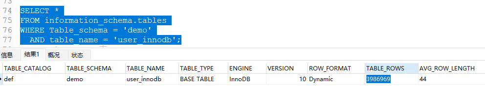

# count(1)、count(*)与count(列名) 的区别

<font style="color:rgba(0, 0, 0, 0.82);">面试SQL优化时可能会被问到 SQL Count（）的性能问题？</font>

<font style="color:rgba(0, 0, 0, 0.82);">首先可以看下 SQL 中，</font>`<font style="color:rgba(0, 0, 0, 0.82);">COUNT()</font>`<font style="color:rgba(0, 0, 0, 0.82);"> 函数用于统计行的数量。不同的用法 (</font>`<font style="color:rgba(0, 0, 0, 0.82);">COUNT(1)</font>`<font style="color:rgba(0, 0, 0, 0.82);">, </font>`<font style="color:rgba(0, 0, 0, 0.82);">COUNT(*)</font>`<font style="color:rgba(0, 0, 0, 0.82);">, </font>`<font style="color:rgba(0, 0, 0, 0.82);">COUNT(column_name)</font>`<font style="color:rgba(0, 0, 0, 0.82);">) 具有略有不同的行为和性能表现。以下是它们的具体区别：</font>

### <font style="color:rgba(0, 0, 0, 0.82);">1.</font><font style="color:rgba(0, 0, 0, 0.82);"> </font>`<font style="color:rgba(0, 0, 0, 0.82);">COUNT(1)</font>`
+ **<font style="color:rgba(0, 0, 0, 0.82);">功能</font>**<font style="color:rgba(0, 0, 0, 0.82);">：</font>
    - <font style="color:rgba(0, 0, 0, 0.82);">统计表中行的数量，包含所有行，不论行中的值是什么。</font>
+ **<font style="color:rgba(0, 0, 0, 0.82);">工作原理</font>**<font style="color:rgba(0, 0, 0, 0.82);">：</font>
    - <font style="color:rgba(0, 0, 0, 0.82);">每一行以常数</font><font style="color:rgba(0, 0, 0, 0.82);"> </font>`<font style="color:rgba(0, 0, 0, 0.82);">1</font>`<font style="color:rgba(0, 0, 0, 0.82);"> </font><font style="color:rgba(0, 0, 0, 0.82);">进行计算，即对于每一行都会计数一次，因此它的计算与</font><font style="color:rgba(0, 0, 0, 0.82);"> </font>`<font style="color:rgba(0, 0, 0, 0.82);">COUNT(*)</font>`<font style="color:rgba(0, 0, 0, 0.82);"> </font><font style="color:rgba(0, 0, 0, 0.82);">基本相同。</font>
+ **<font style="color:rgba(0, 0, 0, 0.82);">效率</font>**<font style="color:rgba(0, 0, 0, 0.82);">：</font>
    - <font style="color:rgba(0, 0, 0, 0.82);">在某些数据库实现中，</font>`<font style="color:rgba(0, 0, 0, 0.82);">COUNT(1)</font>`<font style="color:rgba(0, 0, 0, 0.82);"> </font><font style="color:rgba(0, 0, 0, 0.82);">的性能可能与</font><font style="color:rgba(0, 0, 0, 0.82);"> </font>`<font style="color:rgba(0, 0, 0, 0.82);">COUNT(*)</font>`<font style="color:rgba(0, 0, 0, 0.82);"> </font><font style="color:rgba(0, 0, 0, 0.82);">相同，因为二者在功能上是等效的。</font>

### <font style="color:rgba(0, 0, 0, 0.82);">2.</font><font style="color:rgba(0, 0, 0, 0.82);"> </font>`<font style="color:rgba(0, 0, 0, 0.82);">COUNT(*)</font>`
+ **<font style="color:rgba(0, 0, 0, 0.82);">功能</font>**<font style="color:rgba(0, 0, 0, 0.82);">：</font>
    - <font style="color:rgba(0, 0, 0, 0.82);">统计表中所有行的数量，包括所有列，无论列的值是否为 NULL。</font>
+ **<font style="color:rgba(0, 0, 0, 0.82);">工作原理</font>**<font style="color:rgba(0, 0, 0, 0.82);">：</font>
    - <font style="color:rgba(0, 0, 0, 0.82);">按行统计时，不考虑列的具体值和数据类型。</font>
+ **<font style="color:rgba(0, 0, 0, 0.82);">效率</font>**<font style="color:rgba(0, 0, 0, 0.82);">：</font>
    - <font style="color:rgba(0, 0, 0, 0.82);">是最常用的方法之一，特别是在 InnoDB 引擎中，</font><font style="color:rgba(0, 0, 0, 0.82);"> </font>`<font style="color:rgba(0, 0, 0, 0.82);">COUNT(*)</font>`<font style="color:rgba(0, 0, 0, 0.82);"> </font><font style="color:rgba(0, 0, 0, 0.82);">通常是最优的计数形式，因为它被优化为直接统计数据页上的数目。</font>

### <font style="color:rgba(0, 0, 0, 0.82);">3.</font><font style="color:rgba(0, 0, 0, 0.82);"> </font>`<font style="color:rgba(0, 0, 0, 0.82);">COUNT(column_name)</font>`
+ **<font style="color:rgba(0, 0, 0, 0.82);">功能</font>**<font style="color:rgba(0, 0, 0, 0.82);">：</font>
    - <font style="color:rgba(0, 0, 0, 0.82);">统计指定列中非 NULL 值的行数。</font>
+ **<font style="color:rgba(0, 0, 0, 0.82);">工作原理</font>**<font style="color:rgba(0, 0, 0, 0.82);">：</font>
    - <font style="color:rgba(0, 0, 0, 0.82);">只计数该列中有非 NULL 值的行。因此，如果某行在</font><font style="color:rgba(0, 0, 0, 0.82);"> </font>`<font style="color:rgba(0, 0, 0, 0.82);">column_name</font>`<font style="color:rgba(0, 0, 0, 0.82);"> </font><font style="color:rgba(0, 0, 0, 0.82);">中的值为 NULL，则不会计入总数。</font>
+ **<font style="color:rgba(0, 0, 0, 0.82);">适用场景</font>**<font style="color:rgba(0, 0, 0, 0.82);">：</font>
    - <font style="color:rgba(0, 0, 0, 0.82);">用于需要过滤掉 NULL 值时，例如，统计某个特定字段有值的记录数。</font>

### <font style="color:rgba(0, 0, 0, 0.82);">性能对比</font>
+ <font style="color:rgba(0, 0, 0, 0.82);">现代数据库通常对</font><font style="color:rgba(0, 0, 0, 0.82);"> </font>`<font style="color:rgba(0, 0, 0, 0.82);">COUNT(*)</font>`<font style="color:rgba(0, 0, 0, 0.82);"> </font><font style="color:rgba(0, 0, 0, 0.82);">和</font><font style="color:rgba(0, 0, 0, 0.82);"> </font>`<font style="color:rgba(0, 0, 0, 0.82);">COUNT(1)</font>`<font style="color:rgba(0, 0, 0, 0.82);"> </font><font style="color:rgba(0, 0, 0, 0.82);">进行了优化，因此二者性能基本相似。</font>
+ `<font style="color:rgba(0, 0, 0, 0.82);">COUNT(column_name)</font>`<font style="color:rgba(0, 0, 0, 0.82);"> </font><font style="color:rgba(0, 0, 0, 0.82);">可能较慢一些，特别是当列中有大量 NULL 值时，因为需要遍历和检查每一个值。</font>

### <font style="color:rgba(0, 0, 0, 0.82);">用法选择</font>
+ **<font style="color:rgba(0, 0, 0, 0.82);">大多数情况下</font>**<font style="color:rgba(0, 0, 0, 0.82);">：</font>`<font style="color:rgba(0, 0, 0, 0.82);">COUNT(*)</font>`<font style="color:rgba(0, 0, 0, 0.82);"> </font><font style="color:rgba(0, 0, 0, 0.82);">是首选，因为它清晰明了并且通常是经过优化的。</font>
+ **<font style="color:rgba(0, 0, 0, 0.82);">特定需求</font>**<font style="color:rgba(0, 0, 0, 0.82);">：当需要统计去除 NULL 值的特定列的值，只用</font><font style="color:rgba(0, 0, 0, 0.82);"> </font>`<font style="color:rgba(0, 0, 0, 0.82);">COUNT(column_name)</font>`<font style="color:rgba(0, 0, 0, 0.82);">。</font>

### <font style="color:rgba(0, 0, 0, 0.82);">小结</font>
<font style="color:rgba(0, 0, 0, 0.82);">选择 </font>`<font style="color:rgba(0, 0, 0, 0.82);">COUNT(*)</font>`<font style="color:rgba(0, 0, 0, 0.82);">、</font>`<font style="color:rgba(0, 0, 0, 0.82);">COUNT(1)</font>`<font style="color:rgba(0, 0, 0, 0.82);"> 或 </font>`<font style="color:rgba(0, 0, 0, 0.82);">COUNT(column_name)</font>`<font style="color:rgba(0, 0, 0, 0.82);"> 应基于具体需求。如果只是需要统计总行数，可以使用 </font>`<font style="color:rgba(0, 0, 0, 0.82);">COUNT(*)</font>`<font style="color:rgba(0, 0, 0, 0.82);">。如果需要忽略某列中的 NULL 值，则需使用 </font>`<font style="color:rgba(0, 0, 0, 0.82);">COUNT(column_name)</font>`<font style="color:rgba(0, 0, 0, 0.82);">。它们之间选取的重要依据在于是否需要忽略 NULL 值及所用数据库的优化情况。</font>

<font style="color:rgba(0, 0, 0, 0.82);"></font>

### 面试可能追问 count（*）很慢，具体如何提升性能？
#### 1.首先要根据业务 数据量和过滤条件 来分析。
比如4000000数据量无过滤条件时间差不多。


如果业务需要的统计结果不需要特别精确

可以用 **explain**关键字 看filter 大概多少行，或者查询系统表** information_schema.tables。**

**实例:这个存在误差但查询非常快。**

```java
EXPLAIN SELECT COUNT(*) FROM user_innodb where id>0;

SELECT *
FROM information_schema.tables
WHERE Table_schema = 'demo'
  AND table_name = 'user_innodb';
```

查询结果：




#### 2，explain分析sql看是否有优化的余地，最好能走主键索引。
通过上面explain可以看到 key走的不是primary ，加上过滤条件id>0速度能提升一截


#### 3，分批查询或者数据分片汇总统计
<font style="color:rgb(77, 77, 77);">如果查询的结果集很大，可以考虑将查询分批进行，每次查询一部分数据，然后累加结果。这样可以减少单次查询的数据量，提高查询速度。</font>

<font style="color:rgb(77, 77, 77);">如果数据量非常大，可以考虑将数据进行分片存储，将数据分散到多个表或数据库中。这样可以将查询的数据量分散到多个节点上，提高查询性能。</font>

<font style="color:rgb(77, 77, 77);">4，</font>**<font style="color:rgb(77, 77, 77);">使用缓存或者直接新建统计表</font>**

<font style="color:rgb(77, 77, 77);">如果查询的结果不需要实时更新，可以将结果缓存在缓存中，避免每次查询都执行</font>`<font style="color:rgb(199, 37, 78);background-color:rgb(249, 242, 244);">COUNT(*)</font>`<font style="color:rgb(77, 77, 77);">操作。可以使用缓存技术如</font><font style="color:rgb(78, 161, 219) !important;">Redis</font><font style="color:rgb(77, 77, 77);">或</font>[<font style="color:rgb(252, 85, 49);">Memcached</font>](https://so.csdn.net/so/search?q=Memcached&spm=1001.2101.3001.7020)<font style="color:rgb(77, 77, 77);">来实现。</font>

这里需要考虑Redis持久化，以及双写一致性的问题。避免宕机等因素影响精确度

如果对缓存的统计还不满意，可以新建一张统计表

<font style="color:rgb(77, 77, 77);">如果是想精确的获取表的记录总数，我们可以将这个计数值保存到单独的一张计数表中。</font>

<font style="color:rgb(77, 77, 77);">当我们在数据表插入一条记录的同时，将计数表中的计数字段 + 1。也就是说，在新增和删除操作时，我们需要额外维护这个计数表。</font>


> 更新: 2025-02-20 14:07:41  
> 原文: <https://www.yuque.com/tulingzhouyu/db22bv/zxxswr2ounp9qd7k>