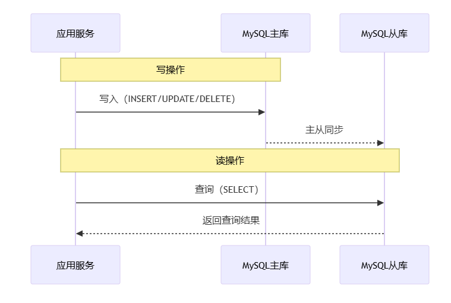
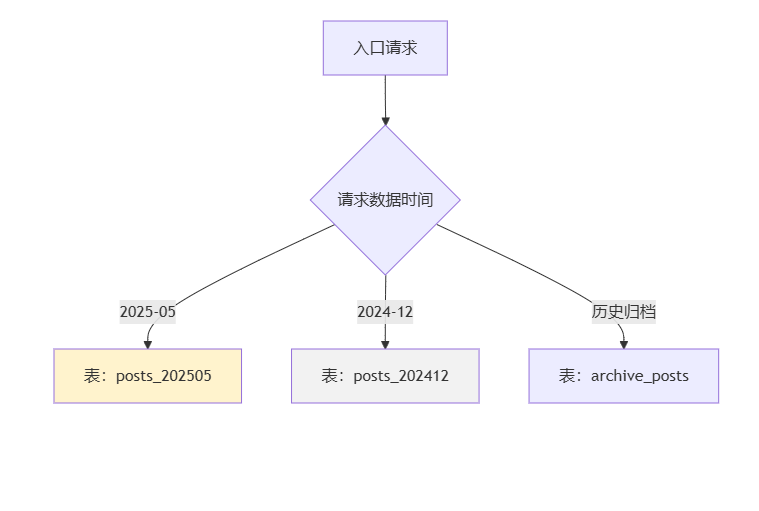
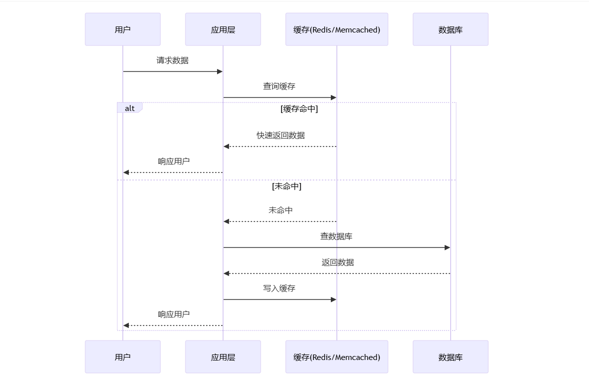

# 业务系统每天增加五万条以上数据预计运维三年怎么优化

### 前言
随着互联网业务的快速发展，数据量呈现爆发式增长。

对于发布系统来说，每天新增的数据超过五万条，三年下来累积的数据总量将达到数亿级别，如果缺乏恰当的设计与优化措施，数据库可能会因为查询速度慢、写入操作卡顿或是维护工作变得过于复杂而成为限制业务发展的瓶颈。  
面对这种快速增长且并发访问量高的应用场景，如何有效地对MySQL数据库进行优化以确保其能够持续稳定地运行呢？

本文将为您介绍七个实用的优化技巧，帮助您的系统更加轻松地应对大规模数据处理的需求。希望这些策略能为您的项目带来实质性的帮助！

---

### 设计良好的数据库结构，允许部分数据冗余，尽量避免 JOIN 查询，提高效率
高并发、海量数据场景下，表结构设计一定要面向查询高效和维护简单。

可以适当允许部分数据冗余，把常用信息直接冗余到主表，避免复杂的多表 JOIN 导致性能下降。

比如发布信息表可冗余部分用户信息字段（如用户名、昵称），加快单表查询速度。必要时用数据同步或触发器保障数据一致性。

### 选择合适的表字段数据类型和存储引擎，适当的添加索引
字段类型越精确越节省空间和提升性能，比如：

+ 整数选 int
+ 避免用 bigint
+ 定长字符串用 char
+ 长文本用 text

存储引擎推荐采用 InnoDB，它支持事务和高并发环境。

索引建议只加在高频查询条件、排序、分组字段，防止冗余索引拖慢写入效率。复合索引可结合实际业务查询需求设计。

### MySQL 库主从读写分离
部署主从架构，将写操作集中到主库，读操作分散到从库，可极大减轻单台服务器压力。

这样写入性能和读取扩展性都能得到保证。可以利用 MySQL 自身复制机制、读写分离中间件等进行实现。

但需注意读写延迟和一致性影响，部分业务流程仍需走主库。

### 找规律分表，减少单表中的数据量提高查询速度
随着数据的持续激增，要避免单表数据膨胀。

可以按时间（比如每月/每季度/每年分表）、业务类型、用户分段等规律拆表。

这样可以减小每个表的数据量，提高查询和维护效率，也便于历史数据归档和备份。

分表后要统一封装路由逻辑，简化应用维护。

### 添加缓存机制，比如 memcached，apc 等
对热点数据（如热门列表、详情页等）可使用 Redis、Memcached 等内存缓存中间件，大幅减少数据库访问压力，提高数据响应速度。

APC 等也能作为 PHP 的 Opcode 缓存提升应用端性能。

合理设置缓存失效机制，保持数据实时性和一致性，是保证高并发访问下服务稳定的关键。

### 不经常改动的页面，生成静态页面
对于不频繁变化的内容页，如公告、内容详情、帮助文档等，可在发布后由系统定时或按需生成静态HTML，前端直接从Web服务器加载，无需每次访问都请求数据库。

静态页面极大缓解高并发场景下数据库和应用服务器的压力，提升页面响应速度和系统稳定性。

### 书写高效率的 SQL。比如 SELECT * FROM TABLE 改为 SELECT field_1, field_2, field_3 FROM TABLE
查询时应只获取业务所需字段，避免 SELECT * 带来不必要的数据传输和解析压力。

精确筛选条件，利用好索引；复杂查询可通过分步或者先放缓存里处理，避免全表扫描。配合 EXPLAIN 工具分析慢查询，不断优化 SQL 逻辑，让每次访问都物有所值。

---

### 总结
面对海量业务数据和长周期高并发运维，只要在表结构、字段、索引、主从分离、分表、缓存、静态化、SQL优化等多个维度系统思考和分步实施，MySQL 完全可以长期稳定支撑业务发展。

配合持续的监控与备份，一套强壮的数据服务体系才能真正落地，助力业务稳步成长。

> 更新: 2025-05-15 19:56:53  
> 原文: <https://www.yuque.com/tulingzhouyu/db22bv/zvr68p74fk5a4dnn>