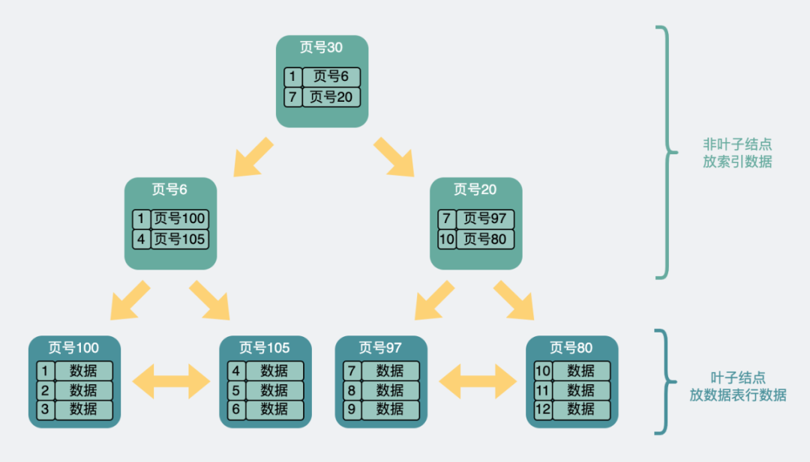
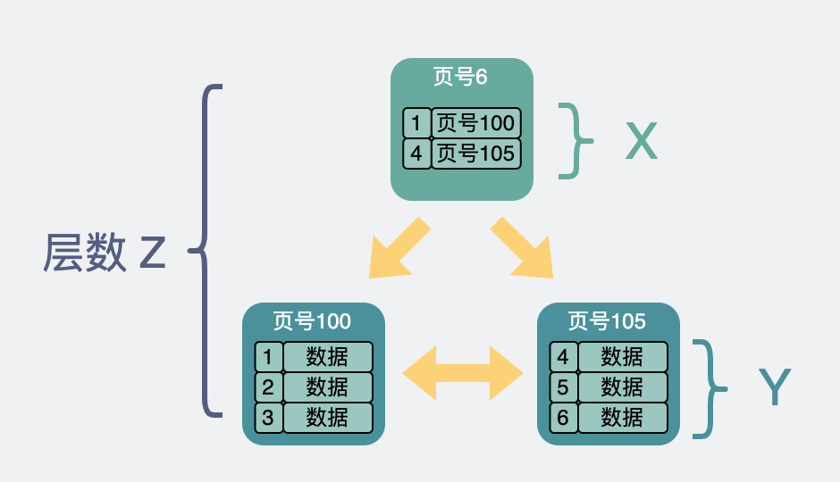
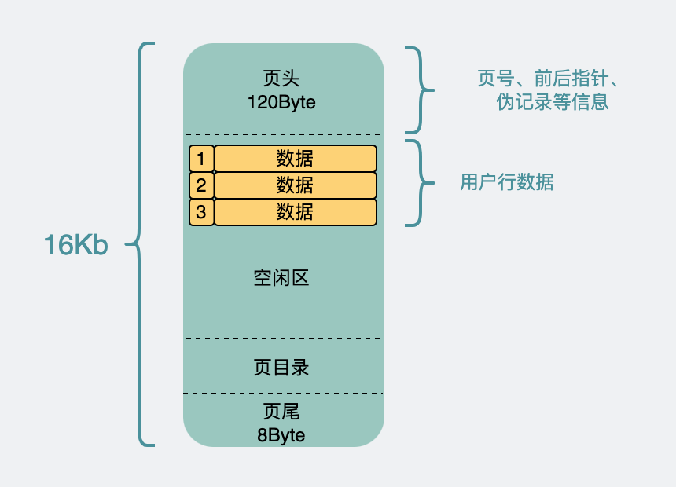
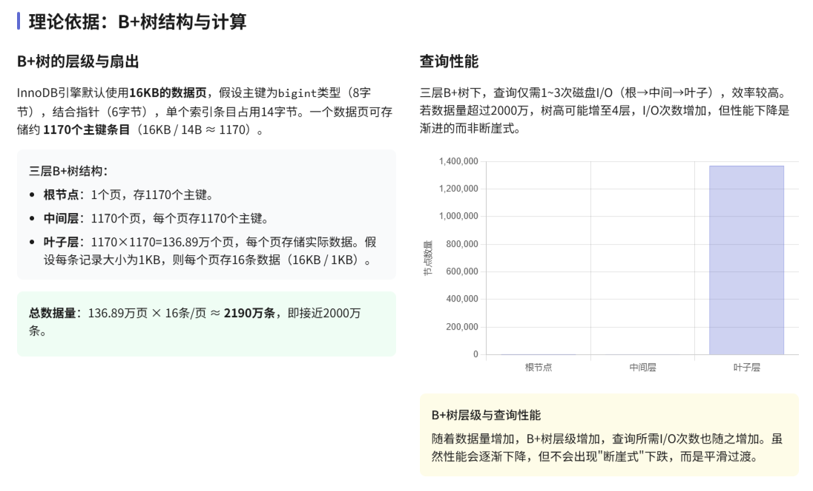
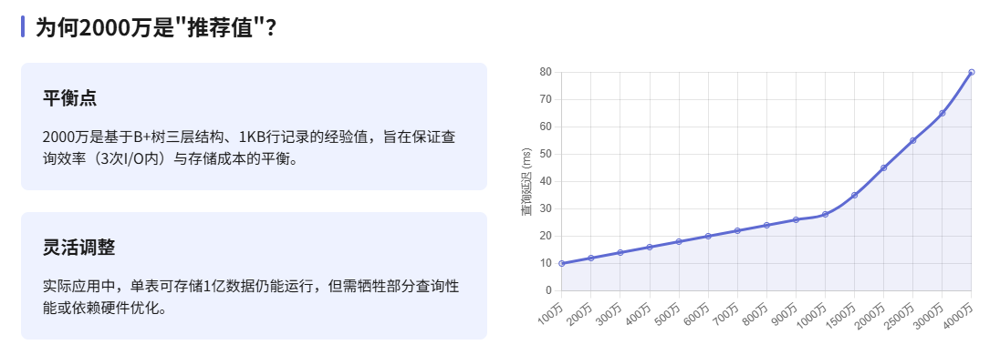
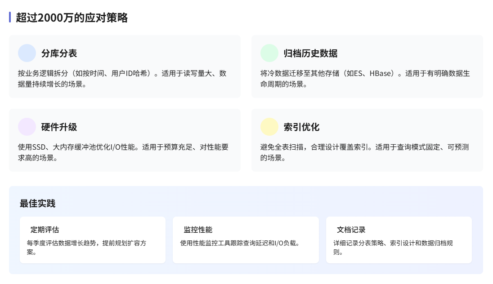

# 为什么还会有人认为MySQL单表不要超过2000W数据

关于MySQL单表建议最大两千万行的说法，其核心依据主要源于InnoDB存储引擎的B+树索引结构对查询性能的影响，以及实际业务维护的经验总结。以下是详细分析：

---

### **1. B+树索引结构限制**

InnoDB使用B+树组织数据，主键索引（聚簇索引）的叶子节点直接存储行数据。

B+树的高度直接影响查询效率，树越高，磁盘I/O次数越多。以下为具体计算：

#### **关键参数**

+ **页大小（Page Size）**：默认16KB（16384字节）。
+ **主键类型**：假设使用`BIGINT`（8字节）或`INT`（4字节）。
+ **指针大小**：InnoDB中每个页指针占6字节。
+ **单行数据大小**：假设行数据平均约1KB。

#### **计算过程**
1. **非叶子节点容量**  
每个非叶子节点存储主键值 + 指针。例如：
    - `BIGINT`主键：每个条目占 `8+6=14字节`。
    - 单页可存条目数：`16384 / 14 ≈ 1170条`。
2. **B+树高度与最大行数**
    - **高度为3时**：  
根页 + 1170个二级页 + 1170×1170个叶子页。  
叶子页总数：`1170 × 1170 ≈ 1.37M页`。  
若每页存储约15行（1KB/行）：总行数 `1.37M × 15 ≈ 20.5M`。
    - **高度为4时**：  
总行数飙升至 `1170^3 × 15 ≈ 24亿`，但查询需4次I/O，性能显著下降。

#### **为何建议两千万？**
+ **经验平衡点**：在高度为3时，若单页存储行数更少（如因大字段或行格式限制），总行数可能降至约2000万。
+ **性能拐点**：数据量接近B+树层级跃升临界值时（如从3层到4层），写入和范围查询效率会骤降。

---

### **2. 实际业务维护考量**
+ **查询延迟**：单表过大时，即使走索引，扫描少量数据也可能因磁盘寻址变慢。
+ **DDL操作风险**：修改表结构（如加列）需锁表或重建表，耗时与数据量正相关。
+ **备份与恢复**：大表备份时间长，故障恢复风险高。
+ **分库分表阈值**：提前规划水平拆分，避免性能恶化后紧急处理。

---

### **3. 其他影响因素**
+ **行溢出（Row Overflow）**：若单行数据超过页大小（如含`TEXT/BLOB`），部分数据存于额外页，导致有效单页行数减少。
+ **碎片化**：频繁增删导致页空间利用率低，实际容量小于理论值。
+ **辅助索引**：二级索引叶子节点存储主键值，过多索引会增加存储压力，间接影响主树性能。

---

### **总结**
+ **理论极限**：InnoDB单表可存储数十亿行，但性能会随B+树高度增加而下降。
+ **经验建议**：2000万行是平衡查询效率、维护成本后的经验值，尤其在主键为`BIGINT`、行大小适中的场景下。
+ **灵活调整**：实际阈值需根据硬件性能、数据访问模式（如冷热数据分离）动态评估。

---

### **优化建议**

> 更新: 2025-05-19 15:20:55  
> 原文: <https://www.yuque.com/tulingzhouyu/db22bv/pnba74buu7rzd3hw>