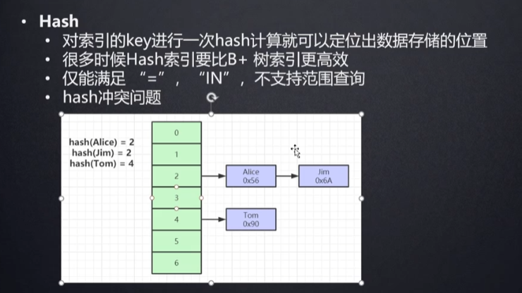

# 什么数据用hash存储

在诸葛老师的公开课中就讲到了， hash结构不支持范围查询，  所以哈希索引只能做等于查找，但是无论多大的Hash表，查找复杂度都是O(1)。

## 为什么范围不行：
+ 哈希算法将输入映射到一个固定大小的哈希值，不同的输入可能会产生相同的哈希值（哈希碰撞）。因此，哈希表并不保留输入数据的顺序，这使得进行范围查询（如`BETWEEN`、`>`、`<`等）变得非常困难。

> 更新: 2024-08-22 16:55:02  
> 原文: <https://www.yuque.com/tulingzhouyu/db22bv/pg4191un9az8nwdz>