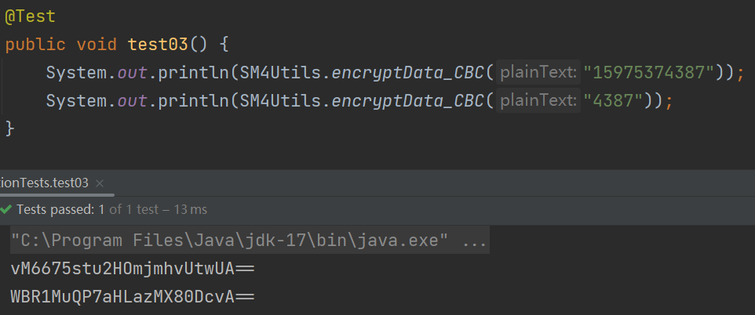

# 加密后的数据该如何支持模糊查询

在日常工作中，我们经常会有一些模糊查询的条件，比如说按照手机号模糊查询，或者是身份证号码。正常情况下我们可以使用

```plsql
select * from user where mobile like %123%
```

来模糊查询，但是这种方式是在你的手机号码没有加密的前提下，但是对于一些用户私密数据，我们在数据库都会进行加密保存。这时候有些人会说，那我把条件也加密，然后进行模糊查询不就可以了吗？事实真是这样吗？

看下面这个例子，我们将手机号进行加密，这时候我们要搜索手机前缀为136的手机号，这时候你讲条件进行加密，然后查询，你会发现，加密出来的是二个完全不一样的字符串，所以你根本就查不出来



## 方案一：**<font style="color:#404040;">内存解密</font>**(数据量少可用，数据量多不推荐)
第一种方案就是我们可以将所有数据都查询出来，然后在内存中将所有的手机号进行解密，然后在做一个匹配，这种方式优缺点也很明显

优点

+ 1：简单方便，没有复杂的实现逻辑

缺点

+ 1:每次查询都需要把整张表的数据都查询来，然后将所有的手机号进行解密
+ 2:如果数据量过大，就会导致OOM的异常

## 方案二：**<font style="color:#404040;">映射查询</font>**(解决了，又好像没解决)
我们现在是要按照手机号进行一个模糊查询，这时候我们可以建一张表，这张表就的字段有二个，一个是手机号，一个是手机号加密后的数据

```sql
id   mobile                mobileSm4                              userID
1    18912359512           vCWbXmNO7mAkIQEGLoVQwQ==                 1
2    15975374387           vM6675stu2HOmjmhvUtwUA==            			2
```

这时候比如我们要查询手机号前缀是 189 的数据，我们可以先查这张表 select userId from user_mobile where mobile like %189%

这时候就可以拿到对应的userId，然后再去用户表去查询我们需要的记录，看起来好像是解决了这个问题，但是仔细想想，我们的手机号还是没有加密存储，所以说好像是解决了这个问题，但是好像又没解决，手机号还是存在明文存储

## 方案三：加密函数
<font style="color:rgb(33, 33, 33);">在数据库中实现与程序一致的加解密算法，修改模糊查询条件，使用数据库加解密函数先解密再模糊查找，这样做的优点是实现成本低，开发使用成本低，只需要将以往的模糊查找稍微修改一下就可以实现，但是缺点也很明显，这样做无法利用数据库的索引来优化查询，甚至有一些数据库可能无法保证与程序实现一致的加解密算法，但是对于常规的加解密算法都可以保证与应用程序一致。</font>

<font style="color:rgb(33, 33, 33);">如果对查询性能要求不是特别高、对数据安全性要求一般，可以使用常见的加解密算法比如说</font>`<font style="color:rgb(255, 64, 129);background-color:rgb(245, 245, 245);">AES</font>`<font style="color:rgb(33, 33, 33);">、</font>`<font style="color:rgb(255, 64, 129);background-color:rgb(245, 245, 245);">DES</font>`<font style="color:rgb(33, 33, 33);">之类的也是一个不错的选择。</font>

<font style="color:rgb(33, 33, 33);">如果公司有自己的算法实现，并且没有提供多端的算法实现，要么找个算法好的人去研究吃透补全多端实现，要么放弃使用这个办法。</font>

## 方案四：**<font style="color:#404040;">分片加密</font>**(推荐)
密文检索的功能实现是根据4位英文字符（半角），2个中文字符（全角）为一个检索条件。将一个字段拆分为多个，

比如：taobao123  
使用4个字符为一组的加密方式。  
第一组 taob ，第二组aoba ，第三组obao ，第四组 bao1 … 依次类推  
如果需要检索 所有包含 检索条件4个字符的数据 比如：aoba ，加密字符后通过key like “%partial%” 查库。

我们的手机号是11位数，我们每4位作为一个分片

```java
public static void main(String[] args) {
    String mobile = "12345678765";
    int index = 0;
    for(;;) {
        String str = mobile.substring(index);
        if(str.length() < 4) {
            break;
        }
        String newStr = mobile.substring(index,index + 4);
        System.out.println(newStr);
        index ++;
    }
}

-- 拆分之后的数据
1234
2345
3456
4567
5678
6787
7876
8765
```

将拆分之后的每一个数据都进行加密

```java
public static void main(String[] args) {
    String mobile = "12345678765";
    int index = 0;
    for(;;) {
        String str = mobile.substring(index);
        if(str.length() < 4) {
            break;
        }
        String newStr = mobile.substring(index,index + 4);
        //加密
        System.out.println(Sm4Util.encryptData_CBC(newStr));
        index ++;
    }
}

-- 拆分之后加密的数据
idNOam3IjmehRDaTVhtc8Q==
JSZaoV2FXfxy97VpW48+mg==
D8+jZ+cXuWlctl5q96IymA==
GNcwg347Ae3OMsRSXy0Iig==
vhR1TaXEghAOdxkgcyUnqQ==
yEG9ny7XiKSsMnTjlX16Vw==
IArUjmhaUQ1GfXTy3JAK0Q==
bYgEnbR81a7NCcl3ikvGtQ==
```

这时候我们数据库就有一个手机号加密之后的扩展字段，如下

```plsql
id              mobile                                         mobileSm4                                     
1     CP8haVL+MgVhxzay2rAqEA==           idNOam3IjmehRDaTVhtc8Q==JSZaoV2FXfxy97VpW48+mg==D8+jZ+cXuWlctl5q96IymA==GNcwg347Ae3OMsRSXy0Iig==vhR1TaXEghAOdxkgcyUnqQ==yEG9ny7XiKSsMnTjlX16Vw==IArUjmhaUQ1GfXTy3JAK0Q==bYgEnbR81a7NCcl3ikvGtQ==
```

我们将拆分后的每一个分片加密后的数据进行拼接，最后保存到扩展字段里面去

那么在查询的时候，比如说查询 1365 ，这时候1365这个数据是我们之前可能存在的一个分片数据，将1365进行加密，然后在扩展字段中进行模糊查询即可

但是使用分片的话会有几个缺点

+ 比如我们现在手机号是按照4个数字进行分片，如果模糊查询的条件是136，三个数字，那么这时候就查不到了，当然如果你按照3个数字进行分片就可以了，但是不建议
+ 我们要增加扩展字段来保存分片数据，存储需要更大的空间

这是阿里文档给出的建议： [open.taobao.com/docV3.htm?d…](https://link.juejin.cn/?target=https%3A%2F%2Fopen.taobao.com%2FdocV3.htm%3FdocId%3D106213%26docType%3D1)


> 来自: 加密后的数据该如何支持模糊查询大家好
>


> 更新: 2024-10-21 21:25:43  
> 原文: <https://www.yuque.com/tulingzhouyu/db22bv/xgl9a1fah7cppdil>