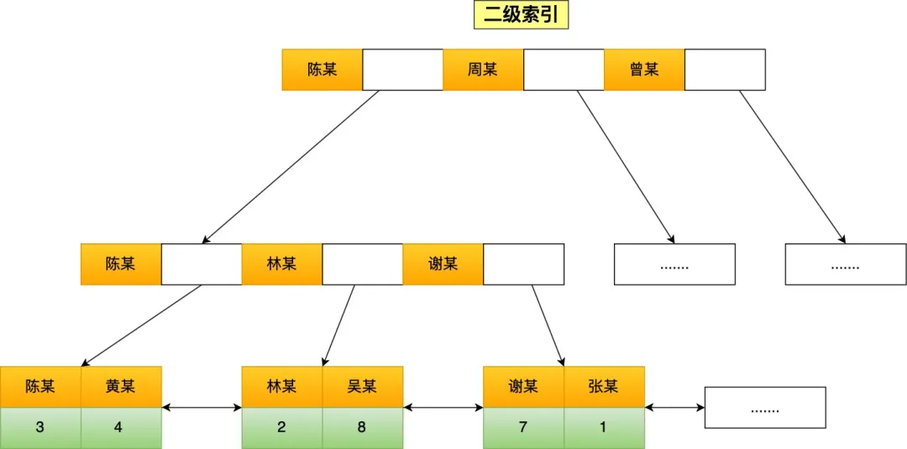
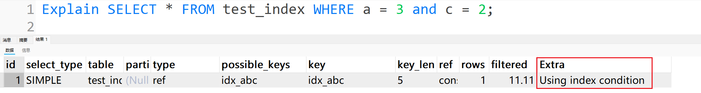

# 图解 MySQL 索引失效

<font style="color:rgba(6, 8, 31, 0.88);">在工作中，为了提高查询速度，我们通常会考虑为字段建立索引。然而，索引并不是万无一失的。即使建立了索引，并不意味着所有查询语句都能利用索引进行扫描。</font>

<font style="color:rgba(6, 8, 31, 0.88);">如果不加注意，某些查询语句可能会导致索引失效，进而导致全表扫描。虽然查询结果可能正确，但性能却会显著下降。</font>

<font style="color:rgba(6, 8, 31, 0.88);">今天，我们将探讨六种常见的索引失效场景，以帮助大家更好地优化查询性能。</font>


# 索引存储结构（<font style="color:#DF2A3F;">工欲善其事必先利其器</font><font style="color:rgba(6, 8, 31, 0.88);">）</font>
在讲解失效场景之前，需要知道**索引的存储结构**，才能更好的理解索引失效的问题。

<font style="color:rgba(6, 8, 31, 0.88);">索引的存储结构与 MySQL 所使用的存储引擎密切相关，因为存储引擎负责将数据持久化到磁盘，不同的引擎采用不同的索引数据结构。</font>

<font style="color:rgba(6, 8, 31, 0.88);">MySQL 的默认存储引擎为 InnoDB，它使用 B+ 树作为索引的数据结构。选择 B+ 树作为索引结构的原因在于其高效的查找和插入性能。</font>

<font style="color:rgba(6, 8, 31, 0.88);">在创建表时，InnoDB 存储引擎会默认创建主键索引，即聚簇索引，而其他的索引则为二级索引。</font>

<font style="color:rgba(6, 8, 31, 0.88);">与 InnoDB 不同，MyISAM 存储引擎支持多种索引数据结构，包括 B+ 树索引、R 树索引和全文索引。</font>

<font style="color:rgba(6, 8, 31, 0.88);">在 MyISAM 中，创建表时默认使用 B+ 树作为主键索引。</font>

<font style="color:rgba(6, 8, 31, 0.88);">尽管 InnoDB 和 MyISAM 都支持 B+ 树索引，但它们的数据存储结构实现不同：</font>

+ **<font style="color:rgba(6, 8, 31, 0.88);">InnoDB</font>**<font style="color:rgba(6, 8, 31, 0.88);">：B+ 树索引的叶子节点直接保存数据本身。</font>
+ **<font style="color:rgba(6, 8, 31, 0.88);">MyISAM</font>**<font style="color:rgba(6, 8, 31, 0.88);">：B+ 树索引的叶子节点保存数据的物理地址。</font>

<font style="color:rgba(6, 8, 31, 0.88);">接下来，将通过实例展示这两种存储引擎在索引存储结构上的区别。</font>

<font style="color:rgb(44, 62, 80);">这里有一张 t_user 表，其中 id 字段为主键索引，其他都是普通字段。</font>


## <font style="color:rgb(44, 62, 80);">MyISAM 存储引擎</font>
<font style="color:rgb(44, 62, 80);">B+ 树索引的叶子节点保存数据的物理地址，即用户数据的指针</font>


## <font style="color:rgb(44, 62, 80);">InnoDB 存储引擎</font>
<font style="color:rgb(44, 62, 80);">B+ 树索引的叶子节点保存数据本身</font>


<font style="color:rgba(6, 8, 31, 0.88);">InnoDB 存储引擎根据索引类型的不同，可分为</font>**<font style="color:rgba(6, 8, 31, 0.88);">聚簇索引</font>**<font style="color:rgba(6, 8, 31, 0.88);">和</font>**<font style="color:rgba(6, 8, 31, 0.88);">二级索引</font>**<font style="color:rgba(6, 8, 31, 0.88);">（上图展示了聚簇索引）。</font>

<font style="color:rgba(6, 8, 31, 0.88);">它们的主要区别在于</font>

+ **<font style="color:rgba(6, 8, 31, 0.88);">聚簇索引</font>**<font style="color:rgba(6, 8, 31, 0.88);">的叶子节点直接存储实际数据，包含所有完整的用户数据；</font>
+ **<font style="color:rgba(6, 8, 31, 0.88);">二级索引</font>**<font style="color:rgba(6, 8, 31, 0.88);">的叶子节点则存储主键值，而非实际数据。</font>

<font style="color:rgba(6, 8, 31, 0.88);">这种结构差异对数据检索性能有重要影响。</font>

<font style="color:rgb(44, 62, 80);">如果将 name 字段设置为普通索引，那么这个二级索引长下图这样</font>



```plsql
CREATE TABLE t_user (  
  id INT PRIMARY KEY,  
  name VARCHAR(255),  
  age INT,  
  address VARCHAR(255)  
);  

INSERT INTO t_user (id, name, age, address) VALUES  
(1, '张某', 26, '北京市海淀区'),  
(2, '林某', 18, '深圳市南山区'),  
(3, '陈某', 30, '广州市海珠区'),  
(4, '周某', 34, '深圳市南山区'),  
(5, '曾某', 25, '上海市松江区'),  
(6, '黄某', 28, '深圳市宝安区'),  
(7, '谢某', 38, '北京市海淀区'),  
(8, '钟某', 23, '广州市海珠区'),  
(9, '吴某', 28, '上海市浦东新区');  

ALTER TABLE t_user ADD INDEX idx_name (name);
```

<font style="color:rgba(6, 8, 31, 0.88);">了解了InnoDB存储引擎的聚簇索引和二级索引的存储结构后，我们来看几个查询示例，以理解查询过程中如何选择索引类型。</font>

### <font style="color:rgba(6, 8, 31, 0.88);">主键索引查询</font>
<font style="color:rgba(6, 8, 31, 0.88);">当我们使用主键索引字段进行查询时，如果数据在聚簇索引的叶子节点上，查询则会在B+树中直接找到对应的节点并读取数据。例如：</font>

```plsql
// id字段为主键索引  
SELECT * FROM t_user WHERE id=1;
```

### <font style="color:rgba(6, 8, 31, 0.88);">二级索引查询（</font><font style="color:rgba(6, 8, 31, 0.88);">回表与覆盖索引</font><font style="color:rgba(6, 8, 31, 0.88);">）</font>
<font style="color:rgba(6, 8, 31, 0.88);">使用二级索引字段查询时，若数据在聚簇索引的叶子节点上，查询需要检索两个B+树：</font>

1. <font style="color:rgba(6, 8, 31, 0.88);">首先在二级索引的B+树中找到叶子节点并获取主键值；</font>
2. <font style="color:rgba(6, 8, 31, 0.88);">然后使用主键值在聚簇索引的B+树中找到对应节点，读取数据。</font>

<font style="color:rgba(6, 8, 31, 0.88);">这个过程称为“</font>**<font style="color:rgba(6, 8, 31, 0.88);">回表</font>**<font style="color:rgba(6, 8, 31, 0.88);">”，例如：</font>

```plsql
// name字段为二级索引  
SELECT * FROM t_user WHERE name="林某";
```

<font style="color:rgba(6, 8, 31, 0.88);">如果查询数据在二级索引的叶子节点上，则只需在二级索引的B+树中找到节点并直接读取数据，这称为“</font>**<font style="color:rgba(6, 8, 31, 0.88);">覆盖索引</font>**<font style="color:rgba(6, 8, 31, 0.88);">”。例如：</font>

```plsql
// name字段为二级索引 
SELECT id FROM t_user WHERE name="林某";
```

<font style="color:rgba(6, 8, 31, 0.88);">以上查询示例展示了如何通过索引列进行条件查询，但这并不意味着每次查询都能有效利用索引。</font>

<font style="color:rgba(6, 8, 31, 0.88);">接下来，我们将探讨哪些情况下会导致索引失效，从而出现全表扫描的现象。</font>

**<font style="color:rgba(6, 8, 31, 0.88);">（</font>**<font style="color:rgba(6, 8, 31, 0.88);">所有演示都基于 </font>**<font style="color:rgb(44, 62, 80);">MySQL </font>**`**<font style="color:rgb(71, 101, 130);">8.2</font>**`**<font style="color:rgb(71, 101, 130);">）</font>**

# <font style="color:rgb(44, 62, 80);">索引失效场景</font>
## <font style="color:rgb(44, 62, 80);">对索引使用左或者左右模糊匹配</font>
<font style="color:rgba(6, 8, 31, 0.88);">在使用</font>`<font style="color:rgba(6, 8, 31, 0.88);">LIKE</font>`<font style="color:rgba(6, 8, 31, 0.88);">关键字进行模糊匹配时，如</font>`<font style="color:rgba(6, 8, 31, 0.88);">LIKE '%xx'</font>`<font style="color:rgba(6, 8, 31, 0.88);">或</font>`<font style="color:rgba(6, 8, 31, 0.88);">LIKE '%xx%'</font>`<font style="color:rgba(6, 8, 31, 0.88);">，都会导致索引失效，从而引发全表扫描。</font>

<font style="color:rgba(6, 8, 31, 0.88);">例如，以下查询用于查找名称以「林」结尾的用户：</font>

```plsql
// name字段为二级索引 
SELECT * FROM t_user WHERE name LIKE '%林';
```


<font style="color:rgba(6, 8, 31, 0.88);">在这个查询的执行计划中，</font>`<font style="color:rgba(6, 8, 31, 0.88);">type=ALL</font>`<font style="color:rgba(6, 8, 31, 0.88);">表示全表扫描，表明未使用索引。相反，如果查询名称以「林」开头的用户：</font>

```plsql
// name字段为二级索引 
SELECT * FROM t_user WHERE name LIKE '林%';
```


<font style="color:rgba(6, 8, 31, 0.88);">此时，执行计划中的</font>`<font style="color:rgba(6, 8, 31, 0.88);">type=range</font>`<font style="color:rgba(6, 8, 31, 0.88);">表示使用了索引，</font>`<font style="color:rgba(6, 8, 31, 0.88);">key=index_name</font>`<font style="color:rgba(6, 8, 31, 0.88);">则确认了实际使用了索引。</font>

<font style="color:rgba(6, 8, 31, 0.88);">那么，</font>**<font style="color:#DF2A3F;">为什么使用</font>**`**<font style="color:#DF2A3F;">LIKE</font>**`**<font style="color:#DF2A3F;">进行左模糊匹配会导致无法使用索引呢？</font>**

<font style="color:rgba(6, 8, 31, 0.88);">这是因为B+树索引是根据索引值有序存储的，仅能支持前缀比较。</font>


<font style="color:rgba(6, 8, 31, 0.88);">举个例子，假设我们查询以「林」为前缀的名称。查询过程如下：</font>

    1. <font style="color:rgba(6, 8, 31, 0.88);">比较首节点的索引值：若「林」的拼音在某些节点中 介于「陈」和「周」之间，则继续查找下一个节点。</font>
    2. <font style="color:rgba(6, 8, 31, 0.88);">依此类推，直到找到符合前缀的叶子节点，并读取相应数据。</font>

<font style="color:rgba(6, 8, 31, 0.88);">如果查询条件是</font>`<font style="color:rgba(6, 8, 31, 0.88);">LIKE '%林'</font>`<font style="color:rgba(6, 8, 31, 0.88);">，因无法确定从哪个索引值开始比较，导致必须进行全表扫描。</font>

## <font style="color:rgb(44, 62, 80);">对索引使用函数</font>
<font style="color:rgba(6, 8, 31, 0.88);">在使用MySQL时，我们常常依赖内置函数来获取所需的查询结果。</font>

<font style="color:rgba(6, 8, 31, 0.88);">然而，需要特别注意的是，如果在查询条件中对索引字段</font>**<font style="color:rgba(6, 8, 31, 0.88);">使用了函数，这通常会导致索引失效，从而导致全表扫描</font>**<font style="color:rgba(6, 8, 31, 0.88);">。</font>

<font style="color:rgba(6, 8, 31, 0.88);">例如，以下查询语句中，</font>`<font style="color:rgba(6, 8, 31, 0.88);">length(name)</font>`<font style="color:rgba(6, 8, 31, 0.88);">函数被应用于</font>`<font style="color:rgba(6, 8, 31, 0.88);">name</font>`<font style="color:rgba(6, 8, 31, 0.88);">字段。</font>

<font style="color:rgba(6, 8, 31, 0.88);">在执行计划中，如果显示</font>`<font style="color:rgba(6, 8, 31, 0.88);">type=ALL</font>`<font style="color:rgba(6, 8, 31, 0.88);">，这意味着数据库必须扫描整个表来满足查询条件：</font>

```plsql
-- name字段为二级索引  
SELECT * FROM t_user WHERE LENGTH(name) = 2;
```


<font style="color:rgba(6, 8, 31, 0.88);">那么，</font>**<font style="color:#DF2A3F;">为什么在对索引使用函数时会出现这种情况呢？</font>**

<font style="color:rgba(6, 8, 31, 0.88);">关键在于，索引存储的是字段的原始值，而不是经过函数处理后的计算结果，这使得数据库无法有效利用索引。</font>

<font style="color:rgba(6, 8, 31, 0.88);">不过，从MySQL 8.0版本开始，数据库引入了函数索引这一特性，允许我们针对函数计算结果建立索引。也就是说，索引的值可以是某个函数计算后的结果，这样就可以通过索引来快速查询所需数据。</font>

<font style="color:rgba(6, 8, 31, 0.88);">例如，我们可以使用以下语句创建一个名为</font>`<font style="color:rgba(6, 8, 31, 0.88);">idx_name_length</font>`<font style="color:rgba(6, 8, 31, 0.88);">的索引，该索引对应于</font>`<font style="color:rgba(6, 8, 31, 0.88);">length(name)</font>`<font style="color:rgba(6, 8, 31, 0.88);">的计算结果：</font>

```plsql
ALTER TABLE t_user ADD KEY idx_name_length ((LENGTH(name)));
```


<font style="color:rgba(6, 8, 31, 0.88);">在这种情况下，当我们使用类似的查询时，数据库将能够利用索引来加速查询过程。</font>

## <font style="color:rgb(44, 62, 80);">对索引进行表达式计算</font>
<font style="color:rgba(6, 8, 31, 0.88);">在查询条件中进行表达式计算通常会导致无法使用索引。</font>

<font style="color:rgba(6, 8, 31, 0.88);">举个例子，以下查询语句在执行计划中显示为类型 </font>`<font style="color:rgba(6, 8, 31, 0.88);">ALL</font>`<font style="color:rgba(6, 8, 31, 0.88);">，表明使用了全表扫描：</font>

```plsql
EXPLAIN SELECT * FROM t_user WHERE id + 1 = 10;
```


<font style="color:rgba(6, 8, 31, 0.88);">然而，如果将查询条件修改为</font><font style="color:rgba(6, 8, 31, 0.88);"> </font>`<font style="color:rgba(6, 8, 31, 0.88);">WHERE id = 10 - 1</font>`<font style="color:rgba(6, 8, 31, 0.88);">，则可以利用索引进行查询。</font>


**<font style="color:#DF2A3F;">为什么表达式计算会使索引失效呢？</font>**

<font style="color:rgba(6, 8, 31, 0.88);">原因与对索引使用函数类似，索引中保存的是字段的原始值，而不是经过计算的结果，因此数据库必须先取出字段所有的值，然后逐个进行计算，从而导致全表扫描。</font>

## <font style="color:rgb(44, 62, 80);">对索引隐式类型转换</font>
如果索引字段是字符串类型，但是在条件查询中，输入的参数是整型的话，查看执行计划结果可以发现这条语句会走全表扫描。

<font style="color:rgba(6, 8, 31, 0.88);">在</font>`<font style="color:rgba(6, 8, 31, 0.88);">t_user</font>`<font style="color:rgba(6, 8, 31, 0.88);">表中，我增加了一个</font>`<font style="color:rgba(6, 8, 31, 0.88);">phone</font>`<font style="color:rgba(6, 8, 31, 0.88);">字段，该字段为二级索引，类型为</font>`<font style="color:rgba(6, 8, 31, 0.88);">VARCHAR</font>`<font style="color:rgba(6, 8, 31, 0.88);">。</font>

```plsql
-- 增加 phone 字段并设置为二级索引  
ALTER TABLE t_user   
ADD COLUMN phone VARCHAR(30),  
ADD INDEX idx_phone (phone);  

-- 更新 phone 字段的数据示例  
UPDATE t_user SET phone = CONCAT('1880000000', id);   
```

<font style="color:rgba(6, 8, 31, 0.88);">在进行条件查询时，如果使用整型作为输入参数，如执行以下SQL：</font>

```plsql
SELECT * FROM t_user WHERE phone = 18800000001;
```


<font style="color:rgba(6, 8, 31, 0.88);">则执行计划显示类型为</font>`<font style="color:rgba(6, 8, 31, 0.88);">ALL</font>`<font style="color:rgba(6, 8, 31, 0.88);">，这意味着会进行全表扫描。</font>

<font style="color:rgba(6, 8, 31, 0.88);">然而，如果索引字段是整型，即使查询条件中使用字符串类型的参数，索引依然能够正常生效。例如，执行以下SQL：</font>

```plsql
EXPLAIN SELECT * FROM t_user WHERE id = '1';
```


<font style="color:rgba(6, 8, 31, 0.88);">在这种情况下，查询仍然会走索引扫描。</font>

<font style="color:rgba(6, 8, 31, 0.88);">这引发了一个问题：</font>**<font style="color:#DF2A3F;">为何第一个例子导致索引失效，而第二个例子却没有？</font>**

<font style="color:rgba(6, 8, 31, 0.88);">要理解这一点，我们首先需要掌握MySQL的数据类型转换规则，它决定了在比较字符串和数字时，哪个会被转换。</font>

<font style="color:rgba(6, 8, 31, 0.88);">用一个简单的方法来测试这一规则：选择 </font>`<font style="color:rgba(6, 8, 31, 0.88);">SELECT "10" > 9</font>`<font style="color:rgba(6, 8, 31, 0.88);">。</font>

+ <font style="color:rgba(6, 8, 31, 0.88);">如果MySQL会自动将字符串转换为数字，那么这相当于执行 </font>`<font style="color:rgba(6, 8, 31, 0.88);">SELECT 10 > 9</font>`<font style="color:rgba(6, 8, 31, 0.88);">，结果应该是1，因为数字10确实大于9。</font>
+ <font style="color:rgba(6, 8, 31, 0.88);">如果MySQL会将数字转换为字符串，那么这相当于执行 </font>`<font style="color:rgba(6, 8, 31, 0.88);">SELECT "10" > "9"</font>`<font style="color:rgba(6, 8, 31, 0.88);">。在这种情况下，字符串比较是逐位进行的，按照ASCII码进行比较。首先比较字符“1”和“9”，由于“1”的ASCII码小于“9”，所以结果应该是0。</font>


<font style="color:rgba(6, 8, 31, 0.88);">根据测试结果，可以知道</font>**<font style="color:#DF2A3F;">MySQL在比较时，会将字符串转换为数字</font>**<font style="color:rgba(6, 8, 31, 0.88);">。</font>

**<font style="color:rgba(6, 8, 31, 0.88);">回到第一个查询：</font>**

```plsql
SELECT * FROM t_user WHERE phone = 18800000001;
```

<font style="color:rgba(6, 8, 31, 0.88);">这里</font>`<font style="color:rgba(6, 8, 31, 0.88);">phone</font>`<font style="color:rgba(6, 8, 31, 0.88);">字段是字符串，因此MySQL会将其自动转换为数字，相当于执行：</font>

```plsql
SELECT * FROM t_user WHERE phone = 18800000001;
等同于:
SELECT * FROM t_user WHERE CAST(phone AS SIGNED) = 18800000001;
```

<font style="color:rgba(6, 8, 31, 0.88);">如上所示，</font>`**<font style="color:rgba(6, 8, 31, 0.88);">CAST</font>**`**<font style="color:rgba(6, 8, 31, 0.88);">函数在</font>**`**<font style="color:rgba(6, 8, 31, 0.88);">phone</font>**`**<font style="color:rgba(6, 8, 31, 0.88);">字段上被应用</font>**<font style="color:rgba(6, 8, 31, 0.88);">，这就导致了对索引的使用失效。</font>

**<font style="color:rgba(6, 8, 31, 0.88);">而在第二个例子中：</font>**

```plsql
SELECT * FROM t_user WHERE id = '1';
```

`<font style="color:rgba(6, 8, 31, 0.88);">id</font>`<font style="color:rgba(6, 8, 31, 0.88);">字段是整型，字符串参数也需要转换为数字，相当于执行：</font>

```plsql
SELECT * FROM t_user WHERE id = '1';
等同于:
SELECT * FROM t_user WHERE id = CAST('1' AS SIGNED);
```

<font style="color:rgba(6, 8, 31, 0.88);">在这种情况下，</font>`**<font style="color:rgba(6, 8, 31, 0.88);">CAST</font>**`**<font style="color:rgba(6, 8, 31, 0.88);">函数应用于输入参数</font>**<font style="color:rgba(6, 8, 31, 0.88);">，确保了索引的有效使用，从而实现索引扫描。</font>

## <font style="color:rgb(44, 62, 80);">联合索引非最左匹配</font>
<font style="color:rgba(6, 8, 31, 0.88);">在数据库索引中，对主键字段建立的索引称为</font>**<font style="color:rgba(6, 8, 31, 0.88);">聚簇索引</font>**<font style="color:rgba(6, 8, 31, 0.88);">，而对普通字段建立的索引则称为</font>**<font style="color:rgba(6, 8, 31, 0.88);">二级索引</font>**<font style="color:rgba(6, 8, 31, 0.88);">。</font>

<font style="color:rgba(6, 8, 31, 0.88);">当</font>**<font style="color:rgba(6, 8, 31, 0.88);">多个普通字段组合</font>**<font style="color:rgba(6, 8, 31, 0.88);">在一起创建索引时，称为</font>**<font style="color:rgba(6, 8, 31, 0.88);">联合索引</font>**<font style="color:rgba(6, 8, 31, 0.88);">（或组合索引）。</font>

<font style="color:rgba(6, 8, 31, 0.88);">创建联合索引时，字段的顺序至关重要。例如，联合索引 (a, b, c) 与 (c, b, a) 在使用时会有显著不同。为了有效利用联合索引，必须遵循最左匹配原则，即查询条件必须从最左边的字段开始匹配。</font>

<font style="color:rgba(6, 8, 31, 0.88);">例如，对于 (a, b, c) 的联合索引 ，以下查询能够成功匹配联合索引：</font>

+ `<font style="color:rgba(6, 8, 31, 0.88);">WHERE a=3</font>`
+ `<font style="color:rgba(6, 8, 31, 0.88);">WHERE a=3 AND b=5 AND c=4</font>`
+ `<font style="color:rgba(6, 8, 31, 0.88);">WHERE a=3 AND b=5</font>`

<font style="color:rgba(6, 8, 31, 0.88);">然而，若查询条件不符合最左匹配原则，索引将失效，如以下查询：</font>

+ `<font style="color:rgba(6, 8, 31, 0.88);">WHERE b=5</font>`
+ `<font style="color:rgba(6, 8, 31, 0.88);">WHERE c=4</font>`
+ `<font style="color:rgba(6, 8, 31, 0.88);">WHERE b=5 AND c=4</font>`

<font style="color:rgba(6, 8, 31, 0.88);">还有一种特殊情况是 </font>`<font style="color:rgba(6, 8, 31, 0.88);">WHERE a=3 AND c=4</font>`<font style="color:rgba(6, 8, 31, 0.88);">。特殊之处在于不同版本的 MySQL，处理方法有所不同。</font>

+ <font style="color:rgba(6, 8, 31, 0.88);">在 MySQL 5.5 中，虽然会使用索引定位到主键，但仍需回表读取数据。</font>
+ <font style="color:rgba(6, 8, 31, 0.88);">而自 MySQL 5.6 以来，引入的</font>**<font style="color:rgba(6, 8, 31, 0.88);">索引下推功能</font>**<font style="color:rgba(6, 8, 31, 0.88);">使得条件判断在存储引擎层进行，从而减少了回表次数，提高了性能。</font>

```plsql
CREATE TABLE test_index (  
    id INT AUTO_INCREMENT PRIMARY KEY,  
    a INT,  
    b INT,  
    c INT,  
    d INT,  
    e INT,  
    f INT,  
    INDEX idx_abc (a, b, c)  
);

INSERT INTO test_index (a, b, c, d, e, f) VALUES  
(1, 10, 100, 5, 15, 25),  
(2, 20, 200, 6, 16, 26),  
(3, 5, 4, 7, 17, 27),  
(4, 40, 400, 8, 18, 28),  
(5, 50, 500, 9, 19, 29),  
(6, 60, 600, 10, 20, 30),  
(7, 70, 700, 11, 21, 31),  
(8, 80, 800, 12, 22, 32),  
(9, 90, 900, 13, 23, 33);
```

```plsql
// 联合索引 (a, b, c) 
SELECT * FROM test_index WHERE a = 3 and c = 2;
```



<font style="color:rgba(6, 8, 31, 0.88);">例如，通过执行计划中的 </font>`<font style="color:rgba(6, 8, 31, 0.88);">Extra=Using index condition</font>`<font style="color:rgba(6, 8, 31, 0.88);"> 可以确认索引下推的使用。</font>

**<font style="color:#DF2A3F;">为什么联合索引不遵循最左匹配原则就会失效？</font>**

**<font style="color:rgba(6, 8, 31, 0.88);">联合索引内部的排序是基于第一列。只有当第一列的数据相同，才会依据第二列排序。</font>**

<font style="color:rgba(6, 8, 31, 0.88);">因此，若希望利用联合索引中尽可能多的列，查询条件中的各列必须从最左侧开始连续匹配。</font>

## <font style="color:rgb(44, 62, 80);">WHERE 子句中的 OR</font>
<font style="color:rgba(6, 8, 31, 0.88);">如果在 </font>`<font style="color:rgba(6, 8, 31, 0.88);">WHERE</font>`<font style="color:rgba(6, 8, 31, 0.88);"> 子句中，</font>`<font style="color:rgba(6, 8, 31, 0.88);">OR</font>`<font style="color:rgba(6, 8, 31, 0.88);"> 前的条件列是索引列，而 </font>`<font style="color:rgba(6, 8, 31, 0.88);">OR</font>`<font style="color:rgba(6, 8, 31, 0.88);"> 后的条件列不是索引列，将会面临全表扫描的问题。</font>

<font style="color:rgba(6, 8, 31, 0.88);">举个例子，考虑以下查询语句：</font>

```plsql
// id 是主键且为索引列，age 是普通列
SELECT * FROM t_user WHERE id = 1 OR age = 18;
```


<font style="color:rgba(6, 8, 31, 0.88);">执行计划显示，该查询会执行全表扫描，因为 </font>`<font style="color:rgba(6, 8, 31, 0.88);">OR</font>`<font style="color:rgba(6, 8, 31, 0.88);"> 的逻辑是，只需满足任一条件即可。</font>

<font style="color:rgba(6, 8, 31, 0.88);">因此，当有一个条件不使用索引时，索引的存在毫无意义。</font>

**<font style="color:#DF2A3F;">解决这个问题很简单</font>**<font style="color:rgba(6, 8, 31, 0.88);">：将 </font>`<font style="color:rgba(6, 8, 31, 0.88);">age</font>`<font style="color:rgba(6, 8, 31, 0.88);"> 字段设置为索引。这样，查询将会充分利用索引，避免全表扫描。</font>

```plsql
ALTER TABLE t_user ADD INDEX idx_age (age);  
```


<font style="color:rgba(6, 8, 31, 0.88);">优化后，如果执行计划变为“</font>`<font style="color:rgba(6, 8, 31, 0.88);">type=index merge</font>`<font style="color:rgba(6, 8, 31, 0.88);">”，则意味着数据库分别对 </font>`<font style="color:rgba(6, 8, 31, 0.88);">id</font>`<font style="color:rgba(6, 8, 31, 0.88);"> 和 </font>`<font style="color:rgba(6, 8, 31, 0.88);">age</font>`<font style="color:rgba(6, 8, 31, 0.88);"> 条件进行了索引扫描，并将结果合并，从而提高了查询效率。</font>

<font style="color:rgba(6, 8, 31, 0.88);">通过这种方式，可以显著提升查询性能，减少数据库的负载。</font>

# <font style="color:rgba(6, 8, 31, 0.88);">总结</font>
<font style="color:rgba(6, 8, 31, 0.88);">在数据库优化中，索引的有效使用至关重要。</font>

1. <font style="color:rgba(6, 8, 31, 0.88);">使用模糊匹配（如</font><font style="color:rgba(6, 8, 31, 0.88);"> </font>`<font style="color:rgba(6, 8, 31, 0.88);">LIKE %xx</font>`<font style="color:rgba(6, 8, 31, 0.88);"> </font><font style="color:rgba(6, 8, 31, 0.88);">或</font><font style="color:rgba(6, 8, 31, 0.88);"> </font>`<font style="color:rgba(6, 8, 31, 0.88);">LIKE %xx%</font>`<font style="color:rgba(6, 8, 31, 0.88);">）时，索引将失效。</font>
2. <font style="color:rgba(6, 8, 31, 0.88);">在查询条件中对索引列应用函数会导致索引失效。</font>
3. <font style="color:rgba(6, 8, 31, 0.88);">对索引列进行表达式计算同样无法使用索引。</font>
4. <font style="color:rgba(6, 8, 31, 0.88);">当字符串与数字进行比较时，MySQL会自动将字符串转换为数字，这种隐式类型转换会导致索引失效。</font>
5. <font style="color:rgba(6, 8, 31, 0.88);">联合索引的使用必须遵循最左匹配原则，否则会导致索引失效。</font>
6. <font style="color:rgba(6, 8, 31, 0.88);">在 WHERE 子句中，如果 OR 前的条件是索引列而 OR 后的条件不是，索引也会失效。</font>


> 更新: 2025-02-20 21:03:31  
> 原文: <https://www.yuque.com/tulingzhouyu/db22bv/vc3am3g8ptaty3ky>