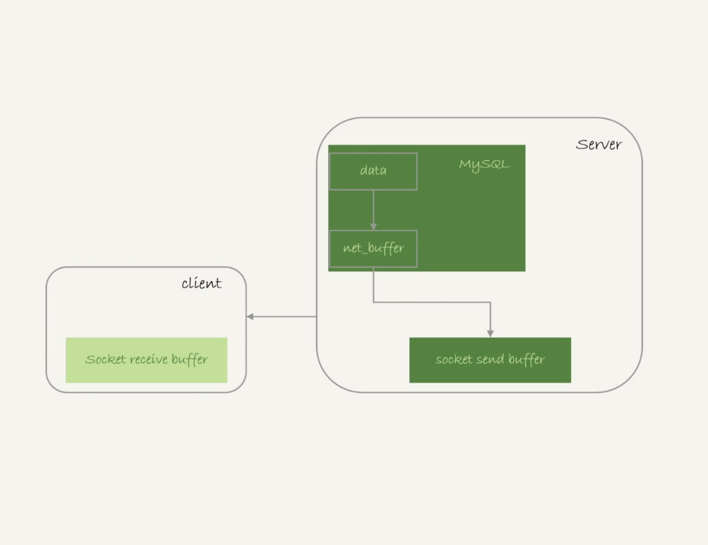
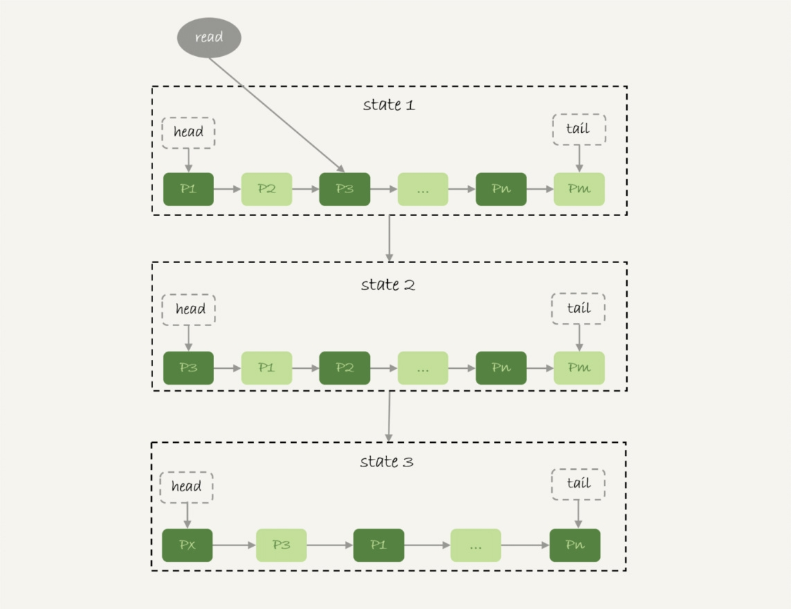
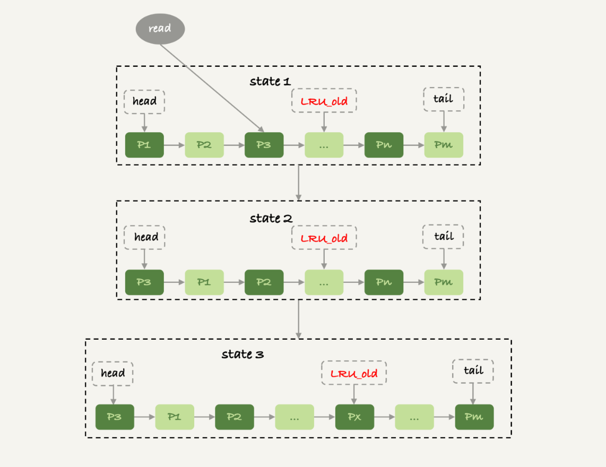

# 我查这么多数据，会不会把数据库内存打爆？

最近被问到这样一个问题：我的主机内存只有100G，现在要对一个200G的大表做全表扫描，会不会把数据库主机的内存用光了？

顿时有点无语，很明显不会啊，MySQL 逻辑备份就是做整库扫描，如果这样就会把内存吃光，逻辑备份不是早就挂了，那为什么不会打爆呢？

### 全表扫描对server层的影响
假设，我们现在要对一个200G的InnoDB表db1. t，执行一个全表扫描。当然，你要把扫描结果保存在客户端，会使用类似这样的命令：

```plsql
select * from db1.t > $target_file
```

InnoDB的整行数据是保存在主键索引上的，所以全表扫描实际上是直接扫描表t的主键索引。这条查询语句由于没有其他的判断条件，所以查到的每一行都可以直接放到结果集里面，然后返回给客户端。

那么，这个“结果集”存在哪里呢？

实际上，服务端并不需要保存一个完整的结果集。取数据和发数据的流程是这样的：

1. 获取一行，写到net_buffer中。这块内存的大小是由参数net_buffer_length定义的，默认是16k。
2. 重复获取行，直到net_buffer写满，调用网络接口发出去。
3. 如果发送成功，就清空net_buffer，然后继续取下一行，并写入net_buffer。
4. 如果发送函数返回EAGAIN或WSAEWOULDBLOCK，就表示本地网络栈（socket send buffer）写满了，进入等待。直到网络栈重新可写，再继续发送。



从这个流程中，你可以看到：

1. 一个查询在发送过程中，占用的MySQL内部的内存最大就是net_buffer_length这么大，并不会达到200G；
2. socket send buffer 也不可能达到200G（默认定义/proc/sys/net/core/wmem_default），如果socket send buffer被写满，就会暂停读数据的流程。

也就是说，**MySQL是“边读边发的”**。这就意味着，如果客户端接收得慢，会导致MySQL服务端由于结果发不出去，这个事务的执行时间变长，但是不会导致数据库内存打爆。

### 全表扫描对InnoDB的影响
接着来看看，全表查询对innoDB的影响，

内存的数据页是在buffer pool中管理的，在WAL里 buffer pool 起到了加速更新的作用，同时也起到了加速查询。

比如更新了一个SQL，但是由于WAL机制，数据先是写到buffer pool中，然后磁盘的数据还是旧的，如果这个时候来了一个查询，那么就会直接从buffer pool中直接读取数据返回，可以加速读的作用。

可以通过 show engine innodb status 显示当前的命中率。

InnoDB Buffer Pool 的大小是由参数 innodb_buffer_pool_size 确定的，一般建议设置成可用物理内存的 60%~80%。

```plsql
show variables like '%innodb_buffer_pool_size%';
```

<font style="color:rgb(77, 77, 77);">但是数据是远远超过物理内存的，这个时候如果一个 Buffer Pool 已经满了，还需要从磁盘读入一个数据页，那肯定是要淘汰一个旧数据页的，所以就有一定的淘汰算法，LRU。</font>



InnoDB管理Buffer Pool的LRU算法，是用链表来实现的。

1. 在上图的状态1里，链表头部是P1，表示P1是最近刚刚被访问过的数据页；假设内存里只能放下这么多数据页；
2. 这时候有一个读请求访问P3，因此变成状态2，P3被移到最前面；
3. 状态3表示，这次访问的数据页是不存在于链表中的，所以需要在Buffer Pool中新申请一个数据页Px，加到链表头部。但是由于内存已经满了，不能申请新的内存。于是，会清空链表末尾Pm这个数据页的内存，存入Px的内容，然后放到链表头部。
4. 从效果上看，就是最久没有被访问的数据页Pm，被淘汰了。

这个算法乍一看上去没什么问题，但是如果考虑到要做一个全表扫描，会不会有问题呢？

假设按照这个算法，我们要扫描一个200G的表，而这个表是一个历史数据表，平时没有业务访问它。

那么，按照这个算法扫描的话，就会把当前的Buffer Pool里的数据全部淘汰掉，存入扫描过程中访问到的数据页的内容。也就是说Buffer Pool里面主要放的是这个历史数据表的数据。

对于一个正在做业务服务的库，这可不妙。你会看到，Buffer Pool的内存命中率急剧下降，磁盘压力增加，SQL语句响应变慢。

所以，InnoDB不能直接使用这个LRU算法。实际上，InnoDB对LRU算法做了改进。



在InnoDB实现上，按照5:3的比例把整个LRU链表分成了young区域和old区域。图中LRU_old指向的就是old区域的第一个位置，是整个链表的5/8处。也就是说，靠近链表头部的5/8是young区域，靠近链表尾部的3/8是old区域。

改进后的LRU算法执行流程变成了下面这样。

1. 上图中状态1，要访问数据页P3，由于P3在young区域，因此和优化前的LRU算法一样，将其移到链表头部，变成状态2。
2. 之后要访问一个新的不存在于当前链表的数据页，这时候依然是淘汰掉数据页Pm，但是新插入的数据页Px，是放在LRU_old处。
3. 处于old区域的数据页，每次被访问的时候都要做下面这个判断：
    - 若这个数据页在LRU链表中存在的时间超过了1秒，就把它移动到链表头部；
    - 如果这个数据页在LRU链表中存在的时间短于1秒，位置保持不变。1秒这个时间，是由参数innodb_old_blocks_time控制的。其默认值是1000，单位毫秒。

这个策略，就是为了处理类似全表扫描的操作量身定制的。还是以刚刚的扫描200G的历史数据表为例，我们看看改进后的LRU算法的操作逻辑：

1. 扫描过程中，需要新插入的数据页，都被放到old区域;
2. 一个数据页里面有多条记录，这个数据页会被多次访问到，但由于是顺序扫描，这个数据页第一次被访问和最后一次被访问的时间间隔不会超过1秒，因此还是会被保留在old区域；
3. 再继续扫描后续的数据，之前的这个数据页之后也不会再被访问到，于是始终没有机会移到链表头部（也就是young区域），很快就会被淘汰出去。

可以看到，这个策略最大的收益，就是在扫描这个大表的过程中，虽然也用到了Buffer Pool，但是对young区域完全没有影响，从而保证了Buffer Pool响应正常业务的查询命中率。

### 小结
<font style="color:rgb(77, 77, 77);">结论是mysql采用边算边发的策略，查询很大的数据表，不会将内存打爆，而InnoDB引擎内部，有淘汰策略，并且对LRU进行了改进，对Buffer pool做到可控。</font>


> 更新: 2025-08-22 16:52:39  
> 原文: <https://www.yuque.com/tulingzhouyu/db22bv/gyr35qg99cq16zfq>