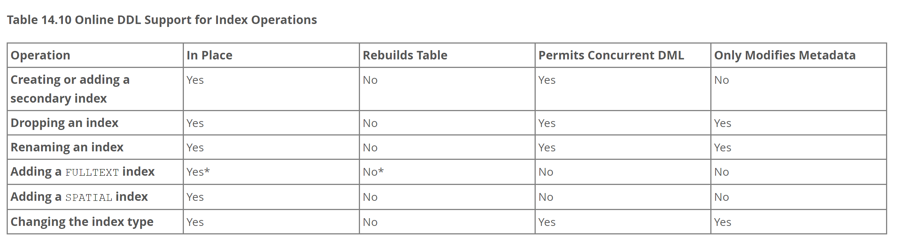

# 添加索引真的不会锁表吗？（online DDL）

# 1.MySQL DDL执行方式
<font style="color:rgb(100, 100, 100);">MySQL5.5以及之前的版本，通常更改数据表结构操作(DDL)会阻塞对表数据的增删改操作(DML)。</font>

<font style="color:rgb(100, 100, 100);">MySQL5.6提供Online DDL之后可支持DDL与DML操作同时执行，降低了DDL期间对业务延迟带来的影响。</font>

# 2.Online ddl：
### 概念：
在不中断现有数据读写操作的情况下，自动执行 DDL 语句 (例如创建、修改、删除表等) 的机制。Online DDL 可以在MySQL进行表空间或数据文件的变化时，自动执行 DDL 语句，从而避免了传统方式中，执行 DDL 语句时对数据库读写操作的干扰和中断。

### 执行过程：
Online ddl执行大致可分为三个阶段：初始化阶段、执行阶段和提交表定义阶段：  
**初始化阶段：**

+ 评估存储引擎能力与DDL语句
+ 评估<font style="color:rgb(36, 41, 47);">ALGORITHM</font><font style="color:rgb(36, 41, 47);"> 和 </font><font style="color:rgb(36, 41, 47);">LOCK</font><font style="color:rgb(36, 41, 47);"> </font>
+ <font style="color:rgb(36, 41, 47);">创建可升级的</font>**MDL读锁**

**执行阶段：**

+ 此阶段分为两个步骤**<font style="color:rgb(36, 41, 47);">准备</font>**<font style="color:rgb(36, 41, 47);">和</font>**<font style="color:rgb(36, 41, 47);">执行</font>**<font style="color:rgb(36, 41, 47);">DDL 语句</font>
+ 此阶段是否需要MDL写锁取决于**初始化阶段**评估的因素。如果需要MDL写锁的话，仅在**准备过程**会**短暂的使用MDL写锁**，然后**降级为MDL读锁**
+ DDL执行过程（最耗时）

**<font style="color:rgb(36, 41, 47);">提交表定义</font>****阶段：**

+ 此阶段会将**MDL读锁升级到MDL写锁**，此阶段一般较快，因此独占锁的时间也较短
+ 用新的表定义替换旧的表定义，**释放MDL锁**

### 用法：
```sql
ALTER TABLE scores ADD index idx_student_id (student_id) , ALGORITHM=INPLACE, LOCK=NONE;

ALTER TABLE scores ADD index idx_student_id (student_id) , ALGORITHM=COPY, LOCK=EXCLUSIVE;
```

### 参数：
<details class="lake-collapse"><summary id="u739e0a90"><span class="ne-text">ALGORITHM：</span></summary><p id="u71b77c4c" class="ne-p"><span class="ne-text">ALGORITHM=</span><span class="ne-text" style="color: rgb(36, 41, 47); font-size: 16px">DEFAULT：默认算法，使用最高效的算法</span></p><p id="uf2998919" class="ne-p"><span class="ne-text">ALGORITHM=INPLACE：在原表上进行更改，不需要生成临时表，不需要进行数据copy的过程。<br /></span><span class="ne-text">添加索引步骤：<br /></span><span class="ne-text">1.创建索引(二级索引)数据字典<br /></span><span class="ne-text">2.加共享表锁，禁止DML，允许查询<br /></span><span class="ne-text">3.读取聚簇索引，构造新的索引项，排序并插入新索引<br /></span><span class="ne-text">4.等待打开当前表的所有只读事务提交<br /></span><span class="ne-text">5.创建索引结束</span></p><p id="uf692d7ed" class="ne-p"><span class="ne-text"></span></p><p id="u225cd823" class="ne-p"><span class="ne-text">ALGORITHM=COPY：最原始的方式，通过临时表创建索引，需要多一倍存储，还有更多的IO（类似5.6版本之前的处理过程）<br /></span><span class="ne-text">添加索引步骤：<br /></span><span class="ne-text">1.新建带索引（主键索引）的临时表<br /></span><span class="ne-text">2.锁原表，禁止DML，允许查询<br /></span><span class="ne-text">3.将原表数据拷贝到临时表<br /></span><span class="ne-text">4.禁止读写,进行rename，升级字典锁<br /></span><span class="ne-text">5.完成创建索引操作</span></p></details>
<details class="lake-collapse"><summary id="u099cc086"><span class="ne-text">LOCK：</span></summary><p id="u1c64baec" class="ne-p"><span class="ne-text">LOCK=DEFAULT：默认方式，MySQL自行判断使用哪种LOCK模式，尽量不锁表<br /></span><span class="ne-text">LOCK=NONE：无锁：允许Online DDL期间进行并发读写操作。如果Online DDL操作不支持对表的继续写入，则DDL操作失败，对表修改无效<br /></span><span class="ne-text">LOCK=SHARED：共享锁：Online DDL操作期间堵塞写入，不影响读取<br /></span><span class="ne-text">LOCK=EXCLUSIVE：排它锁：Online DDL操作期间不允许对锁表进行任何操作</span></p></details>
### 注意事项：
不是所有的ddl都支持online ddl；如下官网给出的部分支持场景：  
  
  
  
更多Online ddl支持场景，可以通过MySQL官方文档去获取  
[https://dev.mysql.com/doc/refman/5.7/en/innodb-online-ddl-operations.html](https://dev.mysql.com/doc/refman/5.7/en/innodb-online-ddl-operations.html)

# 3.演示：
```sql
DROP TABLE IF EXISTS `scores`;
CREATE TABLE scores (
   id INT NOT NULL AUTO_INCREMENT COMMENT '序号',
   student_id INT NOT NULL COMMENT '学号',
   course_name VARCHAR(50) NOT NULL COMMENT '课程名称',
   score INT NOT NULL COMMENT '分数',
	 remarks varchar(400) COMMENT '备注',
	 PRIMARY KEY (id)
);ENGINE=InnoDB DEFAULT CHARSET=utf8mb4;

select count(*) from scores; --240w
```

### 1.使用ALGORITHM = INPLACE，Lock = NONE;
使用INPLACE，NONE时不阻塞其他事务的DML操作。

```sql
ALTER TABLE scores drop index idx_student_id;
事务A使用online ddl添加索引:
begin;
ALTER TABLE scores ADD index idx_student_id (student_id) , ALGORITHM=INPLACE, LOCK=NONE;
commit;

1.事务A使用online ddl添加索引，事务B进行查询，可以正常读取：
begin;
select * from scores where id = 1 ;
commit;


2.事务A使用online ddl添加索引，事务B进行修改，可以正常修改：
begin;
update scores set course_name = '张三' where id = 1 ;
commit;

3.事务A使用online ddl添加索引，事务B进行删除，可以正常删除：
begin;
delete from scores where id = 1;
commit

4.事务A使用online ddl添加索引，事务B进行插入，可以正常插入：
begin;
INSERT INTO `scores` (`id`, `student_id`, `course_name`, `score`, `remarks`) 
	VALUES ('1', '1', 'mock_Chinese1', '71', 'mock_remarks_mock_remarks_mock_remarks_mock_remarks_mock_remarks_mock_remarks_mock_remarks_mock_remarks_mock_remarks_mock_remarks_mock_remarks');
commit;
```

### 2.使用ALGORITHM = COPY，Lock = EXCLUSIVE;
使用COPY，EXCLUSIVE时，会阻塞其他事务的DML操作。当DDL事务提交后，其他事务才能正常DML操作。

```sql
ALTER TABLE scores drop index idx_student_id;
事务A使用online ddl添加索引:
begin;
ALTER TABLE scores ADD index idx_student_id (student_id) , ALGORITHM=COPY, LOCK=EXCLUSIVE;
commit;

1.事务A使用online ddl添加索引，事务B进行查询出现阻塞，需等事务A结束：
begin;
select * from scores where id = 1 ;
commit;

2.事务A使用online ddl添加索引，事务B进行修改出现阻塞，需等事务A结束：
begin;
update scores set course_name = '张三' where id = 1 ;
commit;

3.事务A使用online ddl添加索引，事务B进行删除出现阻塞，需等事务A结束：
begin;
delete from scores where id = 1;
commit

4.事务A使用online ddl添加索引，事务B进行插入出现阻塞，需等事务A结束：
begin;
INSERT INTO `scores` (`id`, `student_id`, `course_name`, `score`, `remarks`) 
	VALUES ('1', '1', 'mock_Chinese1', '71', 'mock_remarks_mock_remarks_mock_remarks_mock_remarks_mock_remarks_mock_remarks_mock_remarks_mock_remarks_mock_remarks_mock_remarks_mock_remarks');
commit;
```

### 3.模拟online ddl执行时，有其他事务持有MDL锁。
<font style="color:rgb(36, 41, 47);">Online DDL 过程必须等待已经持有MDL锁的并发事务提交或者回滚才能继续执行。</font>

```sql
ALTER TABLE scores drop index idx_student_id;
事务A进行查询，不提交事务:
begin;
select * from scores;
--commit;

事务B使用online ddl添加索引，阻塞中:
begin;
ALTER TABLE scores ADD index idx_student_id (student_id) , ALGORITHM=INPLACE, LOCK=NONE;
commit;

事务C进行查询，阻塞中:
select * from scores where id = 1 ;

查询进程信息：
show processlist;
```

# 4.总结：
<font style="color:rgb(36, 41, 47);">在online ddl执行过程会两次获取MDL锁，并且需要等待已经持有DML锁的并发事务提交或回滚后才能继续执行，在实际执行时需注意以下几点：</font>

+ 进行DDL操作时尽量在业务低峰期进行操作。
+ 在操作之前最好确认对要操作的表没有任何进行中的操作、没有未提交事务、也没有显式事务中的报错语句。
+ 设置超时时间lock_wait_timeout，避免长时间的metedata锁等待。


> 更新: 2025-07-14 13:48:32  
> 原文: <https://www.yuque.com/tulingzhouyu/db22bv/kg0v6b4qtul15k1p>