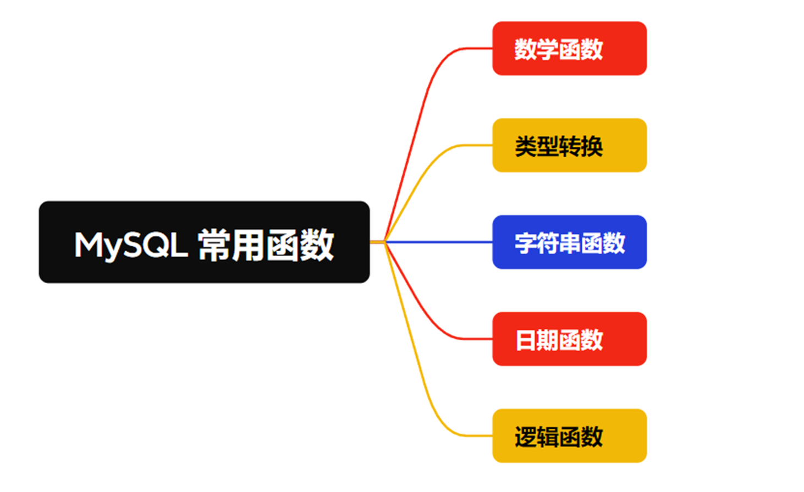

# 通俗易懂-MySQL常用函数解析

## 
## 数学函数
#### count()
`count()`、`count(field)` 统计某个结果集中的总数量，`field`为要统计的字段。

```plsql
select count( 1 ) from order_details;
```

---

#### sum()
`sum(field)` 统计某个字段累计的总和，field为要统计的字段。

```plsql
select sum( price ) from order_details;
```

---

#### avg()
`avg(field)` 统计某个字段的平均数，field为要统计的字段。

```plsql
select avg( price )  from order_details;
```

---

#### round()
`round(number,x)`返回某个数字按指定位数取整后的数字，`number`被操作的数字，`x`为精确的位数

```plsql
# 返回 123.4600
select round(123.4567,2);

# 返回 765.4300
select round(765.4321,2); 
```

---

#### abs()
`abs(number)` 取绝对值

```plsql
# 返回 88
select abs(-88);
```

#### rand()
`rand()` 返回0-1.0之间的浮点随机数

```plsql
-- 返回 0.7680746612773041
select rand();
```

---

## 类型转换
#### cast()
`cast(data as type)` 将一种类型的数据转换成另一种类型。data为数据， type为类型。

必须是数据库支持的数据类型。

```plsql
# SIGNED 可以是正数、负数或零
# UNSIGNED 只能是零或正数，不能为负数

# 将字符的123转换成数字的123
SELECT CAST('123' AS SIGNED);
```

---

## 字符串函数
#### concat()
`concat(data1,data2,data3,datan...)`拼接字符串。

如果其中一个数据为`null`则返回`null`。

```plsql
# 返回 1234
select concat(1,2,3,4);

# 返回 null
select concat(1,2,3,null);
```

---

#### concat_ws()
`concat_ws(separator,data1,data2,data3,datan...)` 根据指定的分隔符(`separator`)拼接字符串，存在`null`则拼接空白。

```plsql
# 返回 1,2,3,4
select concat_ws(',',1,2,3,4);
# 返回 1-2-3-4
select concat_ws('-',1,2,3,4);
# 返回 1-2-3
select concat_ws('-',1,2,3,null);
```

---

#### group_concat()
`group_concat()` 根据某个字段分组然后汇总数据。

```plsql
create table test (
    id INT,
    name VARCHAR(50)
);

insert into test (id, name) values
(1, '刘备'),
(2, '关羽'),
(3, '张飞'),
(4, '曹操'),
(5, '孙权');

-- 刘备,关羽,张飞,曹操,孙权
select group_concat(name) as names_summary from test;

-- 孙权,曹操,张飞,关羽,刘备
select group_concat(name order by id desc) as names_summary_desc from test;
```

---

#### date_format()
`date_format(dateStr,pattern)`格式化时间函数。`dataStr`为要格式化的时间，`pattern`为格式。

```plsql
# 返回 2025-03-28
select date_format('2025-3-28 15:33:04',   '%Y-%m-%d');  
```

可以使用的格式有：

| 格式 | 描述 |
| --- | --- |
| %a | 缩写星期名 |
| %b | 缩写月名 |
| %c | 月，数值 |
| %D | 带有英文前缀的月中的天 |
| %d | 月的天，数值(00-31) |
| %e | 月的天，数值(0-31) |
| %f | 微秒 |
| %H | 小时 (00-23) |
| %h | 小时 (01-12) |
| %I | 小时 (01-12) |
| %i | 分钟，数值(00-59) |
| %j | 年的天 (001-366) |
| %k | 小时 (0-23) |
| %l | 小时 (1-12) |
| %M | 月名 |
| %m | 月，数值(00-12) |
| %p | AM 或 PM |
| %r | 时间，12-小时（hh:mm:ss AM 或 PM） |
| %S | 秒(00-59) |
| %s | 秒(00-59) |
| %T | 时间, 24-小时 (hh:mm:ss) |
| %U | 周 (00-53) 星期日是一周的第一天 |
| %u | 周 (00-53) 星期一是一周的第一天 |
| %V | 周 (01-53) 星期日是一周的第一天，与 %X 使用 |
| %v | 周 (01-53) 星期一是一周的第一天，与 %x 使用 |
| %W | 星期名 |
| %w | 周的天 （0=星期日, 6=星期六） |
| %X | 年，其中的星期日是周的第一天，4 位，与 %V 使用 |
| %x | 年，其中的星期一是周的第一天，4 位，与 %v 使用 |
| %Y | 年，4 位 |
| %y | 年，2 位 |


---

#### length()
`length()`返回字符串的长度。

```plsql
# 返回3
select length('123');
```

---

#### replace()
`replace()`替换指定字符串中的指定字符串为指定字符串

```plsql
# 返回 aaaaa-abcd
select replace('1234abcd','1234','aaaaa-');
```

---

#### find_in_set()
`find_in_set()` 查找指定的字符串在不在字符串列表中

```plsql
-- 返回3，因为找到了
select find_in_set('百里','徐庶,诸葛,百里');

-- 返回0 没找到
select find_in_set('百里1','徐庶,诸葛,百里');
```

---

#### locate()
`locate()` 返回字符串首次出现的位置，下标从1开始

```plsql
-- 返回2
select locate('2','123');

-- 返回1
select locate('1','123');
```

---

## 日期函数
#### curdate()
`curdate()` 返回今天的日期

```plsql
-- 返回 2025-03-28
select curdate();
```

#### curtime()
`curtime()` 返回今天的时间

```plsql
-- 返回 15:42:42
select curtime(); 
```

#### now()
`now()` 返回日期和时间

```plsql
-- 返回 2025-03-28 15:43:09
select now();
```

---

## 逻辑函数
#### if()
`if()` 判断表达式是否成立，格式`if(表达式,成立返回,不成立返回)`，注意成立和不成立的返回必须是一个类型的，要是字符串必须都是字符串，不能一个是字符串一个是数字。

```plsql
-- 返回 成立
select if(1=1,'成立','不成立');

-- 返回 成立
select if(1 is not null,'成立','不成立');

-- 返回 不成立
select if(1=2,'成立','不成立');

-- 返回 成立
select if(1 is not null and 1=1,'成立','不成立');

-- 返回 不成立
select if(1 is not null and 1=2,'成立','不成立');
```

---

#### case
`case` 多表达式判断，返回最先成立表达式的结果，格式`CASE WHEN 表达式1 THEN 表达式1成立的结果 WHEN 表达式2 THEN 表达式2成立的结果 ELSE 都不成立的结果 END `

```plsql
-- 返回 1=1
select case when 1=1 then '1=1' when 2=2 then '2=2' else '都不成立' end

-- 返回 2=2
select case when 1=2 then '1=1' when 2=2 then '2=2' else '都不成立' end

-- 返回 都不成立
select case when 1=2 then '1=1' when 2=3 then '2=2' else '都不成立' end
```

---

#### ifnull()
`ifnull()` 如果传入的值为null，就返回指定的值，不为null，就返回传入的值

```plsql
-- 返回 1
select ifnull(1,'111');

-- 返回 111
select ifnull(null,'111');
```

---


> 更新: 2025-03-30 21:37:43  
> 原文: <https://www.yuque.com/tulingzhouyu/db22bv/hoh5yl13z8ue2kak>