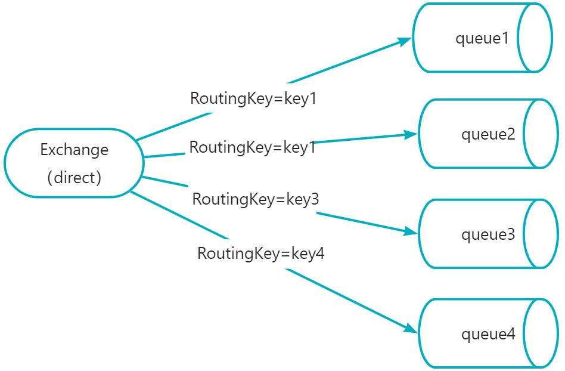

# 💎RabbitMQ面试题合集

# <font style="color:#01B2BC;">RabbitMQ交换机类型</font>
## direct(**直连交换机**)
<font style="color:rgb(18, 18, 18);">作为</font>**<font style="color:rgb(18, 18, 18);">默认</font>**<font style="color:rgb(18, 18, 18);">交换机。路由键与队列名完全匹配交换机，此种类型交换机，通过RoutingKey路由键将交换机和队列进行绑定， 消息被发送到exchange时，需要根据消息的RoutingKey，来进行匹配，只将消息发送到完全匹配到此RoutingKey的队列。</font>

<font style="color:rgb(18, 18, 18);">比如：如果一个队列绑定到交换机要求路由键为“</font>**<font style="color:rgb(18, 18, 18);">key</font>**<font style="color:rgb(18, 18, 18);">”，则只转发RoutingKey标记为“key”的消息，不会转发"key1"，也不会转发“key.1”等等。它是完全匹配、单播的模式</font>



	<font style="color:rgb(18, 18, 18);">同一个key可以绑定多个queue队列；当匹配到key1时，queue1和queue2都可以收到消息</font>

## <font style="color:rgb(51, 51, 51);">fanout(</font>**扇型交换机，广播**<font style="color:rgb(51, 51, 51);">)</font>
<font style="color:rgb(18, 18, 18);">Fanout，扇出类型交换机，此种交换机，会将消息分发给所有绑定了此交换机的队列，此时RoutingKey参数无效。</font>


<font style="color:rgb(18, 18, 18);">fanout类型交换机下发送消息一条，无论RoutingKey是什么，直接</font>**<font style="color:rgb(18, 18, 18);">广播消息</font>**<font style="color:rgb(18, 18, 18);">，queue1,queue2,queue3,queue4都可以收到消息</font>

## <font style="color:rgb(18, 18, 18);">topic(</font>**主题交换机**<font style="color:rgb(18, 18, 18);">)</font>
<font style="color:rgb(18, 18, 18);">Topic，主题类型交换机，此种交换机与Direct类似，也是需要通过routingkey路由键进行匹配分发，区别在于Topic可以进行模糊匹配，Direct是完全匹配。</font>

1. <font style="color:rgb(18, 18, 18);">Topic中，将routingkey通过"."来分为多个部分</font>
2. <font style="color:rgb(51, 51, 51);">"*"：代表一个部分</font>
3. <font style="color:rgb(51, 51, 51);">"#"：代表0个或多个部分(</font><font style="color:rgb(18, 18, 18);">如果绑定的路由键为 "#" 时，则接受所有消息，因为路由键所有都匹配</font><font style="color:rgb(51, 51, 51);">)</font>


<font style="color:rgb(51, 51, 51);">然后发送一条信息，routingkey为"key1.key2.key3.key4"，那么根据"."将这个路由键分为了4个部分，此条路由键，将会匹配：</font>

1. <font style="color:rgb(51, 51, 51);">key1.key2.key3.*：成功匹配，因为 * 可以代表一个部分</font>
2. <font style="color:rgb(51, 51, 51);">key1.# ：成功匹配，因为#可以代表0或多个部分</font>
3. <font style="color:rgb(51, 51, 51);">*.key2.*.key4： 成功匹配，因为第一和第三部分分别为key1和key3，且为4个部分，刚好匹配</font>
4. <font style="color:rgb(51, 51, 51);">#.key3.key4：成功匹配，#可以代表多个部分，正好匹配中了我们的key1和key2</font>

如果发送消息routingkey为"key1"，那么将只能匹配中key1.#，#可以代表0个部分

## <font style="color:rgb(51, 51, 51);">headers(</font>**头部交换机**<font style="color:rgb(51, 51, 51);">)</font>
<font style="color:rgb(18, 18, 18);">headers 匹配 AMQP 消息的 header 而不是路由键，此外 headers 交换器和 direct 交换器完全一致，但性能差很多，目前几乎用不到了</font>

<font style="color:rgb(77, 77, 77);">消费方指定的headers中必须包含一个"x-match"的键。</font>

<font style="color:rgb(77, 77, 77);">键"x-match"的值有2个</font>

1. <font style="color:rgb(0, 0, 0);">x-match = all ：表示所有的键值对都匹配才能接受到消息</font>
2. <font style="color:rgb(0, 0, 0);">x-match = any ：表示只要有键值对匹配就能接受到消息</font>


发送消息时间，如果其他参数信息是{ "name":"TianMingXX", "sex":"男" }，因为queue2的x-match是any，只需要有一个键值对匹配所以就能接收到消息，所以queue2可以接收到消息；queue1的x-match是all，需要所有的键值对都匹配才能接收到消息，所以此时queue1接收不到消息

# <font style="color:#01B2BC;">RabbitMQ架构设计</font>
<font style="color:rgb(55, 65, 81);">RabbitMQ 是一个开源的消息中间件，采用 AMQP（高级消息队列协议）进行消息传递。它允许应用程序之间进行异步通信，提供了一种高效、可扩展、可靠的消息传递机制。</font>

<font style="color:rgb(55, 65, 81);">以下是 RabbitMQ 的基本架构设计：</font>


1. **生产者（Producer）：**<font style="color:rgb(55, 65, 81);"> 生产者是消息的发送方，负责产生并发送消息到 RabbitMQ。生产者通常将消息发送到交换机（Exchange）。</font>
2. **交换机（Exchange）：**<font style="color:rgb(55, 65, 81);"> 交换机是消息的分发中心，负责将接收到的消息路由到一个或多个队列。它定义了消息的传递规则，可以根据规则将消息发送到一个或多个队列。</font>
    - **直连交换机（Direct Exchange）：**<font style="color:rgb(55, 65, 81);"> 将消息路由到与消息中的路由键（Routing Key）完全匹配的队列。</font>
    - **主题交换机（Topic Exchange）：**<font style="color:rgb(55, 65, 81);"> 根据通配符匹配路由键，将消息路由到一个或多个队列。</font>
    - **扇出交换机（Fanout Exchange）：**<font style="color:rgb(55, 65, 81);"> 将消息广播到所有与交换机绑定的队列，忽略路由键。</font>
    - **头部交换机（Headers Exchange）：**<font style="color:rgb(55, 65, 81);"> 根据消息头中的属性进行匹配，将消息路由到与消息头匹配的队列。</font>
3. **队列（Queue）：**<font style="color:rgb(55, 65, 81);"> 队列是消息的存储区，用于存储生产者发送的消息。消息最终会被消费者从队列中取出并处理。每个队列都有一个名称，并且可以绑定到一个或多个交换机。</font>
4. **消费者（Consumer）：**<font style="color:rgb(55, 65, 81);"> 消费者是消息的接收方，负责从队列中获取消息并进行处理。消费者通过订阅队列来接收消息。</font>
5. **绑定（Binding）：**<font style="color:rgb(55, 65, 81);"> 绑定是交换机和队列之间的关联关系。生产者将消息发送到交换机，而队列通过绑定与交换机关联，从而接收到消息。</font>
6. **虚拟主机（Virtual Host）：**<font style="color:rgb(55, 65, 81);"> 虚拟主机是 RabbitMQ 的基本工作单元，每个虚拟主机拥有自己独立的用户、权限、交换机、队列等资源，完全隔离于其他虚拟主机。</font>
7. **连接（Connection）：**<font style="color:rgb(55, 65, 81);"> 连接是指生产者、消费者与 RabbitMQ 之间的网络连接。每个连接可以包含多个信道（Channel），每个信道是一个独立的会话通道，可以进行独立的消息传递。</font>
8. **消息：**<font style="color:rgb(55, 65, 81);"> 消息是生产者和消费者之间传递的数据单元。消息通常包含消息体和可选的属性，如路由键等。</font>

<font style="color:rgb(55, 65, 81);">RabbitMQ 的架构设计允许多个生产者、多个消费者之间通过消息队列进行松耦合的通信，提高了系统的可伸缩性和可维护性。通过灵活配置交换机和队列，可以实现多种消息传递模式，满足不同应用场景的需求</font>

# <font style="color:#01B2BC;">RabbitMQ如何保证消息不丢失</font>
## 丢失原因分析
观察整个 RabbitMQ 消息发送过程：


从上述流程我们可以得知：消息从生产者到达消费者，经过两次网络传输，并且在 RabbitMQ 服务器中进行路由。

因此我们能知道整个流程中可能会出现三种消息丢失场景：

+ 生产者发送消息到 RabbitMQ 服务器的过程中出现消息丢失。 可能是网络波动未收到消息，又或者是服务器宕机。
+ RabbitMQ 服务器消息持久化出现消息丢失。 消息发送到 RabbitMQ 之后，未能及时存储完成持久化，RabbitMQ 服务器出现宕机重启，消息出现丢失。
+ 消费者拉取消息过程以及拿到消息后出现消息丢失。 消费者从 RabbitMQ 服务器获取到消息过程出现网络波动等问题可能出现消息丢失；消费者拿到消息后但是消费者未能正常消费，导致丢失，可能是消费者出现处理异常又或者是消费者宕机。

针对上述三种消息丢失场景，RabbitMQ 提供了相应的解决方案，confirm 消息确认机制（生产者），消息持久化机制（RabbitMQ 服务），ACK 事务机制（消费者）

## 解决方案
### confirm 消息确认机制（生产者）
Confirm 模式是 RabbitMQ 提供的一种消息可靠性保障机制。当生产者通过 Confirm 模式发送消息时，它会等待 RabbitMQ 的确认，确保消息已经被正确地投递到了指定的 Exchange 中。

消息正确投递到 queue 时，会返回 ack。

消息没有正确投递到 queue 时，会返回 nack。如果 exchange 没有绑定 queue，也会出现消息丢失。

**使用方法：**

+ 生产者通过 **confirm.select** 方法将 Channel 设置为 Confirm 模式。
+ 发送消息后，通过添加 **add_confirm_listener** 方法，监听消息的确认状态。

附源码：

```java
1.开启消息确认机制
spring:
  rabbitmq:
        # 开启消息确认机制
    publisher-confirms: true
    # 消息在未被队列收到的情况下返回
    #publisher-returns: true
    #publisher-confirm-type: correlated
 
2.消息未接收时调用ReturnCallback
rabbitTemplate.setMandatory(true);
 
3.生产者投递消息
@Service
public class ConfirmProvider implements RabbitTemplate.ConfirmCallback,RabbitTemplate.ReturnCallback {
@Autowired
    RabbitTemplate rabbitTemplate;
@PostConstruct
    public void init() {
        rabbitTemplate.setReturnCallback(this);
        rabbitTemplate.setConfirmCallback(this);
    }
@Override
    public void confirm(CorrelationData correlationData, boolean ack, String cause) {
        if(ack){
            System.out.println("确认了这条消息："+correlationData);
        }else{
            System.out.println("确认失败了："+correlationData+"；出现异常："+cause);
        }
    }
@Override
    public void returnedMessage(Message message, int replyCode, String replyText, String exchange, String routingKey) {
        System.out.println("这条消息发送失败了"+message+",请处理");
    }
public void publisMessage(String message){
        rabbitTemplate.setMandatory(true);
        rabbitTemplate.convertAndSend("javatrip",message);
    }
}
 
4.如果消息确认失败后，我们可以进行消息补偿，也就是消息的重试机制。当未收到确认信息时进行消息的重新投递。设置如下配置即可完成。
spring:
  rabbitmq:
    # 支持消息发送失败后重返队列
    publisher-returns: true
    # 开启消息确认机制
    # publisher-confirm-type: correlated
    listener:
      simple:
        retry:
          # 开启重试
          enabled: true
          # 最大重试次数
          max-attempts: 5
          # 重试时间间隔
```

### 消息持久化机制（RabbitMQ 服务）
持久化机制是指将消息存储到磁盘，以保证在 RabbitMQ 服务器宕机或重启时，消息不会丢失。

**使用方法：**

+ 生产者通过将消息的 **delivery_mode** 属性设置为 2(SpringBoot中<font style="color:rgba(0, 0, 0, 0.9);">deliveryMode</font>默认为<font style="color:rgba(0, 0, 0, 0.9);">MessageDeliveryMode.PERSISTENT 等于</font>2)，将消息标记为持久化。
+ 队列也需要进行持久化设置，确保队列在 RabbitMQ 服务器重启后仍然存在。需要将**durable**属性设置为true，且需配合autoDelete设置为false

**注意事项：**

+ 持久化机制会影响性能，因此在需要确保消息不丢失的场景下使用。

附源码：

```java
@Queue(value = "TianMingQ",durable = "true",autoDelete = "false")   //或者注入时
return new Queue("TianMingQ", true, false, false, map);
```

### ACK 事务机制（消费者）
ACK 事务机制用于确保消息被正确消费。当消息被消费者成功处理后，消费者发送确认（ACK）给 RabbitMQ，告知消息可以被移除。这个过程是自动处理的，也可以关闭进行手工发送 ACK。

**使用方法：**

+ 在 RabbitMQ 中，ACK 机制默认是开启的。当消息被消费者接收后，会立即从队列中删除，除非消费者发生异常。
+ 可以手动开启 ACK 机制，通过将 **auto_ack** 参数设置为 **False**，手动控制消息的 ACK （acknowledge-mode: manual）。

**注意事项：**

+ ACK 机制可以确保消息不会被重复处理，但如果消费者发生异常或者未发送 ACK，消息可能会被重复投递。

附源码：

```java
1.修改yml为手动签收模式
spring:
  rabbitmq:
    listener:
      simple:
        # 手动签收模式
        acknowledge-mode: manual
        # 每次签收一条消息
        prefetch: 1
 
 
2.消费者手动签收
@Component
@RabbitListener(queuesToDeclare = @Queue(value = "TianMingQ", durable = "true"))
public class SecondConsumer {
@RabbitHandler
    public void receive(String message, @Headers Map<String,Object> headers, Channel channel) throws Exception{
System.out.println(message);
        // 唯一的消息ID
        Long deliverTag = (Long) headers.get(AmqpHeaders.DELIVERY_TAG);
        // 确认该条消息
        if(...){
            channel.basicAck(deliverTag,false);
        }else{
            // 消费失败，消息重返队列
            channel.basicNack(deliverTag,false,true);
        }
      
    }
```

当然上面确保不丢失，会自动重试，可能会造成重复消费问题。具体处理可往下看第5点。

# <font style="color:#01B2BC;">RabbitMQ中如何解决消息堆积问题</font>
### 
## <font style="color:rgb(31, 41, 55);">消息堆积原因</font>


## <font style="color:rgb(31, 41, 55);">解决方案</font>
1. **<font style="color:rgb(31, 41, 55);">消费者处理消息的速度太慢</font>**
    - **<font style="color:rgb(31, 41, 55);">增加消费者数量</font>**<font style="color:rgb(31, 41, 55);">：通过水平扩展，增加消费者的数量来提高处理能力。</font>
    - **<font style="color:rgb(31, 41, 55);">优化消费者性能</font>**<font style="color:rgb(31, 41, 55);">：提高消费者处理消息的效率，例如优化代码、增加资源。</font>
    - **<font style="color:rgb(31, 41, 55);">消息预取限制(prefetch count)</font>**<font style="color:rgb(31, 41, 55);">：调整消费者的预取数量以避免一次处理过多消息而导致处理缓慢。</font>
2. **<font style="color:rgb(31, 41, 55);">队列的容量太小</font>**
    - **<font style="color:rgb(31, 41, 55);">增加队列的容量</font>**<font style="color:rgb(31, 41, 55);">：调整队列设置以允许更多消息存储。</font>
3. **<font style="color:rgb(31, 41, 55);">网络故障</font>**
    - **<font style="color:rgb(31, 41, 55);">监控和告警</font>**<font style="color:rgb(31, 41, 55);">：通过监控网络状况并设置告警，确保在网络故障时快速发现并解决问题。</font>
    - **<font style="color:rgb(31, 41, 55);">持久化和高可用性</font>**<font style="color:rgb(31, 41, 55);">：确保消息和队列的持久化以避免消息丢失，并使用镜像队列提高可用性。</font>
4. **<font style="color:rgb(31, 41, 55);">消费者故障</font>**
    - **<font style="color:rgb(31, 41, 55);">使用死信队列</font>**<font style="color:rgb(31, 41, 55);">：将无法处理的消息转移到死信队列，防止堵塞主队列。</font>
    - **<font style="color:rgb(31, 41, 55);">容错机制</font>**<font style="color:rgb(31, 41, 55);">：实现消费者的自动重启和错误处理逻辑。</font>
5. **<font style="color:rgb(31, 41, 55);">队列配置不当</font>**
    - **<font style="color:rgb(31, 41, 55);">优化队列配置</font>**<font style="color:rgb(31, 41, 55);">：检查并优化消息确认模式、队列长度限制和其他相关配置。</font>
6. **<font style="color:rgb(31, 41, 55);">消息大小</font>**
    - **<font style="color:rgb(31, 41, 55);">消息分片</font>**<font style="color:rgb(31, 41, 55);">：将大型消息分割成小的消息片段，加快处理速度。</font>
7. **<font style="color:rgb(31, 41, 55);">业务逻辑复杂或耗时</font>**
    - **<font style="color:rgb(31, 41, 55);">优化业务逻辑</font>**<font style="color:rgb(31, 41, 55);">：简化消费者中的业务逻辑，减少处理每个消息所需的时间。</font>
8. **<font style="color:rgb(31, 41, 55);">消息产生速度快于消费速度</font>**
    - **<font style="color:rgb(31, 41, 55);">使用消息限流</font>**<font style="color:rgb(31, 41, 55);">：控制消息的生产速度，确保它不会超过消费者的处理能力。</font>
    - **<font style="color:rgb(31, 41, 55);">负载均衡</font>**<font style="color:rgb(31, 41, 55);">：确保消息在消费者之间公平分配，避免个别消费者过载。</font>
9. **<font style="color:rgb(31, 41, 55);">其他配置优化</font>**
    - **<font style="color:rgb(31, 41, 55);">消息优先级</font>**<font style="color:rgb(31, 41, 55);">：使用消息优先级确保高优先级消息优先处理。</font>
    - **<font style="color:rgb(31, 41, 55);">调整RabbitMQ配置</font>**<font style="color:rgb(31, 41, 55);">：优化RabbitMQ服务的配置，如文件描述符限制、内存使用限制等。</font>

# <font style="color:#01B2BC;">RabbitMQ中如何保证消息不被重复消费</font>
## <font style="color:rgb(0, 0, 0);">什么情况会导致消息被重复消费呢</font>
1. <font style="color:rgb(48, 48, 48);">生产者：生产者可能会重复推送一条数据到 MQ 中，比如 Controller 接口被重复调用了 2 次，没有做接口幂等性导致的；</font>
2. <font style="color:rgb(48, 48, 48);">MQ：在消费者消费完准备响应 ack 消息消费成功时，MQ 突然挂了，导致 MQ 以为消费者还未消费该条数据，MQ 恢复后再次推送了该条消息，导致了重复消费。</font>
3. <font style="color:rgb(48, 48, 48);">消费者：消费者已经消费完消息，正准备但是还未响应给ack消息到时，此时消费者挂了，服务重启后 MQ 以为消费者还没有消费该消息，再次推送了该条消息。</font>


## 解决方案
## 使用数据库唯一键约束
缺点：局限性很大，**仅仅只能用在我们数据新增场景**，并且性能也比较低

## 使用乐观锁
假设是更新订单状态，**在发送的消息的时候带上修改字段的版本号**

缺点：如果说更新字段比较多，并且更新场景比较多，可能会导致数据库字段增加并且还有可能出现多条消息同时在队列中此时他们修改字段版本号一致，排在后续的消息无法被消费

## 简单的消息去重，插入消费记录，增加数据库判断


优点：很多场景下的确能起到不错的效果

缺点：

1. 这个消费者的代码执行需要1秒，重复消息在执行期间（假设100毫秒）内到达（例如生产者快速重发，Broker重启等），增加校验的地方是不是还是没数据（因为上一条消息还没消费完，没有记录）
2. 那么就会穿透掉检查的挡板，最后导致重复的消息消费逻辑进入到非幂等安全的业务代码中，从而引发重复消费的问题

## 并发消息去重<font style="color:rgb(34, 34, 34);background-color:rgb(248, 248, 248);">基于消息幂等表</font>


+ 缺点：如果说第一次消息投递异常没有消费成功，并且没有将消息状态给置为成功或者没有删除消息表记录，此时延时消费每次执行下列都是一直处于消费中，最后消费就会被视为消费失败而被投递到死信Topic中
+ 方案：插入的消息表必须要带一个最长消费过期时间，例如10分钟


+ 上述方案只需要一个存储的中心媒介，那我们可以选择更灵活的存储中心媒介，比如Redis。使用Redis有两个好处：
    - 性能上损耗更低
    - 上面我们讲到的超时时间可以直接利用Redis本身的ttl实现

## 总结
1. 利用数据库唯一键约束
2. 可以利用我们的乐观锁
3. 插入消费记录

<font style="color:rgb(55, 65, 81);">不丢和不重是矛盾的（在分布式场景下），总的来说，开发者根据业务的实际需求来选择相应的方式即可。</font>

<font style="color:rgb(51, 51, 51);"></font>


> 更新: 2025-04-09 20:49:39  
> 原文: <https://www.yuque.com/tulingzhouyu/db22bv/gmmoedg89h3z6576>