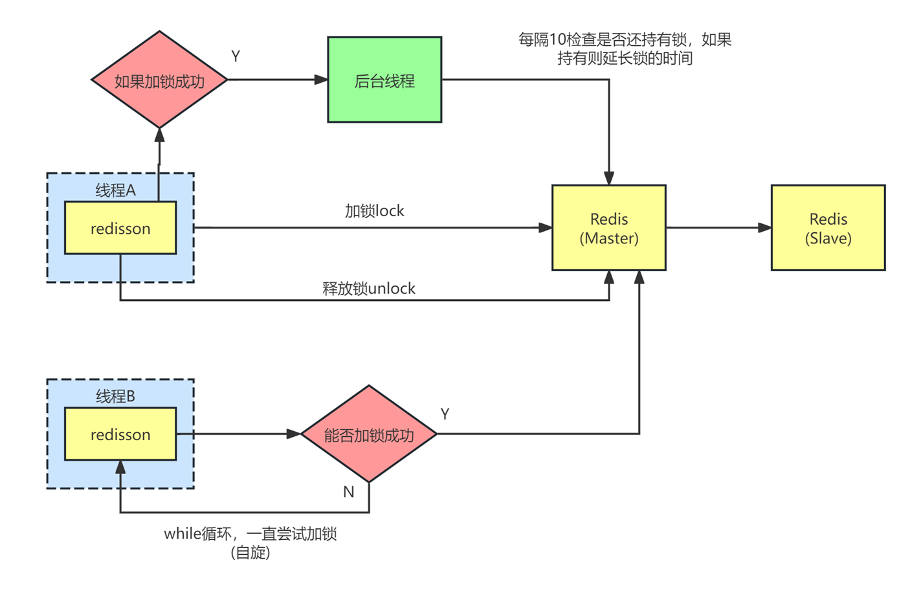

# Redisson 如果续锁失败怎么办

<font style="color:rgba(0, 0, 0, 0.82);">我们在使用 </font>**<font style="color:rgba(0, 0, 0, 0.82);">Redisson</font>**<font style="color:rgba(0, 0, 0, 0.82);"> 实现分布式锁时，通常会依赖它的看门狗机制进行锁续命，避免业务执行期间锁提前释放，但如果说续锁失败了，就可能会影响系统的正确性。因此，我们需要了解续锁失败的原因以及相应的应对措施，以确保系统健壮性。</font>

---

### <font style="color:rgba(6, 8, 31, 0.88);">什么是 Redisson 锁续期？</font>
<font style="color:rgba(6, 8, 31, 0.88);">Redisson分布式锁默认用“看门狗”机制守护锁。加锁成功后，如果业务执行时间超过锁的默认过期时间（30秒），看门狗会周期性自动为锁续期（一般每10秒续一次，每次续到30秒），避免锁被提前释放。</font>



---

### **<font style="color:rgba(0, 0, 0, 0.82);">续锁失败的可能原因</font>**
+ <font style="color:rgba(6, 8, 31, 0.88);">Redisson客户端与Redis连接断开，心跳保活失败。</font>
+ <font style="color:rgba(6, 8, 31, 0.88);">客户端宕机、崩溃或进程被kill，看门狗失效。</font>
+ <font style="color:rgba(6, 8, 31, 0.88);">网络抖动，导致心跳和续期命令执行失败。</font>

---

### **<font style="color:rgba(0, 0, 0, 0.82);">续锁失败后的后果</font>**
+ **<font style="color:rgba(0, 0, 0, 0.82);">锁到期释放问题</font>**
    - <font style="color:rgba(0, 0, 0, 0.82);">如果锁对应资源尚未完成操作，而锁提前释放，可能被其他线程或节点获得，导致资源出现并发访问问题（违反互斥性）。</font>
+ **<font style="color:rgba(0, 0, 0, 0.82);">数据不一致</font>**
    - <font style="color:rgba(0, 0, 0, 0.82);">因锁失效，多个线程可能同时修改同一资源，导致数据不一致风险。例如在订单库存扣减的场景中，可能会导致库存被错误扣减。</font>
+ **<font style="color:rgba(0, 0, 0, 0.82);">死锁风险（特定场景）</font>**
    - <font style="color:rgba(0, 0, 0, 0.82);">如果业务设计不当，例如未正确释放锁，而续锁又失败，资源可能被永久锁住（死锁问题）。</font>

---

### **<font style="color:rgba(0, 0, 0, 0.82);">如何应对 Redisson 续锁失败问题？</font>**
+ **<font style="color:rgba(0, 0, 0, 0.82);">1. 设置合理的锁过期时间</font>**
    - <font style="color:rgba(0, 0, 0, 0.82);">在使用 Redisson 获取锁时，可以显式指定一个锁的过期时间，而不是完全依赖看门狗机制。</font>
    - <font style="color:rgba(0, 0, 0, 0.82);">例如，在业务完成操作所需的最大时间范围内设置一个过期时间（如 60 秒）。这样即使续锁失败，也可以避免锁永久不释放。</font>

```java
RLock lock = redissonClient.getLock("myLock");  
boolean isLocked = lock.tryLock(3, 60, TimeUnit.SECONDS);
```

+ **<font style="color:rgba(0, 0, 0, 0.82);">2. 增加容错机制</font>**
    - <font style="color:rgba(0, 0, 0, 0.82);">在业务代码中，做好锁释放、业务回滚的逻辑处理。如果因续锁失败导致锁丢失，无法完成操作时，可以通过补偿方式进行修正。</font>
+ **<font style="color:rgba(0, 0, 0, 0.82);">3. 监控 Redisson 的锁状态</font>**
    - <font style="color:rgba(0, 0, 0, 0.82);">通过 Redis 的命令（如：</font>`<font style="color:rgba(0, 0, 0, 0.82);">TTL</font>`<font style="color:rgba(0, 0, 0, 0.82);"> </font><font style="color:rgba(0, 0, 0, 0.82);">和</font><font style="color:rgba(0, 0, 0, 0.82);"> </font>`<font style="color:rgba(0, 0, 0, 0.82);">KEYS</font>`<font style="color:rgba(0, 0, 0, 0.82);">），监控锁的状态和TTL，及时发现续锁失败的问题。</font>
    - <font style="color:rgba(0, 0, 0, 0.82);">配合日志记录锁的获取、续锁与释放操作，方便问题排查。</font>
+ **<font style="color:rgba(0, 0, 0, 0.82);">4. 使用多副本 Redis 以提升可靠性</font>**
    - <font style="color:rgba(0, 0, 0, 0.82);">如果 Redis 发生单点故障，续锁会失败。将 Redis 部署为高可用架构（如 Redis Sentinel 或 Redis Cluster）可以减少因 Redis 故障导致续锁失败的概率。</font>
+ **<font style="color:rgba(0, 0, 0, 0.82);">5. 提高服务性能</font>**
    - <font style="color:rgba(0, 0, 0, 0.82);">防止因 GC 或线程池资源不足，导致看门狗线程阻塞，从而续锁失败。可以通过以下方式优化 Redisson 客户端的实现：</font>
        * <font style="color:rgba(0, 0, 0, 0.82);">调优 JVM：如减少 Full GC 或优化分布式锁的内存占用。</font>
        * <font style="color:rgba(0, 0, 0, 0.82);">增加线程池资源：确保 Redisson 的内部线程池有足够的线程处理续锁操作。</font>
+ **<font style="color:rgba(0, 0, 0, 0.82);">6. 异地多活与锁竞争</font>**
    - <font style="color:rgba(0, 0, 0, 0.82);">涉及分布式环境或多节点时，设计分布式锁竞争策略（如加锁失败后的退避重试、限流等），避免因为续锁失败导致分布式冲突。</font>

---

### **<font style="color:rgba(0, 0, 0, 0.82);">实战处理流程示例</font>**
#### **<font style="color:rgba(0, 0, 0, 0.82);">代码示意：补偿机制</font>**
<font style="color:rgba(0, 0, 0, 0.82);">假设业务场景是对库存进行扣减操作，可以在锁续约失败时添加补偿机制，比如记录未完成的操作，事后对剩余库存进行调整：</font>

```java
RLock lock = redissonClient.getLock("inventoryLock");  
boolean isLocked = false;  

try {  
    isLocked = lock.tryLock(3, 30, TimeUnit.SECONDS); // 设置锁过期时间  
    if (isLocked) {  
        // 执行业务逻辑（如扣减库存）  
        processInventory();  
    } else {  
        // 如果获取不到锁，记录日志或采取其他措施  
        log.warn("获取锁失败，可能存在并发问题！");  
    }  
} catch (Exception e) {  
    log.error("业务处理异常", e);  
    // 补偿措施（记录操作失败情况）  
} finally {  
    if (isLocked && lock.isHeldByCurrentThread()) {  
        // 确保锁只由当前线程释放，防止误释放他人的锁  
        lock.unlock();  
    }  
}
```

<font style="color:rgba(0, 0, 0, 0.82);">在这种设计中，续锁失败时，虽然锁自动释放了，但全局业务还能得以回滚或补偿处理。</font>


> 更新: 2025-04-24 20:02:06  
> 原文: <https://www.yuque.com/tulingzhouyu/db22bv/pg9hdtvg17f1o6mq>