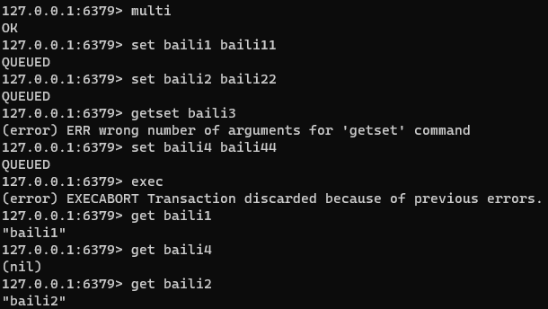
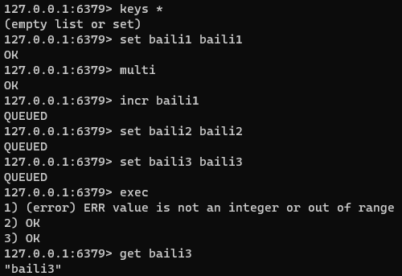

# Redis到底支不支持事务啊？

先说答案：**redis 是支持事务的，****但是它与传统的关系型数据库中的事务是有所不同的**。

## 一、概述：
**概念：** 可以一次执行多个命令，本质是一组命令的集合。一个事务中的所有命令都会序列化，按顺序地串行化执行而不会被其它命令插入，不许加塞。

**常用命令：**

+ **multi：**开启一个事务，multi 执行之后，客户端可以继续向服务器发送任意多条命令，这些命令不会立即被执行，而是被放到一个队列中。
+ **exec：**执行队列中所有的命令
+ **discard：**中断当前事务，然后清空事务队列并放弃执行事务
+ **watch key1 key2 ...	**：监视一个(或多个) key ，如果在事务执行之前这个(或这些) key 被其他命令所改动，那么事务将被打断。

## 二、使用：
### 正常执行：
##### 
### 主动放弃事务：
使用 discard 主动中断 multi 操作，然后清空并放弃执行当前事务。

### 全部回滚：
开启 multi 之后，命令语法导致执行错误，会放弃当前所有队列中的命令。

### 部分支持事务：
开启 multi 之后，命令逻辑执行错误，会主动忽略报错语句，继续执行后续命令。

### WATCH：
Redis 的 watch 命令是一种乐观锁的实现方式。余额修改示例：

#### 正常情况：

#### 并发修改情况：
在 watch 监控后，有人修改了balance，会导致事务会被打断，必须更新最新值，才能成功执行事务，类似于乐观锁的版本号机制。

## 事务三阶段：
1、开启：以 multi 开始一个事务

2、入队：将多个命令入队到事务中，接到这些命令并不会立即执行，而是放到等待执行的事务队列里面

3、执行：由 exec 命令触发事务

> 更新: 2025-02-24 19:26:06  
> 原文: <https://www.yuque.com/tulingzhouyu/db22bv/gkremwy573nv23r3>