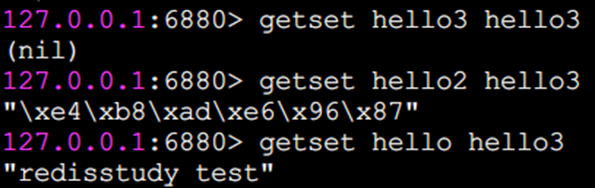
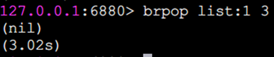
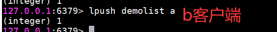
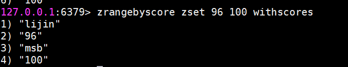
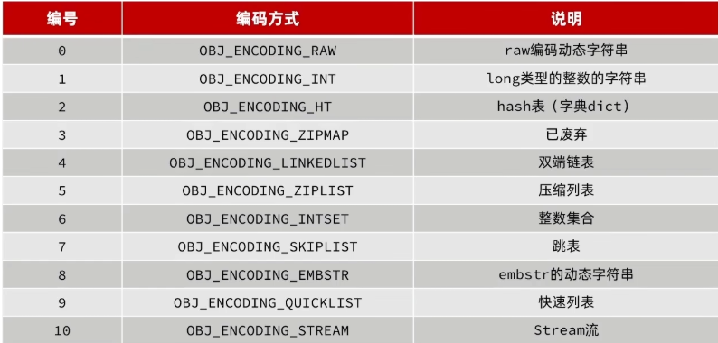
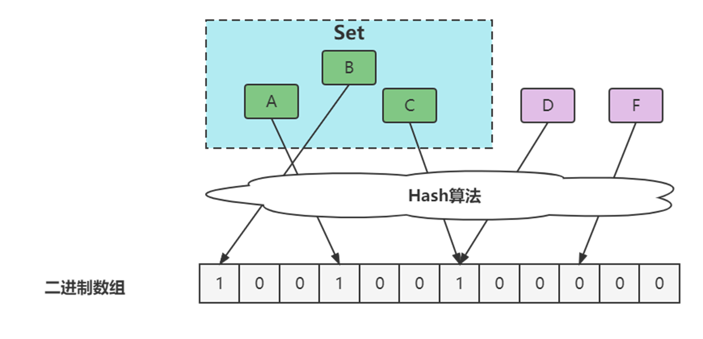

# Redis数据类型及实现原理

> <font style="color:rgb(85, 85, 85);">说明：本文由</font>[天明](https://www.yuque.com/tianming-aroh0)<font style="color:rgb(85, 85, 85);">整理之前VIP系统课中的部分章节笔记</font>
>

## <font style="color:rgb(51, 51, 51);">Redis常用数据结构</font>
<font style="color:rgb(51, 51, 51);">Redis提供了一些数据结构供我们往Redis中存取数据，最常用的的有5种，字符串（String）、哈希(Hash)、列表（list）、集合（set）、有序集合（ZSET）。另外RedisObject和3种高级类型Bitmaps,Hyperloglog,GEO也一并给大家整理到这里了</font>

### <font style="color:rgb(51, 51, 51);">字符串（String）</font>
<font style="color:rgb(51, 51, 51);">字符串类型是Redis最基础的数据结构。首先键都是字符串类型，而且其他几种数据结构都是在字符串类型基础上构建的，所以字符串类型能为其他四种数据结构的学习奠定基础。字符串类型的值实际可以是字符串(简单的字符串、复杂的字符串(例如JSON、XML))、数字(整数、浮点数)，甚至是二进制(图片、音频、视频)，但是值最大不能超过512MB。（磁盘扇区512个字节）</font>

<font style="color:rgb(51, 51, 51);">（虽然Redis是C写的，C里面有字符串</font><font style="color:rgb(51, 51, 51);"><</font><font style="color:rgb(51, 51, 51);">本质使用char数组来实现>，但是处于种种考虑，Redis还是自己实现了字符串类型）</font>

#### <font style="color:rgb(51, 51, 51);">操作命令</font>
##### <font style="color:rgb(51, 51, 51);">set 设置值</font>
<font style="color:rgb(51, 51, 51);">set key value</font>

<font style="color:rgb(51, 51, 51);">set命令有几个选项:</font>

<font style="color:rgb(51, 51, 51);">ex seconds: 为键设置秒级过期时间。</font>

<font style="color:rgb(51, 51, 51);">px milliseconds: 为键设置毫秒级过期时间。</font>

<font style="color:rgb(51, 51, 51);">nx: 键必须不存在,才可以设置成功，用于添加（分布式锁常用）。</font>

<font style="color:rgb(51, 51, 51);">xx: 与nx相反,键必须存在，才可以设置成功,用于更新。</font>


<font style="color:rgb(51, 51, 51);">从执行效果上看，ex参数和expire命令基本一样。还有一个需要特别注意的地方是如果一个字符串已经设置了过期时间，然后你调用了set 方法修改了它，它的过期时间会消失。</font>

<font style="color:rgb(51, 51, 51);">而nx和xx执行效果如下</font>


<font style="color:rgb(51, 51, 51);">除了set选项，Redis 还提供了setex和 setnx两个命令:</font>

<font style="color:rgb(51, 51, 51);">setex key</font><font style="color:rgb(51, 51, 51);">seconds value</font>

<font style="color:rgb(51, 51, 51);">setnx key value</font>

<font style="color:rgb(51, 51, 51);">setex和 setnx的作用和ex和nx选项是一样的。也就是，setex为键设置秒级过期时间，setnx设置时键必须不存在,才可以设置成功。</font>

<font style="color:rgb(51, 51, 51);">setex示例：</font>


<font style="color:rgb(51, 51, 51);">setnx示例：</font>


<font style="color:rgb(51, 51, 51);">因为键foo-ex已存在,所以setnx失败,返回结果为0，键foo-ex2不存在，所以setnx成功,返回结果为1。</font>

<font style="color:rgb(51, 51, 51);">有什么应用场景吗?以setnx命令为例子，由于Redis的单线程命令处理机制，如果有多个客户端同时执行setnx key value，根据setnx的特性只有一个客户端能设置成功，setnx可以作为分布式锁的一种实现方案。当然分布式锁没有不是只有一个命令就OK了，其中还有很多的东西要注意，我们后面会用单独的章节来讲述基于Redis的分布式锁。</font>

##### <font style="color:rgb(51, 51, 51);">get 获取值</font>
<font style="color:rgb(51, 51, 51);">如果要获取的键不存在,则返回nil(空):</font>


##### <font style="color:rgb(51, 51, 51);">mset 批量设置值</font>
<font style="color:rgb(51, 51, 51);">通过mset命令一次性设置4个键值对</font>


##### <font style="color:rgb(51, 51, 51);">mget 批量获取值</font>


<font style="color:rgb(51, 51, 51);">批量获取了键a、b、c、d的值:</font>

<font style="color:rgb(51, 51, 51);">如果有些键不存在,那么它的值为nil(空)，结果是按照传入键的顺序返回。</font>

<font style="color:rgb(51, 51, 51);">批量操作命令可以有效提高效率，假如没有mget这样的命令，要执行n次get命令具体耗时如下:</font>

<font style="color:rgb(51, 51, 51);">n次 get时间=n次网络时间+n次命令时间</font>

<font style="color:rgb(51, 51, 51);">使用mget命令后，要执行n次get命令操作具体耗时如下:</font>

<font style="color:rgb(51, 51, 51);">n次get时间=1次网络时间+n次命令时间</font>

<font style="color:rgb(51, 51, 51);">Redis可以支撑每秒数万的读写操作，但是这指的是Redis服务端的处理能力，对于客户端来说，一次命令除了命令时间还是有网络时间，假设网络时间为1毫秒，命令时间为0.1毫秒(按照每秒处理1万条命令算)，那么执行1000次 get命令需要1.1秒(1000</font>_<font style="color:rgb(51, 51, 51);">1+1000</font>_<font style="color:rgb(51, 51, 51);">0.1=1100ms)，1次mget命令的需要0.101秒(1</font>_<font style="color:rgb(51, 51, 51);">1+1000</font>_<font style="color:rgb(51, 51, 51);">0.1=101ms)。</font>

##### <font style="color:rgb(51, 51, 51);">Incr 数字运算</font>
<font style="color:rgb(51, 51, 51);">incr命令用于对值做自增操作,返回结果分为三种情况：</font>

<font style="color:rgb(51, 51, 51);">值不是整数,返回错误。</font>

<font style="color:rgb(51, 51, 51);">值是整数，返回自增后的结果。</font>

<font style="color:rgb(51, 51, 51);">键不存在，按照值为0自增,返回结果为1。</font>


<font style="color:rgb(51, 51, 51);">除了incr命令，Redis提供了decr(自减)、 incrby(自增指定数字)、decrby(自减指定数字)、incrbyfloat（自增浮点数)，具体效果请同学们自行尝试。</font>

##### <font style="color:rgb(51, 51, 51);">append追加指令</font>
<font style="color:rgb(51, 51, 51);">append可以向字符串尾部追加值</font>


##### <font style="color:rgb(51, 51, 51);">strlen 字符串长度</font>
<font style="color:rgb(51, 51, 51);">返回字符串长度</font>


<font style="color:rgb(51, 51, 51);">注意：每个中文占3个字节</font>

##### <font style="color:rgb(51, 51, 51);">getset 设置并返回原值</font>
<font style="color:rgb(51, 51, 51);">getset和set一样会设置值,但是不同的是，它同时会返回键原来的值</font>



##### <font style="color:rgb(51, 51, 51);">setrange 设置指定位置的字符</font>


<font style="color:rgb(51, 51, 51);">下标从0开始计算。</font>

##### <font style="color:rgb(51, 51, 51);">getrange 截取字符串</font>
<font style="color:rgb(51, 51, 51);">getrange 截取字符串中的一部分，形成一个子串，需要指明开始和结束的偏移量，截取的范围是个闭区间。</font>


#### <font style="color:rgb(51, 51, 51);">命令的时间复杂度</font>
<font style="color:rgb(51, 51, 51);">字符串这些命令中，除了del 、mset、 mget支持多个键的批量操作，时间复杂度和键的个数相关，为O(n)，getrange和字符串长度相关，也是O(n)，其余的命令基本上都是O(1)的时间复杂度，在速度上还是非常快的。</font>

#### <font style="color:rgb(51, 51, 51);">存储结构：</font>
<font style="color:rgb(51, 51, 51);">源码src/sds.c</font>


<font style="color:rgb(51, 51, 51);">可以通过 object encoding key 查看</font>**<font style="color:rgb(51, 51, 51);">编码</font>**<font style="color:rgb(51, 51, 51);">分别是 int 和 embstr 和 raw </font>

<font style="color:rgb(51, 51, 51);">int 存储8字节长整型 long 2^63-1；</font>

<font style="color:rgb(51, 51, 51);">embstr 格式的动态字符串</font>**<font style="color:rgb(51, 51, 51);">SDS</font>**<font style="color:rgb(51, 51, 51);">(sdshdr) 存储44个字节的字符串； </font>

<font style="color:rgb(51, 51, 51);">				</font><font style="color:rgb(51, 51, 51);">一次内存分配，只读，效率更快</font>

<font style="color:rgb(51, 51, 51);">修改拼接之后会直接升级为raw</font>

**<font style="color:rgb(51, 51, 51);">在Redis中，</font>**`**<font style="color:rgb(51, 51, 51);background-color:rgb(243, 244, 244);">embstr</font>**`**<font style="color:rgb(51, 51, 51);">和</font>**`**<font style="color:rgb(51, 51, 51);background-color:rgb(243, 244, 244);">raw</font>**`**<font style="color:rgb(51, 51, 51);">的区别？</font>**

<font style="color:rgb(51, 51, 51);">内存分配</font>

+ **<font style="color:rgb(51, 51, 51);">embstr</font>**<font style="color:rgb(51, 51, 51);">：</font>`<font style="color:rgb(51, 51, 51);background-color:rgb(243, 244, 244);">redisObject</font>`<font style="color:rgb(51, 51, 51);">和SDS是连续存储在一块内存区域中的，创建字符串对象时只需要进行一次内存分配。</font>
+ **<font style="color:rgb(51, 51, 51);">raw</font>**<font style="color:rgb(51, 51, 51);">：</font>`<font style="color:rgb(51, 51, 51);background-color:rgb(243, 244, 244);">redisObject</font>`<font style="color:rgb(51, 51, 51);">和SDS是分开存储的，创建字符串对象时需要进行两次内存分配。</font>

<font style="color:rgb(51, 51, 51);">内存释放</font>

+ **<font style="color:rgb(51, 51, 51);">embstr</font>**<font style="color:rgb(51, 51, 51);">：释放内存时只需要释放一次。</font>
+ **<font style="color:rgb(51, 51, 51);">raw</font>**<font style="color:rgb(51, 51, 51);">：释放内存时需要释放两次。</font>

<font style="color:rgb(51, 51, 51);">内存布局</font>

+ **<font style="color:rgb(51, 51, 51);">embstr</font>**<font style="color:rgb(51, 51, 51);">：</font>`<font style="color:rgb(51, 51, 51);background-color:rgb(243, 244, 244);">redisObject</font>`<font style="color:rgb(51, 51, 51);">和SDS是连续存储的，内存布局更加紧凑。</font>
+ **<font style="color:rgb(51, 51, 51);">raw</font>**<font style="color:rgb(51, 51, 51);">：</font>`<font style="color:rgb(51, 51, 51);background-color:rgb(243, 244, 244);">redisObject</font>`<font style="color:rgb(51, 51, 51);">和SDS是分开存储的，内存布局相对分散。</font>

<font style="color:rgb(51, 51, 51);">编码转换</font>

+ **<font style="color:rgb(51, 51, 51);">embstr</font>**<font style="color:rgb(51, 51, 51);">：当字符串被修改时，会转换为</font>`<font style="color:rgb(51, 51, 51);background-color:rgb(243, 244, 244);">raw</font>`<font style="color:rgb(51, 51, 51);">编码，且不会再转回</font>`<font style="color:rgb(51, 51, 51);background-color:rgb(243, 244, 244);">embstr</font>`<font style="color:rgb(51, 51, 51);">。</font>
+ **<font style="color:rgb(51, 51, 51);">raw</font>**<font style="color:rgb(51, 51, 51);">：</font>`<font style="color:rgb(51, 51, 51);background-color:rgb(243, 244, 244);">raw</font>`<font style="color:rgb(51, 51, 51);">编码的字符串在修改后不会转换为其他编码。</font>

<font style="color:rgb(51, 51, 51);">性能</font>

+ **<font style="color:rgb(51, 51, 51);">embstr</font>**<font style="color:rgb(51, 51, 51);">：由于内存分配和释放的次数较少，且内存布局紧凑，</font>`<font style="color:rgb(51, 51, 51);background-color:rgb(243, 244, 244);">embstr</font>`<font style="color:rgb(51, 51, 51);">的性能通常优于</font>`<font style="color:rgb(51, 51, 51);background-color:rgb(243, 244, 244);">raw</font>`<font style="color:rgb(51, 51, 51);">。</font>
+ **<font style="color:rgb(51, 51, 51);">raw</font>**<font style="color:rgb(51, 51, 51);">：由于需要进行两次内存分配和释放，且内存布局分散，</font>`<font style="color:rgb(51, 51, 51);background-color:rgb(243, 244, 244);">raw</font>`<font style="color:rgb(51, 51, 51);">的性能相对较差</font>

**<font style="color:rgb(51, 51, 51);">数据结构</font>**<font style="color:rgb(51, 51, 51);">分为sds5,8,16,31,64分别存储 32Byte(遗弃) 256Byte 64KB 4G 16EB 。</font>

<font style="color:rgb(51, 51, 51);">但String 最大限制512M，预留思想。避免超大影响性能。</font>

**<font style="color:rgb(51, 51, 51);">内存预分配：</font>**<font style="color:rgb(51, 51, 51);">较少内核用户态切换</font>

<font style="color:rgb(51, 51, 51);">	</font><font style="color:rgb(51, 51, 51);">初始len和alloc相同，</font>

<font style="color:rgb(51, 51, 51);">修改字符串，如果新字符串小于1M，则为拓展后字符串长度翻倍；</font>

<font style="color:rgb(51, 51, 51);">如果新字符串大于1M，则为拓展后字符串长度+1M</font>

**<font style="color:rgb(51, 51, 51);">为什么不用C语言的String?</font>**

<font style="color:rgb(51, 51, 51);">	</font><font style="color:rgb(51, 51, 51);">由于C语言以\0结束标识，无法存放任意字符，修改追加后遍历麻烦</font>

<font style="color:rgb(51, 51, 51);">遍历不以\0结束标志，操作字符串皆以二进制方式处理buf[],len遍历中间可任意字符串确保二进制安全</font>

**<font style="color:rgb(51, 51, 51);">优点：</font>**

<font style="color:rgb(51, 51, 51);">		</font><font style="color:rgb(51, 51, 51);">快速获取长度；支持动态扩容；减少内存分配次数；二进制安全</font>

#### <font style="color:rgb(51, 51, 51);">使用场景</font>
<font style="color:rgb(51, 51, 51);">字符串类型的使用场景很广泛：</font>

**<font style="color:rgb(51, 51, 51);">缓存功能</font>**

<font style="color:rgb(51, 51, 51);">Redis 作为缓存层，MySQL作为存储层，绝大部分请求的数据都是从Redis中获取。由于Redis具有支撑高并发的特性,所以缓存通常能起到加速读写和降低后端压力的作用。</font>

**<font style="color:rgb(51, 51, 51);">计数</font>**

<font style="color:rgb(51, 51, 51);">使用Redis 作为计数的基础工具，它可以实现快速计数、查询缓存的功能,同时数据可以异步落地到其他数据源。</font>

**<font style="color:rgb(51, 51, 51);">共享Session</font>**

<font style="color:rgb(51, 51, 51);">一个分布式Web服务将用户的Session信息（例如用户登录信息)保存在各自服务器中，这样会造成一个问题，出于负载均衡的考虑，分布式服务会将用户的访问均衡到不同服务器上，用户刷新一次访问可能会发现需要重新登录，这个问题是用户无法容忍的。</font>

<font style="color:rgb(51, 51, 51);">为了解决这个问题,可以使用Redis将用户的Session进行集中管理,在这种模式下只要保证Redis是高可用和扩展性的,每次用户更新或者查询登录信息都直接从Redis中集中获取。</font>

**<font style="color:rgb(51, 51, 51);">限速</font>**

<font style="color:rgb(51, 51, 51);">比如，很多应用出于安全的考虑,会在每次进行登录时,让用户输入手机验证码,从而确定是否是用户本人。但是为了短信接口不被频繁访问,会限制用户每分钟获取验证码的频率，例如一分钟不能超过5次。一些网站限制一个IP地址不能在一秒钟之内方问超过n次也可以采用类似的思路。</font>

**<font style="color:rgb(51, 51, 51);">分布式锁</font>**

<font style="color:rgb(51, 51, 51);">	</font><font style="color:rgb(51, 51, 51);">set 加nx参数 或者setnx (命令执行是单线程的)</font>

### <font style="color:rgb(51, 51, 51);">哈希(Hash)</font>
<font style="color:rgb(51, 51, 51);">Java里提供了HashMap，Redis中也有类似的数据结构，就是哈希类型。但是要注意，哈希类型中的映射关系叫作field-value，注意这里的value是指field对应的值，不是键对应的值。</font>

#### <font style="color:rgb(51, 51, 51);">操作命令</font>
<font style="color:rgb(51, 51, 51);">基本上，哈希的操作命令和字符串的操作命令很类似，很多命令在字符串类型的命令前面加上了h字母，代表是操作哈希类型，同时还要指明要操作的field的值。</font>

##### <font style="color:rgb(51, 51, 51);">hset设值</font>
<font style="color:rgb(51, 51, 51);">hset user:1 name tianming</font>


<font style="color:rgb(51, 51, 51);">如果设置成功会返回1，反之会返回0。此外Redis提供了hsetnx命令，它们的关系就像set和setnx命令一样,只不过作用域由键变为field。</font>

##### <font style="color:rgb(51, 51, 51);">hget取值</font>
<font style="color:rgb(51, 51, 51);">hget user:1 name</font>

<font style="color:rgb(51, 51, 51);">如果键或field不存在，会返回nil。</font>


##### <font style="color:rgb(51, 51, 51);">hdel删除field</font>
<font style="color:rgb(51, 51, 51);">hdel会删除一个或多个field，返回结果为成功删除field的个数。</font>


##### <font style="color:rgb(51, 51, 51);">hlen计算field个数</font>


##### <font style="color:rgb(51, 51, 51);">hmset批量设值</font>


##### <font style="color:rgb(51, 51, 51);">hmget批量取值</font>


##### <font style="color:rgb(51, 51, 51);">hexists判断field是否存在</font>


<font style="color:rgb(51, 51, 51);">若存在返回1，不存在返回0</font>

##### <font style="color:rgb(51, 51, 51);">hkeys获取所有field</font>
<font style="color:rgb(51, 51, 51);">它返回指定哈希键所有的field</font>


##### <font style="color:rgb(51, 51, 51);">hvals获取所有value</font>


##### <font style="color:rgb(51, 51, 51);">hgetall获取所有field与value</font>


<font style="color:rgb(51, 51, 51);">在使用hgetall时，如果哈希元素个数比较多，会存在阻塞Redis的可能。如果只需要获取部分field，可以使用hmget，如果一定要获取全部field-value，可以使用hscan命令，该命令会渐进式遍历哈希类型，hscan将在后面的章节介绍。</font>

##### <font style="color:rgb(51, 51, 51);">hincrby增加</font>
<font style="color:rgb(51, 51, 51);">hincrby和 hincrbyfloat，就像incrby和incrbyfloat命令一样，但是它们的作用域是filed。</font>

##### <font style="color:rgb(51, 51, 51);">hstrlen 计算value的字符串长度</font>


#### <font style="color:rgb(51, 51, 51);">命令的时间复杂度</font>
<font style="color:rgb(51, 51, 51);">哈希类型的操作命令中，hdel,hmget,hmset的时间复杂度和命令所带的field的个数相关O(k)，hkeys,hgetall,hvals和存储的field的总数相关，O(N)。其余的命令时间复杂度都是O(1)。</font>

#### <font style="color:rgb(51, 51, 51);">存储结构</font>


<font style="color:rgb(51, 51, 51);">最大kv存储量 2^32-1 近40亿个</font>

<font style="color:rgb(51, 51, 51);">Dict 字典，HashTable哈希桶，DictEntry哈希节点</font>

<font style="color:rgb(51, 51, 51);">2个哈希桶为了方便 </font>

**<font style="color:rgb(51, 51, 51);">渐进式rehash</font>**

<font style="color:rgb(51, 51, 51);">每次执行CRUD都会检测dict.rehashindx是否非-1，是的话会附加的移动一部分到dict.h[1],并更新rehashidx++,直到全部的移动完毕</font>

<font style="color:rgb(51, 51, 51);">注意此时数据分布在两个ht中CRUD怎么操作？</font>

<font style="color:rgb(51, 51, 51);">此过程新增会插入到ht[1]，其余操作两个ht顺序进行</font>

**<font style="color:rgb(51, 51, 51);">Dict扩容 ReSize</font>**

<font style="color:rgb(51, 51, 51);">	</font><font style="color:rgb(51, 51, 51);">新增时检测负载因子(LoadFactor=used/size), </font>

<font style="color:rgb(51, 51, 51);">	</font><font style="color:rgb(51, 51, 51);">两种情况触发 ：loadFactor>=1，服务没有bgsave或bgreWriteAof</font>

<font style="color:rgb(51, 51, 51);">					</font><font style="color:rgb(51, 51, 51);">loadFactor>=5 ，扩容到比（used+1）大的最小的</font>**<font style="color:rgb(51, 51, 51);">2^n</font>**

<font style="color:rgb(51, 51, 51);">附源码截图：</font>

<font style="color:rgb(51, 51, 51);"></font>

**<font style="color:rgb(51, 51, 51);">Dict缩容 ReSize</font>**

<font style="color:rgb(51, 51, 51);">删除元素时，也会检测负载因子，当loadFactor<0.1时会缩容</font>

<font style="color:rgb(51, 51, 51);">	</font><font style="color:rgb(51, 51, 51);">是否bgsave/bgrewriteaof/rehash，是则报错，否则重置为比used大的最小的2^n</font>

#### <font style="color:rgb(51, 51, 51);">使用场景</font>
<font style="color:rgb(51, 51, 51);">从前面的操作可以看出，String和Hash的操作非常类似，那为什么要弄一个hash出来存储。</font>

<font style="color:rgb(51, 51, 51);">哈希类型比较适宜存放</font>**<font style="color:rgb(51, 51, 51);">对象类型</font>**<font style="color:rgb(51, 51, 51);">的数据，我们可以比较下，如果数据库中表记录user为：</font>

| **<font style="color:rgb(51, 51, 51);">id</font>** | **<font style="color:rgb(51, 51, 51);">name</font>** | **<font style="color:rgb(51, 51, 51);">age</font>** |
| :--- | :--- | :--- |
| <font style="color:rgb(51, 51, 51);">1</font> | <font style="color:rgb(51, 51, 51);">tianming</font> | <font style="color:rgb(51, 51, 51);">18</font> |
| <font style="color:rgb(51, 51, 51);">2</font> | <font style="color:rgb(51, 51, 51);">tuling</font> | <font style="color:rgb(51, 51, 51);">20</font> |


**<font style="color:rgb(51, 51, 51);">1、使用String类型</font>**

<font style="color:rgb(51, 51, 51);">需要一条条去插入获取。</font>

<font style="color:rgb(51, 51, 51);">set user:1:name tianming;</font>

<font style="color:rgb(51, 51, 51);">set user:1:age 18;</font>

<font style="color:rgb(51, 51, 51);">set user:2:name tuling;</font>

<font style="color:rgb(51, 51, 51);">set user:2:age 20;</font>

**<font style="color:rgb(51, 51, 51);">优点：简单直观，每个键对应一个值</font>**

**<font style="color:rgb(51, 51, 51);">缺点：键数过多，占用内存多，用户信息过于分散，不用于生产环境</font>**

**<font style="color:rgb(51, 51, 51);">2、将对象序列化存入redis</font>**

<font style="color:rgb(51, 51, 51);">set user:1 serialize(userInfo);</font>

**<font style="color:rgb(51, 51, 51);">优点：编程简单，若使用序列化合理内存使用率高</font>**

**<font style="color:rgb(51, 51, 51);">缺点：序列化与反序列化有一定开销，更新属性时需要把userInfo全取出来进行反序列化，更新后再序列化到redis</font>**

**<font style="color:rgb(51, 51, 51);">3、使用hash类型</font>**

<font style="color:rgb(51, 51, 51);">hmset user:1 name tianming age 18</font>

<font style="color:rgb(51, 51, 51);">hmset user:2 name tuling age 20</font>

**<font style="color:rgb(51, 51, 51);">优点：简单直观，使用合理可减少内存空间消耗</font>**

**<font style="color:rgb(51, 51, 51);">缺点：要控制内部编码格式，不恰当的格式会消耗更多内存</font>**

### <font style="color:rgb(51, 51, 51);">列表（list）</font>
<font style="color:rgb(51, 51, 51);">列表( list)类型是用来存储多个有序的字符串，a、b、c、c、b四个元素从左到右组成了一个有序的列表,列表中的每个字符串称为元素(element)，一个列表最多可以存储(2^32-1)个元素(</font>_<font style="color:rgb(51, 51, 51);">4294967295</font>_<font style="color:rgb(51, 51, 51);">)。</font>


<font style="color:rgb(51, 51, 51);">在Redis 中，可以对列表两端插入( push)和弹出(pop)，还可以获取指定范围的元素列表、获取指定索引下标的元素等。列表是一种比较灵活的数据结构，它可以充当栈和队列的角色，在实际开发上有很多应用场景。</font>

**<font style="color:rgb(51, 51, 51);">列表类型有两个特点:</font>**

<font style="color:rgb(51, 51, 51);">第一、列表中的元素是有序的，这就意味着可以通过索引下标获取某个元素或者某个范围内的元素列表。</font>

<font style="color:rgb(51, 51, 51);">第二、列表中的元素可以是重复的。</font>

#### <font style="color:rgb(51, 51, 51);">操作命令</font>
##### <font style="color:rgb(51, 51, 51);">lrange 获取指定范围内的元素列表（不会删除元素）</font>
<font style="color:rgb(51, 51, 51);">key start end</font>

<font style="color:rgb(51, 51, 51);">索引下标特点：从左到右为0到N-1</font>

<font style="color:rgb(51, 51, 51);">lrange 0 -1命令可以从左到右获取列表的所有元素</font>

##### <font style="color:rgb(51, 51, 51);">rpush 向右插入</font>


##### <font style="color:rgb(51, 51, 51);">lpush 向左插入</font>


##### <font style="color:rgb(51, 51, 51);">linsert 在某个元素前或后插入新元素</font>


<font style="color:rgb(51, 51, 51);">这三个返回结果为命令完成后当前列表的长度，也就是列表中包含的元素个数，同时rpush和lpush都支持同时插入多个元素。</font>

##### <font style="color:rgb(51, 51, 51);">lpop 从列表左侧弹出（会删除元素）</font>
<font style="color:rgb(51, 51, 51);">r</font>

<font style="color:rgb(51, 51, 51);">请注意，弹出来元素就没了。</font>

##### <font style="color:rgb(51, 51, 51);">rpop 从列表右侧弹出</font>
<font style="color:rgb(51, 51, 51);">rpop将会把列表最右侧的元素d弹出。</font>


##### <font style="color:rgb(51, 51, 51);">lrem 对指定元素进行删除</font>


<font style="color:rgb(51, 51, 51);">lrem命令会从列表中找到等于value的元素进行删除，根据count的不同分为三种情况：</font>

<font style="color:rgb(51, 51, 51);">count>0，从左到右,删除最多count个元素。</font>

<font style="color:rgb(51, 51, 51);">count</font><font style="color:rgb(51, 51, 51);"><</font><font style="color:rgb(51, 51, 51);">0，从右到左,删除最多count绝对值个元素。</font>

<font style="color:rgb(51, 51, 51);">count=0，删除所有。</font>


<font style="color:rgb(51, 51, 51);">返回值是实际删除元素的个数。</font>

##### <font style="color:rgb(51, 51, 51);">ltirm 按照索引范围修剪列表</font>
<font style="color:rgb(51, 51, 51);">例如想保留列表中第0个到第1个元素</font>

<font style="color:rgb(51, 51, 51);">ls</font>

##### <font style="color:rgb(51, 51, 51);">lset修改指定索引下标的元素</font>


##### <font style="color:rgb(51, 51, 51);">lindex 获取列表指定索引下标的元素</font>
<font style="color:rgb(51, 51, 51);">l</font>

##### <font style="color:rgb(51, 51, 51);">llen 获取列表长度</font>


##### <font style="color:rgb(51, 51, 51);">blpop和brpop阻塞式弹出元素</font>
<font style="color:rgb(51, 51, 51);">blpop和brpop是lpop和rpop的阻塞版本，除此之外还支持多个列表类型，也支持设定阻塞时间，单位秒，如果阻塞时间为0，表示一直阻塞下去。我们以brpop为例说明。</font>



<font style="color:rgb(51, 51, 51);">A客户端阻塞了（因为没有元素就会阻塞）</font>


<font style="color:rgb(51, 51, 51);">A客户端一直处于阻塞状态。此时我们从另一个客户端B执行</font>



<font style="color:rgb(51, 51, 51);">A客户端则输出</font>


<font style="color:rgb(51, 51, 51);">注意：brpop后面如果是多个键，那么brpop会从左至右遍历键，一旦有一个键能弹出元素，客户端立即返回。</font>

#### <font style="color:rgb(51, 51, 51);">存储结构</font>
<font style="color:rgb(51, 51, 51);">源码：ziplist.c quickList.c</font>


<font style="color:rgb(51, 51, 51);">redis.config 中</font>

<font style="color:rgb(51, 51, 51);">list-max-ziplist-size控制ziplist的大小：</font>

<font style="color:rgb(51, 51, 51);">-1，-2-3-4-5分别标识内存不超过4,8 16 32 64kb</font>

<font style="color:rgb(51, 51, 51);">优化：适合读写性能要求高，列表小对象为主适当调大，配合ziplist-entries控制元素最大数和compress-depth控制quicklist节点压缩深度。</font>

<font style="color:rgb(51, 51, 51);">list-compress-depth控制压缩，首位访问较多默认0不压缩。</font>

<font style="color:rgb(51, 51, 51);">0表示都不压缩，1首位留一个节点不压，2则留2个节点</font>

<font style="color:rgb(51, 51, 51);">附源码：quicklist.h</font>

#### <font style="color:rgb(51, 51, 51);">使用场景</font>
<font style="color:rgb(51, 51, 51);">列表类型可以用于比如：</font>

<font style="color:rgb(51, 51, 51);">消息队列，Redis 的 lpush+brpop命令组合即可实现阻塞队列，生产者客户端使用lrpush从列表左侧插入元素，多个消费者客户端使用brpop命令阻塞式的“抢”列表尾部的元素,多个客户端保证了消费的负载均衡和高可用性。</font>

**<font style="color:rgb(51, 51, 51);">文章列表</font>**

<font style="color:rgb(51, 51, 51);">每个用户有属于自己的文章列表，现需要分页展示文章列表。此时可以考虑使用列表,因为列表不但是有序的,同时支持按照索引范围获取元素。</font>

<font style="color:rgb(51, 51, 51);">实现其他数据结构</font>

<font style="color:rgb(51, 51, 51);">lpush+lpop =Stack（栈)</font>

<font style="color:rgb(51, 51, 51);">lpush +rpop =Queue(队列)</font>

<font style="color:rgb(51, 51, 51);">lpsh+ ltrim =Capped Collection（有限集合)</font>

<font style="color:rgb(51, 51, 51);">lpush+brpop=Message Queue(消息队列)</font>

### <font style="color:rgb(51, 51, 51);">集合（set）</font>


<font style="color:rgb(51, 51, 51);">集合( set）类型也是用来保存多个的字符串元素,但和列表类型不一样的是，集合中不允许有重复元素,并且集合中的元素是无序的,不能通过索引下标获取元素。</font>

<font style="color:rgb(51, 51, 51);">一个集合最多可以存储2的32次方-1个元素。Redis除了支持集合内的增删改查，同时还支持多个集合取交集、并集、差集，合理地使用好集合类型,能在实际开发中解决很多实际问题。</font>

#### <font style="color:rgb(51, 51, 51);">集合内操作命令</font>
##### <font style="color:rgb(51, 51, 51);">sadd 添加元素</font>
<font style="color:rgb(51, 51, 51);">允许添加多个，返回结果为添加成功的元素个数</font>


##### <font style="color:rgb(51, 51, 51);">srem 删除元素</font>
<font style="color:rgb(51, 51, 51);">允许删除多个，返回结果为成功删除元素个数</font>


##### <font style="color:rgb(51, 51, 51);">scard 计算元素个数</font>


##### <font style="color:rgb(51, 51, 51);">sismember 判断元素是否在集合中</font>
<font style="color:rgb(51, 51, 51);">如果给定元素element在集合内返回1，反之返回0</font>


##### <font style="color:rgb(51, 51, 51);">srandmember 随机从集合返回指定个数元素</font>
<font style="color:rgb(51, 51, 51);">指定个数如果不写默认为1</font>


##### <font style="color:rgb(51, 51, 51);">spop 从集合随机弹出元素</font>
<font style="color:rgb(51, 51, 51);">同样可以指定个数，如果不写默认为1，注意，既然是弹出，spop命令执行后,元素会从集合中删除,而srandmember不会。</font>


##### <font style="color:rgb(51, 51, 51);">smembers 获取所有元素(不会弹出元素)</font>
<font style="color:rgb(51, 51, 51);">返回结果是无序的</font>


#### <font style="color:rgb(51, 51, 51);">集合间操作命令</font>
<font style="color:rgb(51, 51, 51);">现在有两个集合,它们分别是set1和set2</font>


##### <font style="color:rgb(51, 51, 51);">sinter 求多个集合的交集</font>


##### <font style="color:rgb(51, 51, 51);">suinon 求多个集合的并集</font>


##### <font style="color:rgb(51, 51, 51);">sdiff 求多个集合的差集</font>


##### <font style="color:rgb(51, 51, 51);">将交集、并集、差集的结果保存</font>
```plain
sinterstore destination key [key ...]
suionstore destination key [key ...]
sdiffstore destination key [key ...]
```

<font style="color:rgb(51, 51, 51);">集合间的运算在元素较多的情况下会比较耗时，所以 Redis提供了上面三个命令(原命令+store)将集合间交集、并集、差集的结果保存在destination key中，例如：</font>


#### <font style="color:rgb(51, 51, 51);">存储结构</font>


<font style="color:rgb(51, 51, 51);">intset的encoding编码方式分为16,32,64 bit位 对应java的short int long 字节</font>

**<font style="color:rgb(51, 51, 51);">intSet升级：</font>**

<font style="color:rgb(51, 51, 51);">其中所有的值统一编码，如插入50000，超出（32767(2^15 - 1)）intset encoding16编码范围，统一用encoding32改用int，每个整数占4个字节</font>

<font style="color:rgb(51, 51, 51);">过程如下：</font>

<font style="color:rgb(51, 51, 51);">倒序依次将数组中的元素拷贝到扩容后的正确位置。</font>

<font style="color:rgb(51, 51, 51);">再加入新插入，最后更改encoding=32</font>

<font style="color:rgb(51, 51, 51);">底层通过二分法查询</font>

#### <font style="color:rgb(51, 51, 51);">使用场景</font>
<font style="color:rgb(51, 51, 51);">集合类型比较典型的使用场景是标签(tag)。例如一个用户可能对娱乐、体育比较感兴趣，另一个用户可能对历史、新闻比较感兴趣，这些兴趣点就是标签。有了这些数据就可以得到喜欢同一个标签的人，以及用户的共同喜好的标签，这些数据对于用户体验以及增强用户黏度比较重要。</font>

<font style="color:rgb(51, 51, 51);">例如一个电子商务的网站会对不同标签的用户做不同类型的推荐，比如对数码产品比较感兴趣的人，在各个页面或者通过邮件的形式给他们推荐最新的数码产品，通常会为网站带来更多的利益。</font>

<font style="color:rgb(51, 51, 51);">除此之外，集合还可以通过生成随机数进行比如抽奖活动，以及社交图谱等等。</font>

### <font style="color:rgb(51, 51, 51);">有序集合（ZSET）</font>


<font style="color:rgb(51, 51, 51);">有序集合相对于哈希、列表、集合来说会有一点点陌生,但既然叫有序集合,那么它和集合必然有着联系,它保留了集合不能有重复成员的特性,但不同的是,有序集合中的元素可以排序。但是它和列表使用索引下标作为排序依据不同的是,它给每个元素设置一个分数( score)作为排序的依据。</font>

<font style="color:rgb(51, 51, 51);">有序集合中的元素不能重复，但是score可以重复，就和一个班里的同学学号不能重复,但是考试成绩可以相同。</font>

<font style="color:rgb(51, 51, 51);">有序集合提供了获取指定分数和元素范围查询、计算成员排名等功能，合理的利用有序集合，能帮助我们在实际开发中解决很多问题。</font>

#### <font style="color:rgb(51, 51, 51);">集合内操作命令</font>
##### <font style="color:rgb(51, 51, 51);">zadd添加成员</font>


<font style="color:rgb(51, 51, 51);">返回结果代表成功添加成员的个数</font>

<font style="color:rgb(51, 51, 51);">要注意:</font>


<font style="color:rgb(51, 51, 51);">zadd命令还有四个选项nx、xx、ch、incr 四个选项</font>

<font style="color:rgb(51, 51, 51);">nx: member必须不存在，才可以设置成功，用于添加。</font>

<font style="color:rgb(51, 51, 51);">xx: member必须存在，才可以设置成功,用于更新。</font>

<font style="color:rgb(51, 51, 51);">ch: 返回此次操作后,有序集合元素和分数发生变化的个数</font>

<font style="color:rgb(51, 51, 51);">incr: 对score做增加，相当于后面介绍的zincrby</font>

##### <font style="color:rgb(51, 51, 51);">zcard 计算成员个数</font>


##### <font style="color:rgb(51, 51, 51);">zscore 计算某个成员的分数</font>


<font style="color:rgb(51, 51, 51);">如果成员不存在则返回nil</font>

##### <font style="color:rgb(51, 51, 51);">zrank计算成员的排名</font>


<font style="color:rgb(51, 51, 51);">zrank是从分数从低到高返回排名</font>

<font style="color:rgb(51, 51, 51);">zrevrank反之</font>

<font style="color:rgb(51, 51, 51);">很明显，排名从0开始计算。</font>

##### <font style="color:rgb(51, 51, 51);">zrem 删除成员</font>


<font style="color:rgb(51, 51, 51);">允许一次删除多个成员。</font>

<font style="color:rgb(51, 51, 51);">返回结果为成功删除的个数。</font>

##### <font style="color:rgb(51, 51, 51);">zincrby 增加成员的分数</font>


##### <font style="color:rgb(51, 51, 51);">zrange和zrevrange返回指定排名范围的成员</font>
<font style="color:rgb(51, 51, 51);">有序集合是按照分值排名的，zrange是从低到高返回,zrevrange反之。如果加上</font><font style="color:rgb(51, 51, 51);">withscores选项，同时会返回成员的分数</font>


##### <font style="color:rgb(51, 51, 51);">zrangebyscore返回指定分数范围的成员</font>
```plain
zrangebyscore key min max [withscores] [limit offset count]
zrevrangebyscore key max min [withscores][limit offset count]
```

<font style="color:rgb(51, 51, 51);">其中zrangebyscore按照分数从低到高返回，zrevrangebyscore反之。例如下面操作从低到高返回200到221分的成员，withscores选项会同时返回每个成员的分数。</font>

<font style="color:rgb(51, 51, 51);">同时min和max还支持开区间(小括号）和闭区间(中括号)，-inf和+inf分别代表无限小和无限大:</font>





##### <font style="color:rgb(51, 51, 51);">zcount 返回指定分数范围成员个数</font>
<font style="color:rgb(51, 51, 51);">zcount key min max</font>


##### <font style="color:rgb(51, 51, 51);">zremrangebyrank 按升序删除指定排名内的元素</font>
<font style="color:rgb(51, 51, 51);">zremrangebyrank key start end</font>

##### <font style="color:rgb(51, 51, 51);">zremrangebyscore 删除指定分数范围的成员</font>
<font style="color:rgb(51, 51, 51);">zremrangebyscore key min max</font>

##### <font style="color:rgb(51, 51, 51);">集合间操作命令</font>
##### <font style="color:rgb(51, 51, 51);">zinterstore 交集</font>
<font style="color:rgb(51, 51, 51);">zinterstore</font>

<font style="color:rgb(51, 51, 51);">这个命令参数较多，下面分别进行说明</font>

<font style="color:rgb(51, 51, 51);">destination:交集计算结果保存到这个键。</font>

<font style="color:rgb(51, 51, 51);">numkeys:需要做交集计算键的个数。</font>

<font style="color:rgb(51, 51, 51);">key [key ...]:需要做交集计算的键。</font>

<font style="color:rgb(51, 51, 51);">weights weight</font><font style="color:rgb(51, 51, 51);">[weight ...]:每个键的权重，在做交集计算时，每个键中的每个member 会将自己分数乘以这个权重,每个键的权重默认是1。</font>

<font style="color:rgb(51, 51, 51);">aggregate sum/</font><font style="color:rgb(51, 51, 51);">min |max:计算成员交集后，分值可以按照sum(和)、min(最小值)、max(最大值)做汇总,默认值是sum。</font>

<font style="color:rgb(51, 51, 51);">不太好理解，我们用一个例子来说明。（算平均分）</font>


##### <font style="color:rgb(51, 51, 51);">zunionstore 并集</font>
<font style="color:rgb(51, 51, 51);">该命令的所有参数和zinterstore是一致的，只不过是做并集计算，大家可以自行实验。</font>

#### <font style="color:rgb(51, 51, 51);">存储结构</font>


<font style="color:rgb(51, 51, 51);">源码server.h </font>


<font style="color:rgb(51, 51, 51);">源码 t_zset.c 中定义了关于zsl跳表相关操作的方法。</font>

<font style="color:rgb(51, 51, 51);">跳表首先是升序的双向链表 为方便快速查询中间某值</font>

<font style="color:rgb(51, 51, 51);">借鉴二叉树 引入层级，建立随机层级</font>

**<font style="color:rgb(51, 51, 51);">zslInsert方法往跳表中插入</font>**<font style="color:rgb(51, 51, 51);">一个新节点：</font>

<font style="color:rgb(51, 51, 51);">第一步: 根据目前传入的score找到插入位置x，</font>

<font style="color:rgb(51, 51, 51);">并且将各层的前置节点保存至rank[]中</font>

<font style="color:rgb(51, 51, 51);">第二步：获取level，生成新的节点 s2</font>

<font style="color:rgb(51, 51, 51);">	</font><font style="color:rgb(51, 51, 51);"> 初始lev1，循环与运算取随机数低16位 ，然后和ZSKIPLIST_P=0.25*低16位比较 </font>

<font style="color:rgb(51, 51, 51);">	</font><font style="color:rgb(51, 51, 51);">小于则 满足条件 level+1 否则退出循环 </font>

<font style="color:rgb(51, 51, 51);">	</font><font style="color:rgb(51, 51, 51);">最终不能大于 ZSKIPLIST_MAXLEVEL server.h中 默认 32</font>

<font style="color:rgb(51, 51, 51);">第三步：修改各个指针的指向，将创建的新节点插入</font>

<font style="color:rgb(51, 51, 51);">最后：更新backword的指向</font>

#### <font style="color:rgb(51, 51, 51);">使用场景</font>
<font style="color:rgb(51, 51, 51);">有序集合比较典型的使用场景就是排行榜系统。例如视频网站需要对用户上传的视频做排行榜，榜单的维度可能是多个方面的:按照时间、按照播放数量、按照获得的赞数。</font>

<font style="color:rgb(85, 85, 85);">更多最新宝典及服务内容 点此链接 </font>[语雀](https://www.yuque.com/tianming-aroh0/sagnbd/nfkf7dvzxgp26nw4)<font style="color:rgb(85, 85, 85);"></font>

## <font style="color:rgb(51, 51, 51);">RedisObject</font>
<font style="color:rgb(51, 51, 51);">Redis中任意数据类型的kv最终都会被封装到RedisObject</font>

<font style="color:rgb(51, 51, 51);">源码如下：</font>


<font style="color:rgb(51, 51, 51);">redis根据数据类型组合使用不同编码方式，共计11种</font>



<font style="color:rgb(51, 51, 51);">常用数据类型，所用编码方式汇总：</font>

<font style="color:rgb(51, 51, 51);">String编码：int（整数最大8字节指针刚好），embstr，raw</font>

<font style="color:rgb(51, 51, 51);">List编码：ziplist，quicklist</font>

<font style="color:rgb(51, 51, 51);">Hash编码：dict，ziplist</font>

<font style="color:rgb(51, 51, 51);">Set编码：intset，dict</font>

<font style="color:rgb(51, 51, 51);">ZSet 编码：ziplist，zskiplist，dict</font>

<font style="color:rgb(51, 51, 51);">这里可以思考下为何44字节作为embstr和raw的分界线了。</font>

<font style="color:rgb(51, 51, 51);">redisObject 16 + 44 + 4（sds头尾）= 64</font>

## <font style="color:rgb(51, 51, 51);">Redis高级数据结构</font>
### <font style="color:rgb(51, 51, 51);">Bitmaps</font>
<font style="color:rgb(51, 51, 51);">现代计算机用二进制(位)作为信息的基础单位，1个字节等于8位，例如“big”字符串是由3个字节组成，但实际在计算机存储时将其用二进制表示,“big”分别对应的ASCII码分别是98、105、103，对应的二进制分别是01100010、01101001和 01100111。</font>

<font style="color:rgb(51, 51, 51);">许多开发语言都提供了操作位的功能，合理地使用位能够有效地提高内存使用率和开发效率。Redis提供了Bitmaps这个“数据结构”可以实现对位的操作。把数据结构加上引号主要因为:</font>

<font style="color:rgb(51, 51, 51);">Bitmaps本身不是一种数据结构，实际上它就是字符串，但是它可以对字符串的位进行操作。</font>

<font style="color:rgb(51, 51, 51);">Bitmaps单独提供了一套命令，所以在Redis中使用Bitmaps和使用字符串的方法不太相同。可以把 Bitmaps想象成一个以位为单位的数组，数组的每个单元只能存储0和1，数组的下标在 Bitmaps 中叫做偏移量。</font>

#### <font style="color:rgb(51, 51, 51);">操作命令</font>
##### <font style="color:rgb(51, 51, 51);">setbit 设置值</font>
<font style="color:rgb(51, 51, 51);">setbit key offset value</font>

<font style="color:rgb(51, 51, 51);">设置键的第 offset 个位的值(从0算起)。</font>

<font style="color:rgb(51, 51, 51);">假设现在有20个用户，userid=0,2,4,6,8的用户对网站进行了访问，存储键名为日期。</font>


##### <font style="color:rgb(51, 51, 51);">getbit 获取值</font>
<font style="color:rgb(51, 51, 51);">getbit key offset</font>

<font style="color:rgb(51, 51, 51);">获取键的第 offset位的值(从0开始算)，比如获取userid=8的用户是否在2022（年/这天）访问过,返回0说明没有访问过:</font>

<font style="color:rgb(51, 51, 51);">当然offset是不存在的，也会返回0。</font>


##### <font style="color:rgb(51, 51, 51);">bitcount 获取Bitmaps指定范围值为1的个数</font>
<font style="color:rgb(51, 51, 51);">bitcount [start] [end]</font>

<font style="color:rgb(51, 51, 51);">下面操作计算26号和27号这天的独立访问用户数量</font>

<font style="color:rgb(51, 51, 51);">[start]和[end]代表起始和结束字节数</font>


##### <font style="color:rgb(51, 51, 51);">bitop Bitmaps 间的运算</font>
<font style="color:rgb(51, 51, 51);">bitop op destkey key [key . ...]</font>


<font style="color:rgb(51, 51, 51);">bitop是一个复合操作，它可以做多个Bitmaps 的 and(交集)or(并集)not(非)xor(异或）操作并将结果保存在destkey中。</font>

##### <font style="color:rgb(51, 51, 51);">bitpos 计算Bitmaps中第一个值为targetBit 的偏移量</font>
<font style="color:rgb(51, 51, 51);">bitpos key targetBit [start] [end]</font>

<font style="color:rgb(51, 51, 51);">计算0815当前访问网站的最小用户id</font>

<font style="color:rgb(51, 51, 51);">除此之外，bitops有两个选项[start]和[end]，分别代表起始字节和结束字节。</font>


#### <font style="color:rgb(51, 51, 51);">Bitmaps优势</font>
<font style="color:rgb(51, 51, 51);">假设网站有1亿用户，每天独立访问的用户有5千万，如果每天用集合类型和 Bitmaps分别存储活跃用户，很明显，假如用户id是Long型，64位，则集合类型占据的空间为64位x50 000 000= 400MB，而Bitmaps则需要1位×100 000 000=12.5MB，可见Bitmaps能节省很多的内存空间。</font>

##### <font style="color:rgb(51, 51, 51);">面试题和场景</font>
<font style="color:rgb(51, 51, 51);">1、目前有10亿数量的自然数，乱序排列，需要对其排序。限制条件-在32位机器上面完成，内存限制为 2G。如何完成？</font>

<font style="color:rgb(51, 51, 51);">2、如何快速在亿级黑名单中快速定位URL地址是否在黑名单中？(每条URL平均64字节)</font>

<font style="color:rgb(51, 51, 51);">3、需要进行用户登陆行为分析，来确定用户的活跃情况？</font>

<font style="color:rgb(51, 51, 51);">4、网络爬虫-如何判断URL是否被爬过？</font>

<font style="color:rgb(51, 51, 51);">5、快速定位用户属性（黑名单、白名单等）</font>

<font style="color:rgb(51, 51, 51);">6、数据存储在磁盘中，如何避免大量的无效IO？</font>

##### <font style="color:rgb(51, 51, 51);">传统数据结构的不足</font>
<font style="color:rgb(51, 51, 51);">当然有人会想，我直接将网页URL存入数据库进行查找不就好了，或者建立一个哈希表进行查找不就OK了。</font>

<font style="color:rgb(51, 51, 51);">当数据量小的时候，这么思考是对的，</font>

<font style="color:rgb(51, 51, 51);">确实可以将值映射到 HashMap 的 Key，然后可以在 O(1) 的时间复杂度内返回结果，效率奇高。但是 HashMap 的实现也有缺点，例如存储容量占比高，考虑到负载因子的存在，通常空间是不能被用满的，举个例子如果一个1000万HashMap，Key=String（长度不超过16字符，且重复性极小），Value=Integer，会占据多少空间呢？1.2个G。实际上，1000万个int型，只需要40M左右空间，占比3%，1000万个Integer，需要161M左右空间，占比13.3%。可见一旦你的值很多例如上亿的时候，那HashMap 占据的内存大小就变得很可观了。</font>

<font style="color:rgb(51, 51, 51);">但如果整个网页黑名单系统包含100亿个网页URL，在数据库查找是很费时的，并且如果每个URL空间为64B，那么需要内存为640GB，一般的服务器很难达到这个需求。</font>

#### <font style="color:rgb(51, 51, 51);">布隆过滤器</font>
##### <font style="color:rgb(51, 51, 51);">布隆过滤器简介</font>
**<font style="color:rgb(51, 51, 51);">1970 年布隆提出了一种布隆过滤器的算法，用来判断一个元素是否在一个集合中。</font>****<font style="color:rgb(51, 51, 51);">这种算法由一个二进制数组和一个 Hash 算法组成。</font>**

<font style="color:rgb(51, 51, 51);">本质上布隆过滤器是一种数据结构，比较巧妙的概率型数据结构（probabilistic data structure），特点是高效地插入和查询，可以用来告诉你 “某样东西一定不存在或者可能存在”。</font>

<font style="color:rgb(51, 51, 51);">相比于传统的 List、Set、Map 等数据结构，它更高效、占用空间更少，但是缺点是其返回的结果是概率性的，而不是确切的。</font>

<font style="color:rgb(51, 51, 51);">实际上，布隆过滤器广泛应用于网页黑名单系统、垃圾邮件过滤系统、爬虫网址判重系统等，Google 著名的分布式数据库 Bigtable 使用了布隆过滤器来查找不存在的行或列，以减少磁盘查找的IO次数，Google Chrome浏览器使用了布隆过滤器加速安全浏览服务。</font>



##### <font style="color:rgb(51, 51, 51);">布隆过滤器的误判问题</font>
<font style="color:rgb(51, 51, 51);">Ø通过hash计算在数组上不一定在集合</font>

<font style="color:rgb(51, 51, 51);">Ø本质是hash冲突</font>

<font style="color:rgb(51, 51, 51);">Ø通过hash计算不在数组的一定不在集合（误判）</font>


**<font style="color:rgb(51, 51, 51);">优化方案</font>**

<font style="color:rgb(51, 51, 51);">增大数组(预估适合值)</font>

<font style="color:rgb(51, 51, 51);">增加hash函数</font>


#### <font style="color:rgb(65, 131, 196);">Redis</font><font style="color:rgb(51, 51, 51);">中的布隆过滤器</font>
##### <font style="color:rgb(51, 51, 51);">Redisson</font>
<font style="color:rgb(51, 51, 51);">Maven引入Redisson</font>

```plain
<dependency>
            <groupId>org.redisson</groupId>
            <artifactId>redisson</artifactId>
            <version>3.12.3</version>
        </dependency>
```


##### <font style="color:rgb(51, 51, 51);">自行实现</font>
<font style="color:rgb(51, 51, 51);">就是利用Redis的bitmaps来实现。</font>


##### <font style="color:rgb(51, 51, 51);">单机下无Redis的布隆过滤器</font>
<font style="color:rgb(51, 51, 51);">使用Google的Guava的BloomFilter。</font>

<font style="color:rgb(51, 51, 51);">Maven引入Guava</font>

```plain
<dependency>
            <groupId>com.google.guava</groupId>
            <artifactId>guava</artifactId>
            <version>30.1.1-jre</version>
        </dependency>
```

### <font style="color:rgb(51, 51, 51);">HyperLogLog</font>
#### <font style="color:rgb(51, 51, 51);">介绍</font>
<font style="color:rgb(51, 51, 51);">HyperLogLog(Hyper[ˈhaɪpə(r)])并不是一种新的数据结构(实际类型为字符串类型)，而是一种基数算法,通过HyperLogLog可以利用极小的内存空间完成独立总数的统计，数据集可以是IP、Email、ID等。</font>

<font style="color:rgb(51, 51, 51);">如果你负责开发维护一个大型的网站，有一天产品经理要网站每个网页每天的 UV 数据，然后让你来开发这个统计模块，你会如何实现？</font>

<font style="color:rgb(51, 51, 51);">如果统计 PV 那非常好办，给每个网页一个独立的 Redis 计数器就可以了，这个计数器的 key 后缀加上当天的日期。这样来一个请求，incrby 一次，最终就可以统计出所有的 PV 数据。</font>

<font style="color:rgb(51, 51, 51);">但是 UV 不一样，它要去重，同一个用户一天之内的多次访问请求只能计数一次。这就要求每一个网页请求都需要带上用户的 ID，无论是登陆用户还是未登陆用户都需要一个唯一 ID 来标识。</font>

<font style="color:rgb(51, 51, 51);">一个简单的方案，那就是为每一个页面一个独立的 set 集合来存储所有当天访问过此页面的用户 ID。当一个请求过来时，我们使用 sadd 将用户 ID 塞进去就可以了。通过 scard 可以取出这个集合的大小，这个数字就是这个页面的 UV 数据。</font>

<font style="color:rgb(51, 51, 51);">但是，如果你的页面访问量非常大，比如一个爆款页面几千万的 UV，你需要一个很大的 set集合来统计，这就非常浪费空间。如果这样的页面很多，那所需要的存储空间是惊人的。为这样一个去重功能就耗费这样多的存储空间，值得么？其实需要的数据又不需要太精确，105w 和 106w 这两个数字对于老板们来说并没有多大区别，So，有没有更好的解决方案呢？</font>

<font style="color:rgb(51, 51, 51);">这就是HyperLogLog的用武之地，Redis 提供了 HyperLogLog 数据结构就是用来解决这种统计问题的。HyperLogLog 提供不精确的去重计数方案，虽然不精确但是也不是非常不精确，Redis官方给出标准误差是0.81%，这样的精确度已经可以满足上面的UV 统计需求了。</font>

<font style="color:rgb(51, 51, 51);">百万级用户访问网站</font>


#### <font style="color:rgb(51, 51, 51);">操作命令</font>
<font style="color:rgb(51, 51, 51);">HyperLogLog提供了3个命令: pfadd、pfcount、pfmerge。</font>

##### <font style="color:rgb(51, 51, 51);">pfadd</font>
<font style="color:rgb(51, 51, 51);">pfadd key element [element …]</font>

<font style="color:rgb(51, 51, 51);">pfadd用于向HyperLogLog 添加元素,如果添加成功返回1:</font>

<font style="color:rgb(51, 51, 51);">pfadd u-9-30 u1 u2 u3 u4 u5 u6 u7 u8</font>


##### <font style="color:rgb(51, 51, 51);">pfcount</font>
<font style="color:rgb(51, 51, 51);">pfcount key [key …]</font>

<font style="color:rgb(51, 51, 51);">pfcount用于计算一个或多个HyperLogLog的独立总数，例如u-9-30 的独立总数为8:</font>


<font style="color:rgb(51, 51, 51);">如果此时向插入一些用户，用户并且有重复</font>


<font style="color:rgb(51, 51, 51);">如果我们继续往里面插入数据，比如插入100万条用户记录。内存增加非常少，但是pfcount 的统计结果会出现误差。</font>

##### <font style="color:rgb(51, 51, 51);">pfmerge</font>
<font style="color:rgb(51, 51, 51);">pfmerge destkey sourcekey [sourcekey ... ]</font>

<font style="color:rgb(51, 51, 51);">pfmerge可以求出多个HyperLogLog的并集并赋值给destkey，请自行测试。</font>

<font style="color:rgb(51, 51, 51);">可以看到，HyperLogLog内存占用量小得惊人，但是用如此小空间来估算如此巨大的数据，必然不是100%的正确，其中一定存在误差率。前面说过，Redis官方给出的数字是0.81%的失误率。</font>

#### <font style="color:rgb(51, 51, 51);">原理概述</font>
##### <font style="color:rgb(51, 51, 51);">基本原理</font>
<font style="color:rgb(51, 51, 51);">HyperLogLog基于概率论中伯努利试验并结合了极大似然估算方法，并做了分桶优化。</font>

<font style="color:rgb(51, 51, 51);">实际上目前还没有发现更好的在大数据场景中准确计算基数的高效算法，因此在不追求绝对准确的情况下，使用概率算法算是一个不错的解决方案。概率算法不直接存储数据集合本身，通过一定的概率统计方法预估值，这种方法可以大大节省内存，同时保证误差控制在一定范围内。目前用于基数计数的概率算法包括:</font>

<font style="color:rgb(51, 51, 51);">举个例子来理解HyperLogLog</font><font style="color:rgb(51, 51, 51);">算法，有一天李瑾老师和马老师玩打赌的游戏。</font>

<font style="color:rgb(51, 51, 51);">规则如下: 抛硬币的游戏，每次抛的硬币可能正面，可能反面，没回合一直抛，直到每当抛到正面回合结束。</font>

<font style="color:rgb(51, 51, 51);">然后我跟马老师说，抛到正面最长的回合用到了7次，你来猜一猜，我用到了多少个回合做到的？</font>


<font style="color:rgb(51, 51, 51);">进行了n次实验，比如上图：</font>

<font style="color:rgb(51, 51, 51);">第一次试验: 抛了3次才出现正面，此时 k=3，n=1</font>

<font style="color:rgb(51, 51, 51);">第二次试验: 抛了2次才出现正面，此时 k=2，n=2</font>

<font style="color:rgb(51, 51, 51);">第三次试验: 抛了4次才出现正面，此时 k=4，n=3</font>

<font style="color:rgb(51, 51, 51);">…………</font>

<font style="color:rgb(51, 51, 51);">第n 次试验：抛了7次才出现正面，此时我们估算，k=7</font>

<font style="color:rgb(51, 51, 51);">马老师说大概你抛了128个回合。这个是怎么算的。</font>

<font style="color:rgb(51, 51, 51);">k是每回合抛到1所用的次数，我们已知的是最大的k值，可以用kmax表示。由于每次抛硬币的结果只有0和1两种情况，因此，能够推测出kmax在任意回合出现的概率 ，并由kmax结合极大似然估算的方法推测出n的次数n =</font><font style="color:rgb(51, 51, 51);">2^(k_max) 。概率学把这种问题叫做伯努利实验。</font>

<font style="color:rgb(51, 51, 51);">但是问题是，这种本身就是概率的问题，我跟马老师说，我只用到12次，并且有视频为证。</font>

<font style="color:rgb(51, 51, 51);">所以这种预估方法存在较大误差，为了改善误差情况，HLL中引入分桶平均的概念。</font>

<font style="color:rgb(51, 51, 51);">同样举抛硬币的例子，如果只有一组抛硬币实验，显然根据公式推导得到的实验次数的估计误差较大；如果100个组同时进行抛硬币实验，受运气影响的概率就很低了，每组分别进行多次抛硬币实验，并上报各自实验过程中抛到正面的抛掷次数的最大值，就能根据100组的平均值预估整体的实验次数了。</font>

<font style="color:rgb(51, 51, 51);">分桶平均的基本原理是将统计数据划分为m个桶，每个桶分别统计各自的kmax,并能得到各自的基数预估值，最终对这些基数预估值求平均得到整体的基数估计值。LLC中使用几何平均数预估整体的基数值，但是当统计数据量较小时误差较大；HLL在LLC基础上做了改进，</font>**<font style="color:rgb(51, 51, 51);">采用调和平均数过滤掉不健康的统计值</font>**<font style="color:rgb(51, 51, 51);">。</font>

<font style="color:rgb(51, 51, 51);">什么叫调和平均数呢？举个例子</font>

<font style="color:rgb(51, 51, 51);">求平均工资：A的是1000/月，B的30000/月。采用平均数的方式就是：</font><font style="color:rgb(51, 51, 51);">(1000 + 30000) / 2 = 15500</font>

<font style="color:rgb(51, 51, 51);">采用调和平均数的方式就是：</font><font style="color:rgb(51, 51, 51);">2/(1/1000 + 1/30000) ≈ 1935.484</font>

<font style="color:rgb(51, 51, 51);">可见调和平均数比平均数的好处就是不容易受到大的数值的影响，比平均数的效果是要更好的。</font>

##### <font style="color:rgb(51, 51, 51);">结合Redis的实现理解原理</font>
<font style="color:rgb(51, 51, 51);">现在我们和前面的业务场景进行挂钩：统计网页每天的 UV 数据。</font>

**<font style="color:rgb(51, 51, 51);">1.转为比特串</font>**

<font style="color:rgb(51, 51, 51);">通过hash函数，将数据转为二进制的比特串，例如输入5，便转为：101。为什么要这样转化呢？</font>

<font style="color:rgb(51, 51, 51);">是因为要和抛硬币对应上，比特串中，0 代表了反面，1 代表了正面，如果一个数据最终被转化了 10010000，那么从右往左，从低位往高位看，我们可以认为，首次出现 1 的时候，就是正面。</font>

<font style="color:rgb(51, 51, 51);">那么基于上面的估算结论，我们可以通过多次抛硬币实验的最大抛到正面的次数来预估总共进行了多少次实验，同样也就可以根据存入数据中，转化后的出现了 1 的最大的位置 k_max 来估算存入了多少数据。</font>

**<font style="color:rgb(51, 51, 51);">2.分桶</font>**

<font style="color:rgb(51, 51, 51);">分桶就是分多少轮。抽象到计算机存储中去，就是存储的是一个以单位是比特(bit)，长度为 L 的大数组 S ，将 S 平均分为 m 组，注意这个 m 组，就是对应多少轮，然后每组所占有的比特个数是平均的，设为 P。容易得出下面的关系：</font>

<font style="color:rgb(51, 51, 51);">比如有4个桶的话，那么可以截取低2位作为分桶的依据。</font>

<font style="color:rgb(51, 51, 51);">比如</font>

<font style="color:rgb(51, 51, 51);">10010000 进入0号桶</font>

<font style="color:rgb(51, 51, 51);">10010001 进入1号桶</font>

<font style="color:rgb(51, 51, 51);">10010010 进入2号桶</font>

<font style="color:rgb(51, 51, 51);">10010011 进入3号桶</font>

##### <font style="color:rgb(51, 51, 51);">Redis 中的 HyperLogLog 实现</font>
**<font style="color:rgb(51, 51, 51);">pfadd</font>**


<font style="color:rgb(51, 51, 51);">当我们执行这个操作时，tianming这个字符串就会被转化成64个bit的二进制比特串。</font>

<font style="color:rgb(51, 51, 51);">0010....0001 64位</font>

<font style="color:rgb(51, 51, 51);">然后在Redis中要分到16384个桶中（为什么是这么多桶：第一降低误判，第二，用到了14位二进制：2的14次方=16384）</font>

<font style="color:rgb(51, 51, 51);">怎么分？根据得到的比特串的后14位来做判断即可。</font>


<font style="color:rgb(51, 51, 51);">根据上述的规则，我们知道这个数据要分到 1号桶，同时从左往右（低位到高位）计算第1个出现的1的位置，这里是第4位，那么就往这个1号桶插入4的数据（转成二进制）</font>

<font style="color:rgb(51, 51, 51);">如果有第二个数据来了，按照上述的规则进行计算。</font>

<font style="color:rgb(51, 51, 51);">那么问题来了，如果分到桶的数据有重复了（这里比大小，大的替换小的）：</font>

<font style="color:rgb(51, 51, 51);">规则如下，比大小（比出现位置的大小），比如有个数据是最高位才出现1，那么这个位置算出来就是50，50比4大，则进行替换。1号桶的数据就变成了50（二进制是110010）</font>

<font style="color:rgb(51, 51, 51);">所以这里可以看到，每个桶的数据一般情况下6位存储即可。</font>

<font style="color:rgb(51, 51, 51);">所以我们这里可以推算一下一个key的HyperLogLog只占据多少的存储。</font>

<font style="color:rgb(51, 51, 51);">16384*6 /8/1024=12k。并且这里最多可以存储多少数据，因为是64位吗，所以就是2的64次方的数据，这个存储的数据非常非常大的，一般用户用long来定义，最大值也只有这么多。</font>

**<font style="color:rgb(51, 51, 51);">pfcount</font>**

<font style="color:rgb(51, 51, 51);">进行统计的时候，就是把16384桶，把每个桶的值拿出来，比如取出是 n,那么访问次数就是2的n次方。</font>


<font style="color:rgb(51, 51, 51);">然后把每个桶的值做调和平均数，就可以算出一个算法值。</font>

<font style="color:rgb(51, 51, 51);">同时，在具体的算法实现上，HLL还有一个分阶段偏差修正算法。我们就不做更深入的了解了。</font>


<font style="color:rgb(51, 51, 51);">const和m都是Redis里面根据数据做的调和平均数。</font>

### <font style="color:rgb(51, 51, 51);">GEO</font>
<font style="color:rgb(51, 51, 51);">Redis 3.2版本提供了GEO(地理信息定位)功能，支持存储地理位置信息用来实现诸如附近位置、摇一摇这类依赖于地理位置信息的功能。</font>

<font style="color:rgb(51, 51, 51);">地图元素的位置数据使用二维的经纬度表示，经度范围(-180, 180]，纬度范围(-90,</font><font style="color:rgb(51, 51, 51);">90]，纬度正负以赤道为界，北正南负，经度正负以本初子午线(英国格林尼治天文台) 为界，东正西负。</font>

<font style="color:rgb(51, 51, 51);">业界比较通用的地理位置距离排序算法是GeoHash 算法，Redis 也使用GeoHash</font><font style="color:rgb(51, 51, 51);">算法。GeoHash</font><font style="color:rgb(51, 51, 51);">算法将二维的经纬度数据映射到一维的整数，这样所有的元素都将在挂载到一条线上，距离靠近的二维坐标映射到一维后的点之间距离也会很接近。当我们想要计算「附近的人时」，首先将目标位置映射到这条线上，然后在这个一维的线上获取附近的点就行了。</font>

<font style="color:rgb(51, 51, 51);">在 Redis 里面，经纬度使用 52 位的整数进行编码，放进了 zset 里面，zset 的 value 是元素的 key，score 是 GeoHash 的 52 位整数值。</font>

#### <font style="color:rgb(51, 51, 51);">操作命令</font>
##### <font style="color:rgb(51, 51, 51);">增加地理位置信息</font>
<font style="color:rgb(51, 51, 51);">geoadd key longitude latitude member [longitude latitude member ...J</font>

<font style="color:rgb(51, 51, 51);">longitude、latitude、member分别是该地理位置的经度、纬度、成员，例如下面有5个城市的经纬度。</font>

<font style="color:rgb(51, 51, 51);">城市 经度 纬度 成员</font>

<font style="color:rgb(51, 51, 51);">北京 116.28 39.55 beijing</font>

<font style="color:rgb(51, 51, 51);">天津 117.12 39.08 tianjin</font>

<font style="color:rgb(51, 51, 51);">石家庄 114.29 38.02 shijiazhuang</font>

<font style="color:rgb(51, 51, 51);">唐山 118.01 39.38 tangshan</font>

<font style="color:rgb(51, 51, 51);">保定 115.29 38.51 baoding</font>

<font style="color:rgb(51, 51, 51);">cities:locations是上面5个城市地理位置信息的集合，现向其添加北京的地理位置信息:</font>

<font style="color:rgb(51, 51, 51);">geoadd cities :locations 116.28 39.55 beijing</font>

<font style="color:rgb(51, 51, 51);">返回结果代表添加成功的个数，如果cities:locations没有包含beijing,那么返回结果为1，如果已经存在则返回0。</font>

<font style="color:rgb(51, 51, 51);">如果需要更新地理位置信息，仍然可以使用geoadd命令，虽然返回结果为0。geoadd命令可以同时添加多个地理位置信息:</font>

<font style="color:rgb(51, 51, 51);">geoadd cities:locations 117.12 39.08 tianjin 114.29 38.02</font><font style="color:rgb(51, 51, 51);">shijiazhuang 118.01 39.38 tangshan 115.29 38.51 baoding</font>

##### <font style="color:rgb(51, 51, 51);">获取地理位置信息</font>
<font style="color:rgb(51, 51, 51);">geopos key member [member ...]下面操作会获取天津的经维度:</font>

<font style="color:rgb(51, 51, 51);">geopos cities:locations tianjin1)1)"117.12000042200088501"</font>

##### <font style="color:rgb(51, 51, 51);">获取两个地理位置的距离。</font>
<font style="color:rgb(51, 51, 51);">geodist key member1 member2 [unit]</font>

**<font style="color:rgb(51, 51, 51);">其中unit代表返回结果的单位，包含以下四种:</font>**

<font style="color:rgb(51, 51, 51);">m (meters)代表米。</font>

<font style="color:rgb(51, 51, 51);">km (kilometers)代表公里。</font>

<font style="color:rgb(51, 51, 51);">mi (miles)代表英里。</font>

<font style="color:rgb(51, 51, 51);">ft(feet)代表尺。</font>

<font style="color:rgb(51, 51, 51);">下面操作用于计算天津到北京的距离，并以公里为单位:</font>

<font style="color:rgb(51, 51, 51);">geodist cities : locations tianjin beijing km</font>

##### <font style="color:rgb(51, 51, 51);">获取指定位置范围内的地理信息位置集合</font>
```plain
georadius key longitude latitude radius m|km|ft|mi [withcoord][withdist]
[withhash][COUNT count] [ascldesc] [store key] [storedist key]
georadiusbymember key member radius m|km|ft|mi  [withcoord][withdist]
[withhash] [COUNT count][ascldesc] [store key] [storedist key]
```

<font style="color:rgb(51, 51, 51);">georadius和georadiusbymember两个命令的作用是一样的，都是以一个地理位置为中心算出指定半径内的其他地理信息位置，不同的是georadius命令的中心位置给出了具体的经纬度，georadiusbymember只需给出成员即可。其中radius m | km |ft |mi是必需参数，指定了半径(带单位)。</font>

<font style="color:rgb(51, 51, 51);">这两个命令有很多可选参数，如下所示:</font>

<font style="color:rgb(51, 51, 51);">withcoord:返回结果中包含经纬度。</font>

<font style="color:rgb(51, 51, 51);">withdist:返回结果中包含离中心节点位置的距离。</font>

<font style="color:rgb(51, 51, 51);">withhash:返回结果中包含geohash，有关geohash后面介绍。</font>

<font style="color:rgb(51, 51, 51);">COUNT count:指定返回结果的数量。</font>

<font style="color:rgb(51, 51, 51);">asc l desc:返回结果按照离中心节点的距离做升序或者降序。</font>

<font style="color:rgb(51, 51, 51);">store key:将返回结果的地理位置信息保存到指定键。</font>

<font style="color:rgb(51, 51, 51);">storedist key:将返回结果离中心节点的距离保存到指定键。</font>

<font style="color:rgb(51, 51, 51);">下面操作计算五座城市中,距离北京150公里以内的城市:</font>

<font style="color:rgb(51, 51, 51);">georadiusbymember cities:locations beijing 150 km</font>

##### <font style="color:rgb(51, 51, 51);">获取geohash</font>
geohash key member [member ...]

<font style="color:rgb(51, 51, 51);">Redis使用geohash将二维经纬度转换为一维字符串，下面操作会返回beijing的geohash值。</font>

<font style="color:rgb(51, 51, 51);">geohash cities: locations beijing</font>

<font style="color:rgb(51, 51, 51);">字符串越长,表示的位置更精确，geohash长度为9时,精度在2米左右，geohash长度为8时,精度在20米左右。</font>

<font style="color:rgb(51, 51, 51);">两个字符串越相似,它们之间的距离越近,Redis 利用字符串前缀匹配算法实现相关的命令。</font>

<font style="color:rgb(51, 51, 51);">geohash编码和经纬度是可以相互转换的。</font>

##### <font style="color:rgb(51, 51, 51);">删除地理位置信息</font>
<font style="color:rgb(51, 51, 51);">zrem key member</font>

<font style="color:rgb(51, 51, 51);">GEO没有提供删除成员的命令，但是因为GEO的底层实现是zset，所以可以借用zrem命令实现对地理位置信息的删除。</font>


> 更新: 2025-06-19 08:58:53  
> 原文: <https://www.yuque.com/tulingzhouyu/db22bv/fmv901lw0u8oew5x>