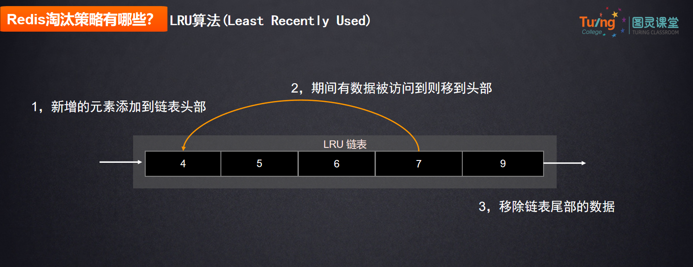
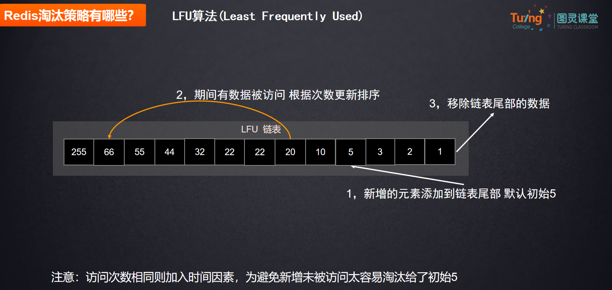
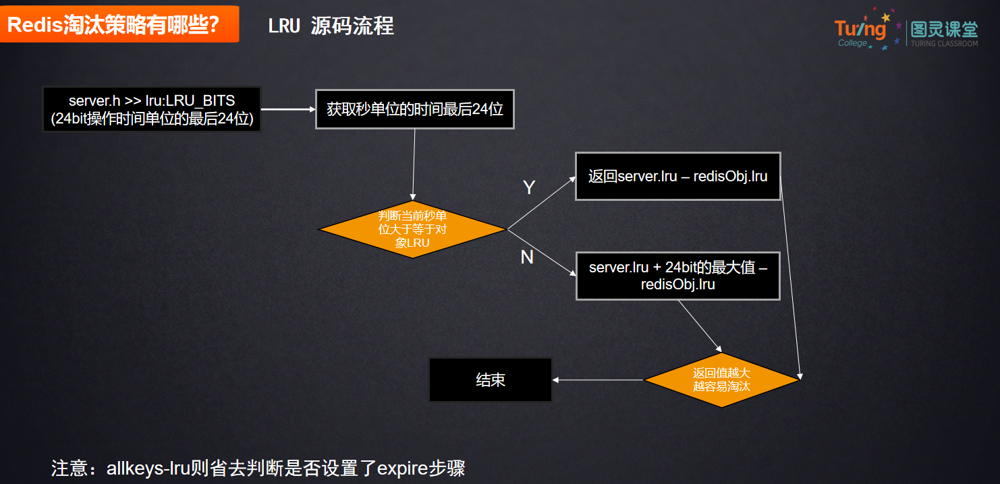
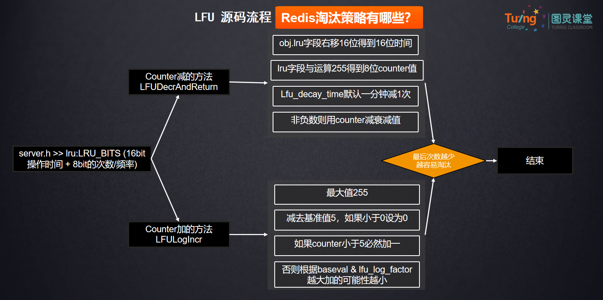

# Redis的内存淘汰策略详解

Redis中的内存淘汰策略用于在内存不足时选择要淘汰的键，以释放内存空间。以下是几种常见的内存淘汰策略：

### noeviction（不淘汰策略）
这种方式呢，当写入缓存时，发现现当内存无法容纳新数据时，Redis会  直接返回错误。这是Redis默认的策略，可以通过redis.conf配置文件修改。

### volatile-LRU（最近最少使用）
从已经设置了过期时间的数据中选择最少使用的进行删除。这个策略优先会删除最久没有被访问的数据，保留最常用的。

### volatile-TTL（根据过期时间优先）
从已经设置了过期时间的数据中选择即将过期的数据进行删除。 剩余时间更长的数据会被保留下来。

### volatile-random（随机删除）
从设置了过期时间的数据中随机选择一个数据进行删除。

### allkeys-lru（全局最近最少使用）
从所有数据中选择最少使用的数据进行删除。跟之前volatile-LRU相比它不管他有没有设置过期时间，都将参与淘汰。

### allkeys-random（全局随机删除）
从所有数据中随机选择一个键进行删除。


应大家要求，上强度 

## LRU和LFU源码解析
**先回顾下基本流程**





<font style="color:rgb(51, 51, 51);">再过一下源码流程图</font>





<font style="color:rgb(51, 51, 51);">最后再给大家详细分析</font>

### <font style="color:rgb(51, 51, 51);">源码部分</font>
<font style="color:rgb(51, 51, 51);">首先再 server.h redisObject {  </font>

<font style="color:rgb(51, 51, 51);">里面lru:LRU_BITS } </font>

<font style="color:rgb(51, 51, 51);">24bit的 记录对象访问，操作时间的秒单位的最后24位</font>

```java
//java里面获取秒
long timeMils = System.currentTimeMilis();
sout( timeMils/1000);//毫秒
sout(1<<24-1) //24位的最大值
sout(timeMils/1000 & (1<<24-1))//最后24位  位操作更快

//假如 12bit（位）
最大值       111111 111111  12bit的最大值
左移12位得到 1 000000 000000   1<<12
再减1       0 111111 111111 

与运算：   假如这样的一串值   
        11111 0000 11110    要去获取最后五位的话
      &            11111    （必须都为1 才是1）
--------------------------
        00000 0000 11110   最快得到最后五位
```

<font style="color:rgb(51, 51, 51);">server.lru 当前时间的秒单位的最后24bit</font>

<font style="color:rgb(51, 51, 51);">server.lru - redisObject.lru</font>

<font style="color:rgb(51, 51, 51);">可能出现轮循的问题。 即 server.lru < redisObject.lru</font>

**<font style="color:rgb(51, 51, 51);">比如</font>**<font style="color:rgb(51, 51, 51);">：</font>

<font style="color:rgb(51, 51, 51);">一个数据 5月访问 现在是6月 多少个月没访问过？ 6-5 =1</font>

<font style="color:rgb(51, 51, 51);">一个数据 5月访问 现在是3月 多少个月没访问过？ 3+12 - 5 =10</font>

<font style="color:rgb(51, 51, 51);">解决方案：</font>

```c
if(server.lru >= redisObject.lru){
    server.lru - redisObject.lru   
    }else{
    server.lru +24bit的最大值 - redisObject.lru   
    }
//伪LRU  不用管年    最大的场景 是缓存
```

<font style="color:rgb(51, 51, 51);">源码实现： evict.c evictionPoolPopulate方法</font>

<font style="color:rgb(51, 51, 51);">判断LRU 进入 estimateObjectIdleTime 方法 </font>

<font style="color:rgb(51, 51, 51);">跟上面讲的对应上</font>

```c
//比较过期
unsigned long long estimateObjectIdleTime(robj *o) {
    //获取秒单位时间的最后24位
    unsigned long long lruclock = LRU_CLOCK();
    //因为只有24位，所有最大的值为2的24次方-1
    //超过最大值从0开始，所以需要判断lruclock（当前系统时间）跟缓存对象的lru字段的大小
    //如果当前秒单位大于等于 对象的LRU的话
    if (lruclock >= o->lru) {
        //如果lruclock>=robj.lru，返回lruclock-o->lru，再转换单位
        return (lruclock - o->lru) * LRU_CLOCK_RESOLUTION;
    } else {
        //否则采用lruclock + (LRU_CLOCK_MAX - o->lru)，得到对象的值越小，返回的值越大，越大越容易被淘汰
        return (lruclock + (LRU_CLOCK_MAX - o->lru)) *
            LRU_CLOCK_RESOLUTION;
    }
}
```

LRU：根据次数来淘汰，越少使用的越容易被淘汰

存在时效性问题 ： 比如某年某网红桃色新闻 1000W次访问，今年最近王姓艺人出事出来没多久10W次访问   ，按次数淘汰会把今年的给淘汰，但过时的老数据没有淘汰。

reids 怎么解决的呢？ 

server.h 中 redisObject.lru 在LFU的场景  注释说明了 

LFU 将这个24bit的字段拆成两份 

16bit的时间 + 8bit的次数/频率 counter（不是简单的访问+1，越多越慢） 

前面记录对象操作访问 分单位的最后16位

```plain
sout( timeMils/1000/60);//
sout(timeMils/1000/60 & (1<<16-1))//最后16位 源码看过没 位操作更快
```

根据系统时间分单位的最后16bit，得到对象多少分钟没有访问了。

```plain
怎么得到的呢？
if(server.lru >= redisObject.lru){
     server.lru - redisObject.lru   
}else{
     server.lru +16bit的最大值 - redisObject.lru   
}
```

玩游戏 会员 v8 但是如果2个月没玩，半年没充的话 掉到v2

根据对象多少分钟没访问，去减少访问次数。

1.16bit的时间就是用来判断多少分钟没访问就去减少多少次， 

可配置

 **lfu-log-factor** 因子等级默认10  对应前面的8bit

 **lfu-decay-time** 衰减时间默认 1 对应前面的16bit

8bit的次数 counter  0~255次

2 最多255次 超过怎么办？源码 evict.c  evictionPoolPopulate方法中直接return255

**LFUDecrAndReturn()   Counter减的方法**

```c
unsigned long LFUDecrAndReturn(robj *o) {
   //object.lru字段右移8位，得到前面16位的时间
    unsigned long ldt = o->lru >> 8;
   //lru字段与255进行&运算（255代表8位的最大值），得到8位counter值
    unsigned long counter = o->lru & 255;
   //如果配置了 lfu_decay_time，用 LFUTimeElapsed(ldt) 除以配置的值
    //总的没访问的分钟时间/配置值，得到每分钟没访问衰减多少
   // 默认得到的就是 一分钟减少一次
    unsigned long num_periods = server.lfu_decay_time ? LFUTimeElapsed(ldt) / server.lfu_decay_time : 0;
    if (num_periods)
      //不能减少为负数，非负数用couter值减去衰减值
        counter = (num_periods > counter) ? 0 : counter - num_periods;
    return counter;
}
```

<font style="color:rgb(51, 51, 51);">假如：现在次数 50次，有10分钟没访问了， 现在还剩多少次？ 40</font>

<font style="color:rgb(51, 51, 51);">继续看 往上一个 LFULogIncr 方法 增加次数</font>

<font style="color:rgb(51, 51, 51);">1，最多不能超过255</font>

<font style="color:rgb(51, 51, 51);">2，新生key策略。由于新创建的对象如果counter 0 很容易被淘汰 所以初始值 为5</font>

<font style="color:rgb(51, 51, 51);">robj *createObject( 方法中 LFU_INIT_VAL 默认5。（在server.h配置））</font>

<font style="color:rgb(51, 51, 51);">3，不是简单的访问+1，次数小于5必+1，越大越慢 跟baseval与lfu_log_factor相关</font>

<font style="color:rgb(51, 51, 51);"> </font>**<font style="color:rgb(51, 51, 51);">LFULogIncr()</font>**<font style="color:rgb(51, 51, 51);">  Counter加的方法</font>

```c
uint8_t LFULogIncr(uint8_t counter) {
   //如果已经到最大值255，返回255 ，8位的最大值
    if (counter == 255) return 255;
   //得到随机数（0-1）
    double r = (double)rand()/RAND_MAX;
   //LFU_INIT_VAL表示基数值,默认为5（在server.h配置）
    double baseval = counter - LFU_INIT_VAL;
   //如果当前counter小于基数，那么p=1,100%加
    if (baseval < 0) baseval = 0;
   //不然，按照几率是否加counter，同时跟baseval与lfu_log_factor相关
    //都是在分母，所以2个值越大，加counter几率越小，越大加的几率越小（所以刚才的255够不够的问题解决）
    double p = 1.0/(baseval*server.lfu_log_factor+1);
    if (r < p) counter++;  //p越小，几率也就越小
    return counter;
}
```

<font style="color:rgb(51, 51, 51);">最后自己可以再看看官网， 两参的对照表 点击数与 factor分布 是不是很好理解了。</font>

<font style="color:rgb(51, 51, 51);">现在面试官问你：redis怎么解决时效性问题？或者LFU/LFU算法怎么实现的？你应该能讲的出来了吧？</font>


> 更新: 2025-06-19 08:59:21  
> 原文: <https://www.yuque.com/tulingzhouyu/db22bv/fn1agyxs0t15wlvu>