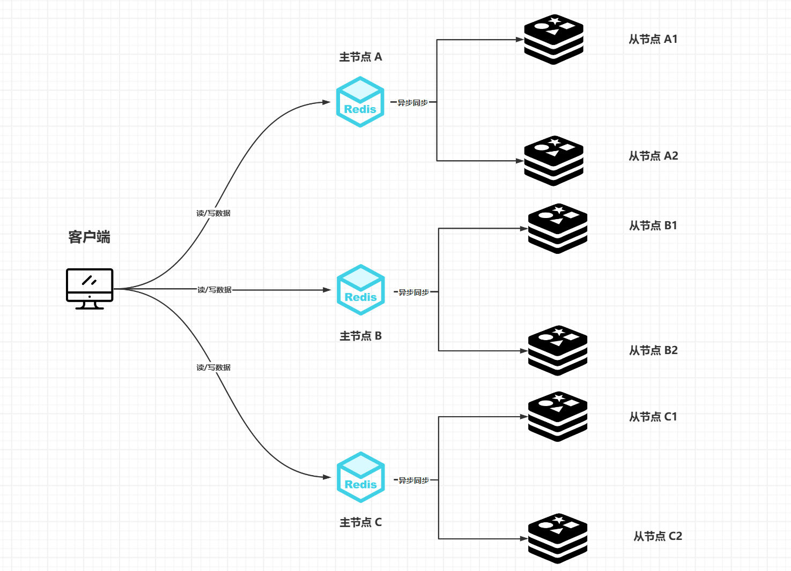
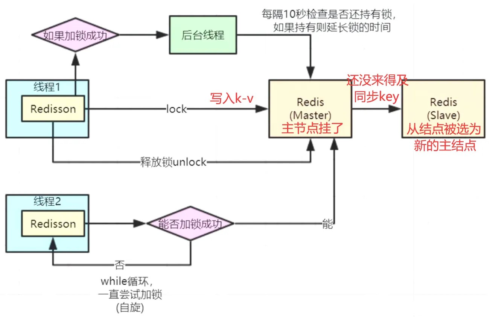

# Redis集群下主节点挂了会导致超卖吗？

在Redis集群环境下，主节点挂掉确实可能导致超卖问题，主要原因在于Redis主从同步的异步机制和分布式锁的失效风险。以下是详细分析：

### 1. **主从异步同步导致的数据不一致**

Redis默认采用异步主从同步，主节点写入数据后不会立即同步到从节点。如果主节点在同步完成前宕机，从节点可能缺失最新数据。此时选举出的新主节点可能包含未同步的库存信息，导致后续请求基于旧数据进行操作，引发超卖。

+ **举例**：假设主节点扣减库存后未同步到从节点，主节点宕机后切换至旧数据的从节点。后续请求继续读取未更新的库存值，误判为仍有库存，导致重复扣减。

### 2. **分布式锁失效风险**

+ 在集群中使用单节点分布式锁时，若**主节点宕机且锁未同步到从节点**，**新主节点可能不包含该锁**。此时其他线程可能同时获取锁并操作库存，造成超卖。
+ **案例**：使用Redisson实现的锁在主节点宕机后，若未通过RedLock等算法确保半数以上节点同步锁，新请求可能绕过锁机制并发扣减库存。

### 3. **解决方案**
+ **RedLock算法**：向集群中多个节点同时加锁，超过半数成功才视为加锁成功。即使部分节点宕机，仍能保证锁的强一致性。
+ **原子操作与Lua脚本**：通过`incrby`、`decr`等原子命令或Lua脚本保证库存查验与扣减的原子性，避免读取旧值。
+ **乐观锁机制**：结合版本号或CAS（Compare and Set），仅在数据未被修改时执行扣减，否则重试。
+ **消息队列削峰**：将请求缓冲至队列，按顺序处理以降低并发压力。

### 4. **典型场景验证**
+ 主从切换时若锁或库存数据未同步，超卖问题可能发生。例如，线程A在主节点扣减库存后主节点宕机，线程B在从节点（未同步数据）继续扣减，导致超卖。
+ 即使Redis单线程处理命令，若业务逻辑未保证原子性（如先读后写），高并发下仍会因时间差导致超卖。

### 结论
Redis集群主节点挂掉**可能引发超卖**，核心风险在于**异步同步机制**和**分布式锁的局限性**。

需通过RedLock、原子操作、Lua脚本等方案确保操作的原子性与锁的强一致性，从而规避超卖风险。

> 更新: 2025-05-22 13:16:51  
> 原文: <https://www.yuque.com/tulingzhouyu/db22bv/ao2fxqchp8pz5pss>