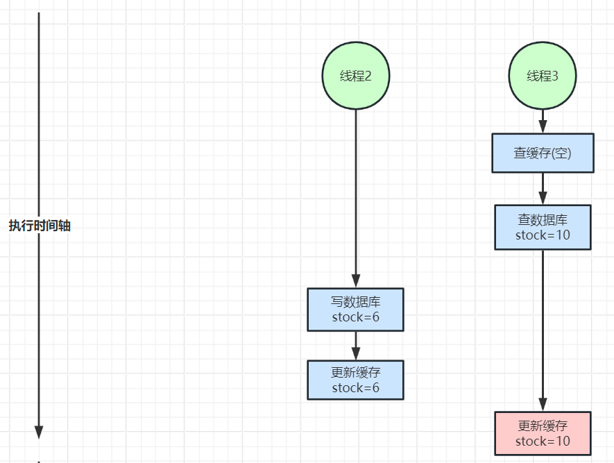
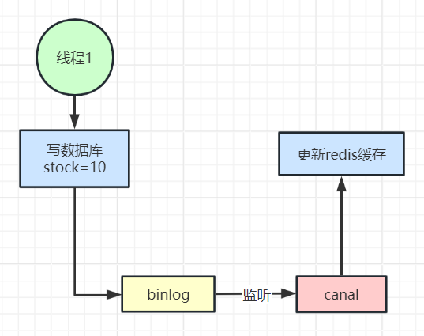

# 缓存与数据库双写不一致问题如何解决

<font style="color:rgba(0, 0, 0, 0.82);">在使用Redis缓存作为数据库的加速层时，可能会遇到缓存和数据库双写不一致的问题。这种不一致通常发生在更新操作时，即数据写入数据库但未及时更新缓存或者缓存更新后数据库未同步，导致读取到过时的数据。</font>



<font style="color:rgba(0, 0, 0, 0.82);"></font>

<font style="color:rgba(0, 0, 0, 0.82);">为了解决Redis缓存和数据库双写不一致问题，可以使用以下策略：</font>

#### <font style="color:rgba(0, 0, 0, 0.82);">1.</font><font style="color:rgba(0, 0, 0, 0.82);"> </font>**<font style="color:rgba(0, 0, 0, 0.82);">缓存Aside模式（Cache Aside Pattern）</font>**
+ **<font style="color:rgba(0, 0, 0, 0.82);">读操作</font>**<font style="color:rgba(0, 0, 0, 0.82);">：先从缓存读取数据，如果缓存未命中（缓存失效），再从数据库读取数据，然后将数据写入缓存。</font>
+ **<font style="color:rgba(0, 0, 0, 0.82);">写操作</font>**<font style="color:rgba(0, 0, 0, 0.82);">：先更新数据库，再删除缓存。这种做法会导致缓存短暂失效，下一次读取会从数据库加载并更新缓存。</font>

```java
public class CacheAside {  
    private RedisClient redis;  
    private DatabaseClient db;  

    public String read(String key) {  
        String value = redis.get(key);  

        if (value == null) { // 缓存未命中  
            value = db.query(key); // 从数据库读取  
            redis.set(key, value); // 更新缓存  
        }  

        return value;  
    }  

    public void write(String key, String value) {  
        db.update(key, value); // 更新数据库  
        redis.del(key); // 删除缓存  
    }  
}
```

#### <font style="color:rgba(0, 0, 0, 0.82);">2.</font><font style="color:rgba(0, 0, 0, 0.82);"> </font>**<font style="color:rgba(0, 0, 0, 0.82);">更新缓存策略</font>**
<font style="color:rgba(0, 0, 0, 0.82);">针对高并发写场景，使用合适的锁机制防止同时更新缓存和数据库时导致的数据不一致。</font>

+ <font style="color:rgba(0, 0, 0, 0.82);">使用分布式锁：在更新操作中加锁，确保同一时间只有一个操作在进行。</font>

```java


public class SynchronizedCache {  
    private final Lock lock = Redisson.getLock();  
    private RedisClient redis;  
    private DatabaseClient db;  

    public void writeWithLock(String key, String value) {  
        lock.lock();  
        try {  
            db.update(key, value);  
            redis.del(key);  
        } finally {  
            lock.unlock();  
        }  
    }  
}
```

#### <font style="color:rgba(0, 0, 0, 0.82);">3. 用canal中间件</font>**<font style="color:rgba(0, 0, 0, 0.82);">异步更新缓存</font>**


<font style="color:rgba(0, 0, 0, 0.82);">4. </font>**<font style="color:rgba(0, 0, 0, 0.82);">利用过期时间</font>**

<font style="color:rgba(0, 0, 0, 0.82);">设置合理的过期时间可以缓解不一致带来的影响，通过 TTL（Time to Live）确保数据在一定时间后更新。</font>

```java
public class CacheWithTTL {  
    private RedisClient redis;  

    public void cacheDataWithTTL(String key, String value, int ttlSeconds) {  
        redis.setex(key, ttlSeconds, value); // 设置缓存过期时间  
    }  
}
```

### <font style="color:rgba(0, 0, 0, 0.82);">结论</font>
<font style="color:rgba(0, 0, 0, 0.82);">这些解决方案可以根据需要单独或组合使用，以减小和缓解Redis缓存与数据库数据不一致的问题。适当的解决方案选择依赖于具体业务中的读写比、性能要求和容错要求。其中，异步更新策略是实现最终一致性的一种有效方式。通过监控和日志分析，也可以及时发现潜在的不一致情况，并进行后续的修复和优化。</font>


> 更新: 2024-08-07 21:43:04  
> 原文: <https://www.yuque.com/tulingzhouyu/db22bv/tr4oiknyzf0viap1>