# 说说Redis的持久化机制

#### 简答
Redis有两种持久化机制：**RDB和AOF**。

+ RDB是一种快照持久化的方式，它会将Redis在某个时间点的数据状态以二进制的方式保存到硬盘上的一个文件中。RDB持久化可以通过配置定时或手动触发，也可以设置自动触发的条件。RDB的优点是生成的文件比AOF文件更小，恢复速度也更快，适合用于备份和灾难恢复。
+ AOF是一种追加日志持久化方式，它会将Redis执行的写命令追加到一个文件的末尾。当Redis重启时，它会重新执行这些写命令来恢复数据状态。AOF提供了更可靠的持久化方式，因为它可以保证每个写操作都被记录下来，并且不会发生数据丢失的情况。AOF文件可以根据配置进行同步写入硬盘的频率，包括每秒同步、每写入命令同步和禁用同步三种模式。

在使用持久化机制时，可以选择同时使用RDB和AOF，也可以只使用其中一种。同时使用两种方式时，Redis在重启时会先加载AOF文件来恢复数据，如果AOF文件不存在或损坏，则会尝试加载RDB文件。因此，AOF具有更高的优先级。

应大家要求，上强度 给补充写[深入探讨的追问](https://www.yuque.com/tianming-aroh0/sagnbd)

#### 给哪些内存数据做快照?
Redis 的数据都在内存中，为了提供所有数据的可靠性保证，它执行的是全量快照，也就是说，把内存中的所有数据都记录到磁盘中。但是，RDB 文件就越大，往磁盘上写数据的时间开销就越大。

分为自动触发与手动触发两种

1.redis.conf中配置：

save 900 1 //900s内有1个key被修改 

save 300 10 //300s内有10个key被修改 

save 60 10000 //60s内有10000个key被修改

2.执行命令

shutdown 正常关闭服务

flushall	备份空文件

save	会阻塞

bgsave	后台线程

#### RDB文件的生成是否会阻塞主线程
Redis 提供了两个手动命令来生成 RDB 文件，分别是 save 和 bgsave。

save：在主线程中执行，会导致阻塞；对于内存比较大的实例会造成长时间阻塞，线上环境不建议使用。bgsave：创建一个子进程，专门用于写入 RDB 文件，避免了主线程的阻塞，这也是Redis RDB 文件生成的默认配置。

命令实战演示

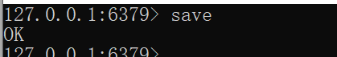

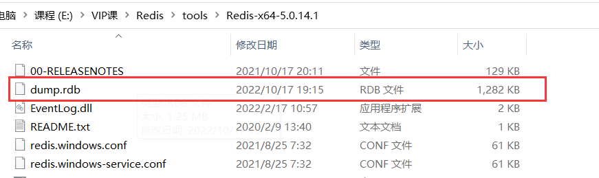

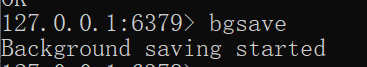

除了执行命令手动触发之外，Redis内部还存在自动触发RDB 的持久化机制，例如以下场景:

1)使用save相关配置,如“save m n”。表示m秒内数据集存在n次修改时，自动触发bgsave。

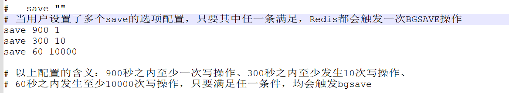

2）如果从节点执行全量复制操作，主节点自动执行bgsave生成RDB文件并发送给从节点。

3)执行debug reload命令重新加载Redis 时，也会自动触发save操作。

4）默认情况下执行shutdown命令时，如果没有开启AOF持久化功能则自动执行bgsave。

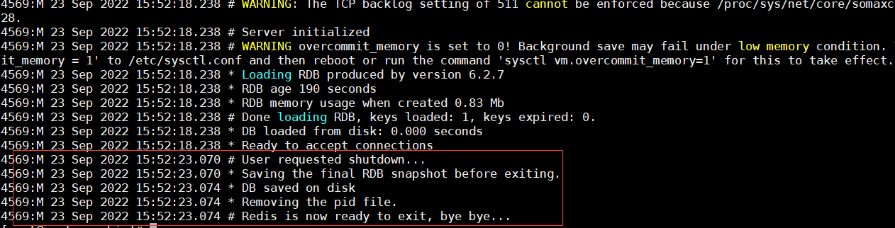

关闭RDB持久化，在课程讲述的Redis版本（6.2.4）上，是将配置文件中的save配置改为 save “”

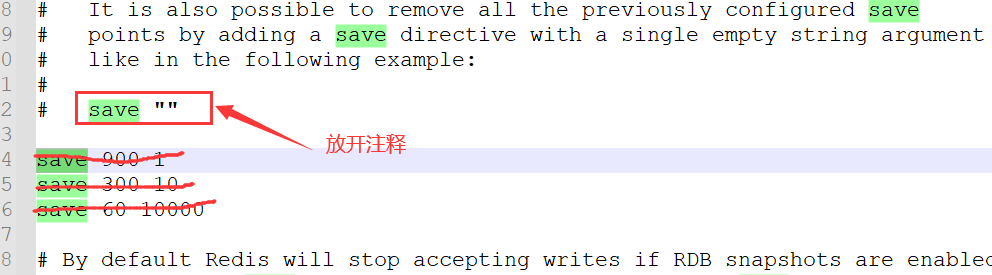

#### bgsave执的行流程
为了快照而暂停写操作，肯定是不能接受的。所以这个时候，Redis 就会借助操作系统提供的写时复制技术（Copy-On-Write, COW），在执行快照的同时，正常处理写操作。

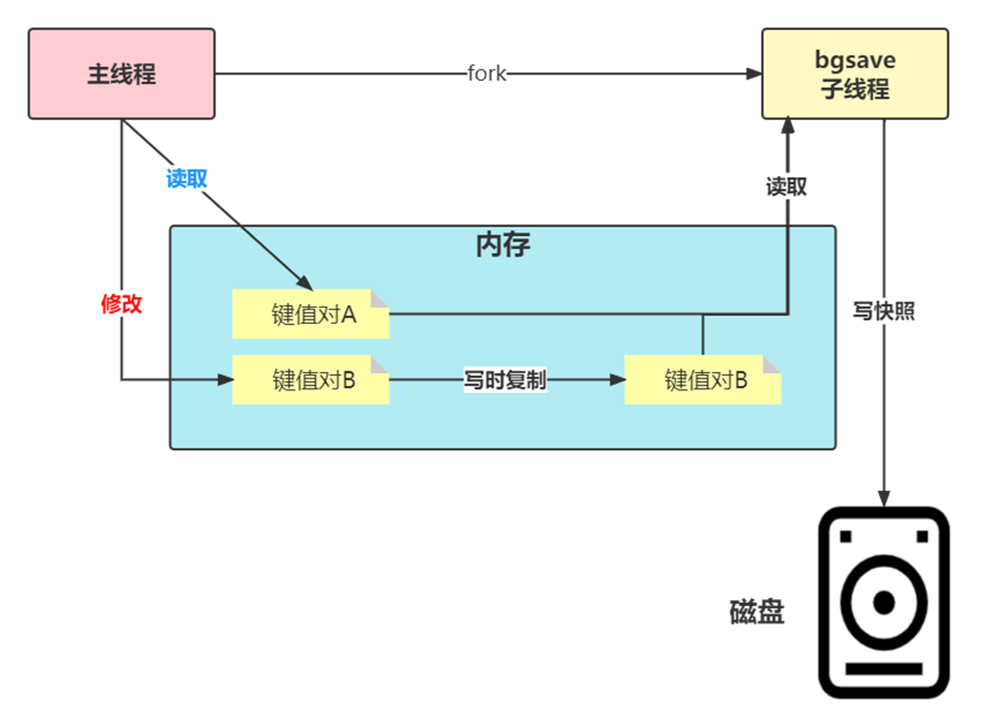

bgsave 子进程是由主线程 fork 生成的，可以共享主线程的所有内存数据。bgsave 子进程运行后，开始读取主线程的内存数据，并把它们写入 RDB 文件。

如果主线程对这些数据也都是读操作（例如图中的键值对 A），那么，主线程和bgsave 子进程相互不影响。但是，如果主线程要修改一块数据（例如图中的键值对 B），那么，这块数据就会被复制一份，生成该数据的副本。然后，bgsave 子进程会把这个副本数据写入 RDB 文件，而在这个过程中，主线程仍然可以直接修改原来的数据。

这既保证了快照的完整性，也允许主线程同时对数据进行修改，避免了对正常业务的影响。

#### RDB文件
RDB文件保存在dir配置指定的目录下，文件名通过dbfilename配置指定。

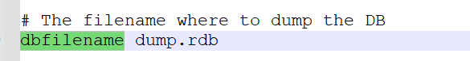

可以通过执行config set dir {newDir}和config set dbfilename (newFileName}运行期动态执行,当下次运行时RDB文件会保存到新目录。

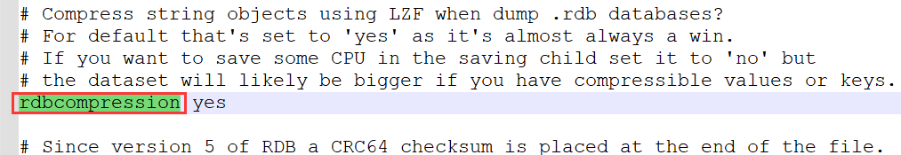

Redis默认采用LZF算法对生成的RDB文件做压缩处理，压缩后的文件远远小于内存大小，默认开启，可以通过参数config set rdbcompression { yes |no}动态修改。虽然压缩RDB会消耗CPU，但可大幅降低文件的体积，方便保存到硬盘或通过网维示络发送给从节点,因此线上建议开启。如果 Redis加载损坏的RDB文件时拒绝启动,并打印如下日志:

Short read or OOM loading DB. Unrecoverable error，aborting now.

这时可以使用Redis提供的redis-check-rdb工具(老版本是redis-check-dump)检测RDB文件并获取对应的错误报告。

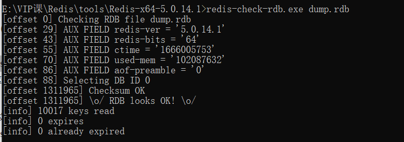

#### RDB的优缺点
##### RDB的优点
RDB是一个紧凑压缩的二进制文件，代表Redis在某个时间点上的数据快照。非常适用于备份,全量复制等场景。

比如每隔几小时执行bgsave备份，并把 RDB文件拷贝到远程机器或者文件系统中(如hdfs),，用于灾难恢复。

Redis加载RDB恢复数据远远快于AOF的方式。

##### RDB的缺点
RDB方式数据没办法做到实时持久化/秒级持久化。因为bgsave每次运行都要执行fork操作创建子进程,属于重量级操作,频繁执行成本过高。

RDB文件使用特定二进制格式保存，Redis版本演进过程中有多个格式的RDB版本，存在老版本Redis服务无法兼容新版RDB格式的问题。

### Redis中RDB导致的数据丢失问题
针对RDB不适合实时持久化的问题,Redis提供了AOF持久化方式来解决。

如下图所示，我们先在 T0 时刻做了一次快照（下一次快照是T4时刻），然后在T1时刻，数据块 5 和 8 被修改了。如果在T2时刻，机器宕机了，那么，只能按照 T0 时刻的快照进行恢复。此时，数据块 5 和 8 的修改值因为没有快照记录，就无法恢复了。

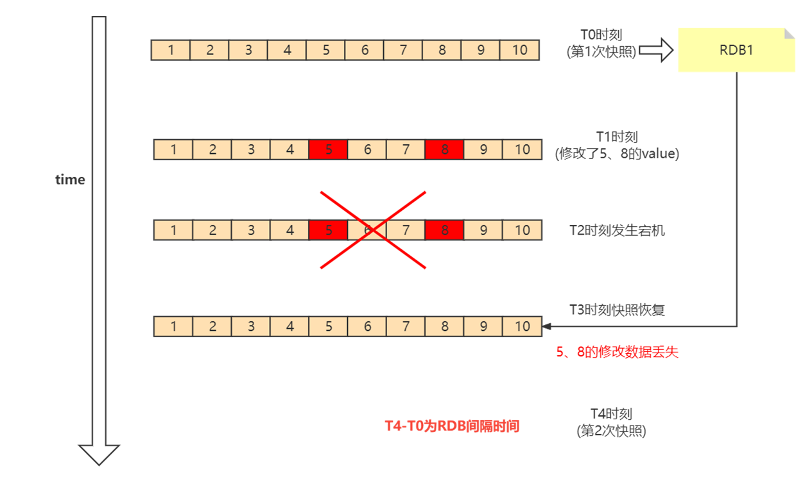

所以这里可以看出，如果想丢失较少的数据，那么T4-T0就要尽可能的小，但是如果频繁地执行全量快照，也会带来两方面的开销：

1、频繁将全量数据写入磁盘，会给磁盘带来很大压力，多个快照竞争有限的磁盘带宽，前一个快照还没有做完，后一个又开始做了，容易造成恶性循环。

2、另一方面，bgsave 子进程需要通过 fork 操作从主线程创建出来。虽然子进程在创建后不会再阻塞主线程，但是，fork 这个创建过程本身会阻塞主线程，而且主线程的内存越大，阻塞时间越长。如果频繁fork出bgsave 子进程，这就会频繁阻塞主线程了。

所以基于这种情况，我们就需要AOF的持久化机制。

### AOF
AOF(append only file)持久化:以独立日志的方式记录每次写命令，重启时再重新执行AOF文件中的命令达到恢复数据的目的。AOF的主要作用是解决了数据持久化的实时性,目前已经是Redis持久化的主流方式。理解掌握好AOF持久化机制对我们兼顾数据安全性和性能非常有帮助。

#### 使用AOF
开启AOF功能需要设置配置:appendonly yes，默认不开启。

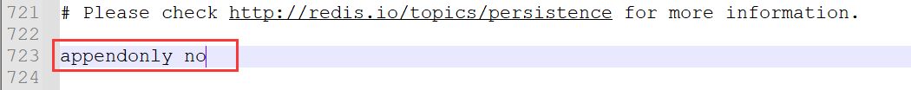

AOF文件名通过appendfilename配置设置，默认文件名是appendonly.aof。保存路径同RDB持久化方式一致，通过dir配置指定。

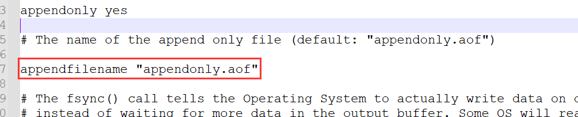

### AOF的工作流程
AOF的工作流程主要是4个部分:命令写入( append)、文件同步( sync)、文件重写(rewrite)、重启加载( load)。

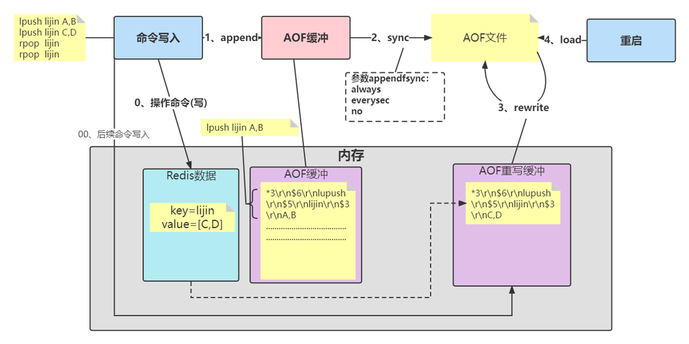

#### 命令写入
AOF命令写入的内容直接是RESP文本协议格式。例如lpush tianming A B这条命令，在AOF缓冲区会追加如下文本:

*3\r\n$6\r\nlupush\r\n$5\r\tianming\r\n$3\r\nA B

看看 AOF 日志的内容。其中，“*3”表示当前命令有三个部分，每部分都是由“$+数字”开头，后面紧跟着具体的命令、键或值。这里，“数字”表示这部分中的命令、键或值一共有多少字节。例如，“$3 set”表示这部分有 3 个字节，也就是“set”命令。

1 )AOF为什么直接采用文本协议格式?

文本协议具有很好的兼容性。开启AOF后，所有写入命令都包含追加操作，直接采用协议格式，避免了二次处理开销。文本协议具有可读性,方便直接修改和处理。

2）AOF为什么把命令追加到aof_buf中?

Redis使用单线程响应命令，如果每次写AOF文件命令都直接追加到硬盘，那么性能完全取决于当前硬盘负载。先写入缓冲区aof_buf中，还有另一个好处，Redis可以提供多种缓冲区同步硬盘的策略，在性能和安全性方面做出平衡。

Redis提供了多种AOF缓冲区同步文件策略，由参数appendfsync控制。

**always**

同步写回：每个写命令执行完，立马同步地将日志写回磁盘；

**everysec**

每秒写回：每个写命令执行完，只是先把日志写到 AOF 文件的内存缓冲区，每隔一秒把缓冲区中的内容写入磁盘；

**no**

操作系统控制的写回：每个写命令执行完，只是先把日志写到 AOF 文件的内存缓冲区，由操作系统决定何时将缓冲区内容写回磁盘，通常同步周期最长30秒。

很明显，配置为always时，每次写入都要同步AOF文件，在一般的SATA 硬盘上，Redis只能支持大约几百TPS写入,显然跟Redis高性能特性背道而驰,不建议配置。

配置为no，由于操作系统每次同步AOF文件的周期不可控,而且会加大每次同步硬盘的数据量,虽然提升了性能,但数据安全性无法保证。

配置为everysec，是建议的同步策略，也是默认配置，做到兼顾性能和数据安全性。理论上只有在系统突然宕机的情况下丢失1秒的数据。(严格来说最多丢失1秒数据是不准确的)

想要获得高性能，就选择 no 策略；如果想要得到高可靠性保证，就选择always 策略；如果允许数据有一点丢失，又希望性能别受太大影响的话，那么就选择everysec 策略。

#### 重写机制
随着命令不断写入AOF，文件会越来越大，为了解决这个问题，Redis引入AOF重写机制压缩文件体积。AOF文件重写是把Redis进程内的数据转化为写命令同步到新AOF文件的过程。

**重写后的AOF 文件为什么可以变小?有如下原因:**

1)进程内已经超时的数据不再写入文件。

2)旧的AOF文件含有无效命令，如set a 111、set a 222等。重写使用进程内数据直接生成，这样新的AOF文件只保留最终数据的写入命令。

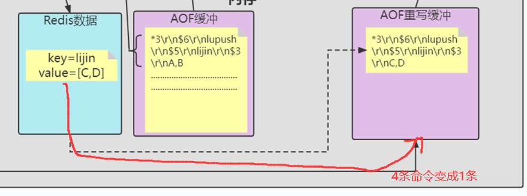

3）多条写命令可以合并为一个，如:lpush list a、lpush list b、lpush list c可以转化为: lpush list a b c。为了防止单条命令过大造成客户端缓冲区溢出，对于list、set、hash、zset等类型操作，以64个元素为界拆分为多条。

AOF重写降低了文件占用空间，除此之外，另一个目的是:更小的AOF文件可以更快地被Redis加载。

AOF重写过程可以手动触发和自动触发:

手动触发:直接调用bgrewriteaof命令。

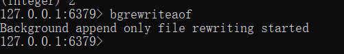

自动触发:根据auto-aof-rewrite-min-size和 auto-aof-rewrite-percentage参数确定自动触发时机。

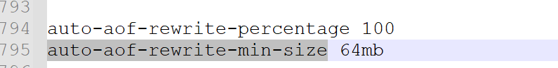

auto-aof-rewrite-min-size:表示运行AOF重写时文件最小体积，默认为64MB。

auto-aof-rewrite-percentage :代表当前AOF 文件空间(aof_currentsize）和上一次重写后AOF 文件空间(aof_base_size)的比值。

**另外，如果在Redis在进行AOF重写时，有写入操作，这个操作也会被写到重写日志的缓冲区。这样，重写日志也不会丢失最新的操作。**

#### 重启加载
AOF和 RDB 文件都可以用于服务器重启时的数据恢复。redis重启时加载AOF与RDB的顺序是怎么样的呢？

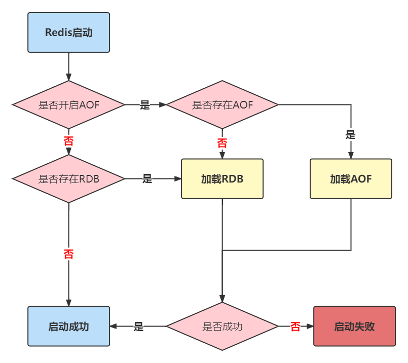

1，当AOF和RDB文件同时存在时，优先加载AOF

2，若关闭了AOF，加载RDB文件

3，加载AOF/RDB成功，redis重启成功

4，AOF/RDB存在错误，启动失败打印错误信息

#### 文件校验
加载损坏的AOF 文件时会拒绝启动，对于错误格式的AOF文件，先进行备份，然后采用redis-check-aof --fix命令进行修复，对比数据的差异，找出丢失的数据，有些可以人工修改补全。

AOF文件可能存在结尾不完整的情况，比如机器突然掉电导致AOF尾部文件命令写入不全。Redis为我们提供了aof-load-truncated 配置来兼容这种情况，默认开启。加载AOF时当遇到此问题时会忽略并继续启动,同时如下警告日志。

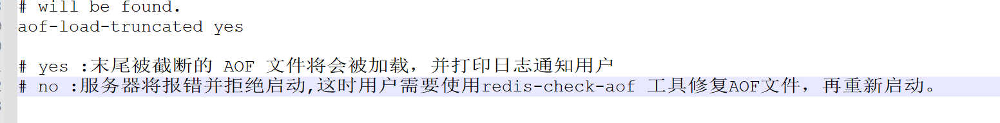

### RDB-AOF混合持久化
通过 `aof-use-rdb-preamble` 配置项可以打开混合开关，yes则表示开启，no表示禁用，默认是禁用的，可通过config set修改

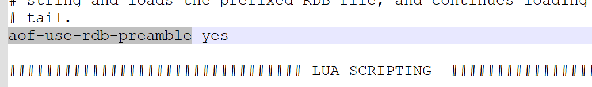

该状态开启后，如果执行bgrewriteaof命令，则会把当前内存中已有的数据弄成二进程存放在aof文件中，这个过程模拟了rdb生成的过程，然后Redis后面有其他命令，在触发下次重写之前，依然采用AOF追加的方式

**总流程图：**

### Redis持久化相关的问题
#### 主线程、子进程和后台线程的联系与区别？
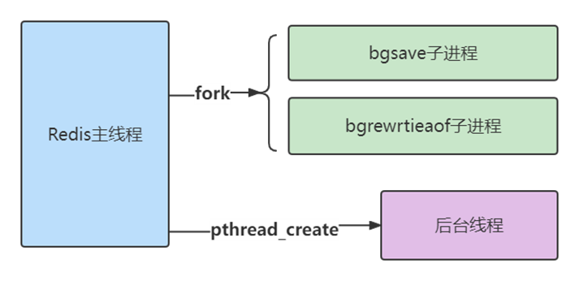

**进程和线程的区别**

从操作系统的角度来看，进程一般是指资源分配单元，例如一个进程拥有自己的堆、栈、虚存空间（页表）、文件描述符等；

而线程一般是指 CPU 进行调度和执行的实体。

一个进程启动后，没有再创建额外的线程，那么，这样的进程一般称为主进程或主线程。

Redis 启动以后，本身就是一个进程，它会接收客户端发送的请求，并处理读写操作请求。而且，接收请求和处理请求操作是 Redis 的主要工作，Redis 没有再依赖于其他线程，所以，我一般把完成这个主要工作的 Redis 进程，称为主进程或主线程。

**主线程与子进程**

通过fork创建的子进程，一般和主线程会共用同一片内存区域，所以上面就需要使用到写时复制技术确保安全。

**后台线程**

从 4.0 版本开始，Redis 也开始使用pthread_create 创建线程，这些线程在创建后，一般会自行执行一些任务，例如执行异步删除任务

#### Redis持久化过程中有没有其他潜在的阻塞风险？
当Redis做RDB或AOF重写时，一个必不可少的操作就是执行**fork操作创建子进程**,对于大多数操作系统来说fork是个重量级错误。虽然fork创建的子进程不需要拷贝父进程的物理内存空间，但是会复制父进程的空间内存页表。例如对于10GB的Redis进程，需要复制大约20MB的内存页表，因此fork操作耗时跟进程总内存量息息相关，如果使用虚拟化技术，特别是Xen虚拟机,fork操作会更耗时。

**fork耗时问题定位:**

对于高流量的Redis实例OPS可达5万以上，如果fork操作耗时在秒级别将拖慢Redis几万条命令执行，对线上应用延迟影响非常明显。正常情况下fork耗时应该是每GB消耗20毫秒左右。可以在info stats统计中查latest_fork_usec指标获取最近一次fork操作耗时,单位微秒。

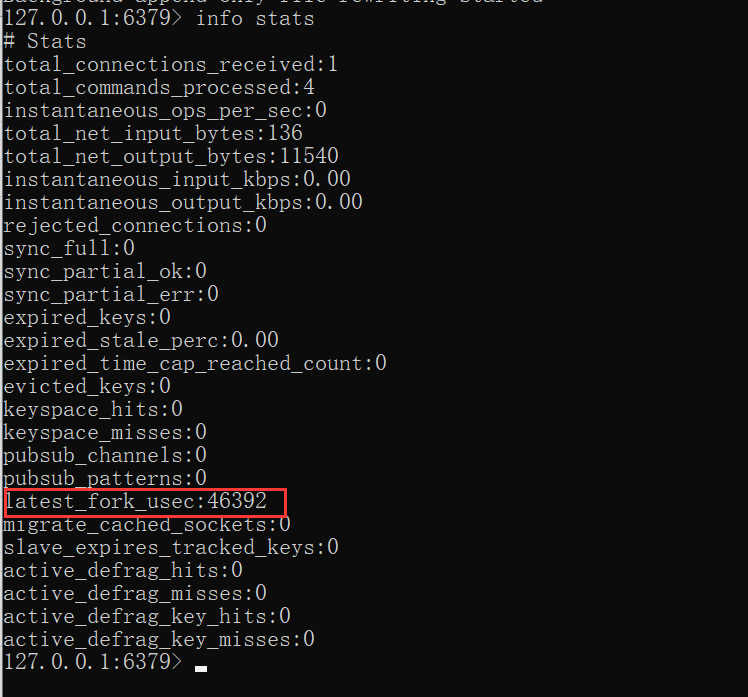

如何改善fork操作的耗时:

1）优先使用物理机或者高效支持fork操作的虚拟化技术

2）控制Redis实例最大可用内存，fork耗时跟内存量成正比,线上建议每个Redis实例内存控制在10GB 以内。

3）降低fork操作的频率，如适度放宽AOF自动触发时机，避免不必要的全量复制等。

#### 为什么主从库间的复制不使用 AOF？
1、RDB 文件是二进制文件，无论是要把 RDB 写入磁盘，还是要通过网络传输 RDB，IO效率都比记录和传输 AOF 的高。

2、在从库端进行恢复时，用 RDB 的恢复效率要高于用 AOF。

> 更新: 2025-06-18 16:35:25  
> 原文: <https://www.yuque.com/tulingzhouyu/db22bv/lefz0ffra2wp5veg>