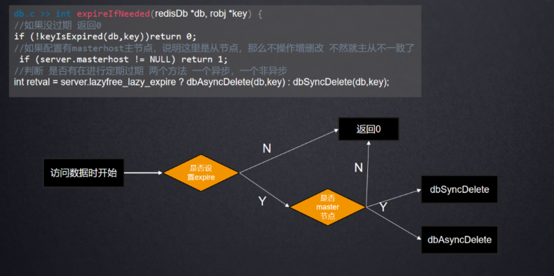

# 说说Redis的过期策略

### 简答
过期策略主要有三种：惰性删除、定期删除和定期淘汰。

1. **惰性删除：** 惰性删除是Redis默认的过期键删除策略。当客户端尝试访问一个已过期的键时，Redis会立即将该键删除，并返回空值。这种策略的优点是删除操作是在需要时进行，减少了不必要的删除开销。但是，如果大量过期键在一次性被访问之前没有被访问过，这些键会一直占据内存空间。
2. **定期删除：**Redis会每隔一段时间执行一次检查，删除那些已过期的键。默认情况下，Redis每秒执行10次检查。定期删除通过释放过期键所占据的内存空间，使得内存能够及时被回收。但这种方式可能会导致内存占用较高，因为Redis并不保证在每次定期删除操作中都会删除足够数量的过期键。
3. **定期淘汰：** 定期淘汰是Redis 4.0版本引入的一种新的过期策略。与定期删除不同的是，定期淘汰不仅删除已过期的键，而且会主动查找并淘汰一些尚未过期但是由于内存不足而需要释放的键。通过定期淘汰，Redis可以更主动地管理内存，避免因为内存持续增长而导致系统性能下降。

总的来说，我们需要根据实际需求和业务场景选择最适合的过期策略，以平衡内存使用和系统性能。


应大家要求，上强度 给补充[**些深入探讨的追问**](https://www.yuque.com/tianming-aroh0/sagnbd)

### <font style="color:rgb(51, 51, 51);">定期过期详解</font>
<font style="color:rgb(51, 51, 51);">Redis 所有的数据结构都可以设置过期时间，时间一到，就需要删除。但是会不会因为同一时间太多的key 过期，以至于忙不过来。同时因为Redis 是单线程的，删除的时间也会占用线程的处理时间，如果删除的太过于繁忙，会不会导致线上读写指令出现卡顿。</font>

<font style="color:rgb(51, 51, 51);">过期的 key 集合</font>

<font style="color:rgb(51, 51, 51);">redis 会将每个设置了过期时间的</font><font style="color:rgb(51, 51, 51);">key 放入到一个独立的字典中，以后会定时遍历这个字典来删除到期的 key。除了定时遍历之外，它还会使用惰性策略来删除过期的 key，所谓惰性策略就是在客户端访问这个 key 的时候，redis 对 key 的过期时间进行检查，如果过期了就立即删除。定时删除是集中处理，惰性删除是零散处理。</font>

<font style="color:rgb(51, 51, 51);">定时扫描策略</font>

#### <font style="color:rgb(51, 51, 51);">怎么去过期呢？ </font>
<font style="color:rgb(51, 51, 51);">隔一段时间去监测一下 (redis.conf hz 10 1秒10次) </font>

<font style="color:rgb(51, 51, 51);"></font>**<font style="color:rgb(51, 51, 51);">多久去看一次 ？</font>**

**<font style="color:rgb(51, 51, 51);">看哪些？</font>**

<font style="color:rgb(51, 51, 51);">流程： 1，每秒10次去检查 设置了过期时间的 key</font>

<font style="color:rgb(51, 51, 51);">	2，根据Hash桶的维度去拿 （拿到20个元素 就不会再拿后面的桶，前面不足20个就拿到400个hash桶） </font>

<font style="color:rgb(51, 51, 51);">	3，删除过期的数据</font>

<font style="color:rgb(51, 51, 51);">	4，如果没有拿到过期数据 或者过期数据超过 10% 则继续上面的过程 </font>

<font style="color:rgb(51, 51, 51);">	5，循环4这个步骤 到16次 就判断是否超时 25 ms</font>

<font style="color:rgb(51, 51, 51);">	</font>

#### <font style="color:rgb(51, 51, 51);">比如： 第一个hash桶 有 40 第二个桶有 10 个 拿 40 就去删除已经过期的数据，如果过期的有30个怎么办？</font>
<font style="color:rgb(51, 51, 51);">就会继续拿</font>

<font style="color:rgb(51, 51, 51);">第一个hash桶 有 10 第二个桶有 5个 第三个桶 100 拿 115 就去删除</font>

<font style="color:rgb(51, 51, 51);">前400桶都是空的 呢， </font>

```plain
//多久执行一次 找config.c   redis.conf  默认10  默认100ms一次 。范围1-500建议小于100.
   return 1000/server.hz;
```

<font style="color:rgb(51, 51, 51);">高并发时候 或者 很闲的时候 </font>

dynamic-hz yes   自适应加减频率

#### <font style="color:rgb(51, 51, 51);">源码流程：</font>
#### 
### <font style="color:rgb(51, 51, 51);">被动过期详解</font>
<font style="color:rgb(51, 51, 51);">所谓惰性策略就是在客户端访问这个key的时候，redis对key的过期时间进行检查，如果过期了就立即删除，不会给你返回任何东西。</font>

<font style="color:rgb(51, 51, 51);">定期删除可能会导致很多过期key到了时间并没有被删除掉。所以就有了惰性删除。假如你的过期 key，靠定期删除没有被删除掉，还停留在内存里，除非你的系统去查一下那个 key，才会被redis给删除掉。这就是所谓的惰性删除，即当你主动去查过期的key时,如果发现key过期了,就立即进行删除,不返回任何东西.</font>

#### <font style="color:rgb(51, 51, 51);">被动过期流程：		</font>
<font style="color:rgb(51, 51, 51);">惰性过期 ：访问数据的时候看是否过期 </font>

<font style="color:rgb(51, 51, 51);">流程 ：1，拿到到设置过期时间的key，如果没有设置过期时间 返回0 </font>

<font style="color:rgb(51, 51, 51);">	2，判断是否主节点 ，如果是 则继续</font>

<font style="color:rgb(51, 51, 51);">	3，同步的和异步的方法去删除 key </font>

#### <font style="color:rgb(51, 51, 51);">源码流程：</font>


### <font style="color:rgb(51, 51, 51);">附源码解读：</font>
<font style="color:rgb(51, 51, 51);">在 server.h </font>

<font style="color:rgb(51, 51, 51);">过期淘汰策略 从此开始 统一维护的key redisDb 开始</font>

<font style="color:rgb(51, 51, 51);">当然我们先补充完 zset 实际在server.h 中可见 zset结构体 ，以及内部的zskiplist 挑表 关键逻辑在t_zset.c中</font>

<font style="color:rgb(51, 51, 51);">过期策略的被动过期比较简单 123</font>

<font style="color:rgb(51, 51, 51);">源码：db.c </font>

<font style="color:rgb(51, 51, 51);">int expireIfNeeded(redisDb *db, robj *key) { 方法</font>

```plain
被动过期
 */
int expireIfNeeded(redisDb *db, robj *key) {
   //如果没过期 返回0
    if (!keyIsExpired(db,key)) return 0;
    //如果配置有masterhost主节点，说明这里是从节点，那么不操作增删改 不然就主从不一致了
  if (server.masterhost != NULL) return 1;
     //判断 是否有在进行定期过期   两个方法 一个异步，一个非异步
int retval = server.lazyfree_lazy_expire ? dbAsyncDelete(db,key) :
                                           dbSyncDelete(db,key);
```

<font style="color:rgb(51, 51, 51);">接下来看看定期过期（学员面阿里/京东被问过）</font>

**<font style="color:rgb(51, 51, 51);">那到底如何定期过期呢？</font>**<font style="color:rgb(51, 51, 51);"> </font>

<font style="color:rgb(51, 51, 51);">两个方面 需要注意。</font>

<font style="color:rgb(51, 51, 51);">一： 查出哪些过期了。 </font>

<font style="color:rgb(51, 51, 51);">二： 多久看一下过期。 </font>

<font style="color:rgb(51, 51, 51);">一： 查出哪些过期了。 </font>

<font style="color:rgb(51, 51, 51);">1</font>**<font style="color:rgb(51, 51, 51);">，只看设置了过期时间的key</font>**

<font style="color:rgb(51, 51, 51);">首先看看 Redis统一维护了哪些key 。我们这里只查询设置了过期时间的</font>

<font style="color:rgb(51, 51, 51);">1.server.h 里面 的</font>

```plain
typedef struct redisDb { 
dict *dict 所有的 key 。 后面分类key
dict *expires   所有过期时间的key
dict *blocking_keys 这里有个细节的好问题， 比如我们的blpop 这也是为何它不会导致阻塞的原因，因为分开放的
keys ，哨兵key明天会详细讲
}
```

**<font style="color:rgb(51, 51, 51);">2，不是一次性把所有设置了过期时间的key全部拿出来判断</font>**

<font style="color:rgb(51, 51, 51);">a 根据hash桶( dictEntry* )的维度 ，拿到20个为止，最多只会检查400个桶</font>

<font style="color:rgb(51, 51, 51);">b 删除拿到的数据里面已经过期的数据，</font>

<font style="color:rgb(51, 51, 51);">c 如果未拿到设置过期数据，或者删除的数据超过超过拿到的 10%，就继续前面两步</font>

<font style="color:rgb(51, 51, 51);">d 最多拿 16次，检查时间</font>

<font style="color:rgb(51, 51, 51);">假如 第一个桶 10条数据</font>

<font style="color:rgb(51, 51, 51);">第二个桶 40条数据</font>

<font style="color:rgb(51, 51, 51);">会拿多少？50 如果第一个桶 26条，拿？ 26 如果前两桶都不够20还会继续</font>

<font style="color:rgb(51, 51, 51);">加入拿到 50条 有10条过期了</font>

**<font style="color:rgb(51, 51, 51);">源码：expire.c 搜 </font>**

<font style="color:rgb(51, 51, 51);">activeExpireCycle(</font>

<font style="color:rgb(51, 51, 51);">从这个位置开始看</font>

<font style="color:rgb(51, 51, 51);">//循环DB，可配，默认16 不是单独的库是所有的都会去过期</font>

<font style="color:rgb(51, 51, 51);">for (j = 0; j < dbs_per_call && timelimit_exit == 0; j++) {</font><font style="color:rgb(51, 51, 51);">	</font>

<font style="color:rgb(51, 51, 51);">第一步 和 第二步的 源码到//检查是否过期 此结束</font>

<font style="color:rgb(51, 51, 51);">if (activeExpireCycleTryExpire(db,e,now)) expired++;</font>

```c
// 活跃过期周期
void activeExpireCycle(int type) {
    //循环DB，可配，默认16  不是单独的库是所有的都会去过期
    for (j = 0; j < dbs_per_call && timelimit_exit == 0; j++) {
        //如果没有过期key,循环下一个DB
        if ((num = dictSize(db->expires)) == 0) {
            //最多拿20个 config_keys_per_loop 这个往上可找到来源
            if (num > config_keys_per_loop)
                num = config_keys_per_loop;
            long max_buckets = num*20;//20*20= 400个桶
            long checked_buckets = 0; //检查的hash桶数量

            //如果拿到的key大于20 或者  循环的checked_buckets大于400，跳出
            while (sampled < num && checked_buckets < max_buckets) {
                //检查2个table的原因 ，扩容的时候两个hashtable里面都会有数据
                for (int table = 0; table < 2; table++) {
                    //判断是否 table=1（第二个桶） 并且 没有在rehashing扩容中 说明第二个桶里面没有
                    //扩容中两个桶都会有数据，扩容之后会第二个桶置空
                    if (table == 1 && !dictIsRehashing(db->expires)) break;
                    //  db->expires 设置了过期时间的
                    unsigned long idx = db->expires_cursor;
                    idx &= db->expires->ht[table].sizemask;
                    //根据index拿到hash桶
                    dictEntry *de = db->expires->ht[table].table[idx];
                    //循环hash桶里的key 
                    while(de) {
                        /* Get the next entry now since this entry may get
                    * deleted. */
                        dictEntry *e = de;
                        de = de->next;

                        ttl = dictGetSignedIntegerVal(e)-now;
                        //检查是否过期  第一步 和 第二步的 到此结束
                        if (activeExpireCycleTryExpire(db,e,now)) expired++;

                        //检查16次
                        if ((iteration & 0xf) == 0) { /* check once every 16 iterations. */
                            // 自循 条件 第三步： sampled==0 表示没有拿到设置过期数据 ；config_cycle_acceptable_stale值往上
                            //过期的*100/拿到过期取样的数据 > 10 是不是超过了百分之10 就继续ddd
                        } while (sampled == 0 ||
              (expired*100/sampled) > config_cycle_acceptable_stale);
                    }
                }
```

<font style="color:rgb(51, 51, 51);">二： 多久看一下过期。 </font>

<font style="color:rgb(51, 51, 51);">一个 serverCron( 定时执行的方法 </font>

<font style="color:rgb(51, 51, 51);">源码 server.c</font>

```plain
一个 serverCron( 定时执行的方法     最后return的时间 
//多久执行一次 找config.c   redis.conf  默认10 范围1-500建议小于100
   return 1000/server.hz;
```

<font style="color:rgb(51, 51, 51);">多久执行一次呢 return 1000/server.hz; 默认hz 10</font>

<font style="color:rgb(51, 51, 51);">间隔根据配置文件hz来决定，每秒执行多少次 ，100ms执行一次</font>

<font style="color:rgb(51, 51, 51);">默认为10，即每秒执行10次</font>

<font style="color:rgb(51, 51, 51);">为何不建议改大？</font>

<font style="color:rgb(51, 51, 51);">还有个参数dynamic-hz yes （此参数后面一个） 默认开启状态，当大量客户端连接进行时 hz 会动态临时调高 hz的整数倍。如此空闲的时候redis只会占用少了cpu时间，繁忙时能做出更快的相应</font>

### <font style="color:rgb(51, 51, 51);">lazyfree</font>
<font style="color:rgb(51, 51, 51);">使用 DEL 命令删除体积较大的键， 又或者在使用</font><font style="color:rgb(51, 51, 51);">FLUSHDB 和 FLUSHALL 删除包含大量键的数据库时，造成redis阻塞的情况；另外redis在清理过期数据和淘汰内存超限的数据时，如果碰巧撞到了大体积的键也会造成服务器阻塞。</font>

<font style="color:rgb(51, 51, 51);">为了解决以上问题， redis 4.0 引入了lazyfree的机制，它可以将删除键或数据库的操作放在后台线程里执行， 从而尽可能地避免服务器阻塞。</font>

<font style="color:rgb(51, 51, 51);">lazyfree的原理不难想象，就是在删除对象时只是进行逻辑删除，然后把对象丢给后台，让后台线程去执行真正的destruct，避免由于对象体积过大而造成阻塞。redis的lazyfree实现即是如此，下面我们由几个命令来介绍下lazyfree的实现。</font>

<font style="color:rgb(51, 51, 51);">4.0 版本引入了 unlink 指令，它能对删除操作进行懒处理，丢给后台线程来异步回收内存。</font>

<font style="color:rgb(51, 51, 51);">UNLINK的实现中，首先会清除过期时间，然后调用dictUnlink把要删除的对象从数据库字典摘除，再判断下对象的大小（太小就没必要后台删除），如果足够大就丢给后台线程，最后清理下数据库字典的条目信息。</font>

<font style="color:rgb(51, 51, 51);">主线程将对象的引用从「大树」中摘除后，会将这个 key 的内存回收操作包装成一个任务，塞进异步任务队列，后台线程会从这个异步队列中取任务。任务队列被主线程和异步线程同时操作，所以必须是一个线程安全的队列。</font>

<font style="color:rgb(51, 51, 51);">Redis 提供了 flushdb 和 flushall 指令，用来清空数据库，这也是极其缓慢的操作。Redis 4.0 同样给这两个指令也带来了异步化，在指令后面增加 async 参数就会进入后台删除逻辑。</font>

<font style="color:rgb(51, 51, 51);">Redis4.0 为这些删除点也带来了异步删除机制，打开这些点需要额外的配置选项。</font>


<font style="color:rgb(51, 51, 51);">1、slave-lazy-flush</font><font style="color:rgb(51, 51, 51);">从库接受完 rdb 文件后的 flush 操作</font>

<font style="color:rgb(51, 51, 51);">2、lazyfree-lazy-eviction</font><font style="color:rgb(51, 51, 51);">内存达到 maxmemory 时进行淘汰</font>

<font style="color:rgb(51, 51, 51);">3、lazyfree-lazy-expire</font><font style="color:rgb(51, 51, 51);">key 过期删除</font>

<font style="color:rgb(51, 51, 51);">4、lazyfree-lazy-server-delrename 指令删除 destKey</font>


> 更新: 2025-06-18 16:36:21  
> 原文: <https://www.yuque.com/tulingzhouyu/db22bv/poc1fls1v38yrxnq>