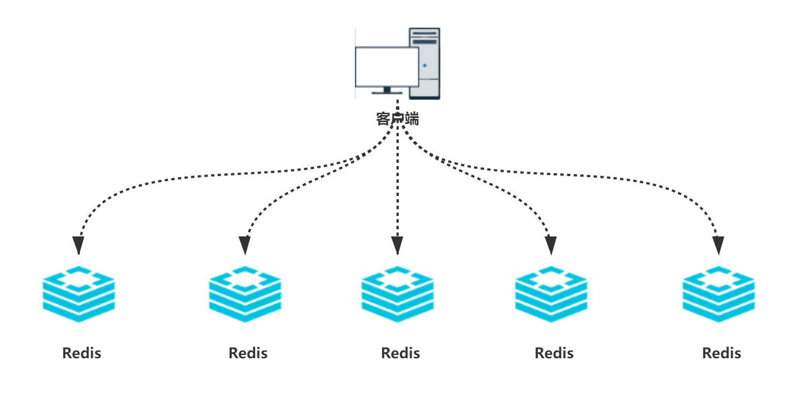
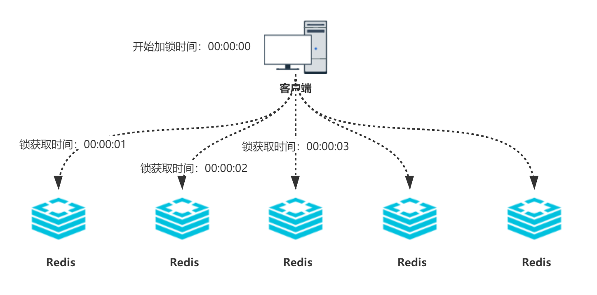
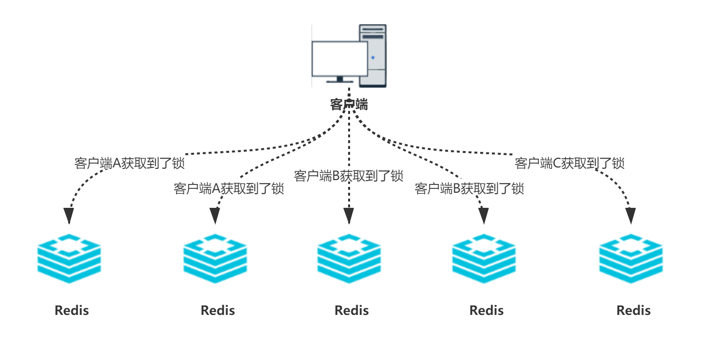

# 面试官：说一下红锁 RedLock 的实现原理

### 概述
Redlock 是 Redis 创始人提出的一种分布式锁算法，主要用于解决分布式环境下多个客户端对同一共享资源并发访问时的一致性与可靠性问题。

相比传统的单节点 Redis 锁机制，Redlock 通过**多个独立 Redis 节点协作**，有效提升了锁的容错能力和安全性，被广泛讨论并应用于对高可用分布式锁有需求的系统中。

---

### 实现原理

#### 部署要求
+ 至少部署 N 个相互独立、分布在不同物理服务器上的 Redis 主实例（官方建议 N=5）。
+ 每个节点必须彼此独立，不能用主从节点或单机多实例混用，以降低单点故障的影响。
+ 各节点时钟尽量同步以减少偏移带来的不确定性。

#### 加锁流程
为了**获取锁，客户端执行以下操作**：

    1. **记录时间：**  
客户端先记录下当前的毫秒时间（比如 `start_time`），用来计算整个加锁过程的耗时。
    2. **尝试加锁：**  
客户端依次（其实可以并行，为简化描述暂且理解为依次）向所有 N 个独立 Redis 实例，使用相同的“key”和唯一的随机“value”（一般为 UUID）尝试加锁，且每个锁的有效期都一致，比如 10 秒。
    3. **每个实例设置锁时要有很短的超时时间：**  
为了防止某个 Redis 节点不可用时长时间卡住，客户端对每次请求 Redis 的“SET NX”操作都设置一个较短的超时时间（例如 10-50 毫秒），远小于锁的有效期。（网络不好，或某个 Redis 实例宕机、卡顿，客户端**不会无限等待** Redis 的响应。如果超过这个超时时间还没响应，就直接放弃这个节点，继续尝试下一个节点，以保证获取锁的整体流程足够迅速。）
    4. **判断加锁是否成功：**  
统计在 N 个实例里，有多少个成功加锁。如果**在大多数实例（N/2+1）里都加锁成功**，并且**从第一步记录的时间到现在的总耗时，仍然小于锁的有效期**，那么认为加锁成功。(**总耗时:**从客户端开始第一个加锁请求（即记录下时间点），到最后一个节点返回响应（无论是否成功）、整个加锁流程结束，这段时间的总和)
    5. **锁的有效期说明：**  
加锁成功后，这把锁在每个节点的有效期都是一开始设置的有效时间（比如 10 秒），**不是“有效期-加锁耗时”**。但客户端要注意，自己实际可用的锁时间会减少加锁已耗费的这部分时间，所以需要预留足够的业务处理时间。
    6. **加锁失败的处理：**  
如果没有在大多数实例抢到锁，或者加锁太慢导致剩余可用锁时间明显不足，客户端应该立即向所有实例发送解锁（释放锁）操作，无论这些实例是否加锁成功，这样可以减少“脏锁”残留。
    7. **重试：**

同时向所有的Redis服务器，发送`**SET key value EX senconds NX**`命令，当所有服务器都返回结果后，判断是否以达成“锁获取成功的两个条件”，如果达成了，则锁获取成功。如果没有，则立即将已获取的锁释放掉，并

等待一小段时间，重复以上步骤（一般会尝试3次）。如果这期间仍未达成“锁获取成功的两个条件”，则认为锁获取失败。

#### 解锁流程
+ 客户端使用最初生成的唯一随机值，向所有节点发送解锁指令，只有锁的 value 匹配才会删除 key，确保其他客户端不会误删。
+ 理想情况下，大多数节点都需成功解锁，但实际应容忍部分解锁失败（网络分区或节点宕机），保证整体一致性。

#### 时间与错误控制
+ 要求本地时钟较为准确，避免因时钟漂移导致锁误判（如提前失效或被重复获取）。
+ 加锁失败或超时后，应采用指数退避或随机延迟重试，以减少并发竞争中的冲突和“脑裂”风险。
+ 对锁定、续约、释放等各流程需有健壮的异常处理，降低分布式环境不稳定带来的不一致。

---

### 注意事项与局限性
+ **时钟依赖**：Redlock 依赖节点本地时间，若各节点时钟差异较大，锁的可靠性降低。
+ **网络延迟和分区**：网络抖动、延迟、分区等容易导致锁“伪失效”或“多客户端同时持有锁”，影响一致性。
+ **实现复杂**：Redlock 涉及多节点同步及状态维护，较单节点锁实现和维护复杂，成本较高。
+ **适用范围有限**：Redlock 并非强一致性分布式锁，不能杜绝所有一致性问题。在对于高可靠性、高并发、强一致性要求极高的业务场景下仍需谨慎评估，比如推荐结合 ZooKeeper 等 CP 强一致性方案。
+ **锁的自动续约与释放**：必须设计完善的续约和释放机制，防止死锁和锁遗留。

---

### 适用场景
+ 高性能、高可用场景，对锁容错和可用性有较高要求，但业务能容忍极小概率短时间内不一致。
+ 典型如分布式ID生成、并发资源调度、任务调度等。
+ 对于金融级、电商订单等强一致性业务，建议采用 ZooKeeper 等更为严格的分布式锁方案。

> 更新: 2025-05-23 20:20:04  
> 原文: <https://www.yuque.com/tulingzhouyu/db22bv/qw8x7dd695ocvyyr>